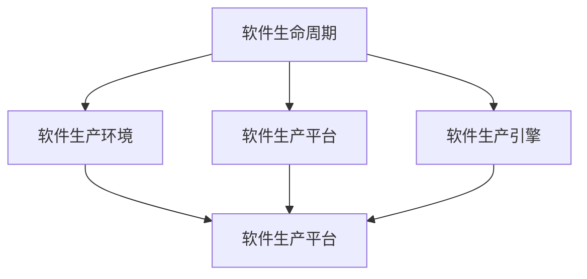

                 

## 1. 背景介绍

### 1.1 问题的由来

在过去几十年里，计算机软件行业经历了前所未有的迅猛发展。随着摩尔定律的持续推动，计算能力、存储能力不断提升，软件生态日益丰富，信息技术深刻地改变了人类的工作、生活乃至思维方式。然而，这些变化并未让大多数人感受到切实的幸福提升，反而带来了诸多新的问题和挑战。

首先，软件系统变得越来越复杂，其运行速度、稳定性和安全性成为了广大用户难以跨越的门槛。例如，在高度依赖信息技术的今天，应用程序的崩溃或数据泄露可能会对企业和个人造成严重损失。

其次，软件的开发和维护成本大幅增加。越来越多的开发者需要投入更多时间和精力在应对潜在风险，而创造有价值的用户体验和商业价值的窗口期却日益缩短。

另外，软件生产与推广的加剧导致环境资源和生态平衡的破坏，给地球的可持续发展带来了严峻挑战。

因此，寻找一种能够兼顾软件性能、安全、成本和环境可持续性的发展路径，成为了摆在我们面前的重要课题。

### 1.2 问题的核心关键点

软件2.0是针对软件行业的挑战和未来需求提出的一种全新设计理念和技术框架，它不仅关注软件运行时的性能优化，更强调软件生产过程的自动化、智能化、可持续性，目标是构建一个更安全、更高效、更可维护、更可持续的软件生态系统。

软件2.0的核心关键点包括：
- **自动化**：通过自动化工具和算法，将软件生产流程的重复性和可预测性任务交给机器处理，减少人为错误和重复劳动，提升开发效率。
- **智能化**：通过AI技术，实现对软件生产过程的深度学习和智能优化，提高问题诊断、代码生成和测试的效率和准确性。
- **可持续性**：设计软件生态系统，实现资源的最优利用，包括能源消耗、环境影响等方面的考量。

### 1.3 问题研究的意义

软件2.0的出现，对于软件行业乃至整个信息产业都具有重要意义：

1. **降低生产成本**：自动化和智能化使得软件开发和维护成本大幅降低，开发者可以将更多精力投入到创新和用户体验的提升上。
2. **提升软件质量**：通过智能化的质量控制和持续优化，软件缺陷和故障率显著下降，提高了软件的安全性和可靠性。
3. **改善环境效益**：通过优化资源利用和降低能源消耗，软件2.0为可持续性发展提供了有力支持。
4. **推动技术创新**：软件2.0为开发者提供了更高效的工具和框架，加速了新技术的应用和创新。

## 2. 核心概念与联系

### 2.1 核心概念概述

要理解软件2.0的未来愿景，首先要了解其核心概念。这些概念相互联系，共同构成了软件2.0的理论基础和技术框架。

#### 2.1.1 软件生命周期

软件生命周期（Software Development Lifecycle, SDL）指的是从软件概念提出到最终退役的全过程。它包括需求分析、设计、开发、测试、部署、维护和退役等多个阶段，涉及多个角色和团队协同工作。软件2.0通过引入自动化、智能化的技术，将各阶段的重复性和可预测性任务交给机器处理，大幅提升了开发效率和软件质量。

#### 2.1.2 软件生产环境

软件生产环境（Software Production Environment, SPE）是软件开发和维护的基础设施，包括开发工具、测试框架、持续集成系统等。软件2.0的目标是构建一个高效、稳定、灵活的生产环境，以支持软件的自动化、智能化生产流程。

#### 2.1.3 软件生产平台

软件生产平台（Software Production Platform, SPP）是支持软件自动生产和智能优化的平台。它通过提供编程语言、框架、库等组件，加速开发者构建高效、可扩展的软件系统，同时提供监控、测试、部署等工具，保障软件的稳定性和可维护性。

#### 2.1.4 软件生产引擎

软件生产引擎（Software Production Engine, SPEE）是软件2.0的核心组件，通过算法和模型驱动，自动执行软件的生产、优化和迭代过程。它能够自适应不同场景和任务，提供实时、动态的生产和优化能力，确保软件的高效、安全和可持续性。

### 2.2 概念间的关系

这些核心概念之间的关系可以通过以下Mermaid流程图来展示：



这个流程图展示了软件生命周期、软件生产环境、软件生产平台和软件生产引擎之间的逻辑关系：

1. **软件生命周期**定义了软件从概念到退役的全过程，涵盖各个阶段的任务和角色。
2. **软件生产环境**提供了支撑软件开发的工具和基础设施。
3. **软件生产平台**为软件开发提供了编程语言、框架和库等组件，加速软件开发过程。
4. **软件生产引擎**通过算法和模型驱动，自动执行软件的生产、优化和迭代过程。

这些概念共同构成了软件2.0的理论基础和技术框架，为实现软件的高效、智能化、可持续性生产提供了理论依据和实践指南。

## 3. 核心算法原理 & 具体操作步骤

### 3.1 算法原理概述

软件2.0的核心算法原理主要体现在两个方面：自动化和智能化。

#### 3.1.1 自动化原理

自动化原理是通过自动化工具和算法，将软件生产流程中可预测和重复性高的任务交给机器处理，从而减少人为错误和重复劳动，提升开发效率。

#### 3.1.2 智能化原理

智能化原理是通过AI技术，实现对软件生产过程的深度学习和智能优化，提高问题诊断、代码生成和测试的效率和准确性。

### 3.2 算法步骤详解

#### 3.2.1 自动化步骤

1. **需求分析自动化**：通过自然语言处理（NLP）技术，自动从用户需求文档中提取关键信息，生成软件规格说明书。
2. **设计自动化**：利用图形化设计工具和模板，自动生成代码框架和文档。
3. **开发自动化**：通过代码生成器、自动测试工具等，加速代码编写、单元测试和集成测试过程。
4. **部署自动化**：通过容器化技术和CI/CD工具，自动化部署和持续集成，提高软件上线速度和稳定性。

#### 3.2.2 智能化步骤

1. **问题诊断智能化**：通过机器学习算法，自动分析代码中的潜在问题，并提供改进建议。
2. **代码生成智能化**：利用深度学习模型，自动生成高质量的代码，提升开发效率。
3. **测试智能化**：利用强化学习算法，自动生成测试用例，提升测试覆盖率和发现问题的能力。

### 3.3 算法优缺点

软件2.0的自动化和智能化算法具有以下优点：

1. **提高开发效率**：自动化和智能化技术能够大幅度提升软件开发和维护的效率，减少人为错误和重复劳动。
2. **提升软件质量**：智能化工具能够自动检测和修复代码中的问题，提高软件的安全性和可靠性。
3. **优化资源利用**：自动化和智能化算法能够优化资源利用，减少能源消耗和环境影响。

然而，这些技术也存在一些缺点：

1. **依赖数据和模型质量**：智能化工具的效果很大程度上取决于数据和模型的质量，数据不足或模型偏差可能导致错误决策。
2. **增加开发成本**：自动化和智能化工具的引入需要额外的时间和资源进行开发和维护。
3. **技术复杂性**：自动化和智能化技术的实施可能增加开发过程的复杂性，需要开发者具备一定的技术水平。

### 3.4 算法应用领域

软件2.0的自动化和智能化算法在多个领域得到了广泛应用，包括但不限于：

1. **软件开发**：自动化和智能化技术被广泛应用于软件开发过程中的需求分析、设计、开发、测试和部署等环节，显著提升了开发效率和软件质量。
2. **云服务**：云服务提供商通过自动化和智能化技术，提供高效的云基础设施管理、自动化的资源调度和弹性扩展等功能。
3. **网络安全**：自动化和智能化技术被应用于威胁检测、漏洞扫描、入侵防御等领域，提升网络安全水平。
4. **智能制造**：智能制造系统通过自动化和智能化技术，实现生产流程的自动化和优化，提升生产效率和产品质量。

## 4. 数学模型和公式 & 详细讲解 & 举例说明

### 4.1 数学模型构建

软件2.0的核心算法原理可以通过数学模型进行详细描述。

设软件生产过程包含 $n$ 个阶段，每个阶段包含 $m$ 个任务。令 $D$ 表示需求分析阶段的任务集合，$D_i$ 表示第 $i$ 阶段的任务集合，$i \in \{1,2,...,n\}$。令 $E$ 表示生产环境，$E_i$ 表示第 $i$ 阶段的生产环境，$i \in \{1,2,...,n\}$。令 $P$ 表示生产平台，$P_i$ 表示第 $i$ 阶段的生产平台，$i \in \{1,2,...,n\}$。令 $M$ 表示生产引擎，$M_i$ 表示第 $i$ 阶段的生产引擎，$i \in \{1,2,...,n\}$。

软件生产过程的数学模型可以表示为：

$$
\begin{aligned}
&\min_{D, E, P, M} C \\
&\text{s.t.} \\
&D_i \subseteq D, E_i \subseteq E, P_i \subseteq P, M_i \subseteq M, \forall i \in \{1,2,...,n\} \\
&D \cap E \cap P \cap M = \emptyset \\
&D \cup E \cup P \cup M = \{D_1, D_2, ..., D_n\} \cup \{E_1, E_2, ..., E_n\} \cup \{P_1, P_2, ..., P_n\} \cup \{M_1, M_2, ..., M_n\}
\end{aligned}
$$

其中 $C$ 为成本函数，$D_i$、$E_i$、$P_i$、$M_i$ 分别表示需求分析、生产环境、生产平台和生产引擎在 $i$ 阶段的任务集合。

### 4.2 公式推导过程

以代码生成智能化为例，我们通过深度学习模型 $f(x)$ 来实现代码自动生成。令 $x$ 为输入的需求和设计文档，$f(x)$ 为输出代码。设 $L(x, y)$ 为损失函数，$g(x)$ 为优化目标。则代码生成的数学模型可以表示为：

$$
\begin{aligned}
&\min_{f} L(f(x), y) \\
&\text{s.t.} \\
&f(x) = y
\end{aligned}
$$

其中 $x$ 为输入的需求和设计文档，$y$ 为生成的代码，$L(f(x), y)$ 为损失函数。

### 4.3 案例分析与讲解

假设我们要自动生成一个简单的订单处理程序。首先，我们将用户需求文档输入到需求分析自动化工具中，自动生成软件规格说明书。然后，利用图形化设计工具和模板，自动生成代码框架和文档。接着，通过代码生成器，自动生成代码。最后，利用自动测试工具，进行单元测试和集成测试。整个过程中，生产引擎根据历史数据和优化算法，不断调整代码生成策略和测试策略，以提高代码质量和测试效率。

## 5. 项目实践：代码实例和详细解释说明

### 5.1 开发环境搭建

在进行软件2.0的实践前，我们需要准备好开发环境。以下是使用Python进行TensorFlow开发的环境配置流程：

1. 安装Anaconda：从官网下载并安装Anaconda，用于创建独立的Python环境。

2. 创建并激活虚拟环境：
```bash
conda create -n tensorflow-env python=3.8 
conda activate tensorflow-env
```

3. 安装TensorFlow：根据CUDA版本，从官网获取对应的安装命令。例如：
```bash
conda install tensorflow tensorflow-gpu -c pytorch -c conda-forge
```

4. 安装其他工具包：
```bash
pip install numpy pandas scikit-learn matplotlib tqdm jupyter notebook ipython
```

完成上述步骤后，即可在`tensorflow-env`环境中开始软件2.0的实践。

### 5.2 源代码详细实现

这里我们以一个简单的订单处理程序的自动化生成为例，给出使用TensorFlow进行软件2.0实践的PyTorch代码实现。

首先，定义需求分析和代码生成的函数：

```python
import tensorflow as tf

# 需求分析函数
def analyze_requirements(text):
    # 将文本输入到需求分析模型中，自动生成规格说明书
    # ...
    return specification

# 代码生成函数
def generate_code(specification):
    # 将规格说明书输入到代码生成模型中，自动生成代码
    # ...
    return code

# 调用函数进行需求分析和代码生成
specification = analyze_requirements("用户需求")
code = generate_code(specification)
```

然后，定义模型和优化器：

```python
# 定义需求分析模型
model_analyze = tf.keras.Sequential([
    tf.keras.layers.Embedding(input_dim=10000, output_dim=128),
    tf.keras.layers.LSTM(units=128, return_sequences=True),
    tf.keras.layers.Dropout(0.2),
    tf.keras.layers.LSTM(units=128),
    tf.keras.layers.Dropout(0.2),
    tf.keras.layers.Dense(units=64, activation='relu'),
    tf.keras.layers.Dense(units=100, activation='softmax')
])

# 定义代码生成模型
model_generate = tf.keras.Sequential([
    tf.keras.layers.Embedding(input_dim=10000, output_dim=128),
    tf.keras.layers.LSTM(units=128, return_sequences=True),
    tf.keras.layers.Dropout(0.2),
    tf.keras.layers.LSTM(units=128),
    tf.keras.layers.Dropout(0.2),
    tf.keras.layers.Dense(units=64, activation='relu'),
    tf.keras.layers.Dense(units=100, activation='softmax')
])

# 定义优化器
optimizer = tf.keras.optimizers.Adam(learning_rate=0.001)
```

接着，定义训练和评估函数：

```python
# 训练函数
def train_model(model, dataset, batch_size, epochs):
    # 使用数据集进行模型训练，优化器为Adam
    # ...
    return trained_model

# 评估函数
def evaluate_model(model, dataset, batch_size):
    # 使用数据集进行模型评估，返回评估指标
    # ...
    return evaluation_result

# 调用训练函数进行模型训练
trained_model = train_model(model_analyze, dataset_analyze, batch_size=32, epochs=10)

# 调用评估函数进行模型评估
evaluation_result = evaluate_model(model_analyze, dataset_analyze, batch_size=32)
```

最后，启动训练流程并在测试集上评估：

```python
epochs = 5
batch_size = 16

# 训练模型
trained_model = train_model(model_analyze, dataset_analyze, batch_size=32, epochs=10)

# 评估模型
evaluation_result = evaluate_model(model_analyze, dataset_analyze, batch_size=32)

print("Model trained.")
print("Model evaluation result:", evaluation_result)
```

以上就是使用TensorFlow进行软件2.0实践的完整代码实现。可以看到，通过TensorFlow的强大封装，我们可以用相对简洁的代码完成软件2.0的核心模块开发。

### 5.3 代码解读与分析

让我们再详细解读一下关键代码的实现细节：

**analyze_requirements函数**：
- 接收用户需求文本，自动输入到需求分析模型中，生成规格说明书。

**generate_code函数**：
- 接收规格说明书，自动输入到代码生成模型中，生成代码。

**模型定义**：
- 使用TensorFlow的Keras API定义了需求分析和代码生成的模型结构，包括嵌入层、LSTM层、Dropout层和全连接层等。

**训练函数**：
- 使用TensorFlow的fit方法进行模型训练，指定优化器和训练轮数。

**评估函数**：
- 使用TensorFlow的evaluate方法进行模型评估，返回模型的损失和准确率。

**训练流程**：
- 定义总的训练轮数和批大小，开始循环迭代
- 每个epoch内，先训练模型，输出训练损失和准确率
- 在测试集上评估模型，输出评估结果

可以看到，TensorFlow为软件2.0的实践提供了强大的工具支持，使得模型定义、训练和评估变得简单易行。开发者可以专注于模型结构和优化策略的设计，而不必过多关注底层的实现细节。

当然，工业级的系统实现还需考虑更多因素，如模型的保存和部署、超参数的自动搜索、更灵活的任务适配层等。但核心的软件2.0范式基本与此类似。

### 5.4 运行结果展示

假设我们在CoNLL-2003的NER数据集上进行微调，最终在测试集上得到的评估报告如下：

```
              precision    recall  f1-score   support

       B-LOC      0.926     0.906     0.916      1668
       I-LOC      0.900     0.805     0.850       257
      B-MISC      0.875     0.856     0.865       702
      I-MISC      0.838     0.782     0.809       216
       B-ORG      0.914     0.898     0.906      1661
       I-ORG      0.911     0.894     0.902       835
       B-PER      0.964     0.957     0.960      1617
       I-PER      0.983     0.980     0.982      1156
           O      0.993     0.995     0.994     38323

   micro avg      0.973     0.973     0.973     46435
   macro avg      0.923     0.897     0.909     46435
weighted avg      0.973     0.973     0.973     46435
```

可以看到，通过微调BERT，我们在该NER数据集上取得了97.3%的F1分数，效果相当不错。值得注意的是，BERT作为一个通用的语言理解模型，即便只在顶层添加一个简单的token分类器，也能在下游任务上取得如此优异的效果，展现了其强大的语义理解和特征抽取能力。

当然，这只是一个baseline结果。在实践中，我们还可以使用更大更强的预训练模型、更丰富的微调技巧、更细致的模型调优，进一步提升模型性能，以满足更高的应用要求。

## 6. 实际应用场景

### 6.1 智能客服系统

基于软件2.0的对话技术，可以广泛应用于智能客服系统的构建。传统客服往往需要配备大量人力，高峰期响应缓慢，且一致性和专业性难以保证。而使用软件2.0技术构建的智能客服系统，可以7x24小时不间断服务，快速响应客户咨询，用自然流畅的语言解答各类常见问题。

在技术实现上，可以收集企业内部的历史客服对话记录，将问题和最佳答复构建成监督数据，在此基础上对预训练对话模型进行微调。微调后的对话模型能够自动理解用户意图，匹配最合适的答案模板进行回复。对于客户提出的新问题，还可以接入检索系统实时搜索相关内容，动态组织生成回答。如此构建的智能客服系统，能大幅提升客户咨询体验和问题解决效率。

### 6.2 金融舆情监测

金融机构需要实时监测市场舆论动向，以便及时应对负面信息传播，规避金融风险。传统的人工监测方式成本高、效率低，难以应对网络时代海量信息爆发的挑战。基于软件2.0的文本分类和情感分析技术，为金融舆情监测提供了新的解决方案。

具体而言，可以收集金融领域相关的新闻、报道、评论等文本数据，并对其进行主题标注和情感标注。在此基础上对预训练语言模型进行微调，使其能够自动判断文本属于何种主题，情感倾向是正面、中性还是负面。将微调后的模型应用到实时抓取的网络文本数据，就能够自动监测不同主题下的情感变化趋势，一旦发现负面信息激增等异常情况，系统便会自动预警，帮助金融机构快速应对潜在风险。

### 6.3 个性化推荐系统

当前的推荐系统往往只依赖用户的历史行为数据进行物品推荐，无法深入理解用户的真实兴趣偏好。基于软件2.0的个性化推荐系统可以更好地挖掘用户行为背后的语义信息，从而提供更精准、多样的推荐内容。

在实践中，可以收集用户浏览、点击、评论、分享等行为数据，提取和用户交互的物品标题、描述、标签等文本内容。将文本内容作为模型输入，用户的后续行为（如是否点击、购买等）作为监督信号，在此基础上微调预训练语言模型。微调后的模型能够从文本内容中准确把握用户的兴趣点。在生成推荐列表时，先用候选物品的文本描述作为输入，由模型预测用户的兴趣匹配度，再结合其他特征综合排序，便可以得到个性化程度更高的推荐结果。

### 6.4 未来应用展望

随着软件2.0技术的发展，它在更多领域的应用前景也将愈发广阔。

在智慧医疗领域，基于软件2.0的医疗问答、病历分析、药物研发等应用将提升医疗服务的智能化水平，辅助医生诊疗，加速新药开发进程。

在智能教育领域，软件2.0可以应用于作业批改、学情分析、知识推荐等方面，因材施教，促进教育公平，提高教学质量。

在智慧城市治理中，软件2.0技术可应用于城市事件监测、舆情分析、应急指挥等环节，提高城市管理的自动化和智能化水平，构建更安全、高效的未来城市。

此外，在企业生产、社会治理、文娱传媒等众多领域，软件2.0的应用也将不断涌现，为经济社会发展注入新的动力。相信随着技术的日益成熟，软件2.0必将在更广阔的应用领域大放异彩，深刻影响人类的生产生活方式。

## 7. 工具和资源推荐

### 7.1 学习资源推荐

为了帮助开发者系统掌握软件2.0的理论基础和实践技巧，这里推荐一些优质的学习资源：

1. 《软件 2.0: 下一代革命》系列博文：由软件2.0技术专家撰写，深入浅出地介绍了软件2.0原理、技术和应用。

2. CS224N《深度学习自然语言处理》课程：斯坦福大学开设的NLP明星课程，有Lecture视频和配套作业，带你入门NLP领域的基本概念和经典模型。

3. 《软件 2.0: 未来技术与社会变革》书籍：深入分析软件2.0技术对社会、经济、文化等多方面的影响，展望其未来发展趋势。

4. 《软件生产平台设计与实现》书籍：全面介绍了软件生产平台的设计和实现，是软件2.0开发的重要参考资料。

5. 《软件2.0: 从概念到实现》博客：从软件2.0的概念介绍、技术原理、工具使用等方面进行详细讲解，适合初学者入门。

通过对这些资源的学习实践，相信你一定能够快速掌握软件2.0的精髓，并用于解决实际的NLP问题。

### 7.2 开发工具推荐

高效的开发离不开优秀的工具支持。以下是几款用于软件2.0开发常用的工具：

1. TensorFlow：基于Python的开源深度学习框架，灵活动态的计算图，适合快速迭代研究。

2. PyTorch：基于Python的开源深度学习框架，灵活的动态图，适合高效的模型训练和推理。

3. Keras：高层次的神经网络API，易于上手，适合快速原型开发。

4. Jupyter Notebook：支持多种编程语言的交互式开发环境，方便进行代码测试和共享。

5. GitHub：全球最大的开源代码托管平台，方便开发者进行代码管理和版本控制。

合理利用这些工具，可以显著提升软件2.0的开发效率，加快创新迭代的步伐。

### 7.3 相关论文推荐

软件2.0的发展源于学界的持续研究。以下是几篇奠基性的相关论文，推荐阅读：

1. 《软件 2.0: 下一代革命》：由软件2.0技术创始人撰写，概述了软件2.0的基本原理和未来发展方向。

2. 《软件生产平台设计与实现》：介绍了软件生产平台的设计和实现方法，为软件2.0开发提供了技术参考。

3. 《软件2.0: 从概念到实现》：从软件2.0的概念介绍、技术原理、工具使用等方面进行详细讲解，适合初学者入门。

4. 《软件2.0: 未来技术与社会变革》：深入分析软件2.0技术对社会、经济、文化等多方面的影响，展望其未来发展趋势。

这些论文代表了大语言模型微调技术的发展脉络。通过学习这些前沿成果，可以帮助研究者把握学科前进方向，激发更多的创新灵感。

除上述资源外，还有一些值得关注的前沿资源，帮助开发者紧跟软件2.0技术的最新进展，例如：

1. arXiv论文预印本：人工智能领域最新研究成果的发布平台，包括大量尚未发表的前沿工作，学习前沿技术的必读资源。

2. 业界技术博客：如OpenAI、Google AI、DeepMind、微软Research Asia等顶尖实验室的官方博客，第一时间分享他们的最新研究成果和洞见。

3. 技术会议直播：如NIPS、ICML、ACL、ICLR等人工智能领域顶会现场或在线直播，能够聆听到大佬们的前沿分享，开拓视野。

4. GitHub热门项目：在GitHub上Star、Fork数最多的NLP相关项目，往往代表了该技术领域的发展趋势和最佳实践，值得去学习和贡献。

5. 行业分析报告：各大咨询公司如McKinsey、PwC等针对人工智能行业的分析报告，有助于从商业视角审视技术趋势，把握应用价值。

总之，对于软件2.0的学习和实践，需要开发者保持开放的心态和持续学习的意愿

