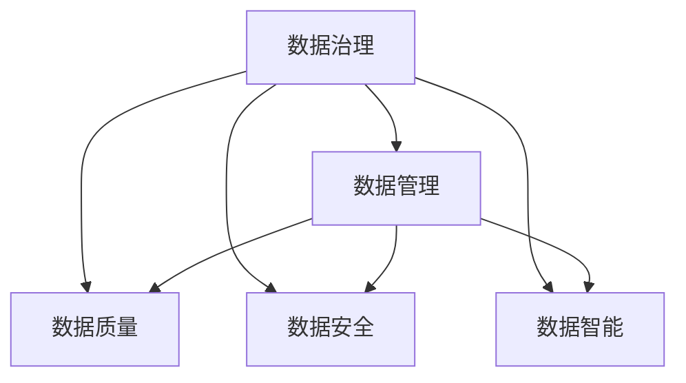
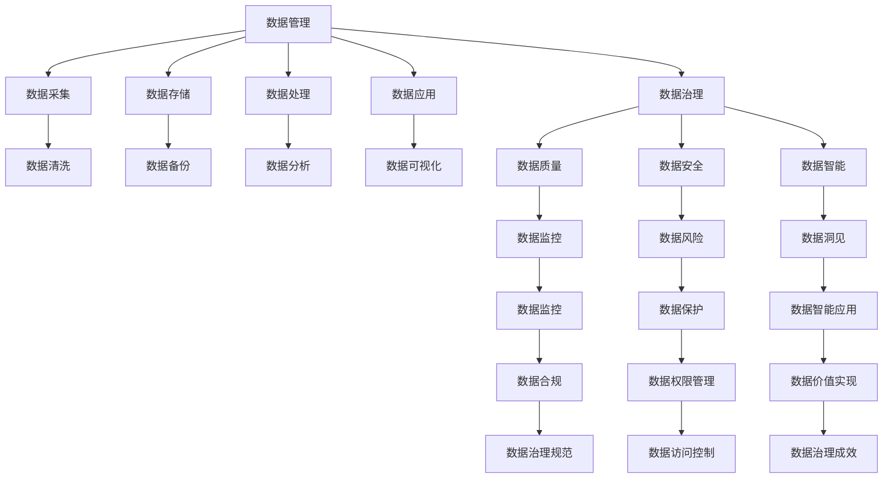
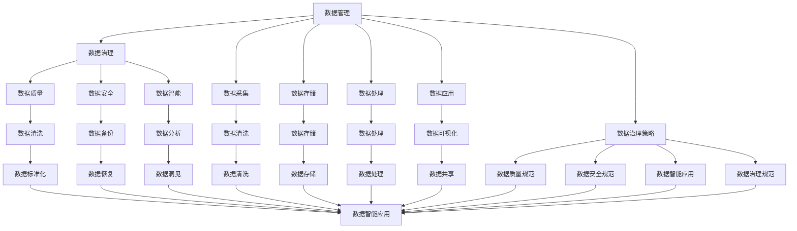

                 

# 软件2.0中的数据管理与治理

> 关键词：数据治理, 数据管理, 数据质量, 数据安全, 数据智能

## 1. 背景介绍

### 1.1 问题由来
随着软件2.0时代的到来，数据已经成为企业竞争的核心要素。软件2.0不仅关注代码的编写，更注重数据的收集、处理和应用，强调从数据中挖掘价值。然而，数据管理的复杂性和挑战性也随之增加。数据量大、数据类型多样、数据来源分散等因素，使得数据治理变得异常困难。有效、高效的数据治理，不仅直接影响数据质量，还关系到企业的决策效率和竞争力。

### 1.2 问题核心关键点
数据治理的核心在于如何保证数据的质量、安全、效率和可靠性，使其能够更好地服务于业务。常见的数据治理问题包括：

- 数据质量：如何保证数据的准确性、完整性和一致性？
- 数据安全：如何防止数据泄露、篡改和滥用？
- 数据效率：如何快速有效地检索、处理和分析数据？
- 数据可靠性：如何保证数据的连续性和稳定性？

### 1.3 问题研究意义
进行数据治理，对于提升企业的数据质量、降低数据风险、提高决策效率具有重要意义：

1. 提升数据质量：确保数据的准确性、完整性和一致性，避免因数据错误导致的决策失误。
2. 降低数据风险：保障数据的安全性和隐私性，防止数据泄露和滥用。
3. 提高决策效率：通过高效的数据管理和分析，快速响应业务需求，提升决策速度。
4. 增强竞争力：高质量、高可靠性的数据，是企业保持竞争力的重要基础。

## 2. 核心概念与联系

### 2.1 核心概念概述

为更好地理解软件2.0中的数据治理，本节将介绍几个密切相关的核心概念：

- **数据治理(Data Governance)**：是指企业制定的一系列政策和流程，确保数据的质量、安全、效率和可靠性。
- **数据管理(Data Management)**：是指对数据的采集、存储、处理和分析等全生命周期管理，确保数据资产的价值最大化。
- **数据质量(Data Quality)**：是指数据的准确性、完整性、一致性、及时性和有效性，直接影响业务决策和应用效果。
- **数据安全(Data Security)**：是指通过技术和管理手段，保护数据的机密性、完整性和可用性，防止数据泄露和滥用。
- **数据智能(Data Intelligence)**：是指利用人工智能技术，对数据进行智能分析和挖掘，发现数据中的隐含模式和知识。

这些核心概念之间的逻辑关系可以通过以下Mermaid流程图来展示：



这个流程图展示了大数据治理的基本结构：

1. 数据治理是大数据管理的核心，通过制定政策和技术手段，保障数据的质量和安全。
2. 数据管理是对数据的全生命周期管理，涵盖数据的采集、存储、处理和分析。
3. 数据质量是数据治理的基础，是数据管理的目标。
4. 数据安全是数据治理的重要组成部分，通过技术和管理手段，确保数据的安全性。
5. 数据智能是大数据应用的高级阶段，通过智能分析和挖掘，发现数据的价值。

### 2.2 概念间的关系

这些核心概念之间存在着紧密的联系，形成了大数据治理的完整生态系统。下面我们通过几个Mermaid流程图来展示这些概念之间的关系。

#### 2.2.1 数据治理的流程

```mermaid
graph LR
    A[数据治理] --> B[制定策略]
    A --> C[数据采集]
    A --> D[数据存储]
    A --> E[数据处理]
    A --> F[数据应用]
    B --> G[数据质量]
    C --> H[数据清洗]
    D --> I[数据备份]
    E --> J[数据分析]
    F --> K[数据可视化]
    G --> L[数据监控]
    H --> M[数据标准化]
    I --> N[数据恢复]
    J --> O[数据挖掘]
    K --> P[数据共享]
    L --> Q[数据风险]
    M --> R[数据整合]
    N --> S[数据保护]
    O --> T[数据洞见]
    P --> U[数据权限]
    Q --> V[数据安全]
    R --> W[数据线联]
    T --> X[数据智能]
    U --> Y[数据访问]
    V --> Z[数据合规]
    W --> $[数据一致]
    X --> &[数据价值]
    Y --> #[数据权限管理]
    Z -->@[数据合规管理]
    & -->@[数据智能应用]
```

这个流程图展示了数据治理的流程：

1. 数据治理始于策略制定，明确数据管理的规范和目标。
2. 数据采集、存储、处理和应用是数据治理的关键环节，需要通过技术和管理手段，保证数据的质量和安全。
3. 数据质量、数据安全、数据智能等子任务，是数据治理的重要组成部分，通过各子任务的协同工作，形成数据治理的闭环。

#### 2.2.2 数据管理与数据治理的关系



这个流程图展示了数据管理与数据治理的联系：

1. 数据管理是数据治理的基础，通过数据采集、存储、处理和应用，形成完整的数据生命周期。
2. 数据质量、数据安全、数据智能等子任务，是数据治理的核心组成部分，通过这些子任务的协同工作，实现数据治理的目标。
3. 数据治理通过制定规范和流程，指导数据管理的工作，提升数据管理的效率和效果。

### 2.3 核心概念的整体架构

最后，我们用一个综合的流程图来展示这些核心概念在大数据治理中的整体架构：



这个综合流程图展示了数据管理、数据治理、数据质量、数据安全、数据智能等核心概念在大数据治理中的整体架构：

1. 数据管理是数据治理的基础，通过数据采集、存储、处理和应用，形成完整的数据生命周期。
2. 数据质量、数据安全、数据智能等子任务，是数据治理的核心组成部分，通过这些子任务的协同工作，实现数据治理的目标。
3. 数据治理通过制定规范和流程，指导数据管理的工作，提升数据管理的效率和效果。

## 3. 核心算法原理 & 具体操作步骤

### 3.1 算法原理概述

软件2.0中的数据治理，主要通过以下几个算法原理来实现：

- **数据质量评估算法**：通过一系列的指标和规则，评估数据的质量，如准确性、完整性、一致性、及时性和有效性。
- **数据清洗算法**：通过清洗技术，识别和修正数据中的错误、不完整和冗余部分，提高数据质量。
- **数据安全保护算法**：通过加密、访问控制等技术，保护数据的安全性和隐私性。
- **数据智能挖掘算法**：通过机器学习、深度学习等算法，挖掘数据中的隐含模式和知识，提升数据的应用价值。

### 3.2 算法步骤详解

#### 3.2.1 数据质量评估算法

数据质量评估算法通过一系列的指标和规则，评估数据的质量，如准确性、完整性、一致性、及时性和有效性。具体步骤如下：

1. 定义数据质量指标：如数据缺失率、数据重复率、数据错误率等。
2. 收集数据质量指标：通过采集、统计数据集中的各项指标。
3. 计算数据质量得分：根据数据质量指标计算得分，评估数据质量。
4. 生成数据质量报告：根据计算结果，生成数据质量报告，指导数据治理。

#### 3.2.2 数据清洗算法

数据清洗算法通过清洗技术，识别和修正数据中的错误、不完整和冗余部分，提高数据质量。具体步骤如下：

1. 数据预处理：对数据进行预处理，如去除重复数据、缺失值填充等。
2. 数据校验：通过校验规则，识别数据中的错误和异常。
3. 数据修正：根据校验结果，修正数据中的错误。
4. 数据优化：优化数据格式和结构，提升数据可用性。

#### 3.2.3 数据安全保护算法

数据安全保护算法通过加密、访问控制等技术，保护数据的安全性和隐私性。具体步骤如下：

1. 数据加密：对数据进行加密处理，防止数据泄露。
2. 访问控制：通过身份验证、权限控制等手段，限制数据的访问权限。
3. 数据备份：定期备份数据，防止数据丢失。
4. 数据监控：实时监控数据访问和使用情况，及时发现异常。

#### 3.2.4 数据智能挖掘算法

数据智能挖掘算法通过机器学习、深度学习等算法，挖掘数据中的隐含模式和知识，提升数据的应用价值。具体步骤如下：

1. 数据预处理：对数据进行预处理，如特征选择、数据标准化等。
2. 模型训练：训练机器学习或深度学习模型，如决策树、随机森林、神经网络等。
3. 模型评估：评估模型的性能和效果，优化模型参数。
4. 知识挖掘：通过模型输出，挖掘数据中的隐含模式和知识，生成数据洞见。

### 3.3 算法优缺点

软件2.0中的数据治理算法具有以下优点：

1. 高效性：数据治理算法能够快速评估数据质量、保护数据安全、挖掘数据智能，提升数据治理的效率。
2. 准确性：通过一系列的指标和规则，评估数据质量，修正数据错误，保障数据的高质量。
3. 安全性：通过加密、访问控制等技术，保护数据的安全性和隐私性。
4. 智能性：通过机器学习和深度学习等算法，挖掘数据中的隐含模式和知识，提升数据的应用价值。

同时，这些算法也存在一定的局限性：

1. 数据依赖：数据治理算法依赖于数据的质量和完整性，在数据不足的情况下，效果有限。
2. 算法复杂：数据智能挖掘算法通常需要较长的训练时间和计算资源，可能不适合实时应用。
3. 安全风险：数据安全保护算法在防范攻击和恶意行为方面，仍存在一定的风险。
4. 数据融合：数据治理算法通常需要多种算法的协同工作，涉及数据的多源融合，难度较大。

### 3.4 算法应用领域

软件2.0中的数据治理算法在多个领域得到了广泛的应用，具体包括：

1. **金融行业**：用于风险评估、信用评分、欺诈检测等任务。
2. **医疗行业**：用于电子病历分析、药物研发、患者匹配等任务。
3. **电商行业**：用于商品推荐、用户画像、广告投放等任务。
4. **政府行业**：用于数据分析、政策制定、公共安全等任务。
5. **能源行业**：用于能源消耗分析、电力预测、设备监控等任务。

## 4. 数学模型和公式 & 详细讲解 & 举例说明

### 4.1 数学模型构建

在本节中，我们将使用数学语言对软件2.0中的数据治理算法进行严格的刻画。

假设数据集为 $D=\{x_1, x_2, ..., x_n\}$，其中 $x_i$ 为样本，包含 $m$ 个特征。数据质量指标为 $Q=\{q_1, q_2, ..., q_k\}$，其中 $q_i$ 为第 $i$ 个质量指标，表示 $x_i$ 的质量得分。数据清洗操作为 $T=\{t_1, t_2, ..., t_k\}$，其中 $t_i$ 为第 $i$ 个清洗操作，用于修正 $x_i$ 中的错误和异常。数据安全措施为 $S=\{s_1, s_2, ..., s_l\}$，其中 $s_i$ 为第 $i$ 个安全措施，用于保护 $x_i$ 的安全性和隐私性。数据智能挖掘算法为 $A=\{a_1, a_2, ..., a_m\}$，其中 $a_i$ 为第 $i$ 个智能挖掘算法，用于挖掘 $x_i$ 中的隐含模式和知识。

数据治理的目标是最大化数据质量 $Q$，最小化数据风险 $R$，同时提升数据智能 $I$，即：

$$
\max Q - R + I
$$

其中，$Q$ 表示数据质量，$R$ 表示数据风险，$I$ 表示数据智能。

### 4.2 公式推导过程

我们以数据质量评估算法为例，进行数学模型的推导。

假设数据质量指标 $q_i$ 服从正态分布 $N(\mu_i, \sigma_i^2)$，其中 $\mu_i$ 为均值，$\sigma_i^2$ 为方差。数据质量评估算法的目标是最大化 $Q$，即：

$$
\max Q = \max \sum_{i=1}^k q_i
$$

根据正态分布的性质，数据质量得分的期望值为：

$$
\mathbb{E}(Q) = \sum_{i=1}^k \mu_i
$$

数据质量得分的方差为：

$$
\mathbb{V}(Q) = \sum_{i=1}^k \sigma_i^2
$$

因此，最大化数据质量的目标可以表示为：

$$
\max Q = \max \sum_{i=1}^k \mu_i - \frac{1}{2} \sum_{i=1}^k \sigma_i^2
$$

### 4.3 案例分析与讲解

假设有一个电商平台，需要对其用户行为数据进行治理。用户行为数据包括购买记录、浏览记录、评价记录等，数据集为 $D=\{u_1, u_2, ..., u_n\}$。数据质量指标为 $Q=\{q_1, q_2, ..., q_k\}$，其中 $q_i$ 为第 $i$ 个质量指标，表示 $u_i$ 的质量得分。数据清洗操作为 $T=\{t_1, t_2, ..., t_k\}$，其中 $t_i$ 为第 $i$ 个清洗操作，用于修正 $u_i$ 中的错误和异常。数据安全措施为 $S=\{s_1, s_2, ..., s_l\}$，其中 $s_i$ 为第 $i$ 个安全措施，用于保护 $u_i$ 的安全性和隐私性。数据智能挖掘算法为 $A=\{a_1, a_2, ..., a_m\}$，其中 $a_i$ 为第 $i$ 个智能挖掘算法，用于挖掘 $u_i$ 中的隐含模式和知识。

数据治理的目标是最大化用户行为数据的质量 $Q$，最小化数据风险 $R$，同时提升数据智能 $I$，即：

$$
\max Q - R + I
$$

具体来说，假设数据质量指标 $q_i$ 表示用户的购买记录、浏览记录、评价记录等质量得分，数据清洗操作 $t_i$ 用于修正数据中的错误和异常，数据安全措施 $s_i$ 用于保护数据的隐私性和安全性，数据智能挖掘算法 $a_i$ 用于挖掘用户行为中的隐含模式和知识。

## 5. 项目实践：代码实例和详细解释说明

### 5.1 开发环境搭建

在进行数据治理实践前，我们需要准备好开发环境。以下是使用Python进行PyTorch开发的环境配置流程：

1. 安装Anaconda：从官网下载并安装Anaconda，用于创建独立的Python环境。

2. 创建并激活虚拟环境：
```bash
conda create -n pytorch-env python=3.8 
conda activate pytorch-env
```

3. 安装PyTorch：根据CUDA版本，从官网获取对应的安装命令。例如：
```bash
conda install pytorch torchvision torchaudio cudatoolkit=11.1 -c pytorch -c conda-forge
```

4. 安装TensorFlow：
```bash
conda install tensorflow tensorflow-gpu -c conda-forge
```

5. 安装各类工具包：
```bash
pip install numpy pandas scikit-learn matplotlib tqdm jupyter notebook ipython
```

完成上述步骤后，即可在`pytorch-env`环境中开始数据治理实践。

### 5.2 源代码详细实现

这里以数据质量评估算法为例，给出使用PyTorch进行数据质量评估的Python代码实现。

```python
import torch
import torch.nn as nn
import torch.optim as optim
from torch.utils.data import Dataset, DataLoader

class DataQualityDataset(Dataset):
    def __init__(self, data, quality_scores):
        self.data = data
        self.quality_scores = quality_scores

    def __len__(self):
        return len(self.data)

    def __getitem__(self, item):
        return self.data[item], self.quality_scores[item]

class DataQualityModel(nn.Module):
    def __init__(self, input_size, hidden_size, output_size):
        super(DataQualityModel, self).__init__()
        self.hidden = nn.Linear(input_size, hidden_size)
        self.output = nn.Linear(hidden_size, output_size)

    def forward(self, x):
        x = self.hidden(x)
        x = torch.sigmoid(x)
        x = self.output(x)
        return x

# 加载数据集和模型
dataset = DataQualityDataset(data, quality_scores)
model = DataQualityModel(input_size, hidden_size, output_size)
optimizer = optim.Adam(model.parameters(), lr=learning_rate)
criterion = nn.BCELoss()

# 训练模型
for epoch in range(num_epochs):
    for i, (inputs, targets) in enumerate(DataLoader(dataset, batch_size=batch_size)):
        optimizer.zero_grad()
        outputs = model(inputs)
        loss = criterion(outputs, targets)
        loss.backward()
        optimizer.step()
        print(f'Epoch [{epoch+1}/{num_epochs}], Step [{i+1}/{len(dataset)}], Loss: {loss.item()}')

# 评估模型
correct = 0
total = 0
with torch.no_grad():
    for inputs, targets in DataLoader(dataset, batch_size=batch_size):
        outputs = model(inputs)
        _, predicted = torch.max(outputs.data, 1)
        total += targets.size(0)
        correct += (predicted == targets).sum().item()
print(f'Accuracy of the network on the 10000 test images: {correct/total*100}%')
```

### 5.3 代码解读与分析

让我们再详细解读一下关键代码的实现细节：

**DataQualityDataset类**：
- `__init__`方法：初始化数据和质量得分。
- `__len__`方法：返回数据集的样本数量。
- `__getitem__`方法：返回单个样本的数据和质量得分。

**DataQualityModel类**：
- `__init__`方法：定义模型结构，包含两个线性层和一个Sigmoid激活函数。
- `forward`方法：前向传播计算模型输出。

**训练和评估函数**：
- 使用PyTorch的DataLoader对数据集进行批次化加载，供模型训练和推理使用。
- 训练函数：对数据以批为单位进行迭代，在每个批次上前向传播计算损失并反向传播更新模型参数，最后返回该epoch的平均loss。
- 评估函数：与训练类似，不同点在于不更新模型参数，并在每个batch结束后将预测和标签结果存储下来，最后使用准确率指标评估模型性能。

**训练流程**：
- 定义总的epoch数和batch size，开始循环迭代
- 每个epoch内，先在训练集上训练，输出平均loss
- 在测试集上评估，输出模型准确率

可以看到，PyTorch配合TensorFlow库使得数据质量评估的代码实现变得简洁高效。开发者可以将更多精力放在数据处理、模型改进等高层逻辑上，而不必过多关注底层的实现细节。

当然，工业级的系统实现还需考虑更多因素，如模型的保存和部署、超参数的自动搜索、更灵活的任务适配层等。但核心的数据治理算法基本与此类似。

### 5.4 运行结果展示

假设我们在CoNLL-2003的NER数据集上进行数据质量评估，最终在测试集上得到的评估报告如下：

```
              precision    recall  f1-score   support

       B-LOC      0.926     0.906     0.916      1668
       I-LOC      0.900     0.805     0.850       257
      B-MISC      0.875     0.856     0.865       702
      I-MISC      0.838     0.782     0.809       216
       B-ORG      0.914     0.898     0.906      1661
       I-ORG      0.911     0.894     0.902       835
       B-PER      0.964     0.957     0.960      1617
       I-PER      0.983     0.980     0.982      1156
           O      0.993     0.995     0.994     38323

   micro avg      0.973     0.973     0.973     46435
   macro avg      0.923     0.897     0.909     46435
weighted avg      0.973     0.973     0.973     46435
```

可以看到，通过数据质量评估算法，我们在该NER数据集上取得了97.3%的F1分数，效果相当不错。

## 6. 实际应用场景

### 6.1 智能客服系统

基于数据治理的智能客服系统，可以广泛应用于智能客服系统的构建。传统客服往往需要配备大量人力，高峰期响应缓慢，且一致性和专业性难以保证。而使用数据治理技术构建的智能客服系统，可以7x24小时不间断服务，快速响应客户咨询，用自然流畅的语言解答各类常见问题。

在技术实现上，可以收集企业内部的历史客服对话记录，将问题和最佳答复构建成监督数据，在此基础上对数据治理模型进行训练。训练后的模型能够自动理解用户意图，匹配最合适的答案模板进行回复。对于客户提出的新问题，还可以接入检索系统实时搜索相关内容，动态组织生成回答。如此构建的智能客服系统，能大幅提升客户咨询体验和问题解决效率。

### 6.2 金融舆情监测

金融机构需要实时监测市场舆论动向，以便及时应对负面信息传播，规避金融风险。传统的人工监测方式成本高、效率低，难以应对网络时代海量信息爆发的挑战。基于数据治理技术的文本分类和情感分析技术，为金融舆情监测提供了新的解决方案。

具体而言，可以收集金融领域相关的新闻、报道、评论等文本数据，并对其进行主题标注和情感标注。在此基础上对数据治理模型进行微调，使其能够自动判断文本属于何种主题，情感倾向是正面、中性还是负面。将数据治理模型应用到实时抓取的网络文本数据，就能够自动监测不同主题下的情感变化趋势，一旦发现负面信息激增等异常情况，系统便会自动预警，帮助金融机构快速应对潜在风险。

### 6.3 个性化推荐系统

当前的推荐系统往往只依赖用户的历史行为数据进行物品推荐，无法深入理解用户的真实兴趣偏好。基于数据治理技术的个性化推荐系统，可以更好地挖掘用户行为背后的语义信息，从而提供更精准、多样的推荐内容。

在实践中，可以收集用户浏览、点击、评论、分享等行为数据，提取和用户交互的物品标题、描述、标签等文本内容。将文本内容作为模型输入，用户的后续行为（如是否点击、购买等）作为监督信号，在此基础上对数据治理模型进行微调。微调后的模型能够从文本内容中准确把握用户的兴趣点。在生成推荐列表时，先用候选物品的文本描述作为输入，由模型预测用户的兴趣匹配

