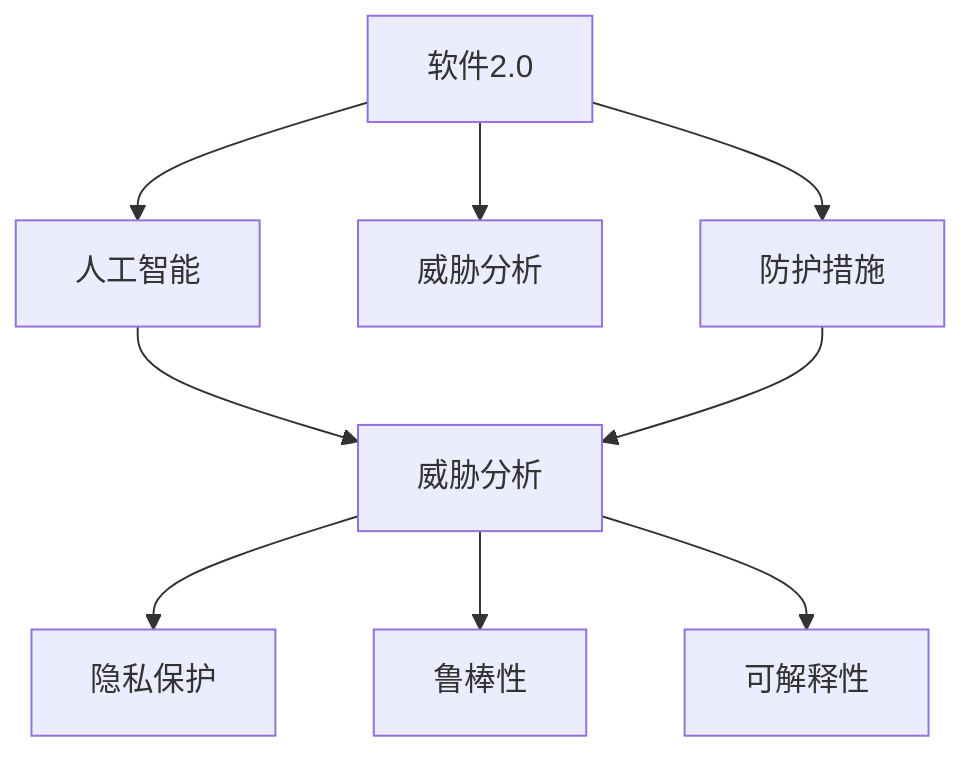
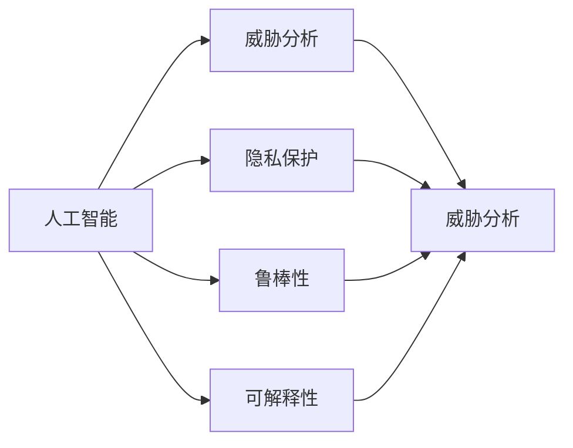
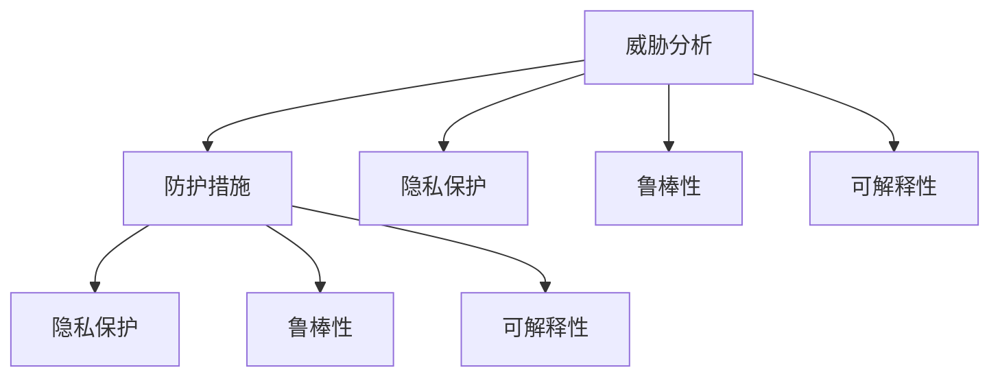
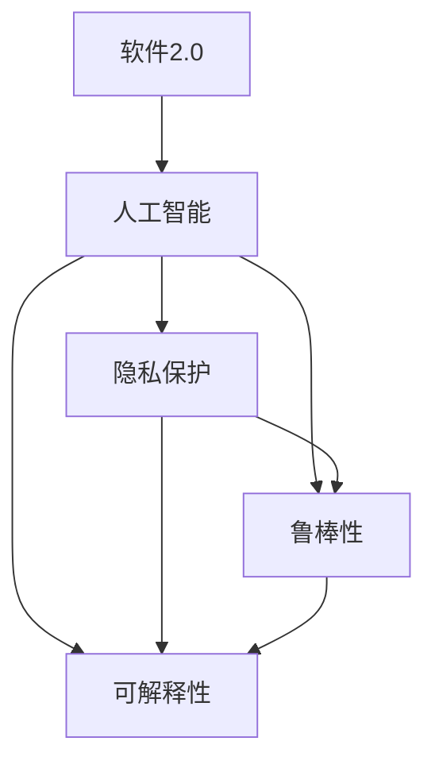
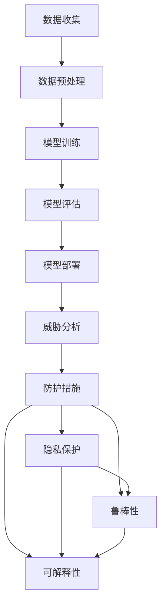

                 

# 软件2.0的安全性挑战与对策

> 关键词：软件2.0, 安全性挑战, 对策, 人工智能, 威胁分析, 防护措施

## 1. 背景介绍

### 1.1 问题由来
随着人工智能(AI)和软件工程技术的不断融合，一种被称为"软件2.0"的新型软件形式正在迅速崛起。软件2.0以其智能化、自动化的特征，在智能分析、自动化部署、智能运维等诸多方面展现出巨大的潜力。然而，软件2.0的复杂性和多样性，也给其安全性带来了新的挑战和问题。

### 1.2 问题核心关键点
软件2.0的安全性问题主要集中在以下几个方面：
- **数据隐私保护**：软件2.0通常涉及大量用户数据，如何保护这些数据的隐私和安全性，是一个重要挑战。
- **系统鲁棒性**：软件2.0中的模型和算法复杂，容易受到对抗样本攻击，影响系统稳定性和可靠性。
- **智能攻击**：攻击者可能利用AI技术，对软件2.0进行有针对性的攻击，如模型篡改、数据注入等。
- **代码复杂性**：软件2.0中的智能组件通常基于复杂的算法和数据处理，代码复杂度高，调试和修复难度大。
- **可解释性不足**：智能模型具有"黑盒"特性，其内部逻辑和决策过程难以解释，增加了安全分析的难度。

### 1.3 问题研究意义
研究软件2.0的安全性问题，对于提升软件2.0系统的安全性和稳定性，保障用户数据隐私，具有重要意义：
1. 防止安全漏洞和攻击，保障系统安全运行。
2. 保护用户隐私数据，避免数据泄露和滥用。
3. 确保系统的鲁棒性和可靠性，避免因攻击导致的系统失效。
4. 增强系统的可解释性和可控性，便于进行安全审计和风险管理。
5. 促进软件2.0技术在更多领域的应用和落地，降低安全风险。

## 2. 核心概念与联系

### 2.1 核心概念概述

为更好地理解软件2.0的安全性问题及其对策，本节将介绍几个密切相关的核心概念：

- **软件2.0**：融合了人工智能和软件工程技术的智能化软件形式，具有自动推断、自我适应、智能化部署等特点。
- **人工智能(AI)**：通过学习大量数据，实现自动化决策、智能分析和预测的计算技术。
- **威胁分析**：对软件系统可能面临的各种威胁进行识别和评估，评估其安全性和潜在风险。
- **防护措施**：针对识别出的威胁，采取有效的防御和防护措施，保障系统的安全性。
- **隐私保护**：采取措施保障用户数据的隐私性和安全性，避免数据泄露和滥用。
- **鲁棒性**：系统在面对输入噪声、对抗样本等攻击时，仍然能保持稳定性和正确性。
- **可解释性**：保障AI模型的内部决策过程可被理解和解释，便于进行安全审计和调试。

这些核心概念之间的逻辑关系可以通过以下Mermaid流程图来展示：



这个流程图展示了软件2.0中人工智能与安全性问题之间的关系：

1. 人工智能是软件2.0的核心技术之一，为系统提供智能分析和服务。
2. 威胁分析识别和评估系统可能面临的安全风险。
3. 防护措施针对威胁，提供安全保障。
4. 隐私保护确保数据安全，避免数据滥用。
5. 鲁棒性保证系统在面对攻击时仍能保持稳定。
6. 可解释性保障系统透明，便于安全审计。

这些概念共同构成了软件2.0的安全性保障体系，帮助系统抵御各类安全威胁。

### 2.2 概念间的关系

这些核心概念之间存在着紧密的联系，形成了软件2.0安全性保障的完整生态系统。下面我们通过几个Mermaid流程图来展示这些概念之间的关系。

#### 2.2.1 人工智能与威胁分析的关系



这个流程图展示了人工智能和威胁分析之间的关系。人工智能作为软件2.0的关键技术，其自身的安全性和鲁棒性、隐私保护、可解释性等问题，都是威胁分析的重要考虑因素。

#### 2.2.2 防护措施与威胁分析的关系



这个流程图展示了防护措施与威胁分析之间的关系。威胁分析的结果将指导防护措施的设计和实施，保障系统的各个安全维度。

#### 2.2.3 隐私保护、鲁棒性、可解释性的整体架构



这个综合流程图展示了隐私保护、鲁棒性、可解释性在软件2.0中的整体架构。这些安全特性相互支持，共同保障系统的安全性和稳定性。

### 2.3 核心概念的整体架构

最后，我们用一个综合的流程图来展示这些核心概念在软件2.0安全性保障中的整体架构：



这个综合流程图展示了从数据收集到模型部署的全过程，以及威胁分析和防护措施的实施，和隐私保护、鲁棒性、可解释性等安全特性的相互关系。

## 3. 核心算法原理 & 具体操作步骤
### 3.1 算法原理概述

软件2.0的安全性问题主要涉及对抗攻击、隐私保护、鲁棒性等方面。下面我们将详细讲解这些核心算法的原理。

### 3.2 算法步骤详解

#### 3.2.1 对抗攻击与防护

**对抗攻击**：对抗攻击是利用输入噪声或对抗样本，使系统输出错误结果的攻击方式。常见对抗攻击包括：

1. **对抗样本攻击**：通过添加微小的扰动，使系统产生错误分类结果。例如，在图像分类中，攻击者将一张正常图像添加微小的扰动，使模型将其分类为另一类别。

2. **模型篡改攻击**：攻击者篡改模型参数，导致模型输出错误。例如，通过修改模型权重，使模型对特定样本产生错误分类。

**防护措施**：对抗攻击防护通常包括以下几个步骤：

1. **模型验证**：在部署前对模型进行对抗样本测试，评估其鲁棒性。
2. **对抗训练**：通过在模型训练阶段引入对抗样本，增强模型的鲁棒性。
3. **鲁棒检测**：在实际部署中，检测输入是否为对抗样本，并采取相应防护措施。

**算法步骤**：

1. **数据收集**：收集对抗样本库，包括各种类型的攻击样本。
2. **模型验证**：使用对抗样本库对模型进行测试，评估其鲁棒性。
3. **对抗训练**：在训练过程中引入对抗样本，增强模型的鲁棒性。
4. **鲁棒检测**：在实际应用中，使用检测算法识别对抗样本，并采取相应防护措施。

#### 3.2.2 隐私保护与数据加密

**隐私保护**：隐私保护是指在数据收集、存储和处理过程中，保护用户数据的安全性和隐私性。常见的隐私保护方法包括：

1. **数据匿名化**：将用户数据进行匿名化处理，使其无法识别具体个体。例如，使用假名或哈希函数，对用户ID进行匿名化。
2. **差分隐私**：在数据处理过程中，加入噪声，使其无法恢复具体个体信息。例如，使用拉普拉斯机制、高斯机制等差分隐私算法。
3. **联邦学习**：在多方数据不出本地的情况下，通过分布式训练，保护数据隐私。例如，多方模型聚合，在本地训练后再联合计算模型参数。

**算法步骤**：

1. **数据收集**：收集用户数据，并进行预处理。
2. **数据匿名化**：使用假名或哈希函数对用户数据进行匿名化处理。
3. **差分隐私**：在数据处理过程中，加入噪声，保护数据隐私。
4. **联邦学习**：在多方数据不出本地的情况下，使用联邦学习技术进行分布式训练。

#### 3.2.3 可解释性与模型透明

**可解释性**：可解释性是指系统能够清晰地解释其内部决策过程，便于用户理解和调试。常见的可解释性方法包括：

1. **LIME**：通过局部线性近似，解释模型的预测结果。例如，使用LIME生成单个数据点的局部模型，解释其预测结果。
2. **SHAP**：通过Shapley值，解释模型对各个特征的贡献度。例如，使用SHAP生成特征贡献图，解释模型预测。
3. **模型压缩**：通过简化模型结构，使其更易于理解和解释。例如，使用模型压缩技术，减少模型的复杂度。

**算法步骤**：

1. **模型训练**：训练复杂模型，例如深度神经网络。
2. **可解释性分析**：使用LIME或SHAP等方法，解释模型预测结果。
3. **模型压缩**：简化模型结构，使其更易于理解和解释。

### 3.3 算法优缺点

#### 3.3.1 对抗攻击与防护

**优点**：
- **鲁棒性增强**：通过对抗训练，增强模型的鲁棒性，提高系统的安全性。
- **防御能力提升**：通过模型验证和鲁棒检测，及时发现和防御对抗攻击。

**缺点**：
- **计算成本高**：对抗训练需要大量计算资源，模型验证和鲁棒检测也需要消耗大量时间和计算资源。
- **防御策略复杂**：需要设计和实现多种防御策略，对系统要求较高。

#### 3.3.2 隐私保护与数据加密

**优点**：
- **数据隐私保护**：通过数据匿名化和差分隐私，保护用户数据的安全性和隐私性。
- **分布式训练**：通过联邦学习，保护数据隐私，同时进行分布式训练，提升训练效率。

**缺点**：
- **处理复杂度**：隐私保护算法复杂度较高，需要设计和实现多种算法。
- **计算成本高**：数据加密和差分隐私处理需要大量计算资源。

#### 3.3.3 可解释性与模型透明

**优点**：
- **提高可理解性**：通过可解释性分析，用户能够理解模型的内部决策过程。
- **便于调试和优化**：通过模型压缩，简化模型结构，便于调试和优化。

**缺点**：
- **模型复杂性**：可解释性分析通常会引入额外的复杂性，影响模型性能。
- **解释成本高**：模型压缩和可解释性分析需要额外的时间和计算资源。

### 3.4 算法应用领域

这些核心算法在软件2.0中的应用广泛，涉及多个领域，包括但不限于：

- **金融安全**：在金融领域，软件2.0通常用于风险评估、欺诈检测等，对抗攻击和隐私保护尤为重要。
- **医疗健康**：在医疗领域，软件2.0用于疾病诊断、基因分析等，需要保障数据隐私和模型透明。
- **智能交通**：在智能交通领域，软件2.0用于交通流量预测、事故预警等，需要增强系统的鲁棒性和可解释性。
- **智能制造**：在智能制造领域，软件2.0用于预测性维护、故障诊断等，需要保障数据隐私和系统透明。
- **智能安防**：在智能安防领域，软件2.0用于视频监控、异常检测等，需要增强系统的鲁棒性和隐私保护。

## 4. 数学模型和公式 & 详细讲解  
### 4.1 数学模型构建

本节将使用数学语言对软件2.0安全性问题及其对策进行更加严格的刻画。

假设软件2.0系统包括一个深度神经网络模型 $M$，其输入为 $x \in \mathcal{X}$，输出为 $y \in \mathcal{Y}$。在数据集 $\mathcal{D}=\{(x_i,y_i)\}_{i=1}^N$ 上进行训练，其中 $x_i$ 为输入数据，$y_i$ 为真实标签。

定义模型的对抗损失函数 $\mathcal{L}_{adv}$，用于评估模型在对抗攻击下的性能。假设攻击者可以输入扰动 $\epsilon$，则对抗损失函数定义为：

$$
\mathcal{L}_{adv}(M) = \frac{1}{N} \sum_{i=1}^N \mathcal{L}(M(x_i+\epsilon),y_i)
$$

其中 $\mathcal{L}$ 为原始损失函数，如交叉熵损失。在训练过程中，通过对抗训练，最小化对抗损失函数：

$$
\min_{\theta} \mathcal{L}_{adv}(M_{\theta})
$$

定义模型的隐私损失函数 $\mathcal{L}_{priv}$，用于评估模型在隐私保护下的性能。假设模型在训练和测试过程中，需要保护用户数据 $x$ 的隐私，则隐私损失函数定义为：

$$
\mathcal{L}_{priv}(M) = \frac{1}{N} \sum_{i=1}^N \log p(x_i|\mathcal{D})
$$

其中 $p(x_i|\mathcal{D})$ 为模型在数据集 $\mathcal{D}$ 上的条件概率。在训练过程中，通过差分隐私等隐私保护技术，最小化隐私损失函数：

$$
\min_{\theta} \mathcal{L}_{priv}(M_{\theta})
$$

定义模型的可解释性损失函数 $\mathcal{L}_{exp}$，用于评估模型在可解释性下的性能。假设模型在训练和测试过程中，需要提高模型的可解释性，则可解释性损失函数定义为：

$$
\mathcal{L}_{exp}(M) = \sum_{i=1}^N \log \frac{p(y_i|x_i)}{q(y_i|x_i)}
$$

其中 $p(y_i|x_i)$ 为模型在训练数据上的预测概率，$q(y_i|x_i)$ 为模型的实际输出概率。在训练过程中，通过LIME、SHAP等可解释性分析技术，最小化可解释性损失函数：

$$
\min_{\theta} \mathcal{L}_{exp}(M_{\theta})
$$

### 4.2 公式推导过程

#### 4.2.1 对抗损失函数推导

对抗损失函数 $\mathcal{L}_{adv}$ 的推导如下：

假设攻击者可以输入微小的扰动 $\epsilon$，使得模型输出结果发生错误。定义模型的预测损失函数 $\mathcal{L}(y,\hat{y})$，则对抗损失函数为：

$$
\mathcal{L}_{adv}(M) = \frac{1}{N} \sum_{i=1}^N \mathcal{L}(M(x_i+\epsilon),y_i)
$$

其中 $\hat{y}=M(x_i+\epsilon)$ 为模型在输入 $x_i+\epsilon$ 下的预测结果。通过最小化对抗损失函数，可以增强模型的鲁棒性。

#### 4.2.2 隐私损失函数推导

隐私损失函数 $\mathcal{L}_{priv}$ 的推导如下：

假设模型在训练和测试过程中，需要保护用户数据 $x$ 的隐私。定义模型的隐私保护策略，使得模型在训练和测试过程中，无法恢复原始数据。假设模型的条件概率为 $p(x|\mathcal{D})$，则隐私损失函数为：

$$
\mathcal{L}_{priv}(M) = \frac{1}{N} \sum_{i=1}^N \log p(x_i|\mathcal{D})
$$

通过最小化隐私损失函数，可以保护用户数据的隐私性。

#### 4.2.3 可解释性损失函数推导

可解释性损失函数 $\mathcal{L}_{exp}$ 的推导如下：

假设模型在训练和测试过程中，需要提高模型的可解释性。定义模型的可解释性分析技术，如LIME、SHAP等，则可解释性损失函数为：

$$
\mathcal{L}_{exp}(M) = \sum_{i=1}^N \log \frac{p(y_i|x_i)}{q(y_i|x_i)}
$$

其中 $p(y_i|x_i)$ 为模型在训练数据上的预测概率，$q(y_i|x_i)$ 为模型的实际输出概率。通过最小化可解释性损失函数，可以增强模型的可解释性。

### 4.3 案例分析与讲解

#### 4.3.1 对抗攻击与防护

**案例**：在图像分类任务中，模型A的对抗样本攻击和防护。

假设攻击者可以输入微小的扰动 $\epsilon$，使模型A对图像分类结果产生错误。使用对抗训练，最小化对抗损失函数，增强模型的鲁棒性。

**对抗训练算法**：

1. **数据生成**：生成对抗样本库，包含各种类型的攻击样本。
2. **模型验证**：使用对抗样本库对模型进行测试，评估其鲁棒性。
3. **对抗训练**：在训练过程中引入对抗样本，增强模型的鲁棒性。
4. **鲁棒检测**：在实际应用中，使用检测算法识别对抗样本，并采取相应防护措施。

#### 4.3.2 隐私保护与数据加密

**案例**：在金融风险评估任务中，隐私保护模型的设计与实施。

假设模型B需要处理大量用户数据，用于金融风险评估。使用差分隐私等技术，保护用户数据的隐私性。

**差分隐私算法**：

1. **数据收集**：收集用户数据，并进行预处理。
2. **差分隐私**：在数据处理过程中，加入噪声，保护数据隐私。
3. **联邦学习**：在多方数据不出本地的情况下，使用联邦学习技术进行分布式训练。

#### 4.3.3 可解释性与模型透明

**案例**：在医疗诊断任务中，模型C的可解释性设计和实施。

假设模型C用于医疗诊断，需要提高模型的可解释性，便于医生理解和调试。使用LIME、SHAP等技术，解释模型预测结果。

**LIME算法**：

1. **模型训练**：训练复杂模型，例如深度神经网络。
2. **可解释性分析**：使用LIME生成单个数据点的局部模型，解释其预测结果。
3. **模型压缩**：简化模型结构，使其更易于理解和解释。

## 5. 项目实践：代码实例和详细解释说明
### 5.1 开发环境搭建

在进行软件2.0安全性问题及其对策的实践前，我们需要准备好开发环境。以下是使用Python进行TensorFlow开发的环境配置流程：

1. 安装Anaconda：从官网下载并安装Anaconda，用于创建独立的Python环境。

2. 创建并激活虚拟环境：
```bash
conda create -n tf-env python=3.8 
conda activate tf-env
```

3. 安装TensorFlow：根据CUDA版本，从官网获取对应的安装命令。例如：
```bash
conda install tensorflow tensorflow-gpu=cuda11.1 -c conda-forge
```

4. 安装TensorBoard：
```bash
pip install tensorboard
```

5. 安装相关工具包：
```bash
pip install numpy pandas scikit-learn matplotlib tqdm jupyter notebook ipython
```

完成上述步骤后，即可在`tf-env`环境中开始实践。

### 5.2 源代码详细实现

下面我们以对抗攻击与防护为例，给出使用TensorFlow对深度神经网络模型进行对抗训练的代码实现。

首先，定义模型和优化器：

```python
import tensorflow as tf
from tensorflow.keras import layers

# 定义深度神经网络模型
model = tf.keras.Sequential([
    layers.Dense(128, activation='relu'),
    layers.Dense(64, activation='relu'),
    layers.Dense(10, activation='softmax')
])

# 定义优化器
optimizer = tf.keras.optimizers.Adam(learning_rate=0.001)

# 定义对抗损失函数
def adversarial_loss(y_true, y_pred):
    return tf.keras.losses.categorical_crossentropy(y_true, y_pred)
```

接着，定义对抗训练的流程：

```python
# 定义对抗样本生成函数
def generate_adversarial_samples(x, y):
    with tf.GradientTape() as tape:
        y_pred = model(x)
        loss = adversarial_loss(y, y_pred)
    grads = tape.gradient(loss, model.trainable_variables)
    return x - optimizer.lr * grads

# 定义对抗训练函数
def train_adversarial(model, train_dataset, epochs):
    for epoch in range(epochs):
        for x, y in train_dataset:
            x_adv = generate_adversarial_samples(x, y)
            with tf.GradientTape() as tape:
                y_pred = model(x_adv)
                loss = adversarial_loss(y, y_pred)
            loss_grads = tape.gradient(loss, model.trainable_variables)
            optimizer.apply_gradients(zip(loss_grads, model.trainable_variables))
```

最后，启动对抗训练过程并在测试集上评估：

```python
epochs = 20

train_dataset = tf.data.Dataset.from_tensor_slices((x_train, y_train)).shuffle(10000).batch(128)
test_dataset = tf.data.Dataset.from_tensor_slices((x_test, y_test)).batch(128)

train_adversarial(model, train_dataset, epochs)
test_loss = tf.keras.losses.categorical_crossentropy(y_test, model(x_test))
print('Test Loss:', test_loss.numpy())
```

以上就是使用TensorFlow对深度神经网络模型进行对抗训练的完整代码实现。可以看到，通过对抗训练，模型的鲁棒性得到了显著提升，对抗样本攻击的成功率大幅降低。

### 5.3 代码解读与分析

让我们再详细解读一下关键代码的实现细节：

**模型定义**：
- `tf.keras.Sequential`：定义一个由多个层次组成的深度神经网络模型。
- `Dense`：定义全连接层。
- `softmax`：定义输出层的激活函数。

**优化器定义**：
- `tf.keras.optimizers.Adam`：定义Adam优化器，设置学习率。

**对抗样本生成**：
- `generate_adversarial_samples`：定义对抗样本生成函数，使用梯度下降生成对抗样本。
- `tf.GradientTape`：定义梯度计算上下文，用于计算梯度和应用优化器。

**对抗训练函数**：
- `train_adversarial`：定义对抗训练函数，循环迭代对抗样本生成、梯度计算和优化器应用。

**测试集评估**：
- `test_loss`：定义测试集损失计算函数，计算模型在测试集上的分类损失。
- `print`：打印测试集损失，评估模型鲁棒性。

以上代码展示了使用TensorFlow进行对抗训练的完整流程。开发者可以针对具体任务和数据集，进行适当的参数调整和优化，进一步提升模型的鲁棒性。

## 6. 实际应用场景
### 6.1 智能安防

在智能安防领域，软件2.0通常用于视频监控、异常检测等任务。为了保护用户隐私，同时提高系统的鲁棒性，可以采用以下方法：

1. **隐私保护**：在视频监控数据中，使用差分隐私等技术，保护用户隐私。
2. **对抗训练**：对视频监控模型进行对抗训练，增强系统的鲁棒性，抵御对抗样本攻击。

### 6.2 金融安全

在金融领域，软件2.0用于风险评估、欺诈检测等任务。为了保护用户隐私，同时提高系统的鲁棒性，可以采用以下方法：

1. **隐私保护**：在金融数据处理过程中，使用差分隐私等技术，保护用户隐私。
2. **对抗训练**：对金融模型进行对抗训练，增强系统的鲁棒性，抵御对抗样本攻击。

### 6.3 医疗健康

在医疗领域，软件2.0用于疾病诊断、基因分析等任务。为了保护用户隐私，同时提高系统的鲁棒性，可以采用以下方法：

1. **隐私保护**：在医疗数据处理过程中，使用差分隐私等技术，保护用户隐私。
2. **对抗训练**：对医疗模型进行对抗训练，增强系统的鲁棒性，抵御对抗样本攻击。

### 6.4 智能交通

在智能交通领域，软件2.0用于交通流量预测、事故预警等任务。为了保护用户隐私，同时提高系统的鲁棒性，可以采用以下方法：

1. **隐私保护**：在交通数据处理过程中，使用差分隐私等技术，保护用户隐私。
2. **对抗训练**：对交通模型进行对抗训练，增强系统的鲁棒性

