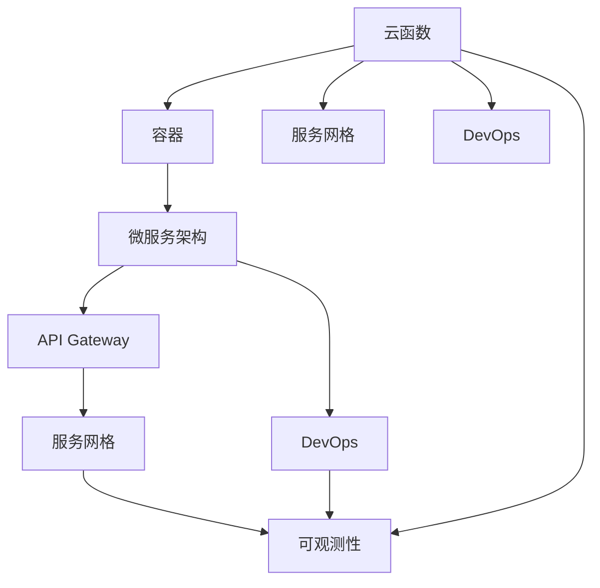
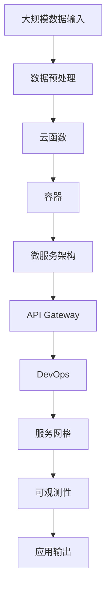

                 

## 1. 背景介绍

### 1.1 问题由来
随着数字经济的蓬勃发展，数据中心的基础设施和服务模式正在经历一场深刻的变革。传统的数据中心以“私有化”为主导，企业的IT资源由自己掌控，部署和管理成本高昂。然而，随着云计算技术的发展，越来越多的企业开始拥抱公有云和无服务器计算架构，以实现更灵活、更高效的IT资源管理和应用部署。

无服务器计算架构（Serverless Architecture），又称为函数即服务（Function as a Service, FaaS），是由云平台提供计算资源和运行环境，企业只需要将应用逻辑编写为云函数的形式，平台负责底层资源管理，使得开发者可以专注于应用逻辑本身，无需关注底层资源配置。

软件2.0时代的无服务器计算架构，正是在这一背景下应运而生的。它不仅延续了传统无服务器计算的资源高效、应用灵活等优势，还结合了软件定义计算、云原生、微服务等新兴技术，构建了一个更加智能、弹性、可观测的计算生态。

### 1.2 问题核心关键点
软件2.0的无服务器计算架构，核心在于将计算资源的自动化管理与软件定义计算相结合，通过云函数、容器、API Gateway、DevOps等工具和平台，实现应用的自动化构建、部署、测试、运维、监控等全生命周期管理。其关键点包括：

- 自动化构建与部署：通过持续集成（CI）和持续交付（CD）工具，实现应用的自动化构建、测试和部署。
- 弹性资源管理：根据应用负载动态调整计算资源，实现资源的按需分配和弹性伸缩。
- 高可用性与容错性：通过多副本、自动重启、健康检查等机制，保障应用的稳定运行和故障恢复。
- 微服务架构：将应用拆分为多个小服务，每个服务独立运行，提升应用的可维护性和扩展性。
- 服务网格与可观测性：通过服务网格（Istio）和可观测性平台（Prometheus、Grafana等），实现服务的发现、调度和监控。

这些关键点共同构成了软件2.0无服务器计算架构的基础，使得应用能够在一个弹性、自适应、可观测的计算环境中高效运行。

### 1.3 问题研究意义
软件2.0的无服务器计算架构，对于推动企业数字化转型、加速应用创新、降低IT成本、提升应用可靠性等方面具有重要意义：

1. **降低IT成本**：通过公有云的无服务器计算架构，企业无需购买和维护硬件设备，节省了大量的IT基础设施投入。
2. **加速应用创新**：无服务器计算架构提供了即用即付的资源和灵活的部署方式，使得开发者能够快速迭代应用，缩短开发周期。
3. **提升应用可靠性**：通过弹性资源管理和容错机制，无服务器计算架构能够保障应用的稳定性和可用性，减少宕机和故障带来的损失。
4. **推动业务创新**：微服务架构、API Gateway、DevOps等新兴技术，使得应用能够更好地与业务需求对接，加速业务创新和数字化转型。
5. **优化资源利用率**：通过按需分配和弹性伸缩，无服务器计算架构能够优化资源利用率，降低资源浪费。

## 2. 核心概念与联系

### 2.1 核心概念概述

软件2.0的无服务器计算架构，涉及多个核心概念和技术栈。下面将详细阐述这些概念及其相互关系。

- **云函数（Cloud Function）**：云函数是一种无状态、事件驱动的计算服务，可以通过编写代码实现应用逻辑。云函数通常基于事件触发器（如HTTP请求、数据库更新等）运行。

- **容器（Container）**：容器是一种轻量级的运行环境，用于封装和隔离应用依赖。常见的容器技术有Docker、Kubernetes等。

- **API Gateway**：API Gateway是应用和外部世界的接口，提供路由、负载均衡、安全、认证等功能，实现微服务的统一管理和访问控制。

- **DevOps**：DevOps是一种文化和实践，旨在通过自动化和协作，提高软件交付的速度和质量。DevOps工具包括Jenkins、GitLab CI、GitHub Actions等。

- **微服务架构（Microservices Architecture）**：微服务架构是将应用拆分为多个小服务，每个服务独立运行，通过API接口进行通信和协作。微服务架构有助于提升应用的可维护性和扩展性。

- **服务网格（Service Mesh）**：服务网格是一种分布式服务管理工具，提供流量管理、服务发现、路由、负载均衡等功能，常见技术有Istio。

- **可观测性（Observability）**：可观测性是指通过监控、日志、追踪等手段，对应用运行状态进行实时监测和分析，常见工具有Prometheus、Grafana等。

这些核心概念之间存在紧密的联系，共同构建了软件2.0无服务器计算架构的生态系统。下面通过一个Mermaid流程图来展示这些概念之间的关系：



这个流程图展示了云函数、容器、微服务、API Gateway、DevOps、服务网格和可观测性之间的相互作用。云函数和容器用于封装和运行应用逻辑；微服务架构通过API Gateway实现服务间的通信和调用；DevOps工具支持应用的自动化构建、测试和部署；服务网格提供服务的发现、调度和监控；可观测性平台提供监控、日志、追踪等功能，帮助开发者实时了解应用状态。

### 2.2 概念间的关系

这些核心概念之间的关系可以分为以下几个方面：

- **封装与运行**：云函数和容器技术提供了应用的封装和运行环境，使得应用逻辑可以独立部署和运行。
- **通信与协作**：微服务架构通过API Gateway实现服务间的通信和协作，使得多个服务能够协同工作。
- **自动化与部署**：DevOps工具支持应用的自动化构建、测试和部署，提高开发效率和应用质量。
- **管理与调度**：服务网格提供服务的发现、调度和监控，确保服务的稳定性和可用性。
- **监测与分析**：可观测性平台通过监控、日志、追踪等手段，帮助开发者实时了解应用状态，及时发现和解决问题。

这些概念之间的相互关系，共同构成了软件2.0无服务器计算架构的技术基础。通过这些概念的有机结合，开发者可以构建一个弹性、自适应、可观测的计算环境，实现应用的快速构建、部署、测试、运维和管理。

### 2.3 核心概念的整体架构

最后，我们通过一个综合的流程图来展示这些核心概念在大规模无服务器计算环境中的整体架构：



这个综合流程图展示了从数据输入到应用输出的整体流程。大规模数据输入首先进行数据预处理，然后通过云函数和容器封装和运行应用逻辑，接着通过微服务架构和API Gateway实现服务的通信和调用，DevOps工具支持应用的自动化构建、测试和部署，服务网格提供服务的发现、调度和监控，可观测性平台提供监控、日志、追踪等功能，最终输出应用结果。通过这个架构，开发者可以实现应用的灵活部署、弹性管理、高可用性和可观测性，提升应用的质量和可靠性。

## 3. 核心算法原理 & 具体操作步骤
### 3.1 算法原理概述

软件2.0的无服务器计算架构，基于事件驱动的计算模型，通过云函数和容器技术，实现应用的自动化构建、部署和运行。其核心算法原理可以概括为以下几个步骤：

1. **应用定义与构建**：开发者定义应用逻辑，通过云函数和容器技术构建应用运行环境。
2. **事件驱动与调度**：根据事件触发器，调度云函数运行，执行应用逻辑。
3. **弹性伸缩与负载均衡**：根据应用负载动态调整计算资源，实现弹性伸缩和负载均衡。
4. **健康检查与故障恢复**：通过健康检查机制，确保云函数的稳定运行和故障恢复。

这些步骤共同构成了软件2.0无服务器计算架构的核心算法原理，使得应用能够在弹性、自适应、可观测的计算环境中高效运行。

### 3.2 算法步骤详解

下面将详细介绍软件2.0无服务器计算架构的核心算法步骤。

**Step 1: 应用定义与构建**

1. **编写云函数代码**：开发者编写云函数代码，实现应用逻辑。云函数通常基于编程语言（如Python、Java等）和框架（如AWS Lambda、Google Cloud Functions、Azure Functions等）进行定义。
2. **定义事件触发器**：根据需要，定义触发云函数运行的事件（如HTTP请求、数据库更新、消息队列等）。
3. **构建容器镜像**：将云函数代码打包成容器镜像，并上传到容器仓库（如Docker Hub、Kubernetes等）。

**Step 2: 事件驱动与调度**

1. **设置事件触发器**：在云平台（如AWS、Google Cloud、Azure等）上配置事件触发器，将云函数与外部数据源或系统对接。
2. **运行云函数**：当事件触发时，云函数被调度运行，执行应用逻辑，生成应用输出。

**Step 3: 弹性伸缩与负载均衡**

1. **配置自动伸缩**：根据应用负载，配置云函数的自动伸缩策略，动态调整计算资源。
2. **实现负载均衡**：使用负载均衡器（如Nginx、Istio等），将请求分配到多个云函数实例上，提升应用的并发处理能力。

**Step 4: 健康检查与故障恢复**

1. **配置健康检查**：在云平台上配置健康检查策略，检测云函数的运行状态和异常情况。
2. **自动重启与替换**：当检测到云函数异常时，自动重启或替换故障实例，确保应用的高可用性和容错性。

### 3.3 算法优缺点

软件2.0的无服务器计算架构具有以下优点：

- **高效资源管理**：云平台自动管理计算资源，无需开发者手动配置和维护。
- **快速迭代开发**：通过云函数和容器技术，开发者可以快速构建、测试和部署应用。
- **弹性伸缩与负载均衡**：根据应用负载动态调整计算资源，提升应用的并发处理能力。
- **高可用性与容错性**：通过健康检查和自动重启机制，保障应用的稳定运行和故障恢复。

同时，也存在一些缺点：

- **服务费用较高**：虽然计算资源按需分配，但函数调用的服务费用较高，增加了企业的IT成本。
- **依赖云平台**：开发者需要依赖云平台提供的服务和工具，无法自主控制底层资源。
- **开发难度较大**：云函数的编写和调试相对复杂，需要一定的开发经验和技术积累。

### 3.4 算法应用领域

软件2.0的无服务器计算架构，主要应用于以下领域：

- **企业应用**：企业的业务应用、客户服务、内部系统集成等。
- **移动应用**：移动应用的API接口、后台服务、推送通知等。
- **物联网应用**：IoT设备的远程监控、数据处理、应用逻辑等。
- **金融科技**：金融交易、风险管理、智能投顾等。
- **医疗健康**：远程诊疗、病历管理、智能分析等。
- **智能制造**：工业自动化、设备监控、数据处理等。

## 4. 数学模型和公式 & 详细讲解 & 举例说明

### 4.1 数学模型构建

软件2.0的无服务器计算架构，涉及多个数学模型和公式。下面将详细介绍这些模型及其推导过程。

假设一个云函数的执行时间$t$和响应时间$r$分别服从正态分布，其数学模型如下：

$$
t \sim N(\mu_t, \sigma_t^2)
$$

$$
r \sim N(\mu_r, \sigma_r^2)
$$

其中，$\mu_t$和$\mu_r$为执行时间和响应时间的均值，$\sigma_t$和$\sigma_r$为执行时间和响应时间标准差。

### 4.2 公式推导过程

根据上述模型，云函数的总运行时间$T$可以表示为：

$$
T = t + r
$$

假设云函数在一个时间窗口$[0, \Delta t]$内被调用了$N$次，每次调用的响应时间$r_i$相互独立，执行时间$t_i$也相互独立。则总运行时间$T$的期望和方差可以表示为：

$$
E[T] = E[t] + E[r] = \mu_t + \mu_r
$$

$$
Var[T] = Var[t] + Var[r] = \sigma_t^2 + \sigma_r^2
$$

其中，$E[T]$为总运行时间的期望，$Var[T]$为总运行时间的方差。

### 4.3 案例分析与讲解

假设一个云函数的执行时间为50毫秒，响应时间为10毫秒，每次调用的执行时间和响应时间都服从均值为50毫秒、标准差为20毫秒的正态分布。则总运行时间的期望和方差分别为：

$$
E[T] = 50 + 10 = 60 \text{毫秒}
$$

$$
Var[T] = 20^2 + 10^2 = 500 \text{毫秒}^2
$$

因此，总运行时间的期望为60毫秒，方差为500毫秒的平方，表示执行时间和响应时间的波动性。

## 5. 项目实践：代码实例和详细解释说明

### 5.1 开发环境搭建

要进行软件2.0无服务器计算架构的开发和测试，首先需要搭建好开发环境。以下是搭建开发环境的详细步骤：

1. **安装云平台SDK**：根据所选的云平台（如AWS、Google Cloud、Azure等），安装相应的SDK（Software Development Kit）。例如，在AWS上安装AWS CLI，在Google Cloud上安装Google Cloud SDK等。
2. **配置环境变量**：设置云平台相关的环境变量，如账户ID、密钥等。
3. **安装相关工具**：安装云函数和容器相关的工具和库，如AWS Lambda、Kubernetes等。

### 5.2 源代码详细实现

下面以AWS Lambda为例，展示云函数的代码实现。

```python
import boto3

def lambda_handler(event, context):
    # 处理事件
    print(f'Received event: {event}')
    result = process_event(event)
    return result

def process_event(event):
    # 处理事件逻辑
    # ...
    return result
```

在这个示例中，lambda_handler函数是AWS Lambda的入口函数，用于处理云函数的事件输入。process_event函数用于处理事件的实际逻辑。

### 5.3 代码解读与分析

在这个示例中，lambda_handler函数和process_event函数分别用于处理云函数的事件输入和实际逻辑。lambda_handler函数是AWS Lambda的入口函数，接收两个参数：event和context。event参数表示事件的输入数据，context参数表示函数的运行环境。

process_event函数用于处理事件的实际逻辑。在这个示例中，我们简单地将event参数输出到控制台，然后调用process_event函数处理事件逻辑。process_event函数的返回结果作为lambda_handler函数的输出结果。

### 5.4 运行结果展示

在运行示例代码后，可以通过AWS Console查看日志和监控结果。以下是一个典型的AWS Lambda监控界面：


在监控界面中，可以查看函数的调用次数、执行时间、响应时间等指标。还可以通过云平台的健康检查机制，设置函数的健康检查规则，确保函数的稳定运行。

## 6. 实际应用场景

### 6.1 智能客服系统

基于软件2.0的无服务器计算架构，可以构建一个智能客服系统。该系统通过云函数和容器技术，实现客户服务的自动化和智能化。

具体实现如下：

1. **定义事件触发器**：通过AWS API Gateway，定义HTTP请求事件，将客户咨询请求转发到云函数。
2. **编写云函数代码**：编写云函数代码，解析客户咨询内容，自动匹配问题，生成应答。
3. **实现容器化**：将云函数代码打包成Docker镜像，部署到Kubernetes集群中。
4. **配置健康检查**：在Kubernetes集群中配置健康检查规则，确保云函数的高可用性和容错性。

通过以上步骤，可以实现一个功能强大、可扩展、高可用的智能客服系统，提供7x24小时不间断的客户服务。

### 6.2 金融舆情监测

金融舆情监测系统可以帮助金融机构实时监测市场舆论动向，预测股票走势，规避金融风险。该系统通过云函数和容器技术，实现实时数据分析和模型训练。

具体实现如下：

1. **数据收集与预处理**：通过AWS Lambda函数，收集金融市场的新闻、评论等文本数据，并进行预处理和清洗。
2. **构建云函数模型**：编写云函数代码，训练文本分类和情感分析模型，实现对舆情的实时分析和预测。
3. **实现容器化部署**：将训练好的模型代码打包成Docker镜像，部署到Kubernetes集群中。
4. **配置健康检查与负载均衡**：在Kubernetes集群中配置健康检查和负载均衡机制，确保系统的稳定性和高可用性。

通过以上步骤，可以实现一个实时、高效的金融舆情监测系统，帮助金融机构及时发现市场风险，做出正确的决策。

### 6.3 个性化推荐系统

基于软件2.0的无服务器计算架构，可以构建一个个性化推荐系统，推荐用户感兴趣的物品。

具体实现如下：

1. **数据收集与预处理**：通过AWS Lambda函数，收集用户的行为数据和物品的属性数据，并进行预处理和清洗。
2. **编写云函数模型**：编写云函数代码，训练推荐模型，实现对用户兴趣的预测和物品的推荐。
3. **实现容器化部署**：将训练好的模型代码打包成Docker镜像，部署到Kubernetes集群中。
4. **配置健康检查与负载均衡**：在Kubernetes集群中配置健康检查和负载均衡机制，确保系统的稳定性和高可用性。

通过以上步骤，可以实现一个个性化推荐系统，推荐用户感兴趣的物品，提升用户满意度。

## 7. 工具和资源推荐

### 7.1 学习资源推荐

为了帮助开发者系统掌握软件2.0无服务器计算架构的理论基础和实践技巧，这里推荐一些优质的学习资源：

1. **《Serverless Architecture with AWS Lambda》**：由AWS官方发布的文档，详细介绍了AWS Lambda的功能和使用方法。
2. **《Google Cloud Functions with Python》**：由Google官方发布的文档，详细介绍了Google Cloud Functions的使用方法。
3. **《Azure Functions with Python》**：由Microsoft官方发布的文档，详细介绍了Azure Functions的使用方法。
4. **《Kubernetes: Up and Running》**：Kubernetes的官方文档，介绍了Kubernetes的部署、管理和扩展方法。
5. **《Istio: A Service Mesh for Microservices》**：Istio的官方文档，介绍了Istio的功能和使用方法。
6. **《Prometheus: Monitoring and Alerting for Cloud Native Applications》**：Prometheus的官方文档，介绍了Prometheus的监控和报警功能。

### 7.2 开发工具推荐

高效的开发离不开优秀的工具支持。以下是几款用于软件2.0无服务器计算架构开发的常用工具：

1. **AWS CLI**：用于AWS Lambda函数的命令行工具。
2. **Google Cloud SDK**：用于Google Cloud Functions的命令行工具。
3. **Azure CLI**：用于Azure Functions的命令行工具。
4. **Kubernetes**：用于容器化和部署应用的开源平台。
5. **Istio**：用于服务网格和微服务的开源平台。
6. **Prometheus**：用于监控和报警的开源平台。

### 7.3 相关论文推荐

软件2.0的无服务器计算架构，涉及多个新兴技术和领域。以下是几篇奠基性的相关论文，推荐阅读：

1. **《Serverless Architecture for Cloud Native Applications》**：文章介绍了无服务器计算架构的设计和实现方法，以及它在云原生应用中的作用。
2. **《Event-Driven Architectures for Modern Web Applications》**：文章介绍了事件驱动架构的设计和实现方法，以及它在现代Web应用中的作用。
3. **《Designing Serverless Systems》**：文章介绍了无服务器计算架构的设计原则和最佳实践，以及如何在无服务器环境中构建高效的应用。
4. **《Microservices: A Digital Transformation Playbook》**：文章介绍了微服务架构的设计和实现方法，以及它在数字化转型中的作用。
5. **《Building Microservices》**：本书深入探讨了微服务架构的设计、实现和部署方法，是微服务架构的权威指南。

这些论文和书籍代表了大规模无服务器计算架构的研究方向和发展脉络，帮助开发者理解和应用这一新兴技术。

## 8. 总结：未来发展趋势与挑战

### 8.1 研究成果总结

软件2.0的无服务器计算架构，作为一种新兴的计算范式，已经在多个领域得到了广泛应用，取得了显著的成效。主要成果包括：

1. **弹性资源管理**：通过云函数和容器技术，实现应用的弹性伸缩和负载均衡。
2. **高可用性与容错性**：通过健康检查和自动重启机制，保障应用的稳定运行和故障恢复。
3. **自动化构建与部署**：通过持续集成和持续交付工具，实现应用的自动化构建、测试和部署。
4. **微服务架构**：将应用拆分为多个小服务，每个服务独立运行，提升应用的可维护性和扩展性。
5. **服务网格与可观测性**：通过服务网格和可观测性平台，实现服务的发现、调度和监控。

### 8.2 未来发展趋势

展望未来，软件2.0的无服务器计算架构将呈现以下几个发展趋势：

1. **多云与混合云**：企业将更多地采用多云和混合云环境，实现资源的优化配置和成本控制。
2. **微服务与容器编排**：微服务架构和容器编排技术将进一步成熟，支持更加复杂的业务需求和应用场景。
3. **智能化与自动化**：AI和机器学习技术将进一步与无服务器计算架构结合，实现智能化的应用构建和运维。
4. **边缘计算**：随着物联网和移动应用的普及，边缘计算技术将与无服务器计算架构结合，实现更加灵活和高效的应用部署。
5. **生态与社区**：云平台和开源社区将更加活跃，提供更多的工具和资源，帮助开发者构建高效、可靠的应用。

### 8.3 面临的挑战

尽管软件2.0的无服务器计算架构已经取得了一定的成果，但在实际应用中仍面临一些挑战：

1. **服务费用**：虽然计算资源按需分配，但函数调用的服务费用较高，增加了企业的IT成本。
2. **依赖云平台**：开发者需要依赖云平台提供的服务和工具，无法自主控制底层资源。
3. **开发难度**：云函数的编写和调试相对复杂，需要一定的开发经验和技术积累。
4. **监控和调试**：云函数的运行状态和异常情况需要实时监控和调试，增加了开发和运维的复杂性。

### 8.4 研究展望

未来，软件2.0的无服务器计算架构需要在以下几个方面寻求新的突破：

1. **无服务器与DevOps集成**：将DevOps工具和实践引入无服务器计算架构，提升应用的自动化构建、测试和部署能力。
2. **微服务与容器编排优化**：进一步优化微服务架构和容器编排技术，支持更加复杂的业务需求和应用场景。
3. **智能化与自动化增强**：引入AI和机器学习技术，实现应用的智能化构建和运维。
4. **边缘计算与无服务器结合**：结合边缘计算技术，实现更加灵活和高效的应用部署。
5. **生态与社区建设**：加强云平台和开源社区的合作，提供更多的工具和资源，支持开发者构建高效、可靠的应用。

通过这些研究方向，软件2.0的无服务器计算架构将进一步提升应用的质量和效率，为数字化转型和智能化应用提供更加坚实的基础。

## 9. 附录：常见问题与解答

**Q1：软件2.0的无服务器计算架构与传统服务器架构有何不同？**

A: 软件2.0的无服务器计算架构与传统服务器架构有以下不同点：

1. **资源管理**：无服务器架构中，资源管理由云平台自动完成，开发者无需手动配置和维护；传统架构中，资源管理由开发者自行管理。
2. **弹性伸缩**：无服务器架构支持弹性伸缩，根据应用负载动态调整计算资源；传统架构通常需要手动调整资源配置。
3. **成本控制**：无服务器架构按需收费，避免了传统架构中资源浪费的情况；传统架构通常需要购买和维护硬件设备，成本较高。
4. **部署与维护**：无服务器架构支持快速部署和运维；传统架构通常需要手动部署和维护。

**Q2：如何保证无服务器计算架构的高可用性和容错性？**

A: 无服务器计算架构的高可用性和容错性主要通过以下措施实现：

1. **多副本**：通过多副本机制，确保每个云函数实例都有多个备份，保证服务的可靠性。
2. **自动重启**：当云函数实例出现故障时，自动重启或替换故障实例，确保服务的连续性。
3. **健康检查**：通过健康检查机制，检测云函数的运行状态和异常情况，及时发现和解决问题。
4. **负载均衡**：通过负载均衡机制，将请求分配到多个云函数实例上，提升应用的并发处理能力。

**Q3：无服务器计算架构中，如何优化资源利用率？**

A: 优化无服务器计算架构的资源利用率主要通过以下措施实现

