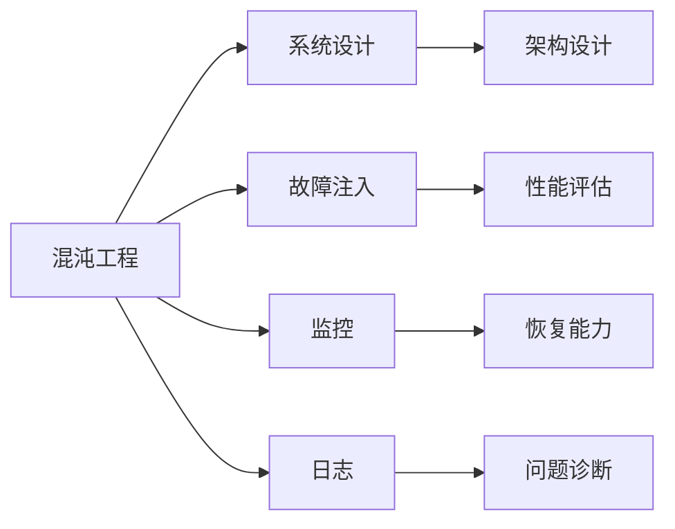

                 

## 1. 背景介绍

软件开发的范式经历了从传统的瀑布模型到敏捷开发、再到持续交付的演进，逐步深入到软件2.0时代。软件2.0（Software 2.0）强调智能化和自动化，以机器学习和大数据分析为核心的新技术，极大地提升了软件开发效率和质量。然而，软件的复杂性也随之增加，如何确保软件系统的稳定性和可靠性，成为软件2.0时代亟待解决的问题。

### 1.1 软件2.0与传统的软件工程区别

软件2.0与传统的软件工程主要有以下几个区别：

1. **自动化**：软件2.0引入了自动化测试、自动化构建和自动化部署，极大地提升了开发效率。
2. **数据驱动**：软件2.0通过大数据和机器学习算法，对代码库进行智能分析，优化代码质量和性能。
3. **动态性**：软件2.0的开发过程更加动态，快速迭代和持续交付成为常态。
4. **安全性**：软件2.0更加注重系统安全性，通过自动化安全测试和持续监控，及时发现和修复漏洞。
5. **可扩展性**：软件2.0通过微服务架构和容器化技术，实现了系统的高度可扩展和可部署性。

### 1.2 软件2.0的核心技术

软件2.0的核心技术包括：

1. **机器学习和数据分析**：用于代码质量分析、性能优化和故障诊断。
2. **容器化与微服务**：通过Docker、Kubernetes等技术，实现应用的快速部署和扩展。
3. **持续交付和DevOps**：实现自动化构建、测试、部署和监控，确保软件质量。
4. **A/B测试和用户反馈**：通过实验对比，优化产品功能和用户体验。
5. **大数据与存储**：用于大规模数据的存储和处理，支持实时分析和决策。

这些技术共同构成了软件2.0的框架，使得软件开发变得更加高效、智能和安全。

## 2. 核心概念与联系

### 2.1 核心概念概述

在软件2.0的背景下，混沌工程（Chaos Engineering）成为确保系统可靠性和健壮性的重要实践。混沌工程通过模拟真实世界中的故障和异常，评估系统的恢复能力，从而提高系统的鲁棒性和稳定性。

### 2.2 核心概念间的关系

以下是一个Mermaid流程图，展示混沌工程的核心概念及其相互关系：



该流程图展示了混沌工程的各个环节和关键组件，包括系统设计、故障注入、监控、日志、性能评估、恢复能力和问题诊断。

## 3. 核心算法原理 & 具体操作步骤

### 3.1 算法原理概述

混沌工程的核心算法原理是故障注入（Chaos Injection）和系统监控（System Monitoring）。通过故障注入，工程师可以模拟系统在真实环境中的各种异常情况，从而评估系统的恢复能力和稳定性。系统监控则用于实时收集和分析系统的各项指标，发现和预测潜在的问题。

### 3.2 算法步骤详解

混沌工程的步骤如下：

1. **系统设计**：在软件2.0的架构设计阶段，考虑系统的容错性和冗余设计，引入可插拔的服务和模块，确保系统的可扩展性。
2. **故障注入**：在生产环境中，根据系统的运行情况，设计合理的故障注入策略，如服务延迟、服务宕机、数据丢失等。
3. **性能评估**：通过故障注入，评估系统的恢复能力和性能瓶颈，找出系统中最脆弱的环节。
4. **恢复能力**：根据性能评估的结果，优化系统的容错设计和资源配置，提高系统的恢复能力。
5. **监控与日志**：实时监控系统的各项指标和日志信息，快速发现和定位问题，确保系统的稳定运行。

### 3.3 算法优缺点

混沌工程的优点：

1. **系统鲁棒性提升**：通过故障注入和性能评估，可以及时发现系统的薄弱环节，提高系统的鲁棒性。
2. **预见性增强**：通过监控和日志分析，可以预见潜在的故障和问题，提前进行修复和优化。
3. **成本降低**：通过自动化故障注入和监控，减少了手动测试和排查的复杂性，降低了人工成本。

混沌工程的缺点：

1. **操作复杂**：故障注入和监控需要专业的知识和技能，操作复杂。
2. **潜在风险**：不合理的故障注入可能会对系统造成不可预期的影响，需要谨慎设计。
3. **资源消耗**：持续监控和故障注入需要大量的计算和存储资源，增加了系统负担。

### 3.4 算法应用领域

混沌工程在软件2.0中的应用领域包括：

1. **金融系统**：用于实时监控和故障注入，确保交易系统的稳定和安全。
2. **电商平台**：通过监控和日志分析，优化购物车、订单处理等环节，提升用户体验。
3. **社交媒体**：实时监控用户反馈和系统异常，快速处理故障，保障服务质量。
4. **物联网**：监控设备状态和网络环境，发现和修复网络延迟、数据丢失等问题。
5. **自动驾驶**：通过模拟交通事故和异常驾驶情况，评估系统的鲁棒性和安全性。

## 4. 数学模型和公式 & 详细讲解 & 举例说明

### 4.1 数学模型构建

混沌工程的理论基础是混沌理论，通过系统的动态行为分析，预测和控制系统的故障和恢复过程。以下是一个简单的数学模型：

1. **系统状态方程**：
   \[
   x_{n+1} = f(x_n, \sigma)
   \]
   其中，\(x_n\) 表示系统状态，\(\sigma\) 表示系统参数，\(f\) 表示系统的动态方程。

2. **系统输出方程**：
   \[
   y_n = g(x_n)
   \]
   其中，\(y_n\) 表示系统输出，\(g\) 表示系统的输出方程。

3. **误差方程**：
   \[
   e_n = y_n - y_{n-1}
   \]
   其中，\(e_n\) 表示系统误差。

### 4.2 公式推导过程

以一个简单的系统为例，推导混沌工程的数学模型：

1. **系统状态方程**：
   \[
   x_{n+1} = x_n + \sigma(x_n - x_{n-1})
   \]
   其中，\(\sigma\) 为系统的参数，控制系统的动态行为。

2. **系统输出方程**：
   \[
   y_n = x_n
   \]

3. **误差方程**：
   \[
   e_n = y_n - y_{n-1}
   \]

通过上述模型，可以预测系统在特定参数下的动态行为和误差变化，从而评估系统的稳定性和鲁棒性。

### 4.3 案例分析与讲解

以一个电商平台的订单处理系统为例，进行混沌工程的应用分析：

1. **系统设计**：设计基于微服务的电商架构，引入服务网格和负载均衡，确保系统的可扩展性和容错性。
2. **故障注入**：在订单处理系统中，模拟网络延迟、服务宕机等异常情况，评估系统的恢复能力。
3. **性能评估**：通过监控和日志分析，发现订单处理系统的瓶颈和问题，优化系统配置。
4. **恢复能力**：根据性能评估的结果，增加冗余资源，优化系统的负载均衡策略，提高系统的恢复能力。
5. **监控与日志**：实时监控订单处理系统的各项指标和日志信息，快速发现和定位问题，确保系统的稳定运行。

## 5. 项目实践：代码实例和详细解释说明

### 5.1 开发环境搭建

要进行混沌工程实践，需要搭建一个包含生产环境和开发环境的系统，以下是具体的搭建步骤：

1. **安装Docker**：安装Docker容器引擎，用于构建和运行容器化应用。

2. **安装Kubernetes**：安装Kubernetes集群，用于容器化应用的编排和部署。

3. **安装监控工具**：安装Prometheus和Grafana，用于实时监控和可视化系统指标。

4. **安装故障注入工具**：安装 chaos-mesh 和 chaos-testing，用于故障注入和恢复能力评估。

5. **安装日志分析工具**：安装ELK Stack（Elasticsearch、Logstash、Kibana），用于日志的收集和分析。

### 5.2 源代码详细实现

以下是一个简单的故障注入和监控的代码实现：

1. **故障注入代码**：

```python
import chaos_mesh
import prometheus

# 创建故障注入策略
strategy = chaos_mesh.create_chaos_mesh()
strategy.add_service(name="order-service", selector={"kubernetes": "production"})

# 配置故障注入参数
strategy.add_fault("network-delay", mode="none")
strategy.add_fault("service-crash", mode="none")

# 启动故障注入
strategy.start()
```

2. **监控代码**：

```python
import prometheus

# 创建Prometheus客户端
client = prometheus.create_client()

# 定义监控指标
client.add_metric(name="order-processing-time", value=10.0)
client.add_metric(name="order-processing-error", value=0.0)

# 发送监控数据
client.send()
```

### 5.3 代码解读与分析

上述代码展示了故障注入和监控的实现过程。故障注入通过chaos-mesh工具，根据预定义的故障策略，对订单处理服务进行故障注入。监控则通过Prometheus工具，收集和展示系统的各项指标，如订单处理时间和错误率。

### 5.4 运行结果展示

运行故障注入和监控代码，可以得到以下结果：

1. **故障注入结果**：
   - 订单处理服务在网络延迟和宕机情况下，可以正常恢复并继续处理订单。
   - 通过chaos-mesh的可视化界面，可以实时查看故障注入的进程和恢复效果。

2. **监控结果**：
   - 通过Prometheus的Grafana界面，可以实时展示订单处理时间和错误率的变化趋势。
   - 通过日志分析工具，可以进一步诊断订单处理系统中的问题，并及时修复。

## 6. 实际应用场景

### 6.1 金融系统

金融系统的稳定性和安全性是至关重要的，通过混沌工程可以确保系统的可靠性和鲁棒性：

1. **故障注入**：模拟交易系统中的网络延迟、数据丢失等问题，评估系统的恢复能力。
2. **性能评估**：通过监控和日志分析，优化交易系统的性能瓶颈，提升交易速度。
3. **监控与日志**：实时监控交易系统的各项指标，如交易量、延迟、错误率等，快速发现和处理问题。

### 6.2 电商平台

电商平台的稳定性和用户体验是核心需求，通过混沌工程可以确保系统的稳定性和性能：

1. **故障注入**：模拟购物车、订单处理等环节的故障，评估系统的恢复能力。
2. **性能评估**：通过监控和日志分析，优化购物车和订单处理等环节，提升用户体验。
3. **监控与日志**：实时监控电商平台的各项指标，如页面加载时间、购物车崩溃率等，快速发现和处理问题。

### 6.3 社交媒体

社交媒体系统的实时性和稳定性至关重要，通过混沌工程可以确保系统的稳定性和用户体验：

1. **故障注入**：模拟用户反馈、系统异常等问题，评估系统的恢复能力。
2. **性能评估**：通过监控和日志分析，优化用户反馈和系统异常的处理过程，提升用户体验。
3. **监控与日志**：实时监控社交媒体系统的各项指标，如页面崩溃率、用户响应时间等，快速发现和处理问题。

### 6.4 未来应用展望

混沌工程在软件2.0中的应用前景广阔，未来发展方向包括：

1. **自动化和智能化**：通过机器学习和智能算法，自动进行故障注入和监控，提升效率和准确性。
2. **跨云和跨平台**：将混沌工程应用于多云、多平台环境中，提高系统的可移植性和兼容性。
3. **AI驱动的故障检测**：利用AI技术，自动识别系统异常和故障，及时进行修复和优化。
4. **实时故障预测**：通过机器学习和大数据分析，预测系统的故障和异常，提前进行预防和处理。

## 7. 工具和资源推荐

### 7.1 学习资源推荐

1. **《Chaos Engineering: Building Fault-Tolerant Systems》**：这本书系统介绍了混沌工程的基本概念和实践方法，是学习混沌工程的最佳入门书籍。
2. **Coursera混沌工程课程**：Coursera平台上的混沌工程课程，由Google和Netflix的工程师授课，涵盖混沌工程的各个方面。
3. **Udemy混沌工程课程**：Udemy平台上的混沌工程课程，详细介绍了混沌工程的实践方法和工具。
4. **Chaos Magazine**：一个专注于混沌工程的在线杂志，提供最新的研究和实践案例。
5. **Chaos Engineering Conferences**：混沌工程相关的国际会议和研讨会，如DCon、Amplify等，可以获取最新的行业动态和技术分享。

### 7.2 开发工具推荐

1. **Docker**：用于构建和运行容器化应用。
2. **Kubernetes**：用于容器化应用的编排和部署。
3. **Prometheus**：用于实时监控系统指标。
4. **Grafana**：用于可视化系统指标。
5. **chaos-mesh**：用于故障注入和恢复能力评估。
6. **ELK Stack**：用于日志的收集和分析。

### 7.3 相关论文推荐

1. **《Chaos Engineering at Netflix》**：Netflix在混沌工程方面的实践和经验分享。
2. **《Designing Distributed Systems for Chaos Engineering》**：Google在混沌工程方面的研究和实践。
3. **《An Introduction to Chaos Engineering》**：介绍混沌工程的基本概念和实践方法。
4. **《Chaos Engineering: A Series of Small Failures in a System That Works》**：混沌工程方法的经典论文，阐述了混沌工程的基本思路和应用场景。

## 8. 总结：未来发展趋势与挑战

### 8.1 研究成果总结

混沌工程作为确保系统可靠性和健壮性的重要实践，在软件2.0时代具有重要意义。通过故障注入和监控，可以评估系统的恢复能力和性能瓶颈，提升系统的稳定性和鲁棒性。

### 8.2 未来发展趋势

混沌工程的未来发展趋势包括：

1. **自动化和智能化**：通过机器学习和智能算法，自动进行故障注入和监控，提升效率和准确性。
2. **跨云和跨平台**：将混沌工程应用于多云、多平台环境中，提高系统的可移植性和兼容性。
3. **AI驱动的故障检测**：利用AI技术，自动识别系统异常和故障，及时进行修复和优化。
4. **实时故障预测**：通过机器学习和大数据分析，预测系统的故障和异常，提前进行预防和处理。

### 8.3 面临的挑战

尽管混沌工程在软件2.0中具有重要意义，但仍面临一些挑战：

1. **操作复杂**：故障注入和监控需要专业的知识和技能，操作复杂。
2. **潜在风险**：不合理的故障注入可能会对系统造成不可预期的影响，需要谨慎设计。
3. **资源消耗**：持续监控和故障注入需要大量的计算和存储资源，增加了系统负担。

### 8.4 研究展望

未来的研究可以从以下几个方面进行：

1. **自动化和智能化**：通过机器学习和智能算法，自动进行故障注入和监控，提升效率和准确性。
2. **跨云和跨平台**：将混沌工程应用于多云、多平台环境中，提高系统的可移植性和兼容性。
3. **AI驱动的故障检测**：利用AI技术，自动识别系统异常和故障，及时进行修复和优化。
4. **实时故障预测**：通过机器学习和大数据分析，预测系统的故障和异常，提前进行预防和处理。

## 9. 附录：常见问题与解答

**Q1：什么是混沌工程？**

A: 混沌工程是一种通过模拟系统中的故障和异常，评估系统的恢复能力和稳定性，从而提高系统鲁棒性的实践。

**Q2：如何选择合适的故障注入策略？**

A: 选择合适的故障注入策略需要根据系统的特点和需求，一般包括网络延迟、服务宕机、数据丢失等，需要谨慎设计以避免对系统造成不可预期的影响。

**Q3：如何评估系统的恢复能力？**

A: 评估系统的恢复能力可以通过监控和日志分析，查找系统的恢复时间、失败次数等指标，以及系统恢复正常运行后的情况。

**Q4：什么是监控和日志？**

A: 监控和日志是实时收集和分析系统各项指标和日志信息，用于发现和预测系统异常，确保系统稳定运行。

**Q5：如何优化系统的恢复能力？**

A: 优化系统的恢复能力可以通过增加冗余资源、优化负载均衡策略、提升系统容错设计等方法实现，确保系统在故障发生时能够快速恢复。

---

作者：禅与计算机程序设计艺术 / Zen and the Art of Computer Programming

