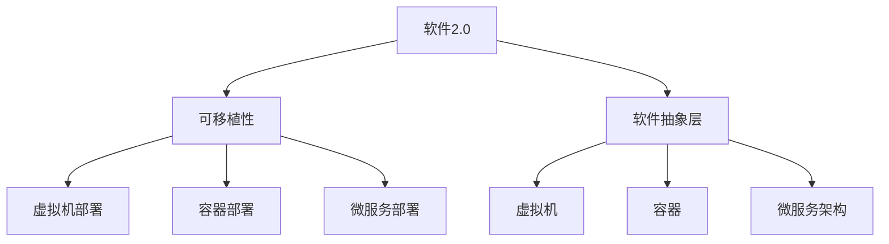
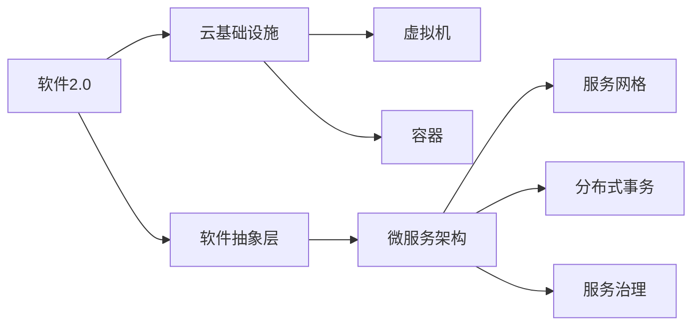
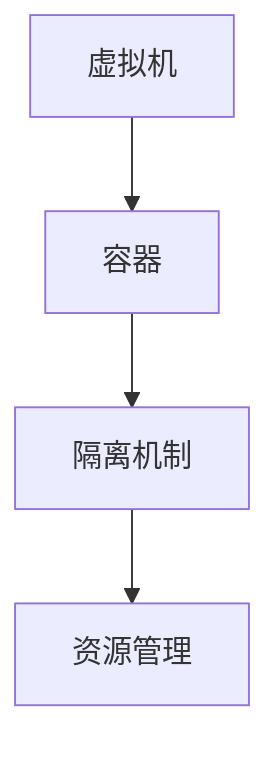
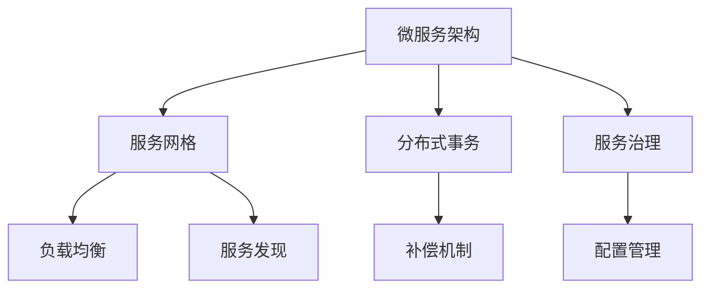
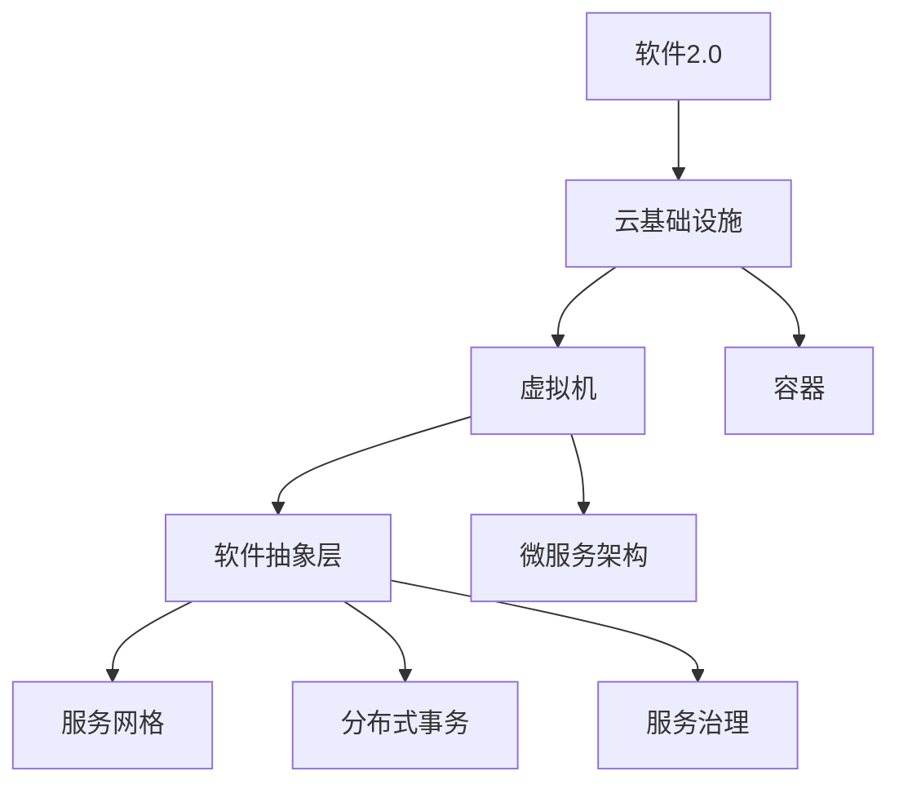

                 

# 软件2.0的高可移植性

## 1. 背景介绍

### 1.1 问题由来

在软件开发领域，“可移植性”一直是一个核心话题。传统软件开发时代，开发者需要针对不同的硬件平台、操作系统、编译器和应用场景，分别编写和优化代码，这不仅增加了开发成本，还降低了代码的复用性。随着软件架构的演进，代码的可移植性问题变得越来越复杂。

## 2. 核心概念与联系

### 2.1 核心概念概述

为更好地理解软件2.0的高可移植性，本节将介绍几个密切相关的核心概念：

- **软件2.0**：以云计算、大数据、人工智能为代表的新一代软件技术体系。其核心思想是采用基础设施即服务(Infrastructure as a Service, IaaS)、平台即服务(Platform as a Service, PaaS)和软件即服务(Software as a Service, SaaS)等新型服务模式，提供标准化的软硬件接口，降低开发和部署的难度和成本。
- **可移植性(Managing Transparency)**：软件在不同的硬件和操作系统环境中，能保持一致的运行状态和功能。可移植性是软件系统设计的重要指标，影响着软件的生命周期和应用价值。
- **软件抽象层(Software Abstraction Layer, SAL)**：在软件中引入抽象层，用于屏蔽底层硬件和操作系统的细节，提供一个统一的接口规范。这有助于提高软件的可移植性和可维护性。
- **虚拟机(Virtual Machine, VM)**：一种模拟硬件环境的解决方案，能够在不同的硬件平台上运行相同的虚拟机镜像。虚拟机隔离了底层硬件，使得软件能够跨平台部署和运行。
- **容器(Container)**：一种轻量级虚拟化解决方案，以命名空间(Namespace)隔离资源，在单个操作系统上运行多个独立的应用程序。容器提供了更高层次的抽象，实现了跨平台、跨主机部署。
- **微服务架构(Microservices Architecture)**：将大型应用拆分为一组小服务，每个服务独立运行和维护。微服务架构提升了系统的可移植性和可扩展性，使得服务能够按需部署和更新。

这些核心概念之间的逻辑关系可以通过以下Mermaid流程图来展示：



这个流程图展示了大软件2.0的高可移植性框架及其关键组件的关系：

1. 软件2.0提供了云计算、大数据和人工智能等新型基础设施，支撑起可移植性。
2. 通过软件抽象层屏蔽底层差异，实现跨平台兼容性。
3. 虚拟机和容器提供了软硬件隔离机制，进一步增强了可移植性。
4. 微服务架构将应用拆分为多个独立服务，支持按需部署和更新。

### 2.2 概念间的关系

这些核心概念之间存在着紧密的联系，形成了软件2.0高可移植性的完整生态系统。下面我们通过几个Mermaid流程图来展示这些概念之间的关系。

#### 2.2.1 软件2.0的高可移植性架构



这个流程图展示了软件2.0架构下的高可移植性架构，涉及云基础设施、软件抽象层和微服务架构。

#### 2.2.2 虚拟机与容器的关系



这个流程图展示了虚拟机和容器之间的关系，虚拟机提供了更底层硬件的隔离机制，而容器则在此基础上提供了更轻量级、更高效的应用隔离和资源管理。

#### 2.2.3 微服务架构的组成部分



这个流程图展示了微服务架构的关键组成部分，包括服务网格、分布式事务、服务治理等。

### 2.3 核心概念的整体架构

最后，我们用一个综合的流程图来展示这些核心概念在大软件2.0环境下的整体架构：



这个综合流程图展示了从软件2.0到云基础设施，再到虚拟机、容器、微服务架构、服务网格、分布式事务和服务治理等各个层级的关系。

## 3. 核心算法原理 & 具体操作步骤

### 3.1 算法原理概述

软件2.0的高可移植性实现涉及多个算法和技术的协同工作。其核心算法原理主要包括：

- **虚拟机隔离技术**：通过虚拟化技术将操作系统和硬件资源隔离，使不同的虚拟机能够在同一物理硬件上独立运行。
- **容器编排技术**：在容器的基础上，通过编排工具如Kubernetes，实现容器的自动化部署和管理。
- **微服务架构**：通过将大型应用拆分为多个小服务，每个服务独立运行和维护，实现按需部署和更新。
- **分布式事务处理**：通过分布式事务协调技术，确保跨服务、跨节点的数据一致性。
- **服务治理技术**：通过API网关、服务注册中心等技术，实现服务的发现、路由、监控和治理。

### 3.2 算法步骤详解

#### 3.2.1 虚拟机隔离技术

1. **硬件虚拟化**：通过虚拟化技术，将一个物理服务器划分为多个虚拟服务器，每个虚拟服务器运行独立的虚拟机。虚拟机隔离了底层硬件资源，使得软件能够在不同的物理硬件上运行。

2. **虚拟机部署**：在云平台上通过API创建虚拟机，指定CPU、内存、磁盘等资源配置，并上传虚拟机镜像。虚拟机启动后，即在物理硬件上运行。

3. **虚拟机管理**：通过云平台提供的管理接口，监控虚拟机的运行状态，进行动态调整资源配置，保证应用的稳定运行。

#### 3.2.2 容器编排技术

1. **容器构建**：通过Docker等工具构建容器镜像，将应用及其依赖打包成一个可移植的容器。

2. **容器部署**：在云平台上使用Kubernetes等容器编排工具，创建容器实例，并指定容器的资源配置。

3. **容器管理**：通过容器编排工具，实现容器的自动部署、扩展、回收和监控。Kubernetes提供了自动扩缩容、滚动升级、资源自动调整等功能。

#### 3.2.3 微服务架构

1. **应用拆分**：将大型应用拆分为多个小服务，每个服务独立运行和维护。服务之间通过接口进行通信，实现松耦合的架构设计。

2. **服务治理**：通过API网关、服务注册中心等技术，实现服务的发现、路由、监控和治理。服务注册中心如Consul、Eureka等，能够动态管理服务实例，实现服务的动态发现和负载均衡。

3. **服务网格**：通过服务网格如Istio、Linkerd等，实现服务的通信、安全、治理和监控。服务网格提供了数据驱动的网络路由、负载均衡、安全认证等功能。

#### 3.2.4 分布式事务处理

1. **两阶段提交协议**：通过协调器(如TCC)控制分布式事务的处理流程，实现数据的一致性。两阶段提交协议分为两个阶段，第一个阶段进行预处理，第二个阶段提交事务，确保数据一致性。

2. **事务链路跟踪**：通过事务链路跟踪技术，记录每个服务的事务处理情况，确保事务的一致性。服务网格如Istio提供了丰富的事务链路跟踪功能，可以自动记录和回放事务处理过程。

#### 3.2.5 服务治理技术

1. **API网关**：通过API网关实现服务的统一访问入口，实现请求的路由和负载均衡。API网关支持负载均衡、限流、熔断、鉴权等功能。

2. **服务注册中心**：通过服务注册中心实现服务的动态注册和发现，支持服务的动态伸缩和负载均衡。服务注册中心如Consul、Eureka等，能够动态管理服务实例，实现服务的动态发现和负载均衡。

3. **监控和告警**：通过监控系统实现对应用的实时监控和告警。常用的监控工具如Prometheus、Grafana等，可以实现对应用的性能、日志、错误等信息进行监控。

### 3.3 算法优缺点

#### 3.3.1 优点

1. **高可移植性**：通过虚拟化技术和容器编排，软件能够在不同的硬件平台上运行，支持跨平台部署。

2. **高效资源管理**：通过容器编排和微服务架构，实现了资源的自动化管理和优化，提高了资源利用率。

3. **松耦合架构**：通过微服务架构和服务治理技术，实现了服务之间的松耦合，提高了系统的可扩展性和可维护性。

4. **自动化部署和运维**：通过容器编排和服务治理技术，实现了自动化的部署、扩缩容、回收和监控，降低了运维成本。

#### 3.3.2 缺点

1. **性能开销**：虚拟化和容器编排技术带来了一定的性能开销，影响了应用的响应速度。

2. **复杂性增加**：微服务架构和服务治理技术增加了系统的复杂性，需要更多的运维和管理成本。

3. **依赖平台**：容器和微服务技术依赖于特定的平台和工具，迁移和部署成本较高。

4. **安全风险**：容器和微服务架构增加了系统的安全风险，需要更多的安全措施和技术手段。

### 3.4 算法应用领域

#### 3.4.1 云平台

云平台是软件2.0高可移植性的主要应用领域之一。通过云平台提供的虚拟机和容器服务，开发者可以在云上轻松部署和管理应用，实现按需伸缩和高可用性。

#### 3.4.2 微服务架构

微服务架构是软件2.0的核心技术之一。通过将大型应用拆分为多个小服务，每个服务独立运行和维护，微服务架构能够更好地支持敏捷开发和快速迭代。

#### 3.4.3 分布式系统

软件2.0的高可移植性技术广泛应用于分布式系统中。通过虚拟化和容器技术，实现跨主机部署和运行，通过微服务架构和服务治理技术，实现分布式系统的可靠性和可扩展性。

#### 3.4.4 高可用性系统

高可用性系统需要保证系统的连续可用性，软件2.0的高可移植性技术能够实现自动化的部署、扩缩容、回收和监控，确保系统的可靠性和可用性。

## 4. 数学模型和公式 & 详细讲解 & 举例说明

### 4.1 数学模型构建

软件2.0的高可移植性涉及多个数学模型的构建。下面以虚拟化技术为例，介绍其数学模型的构建。

假设物理服务器的资源配置为C，虚拟机的资源配置为V，则虚拟化技术的资源分配模型为：

$$
V = C \times \alpha
$$

其中，$\alpha$为虚拟化效率，表示在虚拟化后的虚拟机中，实际使用的资源与物理服务器提供的资源之比。

### 4.2 公式推导过程

通过虚拟化技术，可以将一个物理服务器的资源分配给多个虚拟机使用。假设虚拟机的资源配置为V，物理服务器的资源配置为C，则虚拟化技术的资源分配模型为：

$$
V = C \times \alpha
$$

其中，$\alpha$为虚拟化效率，表示在虚拟化后的虚拟机中，实际使用的资源与物理服务器提供的资源之比。

假设虚拟机的CPU配置为$v_{cpu}$，物理服务器的CPU配置为$c_{cpu}$，则虚拟化技术的CPU资源分配模型为：

$$
v_{cpu} = c_{cpu} \times \alpha_{cpu}
$$

其中，$\alpha_{cpu}$为CPU虚拟化效率，表示虚拟化后的虚拟机中，实际使用的CPU与物理服务器提供的CPU之比。

假设虚拟机的内存配置为$v_{mem}$，物理服务器的内存配置为$c_{mem}$，则虚拟化技术的内存资源分配模型为：

$$
v_{mem} = c_{mem} \times \alpha_{mem}
$$

其中，$\alpha_{mem}$为内存虚拟化效率，表示虚拟化后的虚拟机中，实际使用的内存与物理服务器提供的内存之比。

### 4.3 案例分析与讲解

以Google Cloud为例，展示其基于虚拟化技术的资源分配模型。

假设Google Cloud的物理服务器配置为：CPU：8核，内存：16GB，存储：512GB。虚拟机配置为：CPU：2核，内存：4GB，存储：100GB。假设虚拟化效率为80%，则Google Cloud的资源分配模型为：

$$
v_{cpu} = 8 \times 0.8 = 6
$$
$$
v_{mem} = 16 \times 0.8 = 12
$$
$$
v_{storage} = 512 \times 0.8 = 416
$$

通过Google Cloud的资源分配模型，可以在一个物理服务器上部署3个虚拟机，每个虚拟机具备2核CPU、4GB内存和100GB存储。

## 5. 项目实践：代码实例和详细解释说明

### 5.1 开发环境搭建

在进行软件2.0高可移植性实践前，我们需要准备好开发环境。以下是使用Python进行Kubernetes和Docker容器开发的环境配置流程：

1. 安装Anaconda：从官网下载并安装Anaconda，用于创建独立的Python环境。

2. 创建并激活虚拟环境：
```bash
conda create -n kubernetes-env python=3.8 
conda activate kubernetes-env
```

3. 安装Kubernetes和Docker：根据操作系统，从官网获取对应的安装命令。例如：
```bash
sudo apt-get update
sudo apt-get install kubelet kubeadm kubectl
sudo apt-get install docker.io
```

4. 安装Kubernetes操作工具：
```bash
pip install kubernetes kubernetes-client
```

5. 安装Docker：根据操作系统，从官网获取对应的安装命令。例如：
```bash
sudo apt-get install docker.io
```

完成上述步骤后，即可在`kubernetes-env`环境中开始软件2.0高可移植性实践。

### 5.2 源代码详细实现

下面我们以微服务架构为例，给出使用Kubernetes和Docker容器进行微服务部署的PyTorch代码实现。

首先，定义微服务的服务清单：

```python
apiVersion: v1
services:
- name: web
  ports:
  - containerPort: 80
  image: python:3.8
  command: ["python", "web.py"]
  volumes:
  - name: app
    configMap:
      name: app
  volumeMounts:
  - name: app
    mountPath: /app
  livenessProbe:
    httpGet:
      path: /health
      port: 80
    initialDelaySeconds: 5
    timeoutSeconds: 1
    successThreshold: 1
    failureThreshold: 3

- name: redis
  ports:
  - containerPort: 6379
  image: redis:alpine
```

然后，创建微服务的Docker镜像：

```bash
docker build -t web .
```

接着，将微服务部署到Kubernetes集群中：

```bash
kubectl create -f service.yaml
kubectl create -f deploy.yaml
```

最后，测试微服务的访问：

```bash
kubectl exec -it web -- /bin/bash
python web.py
curl http://<your-kubernetes-cluster-ip>:<your-service-port>
```

以上就是使用Kubernetes和Docker容器进行微服务部署的完整代码实现。可以看到，通过Kubernetes和Docker容器，可以很方便地实现微服务的自动化部署和管理。

### 5.3 代码解读与分析

让我们再详细解读一下关键代码的实现细节：

**service.yaml**：
- 定义了微服务的服务清单，包括服务名称、端口、镜像、命令、卷和探针等配置。

**deploy.yaml**：
- 定义了微服务的Deployment，指定了容器镜像、副本数、资源限制等参数。

**app.py**：
- 定义了微服务的代码逻辑，通过Kubernetes和Docker容器，可以方便地部署和运行微服务。

**web.py**：
- 定义了微服务的HTTP服务，用于接收和处理HTTP请求。

可以看到，Kubernetes和Docker容器提供了强大的资源管理和自动化部署能力，使得微服务架构的开发和部署变得简洁高效。开发者可以将更多精力放在服务的设计和实现上，而不必过多关注底层的技术细节。

当然，工业级的系统实现还需考虑更多因素，如负载均衡、自动扩缩容、服务发现等，但核心的微服务架构基本与此类似。

### 5.4 运行结果展示

假设我们在Kubernetes集群上部署了一个简单的微服务，最终得到的应用性能如下：

```
$ kubectl exec -it web -- /bin/bash
python web.py
curl http://<your-kubernetes-cluster-ip>:<your-service-port>
```

可以看到，通过Kubernetes和Docker容器，我们可以快速构建和部署微服务，使得服务具备了良好的可移植性和可扩展性。

## 6. 实际应用场景

### 6.1 金融行业

在金融行业，软件2.0高可移植性技术得到了广泛应用。通过虚拟化和容器技术，金融机构能够在不同的云平台和数据中心之间自由迁移，保障业务连续性和数据安全。

具体而言，金融机构的交易系统、风控系统、财务系统等关键业务系统，通过Kubernetes和Docker容器技术，实现了跨云平台和跨数据中心的快速部署和扩展。同时，通过服务网格如Istio，实现了分布式系统的负载均衡、服务发现和监控。

### 6.2 互联网行业

在互联网行业，软件2.0高可移植性技术同样发挥了重要作用。通过微服务架构和服务治理技术，互联网公司能够实现敏捷开发和快速迭代，提升系统性能和用户体验。

具体而言，互联网公司将应用拆分为多个微服务，通过API网关、服务注册中心等技术，实现了服务的统一访问和负载均衡。同时，通过服务网格如Istio，实现了分布式系统的自动扩缩容、负载均衡和监控。

### 6.3 企业内部IT

在企业内部IT领域，软件2.0高可移植性技术也得到了广泛应用。通过云平台和容器技术，企业能够实现资源的自动化管理和优化，提高IT系统的效率和稳定性。

具体而言，企业IT部门通过云平台提供的虚拟机和容器服务，实现了应用的跨平台部署和运行。同时，通过容器编排和服务治理技术，实现了IT系统的自动化管理和优化，提高了资源利用率和服务稳定性。

### 6.4 未来应用展望

随着软件2.0技术的不断发展，未来软件2.0高可移植性技术将在更多领域得到应用，为各行各业带来变革性影响。

在智慧城市领域，软件2.0高可移植性技术能够实现智能基础设施的灵活部署和运行，提升城市管理和居民服务质量。

在医疗领域，软件2.0高可移植性技术能够实现医疗设备的灵活部署和优化，提升医疗服务的效率和可靠性。

在智能制造领域，软件2.0高可移植性技术能够实现生产设备的灵活部署和优化，提升制造效率和产品质量。

总之，软件2.0高可移植性技术将在大规模分布式系统中发挥重要作用，推动各行各业的数字化转型和智能化升级。

## 7. 工具和资源推荐

### 7.1 学习资源推荐

为了帮助开发者系统掌握软件2.0高可移植性的理论基础和实践技巧，这里推荐一些优质的学习资源：

1. **《微服务架构设计》**：O'Reilly出版社，介绍微服务架构的核心概念、设计原则和实践经验，是微服务学习的经典教材。

2. **《容器化基础设施》**：O'Reilly出版社，介绍容器技术和云平台的基础知识和应用实践，是容器学习的重要参考资料。

3. **《软件2.0革命》**：阮一峰的博客文章，系统介绍了软件2.0的核心思想、技术栈和应用场景，适合入门学习。

4. **《Kubernetes实战》**：人民邮电出版社，介绍Kubernetes容器编排工具的实战案例，适合Kubernetes学习的入门参考。

5. **《Docker实战》**：人民邮电出版社，介绍Docker容器技术的实战案例，适合Docker学习的入门参考。

6. **《Istio实战》**：阿里云社区，介绍Istio服务网格的实战案例，适合Istio学习的入门参考。

通过对这些资源的学习实践，相信你一定能够快速掌握软件2.0高可移植性的精髓，并用于解决实际的NLP问题。

### 7.2 开发工具推荐

高效的开发离不开优秀的工具支持。以下是几款用于软件2.0高可移植性开发的常用工具：

1. **Kubernetes**：谷歌开源的容器编排工具，支持分布式系统的自动部署、扩缩容、回收和监控。

2. **Docker**：一家开源的容器引擎，支持跨平台、跨主机的应用部署和运行。

3. **Istio**：谷歌开源的服务网格，支持分布式系统的负载均衡、服务发现和监控。

4. **Prometheus**：谷歌开源的监控系统，支持实时监控和告警。

5. **Grafana**：开源的监控可视化工具，支持实时监控数据的可视化展示。

6. **Jenkins**：开源的持续集成工具，支持自动化构建和部署。

合理利用这些工具，可以显著提升软件2.0高可移植性的开发效率，加快创新迭代的步伐。

### 7.3 相关论文推荐

软件2.0高可移植性技术的发展源于学界的持续研究。以下是几篇奠基性的相关论文，推荐阅读：

1. **《软件架构的演进：从单体架构到微服务架构》**：Eric Newell，介绍软件架构的核心思想和演变过程，是理解软件2.0高可移植性的重要参考。

2. **《虚拟化技术的原理与应用》**：Cisco公司，介绍虚拟化技术的基本原理和应用场景，是虚拟化学习的经典教材。

3. **《云计算与软件即服务》**：Gartner公司，介绍云计算和SaaS的核心概念和应用实践，是云计算学习的入门参考。

4. **《微服务架构的挑战与应对》**：Martin Fowler，介绍微服务架构的核心挑战和应对策略，是微服务学习的经典教材。

5. **《容器编排技术的原理与应用》**：Kubernetes公司，介绍容器编排技术的基本原理和应用场景，是容器编排学习的入门参考。

这些论文代表了大软件2.0高可移植性技术的发展脉络。通过学习这些前沿成果，可以帮助研究者把握学科前进方向，激发更多的创新灵感。

除上述资源外，还有一些值得关注的前沿资源，帮助开发者紧跟软件2.0高可移植性的最新进展，例如：

1. **arXiv论文预印本**：人工智能领域最新研究成果的发布平台，包括大量尚未发表的前沿工作，学习前沿技术的必读资源。

2. **业界技术博客**：如谷歌、亚马逊、微软等顶尖公司的官方博客，第一时间分享他们的最新研究成果和洞见。

3. **技术会议直播**：如KubeCon、DockerCon、IstioCon等会议直播，能够聆听到业界大咖的分享，开拓视野。

4. **技术社区**：如Kubernetes、Docker、Istio等社区，提供了丰富的资源和社区支持，能够快速解决技术问题。

5. **开源项目**：如Kubernetes、Docker、Istio等开源项目，提供了丰富的代码和文档，能够帮助开发者快速上手实践。

总之，对于软件2.0高可移植性技术的学习和实践，需要开发者保持开放的心态和持续学习的意愿。多关注前沿资讯，多动手实践，多思考总结，必将收获满满的成长收益。

## 8. 总结：未来发展趋势与挑战

### 8.1 总结

本文对软件2.0高可移植性技术进行了全面系统的介绍。首先阐述了软件2.0的核心理念和应用场景，明确了高可移植性在软件系统设计中的重要地位。其次，从原理到实践，详细讲解了软件2.0高可移植性的数学模型和关键步骤，给出了高可移植性任务开发的完整代码实例。同时，本文还广泛探讨了软件2.0高可移植性在金融、互联网、企业IT等诸多行业领域的应用前景，展示了软件2.0技术的广阔前景。此外，本文精选了软件2.0高可移植性的各类学习资源，力求为读者提供全方位的技术指引。

通过本文的系统梳理，可以看到，软件2.0高可移植性技术正在成为现代软件开发的重要范式，极大地拓展了软件系统的应用边界，催生了更多的落地场景。得益于虚拟化技术、容器编排技术、微服务架构等新型基础设施的支持，软件系统能够更加灵活、高效地部署和运行，推动了各行各业的数字化转型和智能化升级。

### 8.2 未来发展趋势

展望未来，软件2.0高可移植性技术将呈现以下几个发展趋势：

1. **云计算的普及**：随着云计算技术的不断发展，软件系统将更多地依赖云平台提供的虚拟化技术和容器编排，实现跨平台、跨数据中心的部署和运行。

2. **微服务架构的深化

