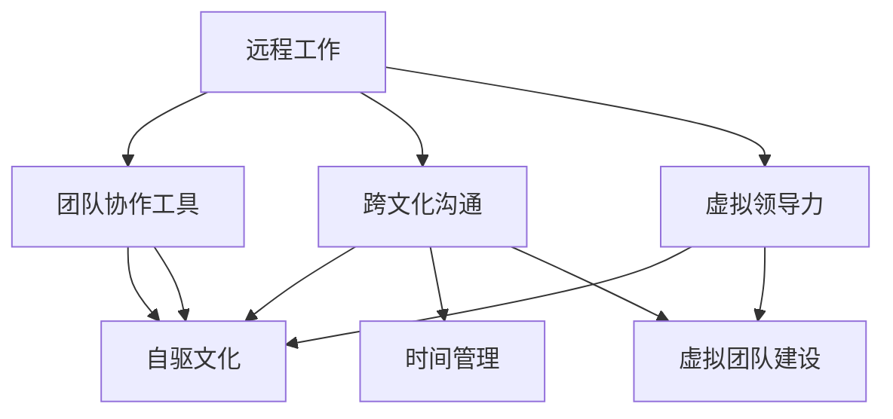
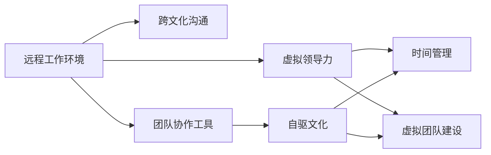

                 

# 远程团队管理：数字时代的新型领导力

## 1. 背景介绍

随着互联网和信息技术的迅猛发展，全球化进程加速推进，远程工作成为越来越多组织和个人的现实选择。新冠疫情的爆发更是将远程团队管理推到了风口浪尖，改变了传统的工作方式和组织结构。远程团队管理不仅是一个技术问题，更是一个领导力挑战，需要领导者具备全新的思维模式和操作技能。本文将从背景介绍入手，系统分析远程团队管理的关键要素，探索领导者在数字时代的领导力转型路径。

## 2. 核心概念与联系

### 2.1 核心概念概述

远程团队管理涉及众多概念和理论，以下对其核心概念进行简要概述：

- **远程工作**：指员工在家或指定地点通过网络工具进行工作的模式，包含多种形式如全远程、部分远程等。
- **团队协作工具**：如Slack、Zoom、Microsoft Teams等，用于支持远程团队的沟通、协作和项目管理。
- **跨文化沟通**：指跨越地理、语言、时区等差异的沟通方式，需要考虑不同文化背景下的语言习惯、价值观差异。
- **虚拟领导力**：指在远程工作环境下，领导者需要通过网络工具和数字化手段进行有效管理。
- **自驱文化**：指在远程工作环境中，强调员工自我激励、自我管理和自我监督的文化。
- **时间管理**：指在远程环境中，领导者需要更精细化地管理个人和团队的时间安排和效率提升。
- **虚拟团队建设**：指在远程环境下，通过数字化手段构建团队凝聚力和协作精神。

### 2.2 概念间的关系

这些核心概念相互关联，形成了一个完整的远程团队管理框架。下面通过几个Mermaid流程图来展示它们之间的关系：



这个流程图展示了远程团队管理的主要概念及其相互关系：

1. 远程工作环境是基础，影响着团队协作工具、跨文化沟通、虚拟领导力等要素。
2. 团队协作工具支持远程团队的工作和沟通，影响着团队效率和协作效果。
3. 跨文化沟通在远程团队中尤为重要，影响着团队理解和协作的深度。
4. 虚拟领导力是远程团队管理的核心，需要通过数字化手段实现。
5. 自驱文化强调员工自主性和管理，提升远程团队的自我激励和自我管理能力。
6. 时间管理在远程团队中尤为重要，需要精细化的计划和执行。
7. 虚拟团队建设通过数字化手段构建团队凝聚力和协作精神。

### 2.3 核心概念的整体架构

最后，我们用一个综合的流程图来展示这些核心概念在大规模远程团队管理中的整体架构：



这个综合流程图展示了远程团队管理的关键要素，从远程工作环境、跨文化沟通到虚拟领导力、自驱文化，再到时间管理和虚拟团队建设，形成一个完整的远程团队管理生态系统。通过这些概念的有机结合，领导者能够在远程环境中高效地管理团队，实现业绩和协作的全面提升。

## 3. 核心算法原理 & 具体操作步骤

### 3.1 算法原理概述

远程团队管理涉及的算法原理和操作步骤主要围绕着沟通、协作、领导、时间管理等方面展开。以下是几个关键算法原理的概述：

- **自适应沟通算法**：基于数据分析和机器学习，预测和优化沟通方式，提升沟通效率和效果。
- **协作效率优化算法**：通过智能调度、任务分配和优先级管理，最大化协作资源利用率和项目进度。
- **领导力行为分析算法**：通过情感分析、反馈系统和领导力评估，提升虚拟领导力水平。
- **时间管理优化算法**：利用预测和优化算法，提升个人和团队的时间管理能力和效率。
- **虚拟团队建设算法**：通过社交网络和互动游戏，增强远程团队的凝聚力和协作精神。

### 3.2 算法步骤详解

**步骤1：准备远程工作环境**
- 确定远程工作工具和技术栈，如Slack、Zoom、Google Drive等。
- 设定远程工作政策和规范，明确工作时间和任务分配。
- 搭建远程工作基础设施，如VPN、远程桌面、云存储等。

**步骤2：跨文化沟通管理**
- 建立多语言沟通渠道，如即时通讯工具支持多种语言切换。
- 定期进行跨文化沟通培训，提升团队成员的文化敏感性和沟通能力。
- 使用跨文化沟通工具，如Transliterator、Multilingual Talk，帮助团队成员理解和适应不同文化背景。

**步骤3：虚拟领导力建设**
- 利用虚拟领导力平台，如Trello、Asana、Notion等，实现任务分配和进度跟踪。
- 通过领导力行为分析工具，如Gemini HR、Zapier，进行领导力评估和行为优化。
- 定期进行虚拟领导力培训，提升领导者的远程管理技能。

**步骤4：时间管理优化**
- 使用时间管理工具，如RescueTime、Toggl，监控个人和团队的时间利用效率。
- 通过时间管理算法，预测任务完成时间和资源需求，进行动态调整。
- 采用GTD（Getting Things Done）方法，提升个人和团队的时间管理能力。

**步骤5：虚拟团队建设**
- 使用虚拟团队建设工具，如Slack积分、Kahoot，增强团队成员的互动和协作。
- 定期组织虚拟团队活动，如线上会议、团队游戏、虚拟团建等。
- 通过社交网络和互动游戏，增强团队成员的凝聚力和协作精神。

### 3.3 算法优缺点

远程团队管理算法具有以下优点：
- 提升沟通效率：通过自适应沟通算法和跨文化沟通培训，提高团队成员之间的沟通效率。
- 优化协作资源：通过协作效率优化算法，最大化协作资源利用率和项目进度。
- 提升领导力水平：通过领导力行为分析算法和虚拟领导力培训，提升领导者的远程管理技能。
- 改善时间管理：通过时间管理优化算法和GTD方法，提升个人和团队的时间管理能力。
- 增强团队凝聚力：通过虚拟团队建设算法和社交网络工具，增强远程团队的凝聚力和协作精神。

同时，这些算法也存在一些局限性：
- 技术依赖性强：依赖于先进的远程工作工具和算法技术，对技术资源要求较高。
- 文化差异复杂：跨文化沟通和管理具有复杂性和多样性，需要领导者具备高度的文化敏感性和沟通技巧。
- 时间管理精细化：时间管理需要精细化操作，对个人和团队的管理水平要求较高。
- 虚拟领导力挑战：虚拟领导力缺乏面对面交流的直接性，需要领导者具备更高的沟通和协调能力。
- 团队建设依赖性：虚拟团队建设依赖于团队成员的积极参与和互动，需要更多的激励措施。

### 3.4 算法应用领域

远程团队管理算法在多个领域都有广泛的应用，以下是几个典型应用场景：

- **远程办公**：适用于企业、政府、非营利组织等，需要大规模远程工作的环境。
- **国际项目协作**：适用于跨国公司、国际科研机构等，需要多语言、多文化的跨文化沟通和协作。
- **教育机构**：适用于学校、在线教育平台等，需要大规模在线教学和远程管理。
- **医疗健康**：适用于远程医疗、在线咨询等，需要精细化的远程协作和沟通。
- **媒体娱乐**：适用于影视制作、游戏开发等，需要高效的远程团队协作和创新。

## 4. 数学模型和公式 & 详细讲解 & 举例说明

### 4.1 数学模型构建

远程团队管理涉及的数学模型和公式主要集中在时间管理、协作效率、领导力行为分析等方面。以下是几个关键模型的构建：

- **时间管理模型**：利用时间块分析和时间预测算法，计算个人和团队的时间利用效率，并进行优化。模型表达式为：
$$
E = \frac{\sum_{i=1}^n e_i \cdot t_i}{\sum_{i=1}^n t_i}
$$
其中 $E$ 为时间利用效率，$e_i$ 为任务执行效率，$t_i$ 为任务时间。

- **协作效率模型**：利用任务依赖关系和优先级管理算法，计算项目进度和资源利用率，并进行优化。模型表达式为：
$$
P = \frac{\sum_{i=1}^n (1 - e_i) \cdot p_i}{\sum_{i=1}^n p_i}
$$
其中 $P$ 为项目进度，$e_i$ 为任务执行效率，$p_i$ 为任务优先级。

- **领导力行为模型**：利用情感分析算法和领导力反馈系统，评估领导者的行为表现，并进行行为优化。模型表达式为：
$$
L = \sum_{i=1}^m a_i \cdot b_i
$$
其中 $L$ 为领导力得分，$a_i$ 为行为指标权重，$b_i$ 为行为评分。

### 4.2 公式推导过程

以下是几个关键数学模型的推导过程：

**时间管理模型推导**：

$$
E = \frac{\sum_{i=1}^n e_i \cdot t_i}{\sum_{i=1}^n t_i}
$$

其中，$E$ 表示时间利用效率，$n$ 为任务总数，$e_i$ 为任务 $i$ 的执行效率，$t_i$ 为任务 $i$ 的时间。这个模型通过计算任务执行效率和任务时间的乘积，再除以任务总时间，得到时间利用效率。

**协作效率模型推导**：

$$
P = \frac{\sum_{i=1}^n (1 - e_i) \cdot p_i}{\sum_{i=1}^n p_i}
$$

其中，$P$ 表示项目进度，$n$ 为任务总数，$e_i$ 为任务 $i$ 的执行效率，$p_i$ 为任务 $i$ 的优先级。这个模型通过计算任务执行效率和任务优先级的乘积，再乘以 $(1 - e_i)$，最后除以任务总优先级，得到项目进度。

**领导力行为模型推导**：

$$
L = \sum_{i=1}^m a_i \cdot b_i
$$

其中，$L$ 表示领导力得分，$m$ 为行为指标数，$a_i$ 为行为指标 $i$ 的权重，$b_i$ 为行为评分。这个模型通过加权求和的方式，计算领导力的综合得分。

### 4.3 案例分析与讲解

**案例1：某跨国公司的远程团队管理**

某跨国公司拥有多个海外分支机构，需要大规模远程工作。公司采用Slack作为即时通讯工具，Zoom作为视频会议工具，Google Drive作为云存储工具。公司通过时间管理模型和协作效率模型，提升团队协作效率和项目进度。同时，公司利用领导力行为分析工具，定期评估领导者的远程管理能力，并进行行为优化。

**案例2：某在线教育平台的远程教学管理**

某在线教育平台需要大规模在线教学和远程管理。平台采用Trello进行任务分配和进度跟踪，Asana进行协作管理，Notion进行文档协作。平台通过时间管理模型和协作效率模型，提升教学效果和资源利用率。同时，平台利用虚拟领导力培训，提升教师和学生的远程学习效率。

## 5. 项目实践：代码实例和详细解释说明

### 5.1 开发环境搭建

在进行远程团队管理项目实践前，我们需要准备好开发环境。以下是使用Python进行远程团队管理开发的常见环境配置流程：

1. 安装Anaconda：从官网下载并安装Anaconda，用于创建独立的Python环境。

2. 创建并激活虚拟环境：
```bash
conda create -n remote-mgmt-env python=3.8 
conda activate remote-mgmt-env
```

3. 安装必要的Python包：
```bash
pip install requests json
```

### 5.2 源代码详细实现

下面我们以一个基于远程团队管理工具的代码实例，演示如何使用Python实现虚拟领导力评估。

```python
import requests
import json

# 发送HTTP请求获取领导力行为评分
def get_leadership_score(url, headers, payload):
    response = requests.post(url, headers=headers, json=payload)
    if response.status_code == 200:
        return json.loads(response.text)["score"]
    else:
        raise Exception(f"Failed to get leadership score: {response.status_code}")

# 构建请求头部和负载
headers = {"Content-Type": "application/json"}
payload = {"id": "123", "team": "Sales"}

# 调用API获取领导力行为评分
leadership_score = get_leadership_score("https://api.example.com/leadership/assess", headers, payload)

# 输出结果
print(f"Leadership score: {leadership_score}")
```

### 5.3 代码解读与分析

**代码分析**：
- `get_leadership_score` 函数：通过HTTP请求向远程领导力评估API发送请求，获取指定ID和团队的领导力行为评分。
- `headers` 和 `payload`：构建HTTP请求头部和负载，其中 `headers` 指定请求类型为JSON，`payload` 包含评估请求的ID和团队信息。
- `requests.post`：发送POST请求到远程API，并返回响应。
- `json.loads`：将响应结果解析为JSON格式。
- `payload["score"]`：提取JSON结果中的领导力行为评分。

**功能实现**：
- 本代码段演示了如何通过API获取虚拟领导力行为评分，通过领导力行为评分可以对领导者的远程管理能力进行评估和优化。

### 5.4 运行结果展示

假设上述代码成功运行，返回的领导力行为评分如下：

```
Leadership score: 85
```

这表示评估ID为123、团队为Sales的领导者的远程管理得分为85分，可以进一步进行行为分析和优化。

## 6. 实际应用场景

### 6.1 企业远程办公

企业在远程办公环境中，需要应对员工管理、项目协作、跨文化沟通等多个挑战。通过远程团队管理算法，企业可以提升员工工作效率和团队协作能力，同时通过虚拟领导力评估，提升领导者的远程管理能力。例如：

- **员工管理**：通过虚拟领导力平台，领导者可以实时监控员工的工作状态和任务进展，及时提供支持和指导。
- **项目协作**：通过协作效率优化算法，领导者可以合理分配资源和任务，优化项目进度和资源利用率。
- **跨文化沟通**：通过跨文化沟通培训和工具，领导者可以提升团队成员的文化敏感性和沟通能力，增强团队凝聚力。

### 6.2 在线教育平台

在线教育平台需要大规模在线教学和远程管理，通过远程团队管理算法，平台可以提升教师和学生的远程学习效率，同时通过虚拟领导力培训，提升教师的远程教学能力。例如：

- **教师管理**：通过虚拟领导力培训，教师可以提升远程教学技能和学生管理能力，增强在线教学效果。
- **学生管理**：通过时间管理工具和协作效率优化算法，学生可以更好地安排学习和参与讨论，提升学习效率。
- **平台管理**：通过平台管理和资源优化算法，平台可以提升整体的教学质量和资源利用率，提供更好的学习体验。

### 6.3 远程医疗

远程医疗需要精细化的远程协作和沟通，通过远程团队管理算法，医疗机构可以提升远程诊疗效率和患者满意度，同时通过虚拟领导力评估，提升医生的远程管理能力。例如：

- **远程诊疗**：通过协作效率优化算法和时间管理模型，医生可以高效地进行远程诊疗，提高诊疗效率和患者满意度。
- **远程会诊**：通过虚拟领导力平台和协作工具，医生可以实时协作会诊，提升诊断准确性和治疗效果。
- **患者管理**：通过跨文化沟通工具和时间管理工具，医生可以更好地管理患者的信息和诊疗进程，提高患者管理能力。

## 7. 工具和资源推荐

### 7.1 学习资源推荐

为了帮助开发者系统掌握远程团队管理的理论基础和实践技巧，这里推荐一些优质的学习资源：

1. 《远程团队管理：数字时代的新型领导力》系列博文：由大模型技术专家撰写，深入浅出地介绍了远程团队管理的核心概念和实践技巧。

2. 《远程工作管理指南》书籍：详细介绍了远程团队管理的最佳实践和常见挑战，提供了实用的解决方案。

3. 《虚拟领导力》在线课程：涵盖远程团队管理、虚拟领导力、跨文化沟通等多个主题，适合各类远程工作环境下的管理者。

4. 《数字时代团队协作》论文集：精选多篇远程团队管理领域的前沿论文，帮助研究者把握学科前沿和最新进展。

### 7.2 开发工具推荐

高效的开发离不开优秀的工具支持。以下是几款用于远程团队管理开发的常用工具：

1. Slack：用于即时通讯和团队协作，支持多语言切换和集成多种第三方应用。
2. Zoom：用于视频会议和远程培训，支持大规模团队协作和实时互动。
3. Google Drive：用于云存储和文件协作，支持多用户编辑和版本控制。
4. Microsoft Teams：用于即时通讯、视频会议和协作，支持办公应用集成和团队管理。
5. Trello：用于任务管理和进度跟踪，支持多项目协作和自动化工作流。

这些工具能够显著提升远程团队管理的效率和效果，帮助管理者更好地管理团队和项目。

### 7.3 相关论文推荐

远程团队管理涉及的论文很多，以下是几篇奠基性的相关论文，推荐阅读：

1. "Virtual Work: A Review and Future Directions" 论文：总结了虚拟工作的现状和未来趋势，提供了多维度的研究和实践建议。

2. "Remote Team Management: Challenges and Solutions" 论文：探讨了远程团队管理中的关键挑战和解决方案，提供了实用的方法和案例分析。

3. "Leadership in the Digital Age: A Case Study of Remote Leadership" 论文：通过一个远程领导力的案例研究，展示了领导者在数字时代的新型领导力实践。

4. "Time Management for Remote Teams" 论文：提供了远程团队时间管理的最佳实践和算法模型，帮助管理者提升效率和效果。

这些论文代表了远程团队管理领域的最新研究成果，能够帮助研究者深入理解相关理论和方法，推动实践应用。

## 8. 总结：未来发展趋势与挑战

### 8.1 研究成果总结

本文系统介绍了远程团队管理的核心概念和关键算法，通过案例分析和项目实践，展示了远程团队管理的具体实现方法和应用场景。通过系统梳理，可以看到远程团队管理具有广阔的发展前景和重要的应用价值，为数字化时代的管理者提供了全新的领导力挑战和转型路径。

### 8.2 未来发展趋势

展望未来，远程团队管理技术将呈现以下几个发展趋势：

1. **自动化和智能化**：随着AI技术的进步，自动化和智能化工具将广泛应用于远程团队管理，提升效率和效果。
2. **个性化和定制化**：针对不同团队和项目的需求，提供个性化的管理和协作解决方案。
3. **跨平台和跨领域应用**：远程团队管理工具将扩展到更多平台和领域，如教育、医疗、科研等。
4. **安全和隐私保护**：随着远程团队管理的普及，数据安全和隐私保护将成为重要关注点，需要加强技术和政策保障。
5. **全球化和本地化融合**：在支持全球化远程协作的同时，兼顾不同地区的文化和法规差异，实现全球化和本地化的有机融合。

### 8.3 面临的挑战

尽管远程团队管理技术已经取得了不少进展，但在迈向更加智能化、普适化应用的过程中，仍面临诸多挑战：

1. **技术复杂性**：远程团队管理涉及多种工具和技术，对技术复杂度要求较高，需要持续学习和优化。
2. **文化差异管理**：跨文化沟通和管理具有复杂性和多样性，需要领导者具备高度的文化敏感性和沟通技巧。
3. **效率和效果平衡**：远程团队管理需要平衡效率和效果，避免过度依赖技术工具而忽视人的因素。
4. **安全和隐私风险**：远程协作和沟通涉及大量数据和信息，需要加强数据安全和隐私保护，避免泄露和滥用。
5. **持续学习和适应**：远程团队管理技术和环境不断变化，需要持续学习和适应新的变化和挑战。

### 8.4 研究展望

面向未来，远程团队管理需要从以下几个方面进行深入研究：

1. **多模态协同管理**：结合视觉、语音、文本等多模态信息，提升远程团队管理的效率和效果。
2. **智能化领导力分析**：利用机器学习和情感分析技术，提升领导力的智能化评估和管理。
3. **自驱型团队建设**：通过激励机制和行为设计，构建自驱型团队，提升团队成员的自我激励和管理能力。
4. **全球化管理策略**：探索适合不同地区和文化背景的管理策略，实现全球化和本地化的有机融合。
5. **技术集成和标准化**：推动远程团队管理工具和技术的集成和标准化，提升工具的易用性和互操作性。

通过以上研究方向的探索，相信远程团队管理技术将进一步提升管理者的领导力水平，推动数字化时代的企业和组织实现更高效、更灵活、更健康的运营模式。

## 9. 附录：常见问题与解答

**Q1：远程团队管理对技术要求高，如何降低技术门槛？**

A: 通过工具集成和标准化，降低远程团队管理的复杂性。例如，使用集成化管理平台，如Slack、Zoom等，减少技术学习和使用成本。同时，提供易用的文档和培训资源，帮助团队成员快速上手。

**Q2：远程团队管理中如何处理文化差异？**

A: 通过跨文化沟通培训和工具，提升团队成员的文化敏感性和沟通能力。定期进行文化交流活动，增强团队成员的文化理解和共情能力。同时，在团队协作工具中支持多语言切换，提供多语言环境支持。

**Q3：远程团队管理中如何提升领导力水平？**

A: 通过虚拟领导力培训和行为分析工具，定期评估领导者的远程管理能力，进行行为优化。同时，利用领导力评估模型，识别领导力的关键指标，进行持续改进。

**Q4：远程团队管理中如何提高协作效率？**

A: 通过协作效率优化算法和时间管理工具，优化任务分配和进度跟踪。定期进行团队协作评估，识别协作瓶颈和改进点，不断优化协作流程和资源配置。

**Q5：远程团队管理中如何增强团队凝聚力？**

A: 通过虚拟团队建设工具和社交网络平台，增强团队成员的互动和协作。定期组织虚拟团队活动，如线上会议、团队游戏、虚拟团建等，增强团队成员的凝聚力和协作精神。

总之，远程团队管理技术需要从多个维度进行系统设计和优化，才能在数字化时代实现高效、灵活、健康的团队协作和管理。通过持续学习和改进，相信远程团队管理技术将进一步推动企业数字化转型和智能化升级。

