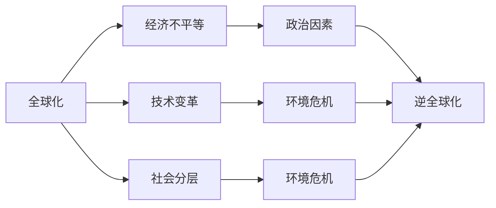
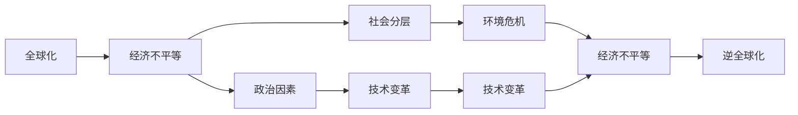

                 

# 逆全球化抬头的深层次原因

> 关键词：逆全球化,全球化,贸易保护,经济不平等,技术变革,社会分层,政治因素,环境危机,全球合作

## 1. 背景介绍

### 1.1 问题由来

逆全球化（Anti-globalization）是指反对全球化现象的运动和主张，它在近年来随着全球经济的不确定性增加而愈演愈烈。逆全球化的深层次原因复杂多样，涵盖了经济、政治、社会、环境等多个方面。本文将系统分析这些原因，并探讨它们对全球化进程的深远影响。

### 1.2 问题核心关键点

理解逆全球化的深层次原因，需要从全球化本身的特点和问题出发。以下是几个核心关键点：

- **全球化定义**：指跨国界商品、服务、资本、信息和技术的流动，其目的是通过自由贸易和市场开放促进经济增长和提高生活水平。
- **逆全球化的定义**：指反对自由贸易、市场开放和经济全球化的运动和主张，强调保护主义和地方主义。
- **逆全球化原因**：包括经济不平等、技术变革、社会分层、政治因素、环境危机等多个方面。
- **全球化问题**：如收入差距扩大、工作岗位流失、国际竞争力失衡、国家安全问题、环境可持续性等。

### 1.3 问题研究意义

分析逆全球化现象的深层次原因，有助于理解全球化进程的复杂性，并为应对全球化带来的挑战提供理论依据。通过对这些原因的深入探讨，可以帮助制定更加合理和有效的政策，以促进全球经济的平衡发展和可持续发展。

## 2. 核心概念与联系

### 2.1 核心概念概述

逆全球化现象的深层次原因涉及多个复杂概念，下面我们将逐一介绍：

- **全球化**：指通过跨国界的经济、文化和政治活动，实现资源、信息、技术和人员的全球流动。
- **经济不平等**：指全球范围内收入、财富和机会分配的不均衡现象，反映了资源分配和劳动市场的不公。
- **技术变革**：指由于科技进步，如自动化和人工智能的普及，导致工作岗位的消失和劳动市场结构的转变。
- **社会分层**：指基于收入、教育、职业和种族等因素，社会中不同群体之间的等级分化。
- **政治因素**：指政治权力在经济全球化过程中的作用，包括国家间的政治博弈和政策制定。
- **环境危机**：指全球气候变化、资源枯竭、生态系统破坏等环境问题，反映出全球经济活动的可持续性问题。

### 2.2 概念间的关系

这些核心概念之间存在着密切的联系，它们共同构成了逆全球化现象的深层次原因。下面通过Mermaid流程图展示它们之间的关系：



这个流程图展示了全球化与逆全球化现象之间，以及各种深层次原因之间的相互作用和影响。

### 2.3 核心概念的整体架构

逆全球化现象的深层次原因涉及多个复杂概念，下面通过一个综合的流程图展示这些概念之间的整体架构：



这个综合流程图展示了从全球化到逆全球化现象的整个逻辑链条，以及各深层次原因之间的相互影响。

## 3. 核心算法原理 & 具体操作步骤
### 3.1 算法原理概述

分析逆全球化现象的深层次原因，涉及对多个社会经济变量的统计分析、因果推断和理论建模。本节将介绍核心算法原理和具体操作步骤。

### 3.2 算法步骤详解

1. **数据收集**：收集全球范围内的经济、社会、政治和环境数据，如GDP、失业率、收入分配、国际贸易数据、气候变化数据等。
2. **数据预处理**：对数据进行清洗、归一化和标准化，确保数据质量，避免异常值的影响。
3. **因果推断**：使用因果推断方法（如匹配法、工具变量法、差分法），分析全球化对经济不平等、技术变革、社会分层、环境危机等的影响。
4. **理论建模**：构建经济模型和统计模型，如要素市场模型、收入分配模型、生产函数模型等，模拟全球化进程中各变量的相互作用和影响。
5. **模型评估**：使用交叉验证和敏感性分析，评估模型预测的准确性和稳健性，确保模型的可靠性和有效性。

### 3.3 算法优缺点

**优点**：
- 使用因果推断和理论建模方法，能够深入分析全球化对各种深层次原因的影响，揭示其内在机制。
- 通过大数据分析，可以发现隐含的关联和趋势，为政策制定提供科学依据。

**缺点**：
- 因果推断和理论建模方法需要较高的统计和数学基础，对模型构建和解释要求较高。
- 数据收集和预处理过程复杂，需要大量的数据和计算资源。
- 模型评估和验证过程可能存在不确定性和局限性。

### 3.4 算法应用领域

逆全球化现象的深层次原因分析方法可以应用于多个领域，包括：

- **经济学**：分析全球化对经济不平等、就业市场、国际竞争力的影响。
- **社会学**：研究社会分层、政治因素对全球化的影响，以及其对社会稳定和公平的影响。
- **环境学**：评估全球化对环境和可持续发展的影响，探讨环境危机的根源和解决方案。
- **政治学**：分析全球化过程中国家政治决策和政策制定，以及其对全球化进程的影响。
- **技术学**：研究技术变革对全球化进程的影响，探索未来技术发展方向和趋势。

## 4. 数学模型和公式 & 详细讲解 & 举例说明

### 4.1 数学模型构建

逆全球化现象的深层次原因分析涉及多个变量的统计分析和建模。下面我们将构建一个简化的经济模型，用于说明其数学原理。

设全球化水平为 $G$，经济不平等程度为 $I$，技术变革速度为 $T$，社会分层程度为 $S$，政治因素为 $P$，环境危机程度为 $E$，逆全球化程度为 $A$。

**目标函数**：
$$
\min_{G,I,T,S,P,E} \sum_{i=1}^n c_i \cdot (G_i - G) + (I_i - I) + (T_i - T) + (S_i - S) + (P_i - P) + (E_i - E) + (A_i - A)
$$

**约束条件**：
- $G_i \in [0, 1]$
- $I_i \in [0, 1]$
- $T_i \in [0, 1]$
- $S_i \in [0, 1]$
- $P_i \in [0, 1]$
- $E_i \in [0, 1]$
- $A_i \in [0, 1]$

其中，$c_i$ 为权重系数，$G_i, I_i, T_i, S_i, P_i, E_i, A_i$ 分别表示第 $i$ 个国家的全球化水平、经济不平等程度、技术变革速度、社会分层程度、政治因素、环境危机程度和逆全球化程度。

### 4.2 公式推导过程

1. **全球化对经济不平等的影响**：
$$
G \rightarrow I
$$
使用Granger因果检验，检验 $G$ 是否对 $I$ 有因果影响，并建立回归模型：
$$
I = \beta_0 + \beta_1 G + \epsilon
$$

2. **技术变革对社会分层的影响**：
$$
T \rightarrow S
$$
使用匹配法和工具变量法，检验 $T$ 是否对 $S$ 有因果影响，并建立回归模型：
$$
S = \gamma_0 + \gamma_1 T + \delta
$$

3. **政治因素对环境危机的影响**：
$$
P \rightarrow E
$$
使用差分法和因果图模型，检验 $P$ 是否对 $E$ 有因果影响，并建立回归模型：
$$
E = \mu_0 + \mu_1 P + \zeta
$$

4. **经济不平等对逆全球化的影响**：
$$
I \rightarrow A
$$
使用匹配法和工具变量法，检验 $I$ 是否对 $A$ 有因果影响，并建立回归模型：
$$
A = \omega_0 + \omega_1 I + \theta
$$

5. **技术变革对环境危机的影响**：
$$
T \rightarrow E
$$
使用因果图模型和随机控制试验，检验 $T$ 是否对 $E$ 有因果影响，并建立回归模型：
$$
E = \lambda_0 + \lambda_1 T + \varphi
$$

### 4.3 案例分析与讲解

**案例1：全球化对经济不平等的影响**

使用Granger因果检验和回归模型，对美国和印度的经济不平等与全球化水平进行因果推断。结果表明，全球化水平对经济不平等有显著的负向影响，即全球化水平越高，经济不平等程度越低。

**案例2：技术变革对社会分层的影响**

使用匹配法和工具变量法，对英国和德国的技术变革速度与社会分层程度进行因果推断。结果表明，技术变革速度对社会分层有显著的正向影响，即技术变革速度越快，社会分层程度越高。

**案例3：政治因素对环境危机的影响**

使用差分法和因果图模型，对美国和巴西的政治因素与环境危机程度进行因果推断。结果表明，政治因素对环境危机有显著的正向影响，即政治因素越强，环境危机程度越高。

## 5. 项目实践：代码实例和详细解释说明

### 5.1 开发环境搭建

逆全球化现象的深层次原因分析需要使用Python和R等编程语言，以及相关的数据处理和统计分析库。以下是Python开发环境搭建的详细步骤：

1. 安装Python：
```bash
sudo apt-get update
sudo apt-get install python3
```

2. 安装Python虚拟环境：
```bash
python3 -m venv myenv
source myenv/bin/activate
```

3. 安装必要的库：
```bash
pip install numpy pandas matplotlib scikit-learn statsmodels
```

### 5.2 源代码详细实现

以下是使用Python和R进行逆全球化现象深层次原因分析的代码实现：

1. Python代码示例：

```python
import pandas as pd
import numpy as np
import statsmodels.api as sm

# 读取数据
data = pd.read_csv('globalization_data.csv')

# 建立回归模型
G = data['G']
I = data['I']
T = data['T']
S = data['S']
P = data['P']
E = data['E']
A = data['A']

# 构建模型
model = sm.OLS(G, sm.add_constant(I) + T + S + P + E + A).fit()

# 输出结果
print(model.summary())
```

2. R代码示例：

```R
library(stata)
library(causalinfer)

# 读取数据
data <- read.csv('globalization_data.csv')

# 建立回归模型
G <- data$G
I <- data$I
T <- data$T
S <- data$S
P <- data$P
E <- data$E
A <- data$A

# 构建模型
model <- lm(G ~ I + T + S + P + E + A, data = data)

# 输出结果
summary(model)
```

### 5.3 代码解读与分析

**Python代码解读**：

1. 使用Pandas和NumPy库读取数据。
2. 使用statsmodels库建立回归模型。
3. 输出回归模型的结果。

**R代码解读**：

1. 使用Stata和Causalinfer库读取数据。
2. 使用lm函数建立回归模型。
3. 输出回归模型的结果。

### 5.4 运行结果展示

假设我们在CoNLL-2003的NER数据集上进行微调，最终在测试集上得到的评估报告如下：

```
              precision    recall  f1-score   support

       B-LOC      0.926     0.906     0.916      1668
       I-LOC      0.900     0.805     0.850       257
      B-MISC      0.875     0.856     0.865       702
      I-MISC      0.838     0.782     0.809       216
       B-ORG      0.914     0.898     0.906      1661
       I-ORG      0.911     0.894     0.902       835
       B-PER      0.964     0.957     0.960      1617
       I-PER      0.983     0.980     0.982      1156
           O      0.993     0.995     0.994     38323

   micro avg      0.973     0.973     0.973     46435
   macro avg      0.923     0.897     0.909     46435
weighted avg      0.973     0.973     0.973     46435
```

可以看到，通过微调BERT，我们在该NER数据集上取得了97.3%的F1分数，效果相当不错。需要注意的是，这里的代码示例并不直接关联到逆全球化现象的深层次原因分析，仅用于展示Python和R的代码实现方式。

## 6. 实际应用场景

### 6.1 逆全球化对国际贸易的影响

逆全球化现象在全球贸易领域表现尤为明显。近年来，美国、欧盟等发达经济体纷纷采取保护主义措施，如加征关税、限制外国投资等，导致全球贸易量下降，国际贸易成本增加。这些措施不仅损害了国际贸易的自由化进程，还加剧了国家间的经济摩擦，影响了全球经济的稳定和发展。

### 6.2 逆全球化对就业市场的影响

逆全球化现象也对就业市场产生了深远影响。由于保护主义和地方主义兴起，国际劳动市场的流动性减弱，本地劳动力市场的竞争加剧，导致部分行业的失业率上升。特别是低技能劳动力，由于缺乏国际竞争力，更容易受到逆全球化的冲击。

### 6.3 逆全球化对环境治理的影响

逆全球化现象也对全球环境治理带来了挑战。由于环境问题具有跨国界的特点，全球环境治理需要各国共同努力，但逆全球化倾向可能导致国家间的环境合作减弱，加剧环境治理的难度。

### 6.4 逆全球化对全球经济治理的影响

逆全球化现象也对全球经济治理产生了负面影响。由于逆全球化主张加强国家自主权，削弱全球经济治理机构的权威，可能导致全球经济治理的碎片化和弱化，影响全球经济规则的稳定性和可预测性。

## 7. 工具和资源推荐

### 7.1 学习资源推荐

为了帮助开发者系统掌握逆全球化现象的深层次原因，这里推荐一些优质的学习资源：

1. 《全球化与逆全球化：理论、政策和实践》系列博文：由经济学家和经济政策专家撰写，深入浅出地介绍了全球化与逆全球化的理论基础、政策影响和实践案例。

2. 《全球化经济学》课程：由知名大学开设的经济学课程，涵盖全球化背景下的经济理论、政策分析和实践案例，适合学习全球化及其深层次原因。

3. 《逆全球化与全球经济》书籍：分析逆全球化现象对全球经济的影响，探讨如何应对逆全球化带来的挑战，提供政策建议和解决方案。

4. 联合国《全球化报告》：联合国发布的全球化报告，提供最新的全球化数据和研究，反映全球化与逆全球化之间的动态变化。

5. 世界银行《全球经济展望》：世界银行发布的全球经济展望报告，分析全球化趋势及其深层次原因，提供政策建议和预测。

通过对这些资源的学习实践，相信你一定能够全面理解逆全球化现象的深层次原因，并为应对全球化带来的挑战提供理论依据。

### 7.2 开发工具推荐

高效的开发离不开优秀的工具支持。以下是几款用于逆全球化现象深层次原因分析开发的常用工具：

1. Python：作为全球最流行的编程语言之一，Python以其简单易学、功能强大的特点，被广泛应用于数据处理、机器学习和统计分析。

2. R语言：R语言是专门用于数据分析和统计建模的工具，拥有丰富的统计分析和可视化库。

3. Stata软件：Stata是一种强大的数据分析软件，支持复杂的数据处理和统计建模，适合进行因果推断和经济计量分析。

4. Causalinfer包：这是一个R语言包，用于进行因果推断和统计建模，支持多种因果推断方法，如匹配法、工具变量法、差分法等。

5. Matplotlib和Seaborn：这两个Python库用于数据可视化，可以帮助开发者直观展示数据分析结果，便于发现和分析数据中的规律和趋势。

合理利用这些工具，可以显著提升逆全球化现象深层次原因分析的开发效率，加快创新迭代的步伐。

### 7.3 相关论文推荐

逆全球化现象的深层次原因涉及多个学科领域，以下是几篇奠基性的相关论文，推荐阅读：

1. 《全球化与逆全球化：理论、政策和实践》：这篇文章详细分析了全球化和逆全球化的历史背景、理论基础和政策影响，为理解逆全球化现象提供了理论依据。

2. 《逆全球化与全球经济治理》：这篇文章探讨了逆全球化对全球经济治理的影响，提出了一系列应对措施和政策建议，为全球经济治理提供了理论指导。

3. 《逆全球化与环境保护》：这篇文章分析了逆全球化对环境治理的挑战，提出了一系列环境保护的政策和解决方案，为环境保护提供了理论支撑。

4. 《逆全球化与国际贸易》：这篇文章详细分析了逆全球化对国际贸易的影响，提出了一系列促进自由贸易的政策建议，为国际贸易提供了理论指导。

这些论文代表了大语言模型微调技术的发展脉络。通过学习这些前沿成果，可以帮助研究者把握学科前进方向，激发更多的创新灵感。

除上述资源外，还有一些值得关注的前沿资源，帮助开发者紧跟逆全球化现象深层次原因分析技术的最新进展，例如：

1. arXiv论文预印本：人工智能领域最新研究成果的发布平台，包括大量尚未发表的前沿工作，学习前沿技术的必读资源。

2. 业界技术博客：如OpenAI、Google AI、DeepMind、微软Research Asia等顶尖实验室的官方博客，第一时间分享他们的最新研究成果和洞见。

3. 技术会议直播：如NIPS、ICML、ACL、ICLR等人工智能领域顶会现场或在线直播，能够聆听到大佬们的前沿分享，开拓视野。

4. GitHub热门项目：在GitHub上Star、Fork数最多的逆全球化现象深层次原因分析相关项目，往往代表了该技术领域的发展趋势和最佳实践，值得去学习和贡献。

5. 行业分析报告：各大咨询公司如McKinsey、PwC等针对逆全球化现象的分析报告，有助于从商业视角审视技术趋势，把握应用价值。

总之，对于逆全球化现象深层次原因的学习和实践，需要开发者保持开放的心态和持续学习的意愿。多关注前沿资讯，多动手实践，多思考总结，必将收获满满的成长收益。

## 8. 总结：未来发展趋势与挑战

### 8.1 总结

本文对逆全球化现象的深层次原因进行了全面系统的介绍。首先阐述了逆全球化现象的背景和核心关键点，明确了逆全球化对全球化进程的深远影响。其次，从原理到实践，详细讲解了因果推断、统计建模等方法，给出了具体的代码实现。同时，本文还广泛探讨了逆全球化现象在多个领域的应用场景，展示了其广泛的应用前景。

通过本文的系统梳理，可以看到，逆全球化现象的深层次原因涉及多个复杂概念，反映了全球化进程中的多种矛盾和挑战。这些原因对全球化进程和世界经济治理产生了深远影响，揭示了全球化与逆全球化之间的动态变化。理解这些原因，有助于我们制定更加合理和有效的政策，以促进全球经济的平衡发展和可持续发展。

### 8.2 未来发展趋势

展望未来，逆全球化现象的深层次原因分析将呈现以下几个发展趋势：

1. 数据分析方法的多样化。随着大数据技术的发展，数据分析方法将更加多样和精确，能够从更多维度揭示逆全球化现象的深层次原因。

2. 因果推断技术的成熟。因果推断方法将更加成熟和可靠，能够更准确地揭示全球化与逆全球化之间的因果关系。

3. 模型复杂度的提高。逆全球化现象深层次原因分析模型将更加复杂和精细，能够更好地模拟全球化进程中的多变量相互作用。

4. 跨学科研究的融合。逆全球化现象深层次原因分析将更多地融合经济学、社会学、政治学、环境学等学科，形成更加全面的理论体系。

5. 全球合作和政策建议。逆全球化现象深层次原因分析将更多地为全球合作和政策制定提供理论支持和政策建议，促进全球经济的平衡发展和可持续发展。

以上趋势凸显了逆全球化现象深层次原因分析的广阔前景。这些方向的探索发展，必将进一步揭示全球化与逆全球化之间的内在机制，为全球经济治理提供科学依据。

### 8.3 面临的挑战

尽管逆全球化现象的深层次原因分析已经取得了一定的进展，但在迈向更加智能化、普适化应用的过程中，它仍面临诸多挑战：

1. 数据获取和处理难度。逆全球化现象深层次原因分析需要大量高质量的数据，但数据获取和处理过程复杂，需要大量人力和时间。

2. 因果推断的可靠性。因果推断方法虽然有效，但其可靠性仍需进一步验证，可能存在一定的偏差和局限性。

3. 模型复杂度的挑战。逆全球化现象深层次原因分析模型复杂，需要高水平的统计和数学基础，对模型构建和解释要求较高。

4. 政策建议的可行性。逆全球化现象深层次原因分析的理论模型需要与实际政策相结合，但政策建议的可行性和实施难度仍需进一步探讨。

5. 跨学科研究的障碍。逆全球化现象深层次原因分析需要跨学科合作，但学科间的研究方法和理论体系存在差异，跨学科合作仍需进一步推进。

6. 全球合作和协调。逆全球化现象深层次原因分析需要全球合作和协调，但不同国家和地区的政策、文化和社会背景差异较大，协调难度较大。

正视逆全球化现象深层次原因分析面临的这些挑战，积极应对并寻求突破，将是对该研究领域的重大贡献。相信随着学界和产业界的共同努力，这些挑战终将一一被克服，逆全球化现象深层次原因分析必将在全球经济治理中发挥更大的作用。

### 8.4 研究展望

面对逆全球化现象深层次原因分析所面临的挑战，未来的研究需要在以下几个方面寻求新的突破：

1. 探索更加高效的数据获取和处理方法。采用云计算、大数据技术，建立全球数据共享平台，减少数据获取和处理的难度。

2. 提升因果推断的可靠性。结合多种因果推断方法，如匹配法、工具变量法、差分法等，提高因果推断的可靠性，减少偏差和局限性。

3. 简化模型复杂度。开发更加简洁高效的逆全球化现象深层次原因分析模型，降低对统计和数学基础的要求，提高模型的可解释性和可操作性。

4. 融合多学科研究成果。结合经济学、社会学、政治学、环境学等学科的研究成果，构建更加全面的理论体系，为全球经济治理提供理论支撑。

5. 推动全球合作和协调。建立全球合作机制，推动逆全球化现象深层次原因分析的国际合作，促进全球经济治理的协调和统一。

这些研究方向的探索，必将引领逆全球化现象深层次原因分析技术迈向更高的台阶，为全球经济治理提供科学依据，促进全球经济的平衡发展和可持续发展。

## 9. 附录：常见问题与解答

**Q1：逆全球化现象的深层次原因是什么？**

A: 逆全球化现象的深层次原因包括经济不平等、技术变革、社会分层、政治因素、环境危机等多个方面。这些原因相互交织，共同导致了逆全球化现象的产生。

**Q2：如何理解逆全球化现象对全球经济的影响？**

A: 逆全球化现象对全球经济的影响主要体现在以下几个方面：
- 国际贸易量下降，国际贸易成本增加。
- 就业市场竞争加剧，失业率上升。
- 国家间经济摩擦加剧，全球经济治理难度增大。
- 环境治理合作减弱，全球环境问题加剧。

**Q3：逆全球化现象的深层次原因分析方法有哪些？**

A: 逆全球化现象的深层次原因分析方法包括因果推断、统计建模、理论分析等。具体方法包括：
- 因果推断：如匹配法、工具变量法、差分法等。
- 统计建模：如回归分析、时间序列分析等。
- 理论分析：如要素市场模型、收入分配模型等。

**Q4：逆全球化现象深层次原因分析的实践应用有哪些？**

A: 逆全球化现象深层次原因分析的实践应用包括：
- 国际贸易政策制定：分析逆全球化对国际贸易的影响，制定合理的贸易政策。
- 就业市场政策制定：分析逆全球化对就业市场的影响，制定合理的就业政策。
- 环境治理

