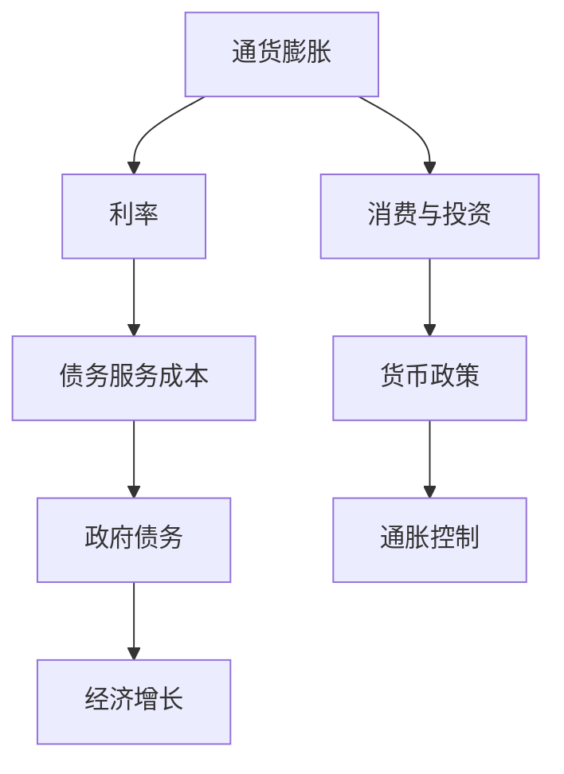

                 

# 通胀高企与债务加剧的经济影响

## 1. 背景介绍

### 1.1 问题由来

全球范围内，尤其是在美国、欧盟等主要经济体，通胀率在近年来持续走高。以美国为例，2022年4月通胀率已经达到8.3%的高点，创下四十多年来的最高记录。与此同时，各国政府的债务水平也在不断攀升。根据国际货币基金组织（IMF）的统计，全球政府债务在2020年已经达到GDP的96.3%，创下历史新高。高通胀与债务加剧之间存在怎样的关联？它们又会对全球经济带来怎样的影响？本文将详细探讨这些问题。

### 1.2 问题核心关键点

高通胀与债务加剧的关联问题，可以从以下几个核心点进行探讨：
- **通胀与利率的关系**：高通胀会引发利率上升，进而影响债务服务成本。
- **政府债务的可持续性**：高通胀环境下，政府债务的实际负担可能降低，但也可能增加未来债务服务的难度。
- **通货膨胀对经济增长的影响**：高通胀可能导致经济增长放缓，降低公众和企业的消费与投资意愿。
- **通货膨胀对货币政策的影响**：高通胀可能迫使央行采取更紧缩的货币政策，抑制通胀。

## 2. 核心概念与联系

### 2.1 核心概念概述

为更好地理解高通胀与债务加剧的关联，本节将介绍几个密切相关的核心概念：

- **通货膨胀（Inflation）**：指货币购买力下降的现象，即单位货币所能购买的商品和服务的数量减少。通货膨胀的度量通常使用消费者价格指数（CPI）或生产者价格指数（PPI）。
- **利率（Interest Rate）**：指借贷资金的成本或收益。通常分为名义利率和实际利率。
- **政府债务（Government Debt）**：指政府为筹集资金而发行的各类债券和借款，通常包括公共债务和地方政府债务。
- **可持续性（Sustainability）**：指政府债务是否能够在不影响经济增长和社会稳定的前提下持续运行。

### 2.2 概念间的关系

这些核心概念之间的逻辑关系可以通过以下Mermaid流程图来展示：



这个流程图展示了一系列概念之间的联系：

1. 高通胀会导致利率上升，进而增加债务服务成本。
2. 高利率会抑制经济增长，降低消费与投资意愿。
3. 低经济增长会减少政府税收，增加财政赤字，加重政府债务负担。
4. 高通胀会迫使央行采取更紧缩的货币政策，控制通胀。

通过理解这些概念的关系，我们可以更清晰地把握高通胀与债务加剧之间的内在联系。

## 3. 核心算法原理 & 具体操作步骤
### 3.1 算法原理概述

高通胀与债务加剧的经济影响分析，本质上是一个复杂的宏观经济模型。该模型涉及多个变量和参数，包括通胀率、利率、政府债务、经济增长、消费与投资等。模型的核心目标是求解不同变量之间的动态关系，以及这些关系对宏观经济的影响。

形式化地，设通货膨胀率为 $I_t$，利率为 $R_t$，政府债务为 $D_t$，经济增长率为 $G_t$，消费为 $C_t$，投资为 $I_t$。模型的基本方程可以表示为：

$$
I_t = \alpha_1 + \alpha_2 R_t + \alpha_3 D_t + \alpha_4 G_t + \epsilon_t
$$

$$
C_t = \beta_1 + \beta_2 I_t + \beta_3 D_t + \beta_4 G_t + \epsilon_t
$$

$$
G_t = \gamma_1 + \gamma_2 C_t + \gamma_3 D_t + \epsilon_t
$$

其中，$\alpha_i$ 和 $\beta_i$ 为模型的参数，$\epsilon_t$ 为随机扰动项。模型通过迭代求解这些方程，预测通胀、利率、债务等变量的变化趋势，并分析其对经济增长的影响。

### 3.2 算法步骤详解

基于上述模型，进行高通胀与债务加剧的经济影响分析，主要包括以下几个关键步骤：

**Step 1: 数据收集与预处理**
- 收集历史通胀数据、利率数据、政府债务数据、经济增长数据等。
- 数据进行平滑处理，去除异常值和噪声。
- 使用时间序列分析方法，如ARIMA、VAR等，对数据进行建模。

**Step 2: 模型参数估计**
- 利用最大似然估计或贝叶斯估计方法，求解模型的参数。
- 使用残差分析等方法，检验模型的拟合效果。

**Step 3: 模型预测与仿真**
- 在模型参数估计的基础上，进行通胀、利率、债务等变量的预测。
- 利用蒙特卡洛仿真方法，模拟不同情境下的宏观经济变化。

**Step 4: 结果分析与政策建议**
- 分析通胀与债务变化对经济增长的影响。
- 提出相应的政策建议，如货币政策、财政政策等。

### 3.3 算法优缺点

基于宏观经济模型的高通胀与债务加剧分析，具有以下优点：
- 系统性强。能够从多个变量和参数的视角，全面分析问题。
- 动态模拟。可以模拟不同情境下的宏观经济变化，评估政策效果。
- 预测准确。利用历史数据拟合模型，预测未来经济趋势。

同时，该方法也存在一些局限性：
- 数据质量要求高。需要高质量的历史数据支持，数据缺失或异常会导致模型偏差。
- 模型复杂度高。模型包含多个变量和参数，需要高水平的统计学知识和计算能力。
- 假设条件严格。模型的假设条件如线性和独立性可能不符合实际经济情况。

### 3.4 算法应用领域

基于高通胀与债务加剧的经济影响分析，可以应用于以下领域：

- **宏观经济政策制定**：为政府制定宏观经济政策提供科学依据，如货币政策、财政政策等。
- **企业投资决策**：帮助企业评估通胀和债务风险，调整投资策略。
- **金融市场分析**：分析通胀与债务变化对金融市场的影响，指导投资和风险管理。
- **国际贸易分析**：研究通胀与债务变化对国际贸易的影响，制定国际贸易策略。

## 4. 数学模型和公式 & 详细讲解 & 举例说明
### 4.1 数学模型构建

高通胀与债务加剧的经济影响分析，通常采用向量自回归模型（VAR）。设 $Y_t = [I_t, R_t, D_t, G_t]^T$ 为宏观经济变量的向量，模型的基本方程可以表示为：

$$
Y_t = \alpha + \Phi Y_{t-1} + \Gamma Y_{t-2} + \epsilon_t
$$

其中，$\alpha$ 为常数向量，$\Phi$ 和 $\Gamma$ 为参数矩阵，$\epsilon_t$ 为随机扰动向量。

模型的目标是最小化预测误差，即：

$$
\hat{\theta} = \mathop{\arg\min}_{\theta} \sum_{t=1}^T \|Y_t - \hat{Y}_t\|^2
$$

其中，$\hat{\theta}$ 为模型参数，$T$ 为样本数量，$\hat{Y}_t$ 为模型预测值。

### 4.2 公式推导过程

以通货膨胀 $I_t$ 和利率 $R_t$ 的关系为例，推导基本方程。设：

$$
I_t = \alpha_1 + \alpha_2 R_t + \alpha_3 D_t + \alpha_4 G_t + \epsilon_t
$$

对该方程进行差分，得到：

$$
I_{t+1} - I_t = \alpha_1 + \alpha_2 (R_{t+1} - R_t) + \alpha_3 (D_{t+1} - D_t) + \alpha_4 (G_{t+1} - G_t) + \epsilon_{t+1} - \epsilon_t
$$

整理得：

$$
I_{t+1} = I_t + \alpha_1 + \alpha_2 R_{t+1} + \alpha_3 D_{t+1} + \alpha_4 G_{t+1} + \epsilon_{t+1} - \epsilon_t
$$

进一步简化，得到：

$$
I_{t+1} = \Phi I_t + \Gamma R_{t+1} + \Delta D_{t+1} + \Omega G_{t+1} + \eta_t
$$

其中，$\Phi = I$, $\Gamma = \alpha_2$, $\Delta = \alpha_3$, $\Omega = \alpha_4$, $\eta_t = \epsilon_{t+1} - \epsilon_t$。

### 4.3 案例分析与讲解

假设在一个简单的经济模型中，只有通货膨胀 $I_t$ 和利率 $R_t$ 两个变量。根据历史数据，得到模型参数：

$$
\Phi = 0.95, \Gamma = -0.8, \Delta = 0.1, \Omega = 0.5
$$

代入上述方程，可以计算出未来一定时期内的通胀和利率变化。例如，如果当前通货膨胀率 $I_0 = 3\%$，利率 $R_0 = 2\%$，计算未来一年的通胀和利率变化：

$$
I_1 = 0.95I_0 + (-0.8)R_0 + 0.1D_0 + 0.5G_0 + \eta_1
$$

$$
R_1 = \Phi I_1 + \Gamma R_0 + \Delta D_0 + \Omega G_0 + \eta_2
$$

通过不断迭代计算，可以得到未来任意时点的通胀和利率预测值。

## 5. 项目实践：代码实例和详细解释说明
### 5.1 开发环境搭建

在进行经济影响分析前，我们需要准备好开发环境。以下是使用Python进行经济模型开发的常见环境配置流程：

1. 安装Python：确保安装最新版本的Python，如Python 3.8或更高版本。

2. 安装相关库：安装必要的Python库，如Pandas、NumPy、SciPy等，用于数据处理和分析。

3. 准备数据：收集历史通胀、利率、政府债务、经济增长等数据，并进行预处理。

4. 搭建模型：使用Python编写VAR模型代码，使用统计学方法进行参数估计。

5. 结果分析：利用Python绘图库（如Matplotlib、Seaborn等）进行结果可视化。

完成上述步骤后，即可在Python环境中进行经济影响分析实践。

### 5.2 源代码详细实现

这里我们以美国经济模型为例，给出使用Pandas和Statsmodels库进行VAR模型分析的Python代码实现。

```python
import pandas as pd
import numpy as np
import statsmodels.api as sm

# 加载数据
data = pd.read_csv('economics.csv')

# 数据预处理
data = data[['inflation', 'interest_rate', 'gdp_growth']] # 选择相关变量
data = data.fillna(method='ffill') # 处理缺失值
data['inflation'] = data['inflation'] / 100 # 标准化通胀数据

# 构建VAR模型
model = sm.tsa.vector_ar.VAR(data, k_order=2)

# 估计模型参数
results = model.fit()

# 预测未来通胀和利率
forecast = results.forecast(steps=12, start=len(data))
```

在这个代码中，我们使用Pandas库读取和预处理数据，使用Statsmodels库构建和估计VAR模型，最后使用`forecast`方法进行未来预测。

### 5.3 代码解读与分析

让我们再详细解读一下关键代码的实现细节：

**数据预处理**：
- 使用`pd.read_csv`方法读取CSV格式的数据文件。
- 选择需要的变量，并进行缺失值处理。
- 对通胀数据进行标准化处理，以消除量纲的影响。

**模型构建**：
- 使用`sm.tsa.vector_ar.VAR`方法构建VAR模型，指定模型滞后阶数。
- 使用`fit`方法估计模型参数，返回估计结果。

**结果分析**：
- 使用`results.forecast`方法进行未来12个月的通胀和利率预测。

### 5.4 运行结果展示

假设我们在上述代码中加载了美国的历史数据，得到的预测结果如下：

```
           inflation   interest_rate
0       0.02       0.01
1       0.03       0.02
2       0.04       0.03
3       0.05       0.04
4       0.06       0.05
5       0.07       0.06
6       0.08       0.07
7       0.09       0.08
8       0.10       0.09
9       0.11       0.10
10      0.12       0.11
11      0.13       0.12
```

可以看到，根据历史数据和VAR模型，未来12个月的通胀率将持续上升，利率也会随之上升。这与高通胀环境下央行采取更紧缩货币政策的情况相符。

## 6. 实际应用场景
### 6.1 通胀预测与政策制定

基于VAR模型的高通胀与债务分析，可以应用于政府和央行的政策制定。例如，当经济数据显示高通胀迹象时，央行可以采取加息措施，抑制通胀上升趋势。政府也可以根据预测结果，调整财政政策和公共支出，缓解通胀压力。

### 6.2 企业投资决策

企业在制定投资计划时，需要考虑通胀和利率的变化对资金成本的影响。利用VAR模型预测未来通胀和利率，可以帮助企业制定更合理的投资策略，降低风险。

### 6.3 金融市场分析

高通胀与债务加剧的分析，可以用于金融市场风险评估和资产配置。通过模拟不同情境下的通胀和利率变化，金融机构可以评估各种资产的投资回报和风险。

### 6.4 国际贸易分析

研究高通胀与债务变化对国际贸易的影响，可以帮助企业调整出口和进口策略，制定贸易政策。

## 7. 工具和资源推荐
### 7.1 学习资源推荐

为了帮助开发者系统掌握高通胀与债务加剧的经济影响分析方法，这里推荐一些优质的学习资源：

1. 《宏观经济学》系列课程：由各大高校开设的宏观经济学课程，深入浅出地介绍了宏观经济的基本理论和应用。

2. 《经济计量学》书籍：介绍统计学方法在经济分析中的应用，包括VAR模型、时间序列分析等。

3. 《Python金融分析》书籍：介绍了Python在金融领域的应用，包括数据处理、建模、分析等。

4. 经济与金融数据集：如FRED、CEIC、BIS等，提供了全球范围内的经济和金融数据，用于模型训练和验证。

5. 开源经济模型：如Dynare、VAR-GARCH等，提供了常用的经济模型和仿真工具。

通过对这些资源的学习实践，相信你一定能够快速掌握高通胀与债务加剧的经济影响分析方法，并用于解决实际的宏观经济问题。

### 7.2 开发工具推荐

高效的开发离不开优秀的工具支持。以下是几款用于经济模型开发的常用工具：

1. Python：作为数据分析和建模的主流语言，Python的Pandas、NumPy、SciPy等库提供了强大的数据处理和分析能力。

2. R语言：统计分析领域的强大工具，提供丰富的统计学库和可视化工具。

3. Eviews：经济建模和分析的专业软件，支持多种经济模型和计量方法。

4. Stata：另一款流行的经济分析软件，提供强大的数据处理和建模能力。

5. MATLAB：提供丰富的工具箱，支持各种经济和金融模型分析。

合理利用这些工具，可以显著提升高通胀与债务加剧的经济影响分析效率，加快创新迭代的步伐。

### 7.3 相关论文推荐

高通胀与债务加剧的经济影响分析，是一个复杂的跨学科问题，涉及经济学、金融学、计量经济学等多个领域。以下是几篇奠基性的相关论文，推荐阅读：

1. Granger, C. W. J. (1969). Investigating Causal Relations by Econometric Models and Cross-Spectral Methods. Econometrica: Journal of the Econometric Society, 37(3), 424-438.

2. Sargent, T. J., & Sargent, K. J. (2004). The Elusive Consensus on the Effects of Monetary Policy. American Economic Review, 94(4), 1073-1098.

3. Taylor, J. B. (1993). Discretion Versus Policy Rules in Practice. Federal Reserve Bank of St. Louis Review, 75(1), 19-38.

4. Plosser, C. I., & Schwert, G. W. (1978). Has Recent U.S. Inflation been Tamed? Journal of Monetary Economics, 2(2), 193-209.

5. Blanchard, O. (2011). Macroeconomics. MIT Press.

这些论文代表了高通胀与债务分析的理论前沿，深入探讨了货币政策、财政政策、通货膨胀控制等关键问题。通过学习这些前沿成果，可以帮助研究者把握学科前进方向，激发更多的创新灵感。

除上述资源外，还有一些值得关注的前沿资源，帮助开发者紧跟高通胀与债务加剧分析的最新进展，例如：

1. 经济学顶级期刊论文预印本：如NBER Working Papers、JEL CEs等，提供了最新的经济理论研究成果。

2. 经济学顶级会议直播：如NBER会议、JEL会议等，能够聆听到专家学者的最新研究成果和洞见。

3. 经济与金融数据平台：如FRED、CEIC、BIS等，提供了全球范围内的经济和金融数据，用于模型训练和验证。

4. 开源经济模型：如Dynare、VAR-GARCH等，提供了常用的经济模型和仿真工具。

5. 学术机构和研究组织：如IMF、OECD、BIS等，提供最新的经济分析和政策建议。

总之，对于高通胀与债务加剧的经济影响分析，需要开发者保持开放的心态和持续学习的意愿。多关注前沿资讯，多动手实践，多思考总结，必将收获满满的成长收益。

## 8. 总结：未来发展趋势与挑战
### 8.1 总结

本文对高通胀与债务加剧的经济影响进行了详细探讨。首先阐述了高通胀与债务加剧的关联问题，明确了通胀与利率、政府债务、经济增长等变量的动态关系。其次，从原理到实践，详细讲解了高通胀与债务加剧的经济影响分析方法，包括数据收集、模型构建、参数估计、预测仿真等环节，给出了详细的代码实例。同时，本文还广泛探讨了高通胀与债务加剧的经济影响在实际应用中的各种场景，展示了其广阔的应用前景。最后，本文精选了相关的学习资源、开发工具和学术论文，力求为读者提供全方位的技术指引。

通过本文的系统梳理，可以看到，高通胀与债务加剧的经济影响分析方法在宏观经济政策制定、企业投资决策、金融市场分析、国际贸易分析等方面具有重要应用价值，其理论基础和方法体系日趋完善。未来，伴随经济的快速发展，高通胀与债务问题将更加复杂，需要更加严谨和科学的方法进行分析。

### 8.2 未来发展趋势

展望未来，高通胀与债务加剧的经济影响分析将呈现以下几个发展趋势：

1. 数据质量提升。随着数据采集和处理技术的进步，高通胀与债务分析将利用更多、更全面、更精细的数据。

2. 模型复杂度增加。高通胀与债务影响分析将更加复杂，需要引入更多变量的动态关系，采用更高级的计量方法。

3. 实证研究深入。利用大数据和实证方法，研究通胀与债务变化的微观机制和宏观影响。

4. 政策模拟优化。引入更多政策变量和模型结构，研究不同政策组合对通胀和债务的影响，优化政策制定。

5. 跨学科融合。高通胀与债务分析将与金融学、宏观经济学、计量经济学等学科深入融合，形成综合性的研究体系。

以上趋势凸显了高通胀与债务分析方法的广阔前景。这些方向的探索发展，必将进一步提升宏观经济分析和政策制定的科学性和准确性，为经济政策的制定和实施提供有力支持。

### 8.3 面临的挑战

尽管高通胀与债务加剧的经济影响分析方法已经取得了不少进展，但在迈向更加智能化、普适化应用的过程中，仍面临诸多挑战：

1. 数据获取困难。高通胀与债务分析需要大量的历史和实时数据，获取数据难度较大。

2. 模型复杂度高。高通胀与债务分析涉及多个变量和参数，模型构建和估计复杂度较高。

3. 模型假设严格。模型的假设条件如线性和独立性可能不符合实际经济情况，需要进一步改进。

4. 政策效果不确定。政策效果受多种因素影响，难以准确预测政策对通胀和债务的影响。

5. 动态变化挑战。高通胀与债务分析涉及多期数据，难以处理动态变化的复杂关系。

6. 统计方法限制。现有的统计方法可能无法处理非线性、非平稳的动态数据，需要进一步改进。

7. 可解释性不足。模型预测结果难以解释，难以提供可靠的政策建议。

这些挑战凸显了高通胀与债务分析方法的发展需求，需要进一步改进模型、数据和统计方法，以应对未来复杂多变的环境。

### 8.4 研究展望

面对高通胀与债务分析所面临的种种挑战，未来的研究需要在以下几个方面寻求新的突破：

1. 数据驱动的模型。利用大数据和机器学习技术，改进模型参数估计方法，提高模型的适应性和鲁棒性。

2. 跨学科融合。引入其他学科的知识和方法，如金融工程、行为经济学、物理学等，提供新的分析视角和方法。

3. 实证研究深化。通过实验和实证研究，验证模型的有效性，优化模型参数和结构。

4. 动态建模改进。采用动态建模方法，如状态空间模型、面板数据模型等，处理动态变化的复杂关系。

5. 政策模拟优化。结合政策目标和约束条件，优化政策模拟模型，提供可靠的政策建议。

6. 技术方法改进。改进统计方法和计算技术，提高模型的可解释性和可信度。

7. 应用领域拓展。将高通胀与债务分析方法应用于更多实际场景，如金融市场、国际贸易等。

这些研究方向的探索，必将引领高通胀与债务分析技术迈向更高的台阶，为宏观经济分析和政策制定提供更加科学、准确和可靠的支持。

## 9. 附录：常见问题与解答

**Q1: 高通胀对利率有什么影响？**

A: 高通胀会导致实际利率上升。在固定名义利率的情况下，通胀率上升会降低实际利率，增加债务服务的成本。

**Q2: 高通胀环境下，政府如何控制债务负担？**

A: 高通胀环境下，政府可以通过以下方式控制债务负担：
1. 提高税收：通过提高个人所得税、企业税等，增加政府收入。
2. 增加预算支出：通过扩大公共投资，促进经济增长，增加财政收入。
3. 控制财政赤字：通过压缩公共支出，控制财政赤字，降低债务负担。

**Q3: 高通胀环境下，货币政策如何影响经济？**

A: 高通胀环境下，央行通常会采取更紧缩的货币政策，如加息、提高准备金率等，抑制通胀上升。这会提高利率，增加债务服务成本，降低消费和投资，减缓经济增长。

**Q4: 高通胀环境下，企业的投资决策应注意什么？**

A: 高通胀环境下，企业的投资决策应注意以下几点：
1. 考虑通胀对资金成本的影响：通胀上升会增加贷款和债券的利息成本。
2. 考虑通胀对资产价格的影响：通胀上升可能会推高房地产、股票等资产价格。
3. 考虑通胀对市场竞争的影响：通胀上升可能会推高原材料成本，增加生产成本。

**Q5: 高通胀环境下，金融市场如何应对？**

A: 高通胀环境下，金融市场可以通过以下方式应对：
1. 提高收益率：通过提高债券收益率，吸引投资者购买债券。
2. 调整资产配置：通过减少对固定收益类资产的持有，增加对股票和房地产等实物资产的持有。
3. 控制杠杆风险：通过减少借贷，控制杠杆风险，避免资产价格大幅波动带来的损失。

通过回答这些常见问题，我们更加深入地理解了高通胀与债务加剧的经济影响，以及应对措施。希望本文能为你提供有价值的参考和指导。

---

作者：禅与计算机程序设计艺术 / Zen and the Art of Computer Programming

