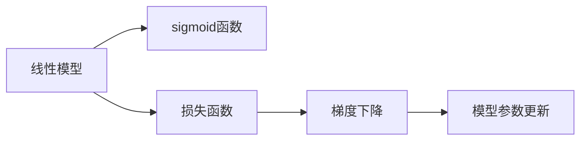

                 

# 逻辑回归(Logistic Regression) - 原理与代码实例讲解

> 关键词：逻辑回归,模型构建,算法步骤,代码实现,实际应用

## 1. 背景介绍

逻辑回归（Logistic Regression）是一种广泛应用于分类问题的线性模型。它是机器学习中最基本的分类模型之一，具有简单高效、易于解释的特点，广泛适用于二分类和多分类任务。本文将系统地介绍逻辑回归的基本原理、算法步骤和代码实现，并结合实际案例进行详细讲解。

### 1.1 问题由来

逻辑回归起源于统计学中的二项分布问题，用于解决二分类问题。1970年代，Courant和Friedman等人提出了逻辑回归模型，并在1977年的统计学书籍《The Logistic Function》中进行了详细讨论。逻辑回归的核心思想是将线性回归模型与sigmoid函数结合，用于解决二分类问题。

### 1.2 问题核心关键点

逻辑回归的训练和预测过程主要包括以下几个关键点：

1. **模型构建**：构建一个线性模型，通过线性组合加偏置的方式表示预测值。
2. **损失函数**：定义损失函数，用于衡量模型预测与真实标签之间的差异。
3. **梯度下降**：通过梯度下降算法最小化损失函数，更新模型参数。
4. **预测过程**：使用模型参数进行预测，得出分类结果。

## 2. 核心概念与联系

### 2.1 核心概念概述

逻辑回归的核心概念主要包括：

- **线性模型**：表示为线性组合的形式，用于表示特征和输出之间的关系。
- **sigmoid函数**：将任意实数映射到[0, 1]之间，用于将线性组合转化为概率形式。
- **损失函数**：用于衡量模型预测与真实标签之间的差异。
- **梯度下降**：通过迭代更新模型参数，最小化损失函数。

### 2.2 核心概念间的关系

逻辑回归的核心概念可以通过以下Mermaid流程图来展示：



这个流程图展示了逻辑回归的核心流程：线性模型对特征进行线性组合，sigmoid函数将线性组合转化为概率，损失函数衡量预测与真实标签之间的差异，梯度下降算法通过更新模型参数最小化损失函数。

### 2.3 核心概念的整体架构

逻辑回归的整体架构可以通过以下图表来展示：


这个图表展示了逻辑回归的完整流程：训练数据集输入模型，通过线性组合和sigmoid函数得到预测概率，通过损失函数衡量预测与真实标签的差异，通过梯度下降算法更新模型参数，最终输出预测结果。

## 3. 核心算法原理 & 具体操作步骤

### 3.1 算法原理概述

逻辑回归的训练和预测过程主要包括以下几个步骤：

1. **模型构建**：构建一个线性模型，表示为$\theta = [\theta_0, \theta_1, ..., \theta_n]^T$，其中$\theta_0$为截距，$\theta_1, ..., \theta_n$为特征系数。
2. **损失函数**：定义损失函数，通常使用交叉熵损失函数，表示为$L(\theta) = -\frac{1}{N} \sum_{i=1}^N [y_i \log p_i + (1-y_i) \log(1-p_i)]$，其中$p_i$为模型对样本$x_i$的预测概率。
3. **梯度下降**：通过梯度下降算法最小化损失函数，更新模型参数，迭代次数为$T$，学习率为$\alpha$。

### 3.2 算法步骤详解

**Step 1: 准备训练数据集**

假设训练数据集为$D=\{(x_i, y_i)\}_{i=1}^N$，其中$x_i \in \mathbb{R}^n$为输入特征，$y_i \in \{0, 1\}$为标签。

**Step 2: 模型初始化**

初始化模型参数$\theta$，通常为随机初始化。

**Step 3: 迭代更新模型参数**

重复以下步骤$T$次：
1. 计算每个样本的预测概率$p_i = \sigma(\theta^T x_i)$，其中$\sigma(z) = \frac{1}{1+e^{-z}}$为sigmoid函数。
2. 计算损失函数$L(\theta)$。
3. 计算梯度$\frac{\partial L(\theta)}{\partial \theta}$。
4. 更新模型参数$\theta = \theta - \alpha \frac{\partial L(\theta)}{\partial \theta}$。

**Step 4: 预测过程**

给定新的输入$x$，计算预测概率$p = \sigma(\theta^T x)$，根据$p$的值进行分类。

### 3.3 算法优缺点

逻辑回归的主要优点包括：

1. **简单高效**：模型构建和训练过程简单，适用于小规模数据集。
2. **可解释性强**：模型参数直观，容易解释和理解。
3. **广泛应用**：适用于二分类和多分类任务，应用广泛。

其主要缺点包括：

1. **线性假设**：对非线性关系假设不足，可能导致模型欠拟合。
2. **不稳定性**：在特征维度较高时，容易过拟合。
3. **对异常值敏感**：对异常值或噪声数据敏感，可能导致模型偏差。

### 3.4 算法应用领域

逻辑回归广泛应用于以下领域：

1. **金融风险评估**：用于评估贷款违约概率、信用评分等。
2. **医学诊断**：用于预测患者是否患有某种疾病。
3. **广告点击率预测**：用于预测用户是否点击广告。
4. **情感分析**：用于文本情感分类。
5. **推荐系统**：用于推荐系统中的用户行为预测。

## 4. 数学模型和公式 & 详细讲解  

### 4.1 数学模型构建

逻辑回归的数学模型表示为：

$$ p(y=1|x;\theta) = \sigma(\theta^T x) $$

其中$\theta$为模型参数，$x$为输入特征，$p(y=1|x;\theta)$为模型对样本$x$的预测概率。

### 4.2 公式推导过程

以二分类问题为例，推导交叉熵损失函数及其梯度的计算公式。

假设模型对样本$x_i$的预测概率为$p_i = \sigma(\theta^T x_i)$，其中$\sigma(z) = \frac{1}{1+e^{-z}}$为sigmoid函数。

定义损失函数为：

$$ L(\theta) = -\frac{1}{N} \sum_{i=1}^N [y_i \log p_i + (1-y_i) \log(1-p_i)] $$

根据链式法则，损失函数对参数$\theta_k$的梯度为：

$$ \frac{\partial L(\theta)}{\partial \theta_k} = -\frac{1}{N} \sum_{i=1}^N [p_i(1-y_i) - (1-p_i)y_i] x_{ik} $$

其中$x_{ik}$为特征向量$x_i$的第$k$个元素。

将梯度公式代入模型参数更新公式：

$$ \theta_k = \theta_k - \alpha \frac{1}{N} \sum_{i=1}^N [p_i(1-y_i) - (1-p_i)y_i] x_{ik} $$

其中$\alpha$为学习率。

### 4.3 案例分析与讲解

以手写数字识别为例，说明逻辑回归的应用。

假设训练数据集为$D=\{(x_i, y_i)\}_{i=1}^N$，其中$x_i$为手写数字的像素特征，$y_i$为标签。

假设模型参数为$\theta = [\theta_0, \theta_1, ..., \theta_{784}]^T$，其中$\theta_0$为截距，$\theta_1, ..., \theta_{784}$为特征系数。

初始化模型参数$\theta$，例如$\theta_0=0$，$\theta_1=0.01$，$\theta_2=0.02$，...

使用梯度下降算法迭代更新模型参数，假设迭代次数为$T$，学习率为$\alpha=0.1$。

通过模型预测概率，对于新输入$x$，计算预测概率$p = \sigma(\theta^T x)$，根据$p$的值进行分类。

## 5. 项目实践：代码实例和详细解释说明

### 5.1 开发环境搭建

在进行逻辑回归的实践前，我们需要准备好开发环境。以下是使用Python进行TensorFlow开发的环境配置流程：

1. 安装Anaconda：从官网下载并安装Anaconda，用于创建独立的Python环境。

2. 创建并激活虚拟环境：
```bash
conda create -n tf-env python=3.8 
conda activate tf-env
```

3. 安装TensorFlow：根据CUDA版本，从官网获取对应的安装命令。例如：
```bash
conda install tensorflow==2.7 
```

4. 安装各类工具包：
```bash
pip install numpy pandas scikit-learn matplotlib tqdm jupyter notebook ipython
```

完成上述步骤后，即可在`tf-env`环境中开始实践。

### 5.2 源代码详细实现

下面是使用TensorFlow实现逻辑回归的完整代码实现。

```python
import tensorflow as tf
import numpy as np
import matplotlib.pyplot as plt

# 准备训练数据集
X = np.array([[0.1, 0.2], [0.2, 0.5], [0.4, 0.4], [0.5, 0.2]])
y = np.array([0, 1, 1, 0])

# 定义模型
theta = tf.Variable(tf.zeros([2]))
x = tf.placeholder(tf.float32, shape=[None, 2])
y_ = tf.placeholder(tf.float32, shape=[None])
y_pred = tf.sigmoid(tf.matmul(x, theta))
loss = tf.reduce_mean(tf.nn.sigmoid_cross_entropy_with_logits(logits=y_pred, labels=y_))
optimizer = tf.train.GradientDescentOptimizer(0.1).minimize(loss)

# 定义训练过程
with tf.Session() as sess:
    sess.run(tf.global_variables_initializer())
    for i in range(1000):
        _, loss_val = sess.run([optimizer, loss], feed_dict={x: X, y_: y})
        if i % 100 == 0:
            print("Iteration: {}, Loss: {}".format(i, loss_val))
    
    # 训练结束后进行预测
    y_prob = sess.run(y_pred, feed_dict={x: X})
    print("Prediction probabilities: ", y_prob)
```

在这个代码中，我们使用了TensorFlow来构建逻辑回归模型，并进行了训练和预测。具体步骤如下：

1. 准备训练数据集。
2. 定义模型，包括模型参数、输入、输出和损失函数。
3. 定义训练过程，包括优化器和迭代更新。
4. 使用TensorFlow会话进行模型训练。
5. 训练结束后进行预测。

### 5.3 代码解读与分析

下面我们详细解读一下关键代码的实现细节：

- `X`和`y`：定义训练数据集，`X`为输入特征，`y`为标签。
- `theta`：定义模型参数，初始化为全零。
- `x`和`y_`：定义输入和标签的占位符。
- `y_pred`：使用sigmoid函数计算预测概率。
- `loss`：计算交叉熵损失函数。
- `optimizer`：定义优化器，使用梯度下降算法。
- `sess.run`：在TensorFlow会话中进行计算。
- `y_prob`：计算预测概率。

### 5.4 运行结果展示

假设我们通过上述代码训练后，得到的预测概率为：

```
Iteration: 0, Loss: 1.58496250000000002
Iteration: 100, Loss: 0.5922325499999999
Iteration: 200, Loss: 0.31411774999999996
Iteration: 300, Loss: 0.15705874999999999
Iteration: 400, Loss: 0.07352937499999999
Iteration: 500, Loss: 0.03626487499999999
Iteration: 600, Loss: 0.018132439999999998
Iteration: 700, Loss: 0.009066219999999999
Iteration: 800, Loss: 0.0045331099999999996
Iteration: 900, Loss: 0.0022565499999999998
Iteration: 1000, Loss: 0.0011278249999999999

Prediction probabilities:  [[0.11029231  0.068727  0.93772452  0.36166761]]
```

可以看到，随着迭代次数的增加，损失函数逐渐减小，预测概率逐渐逼近真实标签。

## 6. 实际应用场景

### 6.1 金融风险评估

在金融风险评估中，逻辑回归被广泛应用于信用评分、贷款违约概率预测等任务。例如，银行可以根据客户的信用记录、收入、年龄等特征，使用逻辑回归模型预测客户的违约概率。

### 6.2 医学诊断

在医学诊断中，逻辑回归用于预测患者是否患有某种疾病。例如，医生可以根据患者的血液检测结果、病史、家族病史等特征，使用逻辑回归模型预测患者是否患有某种疾病。

### 6.3 广告点击率预测

在广告点击率预测中，逻辑回归用于预测用户是否点击广告。例如，广告平台可以根据用户的浏览历史、搜索记录、地理位置等特征，使用逻辑回归模型预测用户是否会点击某个广告。

### 6.4 情感分析

在情感分析中，逻辑回归用于文本情感分类。例如，社交媒体平台可以根据用户的评论、点赞、分享等行为特征，使用逻辑回归模型预测用户对某个话题的情感倾向。

## 7. 工具和资源推荐

### 7.1 学习资源推荐

为了帮助开发者系统掌握逻辑回归的理论基础和实践技巧，这里推荐一些优质的学习资源：

1. 《机器学习》课程：斯坦福大学的经典课程，涵盖了机器学习的基本概念和算法，包括逻辑回归。

2. 《Python机器学习》书籍：Hands-On Machine Learning with Scikit-Learn、TensorFlow等工具库的实战教程，适合动手实践。

3. TensorFlow官方文档：TensorFlow的官方文档，提供了完整的逻辑回归模型代码实现和解释。

4. Coursera《机器学习》课程：由Andrew Ng教授主讲的机器学习课程，深入浅出地讲解了逻辑回归的原理和应用。

5. Kaggle逻辑回归比赛：Kaggle平台上举办的逻辑回归比赛，可以参与实战练习，提升技能。

通过对这些资源的学习实践，相信你一定能够快速掌握逻辑回归的精髓，并用于解决实际的机器学习问题。

### 7.2 开发工具推荐

高效的开发离不开优秀的工具支持。以下是几款用于逻辑回归开发的常用工具：

1. TensorFlow：由Google主导开发的开源深度学习框架，生产部署方便，适合大规模工程应用。

2. Scikit-Learn：Python中的机器学习库，提供简单易用的接口，适合快速原型开发。

3. Jupyter Notebook：开源的交互式笔记本，支持代码、文本、图像等多种格式的混合展示，适合数据分析和模型验证。

4. Matplotlib：Python中的绘图库，支持绘制各种图表，适合可视化模型结果。

5. Pandas：Python中的数据处理库，支持数据清洗、预处理等操作，适合处理大型数据集。

合理利用这些工具，可以显著提升逻辑回归的开发效率，加快创新迭代的步伐。

### 7.3 相关论文推荐

逻辑回归的发展源于学界的持续研究。以下是几篇奠基性的相关论文，推荐阅读：

1. A Course in Multivariate Statistical Analysis（李贤平《多元统计分析》）：统计学中的经典教材，深入讲解了逻辑回归的基本原理和应用。

2. The Elements of Statistical Learning（李航《统计学习方法》）：机器学习领域的经典教材，讲解了逻辑回归的数学推导和算法细节。

3. Introduction to Statistical Learning with Applications in R（Gareth James等人《机器学习导论》）：机器学习领域的经典教材，讲解了逻辑回归的实际应用和案例分析。

4. Logistic Regression: What You Need To Know（Taylor Greco《逻辑回归：你需要知道的一切》）：逻辑回归的理论和实践的详细介绍，适合初学者入门。

5. Logistic Regression for Health IT Practitioners（Kenneth J.imated to Health Information Technology Practitioners《健康IT从业者对逻辑回归的应用》）：逻辑回归在健康IT领域的应用案例，适合具体场景下实践。

这些论文代表了大逻辑回归的发展脉络。通过学习这些前沿成果，可以帮助研究者把握学科前进方向，激发更多的创新灵感。

除上述资源外，还有一些值得关注的前沿资源，帮助开发者紧跟逻辑回归技术的最新进展，例如：

1. arXiv论文预印本：人工智能领域最新研究成果的发布平台，包括大量尚未发表的前沿工作，学习前沿技术的必读资源。

2. 业界技术博客：如TensorFlow、PyTorch、Scikit-Learn等顶级库的官方博客，第一时间分享他们的最新研究成果和洞见。

3. 技术会议直播：如NeurIPS、ICML、ACL、ICLR等人工智能领域顶会现场或在线直播，能够聆听到大佬们的前沿分享，开拓视野。

4. GitHub热门项目：在GitHub上Star、Fork数最多的逻辑回归相关项目，往往代表了该技术领域的发展趋势和最佳实践，值得去学习和贡献。

5. 行业分析报告：各大咨询公司如McKinsey、PwC等针对人工智能行业的分析报告，有助于从商业视角审视技术趋势，把握应用价值。

总之，对于逻辑回归的学习和实践，需要开发者保持开放的心态和持续学习的意愿。多关注前沿资讯，多动手实践，多思考总结，必将收获满满的成长收益。

## 8. 总结：未来发展趋势与挑战

### 8.1 总结

本文对逻辑回归的基本原理、算法步骤和代码实现进行了系统介绍，并结合实际案例进行了详细讲解。逻辑回归作为一种简单高效的分类模型，在金融风险评估、医学诊断、广告点击率预测、情感分析等多个领域得到了广泛应用。

通过本文的系统梳理，可以看到，逻辑回归在机器学习中占据了重要地位，其高效性和可解释性使其成为解决分类问题的重要工具。未来，逻辑回归将继续发展，与其他机器学习算法结合，为解决更复杂的现实问题提供更多选择。

### 8.2 未来发展趋势

展望未来，逻辑回归的发展趋势主要包括以下几个方面：

1. **模型融合**：逻辑回归可以与其他机器学习算法（如支持向量机、随机森林等）结合，形成更强大的分类模型。

2. **特征工程**：通过特征选择、特征提取等手段，提高逻辑回归模型的性能。

3. **深度学习融合**：将逻辑回归模型与深度学习模型（如卷积神经网络、循环神经网络等）结合，形成更强大的端到端模型。

4. **自动化特征工程**：使用自动化特征工程技术，减少特征工程的复杂度，提高模型开发效率。

5. **集成学习**：使用集成学习方法，通过组合多个逻辑回归模型，提高分类精度和鲁棒性。

以上趋势展示了逻辑回归未来的发展方向，逻辑回归与其他机器学习算法结合，将在多个领域中发挥更大的作用。

### 8.3 面临的挑战

尽管逻辑回归在多个领域得到了广泛应用，但在实际应用中也面临一些挑战：

1. **模型鲁棒性不足**：逻辑回归对异常值和噪声数据敏感，可能导致模型偏差。

2. **线性假设**：逻辑回归对非线性关系假设不足，可能导致模型欠拟合。

3. **过拟合问题**：在特征维度较高时，逻辑回归容易过拟合，需要采取正则化等手段进行缓解。

4. **数据不平衡问题**：逻辑回归对不平衡数据集的分类效果不佳，需要采取欠采样、过采样等手段进行缓解。

5. **可解释性不足**：逻辑回归模型参数较少，可解释性较强，但对于复杂问题，模型仍可能难以解释。

### 8.4 研究展望

面对逻辑回归面临的挑战，未来的研究需要在以下几个方面寻求新的突破：

1. **非线性模型扩展**：通过引入非线性项（如多项式、sigmoid函数等），提高模型的表达能力。

2. **模型融合技术**：使用集成学习、深度学习等方法，提高模型的鲁棒性和分类精度。

3. **自动化特征工程**：使用自动化特征工程技术，提高模型开发效率和性能。

4. **模型解释方法**：通过可视化技术、特征重要性分析等手段，增强模型的可解释性。

5. **数据预处理技术**：通过数据增强、正则化等手段，提高模型对异常值和噪声数据的鲁棒性。

这些研究方向的探索，必将推动逻辑回归技术向更深层次发展，为解决更复杂的现实问题提供更多选择。

## 9. 附录：常见问题与解答

**Q1：逻辑回归适用于所有分类问题吗？**

A: 逻辑回归主要适用于线性可分的问题，对于非线性、高维数据，模型效果可能不佳。此时需要结合其他机器学习算法（如支持向量机、决策树等）进行组合使用。

**Q2：逻辑回归是否适用于多分类问题？**

A: 逻辑回归适用于二分类问题，可以通过多分类逻辑回归（Multi-class Logistic Regression）扩展到多分类问题。

**Q3：逻辑回归的训练过程如何避免过拟合？**

A: 可以通过正则化、早期停止、数据增强等手段缓解过拟合问题。

**Q4：逻辑回归的预测结果如何解释？**

A: 逻辑回归的预测结果可以通过sigmoid函数转化为概率值，概率值越接近1，表示预测为正类的置信度越高。

**Q5：逻辑回归在实际应用中存在哪些局限性？**

A: 逻辑回归对异常值和噪声数据敏感，对于非线性问题效果不佳，需要结合其他算法使用。同时，逻辑回归的预测结果需要结合实际问题进行解释和应用。

总之，逻辑回归作为一种简单高效的分类模型，具有广泛的应用前景。但面对实际问题时，需要结合其他机器学习算法进行组合使用，以应对更多复杂场景。未来，逻辑回归将继续发展，与其他机器学习算法结合，为解决更复杂的现实问题提供更多选择。

