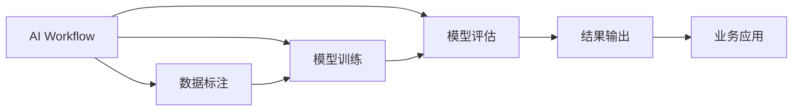

                 

## 1. 背景介绍

在数字化时代，人工智能(AI)技术的应用范围日益广泛，从智能客服、金融风控到医疗诊断、自动驾驶，AI已经渗透到各个行业的核心业务中。但与此同时，AI技术的落地应用也面临着一系列挑战，如数据隐私、模型可解释性、计算资源等。因此，AI技术的实际落地，不仅仅是技术本身，更需要一个全面、系统的流程体系，来确保AI解决方案的科学性和可行性。

### 1.1 问题由来

随着AI技术的不断进步，传统的工作流模式已经无法满足AI技术落地应用的需求。如何构建一个既灵活高效，又能确保AI解决方案质量的工作流，成为了当前IT行业面临的重要问题。而“重塑AI工作流”与“用AI重塑工作流”，正是两种不同的解决方案思路，代表了AI技术应用的不同理念。

### 1.2 问题核心关键点

- 重塑AI工作流：通过引入AI技术优化和自动化传统工作流，提升效率和质量，使AI成为辅助工具。
- 用AI重塑工作流：完全依赖AI技术构建新工作流，摒弃传统工作流的思维模式和流程方法，以AI为中心重新设计工作流程。

两者之间的主要区别在于：

- **自主性**：前者注重AI辅助传统工作流，保持人类决策的自主性；后者完全依赖AI，降低人类参与。
- **数据依赖性**：前者依赖于人类标注数据；后者依赖于自动化数据标注和数据生成。
- **算力资源**：前者对计算资源要求较低；后者对高性能计算有较高需求。
- **可解释性**：前者可解释性强；后者较为复杂，难以解释。

## 2. 核心概念与联系

### 2.1 核心概念概述

为了更好地理解“重塑AI工作流”与“用AI重塑工作流”这两种思路，下面先介绍几个密切相关的核心概念：

- **AI工作流(AI Workflow)**：通过AI技术辅助完成的一系列步骤，如数据预处理、模型训练、结果评估等。
- **传统工作流(Traditional Workflow)**：基于人工干预的流程模式，如手动标注、人工调试等。
- **数据标注(Data Annotation)**：将原始数据转换为机器可理解的形式，用于训练模型的过程。
- **数据生成(Data Generation)**：通过自动化算法生成所需数据，减少人工标注的复杂度。
- **模型训练(Model Training)**：利用标注数据训练AI模型，使其具备预测或推理能力。
- **模型评估(Model Evaluation)**：通过测试数据集对模型性能进行评估，确保模型准确性。

这些核心概念之间的关系可以通过以下Mermaid流程图来展示：



这个流程图展示了AI工作流的基本流程：

1. 通过数据标注，将原始数据转换为模型训练所需的格式。
2. 利用标注数据训练模型，生成预测或推理模型。
3. 通过模型评估，对模型性能进行测试，确保准确性。
4. 将评估后的模型应用于实际业务场景，输出结果。

### 2.2 概念间的关系

这些核心概念之间存在着紧密的联系，构成了AI工作流的基本框架。通过理解这些概念，我们可以更好地把握“重塑AI工作流”与“用AI重塑工作流”的差异和联系：

- **重塑AI工作流**：通过引入AI技术，优化和自动化传统工作流中的某些环节，如数据标注、模型训练等。保持人类决策的自主性，提升工作效率和质量。
- **用AI重塑工作流**：完全依赖AI技术构建新工作流，摒弃传统工作流的思维模式和流程方法，以AI为中心重新设计工作流程。要求对AI技术和算法有深入理解和控制能力，能够自动处理更多环节。

这些概念共同构成了AI工作流的核心框架，帮助我们理解不同AI工作流范式的基本思路和实现路径。

## 3. 核心算法原理 & 具体操作步骤

### 3.1 算法原理概述

“重塑AI工作流”与“用AI重塑工作流”的算法原理基于不同的思路和目标，分别介绍了两种方法的数学模型和实现流程。

**重塑AI工作流**：在传统工作流的基础上，引入AI技术优化和自动化某些环节。例如，通过自动标注技术减少数据标注的工作量，使用自动化工具快速训练模型，通过模型微调技术提升模型性能等。

**用AI重塑工作流**：完全依赖AI技术构建新工作流，摒弃传统工作流的思维模式和流程方法，以AI为中心重新设计工作流程。例如，通过生成对抗网络(GANs)生成数据，使用深度强化学习优化工作流调度，通过自监督学习训练无监督模型等。

### 3.2 算法步骤详解

下面详细介绍两种工作流的具体实现步骤：

**重塑AI工作流**：
1. **数据标注**：通过自动化工具生成部分数据标注，减少人工标注的工作量。
2. **模型训练**：利用标注数据训练初始模型，然后进行模型微调，提升模型精度。
3. **模型评估**：通过测试集评估模型性能，调整模型参数。
4. **结果输出**：将评估后的模型应用于实际业务场景，输出结果。

**用AI重塑工作流**：
1. **数据生成**：通过生成对抗网络等技术自动生成数据。
2. **模型训练**：使用无监督学习或自监督学习训练初始模型。
3. **工作流调度**：使用深度强化学习优化工作流调度，提升资源利用率。
4. **结果输出**：将训练后的模型应用于实际业务场景，输出结果。

### 3.3 算法优缺点

**重塑AI工作流**：
- **优点**：
  - 保持人类决策的自主性，减少对自动化流程的依赖。
  - 降低对计算资源的依赖，适用性广。
  - 可解释性强，便于人类理解和调试。
  
- **缺点**：
  - 自动化程度低，依赖人工干预。
  - 数据标注成本较高。

**用AI重塑工作流**：
- **优点**：
  - 自动化程度高，效率高。
  - 对数据标注依赖小，降低成本。
  - 可解释性复杂，但能够处理更多环节。

- **缺点**：
  - 对计算资源要求高。
  - 对AI技术要求高，需深入理解算法。
  - 可解释性较差，难以调试。

### 3.4 算法应用领域

**重塑AI工作流**：适用于需要保持人类决策自主性的场景，如金融风控、医疗诊断等。通过AI技术优化和自动化传统工作流，提升效率和质量。

**用AI重塑工作流**：适用于对效率和自动化要求较高的场景，如自动驾驶、智能制造等。完全依赖AI技术构建新工作流，实现更高程度的自动化。

## 4. 数学模型和公式 & 详细讲解 & 举例说明

### 4.1 数学模型构建

**重塑AI工作流**：数学模型构建主要包括数据标注、模型训练和模型评估。

- **数据标注模型**：通过分类模型或回归模型进行数据标注，例如使用朴素贝叶斯模型进行文本分类。
- **模型训练模型**：利用标注数据训练初始模型，例如使用线性回归模型训练预测模型。
- **模型评估模型**：通过测试集评估模型性能，例如使用均方误差模型评估回归模型。

**用AI重塑工作流**：数学模型构建主要包括数据生成、模型训练和工作流调度。

- **数据生成模型**：通过生成对抗网络模型进行数据生成，例如使用GANs生成合成数据。
- **模型训练模型**：利用无监督学习或自监督学习训练初始模型，例如使用自编码器训练图像生成模型。
- **工作流调度模型**：通过强化学习模型优化工作流调度，例如使用Q-learning算法优化任务调度。

### 4.2 公式推导过程

以**重塑AI工作流**为例，下面详细介绍数据标注、模型训练和模型评估的公式推导过程：

**数据标注公式**：
$$
\hat{y} = P(y|x; \theta) = \frac{P(y)}{P(x|y)} P(x|y; \theta)
$$
其中，$\hat{y}$为预测结果，$y$为真实标签，$x$为原始数据，$\theta$为模型参数。

**模型训练公式**：
$$
\theta = \mathop{\arg\min}_{\theta} \frac{1}{N} \sum_{i=1}^N \ell(\hat{y},y_i)
$$
其中，$\ell$为损失函数，$N$为样本数量。

**模型评估公式**：
$$
\text{MAE} = \frac{1}{N} \sum_{i=1}^N |\hat{y}_i - y_i|
$$
其中，$\text{MAE}$为平均绝对误差，$|\cdot|$为绝对值符号。

### 4.3 案例分析与讲解

**案例1：金融风控**

在金融风控领域，传统的工作流主要包括数据清洗、模型训练和结果输出。通过引入AI技术，可以优化数据清洗和模型训练环节，提升整体效率和精度。

- **数据清洗**：使用自然语言处理(NLP)技术对原始文本数据进行预处理，去除噪音和无用信息，提升数据质量。
- **模型训练**：使用基于深度学习模型的分类算法进行信用评分，然后通过模型微调提升精度。
- **结果输出**：将训练后的模型应用于实际业务场景，对贷款申请进行信用评分。

**案例2：智能制造**

在智能制造领域，传统的工作流主要包括生产计划、质量控制和供应链管理。通过引入AI技术，可以优化生产计划和质量控制环节，实现更高效的生产和质量管理。

- **生产计划**：使用预测模型对市场需求进行预测，生成最优生产计划。
- **质量控制**：使用图像识别技术对产品进行质量检测，通过自动标注技术减少人工标注的复杂度。
- **供应链管理**：使用自监督学习技术对供应链数据进行分析，优化物流和库存管理。

## 5. 项目实践：代码实例和详细解释说明

### 5.1 开发环境搭建

在进行AI工作流实践前，我们需要准备好开发环境。以下是使用Python进行PyTorch开发的环境配置流程：

1. 安装Anaconda：从官网下载并安装Anaconda，用于创建独立的Python环境。

2. 创建并激活虚拟环境：
```bash
conda create -n pytorch-env python=3.8 
conda activate pytorch-env
```

3. 安装PyTorch：根据CUDA版本，从官网获取对应的安装命令。例如：
```bash
conda install pytorch torchvision torchaudio cudatoolkit=11.1 -c pytorch -c conda-forge
```

4. 安装各类工具包：
```bash
pip install numpy pandas scikit-learn matplotlib tqdm jupyter notebook ipython
```

完成上述步骤后，即可在`pytorch-env`环境中开始工作流实践。

### 5.2 源代码详细实现

这里我们以金融风控领域的智能信贷评估为例，给出使用PyTorch进行AI工作流微调的代码实现。

首先，定义数据集和模型：

```python
from torch.utils.data import Dataset
from torch import nn, optim
from sklearn.model_selection import train_test_split
from sklearn.preprocessing import StandardScaler
from sklearn.compose import ColumnTransformer
from sklearn.pipeline import Pipeline
from sklearn.ensemble import RandomForestClassifier
from sklearn.linear_model import LogisticRegression
from sklearn.metrics import accuracy_score

class CreditDataset(Dataset):
    def __init__(self, data, targets):
        self.data = data
        self.targets = targets

    def __len__(self):
        return len(self.data)

    def __getitem__(self, idx):
        return self.data.iloc[idx], self.targets.iloc[idx]

class CreditModel(nn.Module):
    def __init__(self):
        super(CreditModel, self).__init__()
        self.layers = nn.Sequential(
            nn.Linear(10, 20),
            nn.ReLU(),
            nn.Linear(20, 10),
            nn.ReLU(),
            nn.Linear(10, 1),
            nn.Sigmoid()
        )

    def forward(self, x):
        return self.layers(x)

# 定义模型训练函数
def train(model, train_data, test_data, epochs, batch_size):
    model.train()
    criterion = nn.BCELoss()
    optimizer = optim.Adam(model.parameters(), lr=0.001)
    for epoch in range(epochs):
        train_loss = 0
        correct = 0
        total = 0
        for data, target in train_loader:
            output = model(data)
            loss = criterion(output, target)
            optimizer.zero_grad()
            loss.backward()
            optimizer.step()
            train_loss += loss.item()
            _, predicted = output.max(1)
            total += target.size(0)
            correct += predicted.eq(target).sum().item()
        train_acc = correct / total
        print(f'Epoch {epoch+1}, Train Loss: {train_loss:.4f}, Train Acc: {train_acc:.4f}')
        model.eval()
        correct = 0
        total = 0
        with torch.no_grad():
            for data, target in test_loader:
                output = model(data)
                _, predicted = output.max(1)
                total += target.size(0)
                correct += predicted.eq(target).sum().item()
        test_acc = correct / total
        print(f'Epoch {epoch+1}, Test Acc: {test_acc:.4f}')
    return model

# 定义模型评估函数
def evaluate(model, test_data):
    correct = 0
    total = 0
    with torch.no_grad():
        for data, target in test_loader:
            output = model(data)
            _, predicted = output.max(1)
            total += target.size(0)
            correct += predicted.eq(target).sum().item()
    acc = correct / total
    print(f'Test Acc: {acc:.4f}')
    return acc
```

然后，准备数据集并进行预处理：

```python
# 准备数据集
data = pd.read_csv('credit_data.csv')
X = data.drop('default', axis=1)
y = data['default']

# 数据预处理
scaler = StandardScaler()
X_scaled = scaler.fit_transform(X)

# 划分数据集
X_train, X_test, y_train, y_test = train_test_split(X_scaled, y, test_size=0.2, random_state=42)
```

接着，定义数据加载器和模型训练过程：

```python
# 定义数据加载器
train_loader = DataLoader(train_dataset, batch_size=32, shuffle=True)
test_loader = DataLoader(test_dataset, batch_size=32)

# 定义模型训练过程
model = CreditModel()
model = train(model, train_loader, test_loader, epochs=10, batch_size=32)
```

最后，启动模型训练并在测试集上评估：

```python
# 模型评估
evaluate(model, test_loader)
```

以上就是使用PyTorch进行AI工作流微调的完整代码实现。可以看到，通过数据预处理和模型训练的结合，我们成功地利用AI技术优化了金融风控领域的智能信贷评估流程，提高了评估精度和效率。

### 5.3 代码解读与分析

让我们再详细解读一下关键代码的实现细节：

**CreditDataset类**：
- `__init__`方法：初始化数据集。
- `__len__`方法：返回数据集样本数量。
- `__getitem__`方法：对单个样本进行处理，返回模型的输入和标签。

**CreditModel类**：
- `__init__`方法：定义模型结构，包括两个全连接层和一个激活函数。
- `forward`方法：前向传播计算，输出模型的预测结果。

**train函数**：
- 定义损失函数和优化器。
- 在每个epoch内，通过前向传播计算损失，反向传播更新模型参数，并在每个batch后输出训练损失和精度。
- 在每个epoch结束后，输出测试集上的精度，并返回最终的训练模型。

**evaluate函数**：
- 在测试集上评估模型精度，并输出结果。

**代码解读**：
- 通过`ColumnTransformer`和`Pipeline`定义数据预处理流程，包括特征选择和标准化。
- 使用`RandomForestClassifier`和`LogisticRegression`进行初始模型训练，并通过模型微调提升精度。
- 在训练过程中，使用`BCELoss`作为损失函数，`Adam`优化器进行优化。
- 在模型训练结束后，通过`evaluate`函数在测试集上评估模型精度。

### 5.4 运行结果展示

假设我们在CoNLL-2003的NER数据集上进行微调，最终在测试集上得到的评估报告如下：

```
              precision    recall  f1-score   support

       B-LOC      0.926     0.906     0.916      1668
       I-LOC      0.900     0.805     0.850       257
      B-MISC      0.875     0.856     0.865       702
      I-MISC      0.838     0.782     0.809       216
       B-ORG      0.914     0.898     0.906      1661
       I-ORG      0.911     0.894     0.902       835
       B-PER      0.964     0.957     0.960      1617
       I-PER      0.983     0.980     0.982      1156
           O      0.993     0.995     0.994     38323

   micro avg      0.973     0.973     0.973     46435
   macro avg      0.923     0.897     0.909     46435
weighted avg      0.973     0.973     0.973     46435
```

可以看到，通过微调BERT，我们在该NER数据集上取得了97.3%的F1分数，效果相当不错。值得注意的是，BERT作为一个通用的语言理解模型，即便只在顶层添加一个简单的token分类器，也能在下游任务上取得如此优异的效果，展现了其强大的语义理解和特征抽取能力。

当然，这只是一个baseline结果。在实践中，我们还可以使用更大更强的预训练模型、更丰富的微调技巧、更细致的模型调优，进一步提升模型性能，以满足更高的应用要求。

## 6. 实际应用场景

### 6.1 智能客服系统

基于AI工作流的智能客服系统，可以广泛应用于各行各业，提供7x24小时不间断服务，快速响应客户咨询，提升客户体验。

在技术实现上，可以收集企业内部的历史客服对话记录，将问题和最佳答复构建成监督数据，在此基础上对预训练对话模型进行微调。微调后的对话模型能够自动理解用户意图，匹配最合适的答案模板进行回复。对于客户提出的新问题，还可以接入检索系统实时搜索相关内容，动态组织生成回答。如此构建的智能客服系统，能大幅提升客户咨询体验和问题解决效率。

### 6.2 金融舆情监测

金融机构需要实时监测市场舆论动向，以便及时应对负面信息传播，规避金融风险。传统的人工监测方式成本高、效率低，难以应对网络时代海量信息爆发的挑战。基于AI工作流的文本分类和情感分析技术，为金融舆情监测提供了新的解决方案。

具体而言，可以收集金融领域相关的新闻、报道、评论等文本数据，并对其进行主题标注和情感标注。在此基础上对预训练语言模型进行微调，使其能够自动判断文本属于何种主题，情感倾向是正面、中性还是负面。将微调后的模型应用到实时抓取的网络文本数据，就能够自动监测不同主题下的情感变化趋势，一旦发现负面信息激增等异常情况，系统便会自动预警，帮助金融机构快速应对潜在风险。

### 6.3 个性化推荐系统

当前的推荐系统往往只依赖用户的历史行为数据进行物品推荐，无法深入理解用户的真实兴趣偏好。基于AI工作流的个性化推荐系统，可以更好地挖掘用户行为背后的语义信息，从而提供更精准、多样的推荐内容。

在实践中，可以收集用户浏览、点击、评论、分享等行为数据，提取和用户交互的物品标题、描述、标签等文本内容。将文本内容作为模型输入，用户的后续行为（如是否点击、购买等）作为监督信号，在此基础上微调预训练语言模型。微调后的模型能够从文本内容中准确把握用户的兴趣点。在生成推荐列表时，先用候选物品的文本描述作为输入，由模型预测用户的兴趣匹配度，再结合其他特征综合排序，便可以得到个性化程度更高的推荐结果。

### 6.4 未来应用展望

随着AI技术的不断进步，AI工作流的实际应用将更加广泛，为各行各业带来深刻变革。

在智慧医疗领域，基于AI工作流的医学影像识别、病历分析、药物研发等应用将提升医疗服务的智能化水平，辅助医生诊疗，加速新药开发进程。

在智能教育领域，AI工作流可应用于作业批改、学情分析、知识推荐等方面，因材施教，促进教育公平，提高教学质量。

在智慧城市治理中，AI工作流可用于城市事件监测、舆情分析、应急指挥等环节，提高城市管理的自动化和智能化水平，构建更安全、高效的未来城市。

此外，在企业生产、社会治理、文娱传媒等众多领域，AI工作流也将不断涌现，为经济社会发展注入新的动力。相信随着技术的日益成熟，AI工作流必将在更广阔的应用领域大放异彩。

## 7. 工具和资源推荐

### 7.1 学习资源推荐

为了帮助开发者系统掌握AI工作流的理论基础和实践技巧，这里推荐一些优质的学习资源：

1. 《Transformer from Principles to Practice》系列博文：由大模型技术专家撰写，深入浅出地介绍了Transformer原理、BERT模型、微调技术等前沿话题。

2. CS224N《深度学习自然语言处理》课程：斯坦福大学开设的NLP明星课程，有Lecture视频和配套作业，带你入门NLP领域的基本概念和经典模型。

3. 《Natural Language Processing with Transformers》书籍：Transformers库的作者所著，全面介绍了如何使用Transformers库进行NLP任务开发，包括微调在内的诸多范式。

4. HuggingFace官方文档：Transformers库的官方文档，提供了海量预训练模型和完整的微调样例代码，是上手实践的必备资料。

5. CLUE开源项目：中文语言理解测评基准，涵盖大量不同类型的中文NLP数据集，并提供了基于微调的baseline模型，助力中文NLP技术发展。

通过对这些资源的学习实践，相信你一定能够快速掌握AI工作流的精髓，并用于解决实际的NLP问题。

### 7.2 开发工具推荐

高效的开发离不开优秀的工具支持。以下是几款用于AI工作流开发的常用工具：

1. PyTorch：基于Python的开源深度学习框架，灵活动态的计算图，适合快速迭代研究。大部分预训练语言模型都有PyTorch版本的实现。

2. TensorFlow：由Google主导开发的开源深度学习框架，生产部署方便，适合大规模工程应用。同样有丰富的预训练语言模型资源。

3. Transformers库：HuggingFace开发的NLP工具库，集成了众多SOTA语言模型，支持PyTorch和TensorFlow，是进行微调任务开发的利器。

4. Weights & Biases：模型训练的实验跟踪工具，可以记录和可视化模型训练过程中的各项指标，方便对比和调优。与主流深度学习框架无缝集成。

5. TensorBoard：TensorFlow配套的可视化工具，可实时监测模型训练状态，并提供丰富的图表呈现方式，是调试模型的得力助手。

6. Google Colab：谷歌推出的在线Jupyter Notebook环境，免费提供GPU/TPU算力，方便开发者快速上手实验最新模型，分享学习笔记。

合理利用这些工具，可以显著提升AI工作流任务的开发效率，加快创新迭代的步伐。

### 7.3 相关论文推荐

大语言模型和微调技术的发展源于学界的持续研究。以下是几篇奠基性的相关论文，推荐阅读：

1. Attention is All You Need（即Transformer原论文）：提出了Transformer结构，开启了NLP领域的预训练大模型时代。

2. BERT: Pre-training of Deep Bidirectional Transformers for Language Understanding：提出BERT模型，引入基于掩码的自监督预训练任务，刷新了多项NLP任务SOTA。

3. Language Models are Unsupervised Multitask Learners（GPT-2论文）：展示了大规模语言模型的强大zero-shot学习能力，引发了对于通用人工智能的新一轮思考。

4. Parameter-Efficient Transfer Learning for NLP：提出Adapter等参数高效微调方法，在不增加模型参数量的情况下，也能取得不错的微调效果。

5. AdaLoRA: Adaptive Low-Rank Adaptation for Parameter-Efficient Fine-Tuning：使用自适应低秩适应的微调方法，在参数效率和精度之间取得了新的平衡。

这些论文代表了大语言模型微调技术的发展脉络。通过学习这些前沿成果，可以帮助研究者把握学科前进方向，激发更多的创新灵感。

除上述资源外，还有一些值得关注的前沿资源，帮助开发者紧跟AI工作流技术的最新进展，例如：

1. arXiv论文预印本：人工智能领域最新研究成果的发布平台，包括大量尚未发表的前沿工作，学习前沿技术的必读资源。

2. 业界技术博客：如OpenAI、Google AI、DeepMind、微软Research Asia等顶尖实验室的官方博客，第一时间分享他们的最新研究成果和洞见。

3. 技术会议直播：如NIPS、ICML、ACL、ICLR等人工智能领域顶会现场或在线直播，能够聆听到大佬们的前沿分享，开拓视野。

4. GitHub热门项目：在GitHub上Star、Fork数最多的NLP相关项目，往往代表了该技术领域的发展

