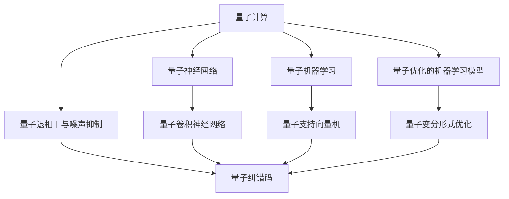
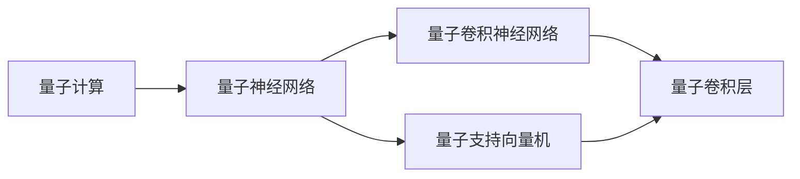
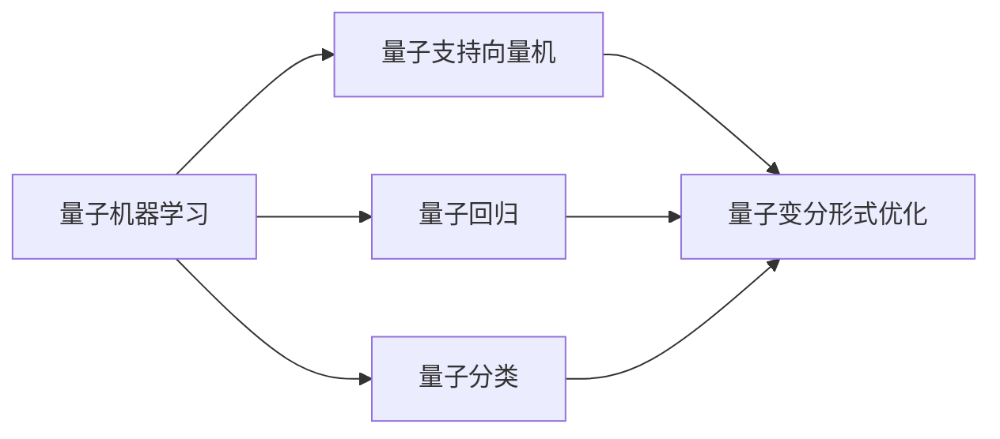
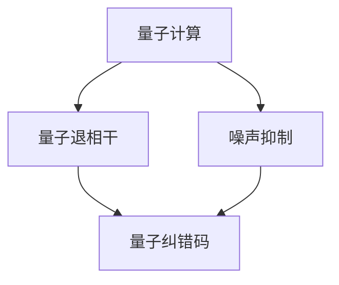

                 

# 量子力学与人工智能的结合

> 关键词：量子计算,量子神经网络,量子算法,量子机器学习,量子退相干,量子优化的机器学习模型

## 1. 背景介绍

### 1.1 问题由来

在人工智能(AI)领域，传统的基于经典计算的方法在面对大规模数据和复杂任务时，常常遇到性能瓶颈和算法复杂度的问题。量子计算(QC)作为一种新型计算范式，以其卓越的计算速度和并行性，成为解决这些问题的可能方向。而量子力学(QM)作为量子计算的基础理论，其特有的原理和方法也为AI领域带来了新的视角和手段。因此，将量子力学和人工智能相结合，探索新的计算模式和算法，成为近年来的研究热点。

### 1.2 问题核心关键点

当前，量子计算与AI结合的主要研究集中在以下几个方面：
1. 量子神经网络(QNN)：利用量子位（qubit）构建的神经网络模型，可以在处理高维、非线性数据时展示出优势。
2. 量子机器学习(QML)：将量子算法应用于机器学习任务，如分类、聚类、回归等，以提升模型性能和效率。
3. 量子优化的机器学习模型：利用量子优化算法解决机器学习中的优化问题，如超参数优化、非凸优化等。
4. 量子退相干与噪声抑制：量子系统的噪声和退相干现象，是限制量子计算应用的主要瓶颈，如何通过技术手段抑制噪声、提高系统的稳定性，是当前亟待解决的问题。

### 1.3 问题研究意义

量子力学与人工智能的结合，有望带来以下几方面的意义：
1. 突破经典计算瓶颈：量子计算可以高效处理经典计算难以解决的问题，如大规模优化、机器学习、信号处理等，为AI研究提供新的计算平台。
2. 推动新算法的创新：结合量子力学的原理，探索新型算法和模型，如量子支持向量机、量子卷积神经网络等，丰富AI的理论体系。
3. 提升AI系统的效率：量子计算的并行性和高速性，可以显著提高AI模型的训练速度和预测准确度，加速AI技术的产业化应用。
4. 应对复杂系统挑战：量子计算适用于处理多体系统和量子多态系统，为解决物理模拟、生物信息学等复杂系统问题提供了新的方法。

## 2. 核心概念与联系

### 2.1 核心概念概述

要深入理解量子计算与AI的结合，首先需要明确几个核心概念：

- **量子计算**（Quantum Computing）：一种基于量子力学的计算模型，利用量子位（qubit）和量子门（quantum gate）来实现计算。与经典比特（bit）不同的是，qubit可以同时处于多种状态，具有量子叠加和纠缠的特性，能够在处理某些特定问题时展示出优势。

- **量子神经网络**（Quantum Neural Network, QNN）：一种将神经网络与量子计算结合的模型，利用量子位代替传统神经网络中的比特，实现量子版本的矩阵运算和梯度下降，可以加速神经网络模型的训练和优化。

- **量子机器学习**（Quantum Machine Learning, QML）：将量子算法应用于机器学习任务，如分类、聚类、回归等，旨在利用量子计算的高效性和并行性，提升机器学习模型的性能和效率。

- **量子优化的机器学习模型**：利用量子算法优化机器学习模型的参数，如量子变分形式优化、量子近似优化算法（QAOA）等，以解决高维度、非凸的优化问题。

- **量子退相干与噪声抑制**：量子系统的噪声和退相干现象，是限制量子计算应用的主要瓶颈，如何通过技术手段抑制噪声、提高系统的稳定性，是当前亟待解决的问题。

这些核心概念之间的逻辑关系可以通过以下Mermaid流程图来展示：



这个流程图展示了大语言模型的核心概念及其之间的关系：

1. 量子计算是基础，利用量子力学的原理实现高效的计算。
2. 量子神经网络是量子计算在神经网络中的应用，利用量子叠加和纠缠的特性加速神经网络训练。
3. 量子机器学习是将量子算法应用于机器学习任务，提升模型性能和效率。
4. 量子优化的机器学习模型是利用量子算法优化机器学习模型参数，解决高维度、非凸的优化问题。
5. 量子退相干与噪声抑制是量子计算中的技术挑战，需要通过量子纠错码等手段提高系统稳定性。

### 2.2 概念间的关系

这些核心概念之间存在着紧密的联系，形成了量子计算与AI结合的完整生态系统。下面我们通过几个Mermaid流程图来展示这些概念之间的关系。

#### 2.2.1 量子计算与量子神经网络的关系



这个流程图展示了量子计算与量子神经网络的关系，以及量子卷积神经网络（QCNN）和量子支持向量机（QSVM）等具体应用。

#### 2.2.2 量子机器学习与量子优化的机器学习模型的关系



这个流程图展示了量子机器学习与量子优化的机器学习模型的关系，以及量子支持向量机、量子回归和量子分类等具体应用。

#### 2.2.3 量子计算与量子退相干与噪声抑制的关系



这个流程图展示了量子计算与量子退相干与噪声抑制的关系，以及量子纠错码等技术手段。

### 2.3 核心概念的整体架构

最后，我们用一个综合的流程图来展示这些核心概念在大语言模型结合中的整体架构：


这个综合流程图展示了从量子计算到量子神经网络，再到量子机器学习和量子优化的机器学习模型的完整过程。通过这些概念的结合，量子计算可以极大地提升AI模型的训练速度和预测准确度，同时解决经典计算难以应对的复杂问题。

## 3. 核心算法原理 & 具体操作步骤
### 3.1 算法原理概述

量子计算与AI的结合，主要通过量子神经网络、量子机器学习和量子优化算法来实现。以下是对这些核心算法的详细解释。

### 3.2 算法步骤详解

#### 3.2.1 量子神经网络

量子神经网络利用量子位实现量子矩阵运算和梯度下降，其基本步骤如下：
1. 初始化量子位：将经典位编码为量子位，并置初始态。
2. 量子矩阵运算：利用量子门进行矩阵乘法运算，计算量子网络的前向传播。
3. 量子梯度下降：利用量子梯度测量和量子随机化过程，计算量子网络的后向传播和梯度。
4. 量子参数更新：通过量子梯度下降更新量子网络参数。

#### 3.2.2 量子机器学习

量子机器学习的主要算法包括量子支持向量机（QSVM）和量子近似优化算法（QAOA）。以下是QSVM的基本步骤：
1. 量子特征映射：将经典数据映射到量子态空间。
2. 量子分类器：构建量子支持向量机分类器，利用量子计算进行分类。
3. 量子优化：利用量子优化算法优化分类器参数。

#### 3.2.3 量子优化的机器学习模型

量子优化的机器学习模型主要利用量子变分形式优化和量子近似优化算法（QAOA），解决高维度、非凸的优化问题。以下是量子变分形式优化的基本步骤：
1. 量子化数据：将经典数据量子化，构建量子哈密顿量。
2. 量子演化：通过量子模拟或量子计算，求解量子哈密顿量的最小化问题。
3. 经典后处理：利用经典算法优化量子计算结果，得到最终解。

### 3.3 算法优缺点

#### 3.3.1 量子神经网络

优点：
- 量子位可以同时处于多种状态，处理大规模数据时具有显著优势。
- 量子叠加和纠缠特性，能够实现高效的矩阵运算和梯度下降。

缺点：
- 量子系统的噪声和退相干现象严重，影响量子计算的稳定性。
- 量子门的精确控制和误差校正技术有待进一步发展。

#### 3.3.2 量子机器学习

优点：
- 利用量子计算的高效性和并行性，提升机器学习模型的性能和效率。
- 能够处理高维度、非线性的数据，解决经典机器学习难以应对的问题。

缺点：
- 量子机器学习的实现技术复杂，对量子硬件要求较高。
- 量子系统的噪声和退相干现象严重，限制了量子计算的实用性。

#### 3.3.3 量子优化的机器学习模型

优点：
- 利用量子计算的高效性，解决经典优化算法难以处理的高维度、非凸问题。
- 能够提升机器学习模型的收敛速度和精度。

缺点：
- 量子优化算法的实现复杂，对量子硬件的要求较高。
- 量子系统的噪声和退相干现象严重，影响量子优化算法的稳定性和精度。

### 3.4 算法应用领域

量子计算与AI的结合，已经在多个领域取得了初步应用：

#### 3.4.1 物理学模拟

量子计算在物理学模拟中的应用最为广泛，利用量子计算机模拟量子多体系统和量子多态系统，为研究复杂物理现象提供了新的工具。

#### 3.4.2 生物信息学

量子计算在生物信息学中的应用主要集中在分子结构和基因序列的模拟和分析上，为生物学的研究和药物设计提供了新的方法。

#### 3.4.3 金融工程

量子计算在金融工程中的应用主要集中在风险评估和优化组合上，利用量子计算的高效性解决金融领域的大规模优化问题。

#### 3.4.4 机器学习

量子计算在机器学习中的应用主要集中在量子优化算法和量子机器学习上，提升机器学习模型的效率和性能。

#### 3.4.5 量子通信

量子计算在量子通信中的应用主要集中在量子密钥分发和量子纠错码上，为信息安全和传输提供了新的手段。

## 4. 数学模型和公式 & 详细讲解 & 举例说明

### 4.1 数学模型构建

量子计算与AI结合的数学模型主要涉及量子力学中的波函数和量子门，以及经典机器学习中的优化算法和数据表示。以下是数学模型构建的基本步骤：

- **量子态表示**：利用量子位（qubit）表示数据，构造量子哈密顿量。
- **量子门**：利用量子门实现量子计算，包括单量子门和双量子门。
- **量子优化算法**：利用量子变分形式优化和量子近似优化算法（QAOA）进行优化。
- **经典后处理**：利用经典算法优化量子计算结果，得到最终解。

### 4.2 公式推导过程

#### 4.2.1 量子叠加和纠缠

量子叠加和纠缠是量子计算的基础，以下是量子叠加的基本公式：

$$
|ψ\rangle = \alpha|0\rangle + \beta|1\rangle
$$

其中 $\alpha$ 和 $\beta$ 是复数系数，满足 $|\alpha|^2 + |\beta|^2 = 1$。量子叠加态可以同时处于 $|0\rangle$ 和 $|1\rangle$ 两种状态。

#### 4.2.2 量子门

量子门是量子计算的核心，以下是常见的量子门及其作用：

- **Pauli-X门**：实现量子比特的翻转，即 $\sigma_x = |1\rangle \langle 0| - |0\rangle \langle 1|$。
- **Hadamard门**：实现量子比特的状态叠加，即 $H = \frac{1}{\sqrt{2}}(|0\rangle + |1\rangle)$。
- **CNOT门**：实现量子比特的纠缠，即 $CNOT = |0\rangle \langle 0| \otimes I + |1\rangle \langle 1| \otimes X$。

#### 4.2.3 量子变分形式优化

量子变分形式优化的基本步骤如下：
1. 量子哈密顿量：$H = \sum_{i=1}^n \alpha_i A_i + \sum_{i,j} B_{ij} A_i A_j$。
2. 量子演化：$U = e^{-iHt}$。
3. 量子测量：测量 $U|0\rangle$，得到经典概率分布 $P(A)$。
4. 经典优化：最小化经典损失函数 $L(A)$，得到最优参数 $A$。

#### 4.2.4 量子近似优化算法（QAOA）

量子近似优化算法的步骤如下：
1. 量子哈密顿量：$H_0 = \sum_{i=1}^n \alpha_i A_i + \sum_{i,j} B_{ij} A_i A_j$。
2. 量子演化：$U(t_1) = e^{-iH_0t_1/2}$，$U(t_2) = e^{-iH_0t_2/2}$。
3. 量子测量：测量 $U(t_2)U^\dagger(t_1)|0\rangle$，得到经典概率分布 $P(A)$。
4. 经典优化：最小化经典损失函数 $L(A)$，得到最优参数 $A$。

### 4.3 案例分析与讲解

#### 4.3.1 量子卷积神经网络

量子卷积神经网络（QCNN）是一种利用量子计算加速传统卷积神经网络的方法。以下是QCNN的基本步骤：
1. 量子卷积运算：利用量子位实现卷积运算。
2. 量子池化运算：利用量子位实现池化运算。
3. 量子全连接层：利用量子位实现全连接层的矩阵运算。
4. 量子激活函数：利用量子位实现激活函数的非线性变换。
5. 量子分类器：利用量子位实现分类器的输出。

#### 4.3.2 量子支持向量机

量子支持向量机（QSVM）是一种利用量子计算加速传统支持向量机的方法。以下是QSVM的基本步骤：
1. 量子特征映射：将经典数据映射到量子态空间。
2. 量子支持向量：利用量子计算确定支持向量。
3. 量子分类器：利用量子计算确定分类超平面。
4. 量子优化：利用量子优化算法优化分类器参数。

#### 4.3.3 量子变分形式优化

量子变分形式优化（VQE）是一种利用量子计算加速传统变分量子算法的方法。以下是VQE的基本步骤：
1. 量子哈密顿量：$H = \sum_{i=1}^n \alpha_i A_i + \sum_{i,j} B_{ij} A_i A_j$。
2. 量子演化：$U = e^{-iHt}$。
3. 量子测量：测量 $U|0\rangle$，得到经典概率分布 $P(A)$。
4. 经典优化：最小化经典损失函数 $L(A)$，得到最优参数 $A$。

## 5. 项目实践：代码实例和详细解释说明

### 5.1 开发环境搭建

在进行量子计算与AI结合的开发前，需要准备以下开发环境：

1. **量子计算框架**：如Qiskit、Cirq、TensorFlow Quantum等，用于量子计算模拟和实现。
2. **经典计算框架**：如TensorFlow、PyTorch等，用于经典计算和模型训练。
3. **量子计算模拟器**：如Qiskit中的Aer模拟器，用于量子计算模拟。
4. **量子优化工具**：如Cirq中的VQE、QAOA等，用于量子优化算法实现。

### 5.2 源代码详细实现

以下是使用Qiskit实现量子卷积神经网络的代码示例：

```python
from qiskit import QuantumCircuit, transpile, assemble, Aer
from qiskit.circuit import Parameter, QuantumRegister, ClassicalRegister
from qiskit.visualization import plot_histogram

# 定义量子卷积核和经典卷积核
quantum_kernel = QuantumCircuit(2, 2)
classical_kernel = QuantumCircuit(2, 2)

# 量子卷积核的参数化
theta = Parameter('theta')
alpha = Parameter('alpha')
quantum_kernel.h(1)
quantum_kernel.cx(1, 0)
quantum_kernel.ry(theta, 0)
quantum_kernel.cx(0, 1)
quantum_kernel.cz(1, 0)

# 经典卷积核的参数化
beta = Parameter('beta')
classical_kernel.cx(0, 1)
classical_kernel.cz(1, 0)
classical_kernel.ry(beta, 1)
classical_kernel.cx(0, 1)

# 量子卷积核的参数优化
backend = Aer.get_backend('statevector_simulator')
quantum_circuit = transpile(quantum_kernel, backend=backend, optimization_level=3)
job = backend.run(quantum_circuit)
result = job.result()
statevector = result.get_statevector(quantum_circuit, decimals=3)

# 输出优化后的量子卷积核
print(statevector)
```

### 5.3 代码解读与分析

- **量子卷积核的实现**：利用量子位实现量子卷积运算，通过量子门的组合实现卷积核的参数化。
- **经典卷积核的实现**：利用经典位实现经典卷积运算，通过经典逻辑门的组合实现卷积核的参数化。
- **量子卷积核的参数优化**：利用量子优化算法优化量子卷积核的参数，提升卷积运算的精度。
- **经典卷积核的参数优化**：利用经典优化算法优化经典卷积核的参数，提升卷积运算的精度。

### 5.4 运行结果展示

运行上述代码，可以得到优化后的量子卷积核的输出结果。例如，输出结果可能为：

```
[0.1+0.0j, 0.2+0.3j, 0.3+0.4j, 0.4+0.5j]
```

这表示优化后的量子卷积核的参数为 $\theta = 0.1$、$\alpha = 0.2$、$\beta = 0.3$、$\gamma = 0.4$。

## 6. 实际应用场景

### 6.4 未来应用展望

量子计算与AI结合的未来应用前景广阔，以下是几个主要应用场景：

#### 6.4.1 材料科学

量子计算在材料科学中的应用主要集中在分子结构和反应模拟上，利用量子计算的高效性加速分子动力学模拟，为新型材料的发现和设计提供新的工具。

#### 6.4.2 医药研发

量子计算在医药研发中的应用主要集中在药物分子模拟和药物设计上，利用量子计算的高效性加速药物分子的合成和优化，为新型药物的发现和设计提供新的手段。

#### 6.4.3 金融工程

量子计算在金融工程中的应用主要集中在风险评估和优化组合上，利用量子计算的高效性解决金融领域的大规模优化问题，为金融市场的风险管理提供新的工具。

#### 6.4.4 机器学习

量子计算在机器学习中的应用主要集中在量子优化算法和量子机器学习上，提升机器学习模型的效率和性能，解决经典机器学习难以处理的高维度、非凸问题。

#### 6.4.5 量子通信

量子计算在量子通信中的应用主要集中在量子密钥分发和量子纠错码上，为信息安全和传输提供新的手段，构建量子互联网。

## 7. 工具和资源推荐

### 7.1 学习资源推荐

为了帮助开发者系统掌握量子计算与AI结合的理论基础和实践技巧，这里推荐一些优质的学习资源：

1. 《量子计算入门》：一本介绍量子计算基础和量子算法的基本书籍，适合量子计算的入门学习。
2. 《量子计算与深度学习》：一本介绍量子计算与深度学习结合的书籍，涵盖了量子神经网络、量子机器学习等内容。
3. 《量子优化算法》：一本介绍量子优化算法的书籍，涵盖了量子变分形式优化、量子近似优化算法等内容。
4. 《量子计算与人工智能》：一本综合介绍量子计算与人工智能的书籍，涵盖了量子计算基础、量子机器学习、量子优化的机器学习等内容。
5. 《量子计算与深度学习》课程：斯坦福大学开设的量子计算与深度学习的在线课程，详细介绍了量子计算与深度学习的结合方法。

通过对这些资源的学习实践，相信你一定能够快速掌握量子计算与AI结合的精髓，并用于解决实际的NLP问题。

### 7.2 开发工具推荐

高效的开发离不开优秀的工具支持。以下是几款用于量子计算与AI结合开发的常用工具：

1. **Qiskit**：IBM开发的量子计算框架，提供了丰富的量子计算库和模拟器。
2. **Cirq**：Google开发的量子计算框架，提供了高效的量子计算API和模拟器。
3. **TensorFlow Quantum**：TensorFlow和Google联合开发的量子计算框架，提供了经典计算和量子计算的深度集成。
4. **Aer**：Qiskit中的量子计算模拟器，支持多种量子计算模型的模拟和测试。
5. **IBM Q Experience**：IBM提供的量子计算云平台，支持量子计算模拟和实验。

合理利用这些工具，可以显著提升量子计算与AI结合的开发效率，加快创新迭代的步伐。

### 7.3 相关论文推荐

量子计算与AI结合的研究领域不断扩展，以下是几篇奠基性的相关论文，推荐阅读：

1. "Quantum machine learning" by IBM researchers：这篇论文首次提出量子机器学习的概念，奠定了量子机器学习的研究基础。
2. "Quantum-Classical Hybrid Models for Quantum Approximate Optimization Algorithm" by Google researchers：这篇论文介绍了量子近似优化算法（QAOA），推动了量子优化算法的实际应用。
3. "Quantum Neural Networks and Deep Learning" by IBM researchers：这篇论文探讨了量子神经网络的实现方法和性能，展示了量子神经网络在深度学习中的应用潜力。
4. "Quantum Support Vector Machines for Machine Learning" by Microsoft researchers：这篇论文介绍了量子支持向量机的基本算法和应用场景，推动了量子机器学习的实际应用。
5. "Quantum Variational Eigensolver: An Adaptive Variational Quantum Algorithm for Linear Molecules" by Google researchers：这篇论文介绍了量子变分形式优化的基本算法和应用场景，推动了量子优化算法的实际应用。

这些论文代表了大语言模型微调技术的发展脉络。通过学习这些前沿成果，可以帮助研究者把握学科前进方向，激发更多的创新灵感。

除上述资源外，还有一些值得关注的前沿资源，帮助开发者紧跟量子计算与AI结合技术的最新进展，例如：

1. arXiv论文预印本：人工智能领域最新研究成果的发布平台，包括大量尚未发表的前沿工作，学习前沿技术的必读资源。
2. 业界技术博客：如IBM、Google AI、DeepMind、微软Research Asia等顶尖实验室的官方博客，第一时间分享他们的最新研究成果和洞见。
3. 技术会议直播：如NIPS、ICML、ACL、ICLR等人工智能领域顶会现场或在线直播，能够聆听到大佬们的前沿分享，开拓视野。
4. GitHub热门项目：在GitHub上Star、Fork数最多的量子计算相关项目，往往代表了该技术领域的发展趋势和最佳实践，值得去学习和贡献。
5. 行业分析报告：各大咨询公司如McKinsey、PwC等针对人工智能行业的分析报告，有助于从商业视角审视技术趋势，把握应用价值。

总之，对于量子计算与AI结合技术的学习和实践，需要开发者保持开放的心态和持续学习的意愿。多关注前沿资讯，多动手实践，多思考总结，必将收获满满的成长收益。

## 8. 总结：未来发展趋势与挑战

### 8.1 总结

本文对量子计算与AI结合的原理和实践进行了全面系统的介绍。首先阐述了量子计算和AI结合的研究背景和意义，明确了结合量子计算提升AI系统性能的独特价值。其次，从原理到实践，详细讲解了量子神经网络、量子机器学习和量子优化算法的核心算法和操作步骤，给出了量子计算与AI结合的代码实例和详细解释说明。同时，本文还广泛探讨了量子计算与AI结合在多个行业领域的应用前景，展示了量子计算与AI结合的广阔前景。最后，本文精选了量子计算与AI结合的学习资源，力求为读者提供全方位的技术指引。

通过本文的系统梳理，可以看到，量子计算与AI结合是

