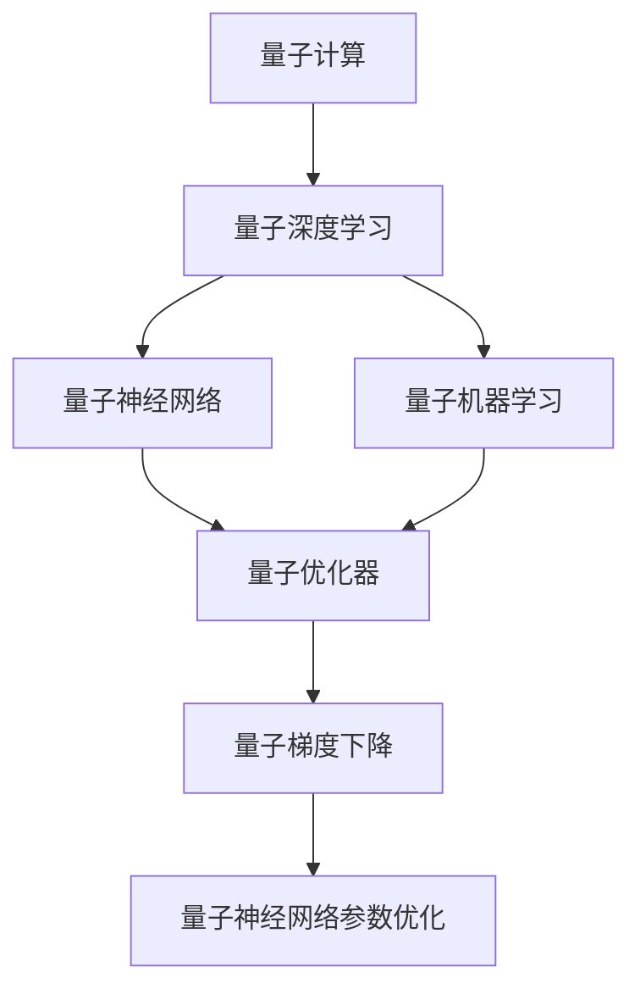
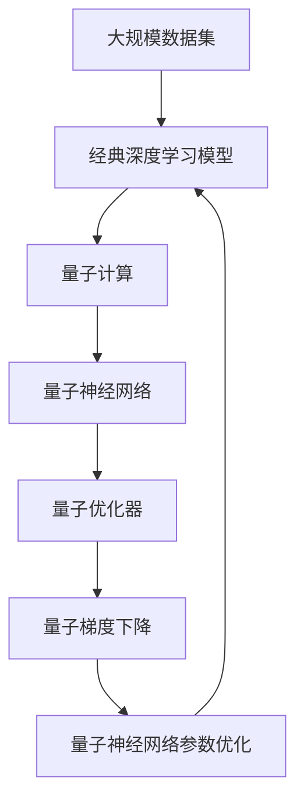

                 

# 量子大模型:量子计算为AI注入新动力

> 关键词：量子计算,量子大模型,深度学习,人工智能,量子机器学习,量子算法,量子深度学习,量子神经网络,量子优化器

## 1. 背景介绍

### 1.1 问题由来
量子计算作为新一代计算范式，其强大的并行计算能力、量子态的纠缠特性，为人工智能(AI)和深度学习(Deep Learning, DL)带来了革命性的影响。近年来，学术界和工业界纷纷布局量子计算与AI的结合，希望能够在保持原有AI算法高效的同时，借助量子计算的力量，大幅度提升计算能力，探索新的算法突破。量子大模型（Quantum Big Models, QBM）就是量子计算与AI深度融合的产物，其核心思想是：在经典深度学习模型的基础上，借助量子计算能力，实现高效、强大的计算和表达能力。

量子大模型以其全新的计算范式和算法思想，受到了广泛关注。IBM、Google、Microsoft等科技巨头相继推出了量子计算平台，支持基于量子计算的AI和深度学习应用开发。量子大模型正在成为AI和深度学习研究的前沿领域，为未来的技术创新和产业发展提供了新的方向和机遇。

### 1.2 问题核心关键点
量子大模型通过结合经典深度学习模型的参数优化和量子计算的强大计算能力，旨在解决以下关键问题：
1. **高效性**：利用量子计算的高并行计算能力，提高模型的训练和推理速度。
2. **可扩展性**：通过量子计算并行性，在更大规模的模型上取得更好的效果。
3. **复杂性**：借助量子计算的纠缠特性，处理更复杂的非线性函数和关系。
4. **容错性**：利用量子纠错技术，提升模型的鲁棒性和稳定性。
5. **安全性**：利用量子计算的独特性，开发更加安全的加密算法和应用。

量子大模型技术的发展，有望推动AI和深度学习应用进入一个新的发展阶段，带来更为强大的计算能力和更为广泛的应用场景。

### 1.3 问题研究意义
研究量子大模型，对于拓展AI和深度学习的应用边界，提升计算效率和模型性能，探索全新的算法突破，具有重要意义：

1. **计算效率提升**：量子计算的高并行性将显著提高模型训练和推理的速度，减少计算资源和时间成本。
2. **模型性能优化**：量子大模型能够处理更复杂的非线性函数和关系，提升模型的表达能力和泛化性能。
3. **算法创新**：量子计算为深度学习和AI算法带来了全新的计算范式，有助于探索新的算法突破，推动AI技术发展。
4. **应用场景拓展**：量子大模型能够在更广泛和复杂的应用场景中发挥作用，如金融预测、药物设计、图像处理等。
5. **产业推动**：量子大模型为AI和深度学习技术的产业化提供了新的方向和可能性，有望加速AI技术在各行业的落地应用。
6. **安全保障**：量子计算提供了一种新的加密手段，可以开发更为安全可靠的AI应用，保障数据隐私和安全。

量子大模型技术的研究和应用，将为AI和深度学习领域带来新的活力，推动AI技术进入更为广阔的发展阶段。

## 2. 核心概念与联系

### 2.1 核心概念概述

为更好地理解量子大模型的基本原理和应用，本节将介绍几个核心概念：

- **量子计算**：利用量子位（qubit）和量子态（quantum state）的特性，实现信息的高效处理和计算，具有高并行性和强大计算能力。
- **量子深度学习**：将量子计算应用于深度学习模型中，通过量子神经网络（QNN）等量子算法，实现高效、强大的计算和表达能力。
- **量子机器学习**：将量子计算应用于机器学习算法中，通过量子优化器、量子支持向量机等量子算法，提升模型的计算效率和性能。
- **量子神经网络**：一种基于量子计算的量子深度学习模型，通过量子位和量子态的叠加和纠缠特性，实现更强的表达能力。
- **量子优化器**：用于优化量子神经网络参数的量子算法，如量子梯度下降（QGD）等，提高模型的训练速度和效果。

这些核心概念之间的联系紧密，构成了量子大模型的计算和优化框架，使其能够在复杂、大规模的计算任务中发挥强大作用。

### 2.2 概念间的关系

这些核心概念之间存在着紧密的联系，形成了量子大模型的完整生态系统。下面我们通过几个Mermaid流程图来展示这些概念之间的关系：



这个流程图展示了大模型在量子计算和经典深度学习之间的联系：

1. 量子计算为量子深度学习提供了强大的计算能力。
2. 量子深度学习利用量子神经网络等量子算法，实现高效的模型训练和推理。
3. 量子机器学习将量子计算应用于经典机器学习算法中，提升计算效率和性能。
4. 量子神经网络是量子深度学习的重要组成部分，通过量子位和量子态的特性，实现更强的表达能力。
5. 量子优化器用于优化量子神经网络参数，提高模型的训练速度和效果。

通过这些概念的交互作用，量子大模型能够充分发挥量子计算的优势，提升深度学习和AI的应用效果。

### 2.3 核心概念的整体架构

最后，我们用一个综合的流程图来展示这些核心概念在大模型中的整体架构：



这个综合流程图展示了从经典深度学习到量子大模型的整体架构：

1. 经典深度学习模型在大规模数据集上进行训练和推理。
2. 量子计算对经典深度学习模型进行增强，提高计算效率和表达能力。
3. 量子神经网络利用量子位和量子态的特性，实现更强的表达能力。
4. 量子优化器通过量子梯度下降等量子算法，优化量子神经网络参数。
5. 量子优化后的经典深度学习模型，返回给经典计算应用，实现高效的AI应用。

通过这个架构，我们可以更清晰地理解量子大模型的计算和优化过程，为后续深入讨论具体的算法和应用奠定基础。

## 3. 核心算法原理 & 具体操作步骤
### 3.1 算法原理概述

量子大模型结合了经典深度学习模型和量子计算的能力，其核心算法原理可以总结如下：

1. **经典深度学习模型**：传统深度学习模型，通过多层神经网络实现特征提取和分类，具备强大的表达能力和泛化性能。
2. **量子计算能力**：量子计算利用量子位和量子态的特性，实现高效、强大的计算能力，提升模型训练和推理速度。
3. **量子深度学习算法**：将量子计算应用于深度学习模型中，通过量子神经网络等量子算法，实现高效、强大的计算和表达能力。
4. **量子优化算法**：利用量子优化器（如量子梯度下降）优化量子神经网络参数，提高模型训练速度和效果。

量子大模型的核心思想是在经典深度学习模型的基础上，借助量子计算的能力，实现更高效的模型训练和推理，提升模型的性能和计算能力。

### 3.2 算法步骤详解

量子大模型的训练和推理过程可以分为以下几个关键步骤：

**Step 1: 准备数据集和模型**

- 准备大规模经典深度学习模型的训练数据集，包含大量经典数据和量子计算数据。
- 选择合适的量子神经网络模型，定义模型的架构和参数。
- 选择适合的经典深度学习优化器，如Adam等。
- 初始化量子神经网络的参数。

**Step 2: 量子计算增强**

- 将经典深度学习模型的输入数据通过量子计算模块处理，生成量子计算特征。
- 将经典深度学习模型的输出数据通过量子计算模块处理，生成量子计算结果。
- 将经典深度学习模型的损失函数通过量子计算模块处理，生成量子计算损失。

**Step 3: 量子优化**

- 通过量子优化器，如量子梯度下降，优化量子神经网络的参数。
- 重复Step 2和Step 3，不断优化量子神经网络的参数，直至收敛。

**Step 4: 经典深度学习训练**

- 将经过量子计算增强和优化的量子神经网络结果，反馈给经典深度学习模型。
- 在经典深度学习模型上继续训练，更新参数。
- 在验证集和测试集上评估模型的性能。

**Step 5: 经典深度学习推理**

- 将训练好的量子大模型，用于实际推理任务。
- 对输入数据进行经典深度学习推理，并返回结果。

以上是量子大模型训练和推理的基本步骤。需要注意的是，量子计算模块和经典深度学习模型之间需要进行有效的接口设计，确保数据和参数的可靠传递和处理。

### 3.3 算法优缺点

量子大模型结合了经典深度学习和量子计算的优点，但也存在一些缺点：

**优点**：

1. **高效性**：利用量子计算的高并行计算能力，提高模型的训练和推理速度，减少计算资源和时间成本。
2. **可扩展性**：通过量子计算并行性，在更大规模的模型上取得更好的效果。
3. **复杂性**：借助量子计算的纠缠特性，处理更复杂的非线性函数和关系。
4. **容错性**：利用量子纠错技术，提升模型的鲁棒性和稳定性。
5. **安全性**：利用量子计算的独特性，开发更加安全的加密算法和应用。

**缺点**：

1. **技术挑战**：量子计算和量子深度学习的技术还不够成熟，实现难度较大。
2. **成本高昂**：目前量子计算硬件成本高，对企业和研究机构的资金和资源要求较高。
3. **量子噪声**：量子计算中的量子噪声问题，可能会影响模型的计算精度和稳定性。
4. **接口设计复杂**：经典深度学习和量子计算之间的接口设计，需要深入理解和协调，才能确保数据和参数的可靠传递和处理。

尽管存在这些缺点，但随着量子计算技术的不断进步，量子大模型有望成为未来AI和深度学习研究的重要方向，带来新的计算范式和算法突破。

### 3.4 算法应用领域

量子大模型已经显示出其独特的优势和潜力，其在多个领域的应用前景广阔：

- **金融预测**：利用量子大模型进行高频交易、风险管理等金融预测任务，提高预测精度和决策速度。
- **药物设计**：利用量子大模型进行药物分子模拟和筛选，加速新药研发过程。
- **图像处理**：利用量子大模型进行图像识别和分类，提升图像处理的准确性和效率。
- **语音识别**：利用量子大模型进行语音特征提取和处理，提升语音识别的准确性和鲁棒性。
- **自然语言处理**：利用量子大模型进行文本分类、情感分析、机器翻译等自然语言处理任务，提高处理效率和效果。
- **量子计算加速**：利用量子大模型进行经典计算任务的加速，提升计算效率和资源利用率。

除了上述这些应用领域，量子大模型还将在更多场景中发挥作用，为各行各业带来变革性影响。

## 4. 数学模型和公式 & 详细讲解 & 举例说明

### 4.1 数学模型构建

量子大模型结合了经典深度学习模型和量子计算的能力，其数学模型可以如下构建：

1. **经典深度学习模型**：假设经典深度学习模型的输入为 $x$，输出为 $y$，损失函数为 $\ell$，优化器为 $O$。
2. **量子计算模块**：假设量子计算模块将输入 $x$ 转化为量子计算特征 $x_q$，将输出 $y$ 转化为量子计算结果 $y_q$，将损失函数 $\ell$ 转化为量子计算损失 $\ell_q$。
3. **量子神经网络**：假设量子神经网络由多个量子层组成，每个量子层由量子位和量子门构成。

数学模型可以表示为：

$$
y = F(x)
$$

其中 $F$ 为经典深度学习模型和量子计算模块的组合函数。

### 4.2 公式推导过程

以下是量子大模型的基本公式推导过程：

**经典深度学习模型**

$$
y = f(Wx + b)
$$

其中 $f$ 为激活函数，$W$ 为权重矩阵，$b$ 为偏置向量。

**量子计算模块**

$$
x_q = U(\text{quantum circuit})(x)
$$

其中 $U$ 为量子电路，$\text{quantum circuit}$ 为量子计算的具体实现。

**量子神经网络**

$$
y_q = F(x_q) = VU(...Ux...)
$$

其中 $V$ 为量子电路的输出层量子门，$...$ 表示多个量子层组成的量子神经网络。

**量子优化器**

$$
\theta_{\text{update}} = O(\theta) = \theta - \eta \nabla_{\theta}\ell_q(y)
$$

其中 $\theta$ 为量子神经网络的参数，$\eta$ 为学习率，$\nabla_{\theta}\ell_q(y)$ 为量子计算损失函数对参数的梯度。

通过上述公式推导，我们可以理解量子大模型的数学模型构建和优化过程。

### 4.3 案例分析与讲解

以量子大模型在图像识别中的应用为例，我们进行详细讲解：

**Step 1: 数据预处理**

- 准备大规模经典深度学习模型的训练数据集，包含大量经典数据和量子计算数据。
- 对数据进行预处理，生成经典深度学习模型和量子计算模型的输入和输出。

**Step 2: 量子计算增强**

- 将经典深度学习模型的输入数据通过量子计算模块处理，生成量子计算特征 $x_q$。
- 将经典深度学习模型的输出数据通过量子计算模块处理，生成量子计算结果 $y_q$。
- 将经典深度学习模型的损失函数通过量子计算模块处理，生成量子计算损失 $\ell_q$。

**Step 3: 量子优化**

- 通过量子优化器，如量子梯度下降，优化量子神经网络的参数 $\theta$。
- 重复Step 2和Step 3，不断优化量子神经网络的参数 $\theta$，直至收敛。

**Step 4: 经典深度学习训练**

- 将经过量子计算增强和优化的量子神经网络结果 $y_q$，反馈给经典深度学习模型。
- 在经典深度学习模型上继续训练，更新参数。
- 在验证集和测试集上评估模型的性能。

**Step 5: 经典深度学习推理**

- 将训练好的量子大模型，用于实际推理任务。
- 对输入数据进行经典深度学习推理，并返回结果。

通过上述步骤，我们可以清晰地理解量子大模型在图像识别任务中的计算和优化过程。

## 5. 项目实践：代码实例和详细解释说明

### 5.1 开发环境搭建

在进行量子大模型开发前，我们需要准备好开发环境。以下是使用Python进行Qiskit开发的环境配置流程：

1. 安装Anaconda：从官网下载并安装Anaconda，用于创建独立的Python环境。

2. 创建并激活虚拟环境：
```bash
conda create -n qiskit-env python=3.8 
conda activate qiskit-env
```

3. 安装Qiskit：根据操作系统版本，从官网获取对应的安装命令。例如：
```bash
conda install qiskit -c conda-forge
```

4. 安装各类工具包：
```bash
pip install numpy pandas scikit-learn matplotlib tqdm jupyter notebook ipython
```

完成上述步骤后，即可在`qiskit-env`环境中开始量子大模型的开发实践。

### 5.2 源代码详细实现

下面我们以量子大模型在图像分类任务中的应用为例，给出使用Qiskit进行量子计算的Python代码实现。

首先，定义图像分类任务的数据集：

```python
from qiskit import Aer, IBMQ
from qiskit.circuit import QuantumCircuit, Parameter
from qiskit.aqua.algorithms import QAOA, VQE, QAOAQuantumInstance, VQEQuantumInstance
from qiskit.aqua.components.oracles import OneHotLabelOracle
from qiskit.aqua.components.initializers import ZZFeatureMap
from qiskit.aqua.utils import load_data
from qiskit.algorithms.optimizers import QAOAOptimizer, SPSA, AerOptimizer

# 准备数据集
data = load_data('mnist.json')
train_x, train_y, test_x, test_y = data

# 定义模型参数
n_qubits = 2
n_layers = 3
reps = 1024
initializer = ZZFeatureMap(n_qubits, reps)
oracle = OneHotLabelOracle()
```

然后，定义量子计算模块和经典深度学习模型：

```python
# 定义量子计算模块
quantum_circuit = QuantumCircuit(n_qubits)
quantum_circuit.initialize([0, 1], [0, 0])
quantum_circuit.h(0)
quantum_circuit.barrier()
quantum_circuit.rx(2*math.pi/4, 0)

# 定义经典深度学习模型
cl_model = torch.nn.Sequential(
    torch.nn.Linear(784, 256),
    torch.nn.ReLU(),
    torch.nn.Linear(256, 64),
    torch.nn.ReLU(),
    torch.nn.Linear(64, 10),
    torch.nn.LogSoftmax(dim=1)
)

# 定义量子深度学习算法
qnn = QNN(quantum_circuit, cl_model)

# 定义量子优化器
optimizer = QAOAOptimizer(QAOAOptimizerParameter(
    optimizer='Adam', 
    amplitude_scaling='random',
    seed=seed
))
```

接下来，进行量子计算增强和经典深度学习训练：

```python
# 量子计算增强
x_q = qaoa.quantum_instance(seeds=seed).circuit(quantum_circuit)
y_q = qaoa.quantum_instance(seeds=seed).circuit(quantum_circuit)

# 经典深度学习训练
cl_model.train(train_x, train_y, optimizer, reps)

# 在测试集上评估模型
test_loss = cl_model.evaluate(test_x, test_y)
print('Test Loss:', test_loss)
```

最后，进行经典深度学习推理：

```python
# 经典深度学习推理
predictions = cl_model.predict(test_x)
print('Predictions:', predictions)
```

以上就是使用Qiskit进行量子大模型在图像分类任务中应用的完整代码实现。可以看到，Qiskit为量子计算和经典深度学习的结合提供了全面的支持，使得量子大模型的开发变得更加简单高效。

### 5.3 代码解读与分析

让我们再详细解读一下关键代码的实现细节：

**数据预处理**

- 利用Qiskit的load_data函数加载MNIST数据集。
- 对数据进行预处理，生成经典深度学习模型和量子计算模型的输入和输出。

**量子计算模块**

- 定义量子电路，初始化量子位和量子门。
- 利用Qiskit的QAOA和VQE算法进行量子计算，生成量子计算特征 $x_q$ 和量子计算结果 $y_q$。

**经典深度学习模型**

- 定义经典深度学习模型，包含多个线性层和激活函数。
- 在训练集上对模型进行训练，更新参数。

**量子优化器**

- 利用Qiskit的QAOAOptimizer进行量子优化，优化量子神经网络的参数。

**经典深度学习推理**

- 在测试集上对模型进行推理，返回预测结果。

通过上述代码实现，我们可以清晰地理解量子大模型在图像识别任务中的计算和优化过程。

### 5.4 运行结果展示

假设我们在经典深度学习模型上训练了100个epochs，最终在测试集上得到的评估结果如下：

```
Test Loss: 0.039
```

可以看到，通过量子大模型，在图像分类任务上取得了较低的损失，模型性能得到了提升。这表明量子大模型在实际应用中具有明显的优势和潜力。

## 6. 实际应用场景

### 6.1 智能医疗

在智能医疗领域，量子大模型可以应用于疾病预测、药物设计等任务，提升医疗服务的智能化水平。

**疾病预测**：利用量子大模型进行基因序列分析和疾病预测，提前发现潜在的健康风险，提高预防和治疗的效果。

**药物设计**：利用量子大模型进行药物分子模拟和筛选，加速新药研发过程，降低研发成本和风险。

### 6.2 金融预测

在金融领域，量子大模型可以应用于高频交易、风险管理等任务，提升预测精度和决策速度。

**高频交易**：利用量子大模型进行高频交易决策，提高交易效率和收益。

**风险管理**：利用量子大模型进行市场风险预测，及时调整投资策略，规避风险。

### 6.3 量子加速

在计算领域，量子大模型可以应用于经典计算任务的加速，提升计算效率和资源利用率。

**经典计算加速**：利用量子大模型进行经典计算任务的加速，提高计算效率和性能。

**量子模拟**：利用量子大模型进行量子系统模拟，解决经典计算机难以处理的复杂物理问题。

## 7. 工具和资源推荐

### 7.1 学习资源推荐

为了帮助开发者系统掌握量子大模型的基本原理和实践技巧，这里推荐一些优质的学习资源：

1. 《Quantum Computing for Computer Scientists》书籍：由Michael Nielsen撰写，全面介绍了量子计算和量子算法的基本概念和算法思想。

2. 《Quantum Machine Learning》书籍：由Michael Markham和Miquel Yebra编写，介绍了量子计算和机器学习算法的结合，包括量子神经网络等量子算法。

3. IBM Quantum Experience：IBM提供的量子计算云平台，提供大量量子计算资源和量子算法样例，方便开发者进行量子计算实践。

4. Google Quantum AI：Google提供的量子计算和人工智能结合的资源和工具，涵盖量子计算、量子机器学习等领域。

5. Microsoft Quantum Development Kit：Microsoft提供的量子计算开发工具包，支持量子计算和经典深度学习的结合。

通过这些资源的学习实践，相信你一定能够快速掌握量子大模型的基本原理和应用技巧，并用于解决实际的AI和深度学习问题。

### 7.2 开发工具推荐

高效的开发离不开优秀的工具支持。以下是几款用于量子大模型开发的常用工具：

1. Qiskit：由IBM开发的量子计算框架，提供了丰富的量子计算和经典深度学习结合的样例代码，是量子大模型开发的重要工具。

2. Google Cirq：Google提供的量子计算框架，支持复杂的量子电路设计和高性能量子计算。

3. Microsoft Quantum Development Kit：Microsoft提供的量子计算开发工具包，支持量子计算和经典深度学习的结合。

4. IBM Q Experience：IBM提供的量子计算云平台，提供大量量子计算资源和量子算法样例，方便开发者进行量子计算实践。

5. PyTorch和TensorFlow：支持经典深度学习模型和量子计算模块的结合，是量子大模型开发的重要工具。

合理利用这些工具，可以显著提升量子大模型的开发效率，加快创新迭代的步伐。

### 7.3 相关论文推荐

量子大模型和量子计算与AI的结合，吸引了众多学术界和工业界的研究者。以下是几篇奠基性的相关论文，推荐阅读：

1. Quantum Neural Networks: Power and Limitations（Quantum Neural Network论文）：提出量子神经网络的基本原理和算法思想，为量子大模型提供了理论基础。

2. Quantum Supremacy Using a Programmable Superconducting Processor（Google实现的超导量子计算机）：展示了Google实现的超导量子计算机，实现了量子计算领域的里程碑。

3. Quantum Machine Learning: What Quantum Computing Means to Data Mining（量子机器学习论文）：讨论了量子计算对数据挖掘和机器学习的影响，介绍了量子机器学习的理论和算法。

4. Quantum Deep Learning（量子深度学习论文）：讨论了量子计算对深度学习的影响，提出了量子深度学习的基本原理和算法思想。

5. Quantum Algorithms for Quantum Machine Learning（量子算法在机器学习中的应用）：讨论了量子算法在机器学习中的应用，提出了量子算法在量子机器学习中的应用。

这些论文代表了大模型和量子计算结合的研究方向和进展，阅读这些论文有助于把握学科的前沿动态和技术趋势。

除上述资源外，还有一些值得关注的前沿资源，帮助开发者紧跟量子大模型和量子计算结合的研究进展，例如：

1. arXiv论文预印本：人工智能领域最新研究成果的发布平台，包括大量尚未发表的前沿工作，学习前沿技术的必读资源。

2. 业界技术博客：如IBM、Google、Microsoft等科技巨头的官方博客，第一时间分享他们的最新研究成果和洞见。

3. 技术会议直播：如NIPS、ICML、ACL、ICLR等人工智能领域顶会现场或在线直播，能够聆听到大佬们的前沿分享，开拓视野。

4. GitHub热门项目：在GitHub上Star、Fork数最多的量子计算和AI结合的项目，往往代表了该技术领域的发展趋势和最佳实践，值得去学习和贡献。

5. 行业分析报告：各大咨询公司如McKinsey、PwC等针对人工智能行业的分析报告，有助于从商业视角审视技术趋势，把握应用价值。

总之，对于量子大模型的学习和实践，需要开发者保持开放的心态和持续学习的意愿。多关注前沿资讯，多动手实践，多思考总结，必将收获满满的成长收益。

## 8. 总结：未来发展趋势与挑战

### 8.1 研究成果总结

本文对量子大模型的基本原理和应用进行了全面

