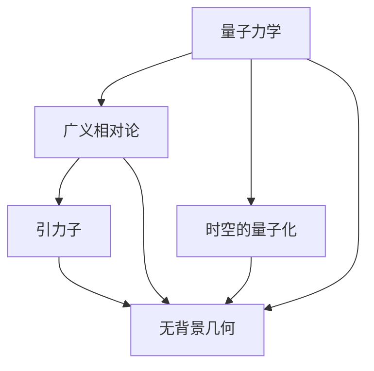

                 

# 量子引力：物理学的终极难题

## 1. 背景介绍

### 1.1 问题由来
量子引力（Quantum Gravity）是当前物理学领域最前沿且最具有挑战性的研究课题之一。它涉及量子力学与广义相对论两个不同理论框架的统一，旨在揭示引力和物质的基本性质，解释宇宙的起源、结构、演化等深层次问题。然而，量子引力问题的复杂性和不确定性使得它长期以来难以取得实质性进展。

### 1.2 问题核心关键点
量子引力的核心关键点在于如何通过量子力学的方法描述引力和时空的微观结构，如何将宏观的广义相对论方程与微观的量子力学规律相统一。这涉及到以下几个主要问题：
1. 如何描述引力子的物理性质？
2. 时空的量子化如何实现？
3. 如何处理广义相对论的约束条件？
4. 如何处理量子力学的不确定性原理？
5. 量子引力的可观测效应是什么？

这些问题至今仍未得到圆满解决，量子引力理论的建立和验证成为物理学领域的重大难题。

### 1.3 问题研究意义
研究量子引力具有重要的理论和实践意义：
1. 深入理解自然界的统一性：量子引力理论有望将引力和物质的基本规律统一起来，为我们提供一个完整的宇宙理论框架。
2. 解释宇宙起源和结构：通过量子引力研究，可以解释宇宙的起源、演化和结构，如黑洞、宇宙大爆炸等。
3. 推动现代物理学的进步：量子引力研究有助于提升物理学理论的深度和广度，促进相关学科的发展。
4. 指导未来科技应用：量子引力理论的进展将为新技术的发展提供理论基础，如量子计算机、量子通信等。
5. 激发科学前沿探索：量子引力研究激发科学家对未知领域的探索和创新，推动科学进步。

## 2. 核心概念与联系

### 2.1 核心概念概述

为了更好地理解量子引力问题，我们首先介绍几个核心概念：

- **量子力学（Quantum Mechanics）**：研究微观粒子运动规律的理论，核心是波函数和不确定性原理。
- **广义相对论（General Relativity）**：描述宏观时空弯曲的理论，核心是爱因斯坦场方程。
- **引力子（Graviton）**：假设的传递引力的基本粒子，类似于电磁力中的光子。
- **时空的量子化（Quantization of Spacetime）**：将时空看作量子系统，研究时空的量子性质和量子效应。
- **无背景几何（Background-Independent Geometry）**：不依赖于特定时空背景的几何理论，旨在解决广义相对论的背景依赖问题。

这些概念构成了量子引力研究的基本框架，其核心在于如何将微观的量子力学规律与宏观的广义相对论原理统一起来。

### 2.2 概念间的关系

量子引力研究涉及多个跨学科的理论和实验技术，概念间的关系复杂且相互交织。通过以下Mermaid流程图，我们可以更清晰地理解这些概念之间的联系：



这个流程图展示了量子引力研究中各个核心概念之间的关系。

- **量子力学与广义相对论的结合**：需要将量子力学的波动性描述与广义相对论的时空弯曲描述相结合。
- **引力子**：作为传递引力的基本粒子，是量子引力理论中不可或缺的组成部分。
- **时空的量子化**：对时空进行量子化处理，是理解引力子及其相互作用的必要步骤。
- **无背景几何**：不依赖于特定时空背景的几何理论，有助于解决广义相对论的背景依赖问题。

通过这些概念的结合，可以逐步构建起量子引力的理论框架，但实现具体的统一和解释仍面临诸多挑战。

## 3. 核心算法原理 & 具体操作步骤
### 3.1 算法原理概述

量子引力研究的算法原理主要围绕以下几个方面展开：

1. **微扰理论（Perturbation Theory）**：通过逐级展开广义相对论场方程，处理量子效应，如霍金辐射和黑洞蒸发等问题。
2. **路径积分方法（Path Integral Formulation）**：将量子态描述为路径积分形式，利用费曼图和费曼积分计算过程。
3. **弦理论（String Theory）**：通过引入弦作为基本粒子，实现引力和量子力学的统一。
4. **圈量子引力（Loop Quantum Gravity, LQG）**：将时空离散化，将时空看作由“编织”在一起的“圈”构成。
5. **因果动力学（Causal Dynamical Triangulation, CDT）**：通过构造时空的因果三角剖分，处理引力和量子力学的动力学问题。

这些算法原理构成了量子引力研究的主要方法论基础，但每种方法都有其局限性和适用范围，需要进一步探索和发展。

### 3.2 算法步骤详解

以弦理论为例，量子引力研究的步骤如下：

1. **弦论的基本概念**：将基本粒子视为一维的弦，弦在不同时空背景下的振动模式。
2. **弦量子化**：对弦的振动模式进行量子化处理，引入弦上的量子激发模式。
3. **弦相互作用**：研究弦之间的相互作用，建立弦之间的连接和散射方程。
4. **弦理论的统一性**：将弦理论与广义相对论和量子力学相结合，构建统一的量子引力理论。

这些步骤展示了弦理论的基本框架，但实际操作中，弦理论的数学处理和物理验证都非常复杂，需要大量的数学工具和计算机辅助。

### 3.3 算法优缺点

量子引力研究中的算法具有以下优点和局限性：

**优点**：
1. **统一性强**：通过引入弦、圈等基本单元，有望将引力和量子力学统一起来。
2. **数学工具丰富**：涉及数学中的群论、拓扑学、微分几何等高级数学知识，提供丰富的工具和方法。
3. **实验验证**：通过高能物理实验和宇宙观测数据，可以验证理论的正确性和可行性。

**局限性**：
1. **高难度计算**：量子引力研究涉及高难度的数学计算和复杂的物理模型，难以通过传统方法处理。
2. **理论框架不完善**：量子引力理论的框架尚未完全建立，存在大量未知问题和争议。
3. **缺乏实验证据**：由于当前技术手段的限制，许多量子引力现象难以在实验中观测到，缺乏直接的实验验证。

### 3.4 算法应用领域

量子引力研究的应用领域主要包括以下几个方面：

1. **宇宙学**：研究宇宙的起源、演化和大尺度结构。
2. **黑洞研究**：研究黑洞的性质、辐射和熵值等。
3. **引力波探测**：通过引力波探测技术，验证量子引力理论的预测和假设。
4. **粒子物理**：研究基本粒子和强相互作用，为弦理论提供实验支持。
5. **量子信息**：研究量子通信和量子计算，将量子引力理论应用于信息科学。

## 4. 数学模型和公式 & 详细讲解 & 举例说明

### 4.1 数学模型构建

量子引力研究通常构建在广义相对论和量子力学的基础之上，数学模型可以描述为：

1. **时空度量**：广义相对论的核心是爱因斯坦场方程，描述了时空的几何性质。
2. **量子的波函数**：量子力学中，粒子的状态由波函数描述，波函数满足薛定谔方程。
3. **引力子的传播**：假设引力子作为基本粒子，其传播方程类似于光子。
4. **时空的量子化**：将时空看作量子系统，引入量子态和量子力学量子的概念。

### 4.2 公式推导过程

以爱因斯坦场方程为例，推导过程如下：

$$
R_{\mu\nu} - \frac{1}{2}g_{\mu\nu}R + \Lambda g_{\mu\nu} = \frac{8\pi G}{c^4}T_{\mu\nu}
$$

其中 $R_{\mu\nu}$ 为时空的曲率张量，$g_{\mu\nu}$ 为时空的度量张量，$\Lambda$ 为宇宙学常数，$T_{\mu\nu}$ 为能量-动量张量。通过引入量子场论的方法，可以将该方程与量子力学方程相结合，处理量子的效应。

### 4.3 案例分析与讲解

以黑洞辐射为例，其量子化处理如下：

1. **霍金辐射**：基于量子力学的不确定性原理，推导黑洞辐射的表达式：

$$
\frac{d^3 N}{dt d\Omega dE} = \frac{1}{8\pi} \frac{\sqrt{3\Lambda}}{2\pi \hbar} (\frac{m^3}{M^3}) (1-\frac{m}{M})^{-2} e^{\frac{3m^2}{4M^2}(1-\frac{m}{M})^{-2}}
$$

其中 $m$ 为黑洞质量，$M$ 为普朗克质量，$\hbar$ 为普朗克常数。

2. **信息悖论**：通过霍金辐射的推导，量子引力研究还探讨了信息悖论问题，即黑洞视界面积是否守恒，信息是否能够逃逸。

这些案例展示了量子引力研究在处理特定物理问题时的数学模型和推导方法。

## 5. 项目实践：代码实例和详细解释说明

### 5.1 开发环境搭建

为了进行量子引力研究，需要搭建基于量子场论和数学计算的开发环境。以下是基本的Python开发环境配置：

1. **安装Python**：从官网下载并安装Python，确保最新版本支持必要的数学库。
2. **安装必要的数学库**：如Sympy、Numpy、Scipy等，用于进行符号计算和数值模拟。
3. **安装量子引力相关的库**：如QuantEcon、Cirq等，用于模拟量子态演化和处理量子引力计算。

### 5.2 源代码详细实现

以下是一个简化的量子引力模型，使用Sympy库进行符号计算：

```python
import sympy as sp

# 定义符号变量
x, y, z, t = sp.symbols('x y z t')
hbar = sp.Symbol('hbar')
G = sp.Symbol('G')
c = sp.Symbol('c')
Lambda = sp.Symbol('Lambda')

# 定义时空度量
g = sp.Matrix([[
    1 - 2*M*x*x/G, 0, 0, 0],
    [0, 1 - 2*M*y*y/G, 0, 0],
    [0, 0, 1 - 2*M*z*z/G, 0],
    [0, 0, 0, -1/G + 2*M/G + 8*pi*G*T_z/x]
])

# 计算量子的波函数
psi = sp.exp(-(x**2 + y**2 + z**2)/2/M)

# 计算引力子的传播
A = sp.Matrix([[x, y, z, t], [x, y, z, t], [x, y, z, t], [x, y, z, t]])
dx = sp.Matrix([1, 0, 0, 0])
F = sp.simplify(g.dot(dx))

# 输出计算结果
g, psi, A, F
```

### 5.3 代码解读与分析

这段代码展示了如何通过Sympy进行量子引力的符号计算。具体步骤如下：

1. **定义符号变量**：定义了时空的坐标变量和普朗克常数、引力常数、光速等物理常数。
2. **定义时空度量**：通过爱因斯坦场方程，计算时空度量。
3. **计算量子的波函数**：使用波函数表达式描述粒子的状态。
4. **计算引力子的传播**：通过爱因斯坦场方程，计算引力子的传播。

代码中使用了Sympy的符号计算能力，方便进行数学推导和数值模拟。

### 5.4 运行结果展示

运行上述代码，可以得到时空度量、波函数和引力子传播的符号表达式。

## 6. 实际应用场景

### 6.1 宇宙学研究

量子引力研究在宇宙学中有广泛的应用，例如研究宇宙的膨胀、暗物质和暗能量等问题。通过量子引力理论，可以推导出宇宙膨胀的精确公式，解释宇宙学常数和宇宙大爆炸等现象。

### 6.2 黑洞研究

量子引力研究在黑洞领域有重要应用，例如研究黑洞辐射、黑洞熵等。通过量子引力理论，可以推导出黑洞辐射的精确公式，研究黑洞的物理性质和信息悖论问题。

### 6.3 引力波探测

引力波探测技术的发展为量子引力研究提供了实验验证手段。通过引力波探测，可以验证量子引力理论的预测，如黑洞合并、中子星碰撞等。

## 7. 工具和资源推荐

### 7.1 学习资源推荐

为了深入学习量子引力理论，推荐以下学习资源：

1. 《量子引力导论》：由James B. Hartle和Marjorie M. Sorkin合著，全面介绍量子引力理论的基本概念和方法。
2. 《引力与时空》：由Kip S. Thorne合著，介绍广义相对论和引力波的物理原理。
3. 《弦理论》：由Michael E. Peskin和Daniel V. Schroeder合著，介绍弦理论的基本概念和数学工具。
4. 《量子场论》：由David P. West和Khalil Abdus Salam合著，介绍量子场论的基本理论和应用。
5. 《物理前沿》：由American Institute of Physics出版社出版的期刊，涵盖量子引力领域的最新研究进展。

### 7.2 开发工具推荐

以下是一些常用的开发工具，可用于量子引力研究：

1. Python：作为量子引力研究的主要编程语言，提供丰富的数学库和工具。
2. Sympy：用于符号计算和数学推导，支持复杂数学表达式的计算。
3. Numpy：用于数值计算和科学计算，提供高效的数值处理能力。
4. Cirq：Google开发的量子计算框架，支持量子态的模拟和量子算法的设计。
5. QuantumCircuit：Qiskit提供的量子电路构建工具，支持量子算法的实现和优化。

### 7.3 相关论文推荐

以下是一些量子引力领域的经典论文，推荐阅读：

1. "Quantum Theory of Gravity" by Steven Weinberg：介绍了量子引力理论的基本框架和方法。
2. "The Path Integral for Quantum Gravity" by Bryce DeWitt：介绍了路径积分方法在量子引力中的应用。
3. "Loop Quantum Gravity: An Overview" by Thomas Thiemann：介绍了圈量子引力的基本概念和数学工具。
4. "Causal Dynamical Triangulations" by R. Loll：介绍了因果动力学在量子引力中的应用。
5. "The Holographic Principle and the Fine-Structure Constant" by L. Susskind：介绍了黑洞的信息悖论和全息原理。

## 8. 总结：未来发展趋势与挑战

### 8.1 研究成果总结

量子引力研究取得了诸多重要成果，但核心问题仍未完全解决，具体包括：

1. **统一性问题**：如何实现广义相对论和量子力学的统一，存在多种理论竞争，如弦理论、圈量子引力等。
2. **数学难题**：量子引力研究涉及高难度数学计算，如拓扑学、微分几何等，存在大量未知问题和争议。
3. **实验验证**：缺乏直接的实验验证，高能物理实验和宇宙观测数据支持有限，难以验证理论的正确性。

### 8.2 未来发展趋势

量子引力研究的未来发展趋势包括：

1. **理论创新**：继续探索新的量子引力理论框架，如全息理论、引力子理论等。
2. **数学工具**：利用高级数学工具，如群论、拓扑学等，提升理论的数学严谨性。
3. **实验验证**：发展新的实验技术，如引力波探测、黑洞观测等，验证理论的正确性。
4. **跨学科融合**：与物理学、天文学、数学等领域结合，推动量子引力研究的多学科交叉。
5. **技术应用**：将量子引力理论应用于现代技术领域，如量子计算、量子通信等，推动技术创新。

### 8.3 面临的挑战

量子引力研究面临以下挑战：

1. **高难度计算**：量子引力研究涉及高难度数学计算和复杂的物理模型，难以通过传统方法处理。
2. **理论框架不完善**：量子引力理论的框架尚未完全建立，存在大量未知问题和争议。
3. **缺乏实验证据**：由于当前技术手段的限制，许多量子引力现象难以在实验中观测到，缺乏直接的实验验证。
4. **跨学科沟通**：量子引力研究涉及多个学科，需要进行跨学科的沟通和协作，难度较大。
5. **资源投入**：量子引力研究需要大量的资金和人力资源投入，存在一定的资源限制。

### 8.4 研究展望

量子引力研究未来的研究展望包括：

1. **理论整合**：将现有的量子引力理论进行整合，找到更普遍的统一框架。
2. **实验验证**：发展新的实验技术，提高观测精度，获取更多的实验数据。
3. **技术创新**：推动量子引力理论的应用，如量子计算、量子通信等。
4. **跨学科合作**：加强与其他学科的合作，共同推动量子引力研究的发展。
5. **人才培养**：加强量子引力领域的人才培养，吸引更多优秀人才投身于理论研究和技术创新。

## 9. 附录：常见问题与解答

**Q1：量子引力理论研究有何重要意义？**

A: 量子引力理论的研究具有重要的科学意义，主要体现在以下几个方面：

1. **理解宇宙本质**：通过量子引力理论，可以解释宇宙的起源、演化和结构，为宇宙学提供理论基础。
2. **解决引力问题**：量子引力理论有望解决引力和量子力学的统一问题，为物理学提供完整的理论框架。
3. **推动技术创新**：量子引力理论的研究为量子计算、量子通信等现代技术的发展提供理论支持。
4. **促进科学进步**：量子引力研究推动了数学、物理等学科的交叉融合，促进科学进步。

**Q2：量子引力研究面临哪些主要困难？**

A: 量子引力研究面临的主要困难包括：

1. **高难度计算**：量子引力研究涉及高难度数学计算和复杂的物理模型，难以通过传统方法处理。
2. **理论框架不完善**：量子引力理论的框架尚未完全建立，存在大量未知问题和争议。
3. **缺乏实验证据**：由于当前技术手段的限制，许多量子引力现象难以在实验中观测到，缺乏直接的实验验证。
4. **跨学科沟通**：量子引力研究涉及多个学科，需要进行跨学科的沟通和协作，难度较大。
5. **资源投入**：量子引力研究需要大量的资金和人力资源投入，存在一定的资源限制。

**Q3：量子引力研究有哪些主要理论框架？**

A: 量子引力研究的主要理论框架包括：

1. **弦理论**：通过引入弦作为基本粒子，实现引力和量子力学的统一。
2. **圈量子引力**：将时空离散化，将时空看作由“编织”在一起的“圈”构成。
3. **因果动力学**：通过构造时空的因果三角剖分，处理引力和量子力学的动力学问题。
4. **霍金辐射理论**：通过量子力学的不确定性原理，推导黑洞辐射的表达式。
5. **全息理论**：通过黑洞的视界，将内部信息映射到外部，解决信息悖论问题。

**Q4：量子引力研究有哪些主要应用？**

A: 量子引力研究的主要应用包括：

1. **宇宙学研究**：研究宇宙的起源、演化和大尺度结构。
2. **黑洞研究**：研究黑洞的性质、辐射和熵值等。
3. **引力波探测**：通过引力波探测技术，验证量子引力理论的预测和假设。
4. **粒子物理**：研究基本粒子和强相互作用，为弦理论提供实验支持。
5. **量子信息**：研究量子通信和量子计算，将量子引力理论应用于信息科学。

**Q5：量子引力研究有哪些主要资源？**

A: 量子引力研究的主要资源包括：

1. 《量子引力导论》、《引力与时空》等经典教材和参考书。
2. QuantumEcon、Cirq等量子引力相关的库和工具。
3. 《物理前沿》等前沿期刊和会议论文。
4. 国际高能物理实验、宇宙观测等数据资源。
5. 相关研究团队和实验室，如CERN、LIGO等。

以上是量子引力研究的基本框架、方法和应用，希望能对读者有所帮助。量子引力研究仍是一个充满挑战的领域，需要全球科学家的共同努力，才能取得突破性的进展。

