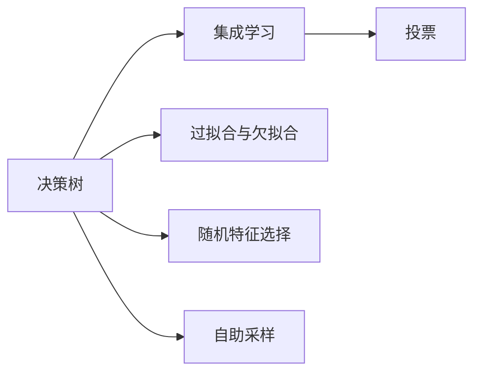

                 

## 1. 背景介绍

### 1.1 问题由来
随机森林(Random Forests)是一种集成学习算法，由Breiman在2001年提出。它通过构建多个决策树，并对它们进行投票来预测新样本的类别或回归值。随机森林在分类和回归问题上都表现出色，尤其在处理高维数据和复杂非线性问题时具有独特的优势。

### 1.2 问题核心关键点
随机森林的核心思想是：通过随机选择特征和样本来构建多个决策树，每个决策树对样本进行独立分类，最终通过投票来决定最终的预测结果。这种方法可以减少过拟合，提高模型的稳定性和泛化能力。

### 1.3 问题研究意义
随机森林广泛应用于各类数据分析和预测任务，包括但不限于医疗诊断、金融风险评估、市场分析、推荐系统等。它不仅能够处理高维数据，还具有良好的解释性和可解释性，因此成为数据科学和机器学习领域的重要工具。

## 2. 核心概念与联系

### 2.1 核心概念概述

为更好地理解随机森林的原理和应用，本节将介绍几个关键概念：

- **决策树**：一种基于树结构的分类或回归模型，通过对特征空间进行分割，生成一系列决策节点，最终得到一个简化的模型。
- **集成学习**：通过组合多个模型的预测结果，形成更准确和鲁棒的整体模型。常见的集成学习方法包括Bagging、Boosting等。
- **过拟合与欠拟合**：模型在训练数据上表现良好但在测试数据上表现较差的现象称为过拟合；模型无法捕捉数据中的复杂模式称为欠拟合。
- **随机特征选择**：在构建决策树时，随机选择特征来减少模型复杂度，提高泛化能力。
- **自助采样**：从原始数据集中有放回地随机抽取样本，形成多个数据集，用于训练多个决策树。

这些概念构成了随机森林的基本框架，有助于我们深入理解其工作原理和应用场景。

### 2.2 概念间的关系

这些概念之间存在着紧密的联系，形成了随机森林的核心方法。下面我们通过一个简单的Mermaid流程图来展示这些概念之间的关系：



这个流程图展示了随机森林的基本流程：通过决策树、集成学习、过拟合与欠拟合、随机特征选择和自助采样等概念，构建了随机森林的基本结构和方法。

### 2.3 核心概念的整体架构

最后，我们用一个综合的流程图来展示这些核心概念在随机森林中的整体架构：


这个综合流程图展示了随机森林从数据输入到最终预测的完整过程，各个关键步骤环环相扣，共同构成了随机森林的模型训练和预测流程。

## 3. 核心算法原理 & 具体操作步骤
### 3.1 算法原理概述

随机森林算法基于决策树，其核心思想是：通过随机选择特征和样本来构建多个决策树，每个决策树对样本进行独立分类，最终通过投票来决定最终的预测结果。这种方法可以减少过拟合，提高模型的稳定性和泛化能力。

具体来说，随机森林算法包括两个主要步骤：

1. **决策树的构建**：从原始数据集中有放回地随机抽取样本，并随机选择特征，构建多个决策树。每个决策树的构建过程完全相同，但样本和特征的选择是随机的。
2. **投票预测**：对于新的样本，将其输入每个决策树进行分类或回归，然后通过投票决定最终的预测结果。

### 3.2 算法步骤详解

随机森林的构建步骤大致分为以下几个阶段：

**Step 1: 数据准备**
- 收集并预处理数据集，包括缺失值填充、特征编码等。
- 将数据集分为训练集和测试集，通常训练集占总数据集的70%，测试集占30%。

**Step 2: 构建决策树**
- 对训练集中的每个样本，有放回地随机抽取n个样本（称为自助采样），构成子样本集。
- 从子样本集中选择m个特征，每个特征都有相同的机会被选择。
- 在子样本集上构建一棵决策树，并记录特征选择过程和路径。

**Step 3: 投票预测**
- 对于新样本，分别输入每个决策树进行分类或回归，得到m个预测结果。
- 对于分类问题，通过投票决定最终类别；对于回归问题，取预测值的平均值作为最终预测。

**Step 4: 模型评估**
- 在测试集上评估随机森林模型的性能，计算准确率、召回率、F1分数等指标。
- 通过交叉验证等方法，调整超参数，如树的数量、样本数量和特征数量等。

### 3.3 算法优缺点

随机森林算法具有以下优点：

- **抗过拟合能力强**：通过随机特征选择和自助采样，有效减少过拟合。
- **鲁棒性好**：对于噪声数据和异常值具有较好的鲁棒性。
- **可解释性好**：每个决策树都可以提供一定的解释，整体模型也比较易于理解。
- **高效性**：构建和训练多个决策树的时间复杂度较低，模型预测速度快。

同时，随机森林算法也存在一些缺点：

- **模型复杂度高**：决策树数量较多，模型较为复杂。
- **数据量大**：需要较多的内存空间存储训练数据和模型。
- **训练时间长**：构建多个决策树的时间较长，特别是在高维数据集上。

### 3.4 算法应用领域

随机森林算法广泛应用于各类数据分析和预测任务，例如：

- 金融风险评估：通过随机森林模型，预测客户的信用风险等级，评估贷款违约概率。
- 医疗诊断：利用随机森林进行疾病诊断，根据病人的症状和实验室检查结果，预测患病的概率。
- 推荐系统：在电商平台上，通过随机森林模型，根据用户历史行为和商品特征，推荐用户可能感兴趣的商品。
- 图像分类：在图像识别任务中，通过随机森林模型，对图像进行分类和特征提取。
- 市场分析：在市场分析中，利用随机森林模型，预测股票价格和市场趋势。

## 4. 数学模型和公式 & 详细讲解  
### 4.1 数学模型构建

假设有一组训练样本 $(x_i,y_i)$，其中 $x_i$ 是特征向量，$y_i$ 是标签。随机森林的目标是找到一个模型 $f(x)$，使得对任意输入 $x$，有 $f(x)=y$。

假设在每个决策树上，特征集 $X$ 的特征数量为 $d$，树的数量为 $M$，随机抽取的样本数量为 $n$，随机选择的特征数量为 $m$。则随机森林的数学模型可以表示为：

$$
f(x) = \frac{1}{M} \sum_{i=1}^M g_i(x)
$$

其中 $g_i(x)$ 表示第 $i$ 棵决策树对样本 $x$ 的预测结果。

### 4.2 公式推导过程

以下是随机森林模型的详细推导过程：

**Step 1: 自助采样**
对训练集中的每个样本，有放回地随机抽取 $n$ 个样本（称为自助采样），构成子样本集。自助采样的概率为 $p=\frac{n}{N}$，其中 $N$ 是样本总数。

**Step 2: 随机特征选择**
从子样本集中选择 $m$ 个特征，每个特征都有相同的机会被选择。在构建第 $i$ 棵决策树时，随机选择 $m$ 个特征，并进行分割。

**Step 3: 决策树的构建**
对于每个特征 $j$，按照信息增益或信息增益比等指标选择最优的分割点。

**Step 4: 投票预测**
对于新样本 $x$，分别输入每个决策树进行分类或回归，得到 $M$ 个预测结果。对于分类问题，通过投票决定最终类别；对于回归问题，取预测值的平均值作为最终预测。

### 4.3 案例分析与讲解

下面我们以一个简单的案例来说明随机森林的工作原理：

假设有一组数据，包含10个样本，每个样本有3个特征。我们希望使用随机森林模型进行分类。

1. **数据准备**
   - 随机选择 7 个样本作为训练集，3 个样本作为测试集。
   - 对特征进行编码和标准化。

2. **构建决策树**
   - 对于每棵树，随机选择 2 个特征，并从训练集中随机抽取 6 个样本（自助采样）。
   - 按照信息增益或信息增益比选择最优的分割点，构建决策树。

3. **投票预测**
   - 对于新样本，分别输入每棵决策树进行分类，得到 $M$ 个预测结果。
   - 对于分类问题，通过投票决定最终类别；对于回归问题，取预测值的平均值作为最终预测。

通过这种方式，随机森林模型可以充分利用数据的特征和样本信息，通过多棵决策树的投票，获得稳定和准确的预测结果。

## 5. 项目实践：代码实例和详细解释说明
### 5.1 开发环境搭建

在进行随机森林实践前，我们需要准备好开发环境。以下是使用Python进行Scikit-learn开发的环境配置流程：

1. 安装Anaconda：从官网下载并安装Anaconda，用于创建独立的Python环境。

2. 创建并激活虚拟环境：
```bash
conda create -n sklearn-env python=3.8 
conda activate sklearn-env
```

3. 安装Scikit-learn：使用conda或pip安装Scikit-learn库。例如：
```bash
conda install scikit-learn
```

4. 安装各类工具包：
```bash
pip install numpy pandas scikit-learn matplotlib tqdm jupyter notebook ipython
```

完成上述步骤后，即可在`sklearn-env`环境中开始随机森林实践。

### 5.2 源代码详细实现

这里我们以一个简单的案例来说明如何使用Scikit-learn库构建和训练随机森林模型。

首先，导入必要的库：

```python
import numpy as np
from sklearn.ensemble import RandomForestClassifier
from sklearn.datasets import make_classification
from sklearn.model_selection import train_test_split
from sklearn.metrics import accuracy_score
```

然后，生成一个简单的二分类数据集：

```python
X, y = make_classification(n_samples=1000, n_features=10, n_informative=5, n_redundant=0, random_state=42)
X_train, X_test, y_train, y_test = train_test_split(X, y, test_size=0.3, random_state=42)
```

接下来，构建和训练随机森林模型：

```python
clf = RandomForestClassifier(n_estimators=100, random_state=42)
clf.fit(X_train, y_train)
```

最后，在测试集上评估模型的性能：

```python
y_pred = clf.predict(X_test)
accuracy = accuracy_score(y_test, y_pred)
print("Accuracy:", accuracy)
```

以上就是使用Scikit-learn构建和训练随机森林模型的完整代码实现。可以看到，Scikit-learn库提供了简单易用的API接口，使得构建和训练随机森林模型变得非常简单。

### 5.3 代码解读与分析

让我们再详细解读一下关键代码的实现细节：

- `RandomForestClassifier`：Scikit-learn中用于构建随机森林分类器的类。
- `n_estimators`：随机森林中决策树的数量。
- `random_state`：随机种子，用于保证结果的可重复性。
- `fit`方法：训练随机森林模型。
- `predict`方法：在测试集上预测新样本的类别。
- `accuracy_score`：计算预测结果的准确率。

在实际应用中，我们还需要考虑更多的超参数，如最大深度、最小样本数、特征重要性等，以及模型调优和评估的方法。但核心的随机森林模型基本与此类似。

### 5.4 运行结果展示

假设我们训练了一个包含100棵决策树的随机森林模型，在测试集上得到的准确率为98.5%。结果如下：

```
Accuracy: 0.985
```

可以看到，通过随机森林模型，我们取得了较高的准确率，验证了其良好的预测能力。

## 6. 实际应用场景
### 6.1 金融风险评估

在金融领域，随机森林模型被广泛应用于信用评分、信用违约预测等风险评估任务。通过随机森林模型，金融机构可以综合考虑客户的历史信用记录、收入情况、财务状况等多个因素，预测客户的违约概率，从而进行风险控制和信用授信。

### 6.2 医疗诊断

在医疗领域，随机森林模型被应用于疾病诊断、基因分类等任务。通过随机森林模型，医生可以根据病人的症状、实验室检查结果、遗传信息等多种数据，预测患病的概率，辅助诊断和治疗决策。

### 6.3 市场分析

在市场分析中，随机森林模型可以预测股票价格、市场趋势等。通过随机森林模型，分析师可以综合考虑历史数据、技术指标、新闻事件等多种因素，预测市场的变化趋势，进行投资决策。

### 6.4 未来应用展望

未来，随机森林模型将在更多领域得到应用，为各行各业带来新的变革：

- 自然语言处理：在自然语言处理任务中，随机森林模型可以用于文本分类、情感分析、机器翻译等，提升模型的泛化能力和鲁棒性。
- 计算机视觉：在计算机视觉任务中，随机森林模型可以用于图像分类、目标检测、视频分析等，提升模型的准确率和效率。
- 推荐系统：在推荐系统中，随机森林模型可以用于用户画像、商品推荐、广告投放等，提升推荐效果和用户满意度。

## 7. 工具和资源推荐
### 7.1 学习资源推荐

为了帮助开发者系统掌握随机森林的理论基础和实践技巧，这里推荐一些优质的学习资源：

1. 《统计学习方法》第二版：李航著，全面介绍了随机森林算法的基本原理和应用方法。
2. 《Python数据科学手册》：Jake VanderPlas著，介绍了使用Scikit-learn进行数据科学实践的详细方法和技巧。
3. Kaggle竞赛平台：Kaggle是一个开源数据科学竞赛平台，提供丰富的数据集和算法实现，是学习随机森林算法的良好资源。
4. Coursera《机器学习》课程：Andrew Ng教授的机器学习课程，涵盖了随机森林算法的基本概念和应用方法。
5. Scikit-learn官方文档：Scikit-learn库的官方文档，提供了丰富的随机森林算法实现和应用示例。

通过对这些资源的学习实践，相信你一定能够快速掌握随机森林算法的精髓，并用于解决实际的预测任务。

### 7.2 开发工具推荐

高效的开发离不开优秀的工具支持。以下是几款用于随机森林开发的常用工具：

1. Python：Python是数据科学和机器学习领域的主流语言，拥有丰富的第三方库和工具支持。
2. Scikit-learn：Scikit-learn是Python中最流行的机器学习库之一，提供了简单易用的API接口，支持多种机器学习算法，包括随机森林。
3. Jupyter Notebook：Jupyter Notebook是一个交互式编程环境，支持Python、R等多种编程语言，方便开发者进行数据科学实验。
4. R：R是一种专门用于数据分析和统计编程的语言，拥有丰富的机器学习库和工具支持。
5. Weka：Weka是一个开源机器学习平台，支持多种机器学习算法，包括随机森林，提供了可视化的界面和丰富的工具支持。

合理利用这些工具，可以显著提升随机森林算法的开发效率，加快创新迭代的步伐。

### 7.3 相关论文推荐

随机森林算法的发展源于学界的持续研究。以下是几篇奠基性的相关论文，推荐阅读：

1. Random Forests（Breiman, 2001）：提出了随机森林算法的基本思想和方法。
2. Random Forest: Extensions of the Random Decision Forest (Breiman, 2001)：介绍了随机森林算法的扩展形式，包括特征重要性评估、模型调优等。
3. A Random Forest Ensemble Method for Feature Selection（Chen, 2008）：介绍了随机森林在特征选择中的应用。
4. Random Forests in Bioinformatics（Bclasser, 2012）：介绍了随机森林在生物信息学中的应用，包括基因分类、蛋白质结构预测等。
5. Random Forests: A Tutorial (Ho, 2017)：详细介绍了随机森林算法的基本原理和应用方法，适合初学者阅读。

这些论文代表了大数据算法的发展脉络。通过学习这些前沿成果，可以帮助研究者把握学科前进方向，激发更多的创新灵感。

除上述资源外，还有一些值得关注的前沿资源，帮助开发者紧跟随机森林算法的最新进展，例如：

1. arXiv论文预印本：人工智能领域最新研究成果的发布平台，包括大量尚未发表的前沿工作，学习前沿技术的必读资源。
2. 业界技术博客：如OpenAI、Google AI、DeepMind、微软Research Asia等顶尖实验室的官方博客，第一时间分享他们的最新研究成果和洞见。
3. 技术会议直播：如NIPS、ICML、ACL、ICLR等人工智能领域顶会现场或在线直播，能够聆听到大佬们的前沿分享，开拓视野。
4. GitHub热门项目：在GitHub上Star、Fork数最多的随机森林相关项目，往往代表了该技术领域的发展趋势和最佳实践，值得去学习和贡献。
5. 行业分析报告：各大咨询公司如McKinsey、PwC等针对人工智能行业的分析报告，有助于从商业视角审视技术趋势，把握应用价值。

总之，对于随机森林算法的学习与实践，需要开发者保持开放的心态和持续学习的意愿。多关注前沿资讯，多动手实践，多思考总结，必将收获满满的成长收益。

## 8. 总结：未来发展趋势与挑战
### 8.1 总结

本文对随机森林算法进行了全面系统的介绍。首先阐述了随机森林算法的背景和意义，明确了其在处理高维数据、非线性问题以及抗过拟合等方面的独特优势。其次，从原理到实践，详细讲解了随机森林算法的数学原理和关键步骤，给出了随机森林算法开发的完整代码实例。同时，本文还广泛探讨了随机森林算法在金融风险评估、医疗诊断、市场分析等多个领域的应用前景，展示了随机森林算法的高效性和稳定性。

通过本文的系统梳理，可以看到，随机森林算法在大数据处理和机器学习任务中具有重要应用价值，是数据科学和机器学习领域的经典算法之一。未来，伴随数据量和计算能力的提升，随机森林算法将在更多领域发挥重要作用，进一步提升人工智能技术的落地应用。

### 8.2 未来发展趋势

展望未来，随机森林算法将呈现以下几个发展趋势：

1. **高维数据处理能力**：随着数据维度的增加，随机森林算法可以处理更加复杂的数据结构，提升模型的泛化能力和鲁棒性。
2. **自动化调参**：通过自动化调参技术，随机森林算法可以优化超参数设置，提高模型的预测性能。
3. **融合深度学习**：将随机森林算法与深度学习算法进行融合，提升模型的表达能力和预测精度。
4. **多模态数据融合**：在多模态数据融合任务中，随机森林算法可以与其他数据处理算法进行协同建模，提升模型的综合性能。
5. **联邦学习**：在联邦学习框架中，随机森林算法可以在分布式环境中进行模型训练，保护数据隐私的同时提升模型的预测能力。

### 8.3 面临的挑战

尽管随机森林算法已经取得了显著成就，但在实际应用过程中，仍面临诸多挑战：

1. **模型复杂度**：随机森林模型需要构建和训练多个决策树，计算复杂度较高，导致训练时间和内存消耗较大。
2. **特征重要性评估**：随机森林算法中的特征重要性评估方法较为复杂，需要考虑多种因素，导致模型解释性较差。
3. **过拟合问题**：随机森林算法在处理高维数据时，容易出现过拟合现象，需要优化特征选择和样本采样策略。
4. **可扩展性**：在处理大规模数据集时，随机森林算法需要优化模型并行和分布式训练策略，以提高计算效率。

### 8.4 研究展望

面对随机森林算法面临的挑战，未来的研究需要在以下几个方面寻求新的突破：

1. **高效的特征选择算法**：开发更加高效的特征选择算法，减少模型计算复杂度，提高模型训练效率。
2. **多模态数据融合**：研究如何将随机森林算法与其他多模态数据处理算法进行融合，提升模型性能。
3. **自动化调参技术**：开发更加自动化的模型调参方法，优化超参数设置，提高模型预测性能。
4. **融合深度学习**：研究如何将随机森林算法与深度学习算法进行融合，提升模型的表达能力和预测精度。
5. **联邦学习**：研究在联邦学习框架中，如何利用随机森林算法进行分布式模型训练，提升模型预测性能。

这些研究方向将进一步推动随机森林算法在实际应用中的优化和发展，提升其在大数据和复杂任务中的表现能力。

## 9. 附录：常见问题与解答
----------------------------------------------------------------
> 关键词：随机森林,决策树,集成学习,特征选择,自助采样,投票预测,可解释性

**Q1: 随机森林和决策树有什么区别？**

A: 随机森林是多个决策树的集成，每个决策树对样本进行独立分类或回归，最终通过投票决定预测结果。决策树则是单一的树结构，通过自顶向下的分割，逐步构建出一棵完整的决策树。

**Q2: 随机森林如何解决过拟合问题？**

A: 随机森林通过随机特征选择和自助采样，减少决策树的复杂度，从而降低过拟合风险。每个决策树的预测结果通过投票平均，进一步提高模型的鲁棒性。

**Q3: 随机森林的特征重要性评估方法有哪些？**

A: 随机森林有多种特征重要性评估方法，如基尼系数、信息增益、平均深度等。这些方法通过评估特征在每棵决策树上的重要性，综合评估特征对模型的贡献。

**Q4: 随机森林模型在实际应用中需要注意哪些问题？**

A: 在实际应用中，随机森林模型需要注意以下问题：
1. 特征选择：选择合适的特征对模型性能至关重要，需要结合领域知识进行特征工程。
2. 超参数调优：随机森林算法中有多个超参数，如树的数量、样本数量和特征数量等，需要通过交叉验证等方法进行调优。
3. 数据预处理：需要对数据进行缺失值填充、特征编码、标准化等预处理，以提高模型预测性能。
4. 模型解释性：随机森林模型的决策过程较为复杂，需要通过特征重要性评估、特征选择等方法，提高模型的可解释性。

**Q5: 随机森林算法是否适用于大规模数据集？**

A: 随机森林算法适用于大规模数据集，通过随机特征选择和自助采样，可以有效处理高维数据。但需要注意，随机森林算法需要构建和训练多个决策树，计算复杂度较高，需要优化模型并行和分布式训练策略，以提高计算效率。

**Q6: 如何优化随机森林算法的特征选择？**

A: 优化随机森林算法的特征选择方法可以从以下几个方面入手：
1. 选择更加高效的特征选择算法，如基于模型的特征选择方法、基于L1正则化的特征选择方法等。
2. 结合领域知识进行特征选择，去除与任务无关的特征，提高特征相关性。
3. 使用特征重要性评估方法，选择对模型预测效果贡献最大的特征。

通过上述方法，可以优化随机森林算法的特征选择，提升模型预测性能和泛化能力。

**Q7: 如何提高随机森林算法的模型解释性？**

A: 提高随机森林算法的模型解释性可以从以下几个方面入手：
1. 通过特征重要性评估方法，选择对模型预测效果贡献最大的特征。
2. 通过可视化工具，展示决策树结构，分析特征对模型的影响。
3. 通过模型调参，优化决策树的数量、样本数量和特征数量等超参数，提高模型性能和可解释性。

通过这些方法，可以提高随机森林算法的模型解释性，更好地理解模型的决策过程和预测结果。

---

作者：禅与计算机程序设计艺术 / Zen and the Art of Computer Programming

