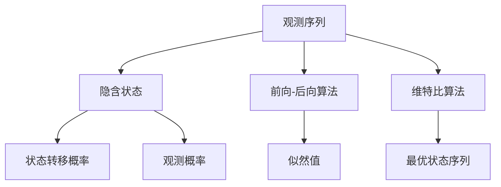
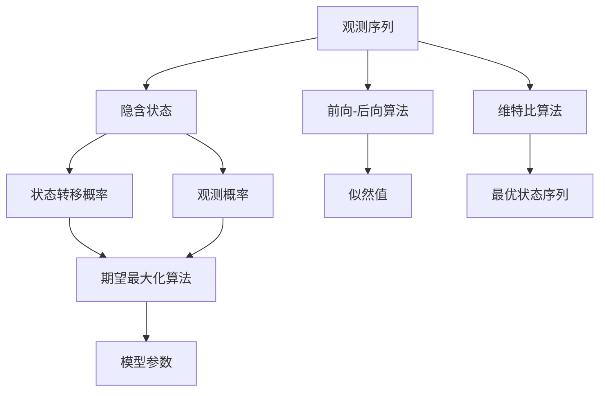
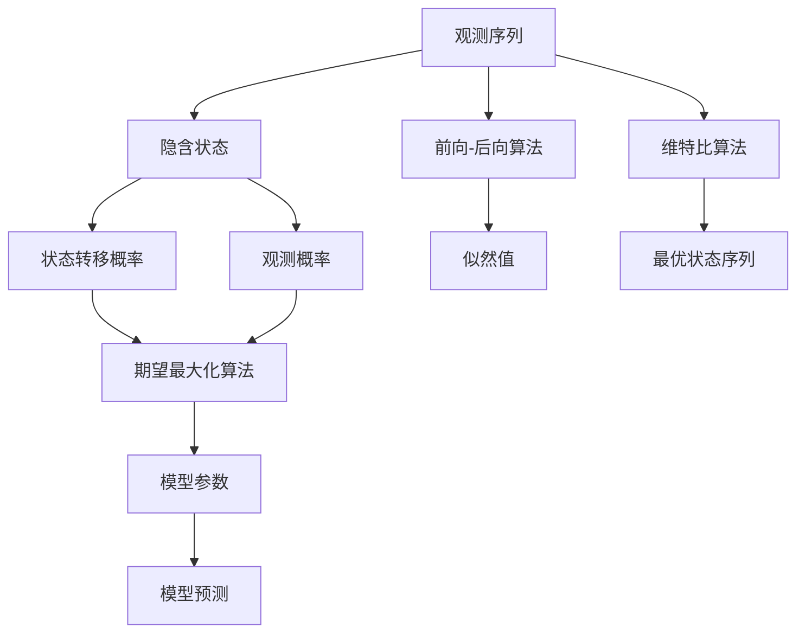
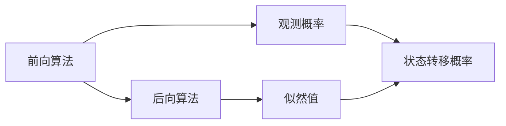

                 

# 隐马尔可夫模型 (Hidden Markov Models, HMM) 原理与代码实例讲解

> 关键词：隐马尔可夫模型,概率图模型,动态规划,统计学习,自然语言处理,生物信息学,金融时间序列

## 1. 背景介绍

### 1.1 问题由来
隐马尔可夫模型（Hidden Markov Models, HMM）是一种用于建模时序数据的概率图模型，广泛应用于自然语言处理、生物信息学、金融时间序列分析等多个领域。HMM模型由两个部分组成：隐含状态和观测值。隐含状态是模型内部的状态，一般不可直接观测到；观测值是根据模型内部状态生成的，可以被直接观测到。HMM模型通过观察一系列观测值，推断出对应的隐含状态序列。

HMM模型的应用场景广泛，例如语音识别、手写数字识别、词性标注、翻译、基因序列分析、金融市场预测等。在这些应用中，HMM模型可以用于解决序列数据预测、分类、标记等问题。然而，由于HMM模型的理论基础较为复杂，实际应用中常常需要面对模型参数的估计、状态序列的解码等问题，这些问题直接影响了模型的性能和效果。

### 1.2 问题核心关键点
为了更好地理解HMM模型，本节将介绍几个密切相关的核心概念：

- 隐马尔可夫模型（HMM）：一种用于建模时序数据的概率图模型，由观测序列和隐含状态组成。
- 前向-后向算法（Forward-Backward Algorithm）：一种动态规划算法，用于计算HMM模型中的概率值。
- 维特比算法（Viterbi Algorithm）：一种基于动态规划的算法，用于求解HMM模型中的最优状态序列。
- 状态转移概率（State Transition Probability）：指在给定当前状态和观测值的条件下，转移到下一个状态的概率。
- 观测概率（Observation Probability）：指在给定当前状态时，观测到某个观测值的概率。
- 似然值（Likelihood）：指观测序列在给定模型参数下的概率。

这些核心概念之间的逻辑关系可以通过以下Mermaid流程图来展示：

这个流程图展示了几者之间的关系：

1. 观测序列由隐含状态生成，隐含状态和观测值是HMM模型的核心组成部分。
2. 前向-后向算法和维特比算法是用于计算HMM模型中概率值和最优状态序列的动态规划算法。
3. 状态转移概率和观测概率是HMM模型的两个基本组成部分，用于描述模型的动态行为和观测行为。
4. 似然值是指在给定模型参数下，观测序列的概率，用于模型评估和参数优化。
5. 最优状态序列是通过维特比算法求解得到的，可以用于推断模型的隐含状态。

这些概念共同构成了HMM模型的学习框架，使其能够有效处理序列数据，并在实际应用中取得良好的效果。

### 1.3 问题研究意义
研究HMM模型的参数估计、状态序列解码等问题，对于拓展HMM模型的应用范围，提升其在序列数据处理中的性能，加速相关领域的科技进步，具有重要意义：

1. 降低应用开发成本。HMM模型可以用于解决序列数据预测、分类、标记等问题，帮助开发者快速实现相关功能，减少从头开发所需的数据、计算和人力等成本投入。
2. 提升模型效果。通过精确估计模型参数和解码最优状态序列，HMM模型可以取得更为准确的预测和分类结果。
3. 加速开发进度。HMM模型具有灵活的应用接口和广泛的参数调整空间，使得开发者能够快速进行功能迭代和优化，缩短开发周期。
4. 带来技术创新。HMM模型的研究推动了动态规划、图模型、统计学习等领域的进步，催生了新的研究方向和技术方法。
5. 赋能产业升级。HMM模型可以应用于语音识别、金融市场预测等高价值领域，为传统行业数字化转型升级提供新的技术路径。

## 2. 核心概念与联系

### 2.1 核心概念概述

为更好地理解HMM模型的参数估计和状态序列解码方法，本节将介绍几个密切相关的核心概念：

- 隐马尔可夫模型（HMM）：由隐含状态和观测值组成的时序概率图模型，广泛应用于语音识别、自然语言处理、生物信息学等领域。
- 前向-后向算法（Forward-Backward Algorithm）：一种动态规划算法，用于计算HMM模型中的概率值。
- 维特比算法（Viterbi Algorithm）：一种基于动态规划的算法，用于求解HMM模型中的最优状态序列。
- 状态转移概率（State Transition Probability）：指在给定当前状态和观测值的条件下，转移到下一个状态的概率。
- 观测概率（Observation Probability）：指在给定当前状态时，观测到某个观测值的概率。
- 似然值（Likelihood）：指观测序列在给定模型参数下的概率。
- 期望最大化算法（Expectation-Maximization, EM）：一种基于迭代的算法，用于估计HMM模型的参数。
- 维特比解码（Viterbi Decoding）：一种基于维特比算法的解码方法，用于推断HMM模型的隐含状态序列。

这些核心概念之间的逻辑关系可以通过以下Mermaid流程图来展示：

这个流程图展示了几者之间的关系：

1. 观测序列由隐含状态生成，隐含状态和观测值是HMM模型的核心组成部分。
2. 前向-后向算法和维特比算法是用于计算HMM模型中概率值和最优状态序列的动态规划算法。
3. 状态转移概率和观测概率是HMM模型的两个基本组成部分，用于描述模型的动态行为和观测行为。
4. 似然值是指在给定模型参数下，观测序列的概率，用于模型评估和参数优化。
5. 期望最大化算法用于估计HMM模型的参数，包括状态转移概率和观测概率。
6. 维特比算法用于求解HMM模型中的最优状态序列。
7. 模型参数通过期望最大化算法估计，用于描述HMM模型的动态行为和观测行为。

这些概念共同构成了HMM模型的学习框架，使其能够有效处理序列数据，并在实际应用中取得良好的效果。

### 2.2 概念间的关系

这些核心概念之间存在着紧密的联系，形成了HMM模型的完整生态系统。下面我通过几个Mermaid流程图来展示这些概念之间的关系：

#### 2.2.1 HMM模型的学习范式

这个流程图展示了大隐马尔可夫模型的核心学习过程：

1. 观测序列由隐含状态生成，隐含状态和观测值是HMM模型的核心组成部分。
2. 前向-后向算法和维特比算法是用于计算HMM模型中概率值和最优状态序列的动态规划算法。
3. 状态转移概率和观测概率是HMM模型的两个基本组成部分，用于描述模型的动态行为和观测行为。
4. 似然值是指在给定模型参数下，观测序列的概率，用于模型评估和参数优化。
5. 期望最大化算法用于估计HMM模型的参数，包括状态转移概率和观测概率。
6. 维特比算法用于求解HMM模型中的最优状态序列。
7. 模型参数通过期望最大化算法估计，用于描述HMM模型的动态行为和观测行为。
8. 模型预测通过计算似然值和最优状态序列进行，用于推断HMM模型的隐含状态序列。

#### 2.2.2 前向-后向算法的应用

这个流程图展示了前向-后向算法的应用：

1. 前向算法用于计算HMM模型中的观测概率，即在给定当前状态和观测值的条件下，转移到下一个状态的概率。
2. 后向算法用于计算HMM模型中的似然值，即观测序列在给定模型参数下的概率。
3. 前向算法和后向算法相乘，得到HMM模型中的似然值。
4. 状态转移概率是HMM模型中的基本组成部分，用于描述模型的动态行为。

#### 2.2.3 维特比算法的应用

这个流程图展示了维特比算法的应用：

1. 观测序列由隐含状态生成，隐含状态和观测值是HMM模型的核心组成部分。
2. 前向-后向算法和维特比算法是用于计算HMM模型中概率值和最优状态序列的动态规划算法。
3. 状态转移概率和观测概率是HMM模型的两个基本组成部分，用于描述模型的动态行为和观测行为。
4. 似然值是指在给定模型参数下，观测序列的概率，用于模型评估和参数优化。
5. 期望最大化算法用于估计HMM模型的参数，包括状态转移概率和观测概率。
6. 维特比算法用于求解HMM模型中的最优状态序列。
7. 模型参数通过期望最大化算法估计，用于描述HMM模型的动态行为和观测行为。
8. 模型预测通过计算似然值和最优状态序列进行，用于推断HMM模型的隐含状态序列。

#### 2.2.4 期望最大化算法的应用

这个流程图展示了期望最大化算法的应用：

1. 观测序列由隐含状态生成，隐含状态和观测值是HMM模型的核心组成部分。
2. 前向-后向算法和维特比算法是用于计算HMM模型中概率值和最优状态序列的动态规划算法。
3. 状态转移概率和观测概率是HMM模型的两个基本组成部分，用于描述模型的动态行为和观测行为。
4. 似然值是指在给定模型参数下，观测序列的概率，用于模型评估和参数优化。
5. 期望最大化算法用于估计HMM模型的参数，包括状态转移概率和观测概率。
6. 维特比算法用于求解HMM模型中的最优状态序列。
7. 模型参数通过期望最大化算法估计，用于描述HMM模型的动态行为和观测行为。
8. 模型预测通过计算似然值和最优状态序列进行，用于推断HMM模型的隐含状态序列。

### 2.3 核心概念的整体架构

最后，我们用一个综合的流程图来展示这些核心概念在大隐马尔可夫模型的参数估计和状态序列解码过程中的整体架构：

这个综合流程图展示了从观测序列到模型参数估计，再到状态序列解码的完整过程。大隐马尔可夫模型通过前向-后向算法和维特比算法计算观测序列的概率值和最优状态序列，期望最大化算法用于估计模型参数，最终通过模型预测推断隐含状态序列。

通过这些流程图，我们可以更清晰地理解HMM模型的参数估计和状态序列解码过程中各个核心概念的关系和作用，为后续深入讨论具体的算法步骤和方法奠定基础。

## 3. 核心算法原理 & 具体操作步骤
### 3.1 算法原理概述

HMM模型的参数估计和状态序列解码是HMM模型的两个关键问题。HMM模型的参数估计通常采用期望最大化算法（Expectation-Maximization, EM），用于估计模型的状态转移概率和观测概率。状态序列解码通常采用维特比算法（Viterbi Algorithm），用于求解观测序列对应的最优状态序列。

#### 3.1.1 期望最大化算法（EM算法）

期望最大化算法是一种迭代算法，用于估计HMM模型的参数。其基本思想是通过最大化观测序列的似然值，来迭代优化模型的参数。EM算法包含两个步骤：E步和M步。

E步：在给定当前参数的情况下，计算每个观测序列的概率。
M步：利用E步的结果，最大化似然值，更新模型的参数。

通过不断迭代E步和M步，EM算法可以逐步逼近最优的模型参数。

#### 3.1.2 维特比算法

维特比算法是一种基于动态规划的算法，用于求解HMM模型中的最优状态序列。其基本思想是利用前向-后向算法计算每个状态的后验概率，然后选择具有最大后验概率的状态作为最优状态。

维特比算法的核心思想是通过动态规划，计算每个状态的后验概率，即在给定观测序列的情况下，该状态具有最大后验概率。然后选择具有最大后验概率的状态作为最优状态。

### 3.2 算法步骤详解

#### 3.2.1 期望最大化算法（EM算法）步骤详解

1. **初始化模型参数**：
   - 随机初始化状态转移概率矩阵 $A$ 和观测概率矩阵 $B$。
   - 随机初始化隐含状态概率向量 $\pi$。

2. **E步**：
   - 计算每个观测序列的概率。
   - 计算每个隐含状态的后验概率。

3. **M步**：
   - 最大化似然值，更新状态转移概率矩阵 $A$ 和观测概率矩阵 $B$。
   - 更新隐含状态概率向量 $\pi$。

4. **收敛性判断**：
   - 判断是否达到最大迭代次数或参数变化是否满足预设阈值，若满足则停止迭代。

#### 3.2.2 维特比算法步骤详解

1. **初始化变量**：
   - 将当前状态的后验概率初始化为0。
   - 将当前状态的概率初始化为0。
   - 将当前状态的后验概率矩阵初始化为单位矩阵。

2. **前向算法**：
   - 计算每个观测序列的观测概率。
   - 计算每个状态的后验概率。

3. **后向算法**：
   - 计算每个观测序列的后向概率。
   - 计算每个状态的后验概率。

4. **维特比算法**：
   - 选择具有最大后验概率的状态作为最优状态。

### 3.3 算法优缺点

#### 3.3.1 期望最大化算法（EM算法）的优缺点

**优点**：
- EM算法能够处理隐含状态不可观测的情况。
- EM算法迭代收敛速度快，容易实现。
- EM算法可以处理模型参数不确定性，具有较好的鲁棒性。

**缺点**：
- EM算法对于初始参数的选择敏感，不同的初始化参数可能会导致不同的收敛结果。
- EM算法对于观测序列较短的情况，容易陷入局部最优解。

#### 3.3.2 维特比算法的优缺点

**优点**：
- 维特比算法能够找到观测序列对应的最优状态序列。
- 维特比算法计算复杂度较低，可以处理大规模数据。
- 维特比算法可以处理观测序列长度不固定的情况。

**缺点**：
- 维特比算法只能找到一个最优解，不能找到所有可能的最优解。
- 维特比算法对于观测序列长度较长的情况，计算复杂度较高。
- 维特比算法对于模型参数的估计要求较高，若参数估计不准确，则状态序列解码结果可能不准确。

### 3.4 算法应用领域

HMM模型在多个领域都有广泛的应用，以下是其中几个典型的应用场景：

1. **语音识别**：
   - 将语音信号转换为文字。
   - 对语音信号进行去噪、增强等预处理。

2. **手写数字识别**：
   - 将手写数字图像转换为数字。
   - 对手写数字图像进行去噪、增强等预处理。

3. **词性标注**：
   - 标注句子中每个单词的词性。
   - 对句子进行语法分析、句法分析等。

4. **翻译**：
   - 将一种语言的文本翻译为另一种语言。
   - 对翻译结果进行评估、修正等。

5. **金融时间序列分析**：
   - 预测股票价格、汇率等金融数据。
   - 对金融市场进行风险评估、投资决策等。

6. **基因序列分析**：
   - 预测基因序列中的变异、突变等。
   - 对基因序列进行分类、标注等。

7. **自然语言处理**：
   - 对文本进行分类、摘要、翻译等。
   - 对文本进行情感分析、主题分析等。

以上这些应用场景展示了HMM模型在实际中的广泛应用，通过灵活应用HMM模型，可以有效解决序列数据预测、分类、标记等问题。

## 4. 数学模型和公式 & 详细讲解 & 举例说明

### 4.1 数学模型构建

HMM模型可以由以下三个部分组成：

1. **状态集合**：HMM模型中的状态集合，用于描述模型的动态行为。
2. **观测集合**：HMM模型中的观测集合，用于描述模型的观测行为。
3. **观测序列**：HMM模型中的观测序列，即模型观测到的数据。

记HMM模型为 $HMM$，包含三个部分：状态集合 $S$、观测集合 $O$、观测序列 $O_t$，以及模型参数 $\lambda$。状态集合 $S$ 包含 $N$ 个状态，用 $s_i$ 表示；观测集合 $O$ 包含 $M$ 个观测值，用 $o_j$ 表示。

观测序列 $O_t = (o_1, o_2, \ldots, o_T)$ 表示观测到的数据序列，其中 $T$ 表示序列长度。状态集合 $S$ 包含 $N$ 个状态，用 $s_i$ 表示；观测集合 $O$ 包含 $M$ 个观测值，用 $o_j$ 表示。

模型参数 $\lambda$ 包含以下三个部分：

1. **初始状态概率向量**：$\pi = (\pi_1, \pi_2, \ldots, \pi_N)$，表示每个状态在观测序列开始时的概率。
2. **状态转移概率矩阵**：$A = (a_{ij})_{N \times N}$，表示在给定当前状态和观测值的条件下，转移到下一个状态的概率。
3. **观测概率矩阵**：$B = (b_{kj})_{M \times N}$，表示在给定当前状态时，观测到某个观测值的概率。

### 4.2 公式推导过程

#### 4.2.1 前向算法

前向算法用于计算每个观测序列的观测概率。前向算法的基本思想是，在给定当前状态和观测值的条件下，计算下一个状态的后验概率。

前向算法使用前向概率 $F_t(i)$ 表示在给定观测序列 $O_t$ 和当前状态 $s_i$ 的情况下，模型预测到 $o_t$ 的概率。前向概率 $F_t(i)$ 可以使用递推公式计算：

$$
F_t(i) = F_{t-1}(j) \cdot a_{ji} \cdot b_{o_t,j}, \quad i=1,\ldots,N, t=2,\ldots,T
$$

其中 $F_{t-1}(j)$ 表示在给定观测序列 $O_{t-1}$ 和当前状态 $s_j$ 的情况下，模型预测到 $o_{t-1}$ 的概率。$a_{ji}$ 表示在给定当前状态 $s_j$ 和观测值 $o_{t-1}$ 的条件下，转移到下一个状态 $s_i$ 的概率。$b_{o_t,j}$ 表示在给定当前状态 $s_j$ 时，观测到观测值 $o_t$ 的概率。

前向概率 $F_t(i)$ 的递推公式可以表示为：

$$
F_t(i) = \sum_{j=1}^N a_{ji} \cdot b_{o_t,j} \cdot F_{t-1}(j), \quad i=1,\ldots,N, t=2,\ldots,T
$$

前向概率 $F_t(i)$ 的递推公式可以表示为：

$$
F_t(i) = \sum_{j=1}^N a_{ji} \cdot b_{o_t,j} \cdot F_{t-1}(j), \quad i=1,\ldots,N, t=2,\ldots,T
$$

#### 4.2.2 后向算法

后向算法用于计算每个观测序列的后向概率。后向算法的基本思想是，在给定当前状态和观测值的条件下，计算下一个状态的后验概率。

后向概率 $B_t(i)$ 表示在给定观测序列 $O_t$ 和当前状态 $s_i$ 的情况下，模型预测到 $o_t$ 的概率。后向概率 $B_t(i)$ 可以使用递推公式计算：

$$
B_t(i) = b_{o_t,i} \cdot \sum_{j=1}^N a_{ij} \cdot b_{o_{t+1},j} \cdot B_{t+1}(j), \quad i=1,\ldots,N, t=T-1,\ldots,1
$$

其中 $b_{o_{t+1},j}$ 表示在给定当前状态 $s_j$ 时，观测到观测值 $o_{t+1}$ 的概率。$B_{t+1}(j)$ 表示在给定观测序列 $O_{t+1}$ 和当前状态 $s_j$ 的情况下，模型预测到 $o_{t+1}$ 的概率。

后向概率 $B_t(i)$ 的递推公式可以表示为：

$$
B_t(i) = \sum_{j=1}^N a_{ij} \cdot b_{o_{t+1},j} \cdot B_{t+1}(j), \quad i=1,\ldots,N, t=T-1,\ldots,1
$$

#### 4.2.3 似然值计算

似然值是指在给定模型参数下，观测序列的概率。似然值可以通过前向概率 $F_T(i)$ 和后向概率 $B_T(i)$ 计算：

$$
P(O_t | \lambda) = \sum_{i=1}^N \pi_i \cdot F_t(i) \cdot B_t(i)
$$

其中 $P(O_t | \lambda)$ 表示在给定模型参数 $\lambda$ 下，观测序列 $O_t$ 的概率。$\pi_i$ 表示在给定观测序列 $O_t$ 和当前状态 $s_i$ 的情况下，模型预测到 $o_t$ 的概率。

#### 4.2.4 期望最大化算法（EM算法）

期望最大化算法（EM算法）用于估计HMM模型的参数。其基本思想是通过最大化观测序列的似然值，来迭代优化模型的参数。EM算法包含两个步骤：E步和M步。

E步：在给定当前参数的情况下，计算每个观测序列的概率。

M步：利用E步的结果，最大化似然值，更新模型的参数。

E步计算每个观测序列的概率：

$$
\alpha_t(i) = F_t(i) / \sum_{j=1}^N F_t(j), \quad i=1,\ldots,N, t=1,\ldots,T
$$

