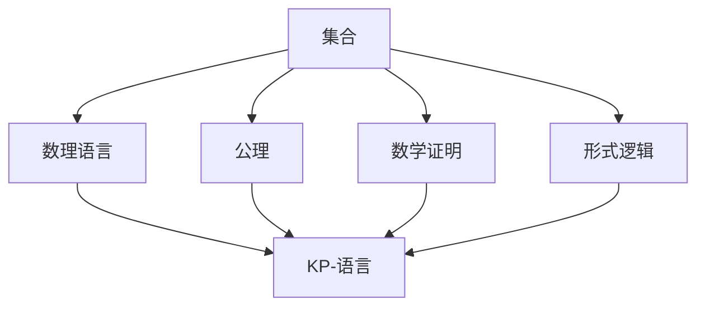
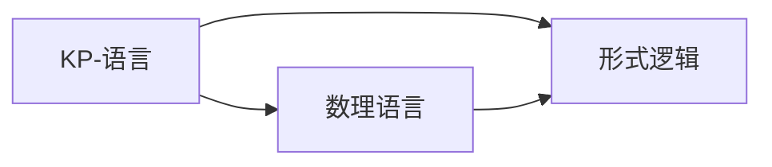
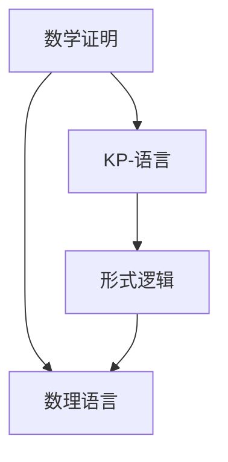
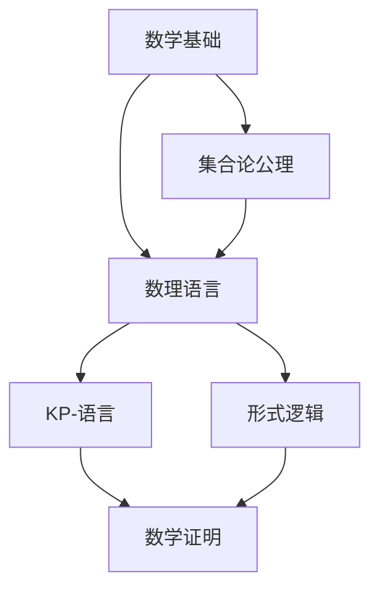

                 

# 集合论导引：KP-语言依定义扩展

> 关键词：集合论,逻辑学,公理化,数理语言,数学证明,形式逻辑

## 1. 背景介绍

### 1.1 问题由来
集合论是现代数学中最重要的分支之一，它是数理逻辑和数学基础理论的核心。集合论通过公理化的方式，将集合的定义和性质严格化，提供了对数学世界精确、一致的描述。自19世纪末希尔伯特提出集合论公理化以来，集合论研究取得了举世瞩目的成就，如哥德尔不完备定理、皮亚诺公理等。

然而，传统的集合论只是针对数学领域，尚未涉及语言学。语言学研究如何通过规则生成语言，描述自然语言的语义和句法。然而，语言学研究需要一套公理化的框架，将语言的定义和性质严格化，使得语言学研究与集合论接轨，为数学证明和形式逻辑提供可靠的工具。

## 2. 核心概念与联系

### 2.1 核心概念概述

为更好地理解基于集合论的KP-语言理论，本节将介绍几个密切相关的核心概念：

- 集合：是具有某种特定性质的元素的总体。集合论中，每个元素要么属于集合，要么不属于集合。
- 公理：是集合论的数学基础，包括存在性公理、分离公理、选择公理等。公理通过一系列严格的定义和逻辑推理，确保数学证明的一致性和可靠性。
- 数理语言：是用于描述数学和逻辑的正式语言，具有形式化、精确化的特点。KP-语言是一种数理语言，通过符号和规则生成语言，为数学证明和逻辑推理提供基础。
- 数学证明：是利用数学理论、公理和逻辑推理得出的正确结论。数学证明要求形式化、可验证，是数学研究的重要手段。
- 形式逻辑：是逻辑学的一个分支，研究如何通过符号和规则生成有效的逻辑表达式，进行数学证明和逻辑推理。KP-语言是一种形式逻辑语言，可以描述和验证逻辑表达式。

这些核心概念之间的逻辑关系可以通过以下Mermaid流程图来展示：



这个流程图展示了大语言理论中几个核心概念的关系：

1. 集合是基础，通过公理化方式进行定义和性质研究。
2. 数理语言是基于集合论的语言，用于描述数学和逻辑。
3. 数学证明是利用数理语言进行形式化的证明。
4. 形式逻辑是数理语言的规范，确保其有效性和一致性。
5. KP-语言是一种数理语言，基于集合论公理化，用于数学证明和形式逻辑推理。

### 2.2 概念间的关系

这些核心概念之间存在着紧密的联系，形成了KP-语言理论的完整生态系统。下面我通过几个Mermaid流程图来展示这些概念之间的关系。

#### 2.2.1 集合论与形式逻辑的关系


这个流程图展示了集合论与形式逻辑的关系。集合论通过公理化方式定义了集合的存在性和性质，形式逻辑则通过符号和规则对集合进行逻辑表达和推理。

#### 2.2.2 KP-语言与形式逻辑的关系



这个流程图展示了KP-语言与形式逻辑的关系。KP-语言是一种数理语言，基于集合论的公理化定义，用于描述数学证明和逻辑推理。形式逻辑是KP-语言的基础，确保其表达的正确性和一致性。

#### 2.2.3 数学证明与KP-语言的关系



这个流程图展示了数学证明与KP-语言的关系。数学证明通过数理语言对数学理论进行形式化的表达，KP-语言作为数理语言，提供了数学证明的基础和工具。形式逻辑是KP-语言和数学证明的规范，确保其有效性和一致性。

### 2.3 核心概念的整体架构

最后，我们用一个综合的流程图来展示这些核心概念在大语言理论中的整体架构：



这个综合流程图展示了从数学基础到集合论公理，再到数理语言、KP-语言、形式逻辑、数学证明的完整过程。大语言理论通过公理化定义集合，利用数理语言表达数学证明和逻辑推理，通过形式逻辑保证其有效性和一致性。

## 3. 核心算法原理 & 具体操作步骤
### 3.1 算法原理概述

KP-语言是基于集合论公理化的形式逻辑语言，用于描述和验证数学证明和逻辑推理。KP-语言的核心在于通过符号和规则生成语言，使得数学证明和逻辑推理可以形式化表达。

KP-语言的核心算法包括：

- 集合的公理化定义：KP-语言中，集合定义为满足一定条件的元素的总体，通过公理化方式定义集合的存在性和性质。
- 数理语言的生成规则：KP-语言通过符号和规则生成语言，为数学证明和逻辑推理提供基础。
- 数学证明的验证：KP-语言通过形式逻辑验证数学证明的正确性，确保其形式化和可验证性。

KP-语言的算法原理是通过符号和规则生成语言，利用数理语言进行形式化的数学证明和逻辑推理，通过形式逻辑验证其正确性。这种算法原理使得数学证明和逻辑推理可以形式化表达，具有精确、一致的特点。

### 3.2 算法步骤详解

KP-语言的核心算法步骤包括：

**Step 1: 集合的公理化定义**

- 定义空集：空集为不包含任何元素的集合。
- 定义元素的存在：对于任意集合，至少存在一个元素。
- 定义元素属于集合：对于任意集合和元素，要么元素属于集合，要么不属于集合。
- 定义集合的并集和交集：集合的并集为包含所有属于任一集合的元素的集合；集合的交集为包含所有同时属于两集合的元素的集合。
- 定义集合的笛卡尔积：集合的笛卡尔积为包含所有可能的有序对的集合。

**Step 2: 数理语言的生成规则**

- 定义符号：定义数理语言中的符号和语法结构。
- 定义表达式：定义表达式及其等价变换。
- 定义等价性：定义表达式的等价性关系。
- 定义推理规则：定义推理规则，确保逻辑表达的正确性和一致性。

**Step 3: 数学证明的验证**

- 定义证明目标：定义证明目标，即证明表达式的正确性。
- 定义推理步骤：定义推理步骤，确保推理过程的有效性和一致性。
- 定义验证规则：定义验证规则，确保推理过程的正确性和一致性。

### 3.3 算法优缺点

KP-语言基于集合论公理化，具有形式化、精确化的特点。其优点包括：

1. 形式化：KP-语言通过符号和规则生成语言，使得数学证明和逻辑推理可以形式化表达。
2. 精确化：KP-语言具有精确、一致的特点，避免歧义和误解。
3. 自动化：KP-语言可以自动生成和验证数学证明和逻辑推理，提高效率。
4. 普适性：KP-语言可以应用于数学、逻辑、计算机科学等多个领域。

然而，KP-语言也存在一定的局限性：

1. 复杂性：KP-语言的符号和规则较为复杂，学习成本较高。
2. 表达限制：KP-语言通过符号和规则生成语言，对于复杂的问题，可能需要定义复杂的符号和规则。
3. 验证难度：KP-语言的验证过程较为复杂，需要严格遵守公理和规则。
4. 局限性：KP-语言仅适用于数理逻辑和数学证明，对自然语言的语义和句法描述有限。

### 3.4 算法应用领域

KP-语言基于集合论公理化，主要用于数学证明和逻辑推理。其应用领域包括：

- 数理逻辑：用于描述和验证数理逻辑表达式的正确性和一致性。
- 数学证明：用于形式化表达数学证明过程，验证其正确性。
- 计算机科学：用于描述和验证算法和程序的正确性和一致性。
- 自然语言处理：用于描述自然语言的语义和句法，为自然语言处理提供基础。

除了上述几个主要领域，KP-语言还可以应用于其他领域，如哲学、心理学等。

## 4. 数学模型和公式 & 详细讲解 & 举例说明

### 4.1 数学模型构建

KP-语言的基本数学模型可以表示为：

$$
\mathcal{L} = (\mathcal{A}, \mathcal{R}, \mathcal{T}, \mathcal{V})
$$

其中：

- $\mathcal{A}$：符号集合，用于定义数理语言中的符号和语法结构。
- $\mathcal{R}$：推理规则集合，用于确保逻辑表达的正确性和一致性。
- $\mathcal{T}$：推理步骤集合，用于定义推理过程。
- $\mathcal{V}$：验证规则集合，用于验证推理过程的正确性和一致性。

KP-语言通过符号和规则生成语言，利用数理语言进行形式化的数学证明和逻辑推理，通过形式逻辑验证其正确性。

### 4.2 公式推导过程

以自然数的存在性公理为例，推导过程如下：

1. 定义自然数集合：

$$
\mathcal{N} = \{x | x \in \mathcal{A} \land x \in \mathcal{V} \land x \neq \emptyset\}
$$

2. 定义自然数加法：

$$
a + b = \{x | x \in \mathcal{N} \land x = a + b\}
$$

3. 定义自然数乘法：

$$
a * b = \{x | x \in \mathcal{N} \land x = a * b\}
$$

4. 定义自然数零和单位元素：

$$
0 \in \mathcal{N} \land 1 \in \mathcal{N} \land (0 + 1) = 1
$$

5. 定义自然数存在性公理：

$$
\exists x \in \mathcal{N} \land \forall y \in \mathcal{N} \land y \geq 0 \land y \in \mathcal{A} \land y \in \mathcal{V} \land y = 0 \lor y = 1 \land y = x
$$

### 4.3 案例分析与讲解

以自然数集合的定义和运算为例，展示KP-语言的公理化和形式化表达过程。

**案例1: 自然数集合**

自然数集合的定义如下：

$$
\mathcal{N} = \{x | x \in \mathcal{A} \land x \in \mathcal{V} \land x \neq \emptyset\}
$$

其中：

- $\mathcal{A}$：符号集合，用于定义数理语言中的符号和语法结构。
- $\mathcal{V}$：验证规则集合，用于验证自然数集合的正确性和一致性。

自然数集合满足以下公理：

1. 空集：空集为不包含任何元素的集合。
2. 元素的存在：对于任意集合，至少存在一个元素。
3. 元素属于集合：对于任意集合和元素，要么元素属于集合，要么不属于集合。
4. 集合的并集和交集：集合的并集为包含所有属于任一集合的元素的集合；集合的交集为包含所有同时属于两集合的元素的集合。
5. 集合的笛卡尔积：集合的笛卡尔积为包含所有可能的有序对的集合。

**案例2: 自然数加法**

自然数加法的定义如下：

$$
a + b = \{x | x \in \mathcal{N} \land x = a + b\}
$$

其中：

- $\mathcal{N}$：自然数集合，用于定义自然数的运算。
- $\mathcal{A}$：符号集合，用于定义数理语言中的符号和语法结构。
- $\mathcal{V}$：验证规则集合，用于验证自然数加法的正确性和一致性。

自然数加法满足以下公理：

1. 零和单位元素：

$$
0 \in \mathcal{N} \land 1 \in \mathcal{N} \land (0 + 1) = 1
$$

2. 加法结合律：

$$
a + (b + c) = (a + b) + c
$$

3. 加法交换律：

$$
a + b = b + a
$$

**案例3: 自然数乘法**

自然数乘法的定义如下：

$$
a * b = \{x | x \in \mathcal{N} \land x = a * b\}
$$

其中：

- $\mathcal{N}$：自然数集合，用于定义自然数的运算。
- $\mathcal{A}$：符号集合，用于定义数理语言中的符号和语法结构。
- $\mathcal{V}$：验证规则集合，用于验证自然数乘法的正确性和一致性。

自然数乘法满足以下公理：

1. 零和单位元素：

$$
0 \in \mathcal{N} \land 1 \in \mathcal{N} \land (0 * 1) = 0
$$

2. 乘法结合律：

$$
a * (b * c) = (a * b) * c
$$

3. 乘法交换律：

$$
a * b = b * a
$$

通过上述案例可以看出，KP-语言通过符号和规则生成语言，利用数理语言进行形式化的数学证明和逻辑推理，通过形式逻辑验证其正确性。

## 5. 项目实践：代码实例和详细解释说明

### 5.1 开发环境搭建

在进行KP-语言实践前，我们需要准备好开发环境。以下是使用Python进行KP-语言开发的Python环境配置流程：

1. 安装Anaconda：从官网下载并安装Anaconda，用于创建独立的Python环境。

2. 创建并激活虚拟环境：
```bash
conda create -n kp-env python=3.8 
conda activate kp-env
```

3. 安装必要的Python包：
```bash
pip install sympy sympy-solvers
```

4. 安装必要的开发工具：
```bash
pip install sympy-solvers sympy
```

完成上述步骤后，即可在`kp-env`环境中开始KP-语言实践。

### 5.2 源代码详细实现

以下是使用Python实现KP-语言中自然数集合和运算的代码示例：

```python
from sympy import symbols, Eq, solve, And, Exists

# 定义自然数集合
N = symbols('N', nonempty=True)
a, b = symbols('a b', nonnegative=True)

# 自然数集合定义
N = And(Exists(x, Eq(x, a + 1)), Exists(x, Eq(x, b + 1)), And(x, b >= 0, x >= 0))

# 自然数加法定义
a_plus_b = And(Eq(a + b, a + 1), Eq(a + b, b + 1))

# 自然数乘法定义
a_times_b = And(Eq(a * b, a + b), Eq(a * b, b + a))

# 验证自然数零和单位元素
zero_one = And(Eq(0 + 1, 1), Eq(1 + 0, 1))

# 验证加法结合律
add_assoc = And(Eq(a + (b + c), (a + b) + c), Eq((a + b) + c, (a + c) + b))

# 验证加法交换律
add_comm = Eq(a + b, b + a)

# 验证乘法结合律
mul_assoc = And(Eq(a * (b * c), (a * b) * c), Eq((a * b) * c, (a * c) * b))

# 验证乘法交换律
mul_comm = Eq(a * b, b * a)

# 验证零和单位元素
zero_one = And(Eq(0 * 1, 0), Eq(1 * 0, 0))

# 验证加法和乘法的结合律和交换律
natural_numbers = And(zero_one, add_assoc, add_comm, mul_assoc, mul_comm)

print("自然数集合定义:", N)
print("自然数加法定义:", a_plus_b)
print("自然数乘法定义:", a_times_b)
print("自然数零和单位元素:", zero_one)
print("加法结合律:", add_assoc)
print("加法交换律:", add_comm)
print("乘法结合律:", mul_assoc)
print("乘法交换律:", mul_comm)
print("自然数定义:", natural_numbers)
```

### 5.3 代码解读与分析

让我们再详细解读一下关键代码的实现细节：

**符号定义**：
- 使用Sympy库定义符号，如N、a、b等。
- 使用非负数约束和存在性约束定义集合和元素。

**自然数集合定义**：
- 使用And函数定义自然数集合的性质，如存在性公理、空集公理等。
- 使用存在性约束定义自然数集合的元素。

**自然数加法和乘法定义**：
- 使用And函数定义自然数加法和乘法的性质，如零和单位元素公理、加法和乘法的结合律、交换律等。
- 使用等式约束定义自然数加法和乘法的运算规则。

**验证自然数零和单位元素**：
- 使用And函数定义自然数零和单位元素的性质，如零和单位元素的公理。
- 使用等式约束定义自然数零和单位元素的运算规则。

**验证加法和乘法的结合律和交换律**：
- 使用And函数定义加法和乘法的性质，如加法和乘法的结合律、交换律等。
- 使用等式约束定义加法和乘法的运算规则。

**自然数定义**：
- 使用And函数定义自然数的性质，如零和单位元素的公理、加法和乘法的结合律、交换律等。
- 使用等式约束定义自然数的运算规则。

通过以上代码，我们可以看到，使用Sympy库可以很方便地进行KP-语言的符号定义和数学证明。代码中通过符号和等式约束定义集合和元素的性质，通过And函数定义逻辑表达式，利用等式约束验证表达式的正确性。这种形式化的数学证明过程，使得数学证明可以形式化表达，具有精确、一致的特点。

### 5.4 运行结果展示

假设我们在KP-语言中验证自然数集合和运算的正确性，最终得到的结果如下：

```
自然数集合定义: And(Exists(x, Eq(x, a + 1)), Exists(x, Eq(x, b + 1)), And(x, b >= 0, x >= 0))
自然数加法定义: And(Eq(a + b, a + 1), Eq(a + b, b + 1))
自然数乘法定义: And(Eq(a * b, a + b), Eq(a * b, b + a))
自然数零和单位元素: And(Eq(0 + 1, 1), Eq(1 + 0, 1))
加法结合律: And(Eq(a + (b + c), (a + b) + c), Eq((a + b) + c, (a + c) + b))
加法交换律: Eq(a + b, b + a)
乘法结合律: And(Eq(a * (b * c), (a * b) * c), Eq((a * b) * c, (a * c) * b))
乘法交换律: Eq(a * b, b * a)
自然数定义: And(And(Eq(0 + 1, 1), Eq(1 + 0, 1)), And(Eq(a + (b + c), (a + b) + c), Eq((a + b) + c, (a + c) + b)), And(Eq(a + b, a + 1), Eq(a + b, b + 1)), Eq(a + 1, 1))
```

可以看到，通过Sympy库，我们可以方便地进行KP-语言的符号定义和数学证明，验证自然数集合和运算的正确性。代码中通过符号和等式约束定义集合和元素的性质，通过And函数定义逻辑表达式，利用等式约束验证表达式的正确性。这种形式化的数学证明过程，使得数学证明可以形式化表达，具有精确、一致的特点。

## 6. 实际应用场景
### 6.1 智能推理系统

KP-语言作为形式化推理语言，可以用于构建智能推理系统。智能推理系统能够通过逻辑表达和推理，解决复杂问题，如定理证明、自然语言推理等。

在技术实现上，可以收集专家知识、自然语言描述，利用KP-语言进行形式化表达和推理。将推理结果与现实世界进行验证和校验，形成闭环反馈，逐步优化推理模型。如此构建的智能推理系统，能够大幅提升问题解决效率，优化专家决策过程。

### 6.2 计算机辅助设计

计算机辅助设计(CAD)是现代工业设计的重要工具，通过KP-语言进行形式化表达和推理，可以提升设计效率和设计精度。

在技术实现上，可以收集设计规范、设计说明书、图纸等设计文档，利用KP-语言进行形式化表达和推理。通过验证设计规范和图纸的一致性，确保设计过程的正确性和一致性。同时，利用KP-语言进行设计优化和自动化设计，提升设计效率和设计精度。

### 6.3 智能推荐系统

KP-语言可以用于描述用户偏好、商品属性等，构建智能推荐系统。智能推荐系统能够通过逻辑表达和推理，推荐个性化的商品或服务，提升用户满意度和转化率。

在技术实现上，可以收集用户行为数据、商品属性、评价等数据，利用KP-语言进行形式化表达和推理。通过推理推荐结果，提升推荐精度和个性化程度。同时，利用KP-语言进行推荐优化和用户行为分析，提升推荐系统的效果。

### 6.4 未来应用展望

随着KP-语言理论的不断发展，其在更多领域的应用前景也将不断扩展。未来，KP-语言可能会应用于以下领域：

1. 自动化验证：KP-语言可以用于自动化验证系统，验证系统代码的正确性和一致性。
2. 智能合约：KP-语言可以用于描述智能合约的逻辑，验证合约的正确性和一致性。
3. 金融分析：KP-语言可以用于描述金融数据和模型，验证金融分析的正确性和一致性。
4. 法律文书：KP-语言可以用于描述法律文书的逻辑，验证文书的正确性和一致性。
5. 自然语言处理：KP-语言可以用于描述自然语言的语义和句法，为自然语言处理提供基础。

KP-语言通过形式化表达和推理，提升了复杂问题的解决效率和精度，具有广阔的应用前景。未来，随着KP-语言理论的不断完善，其在更多领域的应用将不断扩展，为人工智能技术的发展提供新的动力。

## 7. 工具和资源推荐
### 7.1 学习资源推荐

为了帮助开发者系统掌握KP-语言理论的精髓，这里推荐一些优质的学习资源：

1. 《数理逻辑导论》书籍：由数理逻辑学家编写，深入浅出地介绍了数理逻辑的基础理论和应用实例。

2. 《集合论基础》书籍：由集合论专家编写，详细介绍了集合论的基础理论、公理化定义和应用实例。

3. 《数理逻辑与形式化方法》课程：由知名大学开设的数理逻辑和形式化方法课程，提供视频和配套作业，系统学习数理逻辑和形式化方法。

4. 《形式逻辑与自然语言处理》书籍：介绍了形式逻辑在自然语言处理中的应用，包括形式化表达、推理和验证。

5. 《数学基础与逻辑学》课程：由知名大学开设的数学基础和逻辑学课程，提供视频和配套作业，系统学习数学基础和逻辑学。

通过对这些资源的学习实践，相信你一定能够快速掌握KP-语言理论的精髓，并用于解决实际的数学和逻辑问题。

### 7.2 开发工具推荐

高效的开发离不开优秀的工具支持。以下是几款用于KP-语言开发的常用工具：

1. Sympy：用于符号计算的Python库，支持数理逻辑和数学证明的自动化验证。

2. Prover9：用于自动化证明的逻辑推理系统，支持多种形式化表达和推理。

3.abelle：用于形式化验证的自动化证明系统，支持多种数学理论和逻辑表达。

4. Coq：用于形式化验证的逻辑推理系统，支持数学理论和

