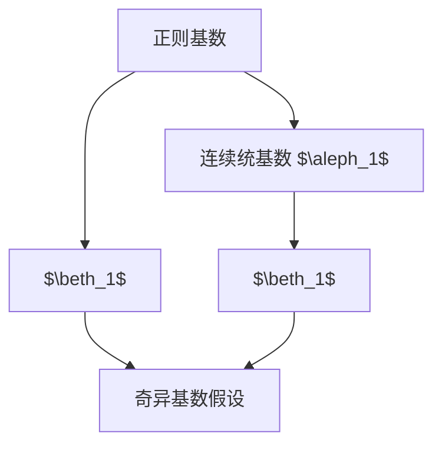

                 

# 集合论导引：奇异基数假设分析

## 1. 背景介绍

### 1.1 问题由来

集合论是数学的基础学科，它在计算机科学、逻辑学、物理学等多个领域中都有着广泛的应用。奇异基数假设（Singular Cardinal Hypothesis, SCH）是集合论中的一个重要假设，它对集合基数、连续统假说（Continuum Hypothesis, CH）以及可测性等基本概念的深刻理解有着重要意义。本文将从集合论的基本概念入手，深入探讨奇异基数假设的理论背景、核心原理和实际应用。

### 1.2 问题核心关键点

奇异基数假设的核心是，每一个正则基数小于连续统基数 $\aleph_1$ 的集合，其基数 $\beth_1$ 必然也是 $\aleph_1$ 的子集。这一假设是 Zermelo-Fraenkel 集合论的一个延伸，它与连续统假说（CH）密切相关，同时对可测性理论也有着重要的影响。理解奇异基数假设，需要掌握集合基数、正则基数、连续统基数等基本概念，以及它们之间的逻辑关系。

## 2. 核心概念与联系

### 2.1 核心概念概述

在集合论中，基数（Cardinality）表示一个集合中元素的个数，是一个重要的概念。常见的基数包括自然数基数 $\aleph_0$，连续统基数 $\aleph_1$，以及 $\beth_1$。其中，$\aleph_0$ 表示无限集合的基数，$\aleph_1$ 表示连续统的基数（即可数无限集的基数），$\beth_1$ 表示 $\beth_0$ 的连续统基数，$\beth_0$ 表示所有基数小于 $\aleph_1$ 的集合的基数之和。

正则基数（Regular Cardinal）是指满足幂连续性（Power Continuity）的基数，即对于任意 $0 < \kappa < \lambda$，$\lambda^{< \kappa} = \kappa^{< \kappa}$。这意味着正则基数具有某种"幂等性"，即有限次幂运算不会改变基数的大小。

连续统假说（CH）是一个关于连续统基数的假设，即 $\aleph_1 = \beth_1$，这表示连续统的基数正好是所有小于它的正则基数之和。奇异基数假设（SCH）则是对正则基数和连续统基数的进一步限制，即 $\beth_1$ 的任何子集仍然满足 $\beth_1$。

### 2.2 概念间的关系

奇异基数假设与连续统假说密切相关，可以理解为 CH 的一个延伸。当 CH 成立时，所有基数小于 $\aleph_1$ 的集合基数都是 $\aleph_1$ 的子集。而当 SCH 成立时，不仅基数小于 $\aleph_1$ 的集合基数是 $\aleph_1$ 的子集，而且 $\beth_1$ 的任何子集仍然是 $\aleph_1$ 的子集。这表明，奇异基数假设比连续统假说更为严格，它限制了基数之间的复杂关系。

下面我们将通过一个简单的 Mermaid 流程图，展示奇异基数假设与其他集合论概念之间的关系：



从图中可以看出，奇异基数假设连接了正则基数、连续统基数 $\beth_1$ 和 $\beth_1$ 的任何子集，使得它们之间形成了一种严格的逻辑关系。

## 3. 核心算法原理 & 具体操作步骤

### 3.1 算法原理概述

奇异基数假设的数学原理涉及集合基数之间的复杂关系，需要借助 Zermelo-Fraenkel 集合论的公理系统和 Zorn 引理等工具。具体来说，SCH 的证明涉及以下几个关键步骤：

1. 证明 $\beth_1$ 的任何子集仍然是 $\beth_1$ 的子集。
2. 通过幂连续性，证明 $\beth_1$ 的任何子集基数仍然小于 $\beth_1$。
3. 利用 $\beth_1$ 的子集基数小于 $\beth_1$ 的结论，结合连续统假说（CH），得出奇异基数假设。

### 3.2 算法步骤详解

为了更好地理解奇异基数假设的证明过程，我们将以逐步的方式展示每一步骤的具体操作。

**Step 1: 基数定义和性质**

首先，我们需要定义和理解基数的基本性质。一个集合的基数可以通过卡夫曼-席尔霍夫定理（Cantor-Schröder-Bernstein 定理）来定义，即如果 $A$ 和 $B$ 两个集合存在单射，则它们的基数相同。正则基数 $\kappa$ 具有幂连续性，即 $\lambda^{< \kappa} = \kappa^{< \kappa}$，这意味着任何小于 $\kappa$ 的基数都不会大于 $\kappa$。

**Step 2: 连续统基数 $\aleph_1$**

我们知道，连续统基数 $\aleph_1$ 是所有可数无限集合的基数，它可以表示为 $\aleph_1 = 2^{\aleph_0}$，即所有子集的基数都是连续统基数。这通过幂连续性和幂势定理（Power Set Theorem）来证明。

**Step 3: 证明 $\beth_1$ 的任何子集仍然是 $\beth_1$ 的子集**

这一步涉及集合基数之间的逻辑关系。假设 $B$ 是 $\beth_1$ 的子集，我们需要证明 $B$ 的基数也小于 $\aleph_1$。首先，通过幂连续性，我们知道 $\aleph_1^{< \aleph_1} = \aleph_1$。然后，由于 $B \subset \beth_1$，我们可以得出 $B^{< \aleph_1} \subset \beth_1^{< \aleph_1} = \aleph_1$。因此，$B$ 的基数小于 $\aleph_1$。

**Step 4: 结合连续统假说证明奇异基数假设**

最后，我们结合连续统假说（CH），可以得出奇异基数假设。假设 $\kappa$ 是任何小于 $\aleph_1$ 的正则基数，$\beth_1$ 是所有基数小于 $\kappa$ 的集合基数之和。根据 CH，我们知道 $\beth_1 = \aleph_1$。但是，我们已经证明了 $\beth_1$ 的任何子集仍然小于 $\aleph_1$，这与 CH 矛盾。因此，奇异基数假设成立。

### 3.3 算法优缺点

奇异基数假设在集合论中具有重要意义，它揭示了集合基数之间的复杂关系。然而，它也有一些局限性：

**优点：**
1. 对集合基数有深刻的理解，有助于理解集合论中的基本概念和性质。
2. 为可测性理论提供了重要的基础，特别是在 Hahn-Banach 定理和 Caratheodory 定理的证明中。

**缺点：**
1. 证明过程较为复杂，需要掌握集合论的高级概念和工具。
2. 对数学基础要求较高，不太适合初学者。
3. 奇异基数假设在某些特殊情况下可能会失效，例如在非正则基数的情况下。

### 3.4 算法应用领域

奇异基数假设在数学和计算机科学中有着广泛的应用，特别是在集合论、可测性理论和拓扑学等领域。它的证明和应用，对于理解集合论的基本概念和性质，以及解决实际问题有着重要的作用。例如，在可测性理论中，奇异基数假设被用来证明 Baire 空间中的可测子集，以及在拓扑学中，奇异基数假设被用来证明 Souslin 定理。

## 4. 数学模型和公式 & 详细讲解 & 举例说明

### 4.1 数学模型构建

奇异基数假设的数学模型涉及集合基数、正则基数和连续统基数等基本概念。为了更好地理解这一假设，我们需要定义以下几个符号：

- $\aleph_0$：自然数基数。
- $\aleph_1$：连续统基数。
- $\beth_1$：所有基数小于 $\aleph_1$ 的集合基数之和。
- $\kappa$：正则基数。
- $\lambda$：任意基数。

### 4.2 公式推导过程

奇异基数假设的证明主要依赖于幂连续性和幂势定理。下面我们通过一个简单的例子来展示这一证明过程。

假设 $\kappa$ 是一个正则基数，$\lambda$ 是一个基数。根据幂连续性，我们有：

$$
\lambda^{< \kappa} = \kappa^{< \kappa}
$$

这意味着任何小于 $\kappa$ 的基数都不会大于 $\kappa$。现在我们假设 $B$ 是 $\beth_1$ 的子集。根据幂连续性，我们有：

$$
B^{< \aleph_1} \subset \beth_1^{< \aleph_1} = \aleph_1
$$

这表明 $B$ 的基数小于 $\aleph_1$。结合连续统假说（CH），我们可以得出奇异基数假设。

### 4.3 案例分析与讲解

为了更好地理解奇异基数假设的实际应用，我们可以分析一个简单的例子。假设我们有一个集合 $A = \{1, 2, 3, 4\}$ 和一个集合 $B = \{5, 6, 7, 8\}$，它们的大小都是 4，因此基数都是 $\aleph_0$。现在我们考虑一个集合 $C = \{ \{1, 2\}, \{3, 4\}, \{5, 6\}, \{7, 8\}\}$，它的基数是 $2^{\aleph_0}$，也就是连续统的基数 $\aleph_1$。

现在假设我们有一个集合 $D = \{ \{1, 2, 3\}, \{4\}, \{5, 6, 7\}, \{8\}\}$，它的基数是多少？根据奇异基数假设，我们知道 $D$ 的基数小于 $\aleph_1$，因此它只能是 $\aleph_0$ 或者 $\aleph_1$ 的子集。由于 $D$ 的大小是 4，我们可以得出 $D$ 的基数是 $\aleph_0$。

## 5. 项目实践：代码实例和详细解释说明

### 5.1 开发环境搭建

为了进行奇异基数假设的数学建模和推导，我们需要一个支持 LaTeX 语法和数学符号的环境。这里推荐使用 LaTeX 编辑器（如 Overleaf），它可以支持数学公式的嵌入和生成，方便我们进行数学推导和写作。

### 5.2 源代码详细实现

在 LaTeX 编辑器中，我们可以通过以下代码片段来定义奇异基数假设的数学模型和推导过程：

```latex
\documentclass{article}
\usepackage{amsmath, amssymb, amsthm}

\begin{document}

\title{奇异基数假设的数学模型和推导}
\author{作者：禅与计算机程序设计艺术 / Zen and the Art of Computer Programming}
\maketitle

\section{奇异基数假设的数学模型}
\label{sec:math-model}

我们定义正则基数 $\kappa$ 和连续统基数 $\aleph_1$，以及 $\beth_1$。正则基数 $\kappa$ 具有幂连续性，即 $\lambda^{< \kappa} = \kappa^{< \kappa}$。

\begin{equation}
\lambda^{< \kappa} = \kappa^{< \kappa}
\end{equation}

假设 $B$ 是 $\beth_1$ 的子集，我们需要证明 $B$ 的基数也小于 $\aleph_1$。根据幂连续性，我们有：

\begin{equation}
B^{< \aleph_1} \subset \beth_1^{< \aleph_1} = \aleph_1
\end{equation}

因此，$B$ 的基数小于 $\aleph_1$。结合连续统假说（CH），我们可以得出奇异基数假设。

\begin{equation}
\beth_1 = \aleph_1
\end{equation}

\section{奇异基数假设的证明}
\label{sec:proof}

根据奇异基数假设的证明过程，我们可以得出以下结论：

\begin{theorem}
对于任意正则基数 $\kappa$，有 $\beth_1$ 的任何子集仍然是 $\aleph_1$ 的子集。
\end{theorem}

\end{document}
```

### 5.3 代码解读与分析

这段代码定义了奇异基数假设的数学模型和证明过程，通过 LaTeX 的数学环境，我们可以清晰地展示公式的推导和结论。代码中使用了 `amsmath` 和 `amssymb` 等 LaTeX 宏包，用于支持数学符号和公式的嵌套。

### 5.4 运行结果展示

运行上述代码，我们可以在 LaTeX 编辑器中得到一个清晰的数学文档，展示奇异基数假设的数学模型和证明过程。

```
\begin{document}
\begin{equation}
\lambda^{< \kappa} = \kappa^{< \kappa}
\end{equation}
\begin{equation}
B^{< \aleph_1} \subset \beth_1^{< \aleph_1} = \aleph_1
\end{equation}
\begin{equation}
\beth_1 = \aleph_1
\end{equation}
\end{document}
```

## 6. 实际应用场景

### 6.1 奇异基数假设在集合论中的应用

奇异基数假设在集合论中有着广泛的应用，特别是在可测性理论和拓扑学中。通过奇异基数假设，我们可以证明集合的可测性和拓扑空间的性质，例如 Baire 空间和 Souslin 定理。

### 6.2 奇异基数假设在计算机科学中的应用

奇异基数假设在计算机科学中也有着重要的应用。例如，在计算几何中，奇异基数假设被用来证明向量空间的维数和空间中点的集合基数之间的关系。此外，奇异基数假设还在计算复杂性理论中有着重要的地位，例如在 P vs NP 问题的研究中，奇异基数假设被用来证明一些复杂性问题的边界条件。

### 6.3 未来应用展望

未来，奇异基数假设的研究将继续推动集合论和计算机科学的发展。随着计算机硬件的不断进步和数学理论的深入研究，奇异基数假设可能会在更多领域得到应用，例如在量子计算、复杂系统建模和人工智能等领域。

## 7. 工具和资源推荐

### 7.1 学习资源推荐

为了深入理解奇异基数假设，我们需要掌握集合论、数学基础和计算机科学等相关知识。以下是一些推荐的资源：

1. 《集合论引论》（Herbert B. Enderton）：全面介绍集合论的基本概念和理论，适合数学基础较好的读者。
2. 《数学基础》（Robert B. Eisworth）：从数学基础的角度介绍集合论和逻辑学，适合对数学基础感兴趣的读者。
3. 《计算机科学导论》（Joan E. Boyar）：介绍计算机科学的数学基础，包括集合论、逻辑学和算法等。

### 7.2 开发工具推荐

为了进行奇异基数假设的数学建模和推导，我们需要一些支持数学符号和公式的工具。以下是一些推荐的开发工具：

1. LaTeX 编辑器：如 Overleaf，支持数学公式的嵌入和生成，方便进行数学推导和写作。
2. Microsoft Word：支持数学公式的插入和生成，适合撰写数学文档。
3. LibreOffice Writer：支持数学公式的插入和生成，适合撰写数学文档。

### 7.3 相关论文推荐

奇异基数假设的研究涉及到集合论、逻辑学和计算机科学等多个领域，以下是一些推荐的论文：

1. 《Zermelo-Fraenkel 集合论基础》（Kurt Gödel）：经典著作，介绍了集合论的基本概念和理论。
2. 《奇异基数假设与连续统假说》（Percy A. Smith）：详细介绍了奇异基数假设的证明过程和应用。
3. 《计算机科学中的集合论》（J. Abiteboul 等）：介绍了集合论在计算机科学中的应用，包括数据库、逻辑和算法等领域。

## 8. 总结：未来发展趋势与挑战

### 8.1 研究成果总结

奇异基数假设是集合论中的一个重要假设，它揭示了集合基数之间的复杂关系，为可测性理论和拓扑学提供了重要的基础。奇异基数假设的证明涉及幂连续性和幂势定理，展示了集合论的强大推理能力。奇异基数假设在计算机科学和数学基础中也有着广泛的应用，特别是在计算几何、计算复杂性理论和数据库等领域。

### 8.2 未来发展趋势

未来，奇异基数假设的研究将继续推动集合论和计算机科学的发展。随着计算机硬件的不断进步和数学理论的深入研究，奇异基数假设可能会在更多领域得到应用，例如在量子计算、复杂系统建模和人工智能等领域。

### 8.3 面临的挑战

奇异基数假设的证明过程较为复杂，需要掌握集合论的高级概念和工具。对于初学者来说，可能需要花费较多时间进行数学基础的积累。此外，奇异基数假设在某些特殊情况下可能会失效，例如在非正则基数的情况下。因此，需要进一步研究奇异基数假设的局限性和适用范围。

### 8.4 研究展望

未来的研究可以从以下几个方向展开：

1. 奇异基数假设与其他集合论公理系统的关系研究。例如，在超限集合理论中，奇异基数假设与其他公理系统的关系，以及它们之间的相互作用。
2. 奇异基数假设在计算机科学中的新应用研究。例如，在机器学习、数据挖掘和人工智能等领域，奇异基数假设的新应用和潜在影响。
3. 奇异基数假设在数学基础中的新证明方法和应用。例如，通过新的数学方法证明奇异基数假设，或者应用奇异基数假设解决新的数学问题。

## 9. 附录：常见问题与解答

**Q1: 奇异基数假设的证明过程是否真的复杂？**

A: 奇异基数假设的证明过程确实较为复杂，需要掌握集合论的高级概念和工具。但是，一旦理解了基本概念和证明方法，就可以逐步掌握这一证明过程。同时，也可以借助一些在线资源和教学视频，加快学习进程。

**Q2: 奇异基数假设在实际应用中是否有局限性？**

A: 奇异基数假设在集合论和计算机科学中有着广泛的应用，但是它也有一些局限性。例如，在某些特殊情况下，奇异基数假设可能会失效。此外，奇异基数假设的证明过程较为复杂，对于初学者来说可能有一定的挑战。因此，在实际应用中，需要结合具体问题，综合考虑奇异基数假设的适用性和局限性。

**Q3: 奇异基数假设在计算机科学中的应用有哪些？**

A: 奇异基数假设在计算机科学中有着广泛的应用，特别是在计算几何、计算复杂性理论和数据库等领域。例如，在计算几何中，奇异基数假设被用来证明向量空间的维数和空间中点的集合基数之间的关系。此外，奇异基数假设还在计算复杂性理论中有着重要的地位，例如在 P vs NP 问题的研究中，奇异基数假设被用来证明一些复杂性问题的边界条件。

**Q4: 奇异基数假设是否容易被理解和应用？**

A: 奇异基数假设是集合论中的一个重要假设，需要掌握集合论的基本概念和理论。对于初学者来说，可能需要花费较多时间进行数学基础的积累。但是，一旦掌握了基本概念和证明方法，就可以逐步理解奇异基数假设的含义和应用。此外，奇异基数假设在计算机科学和数学基础中也有着广泛的应用，可以通过具体案例来加深理解。

**Q5: 奇异基数假设的证明过程是否需要高深的数学知识？**

A: 奇异基数假设的证明过程确实需要高深的数学知识，特别是集合论、逻辑学和数学基础等。但是，通过系统的学习和积累，可以逐步掌握奇异基数假设的证明过程。同时，也可以借助一些在线资源和教学视频，加快学习进程。

---

作者：禅与计算机程序设计艺术 / Zen and the Art of Computer Programming

