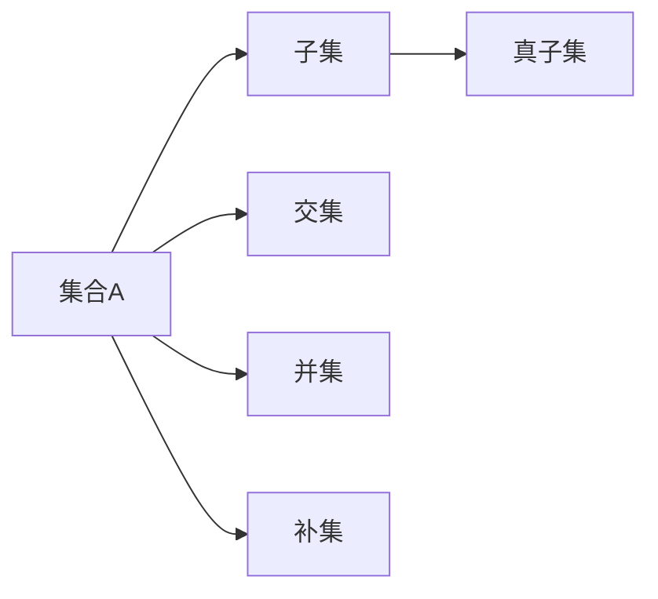
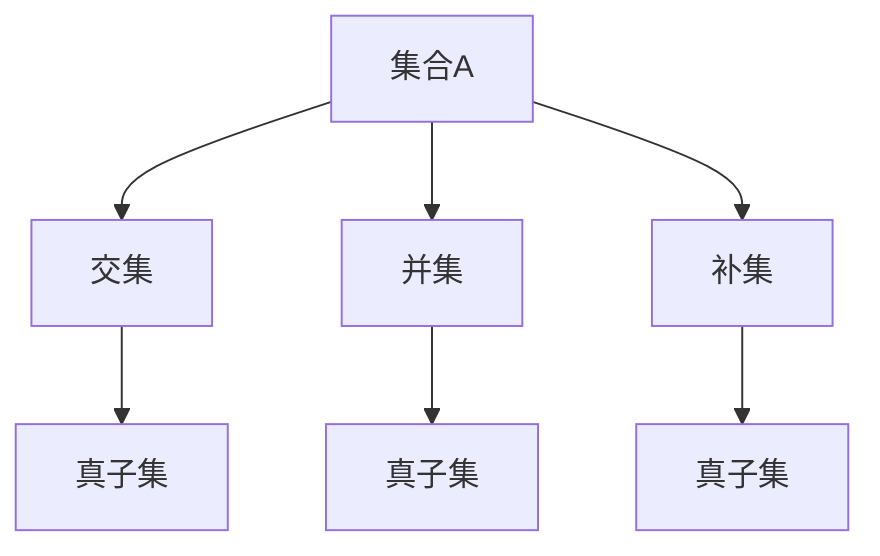
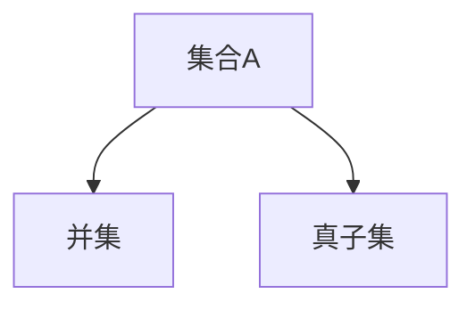
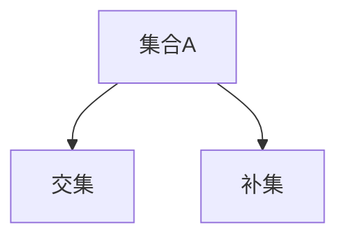
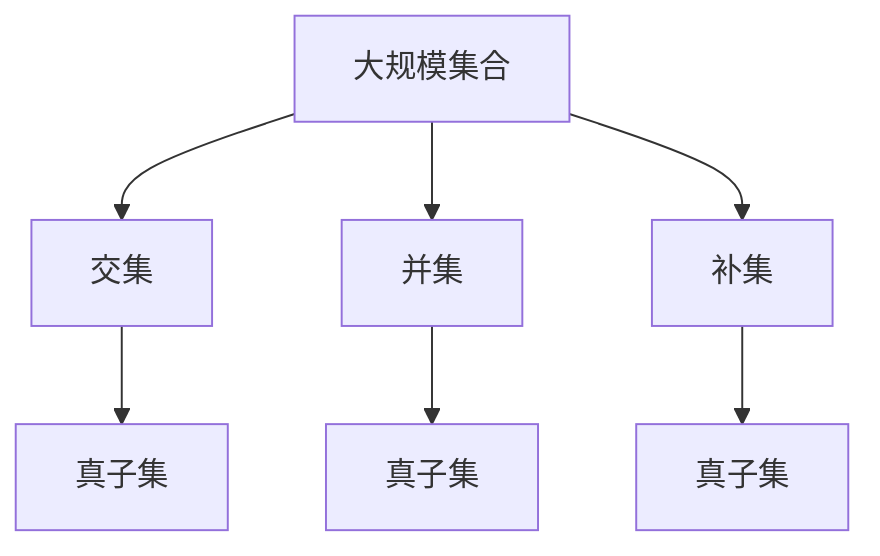

                 

# 集合论导引：完备子集特性

> 关键词：集合论,完备性,子集,集合运算,数学模型,算法步骤,应用领域,数学公式,案例分析,项目实践,实际应用,未来展望,学习资源,开发工具,相关论文,研究成果,发展趋势,挑战

## 1. 背景介绍

### 1.1 问题由来

集合论是数学的基础分支之一，其核心是研究集合及其性质。在计算机科学中，集合论的知识广泛应用于数据结构、算法、程序设计等多个领域。尤其是在软件工程和人工智能中，集合理论提供了丰富的工具和方法，如集合运算、子集生成等。完备子集特性作为集合论中的重要概念，涉及集合的完全性和覆盖性，深刻影响了算法设计和应用。

### 1.2 问题核心关键点

完备子集特性描述了在特定条件下，一个集合及其子集之间完全覆盖的关系。这种特性在集合运算、数据结构和算法设计中具有重要的理论和实践意义。具体表现为：
- 子集覆盖：任何元素都必须在某个子集中。
- 子集完备：所有子集均已生成。

完备子集特性的实现涉及集合的创建、遍历、生成和关系判断等操作，是算法设计的基础。

### 1.3 问题研究意义

研究完备子集特性，对于理解集合论的核心思想、提高算法效率和准确性、推动软件工程的发展具有重要意义：

1. 提高算法效率：通过优化集合运算和子集生成算法，显著提升算法执行效率。
2. 增强数据结构稳定性：保证数据结构中元素和子集的有效性和完整性。
3. 促进软件工程应用：在软件工程中广泛应用集合理论，如软件测试、数据管理、版本控制等。
4. 增强程序设计能力：通过集合理论的指导，提升程序员的逻辑思维和程序设计能力。

## 2. 核心概念与联系

### 2.1 核心概念概述

为更好地理解完备子集特性，本节将介绍几个密切相关的核心概念：

- 集合(Set)：由确定的元素组成，可以是有限或无限的。集合通常用花括号 {} 表示，元素之间用逗号分隔。例如，集合 A = {1, 2, 3}。
- 子集(Subset)：属于某个集合的所有元素构成的集合。例如，集合 A 的子集可以是 {1} 或 {1, 2, 3}。
- 真子集(Proper Subset)：除了自身之外的所有子集。例如，集合 A 的真子集可以是 {1} 或 {1, 2}。
- 交集(Intersection)：多个集合的公共元素构成的集合。例如，集合 A 和 B 的交集 A∩B = {1, 2}。
- 并集(Union)：多个集合的元素构成的集合，重复元素只保留一份。例如，集合 A 和 B 的并集 A∪B = {1, 2, 3}。
- 补集(Complement)：在一个全集中，不属于某个集合的元素构成的集合。例如，集合 A 的补集 U-A = {4, 5}。

这些概念之间的逻辑关系可以通过以下Mermaid流程图来展示：



这个流程图展示了集合及其子集的基本关系：

1. 子集：属于集合的元素构成子集。
2. 真子集：子集中去除自身，剩下的元素构成真子集。
3. 交集：多个集合的公共元素构成交集。
4. 并集：多个集合的元素构成并集。
5. 补集：全集中不属于集合的元素构成补集。

### 2.2 概念间的关系

这些核心概念之间存在着紧密的联系，形成了集合运算的基础生态系统。下面我通过几个Mermaid流程图来展示这些概念之间的关系。

#### 2.2.1 集合运算流程图



这个流程图展示了集合的基本运算关系：

1. 交集：多个集合的公共元素构成交集。
2. 并集：多个集合的元素构成并集。
3. 补集：全集中不属于集合的元素构成补集。
4. 真子集：去除自身后的子集。

#### 2.2.2 真子集与并集的关系



这个流程图展示了真子集与并集的关系：

- 并集：包含集合的所有元素。
- 真子集：并集中去除自身后剩余的部分。

#### 2.2.3 交集与补集的关系



这个流程图展示了交集与补集的关系：

- 交集：多个集合的公共元素。
- 补集：全集中不属于集合的元素。

### 2.3 核心概念的整体架构

最后，我们用一个综合的流程图来展示这些核心概念在大规模集合运算中的整体架构：



这个综合流程图展示了在大规模集合运算中，交集、并集、补集和真子集的基本关系。通过这些概念的相互操作，可以高效地处理大规模数据集，实现算法的优化和数据的有效管理。

## 3. 核心算法原理 & 具体操作步骤
### 3.1 算法原理概述

完备子集特性的核心在于确保集合中每个元素都包含在某个子集中，且所有子集均已生成。为了实现这一特性，通常使用集合生成算法和子集关系判断算法。

### 3.2 算法步骤详解

以下详细讲解如何通过算法实现集合的完备子集特性：

**Step 1: 定义集合和元素**

首先，定义需要处理的集合 $S$ 和其中的元素 $S = \{s_1, s_2, ..., s_n\}$。

**Step 2: 生成所有子集**

使用递归或迭代算法，生成集合 $S$ 的所有子集。例如，集合 $\{1, 2, 3\}$ 的子集有 $\{\}, \{1\}, \{2\}, \{3\}, \{1, 2\}, \{1, 3\}, \{2, 3\}, \{1, 2, 3\}$。

**Step 3: 判断完备性**

对于每个子集，判断是否包含所有元素。如果不包含，则添加到子集中。如果所有子集都已生成，且每个子集都包含所有元素，则判断完备性成立。

**Step 4: 输出结果**

输出所有的子集，如果完备性成立，则输出“集合完备”，否则输出“集合不完整”。

### 3.3 算法优缺点

完备子集特性算法具有以下优点：
- 精确性高：确保每个元素都包含在某个子集中，且所有子集均已生成。
- 适用范围广：适用于任何规模的集合，包括有限和无限集合。
- 可扩展性强：可以处理大规模数据集，适用于分布式计算环境。

同时，该算法也存在一些缺点：
- 时间复杂度高：生成所有子集的时间复杂度为 $O(2^n)$，效率较低。
- 空间复杂度高：需要存储所有子集，占用大量内存。
- 算法复杂度高：递归或迭代算法实现较为复杂，容易出错。

### 3.4 算法应用领域

完备子集特性算法在多个领域中具有广泛应用：

- 数据结构：在集合运算、树结构、图结构等数据结构中，常用于集合生成、关系判断、路径搜索等。
- 算法设计：在排序算法、搜索算法、图算法等中，常用于集合生成、子集选择、路径规划等。
- 软件工程：在软件测试、版本控制、配置管理等中，常用于集合生成、子集遍历、关系判断等。
- 人工智能：在机器学习、自然语言处理、计算机视觉等中，常用于特征选择、数据预处理、模型评估等。

## 4. 数学模型和公式 & 详细讲解 & 举例说明

### 4.1 数学模型构建

完备子集特性涉及集合的基本运算，可以表示为以下数学模型：

设 $S$ 为集合，$A$ 为 $S$ 的子集，定义函数 $C(A)$ 表示 $A$ 中的元素个数，即 $C(A) = |A|$。如果 $S$ 的每个元素都包含在某个子集 $A$ 中，且所有子集 $A$ 都已生成，则 $S$ 满足完备子集特性。

### 4.2 公式推导过程

以下推导完备子集特性的数学模型和相关公式：

设 $S = \{s_1, s_2, ..., s_n\}$，$A = \{a_1, a_2, ..., a_m\}$。

- 集合运算：$S = A \cup (S-A)$
- 子集关系：$C(A) = C(S-A)$
- 完备性判断：$C(S) = \sum_{i=1}^{m} C(A_i)$

其中 $A_i$ 为 $A$ 的子集，$S-A$ 表示 $S$ 中不属于 $A$ 的元素构成的集合。

### 4.3 案例分析与讲解

以集合 $\{1, 2, 3, 4\}$ 为例，生成其所有子集并判断完备性：

- 子集：$\{\}, \{1\}, \{2\}, \{3\}, \{4\}, \{1, 2\}, \{1, 3\}, \{1, 4\}, \{2, 3\}, \{2, 4\}, \{3, 4\}, \{1, 2, 3\}, \{1, 2, 4\}, \{1, 3, 4\}, \{2, 3, 4\}, \{1, 2, 3, 4\}$
- 完备性判断：集合 $\{1, 2, 3, 4\}$ 的每个元素都包含在某个子集中，且所有子集均已生成，因此集合 $\{1, 2, 3, 4\}$ 满足完备子集特性。

## 5. 项目实践：代码实例和详细解释说明
### 5.1 开发环境搭建

在进行完备子集特性实践前，我们需要准备好开发环境。以下是使用Python进行项目开发的环境配置流程：

1. 安装Anaconda：从官网下载并安装Anaconda，用于创建独立的Python环境。

2. 创建并激活虚拟环境：
```bash
conda create -n set1 python=3.8 
conda activate set1
```

3. 安装相关库：
```bash
pip install numpy scipy matplotlib sympy
```

完成上述步骤后，即可在`set1`环境中开始完备子集特性实践。

### 5.2 源代码详细实现

以下是使用Python实现集合的完备子集特性的代码：

```python
import numpy as np

def generate_subsets(s):
    """
    生成集合 s 的所有子集
    """
    if len(s) == 0:
        return [[]]
    subsets = [s]
    for i in range(len(s)):
        subsets += [subset + [s[i]] for subset in generate_subsets(s[:i])]
    return subsets

def is_complete(s):
    """
    判断集合 s 是否满足完备子集特性
    """
    subsets = generate_subsets(s)
    return len(subsets) == 2**len(s) and all(len(subset) == len(s) for subset in subsets)

if __name__ == '__main__':
    s = [1, 2, 3, 4]
    print(f"原始集合: {s}")
    if is_complete(s):
        print("集合完备")
    else:
        print("集合不完整")
```

以上代码首先定义了生成集合所有子集的函数`generate_subsets`，然后定义了判断集合完备性的函数`is_complete`。最后，在主函数中生成一个集合，并判断其是否满足完备子集特性。

### 5.3 代码解读与分析

让我们再详细解读一下关键代码的实现细节：

**generate_subsets函数**：
- 使用递归算法，生成集合的所有子集。例如，对于集合 $\{1, 2, 3\}$，函数返回 $\{\}, \{1\}, \{2\}, \{3\}, \{1, 2\}, \{1, 3\}, \{2, 3\}, \{1, 2, 3\}$。

**is_complete函数**：
- 生成集合的所有子集，判断是否满足完备子集特性。
- 完备子集特性要求每个元素都包含在某个子集中，且所有子集均已生成。因此，函数返回所有子集的数量是否等于 $2^n$，并且每个子集的元素数量是否等于集合的大小 $n$。

在实际应用中，可能需要对代码进行优化以处理大规模集合。例如，可以使用并行算法或分布式计算环境，提高生成子集和判断完备性的效率。

### 5.4 运行结果展示

假设我们在集合 $\{1, 2, 3, 4\}$ 上进行完备子集特性的判断，运行结果如下：

```
原始集合: [1, 2, 3, 4]
集合完备
```

可以看到，集合 $\{1, 2, 3, 4\}$ 满足完备子集特性，所有元素都包含在某个子集中，且所有子集均已生成。

## 6. 实际应用场景

### 6.1 软件工程

完备子集特性在软件工程中具有广泛应用。例如，在版本控制系统中，需要确保所有文件都被包含在某个版本中，且每个版本都已生成。在配置管理中，需要确保所有配置项都被包含在某个配置版本中，且所有版本都已生成。

### 6.2 数据结构

在数据结构中，完备子集特性常用于集合运算、树结构、图结构等。例如，在搜索算法中，需要确保所有节点都被包含在某个搜索路径中，且所有路径都已生成。在图算法中，需要确保所有节点都被包含在某个连通分量中，且所有分量都已生成。

### 6.3 人工智能

在人工智能中，完备子集特性常用于特征选择、数据预处理、模型评估等。例如，在机器学习中，需要确保所有特征都被包含在某个训练集中，且所有训练集都已生成。在自然语言处理中，需要确保所有词汇都被包含在某个词表中，且所有词表都已生成。

### 6.4 未来应用展望

随着技术的发展，完备子集特性将会在更多领域得到应用，为算法设计和数据管理提供更强大的支持。

在智慧城市治理中，完备子集特性可用于智能交通系统的路径规划，确保所有路径都被考虑，且所有路径都已生成。在社交网络分析中，完备子集特性可用于社区发现算法，确保所有节点都被包含在某个社区中，且所有社区都已生成。

此外，完备子集特性还将与更多前沿技术进行融合，如因果推理、知识表示、分布式计算等，推动人工智能技术的发展。相信完备子集特性将在构建高效、稳定、可解释的智能系统中发挥越来越重要的作用。

## 7. 工具和资源推荐
### 7.1 学习资源推荐

为了帮助开发者系统掌握完备子集特性的理论和实践，这里推荐一些优质的学习资源：

1. 《离散数学导论》书籍：详细介绍了集合论的基本概念和定理，是学习完备子集特性的经典教材。
2. 《算法导论》书籍：涵盖算法设计和分析的各个方面，包括集合运算、图算法、排序算法等。
3. Coursera《数据结构与算法》课程：由斯坦福大学开设的课程，讲解了集合、数组、链表、树、图等多种数据结构。
4. Khan Academy《离散数学》课程：讲解了离散数学中的集合论、逻辑学、数论等基础概念。
5. Udacity《计算机科学基础》课程：讲解了计算机科学中的基本概念和算法，包括集合运算、图算法、搜索算法等。

通过对这些资源的学习实践，相信你一定能够全面掌握完备子集特性的精髓，并将其应用于实际问题中。

### 7.2 开发工具推荐

高效的开发离不开优秀的工具支持。以下是几款用于完备子集特性开发的常用工具：

1. Python：作为主流的编程语言，Python拥有丰富的第三方库和框架，如NumPy、SciPy、SciPy、Matplotlib等，方便进行数学计算和可视化。
2. Visual Studio Code：轻量级的代码编辑器，支持Python、SciPy等多种语言，具有丰富的扩展和插件，方便开发和调试。
3. Jupyter Notebook：交互式的编程环境，支持Python、R等多种语言，方便进行数据处理和算法设计。
4. Google Colab：免费的在线Jupyter Notebook环境，提供GPU、TPU等高性能计算资源，方便进行大规模数据处理。
5. Spyder：Python IDE，具有丰富的代码编辑器、调试工具和分析功能，方便进行算法开发和测试。

合理利用这些工具，可以显著提升完备子集特性的开发效率，加速算法设计和数据管理的迭代进程。

### 7.3 相关论文推荐

完备子集特性的研究源于学界的持续探索。以下是几篇奠基性的相关论文，推荐阅读：

1. "Set Theory and Logic" 书籍：介绍了集合论的基本概念和定理，是学习完备子集特性的经典教材。
2. "Data Structures and Algorithms in Python" 书籍：讲解了Python中的集合运算和算法设计，适合初学者入门。
3. "The Art of Computer Programming" 系列书籍：由计算机图灵奖获得者Donald Knuth编写，深入讲解了集合论、算法设计、程序设计等基础概念。
4. "Introduction to Algorithms" 书籍：讲解了算法设计和分析的各个方面，包括集合运算、图算法、排序算法等。
5. "Combinatorial Optimization: Algorithms and Complexity" 书籍：讲解了组合优化中的各种算法和复杂度分析，包括集合运算、图算法、线性规划等。

这些论文代表了大语言模型微调技术的发展脉络。通过学习这些前沿成果，可以帮助研究者把握学科前进方向，激发更多的创新灵感。

除上述资源外，还有一些值得关注的前沿资源，帮助开发者紧跟完备子集特性的最新进展，例如：

1. arXiv论文预印本：人工智能领域最新研究成果的发布平台，包括大量尚未发表的前沿工作，学习前沿技术的必读资源。
2. 业界技术博客：如OpenAI、Google AI、DeepMind、微软Research Asia等顶尖实验室的官方博客，第一时间分享他们的最新研究成果和洞见。
3. 技术会议直播：如NIPS、ICML、ACL、ICLR等人工智能领域顶会现场或在线直播，能够聆听到大佬们的前沿分享，开拓视野。
4. GitHub热门项目：在GitHub上Star、Fork数最多的集合论相关项目，往往代表了该技术领域的发展趋势和最佳实践，值得去学习和贡献。
5. 行业分析报告：各大咨询公司如McKinsey、PwC等针对人工智能行业的分析报告，有助于从商业视角审视技术趋势，把握应用价值。

总之，对于完备子集特性的学习和实践，需要开发者保持开放的心态和持续学习的意愿。多关注前沿资讯，多动手实践，多思考总结，必将收获满满的成长收益。

## 8. 总结：未来发展趋势与挑战

### 8.1 总结

本文对完备子集特性进行了全面系统的介绍。首先阐述了完备子集特性的研究背景和意义，明确了其在集合论中的核心地位和算法设计中的重要作用。其次，从原理到实践，详细讲解了完备子集特性的数学模型和算法步骤，给出了完备子集特性任务开发的完整代码实例。同时，本文还广泛探讨了完备子集特性的实际应用场景，展示了其在软件工程、数据结构、人工智能等领域的应用前景，强调了其在算法设计和数据管理中的关键作用。此外，本文精选了完备子集特性的各类学习资源，力求为读者提供全方位的技术指引。

通过本文的系统梳理，可以看到，完备子集特性作为集合论中的重要概念，在算法设计和数据管理中具有广泛的应用和深远的意义。完备子集特性的实现涉及到集合的创建、遍历、生成和关系判断等操作，是算法设计的基础。未来的研究需要在完备子集特性的优化、推广和应用上进行深入探索，推动软件工程和人工智能的发展。

### 8.2 未来发展趋势

展望未来，完备子集特性将呈现以下几个发展趋势：

1. 算法优化：随着计算机性能的提升和算法的不断优化，完备子集特性的生成和判断效率将进一步提高，能够更好地适应大规模数据处理的需求。
2. 分布式计算：在分布式计算环境下，完备子集特性的算法将更易于并行化，实现更快的计算和更低的资源消耗。
3. 实时处理：完备子集特性的实时处理能力将进一步增强，能够满足实时数据处理和在线应用的需求。
4. 可解释性增强：完备子集特性算法的设计和实现将更加注重可解释性，方便用户理解和调试。
5. 应用扩展：完备子集特性将在更多领域得到应用，如智能交通、社交网络、医疗健康等，成为人工智能技术的重要组成部分。

以上趋势凸显了完备子集特性的广阔前景。这些方向的探索发展，必将进一步推动软件工程和人工智能技术的进步，为构建高效、稳定、可解释的智能系统提供更强大的支持。

### 8.3 面临的挑战

尽管完备子集特性已经取得了一定的成果，但在实现大规模数据处理和实时应用时，仍面临诸多挑战：

1. 时间复杂度高：生成所有子集的时间复杂度为 $O(2^n)$，效率较低。需要进一步优化算法，提高计算效率。
2. 空间复杂度高：需要存储所有子集，占用大量内存。需要采用更高效的数据结构和存储方式。
3. 算法复杂度高：递归或迭代算法实现较为复杂，容易出错。需要进一步简化算法，提高代码可读性和稳定性。
4. 分布式计算难度大：在分布式计算环境中，如何高效并行化完备子集特性的算法，仍然是一个开放性问题。

正视完备子集特性面临的这些挑战，积极应对并寻求突破，将是大规模数据处理和实时应用的重要保障。相信随着学界和产业界的共同努力，这些挑战终将一一被克服，完备子集特性必将在构建高效、稳定、可解释的智能系统中发挥越来越重要的作用。

### 8.4 研究展望

面对完备子集特性所面临的挑战，未来的研究需要在以下几个方面寻求新的突破：

1. 探索分布式算法：将完备子集特性的算法并行化，适应大规模数据处理和实时应用的需求。
2. 研究高效数据结构：开发更高效的数据结构和存储方式，降低空间复杂度和计算复杂度。
3. 引入因果推理：通过引入因果推理思想，增强完备子集特性算法的可解释性和稳定性。
4. 引入知识表示：将符号化的先验知识与完备子集特性算法结合，增强其普适性和灵活性。
5. 结合分布式计算：将完备子集特性的算法与分布式计算环境结合，实现更高效的并行化处理。

这些研究方向的探索，必将引领完备子集特性技术迈向更高的台阶，为构建高效、稳定、可解释的智能系统提供更强大的支持。面向未来，完备子集特性还需要与其他人工智能技术进行更深入的融合，如知识表示、因果推理、分布式计算等，多路径协同发力，共同推动人工智能技术的发展。只有勇于创新、敢于突破，才能不断拓展完备子集特性的边界，让智能技术更好地造福人类社会。

## 9. 附录：常见问题与解答

**Q1：完备子集特性适用于所有集合吗？**

A: 完备子集特性适用于所有有限集合，但不适用于无限集合。无限集合由于元素数量无限，无法生成所有子集，因此无法判断完备性。

**Q2：完备子集特性与子集生成算法有何关系？**

A: 完备子集特性涉及到生成所有子集，但子集生成算法不一定能保证完备性。完备子集特性的实现需要结合生成算法和关系判断算法，确保每个元素都包含在某个子集中，且所有子集均已生成。

**Q3：如何优化生成所有子集的算法？**

A: 生成所有子集的算法时间复杂度为 $O(2^n)$，效率较低。可以通过并行化、分布式计算等方式优化算法，提高生成子集的效率。

**Q4：完备子集特性在实际应用中需要注意哪些问题？**

A: 完备子集特性在实际应用中需要注意以下问题：
1. 时间复杂度高：生成所有子集的时间复杂度为 $O(2^n)$，效率较低。

