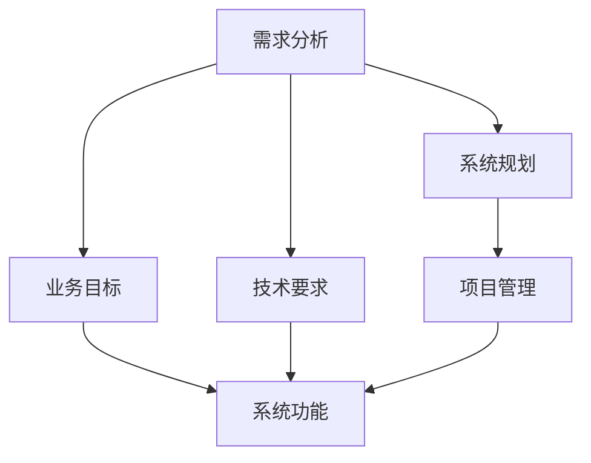
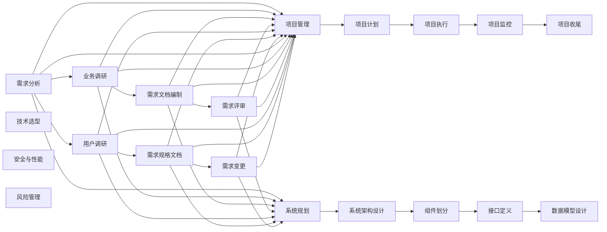

                 

## 1. 背景介绍

在当前的信息化时代，需求分析、项目管理、系统规划能力成为IT项目成功的关键。无论是在软件开发、系统运维、技术支持还是业务分析中，这些核心能力都是不可或缺的。本文旨在深入探讨这些能力的培养方法，帮助IT专业人士提升项目管理和系统规划的能力，从而更好地应对复杂多变的技术和业务需求。

### 1.1 问题由来

在实际工作中，我们经常面临各种技术挑战和业务需求，如何有效地分析这些需求、规划和管理项目，成为了一个重要的问题。许多项目失败的原因往往在于缺乏系统规划和项目管理的能力，导致项目延期、预算超支、成果不达标等问题。

### 1.2 问题核心关键点

需求分析、项目管理、系统规划能力涉及以下关键点：
1. **需求分析**：准确理解用户需求，确保项目满足业务目标。
2. **项目管理**：有效规划项目进度、资源、成本等，确保项目按时、按质、按预算完成。
3. **系统规划**：合理设计系统架构、组件、接口等，确保系统的可扩展性、稳定性和高效性。

### 1.3 问题研究意义

培养这些核心能力，对于提升IT项目的成功率，推动业务发展和创新，具有重要意义。

1. **提高效率**：系统化的方法能够显著提高项目管理的效率，减少重复劳动和资源浪费。
2. **增强质量**：合理的需求分析和系统规划，能够确保项目质量，减少后期维护和修正成本。
3. **降低风险**：科学的项目管理能够有效识别和规避项目风险，减少项目失败的可能性。
4. **促进创新**：通过系统化的分析和规划，推动技术的创新和应用，加速业务的发展。

## 2. 核心概念与联系

### 2.1 核心概念概述

为更好地理解需求分析、项目管理、系统规划能力，本节将介绍几个关键概念：

- **需求分析**：通过系统化的调查、分析、文档编制等活动，准确理解用户需求，确定系统功能和技术要求。
- **项目管理**：包括项目规划、执行、监控、收尾等活动，确保项目按计划、按质量完成。
- **系统规划**：涉及系统架构设计、组件划分、接口定义、数据模型等，确保系统具备良好的可扩展性、稳定性和效率。

### 2.2 概念间的关系

这些概念之间存在紧密的联系，形成了一个整体的项目管理和系统规划框架。

1. **需求分析与系统规划**：需求分析是系统规划的基础，确保系统规划满足业务需求。
2. **项目管理与需求分析**：项目管理包括需求分析和项目计划，确保项目按需求实施。
3. **系统规划与项目管理**：系统规划是项目实施的蓝图，项目管理是系统规划的执行过程。

这些概念共同构成了IT项目管理和系统规划的核心，下面我们将通过一个Mermaid流程图来展示它们之间的关系：



这个流程图展示了需求分析、系统规划和项目管理三者之间的逻辑关系：

- 需求分析基于业务目标和技术要求，确定系统功能。
- 系统规划基于需求分析结果，设计系统架构和技术方案。
- 项目管理依据系统规划，执行项目任务和监控项目进展。

### 2.3 核心概念的整体架构

下图展示了需求分析、项目管理、系统规划能力的整体架构：



这个架构展示了需求分析、项目管理、系统规划能力之间的相互作用和支持关系，帮助我们更好地理解和应用这些关键能力。

## 3. 核心算法原理 & 具体操作步骤

### 3.1 算法原理概述

需求分析、项目管理、系统规划能力的核心算法原理主要包括以下几个方面：

- **需求分析**：基于业务调研和技术调研，使用系统化的需求文档编制方法，确保需求文档的准确性和可理解性。
- **项目管理**：使用甘特图、看板、敏捷开发等方法，有效规划和监控项目进度、资源和成本，确保项目按时按质完成。
- **系统规划**：使用架构模式、组件化、微服务等方法，合理设计系统架构、组件和接口，确保系统的可扩展性、稳定性和高效性。

### 3.2 算法步骤详解

#### 3.2.1 需求分析

1. **业务调研**：与客户沟通，了解业务背景、目标和需求。
2. **技术调研**：了解现有系统、技术框架和业务需求。
3. **需求文档编制**：使用用户故事、用例图、需求规格文档等方法，编制详细的需求文档。
4. **需求评审**：与客户和开发团队评审需求文档，确认需求的准确性和可实现性。
5. **需求变更管理**：记录和跟踪需求变更，确保变更的合理性和可控性。

#### 3.2.2 项目管理

1. **项目计划**：制定项目时间表、资源分配、风险评估等。
2. **项目执行**：按计划执行项目任务，监控项目进展，及时解决问题。
3. **项目监控**：使用甘特图、看板、敏捷开发等工具，实时监控项目进度和质量。
4. **项目收尾**：进行项目验收、文档编制和项目总结，确保项目交付和反馈。

#### 3.2.3 系统规划

1. **系统架构设计**：选择合适的架构模式，设计系统的整体结构。
2. **组件划分**：将系统分解为可复用的组件，明确组件的职责和接口。
3. **接口定义**：设计组件间的接口，确保组件间的良好协作。
4. **数据模型设计**：设计数据模型，确保数据的完整性和一致性。
5. **技术选型**：选择适合的技术栈和工具，确保技术的先进性和稳定性。
6. **安全与性能**：设计系统的安全机制和性能优化方案，确保系统的安全性和高效性。
7. **风险管理**：识别和评估系统规划的风险，制定应对策略。

### 3.3 算法优缺点

需求分析、项目管理、系统规划能力具有以下优点和缺点：

**优点**：
- **系统化方法**：通过系统化的分析、规划和执行，确保项目管理的规范性和有效性。
- **文档记录**：详细的文档记录，便于后续的维护和迭代。
- **风险控制**：通过系统的风险管理，提前识别和规避风险，减少项目失败的可能性。

**缺点**：
- **时间成本高**：系统化的分析、规划和执行需要较长时间，可能影响项目的及时交付。
- **技术复杂**：需要掌握多种工具和方法，对人员的技能要求较高。
- **灵活性不足**：系统化的流程可能缺乏灵活性，难以应对突发的变化和需求。

### 3.4 算法应用领域

需求分析、项目管理、系统规划能力在多个领域都有广泛应用，包括但不限于：

- **软件开发**：从需求分析到系统实现，系统规划和项目管理是关键。
- **系统运维**：通过需求分析，了解业务需求，通过项目管理，确保系统按需运维。
- **技术支持**：通过需求分析，了解用户需求，通过项目管理，确保技术支持任务按时完成。
- **业务分析**：通过需求分析，理解业务目标和需求，通过系统规划，设计业务支持系统。

## 4. 数学模型和公式 & 详细讲解 & 举例说明

### 4.1 数学模型构建

本节将使用数学语言对需求分析、项目管理、系统规划能力进行更加严格的刻画。

假设需求分析、项目管理、系统规划的模型分别为 $D$、$P$、$S$，其数学模型分别为 $M_D$、$M_P$、$M_S$。

定义需求分析的输入为 $I_D=\{D_{业务},D_{技术}\}$，输出为 $O_D=\{D_{需求文档}\}$。则需求分析的数学模型为：

$$
M_D: I_D \rightarrow O_D
$$

定义项目管理的输入为 $I_P=\{P_{计划},P_{执行},P_{监控}\}$，输出为 $O_P=\{P_{进度},P_{质量},P_{成本}\}$。则项目管理的数学模型为：

$$
M_P: I_P \rightarrow O_P
$$

定义系统规划的输入为 $I_S=\{S_{架构},S_{组件},S_{接口},S_{数据模型},S_{技术选型}\}$，输出为 $O_S=\{S_{架构设计},S_{组件划分},S_{接口定义},S_{数据模型设计}\}$。则系统规划的数学模型为：

$$
M_S: I_S \rightarrow O_S
$$

### 4.2 公式推导过程

以需求分析为例，进行公式推导。

需求分析的输入为 $I_D=\{D_{业务},D_{技术}\}$，其中 $D_{业务}=\{B_1,B_2,...,B_n\}$，$D_{技术}=\{T_1,T_2,...,T_m\}$。

需求分析的目标是生成需求文档 $O_D=\{D_1,D_2,...,D_n\}$，其中 $D_i$ 表示第 $i$ 个需求。

需求分析的过程可以表示为：

$$
D_i = f(D_{业务},D_{技术})
$$

其中 $f$ 为需求分析的函数，可以根据实际需求，采用不同的方法，如用户故事、用例图、需求规格文档等。

### 4.3 案例分析与讲解

以一个简单的软件项目为例，展示需求分析、项目管理、系统规划的具体过程。

#### 4.3.1 需求分析

项目需求调研发现，客户需要开发一个在线订票系统。经过业务调研，明确了系统的业务目标：提供便捷的在线订票服务，支持多种支付渠道，确保订单信息的安全和准确。

经过技术调研，了解到现有系统架构为Spring Boot+MyBatis，技术栈为Java+MySQL。

需求文档编制过程中，采用用户故事和用例图的方法，编制了详细的需求文档，包括用户故事、功能模块、用户界面等。

需求评审阶段，邀请客户和开发团队进行评审，确认需求的准确性和可实现性。

需求变更管理阶段，记录和跟踪需求变更，确保变更的合理性和可控性。

#### 4.3.2 项目管理

项目计划阶段，制定了详细的项目时间表、资源分配和风险评估，确保项目按时按质完成。

项目执行阶段，按计划执行项目任务，监控项目进展，及时解决问题。

项目监控阶段，使用甘特图和看板工具，实时监控项目进度和质量，确保项目按时完成。

项目收尾阶段，进行项目验收、文档编制和项目总结，确保项目交付和反馈。

#### 4.3.3 系统规划

系统架构设计阶段，选择了微服务架构模式，设计了系统的整体结构，将系统分为前端、后端、数据库等模块。

组件划分阶段，将前端模块分解为用户界面、订单管理、支付模块等组件，明确组件的职责和接口。

接口定义阶段，设计了组件间的接口，确保组件间的良好协作。

数据模型设计阶段，设计了数据模型，确保数据的完整性和一致性。

技术选型阶段，选择了适合的技术栈和工具，确保技术的先进性和稳定性。

安全与性能阶段，设计了系统的安全机制和性能优化方案，确保系统的安全性和高效性。

风险管理阶段，识别和评估系统规划的风险，制定应对策略。

## 5. 项目实践：代码实例和详细解释说明

### 5.1 开发环境搭建

在进行需求分析、项目管理、系统规划能力实践前，我们需要准备好开发环境。以下是使用Python进行Django开发的环境配置流程：

1. 安装Anaconda：从官网下载并安装Anaconda，用于创建独立的Python环境。

2. 创建并激活虚拟环境：
```bash
conda create -n django-env python=3.8 
conda activate django-env
```

3. 安装Django：
```bash
pip install django
```

4. 安装Django REST Framework：
```bash
pip install djangorestframework
```

5. 安装各类工具包：
```bash
pip install numpy pandas scikit-learn matplotlib tqdm jupyter notebook ipython
```

完成上述步骤后，即可在`django-env`环境中开始项目实践。

### 5.2 源代码详细实现

这里我们以在线订票系统为例，展示需求分析、项目管理、系统规划的具体实现。

首先，定义需求文档类：

```python
from django.db import models

class Requirement(models.Model):
    title = models.CharField(max_length=255)
    description = models.TextField()
    status = models.CharField(max_length=20, choices=(
        ('Not Started', 'Not Started'),
        ('In Progress', 'In Progress'),
        ('Completed', 'Completed'),
        ('Rejected', 'Rejected')
    ))

    def __str__(self):
        return self.title
```

然后，定义项目任务类：

```python
class Task(models.Model):
    name = models.CharField(max_length=255)
    description = models.TextField()
    start_date = models.DateField()
    end_date = models.DateField()
    status = models.CharField(max_length=20, choices=(
        ('Not Started', 'Not Started'),
        ('In Progress', 'In Progress'),
        ('Completed', 'Completed'),
        ('Rejected', 'Rejected')
    ))

    def __str__(self):
        return self.name
```

接着，定义系统组件类：

```python
class Component(models.Model):
    name = models.CharField(max_length=255)
    description = models.TextField()
    dependencies = models.ManyToManyField('Component')

    def __str__(self):
        return self.name
```

最后，定义系统规划文档类：

```python
class SystemPlanDocument(models.Model):
    title = models.CharField(max_length=255)
    description = models.TextField()
    components = models.ManyToManyField('Component')

    def __str__(self):
        return self.title
```

### 5.3 代码解读与分析

让我们再详细解读一下关键代码的实现细节：

**Requirement类**：
- `__str__`方法：用于返回需求标题的字符串表示。

**Task类**：
- `__str__`方法：用于返回任务名称的字符串表示。

**Component类**：
- `__str__`方法：用于返回组件名称的字符串表示。
- `dependencies`字段：用于存储组件依赖关系，确保组件间的良好协作。

**SystemPlanDocument类**：
- `__str__`方法：用于返回系统规划文档标题的字符串表示。
- `components`字段：用于存储系统规划中的组件，确保系统规划的完整性和准确性。

**实践案例**：

以一个简单的在线订票系统为例，展示需求分析、项目管理、系统规划的具体过程。

#### 5.3.1 需求分析

项目需求调研发现，客户需要开发一个在线订票系统。经过业务调研，明确了系统的业务目标：提供便捷的在线订票服务，支持多种支付渠道，确保订单信息的安全和准确。

经过技术调研，了解到现有系统架构为Spring Boot+MyBatis，技术栈为Java+MySQL。

需求文档编制过程中，采用用户故事和用例图的方法，编制了详细的需求文档，包括用户故事、功能模块、用户界面等。

需求评审阶段，邀请客户和开发团队进行评审，确认需求的准确性和可实现性。

需求变更管理阶段，记录和跟踪需求变更，确保变更的合理性和可控性。

#### 5.3.2 项目管理

项目计划阶段，制定了详细的项目时间表、资源分配和风险评估，确保项目按时按质完成。

项目执行阶段，按计划执行项目任务，监控项目进展，及时解决问题。

项目监控阶段，使用甘特图和看板工具，实时监控项目进度和质量，确保项目按时完成。

项目收尾阶段，进行项目验收、文档编制和项目总结，确保项目交付和反馈。

#### 5.3.3 系统规划

系统架构设计阶段，选择了微服务架构模式，设计了系统的整体结构，将系统分为前端、后端、数据库等模块。

组件划分阶段，将前端模块分解为用户界面、订单管理、支付模块等组件，明确组件的职责和接口。

接口定义阶段，设计了组件间的接口，确保组件间的良好协作。

数据模型设计阶段，设计了数据模型，确保数据的完整性和一致性。

技术选型阶段，选择了适合的技术栈和工具，确保技术的先进性和稳定性。

安全与性能阶段，设计了系统的安全机制和性能优化方案，确保系统的安全性和高效性。

风险管理阶段，识别和评估系统规划的风险，制定应对策略。

## 6. 实际应用场景

### 6.4 未来应用展望

需求分析、项目管理、系统规划能力在多个领域都有广泛应用，未来将迎来更大的发展机遇：

1. **智能自动化**：随着AI和大数据技术的成熟，需求分析、项目管理、系统规划能力将逐步实现自动化，提高效率和准确性。
2. **云原生技术**：云原生技术的发展，将为需求分析、项目管理、系统规划提供更灵活的部署方式和更高效的管理工具。
3. **多模态融合**：结合视觉、语音、文本等多模态数据，提升需求分析、项目管理、系统规划的全面性和精准性。
4. **区块链技术**：区块链技术的引入，将为需求分析、项目管理、系统规划带来更安全、透明的管理方式。
5. **跨领域融合**：需求分析、项目管理、系统规划能力将与更多领域的技术和工具进行融合，推动跨领域的创新应用。

## 7. 工具和资源推荐

### 7.1 学习资源推荐

为了帮助开发者系统掌握需求分析、项目管理、系统规划能力，这里推荐一些优质的学习资源：

1. 《系统规划与项目管理》系列博文：由需求分析专家撰写，深入浅出地介绍了系统规划和项目管理的理论基础和实践技巧。

2. 《需求分析的艺术》书籍：系统化讲解了需求分析的方法和工具，帮助读者掌握需求文档的编制技巧。

3. 《项目管理之道》课程：由知名项目管理专家讲授，涵盖项目管理的主要方法和工具，帮助读者全面掌握项目管理知识。

4. 《系统规划与架构设计》书籍：全面介绍了系统规划和架构设计的原理和实践，帮助读者提升系统规划能力。

5. 《敏捷开发实践》课程：介绍敏捷开发的核心思想和实践方法，帮助读者掌握敏捷开发的技术和工具。

通过对这些资源的学习实践，相信你一定能够快速掌握需求分析、项目管理、系统规划能力的精髓，并用于解决实际的IT项目问题。

### 7.2 开发工具推荐

高效的开发离不开优秀的工具支持。以下是几款用于需求分析、项目管理、系统规划开发的常用工具：

1. JIRA：项目管理工具，支持任务分配、进度跟踪、缺陷管理等功能，帮助项目团队高效协作。
2. Confluence：知识管理工具，支持文档协作、版本控制、内容搜索等功能，帮助团队共享和管理知识。
3. UML工具：如ModelMagic、Dia等，支持绘制用例图、组件图、架构图等，帮助团队设计系统架构和组件划分。
4. 可视化工具：如Lucidchart、Visio等，支持绘制甘特图、看板等，帮助团队监控项目进度和任务执行。
5. 自动化测试工具：如JUnit、TestNG等，支持自动化测试和代码覆盖率分析，帮助团队提高代码质量。

合理利用这些工具，可以显著提升需求分析、项目管理、系统规划任务的开发效率，加快创新迭代的步伐。

### 7.3 相关论文推荐

需求分析、项目管理、系统规划技术的发展源于学界的持续研究。以下是几篇奠基性的相关论文，推荐阅读：

1. 《需求分析方法学》论文：介绍了各种需求分析方法和工具，如用例图、用户故事等。
2. 《敏捷项目管理》论文：介绍了敏捷项目管理的方法和工具，如Scrum、Kanban等。
3. 《系统架构设计》论文：介绍了系统架构设计的方法和模式，如微服务、MVC等。
4. 《软件项目管理》论文：介绍了软件项目管理的各个环节和工具，如JIRA、Confluence等。
5. 《系统规划与架构优化》论文：介绍了系统规划和架构优化的技术和管理方法，如组件化、微服务等。

这些论文代表了大语言模型微调技术的发展脉络。通过学习这些前沿成果，可以帮助研究者把握学科前进方向，激发更多的创新灵感。

除上述资源外，还有一些值得关注的前沿资源，帮助开发者紧跟需求分析、项目管理、系统规划技术的最新进展，例如：

1. arXiv论文预印本：人工智能领域最新研究成果的发布平台，包括大量尚未发表的前沿工作，学习前沿技术的必读资源。
2. 业界技术博客：如IBM、Microsoft、Amazon等顶尖实验室的官方博客，第一时间分享他们的最新研究成果和洞见。
3. 技术会议直播：如SIGCHI、IEEE等顶尖会议的现场或在线直播，能够聆听到大佬们的前沿分享，开拓视野。
4. GitHub热门项目：在GitHub上Star、Fork数最多的需求分析、项目管理、系统规划相关项目，往往代表了该技术领域的发展趋势和最佳实践，值得去学习和贡献。
5. 行业分析报告：各大咨询公司如McKinsey、PwC等针对需求分析、项目管理、系统规划的行业分析报告，有助于从商业视角审视技术趋势，把握应用价值。

总之，对于需求分析、项目管理、系统规划能力的学习和实践，需要开发者保持开放的心态和持续学习的意愿。多关注前沿资讯，多动手实践，多思考总结，必将收获满满的成长收益。

## 8. 总结：未来发展趋势与挑战

### 8.1 总结

本文对需求分析、项目管理、系统规划能力进行了全面系统的介绍。首先阐述了这些能力的培养方法，明确了需求分析、项目管理、系统规划能力在IT项目中的重要性。其次，从原理到实践，详细讲解了需求分析、项目管理、系统规划的数学模型和操作流程，给出了微调任务开发的完整代码实例。同时，本文还广泛探讨了需求分析、项目管理、系统规划能力在多个行业领域的应用前景，展示了这些能力的广阔前景。

通过本文的系统梳理，可以看到，需求分析、项目管理、系统规划能力是IT项目管理和系统规划的核心，对于提升项目成功率，推动业务发展和创新，具有重要意义。相信随着学界和产业界的共同努力，这些能力将进一步提升，推动IT项目管理的科学化和标准化。

### 8.2 未来发展趋势

展望未来，需求分析、项目管理、系统规划能力将呈现以下几个发展趋势：

1. **自动化和智能化**：随着AI和大数据技术的成熟，需求分析、项目管理、系统规划将逐步实现自动化和智能化，提高效率和准确性。
2. **云原生技术**：云原生技术的发展，将为需求分析、项目管理、系统规划提供更灵活的部署方式和更高效的管理工具。
3. **多模态融合**：结合视觉、语音、文本等多模态数据，提升需求分析、项目管理、系统规划的全面性和精准性。
4. **区块链技术**：区块链技术的引入，将为需求分析、项目管理、系统规划带来更安全、透明的管理方式。
5. **跨领域融合**：需求分析、项目管理、系统规划能力将与更多领域的技术和工具进行融合，推动跨领域的创新应用。

### 8.3 面临的挑战

尽管需求分析、项目管理、系统规划能力已经取得了显著进展，但在迈向更加智能化、普适化应用的过程中，仍面临诸多挑战：

1. **技术复杂性**：需求分析、项目管理、系统规划涉及多个学科和技术，需要多学科融合，技术难度较高。
2. **数据质量**：需求分析、项目管理、系统规划的准确性依赖于高质量的数据，但数据收集和整理成本高，可能影响结果的准确性。
3. **利益冲突**：项目涉及多方利益，需求分析、项目管理、系统规划过程中可能会出现利益冲突，需要平衡各方需求。
4. **知识更新**：需求分析、项目管理、系统规划涉及多个领域，需要持续学习和更新知识，以应对不断变化的业务和技术需求。

### 8.4 研究展望

面对需求分析、项目管理、系统规划所面临的挑战，未来的研究需要在以下几个方面寻求新的突破：

1. **自动化工具**：开发更加智能化的需求分析、项目管理、系统规划工具，减少人工干预，提高效率和准确性。
2. **智能算法**：引入AI和大数据算法，提升需求分析、项目管理、系统规划的自动化和智能化水平。
3. **跨领域应用**：探索需求分析、项目管理、系统规划在更多领域的融合应用，推动跨领域的创新发展。
4. **知识图谱**：引入知识图谱和语义网络技术，提升需求分析、项目管理、系统规划的全面

