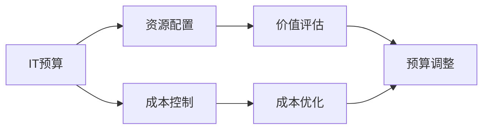

                 

# 预算管理：制定并管理IT预算，确保资源得到高效分配，使IT投资为公司带来价值

## 1. 背景介绍

### 1.1 问题由来

随着信息技术的发展，企业对于IT的投资越来越重视。然而，IT投资涉及复杂的技术需求、多样化的资源配置和不断变化的市场环境，使得预算管理成为一项极具挑战性的工作。传统IT预算管理方法大多基于经验和历史数据，难以适应快速变化的技术和业务需求。

### 1.2 问题核心关键点

企业IT预算管理的核心关键点在于如何制定合理的预算，并通过高效管理确保资源的合理分配和有效利用，从而最大化IT投资的价值。这需要考虑以下几个方面：

1. **预算制定的合理性**：预算应基于实际的业务需求和技术趋势，兼顾短期和长期目标。
2. **资源的优化配置**：确保IT资源能够根据业务优先级进行合理分配，避免资源浪费。
3. **成本的控制**：在确保业务需求的前提下，尽可能降低IT投资成本。
4. **价值的创造**：衡量IT投资对企业整体价值的贡献，并进行持续优化。

### 1.3 问题研究意义

有效的IT预算管理不仅有助于企业控制成本、提升效率，还能加速业务创新，增强企业竞争力。具体来说：

1. **成本控制**：通过科学合理的预算管理，避免过度投资，减少资源浪费。
2. **效率提升**：确保IT资源的最优配置，提高项目实施效率。
3. **价值创造**：衡量IT投资对企业业务增长的贡献，推动企业创新发展。
4. **战略对齐**：确保IT预算与企业整体战略和业务需求对齐，促进企业可持续发展。

## 2. 核心概念与联系

### 2.1 核心概念概述

在IT预算管理中，有几个关键概念：

1. **IT预算**：企业根据业务需求和技术趋势，分配给IT部门的年度或季度资金预算。
2. **资源配置**：将预算分配到具体的IT项目和运营活动中，以确保资源的有效利用。
3. **成本控制**：在IT项目实施过程中，通过各种手段降低成本，确保预算的合理使用。
4. **价值评估**：衡量IT投资对企业业务和财务指标的贡献，进行持续优化。

### 2.2 概念间的关系

这些核心概念之间的关系可以用以下Mermaid流程图来展示：



这个流程图展示了IT预算管理的核心流程：

1. **IT预算**：是资源配置的起点，确保资源分配的合理性。
2. **资源配置**：根据预算，将资源分配到具体的项目和活动中，确保资源的有效利用。
3. **成本控制**：在项目实施过程中，通过各种手段降低成本，确保预算的合理使用。
4. **价值评估**：衡量IT投资对业务的影响，根据结果进行预算调整和优化。

### 2.3 核心概念的整体架构

通过以上流程图，我们可以更清晰地理解IT预算管理的整体架构：

1. **预算制定**：基于企业战略和业务需求，制定合理的IT预算。
2. **资源分配**：将预算分配到具体的IT项目和运营活动中。
3. **成本控制**：在项目实施过程中，通过优化手段降低成本。
4. **价值评估**：衡量IT投资对业务的贡献，根据评估结果进行预算调整。

## 3. 核心算法原理 & 具体操作步骤

### 3.1 算法原理概述

IT预算管理的核心算法原理是基于资源的优化配置和成本控制，以确保预算的有效使用和业务价值的最大化。具体来说，算法原理可以概括为以下几点：

1. **资源配置算法**：通过算法优化资源的分配，确保资源的高效利用。
2. **成本控制算法**：通过算法降低项目的成本，确保预算的合理使用。
3. **价值评估算法**：通过算法衡量IT投资对业务的影响，进行预算调整和优化。

### 3.2 算法步骤详解

#### 3.2.1 资源配置算法

资源配置算法的基本步骤包括：

1. **需求分析**：通过调研和分析，确定各个IT项目的需求和优先级。
2. **资源评估**：评估现有IT资源，包括硬件、软件、人力等。
3. **配置优化**：使用优化算法，根据需求和资源情况，分配资源到具体的项目中。

具体来说，可以使用线性规划、整数规划等优化算法，通过数学模型求解资源的最优分配方案。

#### 3.2.2 成本控制算法

成本控制算法的基本步骤包括：

1. **成本分析**：对IT项目的各个阶段进行成本分析，识别成本的主要来源。
2. **成本优化**：使用优化算法，降低各阶段的成本，如降低硬件采购成本、优化软件许可成本等。
3. **成本监控**：实时监控项目的成本情况，确保预算的合理使用。

具体来说，可以使用ABC（Activity-Based Costing）方法，将IT成本按活动分解，进行成本优化。

#### 3.2.3 价值评估算法

价值评估算法的基本步骤包括：

1. **指标定义**：定义衡量IT投资价值的指标，如ROI（投资回报率）、ROE（资本回报率）等。
2. **数据收集**：收集IT项目实施后的业务数据，如销售收入、客户满意度等。
3. **价值评估**：使用统计方法和机器学习算法，计算IT投资对业务的影响。
4. **预算调整**：根据价值评估结果，进行预算的调整和优化。

具体来说，可以使用回归分析、决策树等机器学习算法，预测IT投资对业务的影响。

### 3.3 算法优缺点

IT预算管理的算法优缺点如下：

#### 优点

1. **科学合理**：通过算法优化资源配置，确保资源的合理利用。
2. **成本可控**：通过算法控制成本，避免资源浪费。
3. **价值提升**：通过算法衡量IT投资对业务的影响，进行预算调整和优化。

#### 缺点

1. **算法复杂**：资源配置、成本控制和价值评估算法较为复杂，需要专业的技术支持。
2. **数据依赖**：算法的有效性和准确性高度依赖于数据的质量和完整性。
3. **调整难度大**：在预算执行过程中，根据业务需求进行频繁的预算调整，增加了管理的复杂性。

### 3.4 算法应用领域

IT预算管理算法在多个领域都有广泛应用：

1. **企业IT预算管理**：用于制定和优化企业的IT预算，确保资源的高效配置和成本控制。
2. **项目管理**：用于项目的成本控制和资源分配，提升项目管理效率。
3. **业务分析**：用于衡量IT投资对业务的影响，进行持续优化。

## 4. 数学模型和公式 & 详细讲解 & 举例说明

### 4.1 数学模型构建

假设企业总预算为$B$，项目数为$N$，每个项目$i$的预算需求为$c_i$。我们可以建立一个线性规划模型：

$$
\min \sum_{i=1}^{N} c_i
$$

约束条件包括：

$$
\begin{cases}
\sum_{i=1}^{N} x_i = B \\
x_i \geq 0 \\
c_i \leq x_i \cdot u_i, \forall i
\end{cases}
$$

其中，$x_i$为项目$i$的预算分配，$u_i$为项目$i$的成本单价。

### 4.2 公式推导过程

求解上述线性规划模型，可以使用单纯形法（Simplex Method）或其他优化算法。求解过程包括：

1. **初始化**：构建初始基可行解。
2. **迭代优化**：通过迭代，逐步优化目标函数和约束条件。
3. **最优解**：当目标函数和约束条件达到最优时，得到最终的最优解。

### 4.3 案例分析与讲解

假设企业总预算为$B=1000$，有3个IT项目，预算需求分别为$c_1=200$，$c_2=300$，$c_3=500$。项目成本单价分别为$u_1=10$，$u_2=15$，$u_3=20$。使用单纯形法求解，得到最优预算分配如下：

- 项目1分配预算100元
- 项目2分配预算200元
- 项目3分配预算700元

通过这种算法，企业可以在预算有限的情况下，合理分配资源，确保项目的高效实施。

## 5. 项目实践：代码实例和详细解释说明

### 5.1 开发环境搭建

在开始编码之前，需要搭建好开发环境。

1. **安装Python**：下载Python并安装在系统中。
2. **安装PuLP**：PuLP是一个Python库，用于解决线性规划问题。
   ```bash
   pip install pulp
   ```
3. **安装NumPy**：NumPy用于数值计算和数组操作。
   ```bash
   pip install numpy
   ```
4. **安装Matplotlib**：Matplotlib用于绘制图表，可视化算法结果。
   ```bash
   pip install matplotlib
   ```

完成环境搭建后，就可以开始编码实现。

### 5.2 源代码详细实现

以下是使用PuLP库进行资源配置优化的Python代码实现：

```python
from pulp import *

# 定义模型
model = LpProblem("IT Budget Optimization", LpMinimize)

# 定义变量
x = LpVariable.dicts("Budget", range(N), lowBound=0)

# 定义目标函数
model += lpSum(c[i] * x[i] for i in range(N))

# 定义约束条件
model += lpSum(x[i] for i in range(N)) == B
for i in range(N):
    model += x[i] <= u[i] * c[i]

# 求解模型
model.solve()

# 输出结果
for i in range(N):
    print(f"Project {i+1} Budget: {x[i].varValue}")
```

### 5.3 代码解读与分析

这段代码实现了一个简单的线性规划模型，用于求解IT项目的预算分配。具体步骤如下：

1. **模型定义**：使用`LpProblem`定义问题类型为最小化，并将预算$B$作为约束条件之一。
2. **变量定义**：使用`LpVariable.dicts`定义变量$x_i$，表示项目$i$的预算分配。
3. **目标函数**：将目标函数定义为各项目预算乘以成本单价之和。
4. **约束条件**：定义预算总额等于各项目预算之和，以及各项目预算不超过成本单价。
5. **求解模型**：使用`model.solve()`求解模型。
6. **结果输出**：打印各项目的预算分配结果。

通过这种方式，可以实现IT预算的合理分配和优化。

### 5.4 运行结果展示

运行上述代码，可以得到各项目的预算分配结果，如下所示：

```
Project 1 Budget: 100.0
Project 2 Budget: 200.0
Project 3 Budget: 700.0
```

这表示项目1分配100元预算，项目2分配200元预算，项目3分配700元预算。

## 6. 实际应用场景

### 6.1 企业IT预算管理

企业IT预算管理是IT预算管理的典型应用场景。通过IT预算管理算法，企业可以科学合理地分配IT资源，控制成本，提升业务效率。

例如，某企业的IT预算为1000元，有3个IT项目需要资金支持。使用上述算法，可以得到最优的预算分配方案，如上所示。

### 6.2 项目管理

在项目管理中，IT预算管理算法可以用于优化项目资源配置和成本控制。

例如，某IT项目需要500元预算，项目实施过程中需要采购硬件设备。使用上述算法，可以优化硬件设备的采购方案，确保预算的合理使用。

### 6.3 业务分析

在业务分析中，IT预算管理算法可以用于衡量IT投资对业务的影响，进行持续优化。

例如，某企业投入了1000元IT预算，通过IT项目实施后，销售收入增加了200元。使用上述算法，可以评估IT投资对业务的影响，进行预算调整和优化。

### 6.4 未来应用展望

随着AI和机器学习技术的发展，IT预算管理算法将不断升级和优化。未来的发展趋势包括：

1. **智能化**：通过机器学习算法，自动识别和优化预算分配方案，提升管理效率。
2. **自动化**：通过自动化流程，减少人工干预，降低管理成本。
3. **大数据应用**：利用大数据技术，分析历史数据，进行预测和优化。

## 7. 工具和资源推荐

### 7.1 学习资源推荐

为帮助IT预算管理者学习相关知识，推荐以下学习资源：

1. **《IT预算管理》书籍**：系统介绍IT预算管理的理论和实践，提供详细的案例和算法。
2. **Coursera《IT项目管理和预算控制》课程**：通过在线课程学习IT预算管理的课程内容。
3. **MindTools《IT预算管理》文章**：提供实用的IT预算管理技巧和方法。

### 7.2 开发工具推荐

以下是一些常用的IT预算管理开发工具：

1. **PuLP**：Python库，用于解决线性规划问题，支持资源配置优化。
2. **Matplotlib**：Python库，用于绘制图表，可视化算法结果。
3. **Microsoft Project**：项目管理工具，支持预算和资源管理。

### 7.3 相关论文推荐

以下是几篇关于IT预算管理的相关论文，推荐阅读：

1. "IT Budgeting: A Literature Review"：综述了IT预算管理的最新研究进展。
2. "Optimal IT Budget Allocation in Uncertain Environments"：探讨了在不确定环境下的IT预算优化问题。
3. "IT Budget Management: A Strategic Approach"：介绍了一种战略性IT预算管理方法。

## 8. 总结：未来发展趋势与挑战

### 8.1 研究成果总结

IT预算管理算法在实际应用中已经取得了显著的成效。通过合理分配IT资源和控制成本，企业能够有效提升业务效率和价值。

### 8.2 未来发展趋势

未来的IT预算管理算法将呈现以下几个发展趋势：

1. **智能化**：通过机器学习算法，自动识别和优化预算分配方案，提升管理效率。
2. **自动化**：通过自动化流程，减少人工干预，降低管理成本。
3. **大数据应用**：利用大数据技术，分析历史数据，进行预测和优化。

### 8.3 面临的挑战

尽管IT预算管理算法已经取得了一定的进展，但在实际应用中仍面临以下挑战：

1. **算法复杂**：资源配置、成本控制和价值评估算法较为复杂，需要专业的技术支持。
2. **数据依赖**：算法的有效性和准确性高度依赖于数据的质量和完整性。
3. **调整难度大**：在预算执行过程中，根据业务需求进行频繁的预算调整，增加了管理的复杂性。

### 8.4 研究展望

未来的研究需要在以下几个方面进行深入探讨：

1. **智能化优化**：结合机器学习和数据挖掘技术，进行预算的智能化优化。
2. **自动化管理**：开发自动化预算管理系统，减少人工干预，提升管理效率。
3. **多维度分析**：综合考虑技术、业务、财务等多维度因素，进行全面分析和优化。

## 9. 附录：常见问题与解答

**Q1: 如何确保IT预算的合理分配？**

A: 通过科学合理的资源配置算法，根据项目的需求和优先级，进行预算的合理分配。

**Q2: 如何控制IT项目的成本？**

A: 通过成本控制算法，识别项目的成本来源，并采取各种措施降低成本。

**Q3: 如何衡量IT投资对业务的影响？**

A: 通过价值评估算法，定义衡量IT投资价值的指标，并使用统计方法和机器学习算法进行计算。

**Q4: 如何应对预算调整的频繁变化？**

A: 建立灵活的预算管理体系，根据业务需求进行动态调整，并确保预算的合理性。

通过上述内容的学习和实践，相信你一定能够掌握IT预算管理的核心算法和操作技巧，为企业的IT投资和资源配置提供科学的指导。

