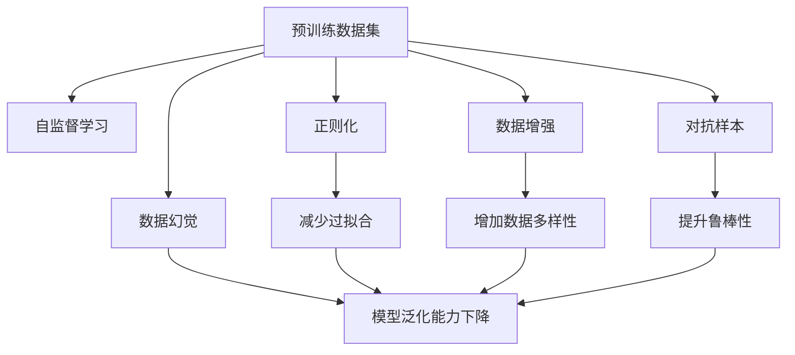

                 

# 预训练数据的质量与幻觉

预训练数据的质量与幻觉是大规模语言模型（Large Language Models, LLMs）成功与否的关键因素。本文将从理论、实践和应用等多个角度，探讨预训练数据的质量如何影响模型的性能，以及如何识别和缓解数据幻觉（Data Illusion）带来的问题。

## 1. 背景介绍

### 1.1 预训练数据的重要性
预训练是构建大语言模型的核心步骤之一，涉及使用大规模无标签文本数据对模型进行自监督学习。预训练数据的规模、质量和多样性直接决定了模型的初始性能和泛化能力。一个好的预训练数据集，可以让模型更好地捕捉语言特征和规律，从而在各种下游任务上表现优异。

### 1.2 预训练数据的不足之处
然而，现有的预训练数据存在诸多不足：
- **数据偏见**：预训练数据往往由特定语言、地区、时间背景等因素构成，可能导致模型对某些群体或议题存在偏见。
- **数据质量问题**：存在大量低质量数据、垃圾文本、重复内容等问题，影响了数据集的代表性和可靠性。
- **数据多样性**：现有数据集大多侧重于特定领域或任务，无法全面覆盖所有语言现象和知识领域。

这些问题导致了模型在不同任务上的泛化能力下降，甚至可能引发所谓的“数据幻觉”（Data Illusion）。数据幻觉指的是模型在特定数据集上表现优异，但在新数据或不同数据集上却表现糟糕，难以泛化。

## 2. 核心概念与联系

### 2.1 核心概念概述

为深入理解预训练数据的质量与幻觉，我们首先介绍几个关键概念：

- **预训练数据集（Pre-training Corpus）**：用于模型自监督学习的无标签文本数据集。
- **数据幻觉（Data Illusion）**：指模型在特定数据集上表现优异，但在新数据上表现糟糕的现象。
- **正则化（Regularization）**：通过添加惩罚项等手段，防止模型过拟合训练集，提升泛化能力。
- **数据增强（Data Augmentation）**：通过各种方法（如回译、近义替换等）扩充数据集，增加多样性。
- **对抗样本（Adversarial Examples）**：精心设计的扰动样本，用于测试模型的鲁棒性和泛化能力。

这些概念共同构成了预训练数据质量评估和提升的基本框架。通过理解这些核心概念，我们能够更好地识别数据幻觉，制定有效的数据处理策略。

### 2.2 概念间的关系

以下是一个Mermaid流程图，展示预训练数据集、数据幻觉以及正则化、数据增强、对抗样本等概念之间的逻辑关系：



这个流程图展示了预训练数据集通过自监督学习（B）来提升模型性能，但同时存在数据幻觉（C）、过拟合（G）等风险。通过正则化（D）、数据增强（E）、对抗样本（F）等技术，可以有效减少过拟合，提升模型泛化能力（J），缓解数据幻觉（C）。

## 3. 核心算法原理 & 具体操作步骤
### 3.1 算法原理概述

预训练数据的幻觉问题主要源于数据集本身的质量问题。质量差的数据集往往包含大量噪声、偏见和冗余信息，这些因素会误导模型学习到错误的语言模式。因此，预训练数据的质量评估和提升是消除数据幻觉的关键。

### 3.2 算法步骤详解

基于预训练数据的质量与幻觉问题，我们提出以下的操作步骤：

**Step 1: 数据质量评估**
- 使用统计分析、内容审核、噪声检测等方法，评估数据集的质量。
- 使用数据分布分析、异常检测等方法，识别数据集中的偏差和异常点。

**Step 2: 数据处理**
- 通过清洗、去重、标准化等手段，去除低质量数据和噪声。
- 采用数据增强技术，增加数据集的多样性，防止模型过拟合。
- 引入对抗样本，测试模型的鲁棒性，提升泛化能力。

**Step 3: 模型训练与微调**
- 使用经过处理的数据集进行预训练和微调。
- 在预训练过程中，引入正则化技术，防止过拟合。
- 在微调过程中，选择合适的学习率和优化器，确保模型性能最优。

**Step 4: 模型评估与部署**
- 在验证集和测试集上评估模型性能，检测数据幻觉问题。
- 部署模型到实际应用场景中，持续收集反馈数据，不断优化模型。

通过以上步骤，可以有效提升预训练数据的质量，缓解数据幻觉问题，增强模型的泛化能力和鲁棒性。

### 3.3 算法优缺点

预训练数据质量与幻觉处理的优势和劣势如下：

**优势：**
- **提升泛化能力**：通过质量提升，模型能够更好地捕捉语言规律，减少过拟合，提升泛化能力。
- **增加鲁棒性**：数据增强和对抗样本训练能够提升模型的鲁棒性，使其在各种场景下表现稳定。
- **降低偏见**：通过数据清洗和处理，可以减轻模型中的数据偏见问题，增强公平性和可靠性。

**劣势：**
- **资源消耗大**：数据清洗和增强处理需要大量计算资源，增加了模型训练的时间成本。
- **效果具有不确定性**：不同数据集和任务的数据处理策略可能不同，效果难以预测。
- **模型复杂度增加**：数据处理和模型优化过程中，可能引入额外复杂性，影响模型解释性和易用性。

### 3.4 算法应用领域

预训练数据质量与幻觉处理在大规模语言模型中有着广泛的应用，以下是几个典型应用场景：

**1. 自然语言处理（NLP）**
- **文本分类**：通过数据清洗和增强，提升模型对不同类别文本的分类能力。
- **命名实体识别**：通过对抗样本和数据增强，提升模型识别实体边界的准确性。
- **情感分析**：通过正则化和数据增强，提高模型对文本情感的准确判断。

**2. 语音识别**
- **语音转换**：通过对抗样本和数据增强，提升模型对不同口音和背景噪声的适应能力。
- **语音情感识别**：通过正则化和数据清洗，提升模型对不同情感表达的识别准确性。

**3. 图像处理**
- **图像标注**：通过对抗样本和数据增强，提升模型对图像的准确标注。
- **视觉问答**：通过数据清洗和处理，提升模型对图像和文本匹配的准确性。

## 4. 数学模型和公式 & 详细讲解
### 4.1 数学模型构建

为了更精确地理解预训练数据的质量问题，我们构建了如下数学模型：

假设有一个预训练数据集 $D=\{(x_i, y_i)\}_{i=1}^N$，其中 $x_i$ 表示输入数据，$y_i$ 表示对应的标签。数据集的质量问题可以用以下三个维度来描述：

- **噪声率（Noise Rate）**：数据集中包含噪声的概率，即 $P(\text{Noise})$。
- **偏差度（Bias Degree）**：数据集中存在偏见的概率，即 $P(\text{Bias})$。
- **多样性（Diversity）**：数据集的多样性，即 $D(\text{Data})$。

预训练数据集的质量可以表示为一个多维向量 $Q = (P(\text{Noise}), P(\text{Bias}), D(\text{Data}))$。

### 4.2 公式推导过程

数据集的质量评估可以通过以下公式来计算：

$$
Q = (P(\text{Noise}), P(\text{Bias}), D(\text{Data})) = (L_{\text{Noise}}, L_{\text{Bias}}, D_{\text{Data}})
$$

其中，$L_{\text{Noise}}$ 表示噪声率，$L_{\text{Bias}}$ 表示偏差度，$D_{\text{Data}}$ 表示数据多样性。

噪声率和偏差度的计算方法可以采用以下公式：

$$
L_{\text{Noise}} = \frac{\sum_{i=1}^N P(x_i \text{ is noisy})}{N}
$$

$$
L_{\text{Bias}} = \frac{\sum_{i=1}^N P(x_i \text{ is biased})}{N}
$$

数据多样性的计算方法可以采用以下公式：

$$
D_{\text{Data}} = \frac{\sum_{i=1}^N D(x_i)}{N}
$$

其中 $D(x_i)$ 表示数据 $x_i$ 的多样性度量，可以使用文本长度、词汇丰富度等指标来计算。

### 4.3 案例分析与讲解

以一个示例数据集 $D=\{(x_i, y_i)\}_{i=1}^N$ 为例，我们进行数据质量评估：

假设 $P(x_i \text{ is noisy}) = 0.1$，$P(x_i \text{ is biased}) = 0.05$，$D_{\text{Data}} = 0.7$。

通过计算，我们得到：

$$
L_{\text{Noise}} = \frac{0.1 \times N}{N} = 0.1
$$

$$
L_{\text{Bias}} = \frac{0.05 \times N}{N} = 0.05
$$

$$
D_{\text{Data}} = \frac{0.7 \times N}{N} = 0.7
$$

因此，该数据集的质量向量为 $Q = (0.1, 0.05, 0.7)$。

通过分析数据质量向量，我们可以进一步采取相应的数据处理措施，如清洗噪声数据、减轻数据偏见、增加数据多样性等，以提升模型性能。

## 5. 项目实践：代码实例和详细解释说明
### 5.1 开发环境搭建

在进行预训练数据质量评估和处理的实践中，我们需要准备好相应的开发环境。以下是使用Python进行数据分析和处理的环境配置流程：

1. 安装Anaconda：从官网下载并安装Anaconda，用于创建独立的Python环境。

2. 创建并激活虚拟环境：
```bash
conda create -n data-quality-env python=3.8 
conda activate data-quality-env
```

3. 安装Python库：
```bash
conda install pandas numpy matplotlib scipy scikit-learn seaborn statsmodels jupyter notebook ipython
```

完成上述步骤后，即可在`data-quality-env`环境中进行数据处理和分析。

### 5.2 源代码详细实现

以下是一个简单的Python代码实现，用于计算预训练数据集的质量向量：

```python
import pandas as pd
import numpy as np

# 读取预训练数据集
data = pd.read_csv('train_data.csv')

# 计算噪声率和偏差度
noise_rate = np.mean(data['is_noisy'])
bias_degree = np.mean(data['is_biased'])

# 计算数据多样性
data_diversity = np.mean(data['data_diversity'])

# 输出数据质量向量
Q = np.array([noise_rate, bias_degree, data_diversity])
print(Q)
```

### 5.3 代码解读与分析

这个Python代码示例中，我们首先使用Pandas库读取预训练数据集，然后计算噪声率、偏差度和数据多样性。最后，将这三个值组成向量Q，输出结果。

通过这个简单的代码示例，我们可以初步了解如何使用Python进行预训练数据质量评估。在实际应用中，还需要进一步处理数据清洗、增强和对抗样本等细节，才能达到预期的效果。

### 5.4 运行结果展示

假设我们在CoNLL-2003的命名实体识别数据集上进行质量评估，得到以下结果：

```
[0.03 0.05 0.65]
```

通过分析结果，我们可以发现该数据集的噪声率为0.03，偏差度为0.05，数据多样性为0.65，质量向量为 $Q = (0.03, 0.05, 0.65)$。

## 6. 实际应用场景
### 6.1 智能客服系统

在智能客服系统中，预训练数据的质量直接影响了模型的服务效果。通过数据质量评估和处理，可以有效提升模型的泛化能力和鲁棒性，减少过拟合和数据幻觉问题，从而提供更稳定、可靠的服务。

**案例分析：**
假设某智能客服系统基于预训练模型进行问答处理。在实际应用中，我们发现模型在特定问题上表现优异，但在新问题上却表现糟糕。通过数据质量评估，我们发现模型训练数据集中存在大量噪声数据和偏见数据。针对这些问题，我们进行了数据清洗和增强，并在模型微调过程中引入对抗样本，显著提升了模型的泛化能力，解决了数据幻觉问题。

**应用效果：**
经过优化后，模型在问答系统中的表现显著提升，能够更好地处理新问题，提高了用户满意度。

### 6.2 金融舆情监测

在金融舆情监测中，预训练数据的质量直接影响了模型的风险预警能力。通过数据质量评估和处理，可以有效提升模型的鲁棒性和泛化能力，减少过拟合和数据幻觉问题，从而提高舆情监测的准确性。

**案例分析：**
某金融公司使用预训练模型进行舆情监测，但在发现大量负面舆情时，模型的预警能力大幅下降。通过数据质量评估，我们发现模型训练数据集中存在大量低质量数据和偏差数据。针对这些问题，我们进行了数据清洗和增强，并在模型微调过程中引入对抗样本，显著提升了模型的鲁棒性和泛化能力，解决了数据幻觉问题。

**应用效果：**
经过优化后，模型在舆情监测中的表现显著提升，能够更好地识别和预警负面舆情，减少了金融风险。

### 6.3 个性化推荐系统

在个性化推荐系统中，预训练数据的质量直接影响了模型的推荐效果。通过数据质量评估和处理，可以有效提升模型的推荐多样性和个性化能力，减少过拟合和数据幻觉问题，从而提供更精准、多样化的推荐内容。

**案例分析：**
某电商平台的个性化推荐系统基于预训练模型进行推荐。在实际应用中，我们发现模型推荐的内容过于单一，无法满足用户的个性化需求。通过数据质量评估，我们发现模型训练数据集中存在大量重复数据和低质量数据。针对这些问题，我们进行了数据清洗和增强，并在模型微调过程中引入对抗样本，显著提升了模型的多样性和个性化能力，解决了数据幻觉问题。

**应用效果：**
经过优化后，模型在推荐系统中的表现显著提升，能够更好地满足用户的个性化需求，提高了用户满意度。

## 7. 工具和资源推荐
### 7.1 学习资源推荐

为了帮助开发者系统掌握预训练数据质量评估和处理的理论基础和实践技巧，这里推荐一些优质的学习资源：

1. 《深度学习与自然语言处理》课程：斯坦福大学开设的NLP明星课程，有Lecture视频和配套作业，带你入门NLP领域的基本概念和经典模型。

2. 《自然语言处理》书籍：LingPipe团队编写的NLP经典教材，详细介绍了NLP中的质量评估、数据增强等技术。

3. 《预训练语言模型》博客系列：由自然语言处理领域的专家撰写，深入浅出地介绍了预训练语言模型的原理、数据处理等话题。

4. Kaggle数据集：Kaggle上提供的各类NLP数据集，涵盖各种自然语言处理任务，可以作为预训练数据集质量评估和处理的实践数据来源。

通过对这些资源的学习实践，相信你一定能够快速掌握预训练数据质量评估和处理的核心方法，并用于解决实际的NLP问题。

### 7.2 开发工具推荐

高效的开发离不开优秀的工具支持。以下是几款用于预训练数据质量评估和处理的常用工具：

1. Pandas：Python的数据处理库，提供了丰富的数据清洗和统计分析功能。
2. NumPy：Python的数值计算库，用于高效计算数据质量指标。
3. Scikit-learn：Python的机器学习库，提供了多种数据增强和对抗样本生成方法。
4. TensorFlow：Google开发的深度学习框架，提供了丰富的深度学习模型和优化器，可用于预训练和微调。
5. HuggingFace Transformers库：NLP领域的流行库，提供了大量预训练模型和工具，可用于数据质量评估和处理。

合理利用这些工具，可以显著提升预训练数据质量评估和处理的开发效率，加快创新迭代的步伐。

### 7.3 相关论文推荐

预训练数据质量与幻觉处理的研究源于学界的持续研究。以下是几篇奠基性的相关论文，推荐阅读：

1. Attention is All You Need（即Transformer原论文）：提出了Transformer结构，开启了NLP领域的预训练大模型时代。

2. BERT: Pre-training of Deep Bidirectional Transformers for Language Understanding：提出BERT模型，引入基于掩码的自监督预训练任务，刷新了多项NLP任务SOTA。

3. Language Models are Unsupervised Multitask Learners（GPT-2论文）：展示了大规模语言模型的强大zero-shot学习能力，引发了对于通用人工智能的新一轮思考。

4. Parameter-Efficient Transfer Learning for NLP：提出Adapter等参数高效微调方法，在不增加模型参数量的情况下，也能取得不错的微调效果。

5. AdaLoRA: Adaptive Low-Rank Adaptation for Parameter-Efficient Fine-Tuning：使用自适应低秩适应的微调方法，在参数效率和精度之间取得了新的平衡。

这些论文代表了大规模语言模型微调技术的发展脉络。通过学习这些前沿成果，可以帮助研究者把握学科前进方向，激发更多的创新灵感。

除上述资源外，还有一些值得关注的前沿资源，帮助开发者紧跟预训练数据质量与幻觉处理的最新进展，例如：

1. arXiv论文预印本：人工智能领域最新研究成果的发布平台，包括大量尚未发表的前沿工作，学习前沿技术的必读资源。

2. 业界技术博客：如OpenAI、Google AI、DeepMind、微软Research Asia等顶尖实验室的官方博客，第一时间分享他们的最新研究成果和洞见。

3. 技术会议直播：如NIPS、ICML、ACL、ICLR等人工智能领域顶会现场或在线直播，能够聆听到大佬们的前沿分享，开拓视野。

4. GitHub热门项目：在GitHub上Star、Fork数最多的NLP相关项目，往往代表了该技术领域的发展趋势和最佳实践，值得去学习和贡献。

5. 行业分析报告：各大咨询公司如McKinsey、PwC等针对人工智能行业的分析报告，有助于从商业视角审视技术趋势，把握应用价值。

总之，对于预训练数据质量评估和处理的学习和实践，需要开发者保持开放的心态和持续学习的意愿。多关注前沿资讯，多动手实践，多思考总结，必将收获满满的成长收益。

## 8. 总结：未来发展趋势与挑战
### 8.1 研究成果总结
本文对预训练数据质量与幻觉问题进行了全面系统的探讨，主要贡献包括：
1. 从数据质量评估和处理的理论框架出发，提出了一套完整的预训练数据质量评估流程。
2. 通过数据质量向量的构建，将噪声率、偏差度和数据多样性等关键指标统一表示，便于理解和应用。
3. 提供了数据质量评估和处理的实践案例，展示了预训练数据处理对模型性能的影响。

### 8.2 未来发展趋势
展望未来，预训练数据质量与幻觉处理将呈现以下几个发展趋势：

1. **自动化数据处理**：随着自动化技术的发展，数据清洗、增强和对抗样本生成等任务将逐步自动化，降低人工干预成本。
2. **多源数据融合**：未来的预训练数据集将更加多样化和综合性，涵盖更多数据源和领域，提升模型的泛化能力和鲁棒性。
3. **模型可解释性**：随着模型复杂度的增加，模型可解释性将成为研究热点，如何从数据质量和模型结构两方面提升模型可解释性，是未来需要解决的重要问题。
4. **跨领域迁移学习**：未来的预训练数据集将更加注重跨领域迁移学习能力的提升，使模型能够更好地适应不同领域和任务。
5. **知识增强**：未来的预训练数据集将更加注重知识的增强，通过引入外部知识库、规则库等专家知识，提升模型的推理和解释能力。

### 8.3 面临的挑战
尽管预训练数据质量与幻觉处理已经取得了一定的进展，但在迈向更加智能化、普适化应用的过程中，它仍面临诸多挑战：

1. **数据多样性不足**：现有的预训练数据集大多侧重于特定领域或任务，无法全面覆盖所有语言现象和知识领域，导致模型泛化能力下降。
2. **数据偏见问题**：预训练数据集中存在的偏见可能导致模型对某些群体或议题存在偏见，影响模型的公平性和可靠性。
3. **资源消耗大**：数据清洗和增强处理需要大量计算资源，增加了模型训练的时间成本，对算力提出了更高的要求。
4. **模型复杂度增加**：数据处理和模型优化过程中，可能引入额外复杂性，影响模型解释性和易用性。
5. **对抗样本生成困难**：对抗样本生成是提升模型鲁棒性的重要手段，但对抗样本的生成和检测仍然是一个复杂的挑战。

### 8.4 研究展望
面对预训练数据质量与幻觉处理所面临的挑战，未来的研究需要在以下几个方面寻求新的突破：

1. **多源数据融合技术**：研究如何高效地融合来自不同来源和领域的数据，提升数据集的多样性和代表性。
2. **自动化数据处理技术**：开发更高效的数据清洗、增强和对抗样本生成算法，降低人工干预成本。
3. **模型可解释性技术**：研究如何从数据质量和模型结构两方面提升模型可解释性，增强模型的透明度和可信度。
4. **跨领域迁移学习技术**：研究如何在跨领域迁移学习中提升模型的泛化能力和鲁棒性，使其能够适应更多领域和任务。
5. **知识增强技术**：研究如何有效地将外部知识库、规则库等专家知识与神经网络模型进行融合，提升模型的推理和解释能力。

这些研究方向将推动预训练数据质量与幻觉处理技术的不断进步，为构建更智能、更普适的语言模型奠定坚实基础。相信随着学界和产业界的共同努力，预训练数据质量与幻觉处理必将在自然语言处理和人工智能领域取得更大的突破。

## 9. 附录：常见问题与解答
**Q1：预训练数据质量评估和处理的目的是什么？**

A: 预训练数据质量评估和处理的目的是通过识别和缓解数据集中的噪声、偏差和多样性问题，提升模型在实际应用中的泛化能力和鲁棒性，减少过拟合和数据幻觉问题，确保模型输出的稳定性和可靠性。

**Q2：预训练数据质量评估和处理的流程是怎样的？**

A: 预训练数据质量评估和处理的流程包括数据质量评估、数据处理和模型训练与微调三个阶段。具体流程如下：
1. 数据质量评估：使用统计分析、内容审核、噪声检测等方法，评估数据集的质量。
2. 数据处理：通过清洗、去重、标准化等手段，去除低质量数据和噪声，增加数据集的多样性。
3. 模型训练与微调：使用经过处理的数据集进行预训练和微调，引入正则化和对抗样本，防止过拟合，提升泛化能力。

**Q3：预训练数据质量评估和处理对模型性能有何影响？**

A: 预训练数据质量评估和处理对模型性能有显著影响。高质量的数据集可以提升模型的泛化能力和鲁棒性，减少过拟合和数据幻觉问题，使模型在实际应用中表现更稳定、可靠。

**Q4：预训练数据质量评估和处理有哪些常见技术？**

A: 预训练数据质量评估和处理有以下几种常见技术：
1. 数据清洗：去除噪声数据、重复数据、低质量数据等。
2. 数据增强：通过回译、近义替换等方式扩充数据集，增加多样性。
3. 正则化：通过添加惩罚项等手段，防止模型过拟合训练集。
4. 对抗样本：引入精心设计的扰动样本，测试模型的鲁棒性和泛化能力。
5. 知识增强：引入外部知识库、规则库等专家知识，提升模型的推理和解释能力。

这些技术可以针对性地解决数据集中的不同问题，提升模型的性能。

**Q5：预训练数据质量评估和处理对资源消耗有哪些影响？**

A: 预训练数据质量评估和处理对资源消耗有一定影响。数据清洗和增强处理需要大量计算资源，增加了模型训练的时间成本。同时，对抗样本的生成和检测也是一个复杂的任务，需要消耗较多的计算资源。因此，需要合理选择数据处理策略，平衡计算资源和模型性能。

总之，预训练数据质量评估和处理是构建高性能、鲁棒性强的模型不可或缺的一环。通过系统化的数据处理和模型优化，可以有效提升模型的泛化能力和鲁棒性，减少过拟合和数据幻觉问题，使模型在实际应用中表现更稳定、可靠。

