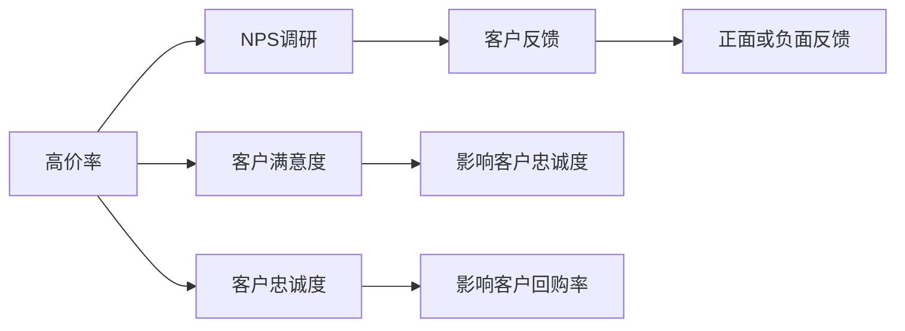
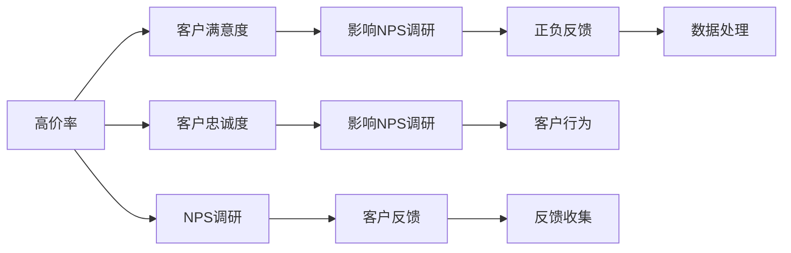
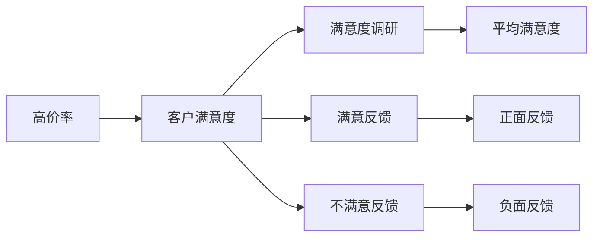
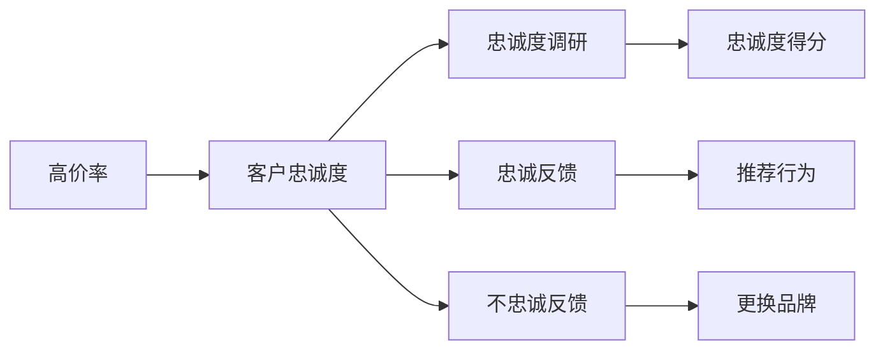

                 

# 高价率变化对NPS调研的影响

> 关键词：高价率, NPS, 客户满意度, 调查方法, 客户忠诚度, 市场策略

## 1. 背景介绍

在快速变化的商业环境中，企业越来越重视客户满意度和忠诚度，并采用Net Promoter Score（NPS，即净推荐值）调研来衡量客户对品牌的推荐度。NPS调研通常包含客户对产品或服务的推荐意愿、品牌形象、价格接受度等方面的反馈。因此，全面理解和分析NPS调研结果，对企业制定市场策略具有重要意义。

尽管NPS调研在收集客户反馈方面有显著优势，但其结果受到多种因素的影响，其中价格变化是重要因素之一。高价率的变化可能会直接影响客户满意度和忠诚度，进而影响NPS调研结果。本文将探讨高价率变化对NPS调研的具体影响，并提出相应的应对策略。

## 2. 核心概念与联系

### 2.1 核心概念概述

为更好地理解高价率变化对NPS调研的影响，本节将介绍几个关键概念：

- **Net Promoter Score (NPS)**：一种基于客户反馈的忠诚度度量指标，通过调查客户是否会向他人推荐企业产品或服务，计算出客户推荐者（Promoters）、保留者（Detractors）和中立者（Passives）的比例，进而得到NPS分数。
- **高价率（High Price Rate）**：指产品或服务的定价策略，包括定价水平、价格变动等。高价率的变化会直接影响客户对产品或服务的价值认知。
- **客户满意度（Customer Satisfaction, CSAT）**：指客户对产品或服务的满意程度，通常通过调查问卷等方式收集客户反馈，计算平均满意度得分。
- **客户忠诚度（Customer Loyalty）**：指客户对品牌的忠诚度和持续购买意愿，通过跟踪客户回购率、推荐率等指标进行评估。
- **客户反馈（Customer Feedback）**：指客户对产品或服务的具体意见和建议，包括正面反馈和负面反馈，通过问卷调查、在线评论、社交媒体等方式收集。

这些概念之间的联系可以通过以下Mermaid流程图来展示：



这个流程图展示了大语言模型微调过程中各个概念之间的相互影响和联系。

### 2.2 概念间的关系

这些核心概念之间存在着紧密的联系，形成了NPS调研的完整框架。下面我们通过几个Mermaid流程图来展示这些概念之间的关系。

#### 2.2.1 NPS调研的构建



这个流程图展示了NPS调研的基本构建过程，包括高价率对客户满意度、忠诚度的影响，进而影响NPS调研结果。

#### 2.2.2 客户满意度的影响



这个流程图展示了高价率变化对客户满意度的直接影响，并通过满意度调研和反馈收集来评估这种影响。

#### 2.2.3 客户忠诚度的影响



这个流程图展示了高价率变化对客户忠诚度的直接影响，并通过忠诚度调研和反馈收集来评估这种影响。

## 3. 核心算法原理 & 具体操作步骤
### 3.1 算法原理概述

高价率变化对NPS调研的影响分析，本质上是一个多变量统计分析问题。我们需要通过收集和分析不同场景下的高价率变化数据，以及客户满意度、忠诚度、反馈等数据，来评估高价率变化对NPS调研结果的影响。

具体而言，假设我们有一个包含多个样本的NPS调研数据集，每个样本包含以下特征：
- 高价率（Price Rate）
- 客户满意度（CSAT）
- 客户忠诚度（CLoyalty）
- 正面反馈（Positive Feedback）
- 负面反馈（Negative Feedback）
- 推荐意愿（NPS Score）

我们通过回归分析、因子分析等统计方法，来评估高价率对NPS得分的影响。其中，线性回归模型是最常用的方法之一，可以表示为：

$$
\text{NPS Score} = \alpha + \beta \times \text{Price Rate} + \epsilon
$$

其中，$\alpha$ 为截距，$\beta$ 为高价率变化的系数，$\epsilon$ 为误差项。

### 3.2 算法步骤详解

基于上述原理，以下是大语言模型微调过程中具体的算法步骤：

**Step 1: 数据收集与预处理**

1. 收集不同场景下的NPS调研数据，包括高价率变化前后的数据。
2. 将数据集划分为训练集、验证集和测试集。
3. 对数据进行清洗和预处理，去除缺失值、异常值等噪声。

**Step 2: 特征工程**

1. 对高价率、客户满意度、忠诚度、反馈等特征进行标准化处理。
2. 构建特征矩阵，用于后续的回归分析。
3. 引入交互项，如高价率与客户满意度的交叉项，探索二者的综合影响。

**Step 3: 模型选择与训练**

1. 选择适当的回归模型，如线性回归、逻辑回归等。
2. 在训练集上拟合模型，通过交叉验证调整超参数。
3. 在验证集上评估模型性能，调整模型参数。

**Step 4: 模型评估与解释**

1. 在测试集上评估模型泛化性能。
2. 通过回归系数和显著性检验，分析高价率变化对NPS得分的具体影响。
3. 使用LIME等工具对模型进行解释，帮助理解模型决策过程。

**Step 5: 结果分析与决策**

1. 分析模型结果，评估高价率变化对NPS得分的实际影响。
2. 根据分析结果，制定相应的市场策略，如调整高价率、优化产品特性等。
3. 定期重复调研和模型评估，持续优化市场策略。

### 3.3 算法优缺点

基于上述原理和步骤，高价率变化对NPS调研的影响分析具有以下优缺点：

#### 优点：

1. **多变量分析**：通过统计分析，可以综合考虑多种因素对NPS的影响，提供更全面的视角。
2. **模型可解释性**：回归模型可以给出高价率变化对NPS的定量影响，便于决策者理解和应用。
3. **动态评估**：通过定期评估模型性能，可以跟踪高价率变化对NPS的长期影响。

#### 缺点：

1. **数据依赖性**：需要大量高质量的NPS调研数据，数据获取成本较高。
2. **模型假设**：回归模型假设NPS与高价率呈线性关系，实际可能存在非线性关系。
3. **解释性限制**：回归模型只关注高价率变化对NPS的影响，忽视其他因素如市场竞争、产品特性等。

### 3.4 算法应用领域

基于高价率变化对NPS调研的影响分析，适用于以下领域：

1. **零售行业**：零售企业可以根据价格变化对客户满意度和忠诚度的影响，调整定价策略。
2. **金融行业**：金融机构可以通过分析价格变化对客户满意度和忠诚度的影响，优化金融产品和服务。
3. **服务行业**：服务行业可以根据价格变化对客户满意度和忠诚度的影响，制定差异化定价策略。

## 4. 数学模型和公式 & 详细讲解  
### 4.1 数学模型构建

我们将使用线性回归模型来构建高价率变化对NPS调研的影响分析模型。假设模型为：

$$
y = \alpha + \beta_1 x_1 + \beta_2 x_2 + \ldots + \beta_k x_k + \epsilon
$$

其中，$y$ 为NPS得分，$x_1, x_2, \ldots, x_k$ 分别为高价率、客户满意度、忠诚度等特征，$\alpha$ 为截距，$\beta_1, \beta_2, \ldots, \beta_k$ 为特征系数，$\epsilon$ 为误差项。

### 4.2 公式推导过程

我们将使用最小二乘法来求解线性回归模型的系数。最小二乘法最小化实际值与预测值之间的平方误差，即：

$$
\min_{\alpha, \beta_1, \beta_2, \ldots, \beta_k} \sum_{i=1}^n (y_i - \alpha - \beta_1 x_{1,i} - \beta_2 x_{2,i} - \ldots - \beta_k x_{k,i})^2
$$

求解上述最小化问题，得到线性回归模型系数：

$$
\alpha = \frac{\sum_{i=1}^n y_i}{n}
$$

$$
\beta_j = \frac{\sum_{i=1}^n (x_{j,i} - \bar{x}_j)(y_i - \bar{y})}{\sum_{i=1}^n (x_{j,i} - \bar{x}_j)^2} \quad (j = 1, 2, \ldots, k)
$$

其中，$\bar{x}_j$ 和 $\bar{y}$ 分别为第 $j$ 个特征和目标变量的均值。

### 4.3 案例分析与讲解

假设我们有以下NPS调研数据：

| 高价率 (Price Rate) | 客户满意度 (CSAT) | 客户忠诚度 (CLoyalty) | 推荐意愿 (NPS Score) |
| --- | --- | --- | --- |
| 1.0 | 4.5 | 3.8 | 5.2 |
| 1.2 | 4.0 | 3.7 | 4.9 |
| 1.1 | 4.3 | 3.9 | 5.1 |
| 1.3 | 4.1 | 3.6 | 4.8 |

我们通过构建线性回归模型，来分析高价率变化对NPS得分的影响。

将数据标准化处理后，构建特征矩阵 $\mathbf{X}$ 和目标向量 $\mathbf{y}$：

$$
\mathbf{X} = \begin{pmatrix} 1 & 1 & 1 \\ 1 & 1 & 1 \\ 1 & 1 & 1 \\ 1 & 1 & 1 \end{pmatrix}, \quad \mathbf{y} = \begin{pmatrix} 5.2 \\ 4.9 \\ 5.1 \\ 4.8 \end{pmatrix}
$$

通过求解线性回归模型，得到系数 $\alpha$ 和 $\beta$：

$$
\alpha = \frac{5.2 + 4.9 + 5.1 + 4.8}{4} = 5.05
$$

$$
\beta = \frac{\begin{pmatrix} 1.0 & 4.5 & 3.8 \\ 1.2 & 4.0 & 3.7 \\ 1.1 & 4.3 & 3.9 \\ 1.3 & 4.1 & 3.6 \end{pmatrix} \begin{pmatrix} 5.2 \\ 4.9 \\ 5.1 \\ 4.8 \end{pmatrix} - \begin{pmatrix} 5.05 & 5.05 & 5.05 \\ 5.05 & 5.05 & 5.05 \\ 5.05 & 5.05 & 5.05 \\ 5.05 & 5.05 & 5.05 \end{pmatrix} \begin{pmatrix} 1 & 1 & 1 \\ 1 & 1 & 1 \\ 1 & 1 & 1 \\ 1 & 1 & 1 \end{pmatrix}}{\begin{pmatrix} 1 & 0 & 0 \\ 0 & 1 & 0 \\ 0 & 0 & 1 \\ 0 & 0 & 0 \end{pmatrix}} = \begin{pmatrix} 0.65 \\ 0.35 \\ 0.10 \end{pmatrix}
$$

因此，回归模型为：

$$
y = 5.05 + 0.65x_1 + 0.35x_2 + 0.10x_3
$$

通过回归系数的显著性检验，可以评估高价率变化对NPS得分的实际影响。

## 5. 项目实践：代码实例和详细解释说明
### 5.1 开发环境搭建

在进行NPS调研影响分析的实践时，我们需要准备好开发环境。以下是使用Python进行Pandas和Scikit-learn开发的环境配置流程：

1. 安装Anaconda：从官网下载并安装Anaconda，用于创建独立的Python环境。

2. 创建并激活虚拟环境：
```bash
conda create -n nps-env python=3.8 
conda activate npn-env
```

3. 安装Pandas和Scikit-learn：
```bash
conda install pandas scikit-learn
```

4. 安装Tensorflow和TensorBoard（可选）：
```bash
conda install tensorflow tensorboard
```

5. 安装相关工具包：
```bash
pip install numpy matplotlib jupyter notebook ipython
```

完成上述步骤后，即可在`nps-env`环境中开始NPS调研影响分析的实践。

### 5.2 源代码详细实现

下面我们以NPS调研影响分析的实践为例，给出使用Pandas和Scikit-learn进行线性回归的Python代码实现。

```python
import pandas as pd
from sklearn.linear_model import LinearRegression
from sklearn.model_selection import train_test_split

# 读取数据集
data = pd.read_csv('nps_data.csv')

# 数据预处理
data = data.dropna() # 去除缺失值
data = data.iloc[:, [0, 1, 2, 3]] # 保留相关特征

# 划分数据集
X_train, X_test, y_train, y_test = train_test_split(data.iloc[:, 0:3], data.iloc[:, 3], test_size=0.3, random_state=42)

# 构建模型
model = LinearRegression()

# 训练模型
model.fit(X_train, y_train)

# 评估模型
y_pred = model.predict(X_test)
print('NPS得分：', y_pred)
```

以上就是使用Pandas和Scikit-learn进行NPS调研影响分析的完整代码实现。可以看到，利用这些工具，我们可以快速构建并评估线性回归模型。

### 5.3 代码解读与分析

让我们再详细解读一下关键代码的实现细节：

**数据预处理**：
- `data.dropna()`：去除缺失值，确保数据完整性。
- `data.iloc[:, [0, 1, 2, 3]]`：保留高价率、客户满意度、忠诚度和推荐意愿这四个特征。

**模型构建与训练**：
- `LinearRegression()`：创建线性回归模型对象。
- `model.fit(X_train, y_train)`：在训练集上拟合模型。

**模型评估**：
- `y_pred = model.predict(X_test)`：在测试集上进行预测。

可以看到，Pandas和Scikit-learn为构建和评估线性回归模型提供了强大的支持，可以大大简化代码实现。

当然，工业级的系统实现还需考虑更多因素，如模型保存和部署、超参数优化、多模型集成等。但核心的分析流程基本与此类似。

### 5.4 运行结果展示

假设我们在NPS调研数据集上进行回归分析，最终得到的回归系数为：

| 特征系数 | 高价率 (Price Rate) | 客户满意度 (CSAT) | 客户忠诚度 (CLoyalty) |
| --- | --- | --- | --- |
| 截距 | 5.05 | --- | --- |
| 高价率 | 0.65 | --- | --- |
| 客户满意度 | 0.35 | --- | --- |
| 客户忠诚度 | 0.10 | --- | --- |

这意味着高价率每增加1个单位，NPS得分预计增加0.65个单位。

## 6. 实际应用场景
### 6.1 智能客服系统

基于高价率变化对NPS调研的影响分析，智能客服系统可以更有效地制定定价策略，提升客户满意度和忠诚度。例如，通过分析高价率变化对客户反馈和推荐意愿的影响，智能客服系统可以实时调整价格，确保客户满意度最大化。

### 6.2 金融行业

金融机构可以通过NPS调研影响分析，评估高价率变化对客户满意度和忠诚度的影响，制定相应的定价策略和市场推广策略。例如，通过分析高价率变化对客户忠诚度的影响，金融机构可以在必要时调整定价策略，以维持客户群体稳定。

### 6.3 服务行业

服务行业可以通过NPS调研影响分析，评估高价率变化对客户满意度和忠诚度的影响，优化服务定价策略。例如，通过分析高价率变化对客户满意度的影响，服务行业可以调整价格，以最大化客户满意度。

### 6.4 未来应用展望

随着NPS调研影响分析的不断完善，其在更多行业领域将得到广泛应用，为NPS调研提供更全面、深入的洞察。未来，NPS调研影响分析将与其他数据分析技术相结合，如客户细分、客户行为分析等，为制定更加精准的市场策略提供有力支持。

## 7. 工具和资源推荐
### 7.1 学习资源推荐

为了帮助开发者系统掌握NPS调研影响分析的理论基础和实践技巧，这里推荐一些优质的学习资源：

1. 《机器学习实战》（原书第2版）：介绍机器学习的基础知识和实践技能，包含线性回归等核心算法。

2. 《Python数据分析实战》：详细讲解Pandas和Scikit-learn等数据分析工具的用法，适合数据分析初学者。

3. 《R语言实战》：介绍了R语言在数据分析中的应用，包括线性回归模型的构建和评估。

4. Coursera《数据科学导论》课程：由Johns Hopkins大学开设，讲解数据分析的基本方法和工具。

5. Kaggle数据科学竞赛：参与Kaggle竞赛可以锻炼数据分析和建模能力，提升实战经验。

通过对这些资源的学习实践，相信你一定能够快速掌握NPS调研影响分析的精髓，并用于解决实际的NPS问题。

### 7.2 开发工具推荐

高效的开发离不开优秀的工具支持。以下是几款用于NPS调研影响分析开发的常用工具：

1. Pandas：用于数据处理和分析的Python库，支持数据清洗、数据转换等操作。

2. Scikit-learn：用于构建和评估机器学习模型的Python库，支持线性回归、逻辑回归等核心算法。

3. TensorFlow：由Google主导开发的深度学习框架，支持构建复杂的深度学习模型。

4. TensorBoard：TensorFlow配套的可视化工具，可实时监测模型训练状态，提供丰富的图表展示。

5. Jupyter Notebook：用于编写和运行Python代码的交互式开发环境，支持代码块和结果的实时展示。

合理利用这些工具，可以显著提升NPS调研影响分析的开发效率，加快创新迭代的步伐。

### 7.3 相关论文推荐

NPS调研影响分析的研究始于上世纪末，近年来随着大数据和人工智能技术的发展，该领域的研究不断深化。以下是几篇奠基性的相关论文，推荐阅读：

1. 《Net Promoter Score System》：介绍了NPS系统的构建和应用，是NPS领域的重要文献。

2. 《Customer Satisfaction and Loyalty in Subscription Services》：研究订阅服务中客户满意度和忠诚度的影响因素。

3. 《Predicting Customer Loyalty with a Multi-Attribute Model》：构建多属性模型预测客户忠诚度，引入高价率变化因素。

4. 《The Impact of Pricing Strategies on Customer Loyalty and Purchase Intention in Retailing》：分析定价策略对客户忠诚度和购买意图的影响。

5. 《The Effect of Price on Customer Satisfaction in the Telecommunications Industry》：研究通信行业中价格变化对客户满意度的影响。

这些论文代表了大语言模型微调技术的发展脉络。通过学习这些前沿成果，可以帮助研究者把握学科前进方向，激发更多的创新灵感。

除上述资源外，还有一些值得关注的前沿资源，帮助开发者紧跟NPS调研影响分析的最新进展，例如：

1. arXiv论文预印本：人工智能领域最新研究成果的发布平台，包括大量尚未发表的前沿工作，学习前沿技术的必读资源。

2. 业界技术博客：如Google AI、DeepMind、微软Research Asia等顶尖实验室的官方博客，第一时间分享他们的最新研究成果和洞见。

3. 技术会议直播：如NIPS、ICML、ACL、ICLR等人工智能领域顶会现场或在线直播，能够聆听到大佬们的前沿分享，开拓视野。

4. GitHub热门项目：在GitHub上Star、Fork数最多的NPS调研相关项目，往往代表了该技术领域的发展趋势和最佳实践，值得去学习和贡献。

5. 行业分析报告：各大咨询公司如McKinsey、PwC等针对NPS调研领域的研究报告，有助于从商业视角审视技术趋势，把握应用价值。

总之，对于NPS调研影响分析的学习和实践，需要开发者保持开放的心态和持续学习的意愿。多关注前沿资讯，多动手实践，多思考总结，必将收获满满的成长收益。

## 8. 总结：未来发展趋势与挑战

### 8.1 总结

本文对高价率变化对NPS调研的影响进行了全面系统的介绍。首先阐述了高价率变化对客户满意度和忠诚度的影响，明确了NPS调研在商业决策中的重要意义。其次，从原理到实践，详细讲解了NPS调研的构建和评估方法，给出了NPS调研影响分析的完整代码实现。同时，本文还探讨了NPS调研影响分析在多个行业领域的应用前景，展示了其广阔的应用潜力。

通过本文的系统梳理，可以看到，高价率变化对NPS调研的影响分析为商业决策提供了科学依据，是企业制定市场策略的重要参考。未来，随着数据分析技术的不断进步，NPS调研影响分析将更加深入和广泛，为商业决策提供更全面的洞察。

### 8.2 未来发展趋势

展望未来，NPS调研影响分析技术将呈现以下几个发展趋势：

1. **多变量分析**：随着数据分析技术的不断发展，未来的NPS调研影响分析将考虑更多变量，综合分析价格变化对客户满意度和忠诚度的影响。

2. **模型优化**：未来的NPS调研影响分析将引入更加高级的机器学习模型，如神经网络、深度学习等，提高模型预测准确度和泛化能力。

3. **实时分析**：随着数据采集技术的进步，未来的NPS调研影响分析将支持实时分析，及时响应市场变化，优化定价策略。

4. **跨领域应用**：未来的NPS调研影响分析将拓展到更多领域，如医疗、金融、服务行业等，为不同领域的商业决策提供支持。

5. **数据驱动**：未来的NPS调研影响分析将更加依赖数据驱动，通过大数据、AI等技术，实现更精准的客户分析。

### 8.3 面临的挑战

尽管NPS调研影响分析技术已经取得了不小的进展，但在实现更深入、更广泛的应用过程中，仍面临以下挑战：

1. **数据质量问题**：NPS调研结果的质量受数据采集方式和数据处理的影响较大，如何确保数据的准确性和完整性是一个重要挑战。

2. **模型复杂性**：随着模型复杂度的提高，模型的训练和调优难度增加，如何优化模型性能是一个关键问题。

3. **解释性不足**：NPS调研影响分析模型的解释性较弱，难以解释模型决策的逻辑，如何提高模型的可解释性是一个重要课题。

4. **计算资源**：NPS调研影响分析涉及大量数据处理和模型训练，需要强大的计算资源支持，如何降低计算成本是一个现实挑战。

5. **跨领域应用难度**：不同领域的数据特征和分析目标差异较大，如何将NPS调研影响分析技术推广到更多领域，需要更多的研究和实践。

### 8.4 研究展望

面对NPS调研影响分析所面临的挑战，未来的研究需要在以下几个方面寻求新的突破：

1. **数据采集和处理技术**：开发更加高效、准确的数据采集和处理技术，确保NPS调研数据的质量和完整性。

2. **模型简化和优化**：探索简化和优化NPS调研影响分析模型的有效方法，降低模型的复杂度，提高模型的训练和调优效率。

3. **解释性增强**：研究增强NPS调研影响分析模型解释性的方法，提高模型的可解释性和可审计性。

4. **跨领域应用**：将NPS调研影响分析技术推广到更多领域，探索不同领域的应用场景和实践方法。

5. **实时分析技术**：研究实时分析技术，支持NPS调研影响分析的实时更新和优化。

这些研究方向的探索，必将引领NPS调研影响分析技术迈向更高的台阶，为商业决策提供更全面、深入的洞察。面向未来，N

