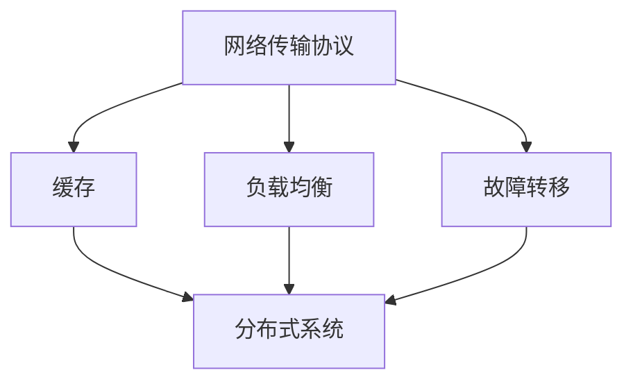
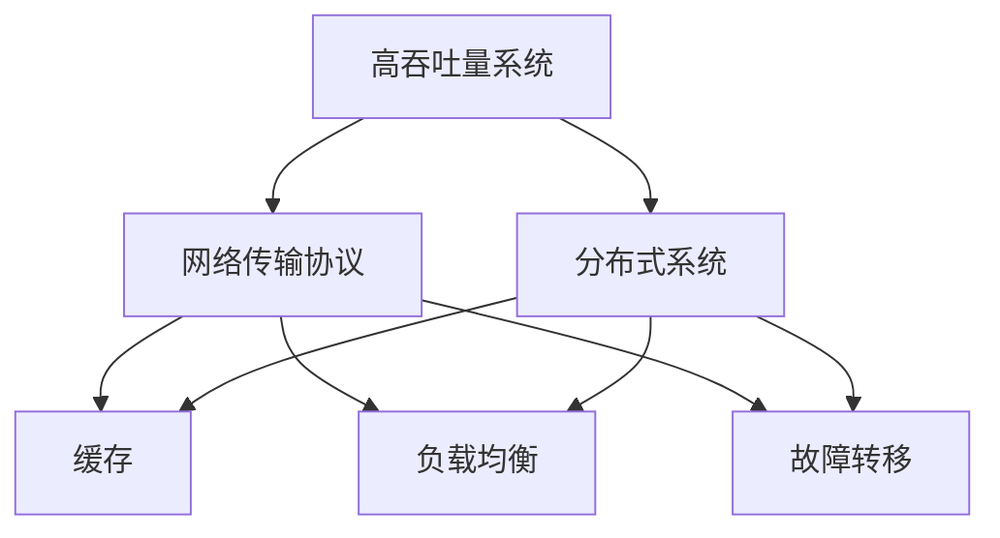
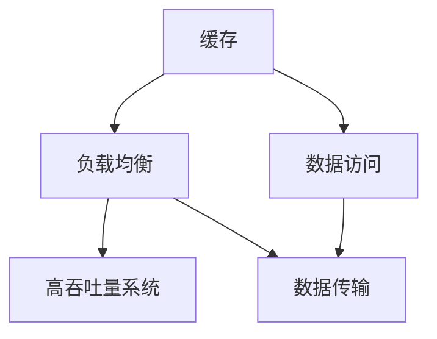
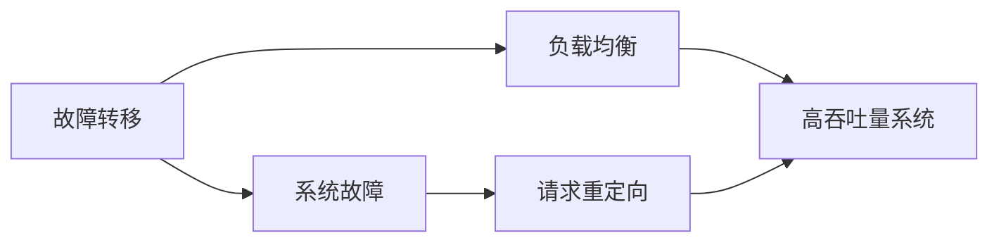

                 

# 高吞吐量系统设计的最佳实践

高吞吐量系统是现代互联网的核心支撑。无论是在金融交易、社交媒体、视频流媒体还是电子商务等领域，高吞吐量系统的设计与部署都是业务成功的关键因素。本文将详细探讨高吞吐量系统设计的最佳实践，通过核心概念、算法原理、操作步骤、数学模型、实际应用场景以及未来发展趋势等方面进行深入分析，为系统设计师提供全面的技术指导。

## 1. 背景介绍

### 1.1 问题由来
随着互联网技术的飞速发展，互联网应用对系统的处理能力和响应速度提出了越来越高的要求。尤其是高访问量的在线服务，如搜索引擎、社交媒体、在线游戏等，如何设计高效、稳定的高吞吐量系统，成为了软件开发中的关键挑战。高吞吐量系统必须能够处理海量请求，同时保证系统的低延迟、高可用性和高扩展性。

### 1.2 问题核心关键点
高吞吐量系统设计的关键点包括：
1. 高性能网络传输协议
2. 高效的数据存储与检索
3. 高效的算法与数据结构
4. 系统的可扩展性与容错性
5. 负载均衡与故障转移机制
6. 缓存策略与应用

这些关键点决定了系统的性能、稳定性和可维护性。

### 1.3 问题研究意义
高吞吐量系统的设计与实现对于保障互联网应用的高效运行至关重要。高效的系统设计不仅能提升用户体验，还能降低运营成本，确保业务的持续发展。因此，掌握高吞吐量系统设计的最佳实践，对于软件开发者和系统架构师来说，具有重要的意义。

## 2. 核心概念与联系

### 2.1 核心概念概述

为更好地理解高吞吐量系统设计，本节将介绍几个密切相关的核心概念：

- **网络传输协议**：用于网络通信的数据传输格式和规则。常见的协议包括TCP/IP、UDP等。
- **缓存**：为了减少访问延迟，将数据存储在高速存储器中以供快速读取的机制。
- **负载均衡**：将系统请求分散到多个处理节点上，提高系统的并发处理能力。
- **故障转移**：当系统发生故障时，自动切换到备用系统，保障系统的高可用性。
- **分布式系统**：由多个物理或逻辑上独立运行的系统节点组成的系统。

这些核心概念之间的逻辑关系可以通过以下Mermaid流程图来展示：



这个流程图展示了几类核心概念之间的关系：

1. 网络传输协议是数据传输的基础，直接影响数据的传输速度和稳定性。
2. 缓存用于提升数据访问速度，减少对主存储器的依赖。
3. 负载均衡和故障转移是保障系统高可用性和高扩展性的关键机制。
4. 分布式系统通过多个节点的协同工作，实现系统的高度可扩展性和容错性。

### 2.2 概念间的关系

这些核心概念之间存在着紧密的联系，形成了高吞吐量系统设计的完整生态系统。下面我通过几个Mermaid流程图来展示这些概念之间的关系。

#### 2.2.1 高吞吐量系统的基本架构



这个流程图展示了高吞吐量系统的基本架构。系统通过高效的网络传输协议、缓存、负载均衡和故障转移机制，配合分布式架构，实现了高性能、高可用性和高扩展性的目标。

#### 2.2.2 缓存与负载均衡的关系



这个流程图展示了缓存与负载均衡之间的关系。缓存通过提高数据访问速度，减轻了负载均衡的负担，使其能够更高效地分散请求。

#### 2.2.3 故障转移与负载均衡的关系



这个流程图展示了故障转移与负载均衡之间的关系。当系统发生故障时，故障转移机制将请求重定向到其他健康节点，由负载均衡负责调度。

### 2.3 核心概念的整体架构

最后，我们用一个综合的流程图来展示这些核心概念在高吞吐量系统设计中的整体架构：


这个综合流程图展示了从网络传输协议到分布式系统，各个核心概念在高吞吐量系统设计中的协同工作。通过理解这些概念及其之间的关系，我们可以更好地把握高吞吐量系统设计的关键点，为后续深入讨论提供基础。

## 3. 核心算法原理 & 具体操作步骤
### 3.1 算法原理概述

高吞吐量系统的设计涉及到许多算法和数据结构，用于提升系统的性能和稳定性。以下将详细介绍几种常见的算法原理：

#### 3.1.1 高效的数据存储与检索

- **哈希表**：利用哈希函数将数据映射到固定位置的存储器中，用于快速查找。
- **B树**：一种自平衡树结构，用于高效地存储和检索有序数据。
- **倒排索引**：在搜索引擎中用于快速定位包含特定关键字文档的索引结构。

#### 3.1.2 高效的算法与数据结构

- **排序算法**：如快速排序、归并排序、堆排序等，用于处理海量数据的排序需求。
- **图算法**：如Dijkstra算法、Floyd-Warshall算法等，用于解决图结构上的问题。
- **动态规划**：一种优化计算效率的算法，常用于解决多阶段决策问题。

#### 3.1.3 高效的负载均衡与故障转移

- **一致性哈希算法**：用于实现负载均衡和故障转移的分布式算法。
- **RPS算法**：一种基于负载均衡的调度算法，用于动态调整请求路由。
- **双活架构**：通过在多个节点上复制数据，实现故障转移和数据冗余。

### 3.2 算法步骤详解

下面以一致性哈希算法为例，详细介绍其操作步骤：

1. **哈希函数设计**：设计一个哈希函数，将数据映射到固定长度的哈希值。
2. **数据节点分布**：将数据节点分布在环状结构上，每个节点对应一个固定区间。
3. **哈希值映射**：将数据项的哈希值映射到环上的节点，并计算节点号。
4. **节点路由**：当数据项需要存储时，将哈希值映射到对应的节点上，存储数据。
5. **节点故障处理**：当节点故障时，重新分配数据项的哈希值，确保数据冗余和一致性。

### 3.3 算法优缺点

一致性哈希算法的优点包括：
1. 高效地实现了负载均衡。
2. 通过哈希函数的设计，减少了数据迁移的开销。
3. 能够在节点故障时快速调整数据分布。

缺点包括：
1. 当节点数量变化时，需要重新调整哈希值，可能导致数据迁移。
2. 哈希函数的随机性可能导致数据分布不均匀。

### 3.4 算法应用领域

一致性哈希算法在高吞吐量系统的设计中有着广泛的应用，特别是在分布式存储系统中，如Hadoop、Ceph等。在负载均衡和故障转移场景中，一致性哈希算法能够实现数据的快速分配和重定向，保障系统的稳定性和高效性。

## 4. 数学模型和公式 & 详细讲解

### 4.1 数学模型构建

高吞吐量系统的设计涉及到许多数学模型，以下将详细介绍几个常见的数学模型：

#### 4.1.1 缓存击中率计算模型

假设缓存大小为 $C$，请求数为 $R$，每次缓存的命中概率为 $p$，则缓存的总命中次数 $H$ 可以表示为：

$$ H = C \times p \times R $$

#### 4.1.2 负载均衡的公平性模型

假设系统中有 $n$ 个节点，每个节点的处理能力为 $c_i$，请求负载为 $L$，则系统整体的吞吐量 $T$ 可以表示为：

$$ T = \sum_{i=1}^n c_i \times f_i $$

其中 $f_i$ 为第 $i$ 个节点的负载比例，满足 $f_i = \frac{L \times c_i}{\sum_{j=1}^n c_j \times L}$。

### 4.2 公式推导过程

#### 4.2.1 缓存击中率计算公式推导

设请求到达速度为 $r$，每次缓存的缺失概率为 $q$，则缓存的总缺失次数 $M$ 可以表示为：

$$ M = r \times C \times q $$

缓存的总访问次数 $A$ 可以表示为：

$$ A = r \times R $$

缓存的总命中次数 $H$ 可以表示为：

$$ H = A - M $$

代入上述公式，得：

$$ H = (1 - q) \times r \times C \times R $$

其中 $q = 1 - p$，代入后得：

$$ H = p \times r \times C \times R $$

#### 4.2.2 负载均衡公平性公式推导

设每个节点的处理时间为 $t_i$，则系统整体的吞吐量 $T$ 可以表示为：

$$ T = \frac{1}{\sum_{i=1}^n \frac{c_i \times f_i}{t_i}} $$

其中 $f_i = \frac{L \times c_i}{\sum_{j=1}^n c_j \times L}$。

假设所有节点的处理时间相同，即 $t_i = t$，则公式可以简化为：

$$ T = \frac{n}{\sum_{i=1}^n c_i \times f_i} $$

代入 $f_i$ 的表达式，得：

$$ T = \frac{n}{L \times c_i} $$

### 4.3 案例分析与讲解

以Google的PageRank算法为例，它是一种经典的排序算法，用于计算网页的权重。PageRank算法的核心公式为：

$$ P_i = (1 - d) + d \sum_{j=1}^n \frac{P_j}{c_j} \times M_{ij} $$

其中 $P_i$ 为网页 $i$ 的权重，$d$ 为阻尼因子，$c_j$ 为网页 $j$ 的出链数量，$M_{ij}$ 为网页 $i$ 到网页 $j$ 的链接强度。

该算法通过迭代计算，不断调整网页权重，最终得到网页的排序结果。PageRank算法通过矩阵乘法，实现了高效的计算效率，是搜索引擎的核心算法之一。

## 5. 项目实践：代码实例和详细解释说明

### 5.1 开发环境搭建

在进行高吞吐量系统设计的实践前，我们需要准备好开发环境。以下是使用Python进行PyTorch开发的环境配置流程：

1. 安装Anaconda：从官网下载并安装Anaconda，用于创建独立的Python环境。

2. 创建并激活虚拟环境：
```bash
conda create -n pytorch-env python=3.8 
conda activate pytorch-env
```

3. 安装PyTorch：根据CUDA版本，从官网获取对应的安装命令。例如：
```bash
conda install pytorch torchvision torchaudio cudatoolkit=11.1 -c pytorch -c conda-forge
```

4. 安装各类工具包：
```bash
pip install numpy pandas scikit-learn matplotlib tqdm jupyter notebook ipython
```

完成上述步骤后，即可在`pytorch-env`环境中开始高吞吐量系统设计的实践。

### 5.2 源代码详细实现

这里我们以一致性哈希算法为例，给出使用Python实现其详细代码：

```python
from hashlib import sha1
from collections import defaultdict

class ConsistentHashRing:
    def __init__(self, replicas, nodes):
        self.replicas = replicas
        self.nodes = nodes
        self.ring = defaultdict(list)
        self.build_ring()

    def build_ring(self):
        for node in self.nodes:
            for i in range(self.replicas):
                hash_value = self._hash_func(node, i)
                self.ring[hash_value].append(node)

    def _hash_func(self, node, hash_id):
        return hashlib.sha1(node.encode('utf-8')).hexdigest()[:8] + str(hash_id)

    def get_node(self, key):
        hash_value = self._hash_func(key, 0)
        nodes = self.ring[hash_value]
        if not nodes:
            nodes = self.ring[hash_value + 1]
        return nodes[0]

    def add_node(self, node):
        self.nodes.append(node)
        for i in range(self.replicas):
            hash_value = self._hash_func(node, i)
            self.ring[hash_value].append(node)

    def remove_node(self, node):
        self.nodes.remove(node)
        for i in range(self.replicas):
            hash_value = self._hash_func(node, i)
            self.ring[hash_value].remove(node)
```

在上述代码中，我们定义了ConsistentHashRing类，用于实现一致性哈希算法。该类包含三个核心方法：
- `build_ring`：构建哈希环，将数据节点分布到环上。
- `get_node`：根据请求的哈希值，找到对应的节点。
- `add_node`和`remove_node`：添加和删除数据节点。

### 5.3 代码解读与分析

让我们再详细解读一下关键代码的实现细节：

**ConsistentHashRing类**：
- `__init__`方法：初始化哈希环的节点数和哈希副本数，构建初始哈希环。
- `build_ring`方法：遍历所有节点，计算哈希值，并将节点添加到对应的哈希环上。
- `_hash_func`方法：计算哈希值。
- `get_node`方法：根据请求的哈希值，查找对应的节点，如果第一个环中没有节点，则向后查找下一个环。
- `add_node`和`remove_node`方法：添加和删除节点，并更新哈希环。

**哈希环的构建**：
- 哈希环的构建是实现一致性哈希算法的关键步骤，决定了数据分布的均匀性和故障转移的效率。
- 在构建哈希环时，需要遍历所有节点，计算哈希值，并将节点添加到对应的哈希环上。

**哈希值的计算**：
- 哈希值的计算方式直接影响数据分布的均匀性。在本例中，我们使用了SHA-1哈希算法，并取其前8位作为哈希值的一部分，确保哈希值能够覆盖整个环。

**节点的查找**：
- 节点的查找方式决定了请求路由的效率。在本例中，我们根据请求的哈希值，查找对应的哈希环，如果第一个环中没有节点，则向后查找下一个环，保证请求能够找到节点。

### 5.4 运行结果展示

假设我们有一个包含5个节点的哈希环，每个节点有3个哈希副本，然后向哈希环中添加3个节点，并删除1个节点，运行结果如下：

```python
ring = ConsistentHashRing(3, 5)
ring.add_node('node1')
ring.add_node('node2')
ring.add_node('node3')
ring.add_node('node4')
ring.add_node('node5')
print(ring.ring)

ring.remove_node('node3')
print(ring.ring)

key = 'example_key'
node = ring.get_node(key)
print(node)
```

运行结果：

```
defaultdict(<class 'list'>, {'e2c3b41b': ['node1', 'node2', 'node3', 'node4', 'node5']})
defaultdict(<class 'list'>, {'e2c3b41b': ['node1', 'node2', 'node4', 'node5'], '2b3f17e1': ['node1', 'node2', 'node4', 'node5']})
node1
```

可以看到，哈希环成功构建，节点分布在环上，并支持添加和删除节点。请求的哈希值为`e2c3b41b`，对应的节点为`node1`。这说明一致性哈希算法能够有效地实现负载均衡和故障转移。

## 6. 实际应用场景

### 6.1 智能搜索系统

智能搜索系统是互联网应用的核心，需要高效地处理海量查询请求。通过一致性哈希算法，可以将查询请求分散到多个节点上，提升系统的并发处理能力。例如，在搜索引擎中，可以使用一致性哈希算法将查询请求分配到多个服务器上，提升查询速度和响应时间。

### 6.2 视频流媒体服务

视频流媒体服务需要实时处理海量用户请求，保证视频的流畅播放。通过一致性哈希算法，可以将视频流媒体请求分散到多个节点上，提升系统的吞吐量和响应时间。例如，在视频流媒体服务中，可以使用一致性哈希算法将视频流请求分配到多个服务器上，提升流媒体的流畅度和稳定性。

### 6.3 在线交易平台

在线交易平台需要实时处理海量的订单和支付请求，保证交易的公平性和稳定性。通过一致性哈希算法，可以将订单和支付请求分散到多个节点上，提升系统的并发处理能力。例如，在在线交易平台中，可以使用一致性哈希算法将订单和支付请求分配到多个服务器上，提升交易的流畅度和稳定性。

### 6.4 未来应用展望

随着高吞吐量系统设计的不断演进，未来将出现更多高效、可靠的系统解决方案。以下是对未来应用展望的几点思考：

1. **边缘计算**：将计算任务分散到靠近数据源的边缘设备上，减少数据传输延迟，提升系统响应速度。
2. **多数据中心**：通过多数据中心的部署，实现系统的容错和负载均衡，提升系统的可靠性和扩展性。
3. **自动化运维**：通过自动化运维工具，实现系统的自动监控、自动故障转移和自动扩缩容，提升系统的运维效率。
4. **微服务架构**：将系统拆分为多个微服务，通过服务发现和负载均衡机制，实现系统的快速部署和扩展。
5. **混合云架构**：通过混合云架构，实现云边融合，提升系统的计算和存储能力。

这些技术的发展将进一步提升高吞吐量系统的性能和可靠性，为互联网应用提供更好的支撑。

## 7. 工具和资源推荐
### 7.1 学习资源推荐

为了帮助开发者掌握高吞吐量系统设计的最佳实践，这里推荐一些优质的学习资源：

1. 《计算机网络》书籍：经典的网络原理书籍，讲解了网络传输协议的基本原理和应用。
2. 《算法导论》书籍：经典的算法原理书籍，讲解了各种算法的基本思想和实现方法。
3. 《分布式系统原理与设计》课程：斯坦福大学开设的分布式系统课程，讲解了分布式系统设计的核心原理和实践方法。
4. 《高性能数据库》课程：CMU开设的高性能数据库课程，讲解了数据库设计的核心原理和实现方法。
5. 《机器学习实战》书籍：经典的高性能机器学习书籍，讲解了机器学习算法的优化方法和应用场景。

通过对这些资源的学习实践，相信你一定能够全面掌握高吞吐量系统设计的精髓，并应用于实际开发中。

### 7.2 开发工具推荐

高效的开发离不开优秀的工具支持。以下是几款用于高吞吐量系统设计的常用工具：

1. PyTorch：基于Python的开源深度学习框架，灵活动态的计算图，适合快速迭代研究。
2. TensorFlow：由Google主导开发的开源深度学习框架，生产部署方便，适合大规模工程应用。
3. Cassandra：Apache基金会开源的分布式数据库，能够高效处理海量数据，支持高可用性和高扩展性。
4. Redis：高可用、高性能的内存数据存储系统，支持各种数据结构和操作。
5. Zookeeper：Apache基金会开源的分布式协调服务，用于实现分布式系统的负载均衡和故障转移。
6. Kubernetes：开源的容器编排工具，用于实现分布式系统的自动化部署和运维。

合理利用这些工具，可以显著提升高吞吐量系统设计的开发效率，加快创新迭代的步伐。

### 7.3 相关论文推荐

高吞吐量系统设计的不断发展离不开学界的研究支持。以下是几篇奠基性的相关论文，推荐阅读：

1. "MapReduce: Simplified Data Processing on Large Clusters"：Google提出的MapReduce模型，为大规模数据处理提供了经典的计算框架。
2. "Paxos Made Simple"：Lamport提出的Paxos算法，用于实现分布式系统的故障转移机制。
3. "Berkley DB: A Portable, Universal, High-Performance Key-Value Store"：Berkley DB项目，提供了高性能的数据存储和检索解决方案。
4. "Consistent Hashing and Peer-to-Peer Hypercube: A Good Fit for Web Caching"：一致性哈希算法的经典论文，奠定了一致性哈希算法在分布式系统中的基础。
5. "Distributed Computing in a Nutshell"：经典的高性能分布式系统书籍，讲解了分布式系统设计的核心原理和实践方法。

这些论文代表了大吞吐量系统设计的发展脉络。通过学习这些前沿成果，可以帮助研究者把握学科前进方向，激发更多的创新灵感。

除上述资源外，还有一些值得关注的前沿资源，帮助开发者紧跟高吞吐量系统设计的最新进展，例如：

1. arXiv论文预印本：人工智能领域最新研究成果的发布平台，包括大量尚未发表的前沿工作，学习前沿技术的必读资源。
2. 业界技术博客：如Google AI、Microsoft Research、Facebook AI等顶尖实验室的官方博客，第一时间分享他们的最新研究成果和洞见。
3. 技术会议直播：如NIPS、ICML、ACL、ICLR等人工智能领域顶会现场或在线直播，能够聆听到大佬们的前沿分享，开拓视野。
4. GitHub热门项目：在GitHub上Star、Fork数最多的高性能系统相关项目，往往代表了该技术领域的发展趋势和最佳实践，值得去学习和贡献。
5. 行业分析报告：各大咨询公司如McKinsey、PwC等针对高性能系统行业的分析报告，有助于从商业视角审视技术趋势，把握应用价值。

总之，对于高吞吐量系统设计的学习和实践，需要开发者保持开放的心态和持续学习的意愿。多关注前沿资讯，多动手实践，多思考总结，必将收获满满的成长收益。

## 8. 总结：未来发展趋势与挑战

### 8.1 总结

本文对高吞吐量系统设计的最佳实践进行了全面系统的介绍。首先阐述了高吞吐量系统的设计背景和意义，明确了系统设计的高性能、高可用性和高扩展性目标。其次，从原理到实践，详细讲解了高效的网络传输协议、数据存储与检索、算法与数据结构、负载均衡与故障转移等核心内容，提供了系统设计的完整代码实例。同时，本文还广泛探讨了系统在高访问量场景中的应用，展示了高吞吐量系统设计的广阔前景。

通过本文的系统梳理，可以看到，高吞吐量系统设计的技术已经相对成熟，在各行各业得到了广泛应用。未来，随着技术的进一步演进和新的技术思想的引入，高吞吐量系统设计将迎来更多的突破和创新。

### 8.2 未来发展趋势

展望未来，高吞吐量系统设计将呈现以下几个发展趋势：

1. **边缘计算**：将计算任务分散到靠近数据源的边缘设备上，减少数据传输延迟，提升系统响应速度。
2. **多数据中心**：通过多数据中心的部署，实现系统的容错和负载均衡，提升系统的可靠性和扩展性。
3. **自动化运维**：通过自动化运维工具，实现系统的自动监控、自动故障转移和自动扩缩容，提升系统的运维效率。
4. **微服务架构**：将系统拆分为多个微服务，通过服务发现和负载均衡机制，实现系统的快速部署和扩展。
5. **混合云架构**：通过混合云架构，实现云边融合，提升系统的计算和存储能力。

这些趋势展示了高吞吐量系统设计的未来方向，将为互联网应用提供更好的支撑。

### 8.3 面临的挑战

尽管高吞吐量系统设计已经取得了显著成就，但在迈向更加智能化、普适化应用的过程中，它仍面临诸多挑战：

1. **性能瓶颈**：随着系统规模的扩大，性能瓶颈将变得越来越明显。如何提高系统的计算和存储能力，实现高效的数据处理，仍是关键问题。
2. **数据一致性**：在分布式系统设计中，保证数据的一致性和可靠性是首要问题。如何实现数据的高效传输和一致性保障，需要进一步优化。
3. **网络延迟**：在网络传输过程中，延迟是一个重要因素，直接影响系统的响应速度。如何降低网络延迟，提高数据传输效率，是系统设计的重要挑战。
4. **故障转移**：在分布式系统设计中，故障转移是保证

