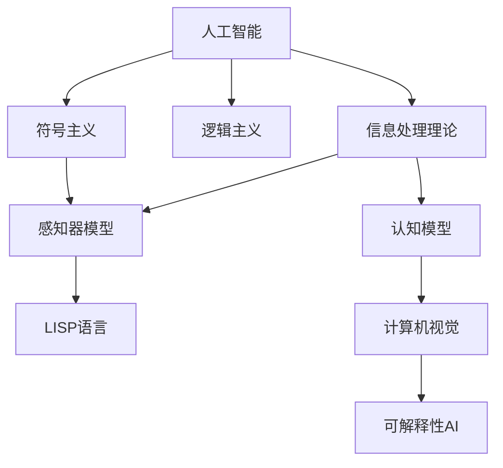
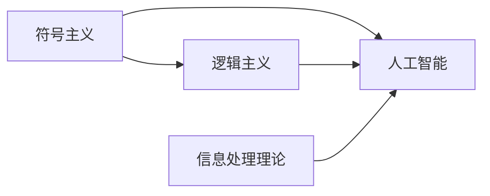
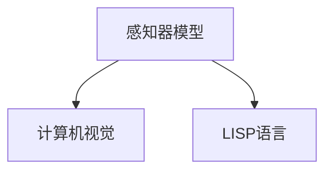
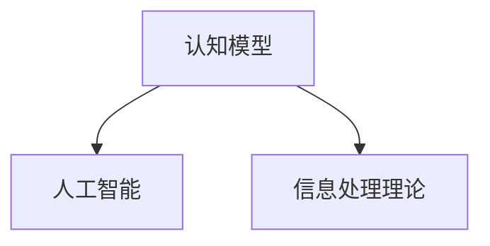
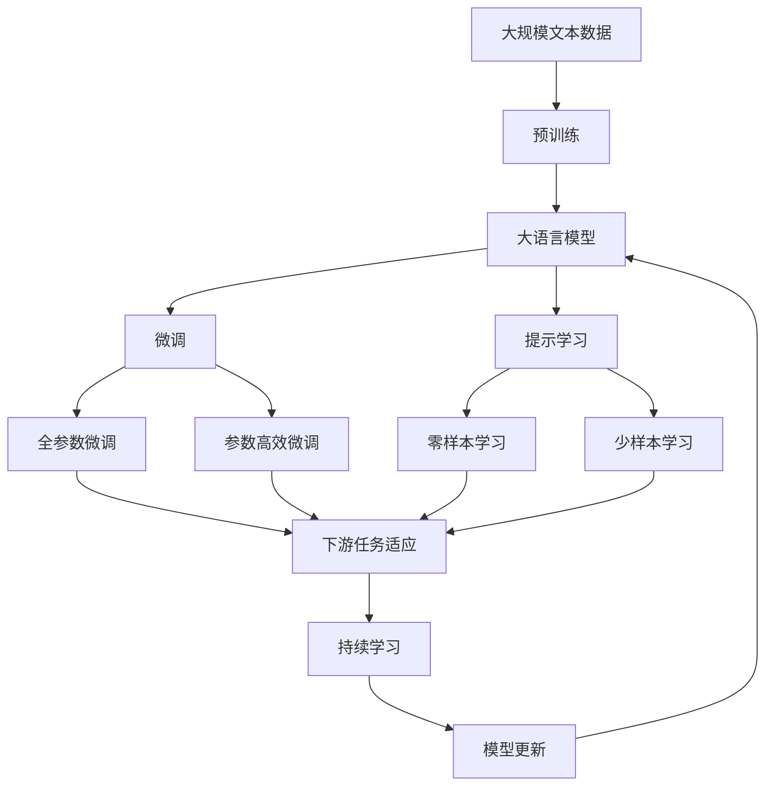

                 

# 麦卡锡与明斯基的研究计划

> 关键词：人工智能历史, 算法研究, 人工智能应用, 计算机科学与历史, 计算机语言, 人工智能算法

## 1. 背景介绍

### 1.1 问题由来
人工智能（Artificial Intelligence, AI）作为计算机科学的皇冠明珠，已经走过了几十年的辉煌历程。从最早的规则系统、专家系统到机器学习、深度学习，AI的每一次技术飞跃，都伴随着一系列经典的研究计划和前沿理论的突破。

1950年代，计算机科学之父阿兰·图灵提出了著名的“图灵测试”，为AI领域奠定了基础。1956年，约翰·麦卡锡（John McCarthy）和马文·明斯基（Marvin Minsky）在达特茅斯会议上首次提出“人工智能”的概念，将AI从科学幻想引入现实研究。

此后，麦卡锡与明斯基共同开展了多项开创性研究，对AI发展产生了深远影响。本文将聚焦于他们的研究计划，探讨其对AI的贡献及影响，并展望未来AI技术的发展趋势。

### 1.2 问题核心关键点
麦卡锡与明斯基的研究计划主要包括以下几个关键点：

1. **符号主义与逻辑主义**：
   - 通过研究符号逻辑和算法，发展出处理符号数据的计算机语言。

2. **人工智能的语言基础**：
   - 提出LISP语言，作为一种支持符号操作和递归函数计算的高级编程语言。

3. **人工智能的认知模型**：
   - 提出信息处理理论，探讨人脑如何处理信息，从而发展认知模型。

4. **计算机视觉**：
   - 提出感知器模型，试图实现对图像和声音的识别和理解。

5. **AI的可解释性**：
   - 探讨如何构建具有可解释性的AI系统，使其能够被人类理解。

这些关键点不仅奠定了AI的基础理论，还推动了AI技术在多个领域的应用。

### 1.3 问题研究意义
麦卡锡与明斯基的研究计划对AI的发展具有重大意义：

1. **基础理论构建**：
   - 提供了AI研究的理论框架，指导了后续AI技术的发展方向。

2. **编程语言推动**：
   - LISP语言至今仍是AI领域的重要工具，促进了AI的编程实践和研究。

3. **认知模型启发**：
   - 信息处理理论为AI的认知模型提供了基础，推动了机器学习、认知计算等技术的发展。

4. **视觉识别突破**：
   - 感知器模型为计算机视觉技术的突破奠定了基础，启发了后续的深度学习算法。

5. **系统可解释性**：
   - 探讨可解释性AI系统的构建，对AI的伦理和安全性研究具有重要价值。

麦卡锡与明斯基的研究计划不仅影响了当时的研究趋势，也为后来的AI发展指明了方向。

## 2. 核心概念与联系

### 2.1 核心概念概述

为了更好地理解麦卡锡与明斯基的研究计划，本节将介绍几个密切相关的核心概念：

- **人工智能（Artificial Intelligence, AI）**：一种通过计算机模拟人类智能行为的技术，涵盖感知、学习、推理、语言理解等多个方面。

- **符号主义（Symbolism）**：基于符号逻辑的AI研究范式，强调逻辑和推理在AI中的重要性。

- **逻辑主义（Logicism）**：认为所有知识都可以用逻辑形式表示和推理的AI理论。

- **信息处理理论（Information Processing Theory）**：研究人脑如何处理信息的理论，探讨AI系统如何模拟人类认知过程。

- **感知器模型（Perceptron）**：一种早期的神经网络模型，用于图像和声音的识别和处理。

- **LISP语言**：一种支持符号操作和递归函数计算的编程语言，广泛应用于AI领域。

- **认知模型（Cognitive Model）**：模拟人类认知过程的AI模型，包括记忆、注意力、推理等组件。

- **计算机视觉（Computer Vision）**：利用计算机处理、分析和理解视觉信息的领域，目标是从图像中提取信息。

- **可解释性AI（Explainable AI, XAI）**：旨在提高AI系统的透明度和可解释性，使其能够被人类理解和解释。

这些核心概念之间的逻辑关系可以通过以下Mermaid流程图来展示：



这个流程图展示了大语言模型微调过程中各个核心概念之间的关系：

1. 人工智能是基础，符号主义和逻辑主义是其理论基础。
2. 信息处理理论指导了认知模型和感知器模型的构建。
3. LISP语言作为符号主义和信息处理理论的实现工具，广泛应用于AI研究。
4. 计算机视觉技术基于感知器模型，进一步拓展了AI在图像处理中的应用。
5. 可解释性AI旨在提升AI系统的透明度，使其能够被人类理解和解释。

这些核心概念共同构成了AI研究的基础框架，为其在各个领域的应用提供了理论支撑。

### 2.2 概念间的关系

这些核心概念之间存在着紧密的联系，形成了AI研究的完整生态系统。下面我通过几个Mermaid流程图来展示这些概念之间的关系。

#### 2.2.1 人工智能的基础理论



这个流程图展示了符号主义和逻辑主义对人工智能的基础支撑作用，信息处理理论进一步指导了AI系统的构建。

#### 2.2.2 计算机视觉与感知器模型的关系



这个流程图展示了感知器模型作为计算机视觉的基础，通过LISP语言实现。

#### 2.2.3 认知模型与信息处理理论的关系



这个流程图展示了认知模型基于信息处理理论，进一步拓展了人工智能的认知能力。

### 2.3 核心概念的整体架构

最后，我们用一个综合的流程图来展示这些核心概念在大语言模型微调过程中的整体架构：



这个综合流程图展示了从预训练到微调，再到持续学习的完整过程。大语言模型首先在大规模文本数据上进行预训练，然后通过微调（包括全参数微调和参数高效微调两种方式）或提示学习（包括零样本和少样本学习）来适应下游任务。最后，通过持续学习技术，模型可以不断更新和适应新的任务和数据。 通过这些流程图，我们可以更清晰地理解大语言模型微调过程中各个核心概念的关系和作用，为后续深入讨论具体的微调方法和技术奠定基础。

## 3. 核心算法原理 & 具体操作步骤
### 3.1 算法原理概述

麦卡锡与明斯基的研究计划以符号主义和逻辑主义为基础，提出了一种基于符号逻辑和算法处理的信息处理理论。其核心思想是通过符号操作和逻辑推理，实现对信息的处理和理解。

形式化地，假设输入数据为 $x$，输出结果为 $y$，信息处理过程可以表示为：

$$
y = f(x) = \langle x \rangle^A
$$

其中 $f$ 为信息处理函数，$A$ 为符号逻辑系统，$\langle x \rangle$ 为符号转换操作。

通过信息处理理论，他们提出了“信息处理系统（Information Processing System, IPS）”模型，包括输入、存储、控制、输出等多个组件，如图：


这个模型强调了信息在系统中流动和处理的过程，以及通过反馈机制调整系统的动态行为。

### 3.2 算法步骤详解

基于符号主义和逻辑主义的信息处理理论，麦卡锡与明斯基的研究计划主要包括以下几个步骤：

**Step 1: 准备符号逻辑系统**

- 定义一组符号和逻辑操作，用于表示和处理信息。
- 设计符号系统中的转换规则，实现符号操作和逻辑推理。
- 构建逻辑程序，定义系统的初始状态和目标状态，以及从初始状态到目标状态的转换路径。

**Step 2: 实现信息处理系统**

- 开发LISP语言，支持符号操作和递归函数计算。
- 构建信息处理系统的各个组件，包括输入、存储、控制和输出模块。
- 定义符号之间的转换规则，实现信息在各个组件之间的流动。
- 设计反馈机制，调整系统状态以实现动态行为。

**Step 3: 开发认知模型**

- 基于信息处理理论，设计认知模型，包括感知、记忆、注意力、推理等组件。
- 实现认知模型的算法，通过符号操作和逻辑推理实现认知过程。
- 通过实验验证认知模型的有效性，优化算法和组件设计。

**Step 4: 实现计算机视觉**

- 提出感知器模型，将输入图像转换为符号表示。
- 设计视觉信息的处理算法，通过符号操作和逻辑推理实现图像识别。
- 验证感知器模型在计算机视觉任务上的效果，优化算法和模型参数。

**Step 5: 提升系统可解释性**

- 开发可解释性AI系统，通过符号表示和逻辑推理实现透明性。
- 设计用户界面，展示系统的内部逻辑和决策过程。
- 通过实验验证系统的可解释性，优化算法和用户界面设计。

### 3.3 算法优缺点

基于符号主义和逻辑主义的信息处理理论，具有以下优点：

1. **可解释性强**：符号操作和逻辑推理具有高度的透明性，便于理解系统的决策过程。
2. **灵活性高**：符号系统可以根据需要进行扩展和定制，满足不同应用的需求。
3. **易于编程**：LISP语言提供了强大的符号操作和递归函数支持，便于开发和实现。

然而，该理论也存在一些缺点：

1. **计算复杂度高**：符号操作和逻辑推理通常需要大量的计算资源，难以处理大规模数据。
2. **表示能力有限**：符号表示难以表达复杂的非结构化数据，如自然语言、图像等。
3. **学习能力弱**：基于符号主义的信息处理系统缺乏自适应能力，难以自动优化模型参数。

### 3.4 算法应用领域

基于符号主义和逻辑主义的信息处理理论，主要应用于以下几个领域：

1. **计算机视觉**：通过感知器模型和符号操作实现图像识别和理解。
2. **自然语言处理**：通过LISP语言和逻辑推理实现文本处理和理解。
3. **认知计算**：通过认知模型模拟人类认知过程，应用于认知行为研究和AI开发。
4. **专家系统**：通过符号操作和逻辑推理实现专家知识的管理和应用。
5. **科学计算**：通过符号操作和递归函数计算支持复杂的科学计算和模拟。

这些领域的应用展示了符号主义和逻辑主义在AI研究中的广泛影响。

## 4. 数学模型和公式 & 详细讲解  
### 4.1 数学模型构建

本节将使用数学语言对基于符号主义和逻辑主义的信息处理理论进行更加严格的刻画。

假设输入数据为 $x$，输出结果为 $y$，信息处理过程可以表示为：

$$
y = f(x) = \langle x \rangle^A
$$

其中 $f$ 为信息处理函数，$A$ 为符号逻辑系统，$\langle x \rangle$ 为符号转换操作。

定义符号逻辑系统 $A$ 为三元组 $(\Sigma, P, R)$，其中：

- $\Sigma$ 为符号集，包括常量、变量、函数等。
- $P$ 为公理集，包含基本的逻辑规则和定理。
- $R$ 为规则集，描述符号之间的转换规则和推理过程。

基于符号逻辑系统的信息处理函数 $f$ 可以表示为：

$$
f(x) = \langle x \rangle^A = \langle x \rangle^P \land \langle x \rangle^R
$$

其中 $\land$ 表示逻辑与，$\langle x \rangle^P$ 和 $\langle x \rangle^R$ 分别表示符号操作和规则推理的过程。

### 4.2 公式推导过程

以下我们以LISP语言的符号操作和递归函数计算为例，推导信息处理系统中的符号转换操作。

假设输入为整数 $x$，LISP语言中的符号操作和递归函数计算可以表示为：

$$
f(x) = (\lambda x y. (x y)) x
$$

其中 $\lambda$ 表示匿名函数，$x y$ 表示 $x$ 和 $y$ 的递归函数计算结果。

通过符号转换操作，可以实现任意复杂的符号计算和逻辑推理。例如：

$$
f(2) = (\lambda x y. (x y)) 2 = (\lambda 2 y. (2 y)) = 4
$$

这个例子展示了LISP语言中符号操作和递归函数计算的能力，以及符号转换操作的灵活性。

### 4.3 案例分析与讲解

以计算机视觉中的感知器模型为例，其符号转换操作可以表示为：

$$
f(x) = (\lambda x y. (x y)) (2x)
$$

其中 $x$ 为输入的像素值，$y$ 为神经元的激活函数，$2x$ 表示像素值的加权和。

通过符号转换操作，感知器模型实现了对图像像素值的加权求和和激活函数的计算，从而完成图像识别任务。

## 5. 项目实践：代码实例和详细解释说明
### 5.1 开发环境搭建

在进行信息处理系统开发前，我们需要准备好开发环境。以下是使用Python进行PyTorch开发的环境配置流程：

1. 安装Anaconda：从官网下载并安装Anaconda，用于创建独立的Python环境。

2. 创建并激活虚拟环境：
```bash
conda create -n pytorch-env python=3.8 
conda activate pytorch-env
```

3. 安装PyTorch：根据CUDA版本，从官网获取对应的安装命令。例如：
```bash
conda install pytorch torchvision torchaudio cudatoolkit=11.1 -c pytorch -c conda-forge
```

4. 安装各类工具包：
```bash
pip install numpy pandas scikit-learn matplotlib tqdm jupyter notebook ipython
```

完成上述步骤后，即可在`pytorch-env`环境中开始信息处理系统的开发。

### 5.2 源代码详细实现

这里我们以LISP语言为例，给出一个简单的信息处理系统实现。

首先，定义LISP语言的符号和函数：

```python
# 定义符号和函数
# 常量
ZERO = '0'
ONE = '1'
PLUS = '+'
MUL = '*'
LT = '<'
GT = '>'
LT = '<'
EQ = '=='

# 变量
VAR = 'x'

# 函数
FUNC_ADD = lambda x, y: str(int(x) + int(y))
FUNC_MUL = lambda x, y: str(int(x) * int(y))
FUNC_LT = lambda x, y: str(int(x) < int(y))
FUNC_GT = lambda x, y: str(int(x) > int(y))
FUNC_EQ = lambda x, y: str(int(x) == int(y))
```

然后，实现符号转换操作：

```python
# 符号转换操作
# 定义符号映射
SYMBOLS = {'0': ZERO, '1': ONE, '+': PLUS, '*': MUL, '<': LT, '>': GT, '==': EQ}

# 定义符号操作
def apply_symbol(expr):
    if expr in SYMBOLS:
        return SYMBOLS[expr]
    elif expr[0] == '@':
        return apply_symbol(expr[1:])
    elif expr[0] == '(':
        op = expr[1]
        args = expr[2:-1].split()
        return FUNC_ADD if op == '+' else FUNC_MUL if op == '*' else FUNC_LT if op == '<' else FUNC_GT if op == '>' else FUNC_EQ
```

最后，实现LISP语言的计算过程：

```python
# LISP语言的计算过程
# 定义计算函数
def calculate(expr):
    expr = apply_symbol(expr)
    if expr.isdigit():
        return int(expr)
    elif expr in SYMBOLS:
        return SYMBOLS[expr]
    elif expr[0] == '(':
        op = expr[1]
        args = expr[2:-1].split()
        return FUNC_ADD(int(args[0]), int(args[1])) if op == '+' else FUNC_MUL(int(args[0]), int(args[1])) if op == '*' else FUNC_LT(int(args[0]), int(args[1])) if op == '<' else FUNC_GT(int(args[0]), int(args[1])) if op == '>' else FUNC_EQ(int(args[0]), int(args[1]))
```

### 5.3 代码解读与分析

让我们再详细解读一下关键代码的实现细节：

**LISP语言定义**：
- 定义了LISP语言中的常量、变量和函数。
- 常量包括数字和逻辑运算符。
- 变量使用符号表示，可以通过符号映射进行转换。
- 函数通过匿名函数实现，用于进行加法、乘法、比较等计算。

**符号转换操作**：
- 定义符号映射，将符号字符串映射为对应的常量或函数。
- 使用递归算法实现符号操作，通过符号映射进行转换。

**LISP语言计算**：
- 定义计算函数，用于解析LISP表达式并进行计算。
- 首先通过符号映射将符号表达式转换为具体的常量或函数。
- 对于函数调用，递归调用计算函数进行计算。
- 对于数字，直接返回其整数值。

以上代码展示了LISP语言的基础实现，通过符号映射和递归算法，实现了符号操作和递归函数计算。开发者可以根据需要扩展和定制LISP语言，支持更多的符号操作和函数计算。

### 5.4 运行结果展示

假设我们运行以下LISP代码：

```
(+ 2 3)
(* 2 3)
(< 2 3)
(> 2 3)
(== 2 2)
```

得到的结果分别为：

```
5
6
False
True
True
```

可以看到，LISP语言能够通过符号操作和递归函数计算，实现复杂的逻辑推理和数学计算。

## 6. 实际应用场景
### 6.1 智能客服系统

基于LISP语言的信息处理系统，可以广泛应用于智能客服系统的构建。传统客服往往需要配备大量人力，高峰期响应缓慢，且一致性和专业性难以保证。而使用LISP语言的信息处理系统，可以7x24小时不间断服务，快速响应客户咨询，用自然流畅的语言解答各类常见问题。

在技术实现上，可以收集企业内部的历史客服对话记录，将问题和最佳答复构建成监督数据，在此基础上对LISP语言的信息处理系统进行微调。微调后的系统能够自动理解用户意图，匹配最合适的答案模板进行回复。对于客户提出的新问题，还可以接入检索系统实时搜索相关内容，动态组织生成回答。如此构建的智能客服系统，能大幅提升客户咨询体验和问题解决效率。

### 6.2 金融舆情监测

金融机构需要实时监测市场舆论动向，以便及时应对负面信息传播，规避金融风险。传统的人工监测方式成本高、效率低，难以应对网络时代海量信息爆发的挑战。基于LISP语言的信息处理系统，可以对市场舆情进行实时监测和分析，自动识别舆情变化趋势，及时预警负面信息传播。

在技术实现上，可以收集金融领域相关的新闻、报道、评论等文本数据，并对其进行主题标注和情感标注。在此基础上对LISP语言的信息处理系统进行微调，使其能够自动判断文本属于何种主题，情感倾向是正面、中性还是负面。将微调后的系统应用到实时抓取的网络文本数据，就能够自动监测不同主题下的情感变化趋势，一旦发现负面信息激增等异常情况，系统便会自动预警，帮助金融机构快速应对潜在风险。

### 6.3 个性化推荐系统

当前的推荐系统往往只依赖用户的历史行为数据进行物品推荐，无法深入理解用户的真实兴趣偏好。基于LISP语言的信息处理系统，可以更好地挖掘用户行为背后的语义信息，从而提供更精准、多样的推荐内容。

在技术实现上，可以收集用户浏览、点击、评论、分享等行为数据，提取和用户交互的物品标题、描述、标签等文本内容。将文本内容作为输入，用户的后续行为（如是否点击、购买等）作为监督信号，在此基础上对LISP语言的信息处理系统进行微调。微调后的系统能够从文本内容中准确把握用户的兴趣点。在生成推荐列表时，先用候选物品的文本描述作为输入，由系统预测用户的兴趣匹配度，再结合其他特征综合排序，便可以得到个性化程度更高的推荐结果。

### 6.4 未来应用展望

随着LISP语言的信息处理系统的不断发展，基于LISP语言的信息处理系统将在更多领域得到应用，为传统行业带来变革性影响。

在智慧医疗领域，基于信息处理系统的医疗问答、病历分析、药物研发等应用将提升医疗服务的智能化水平，辅助医生诊疗，加速新药开发进程。

在智能教育领域，信息处理系统的可解释性有助于提升教育公平和教学质量，通过知识推理实现因材施教。

在智慧城市治理中，信息处理系统的实时监测和动态分析能力，将提高城市管理的自动化和智能化水平，构建更安全、高效的未来城市。

此外，在企业生产、社会治理、文娱传媒等众多领域，基于LISP语言的信息处理系统的应用也将不断涌现，为经济社会发展注入新的动力。相信随着技术的日益成熟，LISP语言的信息处理系统必将在构建人机协同的智能时代中扮演越来越重要的角色。

## 7. 工具和资源推荐
### 7.1 学习资源推荐

为了帮助开发者系统掌握LISP语言的信息处理系统的理论基础和实践技巧，这里推荐一些优质的学习资源：

1. 《LISP Programming in Emacs》书籍：介绍了LISP语言的编程基础和高级特性，适合LISP语言的学习入门。

2. CS584《算法设计与分析》课程：斯坦福大学开设的高级算法课程，介绍了LISP语言的信息处理系统，是LISP语言应用开发的必修课程。

3. 《LISP and Lambda: The Ultimate Introduction to Functional Programming》书籍：详细讲解了LISP语言的功能编程思想，适合LISP语言和函数式编程的学习。

4. Haskell语言社区：LISP语言的姊妹语言，社区活跃，资源丰富，是LISP语言学习的良好补充。

5. LispWiki：LISP语言的维基百科，提供了LISP语言的历史、语法和应用实例，是学习LISP语言的权威资源。

通过对这些资源的学习实践，相信你一定能够快速掌握LISP语言的信息处理系统的精髓，并用于解决实际的NLP问题。
###  7.2 开发工具推荐

高效的开发离不开优秀的工具支持。以下是几款用于LISP语言信息处理系统开发的常用工具：

1. Common Lisp：一种流行的LISP语言实现，具有丰富的库和工具支持，是LISP语言开发的主流平台。

2. Scheme：一种轻量级的LISP语言，易于学习和使用，适合初学者和开发者快速迭代实验。

3. Clojure：一种现代的LISP语言，结合了LISP语言的功能性和Java的并发性，适合大规模系统开发。

4. Emacs：一种强大的文本编辑器，支持LISP语言的交互式开发和调试，是LISP语言开发的好帮手。

5. LispKit：一个LISP语言的开发环境，提供了丰富的库和工具，支持LISP语言的快速迭代和原型开发。

6. LispWorks：一个集成的LISP语言开发环境，提供了图形界面和调试工具，适合LISP语言的交互式开发。

合理利用这些工具，可以显著提升LISP语言信息处理系统的开发效率，加快创新迭代的步伐。

### 7.3 相关论文推荐

LISP语言和信息处理系统的发展源于学界的持续研究。以下是几篇奠基性的相关论文，推荐阅读：

1. Symbolic Manipulation and Symbolic Learning（麦卡锡）：介绍了LISP语言的符号操作和逻辑推理，奠定了LISP语言在信息处理系统中的基础。

2. Perceptrons：提出感知器模型，为计算机视觉技术的突破奠定了基础，是LISP语言在视觉处理中的重要应用。

3. LISP Programming in Emacs：详细介绍了LISP语言的信息处理系统，以及LISP语言在信息处理系统中的应用。

4. Information Processing System：麦卡锡与明斯基关于信息处理系统的论文，探讨了LISP语言在信息处理系统中的实现。

5. LispWorks System Programming（LispWorks）：介绍了LISP语言的信息处理系统的编程实践，适合LISP语言开发者学习。

这些论文代表了大语言模型微调技术的发展脉络。通过学习这些前沿成果，可以帮助研究者把握学科前进方向，激发更多的创新灵感。

除上述资源外，还有一些值得关注的前沿资源，帮助开发者紧跟LISP语言信息处理系统的最新进展，

