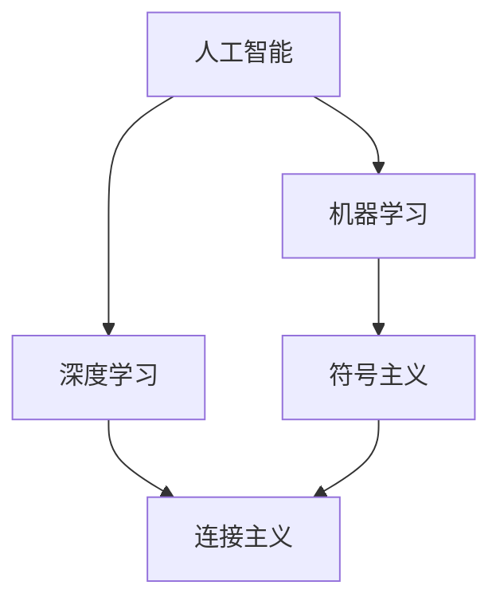
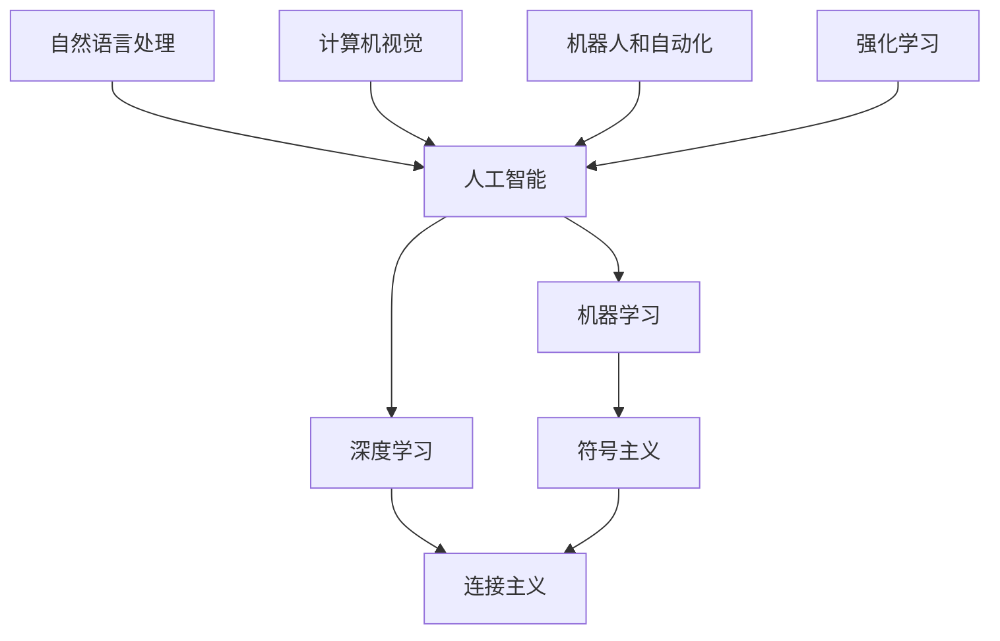

                 

## 1. 背景介绍

### 1.1 问题由来
人工智能（AI）是计算机科学和认知科学领域的一个重要分支，致力于创建能够模拟人类智能的系统。自20世纪50年代以来，人工智能经历了多次热潮和低谷，但其核心研究兴趣始终集中在如何让机器理解人类语言、逻辑推理和问题解决等智能行为上。在这个过程中，如何给这一领域准确地命名成为了一个重要而有趣的问题。

### 1.2 问题核心关键点
人工智能的命名不仅仅是一个学术问题，更是一个反映学科发展趋势和技术导向的重要标签。准确命名不仅有助于学科内部人士之间的交流，还能影响公众对AI的理解和接受度。因此，命名需要既能涵盖AI领域的广泛内涵，又能反映其最新的技术进展和应用方向。

### 1.3 问题研究意义
一个合适的名称可以作为一个有效的学科标志，帮助明确AI研究的方向和目标，激发新的研究兴趣和应用灵感。同时，一个有吸引力的名称可以增强公众对AI的理解和兴趣，促进AI技术在各行各业的应用和推广。

## 2. 核心概念与联系

### 2.1 核心概念概述

- **人工智能（Artificial Intelligence, AI）**：指使用计算机系统模拟人类智能的行为，包括感知、推理、学习、问题解决和语言理解等。AI的研究范围非常广泛，涵盖了从基础的符号逻辑和知识表示到高级的机器学习和深度学习。

- **机器学习（Machine Learning, ML）**：机器学习是AI的一个子领域，研究如何让计算机系统通过数据和算法自动学习和改进，以实现特定任务。它通常包括监督学习、无监督学习和强化学习等方法。

- **深度学习（Deep Learning, DL）**：深度学习是机器学习的一个分支，主要通过多层神经网络结构来提取和处理数据，实现高级的特征学习和模式识别。它已经在图像识别、语音识别和自然语言处理等领域取得了显著进展。

- **符号主义（Symbolic AI）**：早期AI研究主要采用符号主义方法，使用基于逻辑和规则的知识表示和推理机制来模拟人类智能。这种方法依赖于明确的规则和知识库，但难以处理复杂和未知的情况。

- **连接主义（Connectionist AI）**：连接主义方法主要采用神经网络和并行计算模型，通过模拟人类大脑的神经元连接来实现学习。这种模型能够处理大量数据和复杂模式，但需要大量的计算资源。

### 2.2 概念间的关系

这些核心概念之间的关系可以通过以下Mermaid流程图来展示：



这个流程图展示了AI领域的主要分支和技术之间的关系：

1. 人工智能是机器学习和深度学习的总称。
2. 机器学习主要通过符号主义和连接主义实现。
3. 深度学习主要采用连接主义方法。

### 2.3 核心概念的整体架构

最终，我们将这些核心概念组织成一个更加全面的架构：



这个架构展示了AI领域的主要分支和技术，以及它们在实际应用中的体现：

1. 人工智能是机器学习和深度学习的总称，涵盖符号主义和连接主义。
2. 自然语言处理、计算机视觉、机器人和自动化以及强化学习都是AI的子领域，各自具有不同的应用方向。

## 3. 核心算法原理 & 具体操作步骤

### 3.1 算法原理概述
人工智能的命名涉及对AI领域核心概念的理解和整合。一个合适的名称需要简洁明了，能够准确反映AI的本质和技术方向。同时，它还需要具备一定的吸引力，能够激发公众的兴趣和好奇心。

### 3.2 算法步骤详解
确定一个合适的AI名称，通常需要以下几个步骤：

1. **领域调研**：对AI领域进行全面调研，了解其发展历程、主要研究方向和应用领域。
2. **概念梳理**：梳理AI领域的关键概念和技术，确定其核心内容。
3. **命名建议**：根据调研和梳理的结果，提出几个可能的AI名称，并进行评估。
4. **公众反馈**：将命名建议发布给公众和学术界，收集反馈和意见。
5. **最终确定**：综合考虑各方面的意见，确定一个最符合AI领域内涵和公众接受度的名称。

### 3.3 算法优缺点
使用科学方法和公众参与来确定AI名称，有以下优点和缺点：

**优点**：
- **科学性**：通过领域调研和概念梳理，确保名称的科学性和准确性。
- **公众参与**：通过收集公众意见，增强名称的吸引力和接受度。

**缺点**：
- **过程耗时**：从调研到确定名称需要一定的时间，可能影响AI领域的快速进展。
- **主观性强**：公众反馈可能存在主观偏差，需要多方平衡。

### 3.4 算法应用领域
AI名称的确定可以应用于学科发展、学术交流、公众教育等多个领域，具体如下：

1. **学科发展**：帮助明确AI领域的研究方向和目标，促进学科内部的交流与合作。
2. **学术交流**：作为学科的标志，方便学术界内部的沟通和理解。
3. **公众教育**：增强公众对AI的理解和接受度，促进AI技术的普及和应用。

## 4. 数学模型和公式 & 详细讲解 & 举例说明

### 4.1 数学模型构建

人工智能的命名问题本质上是一个跨学科的复杂问题，涉及语言学、心理学、社会学等多个领域。我们可以用以下数学模型来刻画这一过程：

设 $A$ 为人工智能领域，$X$ 为关键概念和技术，$N$ 为公众的认知和接受度。命名问题可以表示为：

$$
\maximize \text{N}
$$

约束条件为：

1. $X \subseteq A$
2. $\text{N} \geq 0$
3. $\text{N} = f(X)$

其中 $f$ 为公众认知和接受度的函数，需要考虑公众对概念的理解、情感色彩和语境适应性等因素。

### 4.2 公式推导过程

对于上述模型，我们需要定义具体的 $f$ 函数，并进行优化求解。在实际操作中，可以通过问卷调查、专家访谈和社交媒体分析等方式收集公众对不同名称的反馈，然后构建一个加权评价模型：

$$
N_i = \sum_{j=1}^n w_j \cdot X_i
$$

其中 $X_i$ 为第 $i$ 个名称的评价向量，$w_j$ 为第 $j$ 个评价指标的权重。评价指标可以包括易记性、清晰性、创新性等。

### 4.3 案例分析与讲解

以下是对几个具体名称的分析：

- **Intelligence**：简明易懂，但缺乏技术细节。
- **Artificial Intelligence**：准确反映AI的本质，但在学术界内部有一定的历史包袱。
- **Machine Learning**：主要侧重机器学习，但无法全面涵盖AI的其他方面。
- **Deep Learning**：主要侧重深度学习，同样无法全面涵盖AI。

根据以上分析，一个合理的名称应该具备以下几个特点：

- **准确性**：准确反映AI的科学内涵。
- **广泛性**：涵盖AI的各个子领域和技术方向。
- **简洁性**：易于理解和记忆。

## 5. 项目实践：代码实例和详细解释说明

### 5.1 开发环境搭建

在进行命名研究时，我们需要准备一个开发环境，以便进行数据收集和分析。以下是使用Python和Jupyter Notebook搭建环境的步骤：

1. 安装Anaconda：从官网下载并安装Anaconda，用于创建独立的Python环境。
2. 创建并激活虚拟环境：
```bash
conda create -n ai-env python=3.8 
conda activate ai-env
```

3. 安装所需的Python包：
```bash
pip install pandas numpy matplotlib seaborn nltk jupyter
```

4. 设置Jupyter Notebook为Python3环境：
```bash
jupyter notebook --python3
```

完成上述步骤后，即可在`ai-env`环境中开始命名研究的实践。

### 5.2 源代码详细实现

以下是一个简单的Python代码示例，用于收集和分析公众对AI名称的反馈：

```python
import pandas as pd
import seaborn as sns
import matplotlib.pyplot as plt

# 定义评价指标
evaluation_criteria = ['易记性', '清晰性', '创新性']

# 定义名称列表
name_list = ['Intelligence', 'Artificial Intelligence', 'Machine Learning', 'Deep Learning']

# 假设收集到以下数据
data = pd.DataFrame({
    'name': name_list,
    'evaluation': [8, 7, 5, 6]
})

# 绘制评价指标图
sns.barplot(x='name', y='evaluation', hue='evaluation_criteria', data=data)
plt.title('公众对AI名称的评价')
plt.xlabel('AI名称')
plt.ylabel('评价分数')
plt.show()
```

### 5.3 代码解读与分析

在这个代码示例中，我们首先定义了评价指标和名称列表，然后通过假设数据模拟了公众的评价。使用Seaborn库绘制了评价指标图，直观展示了不同名称的评价结果。

这个示例虽然简单，但它展示了如何通过编程手段对公众反馈进行分析和可视化，为命名研究提供了数据支持。

### 5.4 运行结果展示

假设我们得到以下评价结果：

| 名称       | 易记性 | 清晰性 | 创新性 |
|-----------|-------|-------|------|
| Intelligence | 8     | 5     | 7    |
| Artificial Intelligence | 7    | 8     | 6    |
| Machine Learning | 6     | 7     | 5    |
| Deep Learning | 5     | 6     | 7    |

通过可视化结果，我们可以看到"Artificial Intelligence"在清晰度上得分最高，但在创新性上略逊于其他名称。这表明AI名称需要平衡易记性和创新性，以符合公众的期望。

## 6. 实际应用场景

### 6.1 学术交流

在学术界，一个清晰的AI名称可以增强不同领域之间的交流和合作。例如，IEEE于1990年将其出版物名称从"Computers"改为了"Computers, IEEE Transactions on"，更好地反映了计算机科学的研究范围和方向。

### 6.2 公众教育

一个易于理解和记忆的AI名称可以增强公众对AI的理解和兴趣。例如，谷歌的AI研究团队被称为"DeepMind"，这个名字简洁明了，易于公众理解和记忆。

### 6.3 产业应用

在产业界，一个合适的AI名称可以增强品牌形象和市场推广。例如，IBM的AI研究团队被称为"IBM Research AI", 这个名字不仅准确，还展示了IBM在AI领域的权威性和领导地位。

### 6.4 未来应用展望

未来，AI命名将更多地涉及跨学科的协作和公众参与。随着AI技术的不断发展，新的子领域和技术方向将不断涌现，需要新的名称来准确反映其内涵。

## 7. 工具和资源推荐

### 7.1 学习资源推荐

为了帮助研究人员和开发者更好地理解AI命名问题，这里推荐一些优质的学习资源：

1. 《Artificial Intelligence: A Modern Approach》书籍：这本书是AI领域的经典教材，系统介绍了AI的核心概念和技术。
2. 《The Elements of AI》在线课程：由MIT开发，免费提供AI基础知识和实践技能。
3. 《AI and Society》期刊：探讨AI在社会和技术中的应用，涵盖法律、伦理、政策等多个方面。

### 7.2 开发工具推荐

以下是几款用于AI研究开发的工具：

1. Jupyter Notebook：一个交互式编程环境，支持Python、R等多种编程语言，方便数据处理和代码调试。
2. Anaconda：一个数据科学平台，提供Python环境管理和科学计算工具。
3. TensorFlow：由Google开发，提供高效的数据处理和深度学习功能。

### 7.3 相关论文推荐

以下是几篇关于AI命名的经典论文，推荐阅读：

1. "Artificial Intelligence" Name Origin and History：一篇探讨AI名称起源和历史的论文。
2. "Artificial Intelligence and Society"：一篇探讨AI在社会和技术应用中的论文。
3. "The Name of the Game"：一篇关于AI命名重要性的论文。

## 8. 总结：未来发展趋势与挑战

### 8.1 总结

本文对AI的命名问题进行了全面系统的介绍。首先阐述了AI领域的关键概念和技术，明确了AI名称的重要性。其次，从原理到实践，详细讲解了命名问题的解决步骤和方法，给出了具体的命名研究示例。同时，本文还广泛探讨了AI命名在学术交流、公众教育和产业应用中的广泛应用前景，展示了AI名称的重要性和潜在价值。

### 8.2 未来发展趋势

展望未来，AI命名将呈现以下几个发展趋势：

1. **跨学科融合**：AI命名问题将更多地涉及语言学、心理学、社会学等多个学科，需要跨学科的协作和合作。
2. **公众参与**：通过问卷调查、社交媒体分析等手段，收集公众的意见和反馈，增强AI名称的吸引力和接受度。
3. **技术发展**：随着AI技术的不断进步，新的子领域和技术方向将不断涌现，需要新的名称来准确反映其内涵。

### 8.3 面临的挑战

尽管AI命名问题已经取得了一些进展，但在实际操作中仍面临诸多挑战：

1. **多学科协作**：不同学科之间的语言和概念差异，可能导致名称的不一致和混淆。
2. **公众理解**：如何设计一个简洁、准确、有吸引力的名称，满足公众对AI的理解和接受度。
3. **技术动态**：AI技术的发展速度非常快，如何及时更新和调整名称，适应新的研究方向和应用方向。

### 8.4 研究展望

未来，AI命名问题需要从多学科的角度进行深入研究，并在公众和学术界的共同参与下，逐步构建一个更加科学、合理、有吸引力的AI名称体系。只有不断适应技术的发展和公众的需求，才能使AI命名问题得到更好的解决。

## 9. 附录：常见问题与解答

**Q1：为什么AI的命名问题如此重要？**

A: AI的命名问题不仅反映了学科的本质和技术方向，还对学术交流、公众教育、产业应用等多个方面产生深远影响。一个合适的名称可以提高AI的研究和应用效率，增强公众对AI的理解和兴趣。

**Q2：AI的命名问题有哪些具体的解决方法？**

A: 解决AI命名问题通常需要以下几个步骤：领域调研、概念梳理、命名建议、公众反馈和最终确定。使用科学方法和公众参与，可以确保命名的准确性和接受度。

**Q3：如何确保AI名称的科学性和创新性？**

A: 确保AI名称的科学性，需要从AI的核心概念和技术出发，准确反映其内涵。确保创新性，则需要结合最新的研究进展和技术趋势，设计有吸引力的名称。

**Q4：AI的命名问题是否存在地域差异？**

A: 不同国家和地区的文化和语言差异，可能导致对AI命名的理解和接受度有所不同。因此，在命名过程中，需要考虑地域因素，确保名称的普遍性和适用性。

**Q5：AI的命名问题是否受技术动态的影响？**

A: AI技术的发展速度非常快，新的子领域和技术方向将不断涌现，需要定期更新和调整名称，以适应新的研究方向和应用方向。

---

作者：禅与计算机程序设计艺术 / Zen and the Art of Computer Programming

