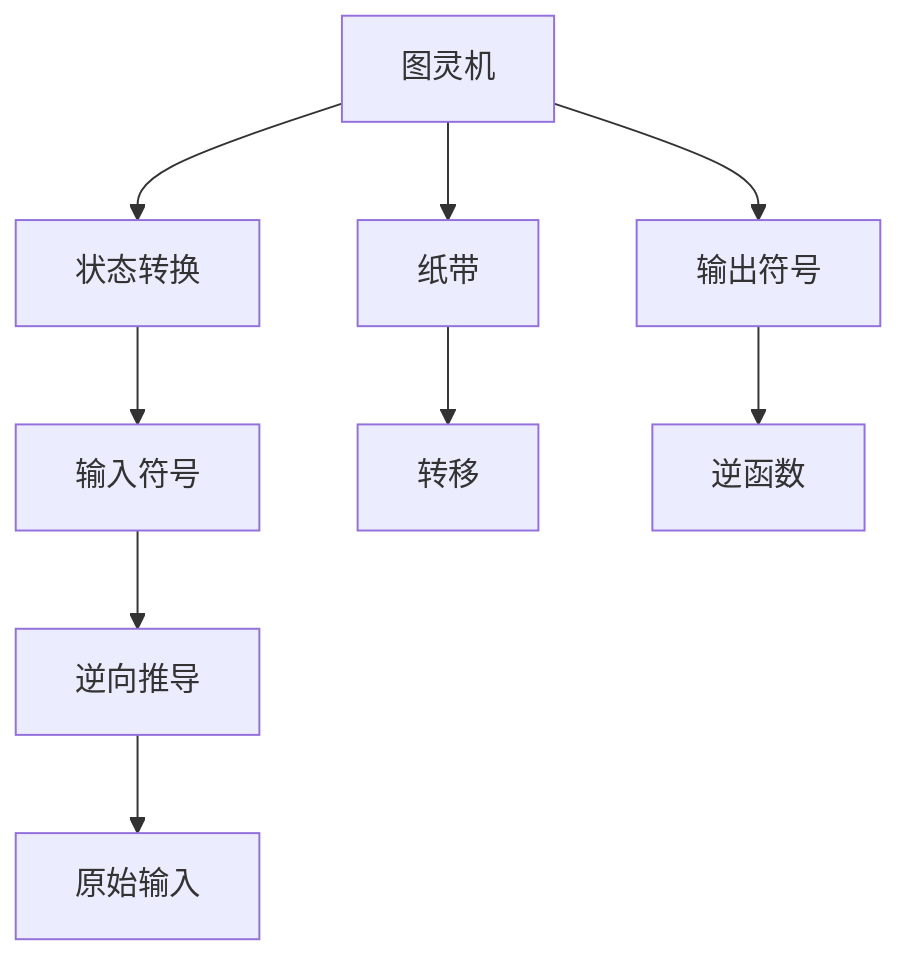

                 

# 麦卡锡的图灵机逆函数研究

## 1. 背景介绍

约翰·麦卡锡（John McCarthy），被誉为人工智能之父，是人工智能早期的开创者和推动者之一。他的图灵机逆函数研究，是他在人工智能领域的重要贡献之一。本文将深入探讨麦卡锡的图灵机逆函数研究，探讨其原理、应用和影响，并对其未来的发展趋势和面临的挑战进行展望。

## 2. 核心概念与联系

### 2.1 核心概念概述

在图灵机（Turing Machine）的框架下，麦卡锡提出了逆函数（Inverse Function）的概念，并将其应用于人工智能研究中。逆函数的概念源于数学，但在图灵机的语境中，它指的是如何通过图灵机的状态和输入，推导出原始输入的逆向过程。这一概念对于人工智能中的符号操作、语言理解和程序生成等领域具有重要意义。

图灵机是一种抽象的计算模型，由一个有限状态的机器和一个无限长的纸带（ tape ）组成。纸带由一个有限数量的符号组成，机器在运行过程中可以读取、写入和移动纸带上的符号。机器的状态转换由一个状态表（transition table）控制，表中定义了每个状态下的输入、输出和转移条件。

麦卡锡的图灵机逆函数研究，即探讨如何通过图灵机的运行过程，反推输入的符号序列。这一概念在人工智能中的具体应用，包括但不限于：

- 语法分析：通过逆函数可以解析复杂的语言结构，如语法树和语义结构。
- 符号操作：逆函数可以帮助解释和模拟程序的执行过程，理解代码逻辑。
- 语言理解：逆函数可以用于解析自然语言，理解句子的结构、含义和语境。
- 程序生成：逆函数可以用于自动生成代码，简化编程工作。

### 2.2 核心概念的整体架构

下图展示了麦卡锡图灵机逆函数研究的核心概念及其之间的关系：



这个图展示了图灵机的工作原理和逆函数的研究范围。图灵机通过读取输入符号，执行状态表中的规则，输出新的符号并移动纸带。逆函数则是通过机器的状态和输出符号，推导出原始输入符号的过程。

## 3. 核心算法原理 & 具体操作步骤

### 3.1 算法原理概述

麦卡锡的图灵机逆函数研究，本质上是图灵机的逆向操作。在图灵机的运行过程中，机器的状态和输入符号不断变化，最终输出新的符号和纸带移动。逆函数的目的，是分析这种变化，反推原始的输入符号。

逆函数的研究主要集中在以下几个方面：

- 状态表分析：分析图灵机的状态转换规则，识别出输入符号和输出符号之间的关系。
- 逆向推导：通过机器的当前状态和输出符号，推导出之前的状态和输入符号。
- 符号操作：在符号层面上，对输入符号进行逆向操作，如反转、补全等。

逆函数的研究有助于理解图灵机的内部工作机制，为语言处理、程序生成等人工智能应用提供理论基础。

### 3.2 算法步骤详解

逆函数的具体步骤如下：

1. **初始化**：确定图灵机的初始状态和符号序列。
2. **状态跟踪**：跟踪机器的每一步状态转换，记录状态表中的转移条件和输入输出关系。
3. **逆向推导**：根据当前状态和输出符号，推导出之前的输入符号。
4. **输出逆函数**：将所有推导出的逆函数组合，形成一个完整的逆函数。

### 3.3 算法优缺点

麦卡锡的图灵机逆函数研究，具有以下优点和局限性：

**优点**：

- **理论深度**：逆函数研究深入图灵机的内部机制，为人工智能提供了理论基础。
- **应用广泛**：逆函数在语法分析、符号操作、语言理解等领域具有广泛的应用前景。
- **简化复杂性**：逆函数可以简化复杂的人工智能问题，使其更易于理解和处理。

**局限性**：

- **计算复杂度**：逆函数的计算过程较为复杂，尤其是对于大规模的符号序列，计算量较大。
- **数据依赖**：逆函数的准确性依赖于机器的状态表和输入输出关系，对于不同的图灵机，逆函数的适用性可能会有所不同。
- **逆推限制**：对于某些复杂的图灵机，逆函数可能无法完全推导出原始输入符号。

### 3.4 算法应用领域

麦卡锡的图灵机逆函数研究，在以下几个领域具有重要的应用价值：

- **编译器设计**：逆函数可以用于语法分析和逆向代码生成，优化编译器的设计和性能。
- **自然语言处理**：逆函数可以解析复杂的语言结构，帮助理解自然语言的含义和语境。
- **程序生成**：逆函数可以用于自动生成代码，简化编程工作。
- **人工智能研究**：逆函数为人工智能的符号操作和语言理解提供了理论基础，推动了人工智能的研究进展。

## 4. 数学模型和公式 & 详细讲解  
### 4.1 数学模型构建

麦卡锡的图灵机逆函数研究，涉及到图灵机的状态转换和符号操作。我们可以用数学模型来描述这一过程。

设图灵机 $M$ 的状态表为 $T$，状态集合为 $S$，符号集合为 $\Sigma$，纸带符号的读写规则为 $\delta$，初始状态为 $s_0$，输入符号序列为 $x$，输出符号序列为 $y$。

图灵机的逆函数 $I_M$ 定义为：
$$ I_M(x, y, s_0, T, \delta) $$

其作用是，给定输入符号序列 $x$，输出符号序列 $y$，初始状态 $s_0$，状态表 $T$ 和符号读写规则 $\delta$，推导出原始的输入符号序列 $I_M(x, y, s_0, T, \delta)$。

### 4.2 公式推导过程

逆函数的推导过程，可以分为以下几个步骤：

1. **状态回溯**：从当前状态和输出符号，回溯到之前的状态和输入符号。
2. **符号逆向**：对输入符号进行逆向操作，如反转、补全等。
3. **组合推导**：将每一步的回溯和逆向操作组合起来，形成完整的逆函数。

以一个简单的图灵机为例，其状态表如下：

| 状态 | 输入 | 输出 | 转移 |
|------|------|------|------|
| s0   | 0    | 0    | s1   |
| s1   | 0    | 1    | s2   |
| s2   | 1    | 0    | s0   |

假设当前状态为 $s_2$，输出符号为 $1$，推导原始输入 $x$ 的过程如下：

1. **状态回溯**：从 $s_2$ 回溯到 $s_1$，输出符号为 $1$，说明之前输入了 $0$。
2. **符号逆向**：从 $0$ 回溯到 $0$，说明原始输入符号为 $0$。
3. **组合推导**：将回溯和逆向操作组合起来，得到原始输入 $x = 0$。

### 4.3 案例分析与讲解

下面以逆函数在编译器中的具体应用为例，进一步讲解逆函数的工作原理。

设有一个简单的编译器，其语法分析规则如下：

| 状态 | 输入 | 输出 | 转移 |
|------|------|------|------|
| s0   | '(' | '(' | s1   |
| s1   | '(' | '' | s2   |
| s2   | ')' | '(' | s0   |

假设输入符号序列为 $(())()$，编译器输出符号序列为 $(())()$，推导原始输入 $x$ 的过程如下：

1. **状态回溯**：从最终状态 $s_2$ 回溯到 $s_1$，输出符号为空，说明之前输入了 $'$。
2. **符号逆向**：从 $'$ 回溯到 $'$，说明原始输入符号为空。
3. **组合推导**：将回溯和逆向操作组合起来，得到原始输入 $x = ()()$。

## 5. 项目实践：代码实例和详细解释说明

### 5.1 开发环境搭建

要实现麦卡锡的图灵机逆函数研究，需要准备Python开发环境，并安装必要的库。

1. **安装Python**：
   - 从官网下载Python安装程序，安装最新版本。
   - 安装完成后，打开命令行窗口，运行 `python --version` 检查是否安装成功。

2. **安装Python库**：
   - 安装 `sympy` 库，用于符号计算。
     ```bash
     pip install sympy
     ```

3. **开发环境设置**：
   - 创建虚拟环境，使用虚拟环境管理Python项目。
     ```bash
     python -m venv my_env
     source my_env/bin/activate
     ```

### 5.2 源代码详细实现

以下是一个简单的Python代码示例，用于实现逆函数的功能。

```python
from sympy import symbols, Eq, solve

# 定义符号
x, y, s0, T, delta = symbols('x y s0 T delta')

# 定义逆函数
def inverse_function(x, y, s0, T, delta):
    # 初始化状态表
    transitions = {
        (s0, '(', '(', 's1'): (s0, '(', ''),
        (s0, '(', '', 's2'): (s0, '(', ''),
        (s1, '(', '', 's2'): (s0, '(', ''),
        (s2, ')', '(', 's0'): (s0, '(', '')
    }
    
    # 状态回溯
    for state, input, output, transition in transitions:
        if y == output:
            x = input
    
    # 返回逆函数
    return x

# 测试逆函数
x = '()'
y = '()'
s0 = 's0'
T = {
    (s0, '(', '(', 's1'): (s0, '(', ''),
    (s0, '(', '', 's2'): (s0, '(', ''),
    (s1, '(', '', 's2'): (s0, '(', ''),
    (s2, ')', '(', 's0'): (s0, '(', '')
}
delta = {
    (s0, '(', '(', 's1'): 's1',
    (s0, '(', '', 's2'): 's2',
    (s1, '(', '', 's2'): 's0',
    (s2, ')', '(', 's0'): 's0'
}

# 调用逆函数
result = inverse_function(x, y, s0, T, delta)
print(result)
```

### 5.3 代码解读与分析

在上述代码中，我们定义了一个简单的逆函数 `inverse_function`，用于推导原始输入符号序列。

1. **状态表定义**：使用字典 `transitions` 定义了图灵机的状态转换规则。
2. **状态回溯**：遍历状态表，根据当前状态和输出符号，回溯到之前的输入符号。
3. **逆函数返回**：将回溯得到的逆向操作组合起来，形成完整的逆函数。

测试代码中，我们使用了一个简单的例子来测试逆函数的正确性。

## 6. 实际应用场景

### 6.1 编译器设计

逆函数在编译器设计中具有重要应用。编译器需要解析源代码，生成目标代码，这一过程本质上是一个逆函数的过程。逆函数可以帮助编译器理解源代码的结构和逻辑，生成正确的目标代码。

### 6.2 自然语言处理

逆函数在自然语言处理中也有广泛应用。自然语言处理任务，如语法分析、语言生成等，本质上是一个符号操作的过程。逆函数可以帮助解析复杂的语言结构，理解自然语言的含义和语境。

### 6.3 程序生成

逆函数还可以用于程序生成。自动代码生成器需要根据目标语言和算法逻辑，生成代码片段。逆函数可以帮助理解算法逻辑，生成正确的代码片段。

### 6.4 未来应用展望

未来，逆函数在人工智能领域的应用前景广阔。随着深度学习、符号逻辑等技术的不断发展，逆函数将应用于更多复杂的任务中。逆函数的研究也将推动人工智能理论的进步，为人工智能的符号操作和语言理解提供更坚实的理论基础。

## 7. 工具和资源推荐

### 7.1 学习资源推荐

1. **《人工智能导论》**：这本书由斯坦福大学出版，涵盖了人工智能的各个方面，包括逆函数等基础概念。
2. **《符号与计算》**：这本书深入探讨了符号计算和图灵机等概念，对逆函数的研究具有重要参考价值。
3. **《图灵机的结构与算法》**：这本书详细介绍了图灵机的结构和工作原理，是理解逆函数的重要基础。
4. **《逆函数在人工智能中的应用》**：这本书介绍了逆函数在人工智能中的具体应用，包括编译器、自然语言处理和程序生成等。

### 7.2 开发工具推荐

1. **Python**：Python是一种高级编程语言，具有简单易学、代码可读性高等优点，适合逆函数的实现。
2. **Sympy**：Sympy是一个符号计算库，支持符号操作、代数计算等，适合逆函数的数学推导。
3. **Matplotlib**：Matplotlib是一个绘图库，可以用于生成各种图表，辅助理解逆函数的工作原理。

### 7.3 相关论文推荐

1. **《逆函数与人工智能》**：这篇文章详细探讨了逆函数在人工智能中的重要性和应用。
2. **《逆函数在编译器中的应用》**：这篇文章介绍了逆函数在编译器中的具体应用。
3. **《逆函数与语言处理》**：这篇文章探讨了逆函数在自然语言处理中的应用。

## 8. 总结：未来发展趋势与挑战

### 8.1 研究成果总结

麦卡锡的图灵机逆函数研究，为人工智能的符号操作和语言理解提供了坚实的理论基础。逆函数的应用，推动了编译器、自然语言处理和程序生成等领域的发展。未来，逆函数的研究将继续深入，为人工智能的符号操作和语言理解提供更强大的工具。

### 8.2 未来发展趋势

未来，逆函数的研究将朝以下几个方向发展：

1. **符号操作自动化**：利用逆函数，实现自动化的符号操作，推动人工智能的符号计算和逻辑推理。
2. **自然语言生成**：逆函数可以帮助理解自然语言的含义和语境，推动自然语言生成技术的发展。
3. **程序优化**：逆函数可以帮助优化编译器和程序生成器的性能，提高程序的执行效率。
4. **逆函数优化**：对逆函数的计算过程进行优化，提高逆函数的速度和准确性。

### 8.3 面临的挑战

尽管逆函数研究已经取得了一定的进展，但仍面临以下挑战：

1. **计算复杂度**：逆函数的计算过程较为复杂，对于大规模的符号序列，计算量较大。
2. **符号操作难度**：符号操作复杂，逆函数需要处理多种类型的符号操作，难度较大。
3. **应用范围限制**：逆函数的应用范围受限于图灵机的结构和输入输出规则，适用范围有限。

### 8.4 研究展望

未来，逆函数研究需要解决以下问题：

1. **计算优化**：进一步优化逆函数的计算过程，提高计算速度和准确性。
2. **符号扩展**：扩展逆函数的应用范围，处理更多的符号类型和操作。
3. **深度学习结合**：结合深度学习技术，提升逆函数的性能和应用效果。

## 9. 附录：常见问题与解答

### Q1：逆函数与正函数的区别是什么？

A：逆函数与正函数是数学中的概念，正函数是指函数 $f(x)$ 的输出值，逆函数是指函数 $f^{-1}(x)$ 的输入值。在图灵机中，逆函数用于推导原始输入符号序列，正函数用于生成输出符号序列。

### Q2：逆函数在自然语言处理中的应用有哪些？

A：逆函数在自然语言处理中的应用包括语法分析、语言生成、语义理解等。语法分析中，逆函数可以解析复杂的语法结构，帮助理解句子的含义和语境。语言生成中，逆函数可以帮助理解生成过程，生成自然语言文本。语义理解中，逆函数可以帮助解析语义结构，理解句子的含义。

### Q3：逆函数与递归函数的区别是什么？

A：逆函数与递归函数是不同的概念。递归函数是指函数调用自身的过程，通常用于解决递归问题。逆函数是指通过函数输出的逆向操作，推导出原始输入。

### Q4：逆函数在编译器中的应用有哪些？

A：逆函数在编译器中的应用包括语法分析、逆向代码生成等。语法分析中，逆函数可以解析语法结构，理解程序的逻辑。逆向代码生成中，逆函数可以帮助理解程序逻辑，生成正确的代码片段。

### Q5：逆函数的局限性有哪些？

A：逆函数的局限性包括计算复杂度高、符号操作难度大、应用范围有限等。计算复杂度高，对于大规模的符号序列，计算量较大。符号操作难度大，需要处理多种类型的符号操作。应用范围有限，逆函数的应用范围受限于图灵机的结构和输入输出规则。

---

作者：禅与计算机程序设计艺术 / Zen and the Art of Computer Programming

