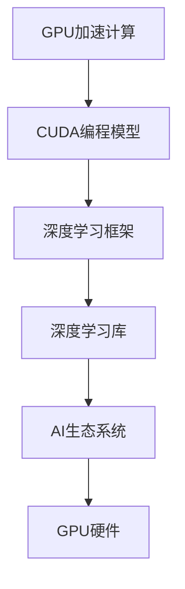

                 

# 黄仁勋与NVIDIA的AI算力革命

## 1. 背景介绍

随着人工智能技术的不断进步，算力需求呈指数级增长。传统CPU在处理大规模并行计算方面存在天然瓶颈，无法满足AI应用的爆发式增长需求。在这样的背景下，NVIDIA凭借其在游戏和图形处理领域的深厚技术积累，迅速转型，推出了基于GPU的深度学习框架CUDA，开启了AI算力革命的序幕。

**黄仁勋 (Jen-Hsun Huang)**，NVIDIA联合创始人，是这次革命的核心推手之一。他不仅是技术创新者，更是商业布局的战略家，凭借其对AI算力的深刻理解和长远规划，引领了整个行业的发展方向。

## 2. 核心概念与联系

### 2.1 核心概念概述

- **GPU加速计算**：相较于CPU，GPU具有更高的并行计算能力，能够在短时间处理大量数据，极大提升了深度学习模型的训练速度。

- **CUDA编程模型**：由NVIDIA开发的一种并行编程模型，通过将算法并行化，利用GPU的高并行处理能力，提升深度学习模型的训练和推理效率。

- **深度学习框架**：如TensorFlow、PyTorch等，通过封装底层计算框架，提供了高效的数据流管理、模型自动微分等功能，简化了深度学习的开发流程。

- **深度学习库**：如cuDNN、MXNet等，专门为GPU加速的深度学习模型提供了高效的数学计算库，进一步优化了模型的训练和推理过程。

- **AI生态系统**：包括算力硬件、深度学习框架、开发工具、应用场景等多个层面，相互协作，共同构建了完整的AI生态链。

这些核心概念共同构成了NVIDIA在AI算力革命中的技术基础，使得NVIDIA能够迅速占领市场，成为AI算力领域的领头羊。

### 2.2 核心概念间的关系

通过Mermaid流程图，展示这些核心概念间的联系：



这个流程图展示了GPU加速计算如何通过CUDA编程模型，转化为深度学习框架和库，最终构成完整的AI生态系统，实现高性能的深度学习模型训练和推理。

## 3. 核心算法原理 & 具体操作步骤

### 3.1 算法原理概述

NVIDIA的AI算力革命，其核心在于将GPU加速计算与深度学习框架紧密结合，提升模型的训练和推理效率。这一过程主要包括以下几个步骤：

1. **GPU并行计算优化**：通过将深度学习模型中的矩阵乘法、卷积运算等计算密集型操作并行化，利用GPU的高并行处理能力，加速模型的计算过程。

2. **CUDA编程框架构建**：利用NVIDIA的CUDA编程模型，将深度学习算法的并行操作进行编程优化，生成高效的可执行程序，提升模型的训练和推理速度。

3. **深度学习框架集成**：将CUDA优化的计算模型集成到深度学习框架中，提供自动化的数据流管理和自动微分功能，进一步简化深度学习的开发和优化过程。

4. **深度学习库优化**：通过cuDNN等GPU深度学习库，提供高效的数学计算函数和算法优化，提升深度学习模型的计算效率。

### 3.2 算法步骤详解

以TensorFlow框架在GPU上的优化为例，详细介绍操作步骤：

1. **环境配置**：
   - 安装NVIDIA CUDA工具包，包含CUDA、cuDNN、NCCL等组件。
   - 安装TensorFlow GPU版本，并进行配置，确保环境中的TensorFlow支持使用GPU计算。

2. **模型定义**：
   - 使用TensorFlow的Keras API定义深度学习模型，包括卷积层、池化层、全连接层等组件。
   - 利用CUDA的C++ API编写底层计算逻辑，实现模型计算的并行化。

3. **数据预处理**：
   - 使用CUDA中的Cub库进行数据并行化处理，提升数据加载和处理的效率。
   - 使用TensorFlow中的数据管道功能，将数据流图嵌入到计算图中，实现数据并行处理。

4. **模型训练**：
   - 使用CUDA的stream和event机制管理GPU计算任务的并行执行。
   - 使用cuDNN提供的矩阵乘法和卷积加速函数，提升模型训练的速度。
   - 使用NVIDIA的NCCL通信库，实现GPU节点间的并行计算优化。

5. **模型推理**：
   - 利用TensorFlow的Session API在GPU上进行模型推理，加速推理计算。
   - 使用CUDA的NVLink技术，实现GPU间的高速数据传输，提升模型推理效率。

### 3.3 算法优缺点

NVIDIA的AI算力革命具有以下优点：

- **高效并行计算**：GPU的高并行计算能力，大幅提升了深度学习模型的训练和推理速度，缩短了模型迭代周期。
- **简化编程复杂度**：CUDA编程模型和深度学习框架的集成，简化了深度学习开发和优化的过程，降低了开发者门槛。
- **广泛生态支持**：NVIDIA构建了丰富的AI生态系统，从硬件到软件，提供了全方位的技术支持。

同时，该算法也存在一些缺点：

- **硬件依赖性强**：依赖于NVIDIA的GPU硬件，对其他厂商的设备支持有限。
- **编程复杂度高**：CUDA编程模型和GPU优化涉及底层硬件的深入理解，对开发者的要求较高。
- **模型扩展性差**：GPU加速的模型在计算资源和硬件配置上存在局限性，难以处理大规模分布式计算需求。

### 3.4 算法应用领域

NVIDIA的AI算力革命技术，已经广泛应用于以下多个领域：

- **自动驾驶**：利用深度学习模型进行环境感知和决策制定，提升自动驾驶车辆的安全性和智能性。
- **医疗影像分析**：通过GPU加速的深度学习模型，对医疗影像进行快速准确的分析，辅助医生的诊断和治疗决策。
- **金融分析**：利用深度学习模型进行市场数据分析和风险评估，提升金融机构的风险管理和投资决策能力。
- **计算机视觉**：通过GPU加速的深度学习模型，实现高效的视频编码、人脸识别、物体检测等应用，提升视觉处理能力。
- **智能语音**：通过GPU加速的深度学习模型，实现自然语言处理和语音识别，推动智能语音助手的应用。

这些应用领域的成功，充分证明了NVIDIA的AI算力革命技术在提升模型性能和效率方面的巨大潜力。

## 4. 数学模型和公式 & 详细讲解 & 举例说明

### 4.1 数学模型构建

以卷积神经网络（Convolutional Neural Network, CNN）为例，介绍GPU加速计算的数学模型构建过程。

设输入数据为 $X \in \mathbb{R}^{n \times m \times k}$，输出特征图为 $Y \in \mathbb{R}^{n \times m \times o}$，卷积核为 $K \in \mathbb{R}^{d \times d \times k \times o}$，步长为 $s$。卷积运算的数学模型为：

$$
Y_{i,j,k} = \sum_{p=0}^{d-1} \sum_{q=0}^{d-1} \sum_{a=0}^{k-1} \sum_{b=0}^{o-1} K_{p,q,a,b} \cdot X_{i+p \times s,j+q \times s,a}
$$

### 4.2 公式推导过程

卷积运算的并行化优化主要通过以下几个步骤实现：

1. **分块并行化**：将输入数据 $X$ 和卷积核 $K$ 分成若干块，并行计算每一块的卷积结果。
2. **CUDA流计算**：利用CUDA的流（Stream）机制，将卷积运算并行化到不同的GPU计算单元。
3. **矩阵乘法优化**：通过CUDA的矩阵乘法加速库cuDNN，将卷积运算转换为矩阵乘法，提升计算速度。

### 4.3 案例分析与讲解

以TensorFlow中卷积层的并行化优化为例，介绍具体的优化过程：

1. **数据分块**：将输入数据 $X$ 和卷积核 $K$ 分成若干块，每块大小为 $n' \times m' \times k'$。
2. **计算并行化**：利用CUDA的流计算机制，将每一块数据的卷积计算分配到不同的GPU计算单元并行执行。
3. **矩阵乘法加速**：使用cuDNN提供的卷积运算函数，将卷积运算转换为矩阵乘法，提高计算速度。

## 5. 项目实践：代码实例和详细解释说明

### 5.1 开发环境搭建

以下是使用PyTorch和CUDA进行卷积神经网络训练的开发环境搭建流程：

1. 安装Anaconda：从官网下载并安装Anaconda，用于创建独立的Python环境。

2. 创建并激活虚拟环境：
```bash
conda create -n pytorch-env python=3.8 
conda activate pytorch-env
```

3. 安装PyTorch和CUDA：根据CUDA版本，从官网获取对应的安装命令。例如：
```bash
conda install pytorch torchvision torchaudio cudatoolkit=11.1 -c pytorch -c conda-forge
```

4. 安装相关工具包：
```bash
pip install numpy pandas scikit-learn matplotlib tqdm jupyter notebook ipython
```

完成上述步骤后，即可在`pytorch-env`环境中开始卷积神经网络的训练。

### 5.2 源代码详细实现

以下是一个简单的卷积神经网络在GPU上的训练代码实现：

```python
import torch
import torch.nn as nn
import torch.optim as optim
from torchvision import datasets, transforms

# 数据预处理
transform = transforms.Compose([
    transforms.ToTensor(),
    transforms.Normalize((0.5,), (0.5,))
])

train_dataset = datasets.CIFAR10(root='./data', train=True, transform=transform, download=True)
train_loader = torch.utils.data.DataLoader(train_dataset, batch_size=64, shuffle=True, num_workers=4)

# 模型定义
class ConvNet(nn.Module):
    def __init__(self):
        super(ConvNet, self).__init__()
        self.conv1 = nn.Conv2d(3, 6, 5)
        self.pool = nn.MaxPool2d(2, 2)
        self.conv2 = nn.Conv2d(6, 16, 5)
        self.fc1 = nn.Linear(16 * 5 * 5, 120)
        self.fc2 = nn.Linear(120, 84)
        self.fc3 = nn.Linear(84, 10)

    def forward(self, x):
        x = self.pool(nn.functional.relu(self.conv1(x)))
        x = self.pool(nn.functional.relu(self.conv2(x)))
        x = x.view(-1, 16 * 5 * 5)
        x = nn.functional.relu(self.fc1(x))
        x = nn.functional.relu(self.fc2(x))
        x = self.fc3(x)
        return x

model = ConvNet().cuda()

# 优化器和损失函数
optimizer = optim.SGD(model.parameters(), lr=0.001, momentum=0.9)
criterion = nn.CrossEntropyLoss().cuda()

# 训练过程
for epoch in range(10):
    running_loss = 0.0
    for i, data in enumerate(train_loader, 0):
        inputs, labels = data
        inputs, labels = inputs.cuda(), labels.cuda()
        optimizer.zero_grad()
        outputs = model(inputs)
        loss = criterion(outputs, labels)
        loss.backward()
        optimizer.step()
        running_loss += loss.item()
    print('Epoch [%d/%d], Loss: %.3f' % (epoch + 1, 10, running_loss / len(train_loader)))

print('Training finished')
```

### 5.3 代码解读与分析

让我们再详细解读一下关键代码的实现细节：

**数据预处理**：
- 使用`torchvision`库中的`CIFAR10`数据集，并使用`transforms`模块进行数据增强和归一化处理。
- 将数据集加载为`DataLoader`对象，并指定批量大小、随机顺序和并行加载进程数。

**模型定义**：
- 定义卷积神经网络模型，包括卷积层、池化层和全连接层。
- 使用`nn`模块和`Conv2d`函数定义卷积层和全连接层。
- 将模型移动到GPU上，使用`.cuda()`方法。

**优化器和损失函数**：
- 使用`optim`模块中的`SGD`优化器，设置学习率、动量和优化器参数。
- 使用`nn`模块中的`CrossEntropyLoss`损失函数，用于计算模型输出的交叉熵损失。
- 将损失函数移动到GPU上，使用`.cuda()`方法。

**训练过程**：
- 循环迭代10个epoch，在每个epoch内，对训练集数据进行前向传播和反向传播，更新模型参数。
- 使用`running_loss`变量记录每个epoch的平均损失，并打印输出。
- 训练结束后，打印训练完成信息。

## 6. 实际应用场景

### 6.1 自动驾驶

NVIDIA的自动驾驶系统依赖于深度学习模型进行环境感知和决策制定。通过GPU加速的卷积神经网络，模型能够实时处理从传感器获取的高分辨率图像数据，识别出道路标志、行人和其他车辆等重要信息，并据此进行路径规划和行为决策，提升自动驾驶车辆的安全性和智能性。

### 6.2 医疗影像分析

在医疗影像分析中，GPU加速的深度学习模型能够快速准确地分析医疗影像，识别出肿瘤、病变等关键信息，辅助医生的诊断和治疗决策。NVIDIA的NVIDIA Tensor Core和cuDNN加速库，使得深度学习模型能够在短时间内处理大量医疗影像数据，显著提高了医生的工作效率和诊断精度。

### 6.3 金融分析

在金融分析领域，NVIDIA的AI技术被广泛应用于市场数据分析和风险评估。通过GPU加速的深度学习模型，能够实时处理大量的交易数据和市场信息，识别出市场趋势和风险信号，提升金融机构的风险管理和投资决策能力。

### 6.4 计算机视觉

NVIDIA的GPU加速技术在计算机视觉领域也得到了广泛应用。通过深度学习模型，模型能够实现高效的视频编码、人脸识别、物体检测等应用，提升视觉处理能力。NVIDIA的cuDNN加速库，进一步优化了计算机视觉应用的计算效率。

### 6.5 智能语音

NVIDIA的AI技术在智能语音领域也发挥了重要作用。通过GPU加速的深度学习模型，能够实现自然语言处理和语音识别，推动智能语音助手的应用。NVIDIA的NVIDIA Tensor Core和cuDNN加速库，使得智能语音系统能够高效处理语音数据，提升语音识别和理解能力。

## 7. 工具和资源推荐

### 7.1 学习资源推荐

为了帮助开发者系统掌握NVIDIA的AI算力技术，这里推荐一些优质的学习资源：

1. **NVIDIA官方文档**：NVIDIA提供的官方文档，详细介绍了NVIDIA GPU加速技术、CUDA编程模型、深度学习框架等技术细节，是学习和理解NVIDIA AI算力革命的重要资源。

2. **《深度学习与GPU计算》一书**：由NVIDIA技术专家撰写，深入浅出地介绍了深度学习在GPU上的实现方法和优化技巧，适合初学者和进阶开发者阅读。

3. **TensorFlow官方文档**：TensorFlow官方提供的文档，详细介绍了TensorFlow框架在GPU上的优化和使用方法，是学习和使用TensorFlow GPU版本的重要资源。

4. **PyTorch官方文档**：PyTorch官方提供的文档，详细介绍了PyTorch框架在GPU上的优化和使用方法，是学习和使用PyTorch GPU版本的重要资源。

5. **Coursera深度学习课程**：由NVIDIA联合Coursera推出的深度学习课程，包括NVIDIA GPU加速技术和深度学习框架等内容的详细介绍，适合初学者和进阶开发者学习。

通过对这些资源的学习实践，相信你一定能够快速掌握NVIDIA的AI算力技术，并用于解决实际的深度学习问题。

### 7.2 开发工具推荐

高效的开发离不开优秀的工具支持。以下是几款用于NVIDIA AI算力开发的工具：

1. **PyTorch**：由Facebook开发的开源深度学习框架，支持GPU加速，适合快速迭代研究。

2. **TensorFlow**：由Google主导开发的开源深度学习框架，支持GPU加速，生产部署方便。

3. **MXNet**：由Amazon开发的深度学习框架，支持GPU加速，适合大规模工程应用。

4. **CUDA编程工具**：NVIDIA提供的CUDA编程工具，用于编写并行计算逻辑，提升深度学习模型的计算效率。

5. **cuDNN加速库**：NVIDIA提供的深度学习加速库，提供高效的数学计算函数和算法优化，提升深度学习模型的计算效率。

6. **NVIDIA TensorBoard**：NVIDIA提供的可视化工具，用于实时监测模型训练状态，并提供丰富的图表呈现方式，是调试模型的得力助手。

合理利用这些工具，可以显著提升NVIDIA AI算力技术的开发效率，加快创新迭代的步伐。

### 7.3 相关论文推荐

NVIDIA的AI算力技术发展迅速，以下是几篇奠基性的相关论文，推荐阅读：

1. **《CUDA编程模型》**：由NVIDIA技术专家撰写，详细介绍了CUDA编程模型的基本原理和实现方法，是学习和理解CUDA编程的重要资源。

2. **《深度学习在GPU上的优化》**：由NVIDIA技术专家撰写，介绍了深度学习模型在GPU上的优化方法和技术细节，适合深度学习开发者阅读。

3. **《NVIDIA Tensor Core和GPU加速技术》**：由NVIDIA技术专家撰写，详细介绍了NVIDIA GPU硬件和加速技术的原理和实现方法，是学习和理解NVIDIA AI算力革命的重要资源。

4. **《深度学习在GPU上的高效实现》**：由NVIDIA技术专家撰写，介绍了深度学习模型在GPU上的高效实现方法和技术细节，适合深度学习开发者阅读。

这些论文代表了大语言模型微调技术的发展脉络。通过学习这些前沿成果，可以帮助研究者把握学科前进方向，激发更多的创新灵感。

## 8. 总结：未来发展趋势与挑战

### 8.1 总结

本文对NVIDIA的AI算力革命进行了全面系统的介绍。首先阐述了NVIDIA在AI算力领域的背景和意义，明确了GPU加速计算和深度学习框架在大模型训练和推理中的重要作用。其次，从原理到实践，详细讲解了GPU加速计算的数学模型和操作步骤，给出了具体代码实现。同时，本文还广泛探讨了AI算力技术在自动驾驶、医疗影像分析、金融分析等领域的实际应用前景，展示了NVIDIA AI算力技术的巨大潜力。最后，本文精选了AI算力技术的学习资源和开发工具，力求为读者提供全方位的技术指引。

通过本文的系统梳理，可以看到，NVIDIA的AI算力革命技术不仅在深度学习模型的训练和推理效率上取得了巨大突破，还构建了完整的AI生态系统，推动了深度学习技术的广泛应用。未来，随着算力硬件的不断升级和深度学习算法的发展，NVIDIA的AI算力技术必将进一步提升深度学习模型的性能和效率，推动人工智能技术的持续发展。

### 8.2 未来发展趋势

展望未来，NVIDIA的AI算力革命技术将呈现以下几个发展趋势：

1. **算力硬件不断升级**：随着NVIDIA新产品的推出，如NVIDIA Ampere、NVIDIA H100等，算力硬件的计算能力和效率将进一步提升，推动深度学习模型的性能提升。

2. **深度学习框架不断优化**：NVIDIA将不断优化深度学习框架的并行计算能力，提升深度学习模型的训练和推理效率，降低开发和部署成本。

3. **AI生态系统持续完善**：NVIDIA将不断完善AI生态系统，包括硬件、软件、开发工具和应用场景等各个层面，推动深度学习技术在更多领域的应用。

4. **跨平台兼容性增强**：NVIDIA将提升深度学习模型在多平台上的兼容性，支持跨平台部署和优化，推动深度学习技术的广泛应用。

5. **人工智能前沿探索**：NVIDIA将继续推动深度学习技术在自动驾驶、医疗影像分析、智能语音等前沿领域的应用，探索深度学习技术的更多可能性。

这些趋势将进一步提升NVIDIA在AI算力领域的竞争力，推动深度学习技术的持续发展和应用。

### 8.3 面临的挑战

尽管NVIDIA的AI算力技术已经取得了瞩目成就，但在迈向更加智能化、普适化应用的过程中，它仍面临着诸多挑战：

1. **硬件成本高昂**：高端GPU和深度学习框架的硬件成本较高，限制了深度学习技术在小规模企业和小型应用中的普及。

2. **开发门槛较高**：CUDA编程模型和深度学习框架涉及底层硬件的深入理解，对开发者的要求较高，增加了深度学习开发的难度。

3. **模型扩展性差**：GPU加速的深度学习模型在计算资源和硬件配置上存在局限性，难以处理大规模分布式计算需求。

4. **算法更新迭代快**：深度学习算法的更新迭代速度较快，NVIDIA需要不断更新硬件和软件，保持竞争力。

5. **市场竞争激烈**：AI算力领域吸引了众多厂商和研究机构，NVIDIA需要不断提升技术创新和市场竞争力，保持领先地位。

6. **应用场景复杂多样**：不同领域的应用场景复杂多样，NVIDIA需要不断优化深度学习模型，满足不同应用场景的需求。

这些挑战凸显了NVIDIA在AI算力领域的竞争压力，也表明NVIDIA需要不断提升技术创新和市场竞争力，才能保持领先地位。

### 8.4 研究展望

面对NVIDIA在AI算力领域所面临的挑战，未来的研究需要在以下几个方面寻求新的突破：

1. **优化算力硬件**：开发更加高效、低成本的算力硬件，提升深度学习模型的计算效率和可扩展性。

2. **简化开发工具**：开发更加易用的深度学习框架和工具，降低深度学习开发的门槛，推动深度学习技术在更多领域的应用。

3. **推动跨平台兼容性**：提升深度学习模型在多平台上的兼容性，支持跨平台部署和优化，推动深度学习技术的广泛应用。

4. **增强算法创新**：推动深度学习算法的研究和创新，提升深度学习模型的性能和效率，满足更多应用场景的需求。

5. **优化AI生态系统**：完善AI生态系统，包括硬件、软件、开发工具和应用场景等各个层面，推动深度学习技术在更多领域的应用。

6. **加强市场竞争力**：提升NVIDIA在AI算力领域的竞争力，保持技术领先和市场份额，推动深度学习技术的持续发展和应用。

这些研究方向的探索，必将引领NVIDIA的AI算力技术迈向更高的台阶，为深度学习技术在更多领域的应用提供更多可能。

## 9. 附录：常见问题与解答

**Q1: GPU加速计算的优点是什么？**

A: GPU加速计算的优点主要体现在以下几个方面：
1. **高并行计算能力**：GPU具有多个计算单元，可以并行处理大量数据，极大提升深度学习模型的计算效率。
2. **低延迟**：GPU的计算单元与内存之间有高效的带宽，能够快速读取和写入数据，减少延迟。
3. **广泛适用性**：GPU不仅在深度学习领域有优势，在图形处理、科学计算等领域也有广泛应用。
4. **硬件加速支持**：GPU的硬件加速支持，能够显著提升深度学习模型的训练和推理速度。

**Q2: CUDA编程模型的基本原理是什么？**

A: CUDA编程模型的基本原理是利用GPU的高并行计算能力，将深度学习算法中的计算密集型操作并行化，从而提升计算效率。主要包括以下几个步骤：
1. **分块并行化**：将输入数据和计算逻辑分成若干块，并行计算每一块的计算结果。
2. **CUDA流计算**：利用CUDA的流（Stream）机制，将每一块数据的计算任务分配到不同的GPU计算单元并行执行。
3. **矩阵乘法优化**：通过CUDA的矩阵乘法加速库cuDNN，将深度学习模型中的矩阵乘法运算转换为高效的GPU加速计算。

**Q3: 如何降低深度学习模型的开发门槛？**

A: 降低深度学习模型的开发门槛，需要从以下几个方面入手：
1. **优化工具支持**：开发易于使用的深度学习框架和工具，如TensorFlow、PyTorch等，降低深度学习开发的门槛。
2. **简化编程模型**：提供易于理解的编程模型和API，降低深度学习开发的复杂度。
3. **教育培训**：提供深度学习相关的教育培训课程，提升开发者的技术水平。
4. **社区支持**：构建活跃的社区，分享经验和技术，推动深度学习技术的普及和发展。

**Q4: 深度学习模型在GPU上的优化方法有哪些？**

A: 深度学习模型在GPU上的优化方法主要包括以下几个方面：
1. **矩阵乘法优化**：通过CUDA的矩阵乘法加速库cuDNN，将深度学习模型中的矩阵乘法运算转换为高效的GPU加速计算。
2. **卷积运算优化**：利用CUDA的卷积加速库cuDNN，提升卷积运算的计算效率。
3. **分块并行化**：将深度学习模型的计算任务分成若干块，并行计算每一块的计算结果，提升计算效率。
4. **内存优化**：利用CUDA的内存管理机制，优化内存的读取和写入，减少延迟。
5. **流计算优化**：利用CUDA的流（Stream）机制，优化计算任务的并行执行，提升计算效率。

这些优化方法可以在GPU上显著提升深度学习模型的计算效率，推动深度学习技术的广泛

