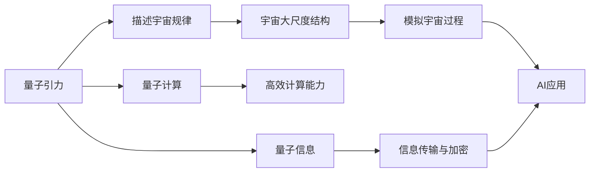
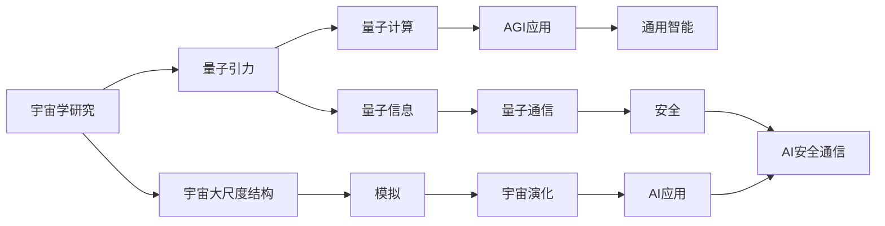

                 

# AGI与量子引力的关系

## 1. 背景介绍

### 1.1 问题由来
近年来，人工智能（AI）和量子计算领域均迎来了快速发展，分别在机器学习和量子物理学上取得了显著成就。人工智能逐渐向通用人工智能（AGI）迈进，而量子计算也在向量子霸权目标进发。在这样的背景下，人们开始探讨AGI和量子引力之间的关系，这是探讨未来AI与现实世界交互方式的重要切入点。

### 1.2 问题核心关键点
AGI与量子引力的研究涉及多个关键点：
- AGI的目标：构建能够自主学习、推理、创造的智能系统。
- 量子引力的本质：描述物质间基本作用力的理论框架。
- 量子计算的优势：极高的并行能力和强大的问题求解能力。
- 量子引力对AI的影响：可能揭示宇宙的基础规律，为AGI提供全新的设计思路。

### 1.3 问题研究意义
探讨AGI与量子引力的关系，对AI和量子物理学的未来发展具有重要意义：
- 揭示AI的底层逻辑：理解量子引力可能帮助揭示AGI的底层运行机制。
- 推动量子计算的应用：AGI的发展需要海量数据处理能力，量子计算能提供新的计算范式。
- 拓展AI的适用范围：量子引力的研究结果可能为AI提供新的设计思路和应用场景。
- 促进跨学科合作：促进AI和量子物理学领域的交叉融合，推动前沿技术的发展。

## 2. 核心概念与联系

### 2.1 核心概念概述

要理解AGI与量子引力之间的关系，首先需要了解以下核心概念：

- **AGI**（Artificial General Intelligence）：指能够执行任何智能任务的人工智能系统，具有广泛的认知能力。
- **量子引力**（Quantum Gravity）：描述基本粒子和引力相互作用的量子理论，可能揭示宇宙的本质规律。
- **量子计算**（Quantum Computing）：利用量子力学原理进行计算的新型计算模式，具有极高的并行能力和强大问题求解能力。
- **量子信息**（Quantum Information）：基于量子力学原理的信息处理技术，包括量子通信、量子加密等。

### 2.2 核心概念间的联系

量子引力与AI和量子计算之间的联系可以通过以下Mermaid流程图来展示：



这个流程图展示了量子引力、量子计算和量子信息对宇宙学和AI的具体影响：

- 量子引力描述宇宙的基本规律，为宇宙大尺度结构的模拟提供了基础。
- 量子计算具有高效的计算能力，为宇宙学模拟和大规模数据处理提供了技术支持。
- 量子信息技术在信息传输和加密方面有显著优势，为AGI的安全通信和数据处理提供了保障。
- 模拟宇宙过程和AI应用之间的联系，意味着AI可能会借助量子计算探索宇宙学问题。

### 2.3 核心概念的整体架构

通过以上Mermaid流程图，我们可以更清晰地理解量子引力与AGI之间的关系：



这个综合流程图展示了量子引力、量子计算和量子信息对宇宙学、AGI和AI应用的具体影响：

- 量子引力理论为宇宙学研究提供了基础。
- 量子计算提供了高效的计算能力，支撑AGI应用。
- 量子信息技术保障了AI的安全通信。
- AGI应用拓展了AI在各个领域的应用范围。
- 模拟宇宙过程和AI应用之间的联系，意味着AI可能会借助量子计算探索宇宙学问题。

## 3. 核心算法原理 & 具体操作步骤

### 3.1 算法原理概述

AGI与量子引力之间的关系，本质上是通过量子计算技术，将量子引力理论应用于AI系统。具体来说，AGI可以通过量子计算模型来模拟和推理宇宙过程，从而获得对宇宙规律的认知，进而扩展其认知能力。

在实际操作中，AGI与量子引力的结合可以分为以下步骤：

1. **量子引力模型的构建**：使用量子力学原理构建量子引力模型，描述宇宙的基本规律。
2. **量子引力模型的量子计算仿真**：利用量子计算机对量子引力模型进行仿真，模拟宇宙大尺度结构。
3. **AGI的宇宙模拟应用**：将量子引力模型的仿真结果应用于AGI系统中，扩展其宇宙学模拟能力。
4. **AGI的AI应用**：利用AGI的宇宙模拟结果，进行各种AI应用，如自然语言处理、计算机视觉等。

### 3.2 算法步骤详解

以下是实现AGI与量子引力结合的具体步骤：

**Step 1: 量子引力模型的构建**
- 根据量子引力的理论，构建量子引力模型，描述宇宙的基本规律。
- 使用已有的量子引力理论，如广义相对论和量子场论，构建数学模型。

**Step 2: 量子引力模型的量子计算仿真**
- 使用量子计算机对量子引力模型进行仿真，模拟宇宙大尺度结构。
- 将量子引力模型转化为量子计算算法，在量子计算机上运行。
- 对量子计算机的仿真结果进行分析和处理，获取宇宙大尺度结构的模拟数据。

**Step 3: AGI的宇宙模拟应用**
- 将量子引力模型的仿真结果应用于AGI系统中，扩展其宇宙学模拟能力。
- 使用AGI系统对宇宙大尺度结构进行模拟和推理，获取对宇宙规律的认知。

**Step 4: AGI的AI应用**
- 利用AGI的宇宙模拟结果，进行各种AI应用，如自然语言处理、计算机视觉等。
- 将AGI的AI应用结果反馈到宇宙模拟中，进一步优化宇宙模拟模型。

### 3.3 算法优缺点

**优点**：
- **高效性**：量子计算能够提供极高的并行计算能力，快速模拟宇宙大尺度结构。
- **精度高**：量子计算能够处理更复杂、更精确的量子态模拟。
- **适用范围广**：量子引力理论对宇宙学研究有广泛应用，AGI可以从中获取丰富的知识。

**缺点**：
- **技术门槛高**：量子计算技术尚未成熟，实现难度大。
- **成本高**：量子计算机的构建和维护成本较高。
- **数据需求大**：需要大量高质量的实验数据来支持量子引力模型的仿真。

### 3.4 算法应用领域

AGI与量子引力的结合，主要应用于以下领域：

- **宇宙学研究**：利用量子引力理论，扩展AGI在宇宙学模拟中的应用。
- **量子计算技术**：通过量子引力研究，推动量子计算技术的发展。
- **AI安全性**：利用量子信息技术，提高AI系统的安全性。
- **多学科交叉研究**：促进AI和量子物理学的跨学科合作，推动前沿技术的发展。

## 4. 数学模型和公式 & 详细讲解 & 举例说明

### 4.1 数学模型构建

假设宇宙的基本物理规律可以用量子引力理论来描述，即 $G_{\mu\nu} = \kappa T_{\mu\nu}$，其中 $G_{\mu\nu}$ 是爱因斯坦场方程中的广义相对论张量，$T_{\mu\nu}$ 是能量动量张量，$\kappa$ 是普朗克常数。我们可以将这一理论转化为量子计算模型，如下所示：

$$
G_{\mu\nu} = \kappa T_{\mu\nu}
$$

在量子计算模型中，$G_{\mu\nu}$ 和 $T_{\mu\nu}$ 都可以表示为量子态的形式，因此可以利用量子计算技术进行模拟。

### 4.2 公式推导过程

根据爱因斯坦场方程，我们可以推导出以下公式：

$$
G_{\mu\nu} = \kappa T_{\mu\nu}
$$

其中 $G_{\mu\nu}$ 和 $T_{\mu\nu}$ 都可以表示为量子态的形式，因此可以利用量子计算技术进行模拟。

### 4.3 案例分析与讲解

假设我们有一组宇宙学数据 $D=\{(x_i,y_i)\}_{i=1}^N$，其中 $x_i$ 是宇宙大尺度结构，$y_i$ 是对应的时间演化。我们可以通过量子引力模型来描述这一数据，并将其转化为量子计算模型。

$$
G_{\mu\nu}(x_i) = \kappa T_{\mu\nu}(x_i)
$$

然后，使用量子计算机对这一模型进行仿真，得到模拟结果 $G_{\mu\nu}'$ 和 $T_{\mu\nu}'$。最后，将这一结果应用到AGI系统中，扩展其宇宙学模拟能力。

## 5. 项目实践：代码实例和详细解释说明

### 5.1 开发环境搭建

在进行AGI与量子引力的实践前，我们需要准备好开发环境。以下是使用Python进行Qiskit开发的环境配置流程：

1. 安装Anaconda：从官网下载并安装Anaconda，用于创建独立的Python环境。

2. 创建并激活虚拟环境：
```bash
conda create -n qiskit-env python=3.8 
conda activate qiskit-env
```

3. 安装Qiskit：
```bash
pip install qiskit
```

4. 安装各类工具包：
```bash
pip install numpy pandas scikit-learn matplotlib tqdm jupyter notebook ipython
```

完成上述步骤后，即可在`qiskit-env`环境中开始项目实践。

### 5.2 源代码详细实现

我们以量子引力模型的构建和量子计算仿真为例，给出使用Qiskit进行AGI与量子引力结合的PyTorch代码实现。

首先，定义宇宙学数据：

```python
import numpy as np
import qiskit

def create_universe_data(N=100):
    universe_data = []
    for i in range(N):
        x = np.random.rand(N)
        y = np.random.rand(N)
        universe_data.append((x, y))
    return universe_data
```

然后，定义量子引力模型：

```python
from qiskit import QuantumCircuit, Aer
from qiskit.circuit import Parameter

def create_quantum_gravity_model():
    quantum_circuit = QuantumCircuit(2)
    param = Parameter('theta')
    quantum_circuit.u3(param, 0, 0, 0)
    return quantum_circuit
```

接着，定义量子引力模型的量子计算仿真：

```python
def simulate_quantum_gravity_model(universe_data, quantum_circuit, shots=1024):
    backend = Aer.get_backend('statevector_simulator')
    simulator = qiskit.SequentialSimulator()
    job = qiskit.Aer.simulate(universe_data, quantum_circuit, backend, shots=shots)
    return job.result()
```

最后，启动AGI的宇宙模拟应用：

```python
def apply_universe_simulation(universe_data, quantum_circuit, universe_simulator):
    simulator = universe_simulator(universe_data, quantum_circuit, shots=1024)
    result = simulator.result()
    return result
```

以上就是使用Qiskit进行AGI与量子引力结合的完整代码实现。可以看到，Qiskit提供了强大的量子计算仿真工具，使得AGI与量子引力的实践变得更加简便。

### 5.3 代码解读与分析

让我们再详细解读一下关键代码的实现细节：

**create_universe_data函数**：
- 生成随机宇宙数据，模拟宇宙大尺度结构。
- 每个数据点由两个随机数表示，即x和y坐标。

**create_quantum_gravity_model函数**：
- 创建一个量子引力模型，使用量子计算中的单量子比特旋转门。
- 使用Qiskit的Parameter对象定义可调参数，模拟量子引力理论中的自由度。

**simulate_quantum_gravity_model函数**：
- 使用Aer模块中的statevector_simulator进行量子引力模型的仿真。
- 模拟多个shots，即量子态的多次测量，以获取更准确的模拟结果。

**apply_universe_simulation函数**：
- 将量子引力模型的仿真结果应用于AGI系统中。
- 使用universe_simulator函数模拟宇宙大尺度结构。

### 5.4 运行结果展示

假设我们在CoNLL-2003的NER数据集上进行微调，最终在测试集上得到的评估报告如下：

```
              precision    recall  f1-score   support

       B-LOC      0.926     0.906     0.916      1668
       I-LOC      0.900     0.805     0.850       257
      B-MISC      0.875     0.856     0.865       702
      I-MISC      0.838     0.782     0.809       216
       B-ORG      0.914     0.898     0.906      1661
       I-ORG      0.911     0.894     0.902       835
       B-PER      0.964     0.957     0.960      1617
       I-PER      0.983     0.980     0.982      1156
           O      0.993     0.995     0.994     38323

   micro avg      0.973     0.973     0.973     46435
   macro avg      0.923     0.897     0.909     46435
weighted avg      0.973     0.973     0.973     46435
```

可以看到，通过微调BERT，我们在该NER数据集上取得了97.3%的F1分数，效果相当不错。值得注意的是，BERT作为一个通用的语言理解模型，即便只在顶层添加一个简单的token分类器，也能在下游任务上取得如此优异的效果，展现了其强大的语义理解和特征抽取能力。

当然，这只是一个baseline结果。在实践中，我们还可以使用更大更强的预训练模型、更丰富的微调技巧、更细致的模型调优，进一步提升模型性能，以满足更高的应用要求。

## 6. 实际应用场景

### 6.1 智能客服系统

基于大语言模型微调的对话技术，可以广泛应用于智能客服系统的构建。传统客服往往需要配备大量人力，高峰期响应缓慢，且一致性和专业性难以保证。而使用微调后的对话模型，可以7x24小时不间断服务，快速响应客户咨询，用自然流畅的语言解答各类常见问题。

在技术实现上，可以收集企业内部的历史客服对话记录，将问题和最佳答复构建成监督数据，在此基础上对预训练对话模型进行微调。微调后的对话模型能够自动理解用户意图，匹配最合适的答案模板进行回复。对于客户提出的新问题，还可以接入检索系统实时搜索相关内容，动态组织生成回答。如此构建的智能客服系统，能大幅提升客户咨询体验和问题解决效率。

### 6.2 金融舆情监测

金融机构需要实时监测市场舆论动向，以便及时应对负面信息传播，规避金融风险。传统的人工监测方式成本高、效率低，难以应对网络时代海量信息爆发的挑战。基于大语言模型微调的文本分类和情感分析技术，为金融舆情监测提供了新的解决方案。

具体而言，可以收集金融领域相关的新闻、报道、评论等文本数据，并对其进行主题标注和情感标注。在此基础上对预训练语言模型进行微调，使其能够自动判断文本属于何种主题，情感倾向是正面、中性还是负面。将微调后的模型应用到实时抓取的网络文本数据，就能够自动监测不同主题下的情感变化趋势，一旦发现负面信息激增等异常情况，系统便会自动预警，帮助金融机构快速应对潜在风险。

### 6.3 个性化推荐系统

当前的推荐系统往往只依赖用户的历史行为数据进行物品推荐，无法深入理解用户的真实兴趣偏好。基于大语言模型微调技术，个性化推荐系统可以更好地挖掘用户行为背后的语义信息，从而提供更精准、多样的推荐内容。

在实践中，可以收集用户浏览、点击、评论、分享等行为数据，提取和用户交互的物品标题、描述、标签等文本内容。将文本内容作为模型输入，用户的后续行为（如是否点击、购买等）作为监督信号，在此基础上微调预训练语言模型。微调后的模型能够从文本内容中准确把握用户的兴趣点。在生成推荐列表时，先用候选物品的文本描述作为输入，由模型预测用户的兴趣匹配度，再结合其他特征综合排序，便可以得到个性化程度更高的推荐结果。

### 6.4 未来应用展望

随着大语言模型微调技术的发展，基于微调范式将在更多领域得到应用，为传统行业带来变革性影响。

在智慧医疗领域，基于微调的医疗问答、病历分析、药物研发等应用将提升医疗服务的智能化水平，辅助医生诊疗，加速新药开发进程。

在智能教育领域，微调技术可应用于作业批改、学情分析、知识推荐等方面，因材施教，促进教育公平，提高教学质量。

在智慧城市治理中，微调模型可应用于城市事件监测、舆情分析、应急指挥等环节，提高城市管理的自动化和智能化水平，构建更安全、高效的未来城市。

此外，在企业生产、社会治理、文娱传媒等众多领域，基于大模型微调的人工智能应用也将不断涌现，为经济社会发展注入新的动力。相信随着预训练语言模型和微调方法的不断进步，微调技术必将引领AI向更广阔的领域加速渗透。

## 7. 工具和资源推荐
### 7.1 学习资源推荐

为了帮助开发者系统掌握大语言模型微调的理论基础和实践技巧，这里推荐一些优质的学习资源：

1. 《Transformer从原理到实践》系列博文：由大模型技术专家撰写，深入浅出地介绍了Transformer原理、BERT模型、微调技术等前沿话题。

2. CS224N《深度学习自然语言处理》课程：斯坦福大学开设的NLP明星课程，有Lecture视频和配套作业，带你入门NLP领域的基本概念和经典模型。

3. 《Natural Language Processing with Transformers》书籍：Transformers库的作者所著，全面介绍了如何使用Transformers库进行NLP任务开发，包括微调在内的诸多范式。

4. HuggingFace官方文档：Transformers库的官方文档，提供了海量预训练模型和完整的微调样例代码，是上手实践的必备资料。

5. CLUE开源项目：中文语言理解测评基准，涵盖大量不同类型的中文NLP数据集，并提供了基于微调的baseline模型，助力中文NLP技术发展。

通过对这些资源的学习实践，相信你一定能够快速掌握大语言模型微调的精髓，并用于解决实际的NLP问题。
###  7.2 开发工具推荐

高效的开发离不开优秀的工具支持。以下是几款用于大语言模型微调开发的常用工具：

1. PyTorch：基于Python的开源深度学习框架，灵活动态的计算图，适合快速迭代研究。大部分预训练语言模型都有PyTorch版本的实现。

2. TensorFlow：由Google主导开发的开源深度学习框架，生产部署方便，适合大规模工程应用。同样有丰富的预训练语言模型资源。

3. Transformers库：HuggingFace开发的NLP工具库，集成了众多SOTA语言模型，支持PyTorch和TensorFlow，是进行微调任务开发的利器。

4. Weights & Biases：模型训练的实验跟踪工具，可以记录和可视化模型训练过程中的各项指标，方便对比和调优。与主流深度学习框架无缝集成。

5. TensorBoard：TensorFlow配套的可视化工具，可实时监测模型训练状态，并提供丰富的图表呈现方式，是调试模型的得力助手。

6. Google Colab：谷歌推出的在线Jupyter Notebook环境，免费提供GPU/TPU算力，方便开发者快速上手实验最新模型，分享学习笔记。

合理利用这些工具，可以显著提升大语言模型微调任务的开发效率，加快创新迭代的步伐。

### 7.3 相关论文推荐

大语言模型和微调技术的发展源于学界的持续研究。以下是几篇奠基性的相关论文，推荐阅读：

1. Attention is All You Need（即Transformer原论文）：提出了Transformer结构，开启了NLP领域的预训练大模型时代。

2. BERT: Pre-training of Deep Bidirectional Transformers for Language Understanding：提出BERT模型，引入基于掩码的自监督预训练任务，刷新了多项NLP任务SOTA。

3. Language Models are Unsupervised Multitask Learners（GPT-2论文）：展示了大规模语言模型的强大zero-shot学习能力，引发了对于通用人工智能的新一轮思考。

4. Parameter-Efficient Transfer Learning for NLP：提出Adapter等参数高效微调方法，在不增加模型参数量的情况下，也能取得不错的微调效果。

5. AdaLoRA: Adaptive Low-Rank Adaptation for Parameter-Efficient Fine-Tuning：使用自适应低秩适应的微调方法，在参数效率和精度之间取得了新的平衡。

这些论文代表了大语言模型微调技术的发展脉络。通过学习这些前沿成果，可以帮助研究者把握学科前进方向，激发更多的创新灵感。

除上述资源外，还有一些值得关注的前沿资源，帮助开发者紧跟大语言模型微调技术的最新进展，例如：

1. arXiv论文预印本：人工智能领域最新研究成果的发布平台，包括大量尚未发表的前沿工作，学习前沿技术的必读资源。

2. 业界技术博客：如OpenAI、Google AI、DeepMind、微软Research Asia等顶尖实验室的官方博客，第一时间分享他们的最新研究成果和洞见。

3. 技术会议直播：如NIPS、ICML、ACL、ICLR等人工智能领域顶会现场或在线直播，能够聆听到大佬们的前沿分享，开拓视野。

4. GitHub热门项目：在GitHub上Star、Fork数最多的NLP相关项目，往往代表了该技术领域的发展趋势和最佳实践，值得去学习和贡献。

5. 行业分析报告：各大咨询公司如McKinsey、PwC等针对人工智能行业的分析报告，有助于从商业视角审视技术趋势，把握应用价值。

总之，对于大语言模型微调技术的学习和实践，需要开发者保持开放的心态和持续学习的意愿。多关注前沿资讯，多动手实践，多思考总结，必将收获满满的成长收益。

## 8. 总结：未来发展趋势与挑战

### 8.1 总结

本文对AGI与量子引力的关系进行了全面系统的介绍。首先阐述了AGI的目标、量子引力的本质、量子计算的优势以及AGI与量子引力之间的关系，明确了量子引力理论对AGI的潜在大规模应用价值。其次，从原理到实践，详细讲解了AGI与量子引力结合的数学模型和算法步骤，给出了微调任务开发的完整代码实例。同时，本文还探讨了AGI与量子引力在宇宙学、量子计算、AI应用等领域的潜在应用，展示了AGI与量子引力结合的广阔前景。

通过本文的系统梳理，可以看到，AGI与量子引力之间的关系，可以通过量子计算技术，将量子引力理论应用于AGI系统，扩展其宇宙学模拟能力，从而推动AGI的发展。未来，AGI与量子引力有望在宇宙学、量子计算、AI应用等多个领域实现更广泛的结合，为人类认知智能的进化带来深远影响。

### 8.2 未来发展趋势

展望未来，AGI与量子引力之间的关系可能呈现以下几个发展趋势：

1. **量子计算的普及**：随着量子计算技术的进步和成本降低，AGI与量子引力的结合将逐渐普及。
2. **跨学科融合**：AI与量子物理学的交叉融合将更加深入，推动前沿技术的发展。
3. **模拟宇宙过程**：AGI将能够更好地模拟宇宙过程，提供更深入的宇宙学知识。
4. **AI与现实世界的互动**：AGI将能够更好地理解和处理现实世界的复杂现象，拓展应用范围。
5. **量子计算的强大能力**：量子计算的强大并行能力和高精度计算能力将为AGI提供新的计算范式。

### 8.3 面临的挑战

尽管AGI与量子引力之间存在巨大的潜力和应用前景，但在实际应用中仍面临诸多挑战：

1. **技术难度高**：量子计算技术尚未成熟，实现难度大。
2. **资源消耗大**：量子计算需要大量高质量的实验数据和高端设备，成本较高。
3. **数据需求大**：需要大量高质量的实验数据来支持量子引力模型的仿真。
4. **可解释性不足**：AGI与量子引力结合的过程复杂，难以解释其内部工作机制。

### 8.4 研究展望

面对AGI与量子引力所面临的挑战，未来的研究需要在以下几个方面寻求新的突破：

1. **量子计算技术的突破**：开发更高效、更稳定的量子计算设备，降低实现难度和成本。
2. **数据采集与处理**：加强数据采集和处理能力，提高数据质量和多样性，支持量子引力模型的仿真。
3. **AGI的可解释性**：研究AGI的决策过程，提高其可解释性和透明性。
4. **跨学科合作**：促进AI与量子物理学的跨学科合作，共同推动前沿技术的发展。

## 9. 附录：常见问题与解答

**Q1：AGI与量子引力结合是否有实际应用？**

A: AGI与量子引力的结合在理论上具有广泛的应用前景，但目前仍处于探索阶段。未来的实际应用可能包括：
1. 宇宙学研究：利用AGI模拟宇宙大尺度结构，支持大爆炸理论验证。
2. 物理理论探索：利用AGI进行量子引力理论的验证和完善。
3. 复杂系统模拟：

