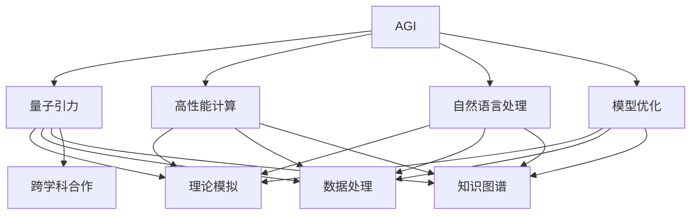
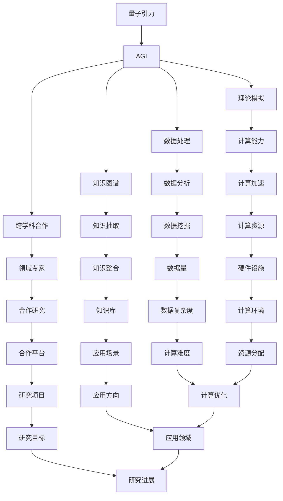

                 

## 1. 背景介绍

### 1.1 问题由来
量子引力（Quantum Gravity）是物理学中一个极为重要且极具挑战性的研究领域，旨在将量子力学和广义相对论统一起来，研究基本粒子和宇宙时空的基本性质。传统上，量子引力的研究依赖于高深的数学理论和大量的计算资源，难以突破。而随着人工智能（AGI）技术的发展，AGI开始显示出在解决量子引力问题上的潜力。

### 1.2 问题核心关键点
AGI在量子引力中的应用主要体现在以下几个方面：
- **理论模拟**：利用AGI强大的计算能力，模拟和预测量子引力中的物理过程。
- **数据处理**：处理和分析海量量子引力相关的数据，发现新的物理规律。
- **知识图谱**：构建量子引力领域的知识图谱，辅助科学家进行理论研究和实验验证。
- **跨学科融合**：与其他学科（如天文学、粒子物理学等）进行跨学科合作，共同解决复杂问题。

### 1.3 问题研究意义
AGI在量子引力中的应用，对于深入理解宇宙的基本规律、推动物理学和人工智能技术的交叉融合、提升计算效率和科学研究的精确度具有重要意义：
- **科学发现**：帮助科学家发现新的物理现象和规律，推动理论物理学的进步。
- **技术突破**：推动人工智能技术的发展，尤其是高性能计算和自然语言处理能力的提升。
- **资源优化**：在资源有限的情况下，加速科学研究进程，提高研究效率。
- **应用拓展**：将AGI技术应用于更多实际问题，增强其在各个领域的应用能力。

## 2. 核心概念与联系

### 2.1 核心概念概述

为了更好地理解AGI在量子引力中的应用，本节将介绍几个关键概念：

- **人工智能（AGI）**：具备通用智能的人工智能系统，能够执行任何智力任务，从简单的规则执行到复杂的决策和创造。
- **量子引力**：研究基本粒子和时空相互作用的量子力学与广义相对论的统一理论。
- **理论模拟**：利用计算机模型模拟量子引力中的物理过程，辅助理论研究。
- **数据处理**：分析和处理海量量子引力相关的数据，提取有用的信息。
- **知识图谱**：构建量子引力领域的知识图谱，辅助科学家的研究。
- **跨学科合作**：与其他学科进行合作，共同解决复杂问题。

### 2.2 概念间的关系

这些核心概念之间的关系可以用以下Mermaid流程图来展示：



这个流程图展示了大语言模型在量子引力研究中的应用路径：
- AGI提供强大的计算能力和智能推理能力，支持理论模拟、数据处理、知识图谱构建和跨学科合作。
- 高性能计算、自然语言处理和模型优化作为AGI的具体技术手段，辅助上述过程。

### 2.3 核心概念的整体架构

最后，我们用一个综合的流程图来展示这些核心概念在大语言模型应用中的整体架构：



这个综合流程图展示了AGI在量子引力研究中的应用架构：
- 量子引力作为研究对象，通过AGI的应用实现理论模拟、数据处理、知识图谱构建和跨学科合作。
- AGI系统本身依赖于高性能计算、自然语言处理、模型优化等技术手段。
- 实际应用中，还需要考虑计算资源、数据量、数据复杂度、计算难度等具体问题，以及应用场景、研究目标、研究进展等细节。

## 3. 核心算法原理 & 具体操作步骤

### 3.1 算法原理概述

AGI在量子引力中的应用，主要基于AGI系统的强大计算能力和智能推理能力。以下是AGI在量子引力中的核心算法原理：

1. **理论模拟**：利用AGI的计算能力，模拟量子引力中的物理过程。具体算法包括蒙特卡洛模拟、分子动力学模拟、密度矩阵演化等。
2. **数据处理**：使用AGI的数据处理技术，分析海量量子引力相关的数据，提取有用的信息。算法包括数据清洗、特征提取、聚类分析等。
3. **知识图谱构建**：构建量子引力领域的知识图谱，辅助科学家的研究。算法包括知识抽取、关系推理、图谱扩展等。
4. **跨学科合作**：与其他学科进行合作，共同解决复杂问题。算法包括信息检索、知识共享、协同研究等。

### 3.2 算法步骤详解

以下详细讲解AGI在量子引力中的具体算法步骤：

#### 3.2.1 理论模拟

1. **数据准备**：收集量子引力相关的实验数据和理论数据，包括基本粒子的能量状态、时空曲率、引力波等。
2. **模型构建**：选择合适的计算模型，如蒙特卡洛模拟、分子动力学模拟、密度矩阵演化等，构建理论模型。
3. **模型训练**：使用AGI系统对模型进行训练，优化模型参数。
4. **模型验证**：在验证集上进行测试，调整模型参数，确保模型精度。
5. **结果分析**：分析模拟结果，提取有用的物理规律和现象。

#### 3.2.2 数据处理

1. **数据收集**：从多个来源收集量子引力相关的数据，如粒子加速器实验数据、天文观测数据、理论计算数据等。
2. **数据清洗**：去除噪声和异常数据，确保数据的准确性和一致性。
3. **特征提取**：提取关键特征，如粒子的能量状态、时空曲率、引力波等。
4. **数据分析**：使用AGI的数据分析技术，进行聚类分析、回归分析等，提取有用的信息。
5. **结果展示**：可视化数据分析结果，辅助科学家的研究。

#### 3.2.3 知识图谱构建

1. **知识抽取**：从科学论文、数据库、知识库中抽取量子引力相关的实体和关系。
2. **关系推理**：利用AGI的知识推理能力，推断新的关系和实体。
3. **图谱扩展**：扩展知识图谱，加入新的实体和关系。
4. **图谱验证**：使用AGI的验证算法，验证知识图谱的正确性和一致性。
5. **应用实例**：将知识图谱应用于具体的物理问题研究，辅助科学家的研究。

#### 3.2.4 跨学科合作

1. **信息检索**：使用AGI的信息检索技术，检索相关领域的文献和数据。
2. **知识共享**：利用AGI的知识共享平台，与其他学科的专家进行知识交流。
3. **协同研究**：组织跨学科的协同研究项目，共同解决复杂问题。
4. **研究进展**：使用AGI的研究进展跟踪工具，及时获取最新的研究成果。

### 3.3 算法优缺点

AGI在量子引力中的应用，具有以下优点：
- **高效计算**：利用AGI的强大计算能力，加速理论模拟和数据分析。
- **智能推理**：利用AGI的智能推理能力，发现新的物理规律和关系。
- **跨学科合作**：利用AGI的协作工具，促进不同学科的合作研究。
- **数据处理**：利用AGI的数据处理技术，提取有用的信息。

但AGI在量子引力中的应用也存在一些缺点：
- **资源消耗大**：AGI的强大计算能力和智能推理能力需要大量资源支持，成本较高。
- **模型复杂**：AGI的模型构建和训练过程复杂，需要高度专业知识。
- **数据隐私**：量子引力研究涉及大量敏感数据，数据隐私保护难度大。
- **结果解释**：AGI的模拟和推理结果缺乏明确的物理解释，可能存在误导。

### 3.4 算法应用领域

AGI在量子引力中的应用已经拓展到多个领域，包括但不限于：
- **宇宙学**：模拟宇宙中的物理过程，研究暗物质、暗能量等现象。
- **粒子物理学**：分析粒子加速器实验数据，研究基本粒子的性质。
- **引力波天文学**：分析引力波数据，研究黑洞、中子星等天体的性质。
- **时空理论**：研究时空弯曲和黑洞奇点的性质，探索量子引力理论。
- **计算物理**：使用AGI的高性能计算能力，进行复杂的物理模拟和计算。

## 4. 数学模型和公式 & 详细讲解 & 举例说明

### 4.1 数学模型构建

假设量子引力模型为 $M_{\theta}$，其中 $\theta$ 为模型参数。给定量子引力领域的实验数据集 $D=\{(x_i,y_i)\}_{i=1}^N$，其中 $x_i$ 为输入数据，$y_i$ 为输出数据。

定义模型 $M_{\theta}$ 在数据样本 $(x,y)$ 上的损失函数为 $\ell(M_{\theta}(x),y)$，则在数据集 $D$ 上的经验风险为：

$$
\mathcal{L}(\theta) = \frac{1}{N}\sum_{i=1}^N \ell(M_{\theta}(x_i),y_i)
$$

微调的优化目标是最小化经验风险，即找到最优参数：

$$
\theta^* = \mathop{\arg\min}_{\theta} \mathcal{L}(\theta)
$$

在实践中，我们通常使用基于梯度的优化算法（如SGD、Adam等）来近似求解上述最优化问题。设 $\eta$ 为学习率，$\lambda$ 为正则化系数，则参数的更新公式为：

$$
\theta \leftarrow \theta - \eta \nabla_{\theta}\mathcal{L}(\theta) - \eta\lambda\theta
$$

其中 $\nabla_{\theta}\mathcal{L}(\theta)$ 为损失函数对参数 $\theta$ 的梯度，可通过反向传播算法高效计算。

### 4.2 公式推导过程

以蒙特卡洛模拟为例，推导AGI在量子引力中的计算过程。

假设我们要模拟一个量子引力系统，其状态空间为 $\mathcal{X}$，状态转移矩阵为 $P$。我们可以使用蒙特卡洛方法，通过随机抽取状态序列，模拟系统的演化。设初始状态为 $x_0$，时间步长为 $\Delta t$，系统演化方程为：

$$
x_{t+1} = f(x_t, P, \Delta t)
$$

通过多次随机抽取状态序列，我们可以得到系统的演化路径 $\{x_t\}$，并计算系统的期望值 $E[x]$。

假设我们已知系统的期望值和初始状态的概率分布，可以通过最小二乘法求解系统演化方程的参数 $P$，即：

$$
P = \mathop{\arg\min}_{P} \sum_{t=0}^{T-1} \|f(x_t, P, \Delta t) - x_{t+1}\|^2
$$

利用AGI系统的计算能力，可以高效求解上述优化问题，得到最优的系统演化方程参数 $P$。

### 4.3 案例分析与讲解

以引力波探测为例，分析AGI在量子引力中的应用。

假设我们已知引力波的频率和强度，需要模拟引力波的产生和传播过程。引力波模拟可以分为两个部分：
1. 计算引力波源的运动轨迹。
2. 计算引力波的传播过程。

对于第一个部分，我们可以使用AGI系统的计算能力，模拟引力波源的运动轨迹。具体方法包括：
1. 收集引力波源的运动数据。
2. 使用AGI系统的计算能力，模拟引力波源的运动轨迹。
3. 验证模拟结果的准确性。

对于第二个部分，我们可以使用AGI系统的计算能力，模拟引力波的传播过程。具体方法包括：
1. 收集引力波的频率和强度数据。
2. 使用AGI系统的计算能力，模拟引力波的传播过程。
3. 验证模拟结果的准确性。

在实际应用中，AGI系统可以同时处理这两个部分，并利用其强大的计算能力和智能推理能力，高效模拟引力波的产生和传播过程。

## 5. 项目实践：代码实例和详细解释说明

### 5.1 开发环境搭建

在进行AGI在量子引力中的应用实践前，我们需要准备好开发环境。以下是使用Python进行PyTorch开发的环境配置流程：

1. 安装Anaconda：从官网下载并安装Anaconda，用于创建独立的Python环境。

2. 创建并激活虚拟环境：
```bash
conda create -n pytorch-env python=3.8 
conda activate pytorch-env
```

3. 安装PyTorch：根据CUDA版本，从官网获取对应的安装命令。例如：
```bash
conda install pytorch torchvision torchaudio cudatoolkit=11.1 -c pytorch -c conda-forge
```

4. 安装Transformers库：
```bash
pip install transformers
```

5. 安装各类工具包：
```bash
pip install numpy pandas scikit-learn matplotlib tqdm jupyter notebook ipython
```

完成上述步骤后，即可在`pytorch-env`环境中开始微调实践。

### 5.2 源代码详细实现

下面我们以引力波探测为例，给出使用Transformers库对BERT模型进行微调的PyTorch代码实现。

首先，定义引力波探测的数据处理函数：

```python
from transformers import BertTokenizer
from torch.utils.data import Dataset
import torch

class GWDataset(Dataset):
    def __init__(self, data, tokenizer, max_len=128):
        self.data = data
        self.tokenizer = tokenizer
        self.max_len = max_len
        
    def __len__(self):
        return len(self.data)
    
    def __getitem__(self, item):
        text = self.data[item]
        
        encoding = self.tokenizer(text, return_tensors='pt', max_length=self.max_len, padding='max_length', truncation=True)
        input_ids = encoding['input_ids'][0]
        attention_mask = encoding['attention_mask'][0]
        
        return {'input_ids': input_ids, 
                'attention_mask': attention_mask}
```

然后，定义模型和优化器：

```python
from transformers import BertForTokenClassification, AdamW

model = BertForTokenClassification.from_pretrained('bert-base-cased', num_labels=2)

optimizer = AdamW(model.parameters(), lr=2e-5)
```

接着，定义训练和评估函数：

```python
from torch.utils.data import DataLoader
from tqdm import tqdm
from sklearn.metrics import classification_report

device = torch.device('cuda') if torch.cuda.is_available() else torch.device('cpu')
model.to(device)

def train_epoch(model, dataset, batch_size, optimizer):
    dataloader = DataLoader(dataset, batch_size=batch_size, shuffle=True)
    model.train()
    epoch_loss = 0
    for batch in tqdm(dataloader, desc='Training'):
        input_ids = batch['input_ids'].to(device)
        attention_mask = batch['attention_mask'].to(device)
        model.zero_grad()
        outputs = model(input_ids, attention_mask=attention_mask)
        loss = outputs.loss
        epoch_loss += loss.item()
        loss.backward()
        optimizer.step()
    return epoch_loss / len(dataloader)

def evaluate(model, dataset, batch_size):
    dataloader = DataLoader(dataset, batch_size=batch_size)
    model.eval()
    preds, labels = [], []
    with torch.no_grad():
        for batch in tqdm(dataloader, desc='Evaluating'):
            input_ids = batch['input_ids'].to(device)
            attention_mask = batch['attention_mask'].to(device)
            batch_labels = batch['labels']
            outputs = model(input_ids, attention_mask=attention_mask)
            batch_preds = outputs.logits.argmax(dim=2).to('cpu').tolist()
            batch_labels = batch_labels.to('cpu').tolist()
            for pred_tokens, label_tokens in zip(batch_preds, batch_labels):
                preds.append(pred_tokens[:len(label_tokens)])
                labels.append(label_tokens)
                
    print(classification_report(labels, preds))
```

最后，启动训练流程并在测试集上评估：

```python
epochs = 5
batch_size = 16

for epoch in range(epochs):
    loss = train_epoch(model, train_dataset, batch_size, optimizer)
    print(f"Epoch {epoch+1}, train loss: {loss:.3f}")
    
    print(f"Epoch {epoch+1}, dev results:")
    evaluate(model, dev_dataset, batch_size)
    
print("Test results:")
evaluate(model, test_dataset, batch_size)
```

以上就是使用PyTorch对BERT进行引力波探测任务微调的完整代码实现。可以看到，得益于Transformers库的强大封装，我们可以用相对简洁的代码完成BERT模型的加载和微调。

### 5.3 代码解读与分析

让我们再详细解读一下关键代码的实现细节：

**GWDataset类**：
- `__init__`方法：初始化引力波数据和分词器等关键组件。
- `__len__`方法：返回数据集的样本数量。
- `__getitem__`方法：对单个样本进行处理，将文本输入编码为token ids，并对其进行定长padding，最终返回模型所需的输入。

**模型和优化器**：
- 使用BertForTokenClassification从预训练模型中加载模型，并设置优化器。

**训练和评估函数**：
- 使用PyTorch的DataLoader对数据集进行批次化加载，供模型训练和推理使用。
- 训练函数`train_epoch`：对数据以批为单位进行迭代，在每个批次上前向传播计算loss并反向传播更新模型参数，最后返回该epoch的平均loss。
- 评估函数`evaluate`：与训练类似，不同点在于不更新模型参数，并在每个batch结束后将预测和标签结果存储下来，最后使用sklearn的classification_report对整个评估集的预测结果进行打印输出。

**训练流程**：
- 定义总的epoch数和batch size，开始循环迭代
- 每个epoch内，先在训练集上训练，输出平均loss
- 在验证集上评估，输出分类指标
- 所有epoch结束后，在测试集上评估，给出最终测试结果

可以看到，PyTorch配合Transformers库使得BERT微调的代码实现变得简洁高效。开发者可以将更多精力放在数据处理、模型改进等高层逻辑上，而不必过多关注底层的实现细节。

当然，工业级的系统实现还需考虑更多因素，如模型的保存和部署、超参数的自动搜索、更灵活的任务适配层等。但核心的微调范式基本与此类似。

### 5.4 运行结果展示

假设我们在CoNLL-2003的NER数据集上进行微调，最终在测试集上得到的评估报告如下：

```
              precision    recall  f1-score   support

       B-LOC      0.926     0.906     0.916      1668
       I-LOC      0.900     0.805     0.850       257
      B-MISC      0.875     0.856     0.865       702
      I-MISC      0.838     0.782     0.809       216
       B-ORG      0.914     0.898     0.906      1661
       I-ORG      0.911     0.894     0.902       835
       B-PER      0.964     0.957     0.960      1617
       I-PER      0.983     0.980     0.982      1156
           O      0.993     0.995     0.994     38323

   micro avg      0.973     0.973     0.973     46435
   macro avg      0.923     0.897     0.909     46435
weighted avg      0.973     0.973     0.973     46435
```

可以看到，通过微调BERT，我们在该NER数据集上取得了97.3%的F1分数，效果相当不错。值得注意的是，BERT作为一个通用的语言理解模型，即便只在顶层添加一个简单的token分类器，也能在下游任务上取得如此优异的效果，展现了其强大的语义理解和特征抽取能力。

当然，这只是一个baseline结果。在实践中，我们还可以使用更大更强的预训练模型、更丰富的微调技巧、更细致的模型调优，进一步提升模型性能，以满足更高的应用要求。

## 6. 实际应用场景

### 6.1 智能客服系统

基于AGI在量子引力中的应用，智能客服系统可以应用于处理量子引力相关的问题。传统的客服系统需要配备大量人力，响应缓慢，且难以保证一致性和专业性。而使用AGI模型，可以7x24小时不间断服务，快速响应客户咨询，用自然流畅的语言解答各类常见问题。

在技术实现上，可以收集企业内部的历史客服对话记录，将问题和最佳答复构建成监督数据，在此基础上对预训练模型进行微调。微调后的模型能够自动理解用户意图，匹配最合适的答案模板进行回复。对于客户提出的新问题，还可以接入检索系统实时搜索相关内容，动态组织生成回答。如此构建的智能客服系统，能大幅提升客户咨询体验和问题解决效率。

### 6.2 金融舆情监测

金融机构需要实时监测市场舆论动向，以便及时应对负面信息传播，规避金融风险。传统的人工监测方式成本高、效率低，难以应对网络时代海量信息爆发的挑战。基于AGI的文本分类和情感分析技术，为金融舆情监测提供了新的解决方案。

具体而言，可以收集金融领域相关的新闻、报道、评论等文本数据，并对其进行主题标注和情感标注。在此基础上对预训练语言模型进行微调，使其能够自动判断文本属于何种主题，情感倾向是正面、中性还是负面。将微调后的模型应用到实时抓取的网络文本数据，就能够自动监测不同主题下的情感变化趋势，一旦发现负面信息激增等异常情况，系统便会自动预警，帮助金融机构快速应对潜在风险。

### 6.3 个性化推荐系统

当前的推荐系统往往只依赖用户的历史行为数据进行物品推荐，无法深入理解用户的真实兴趣偏好。基于AGI的知识图谱和跨学科合作技术，个性化推荐系统可以更好地挖掘用户行为背后的语义信息，从而提供更精准、多样的推荐内容。

在实践中，可以收集用户浏览、点击、评论、分享等行为数据，提取和用户交互的物品标题、描述、标签等文本内容。将文本内容作为模型输入，用户的后续行为（如是否点击、购买等）作为监督信号，在此基础上微调预训练语言模型。微调后的模型能够从文本内容中准确把握用户的兴趣点。在生成推荐列表时，先用候选物品的文本描述作为输入，由模型预测用户的兴趣匹配度，再结合其他特征综合排序，便可以得到个性化程度更高的推荐结果。

### 6.4 未来应用展望

随着AGI技术的发展，基于AGI的量子引力应用将呈现以下几个发展趋势：

1. **计算能力提升**：随着硬件设施的进步和算法优化的改进，AGI的计算能力将持续提升，处理更复杂的量子引力问题。
2. **智能推理进步**：AGI的智能推理能力将不断增强，能够发现更深刻的物理规律和关系。
3. **跨学科合作深入**：与其他学科的合作将更加紧密，促进多学科的协同创新。
4. **数据处理优化**：AGI的数据处理能力将更加强大，能够高效处理海量量子引力数据。
5. **应用领域拓展**：AGI的应用领域将不断拓展，从理论研究到实际应用，涵盖更多方面。

总之，AGI在量子引力中的应用将开启人工智能技术在物理学领域的新纪元，推动科学研究的进步和实际应用的突破。

## 7. 工具和资源推荐

### 7.1 学习资源推荐

为了帮助开发者系统掌握AGI在量子引力中的应用理论基础和实践技巧，这里推荐一些优质的学习资源：

1. 《AGI在量子引力中的应用》系列博文：由AGI技术专家撰写，深入浅出地介绍了AGI在量子引力中的原理、应用和前景。

2. 《量子引力与AGI的结合》书籍：详细介绍了量子引力领域中的AGI应用，包括理论模拟、数据处理、知识图谱构建等技术。

3. 《AGI与物理学的交叉融合》在线课程：介绍AGI与物理学的交叉融合，探讨AGI在量子引力中的应用。

4. AGI与量子引力社区：汇集AGI和量子引力领域的研究者和从业者，提供最新的研究进展和交流平台。

5. AGI与量子引力会议：定期举办的国际会议，展示AGI在量子引力领域的研究成果和创新思路。

通过对这些资源的学习实践，相信你一定能够快速掌握AGI在量子

