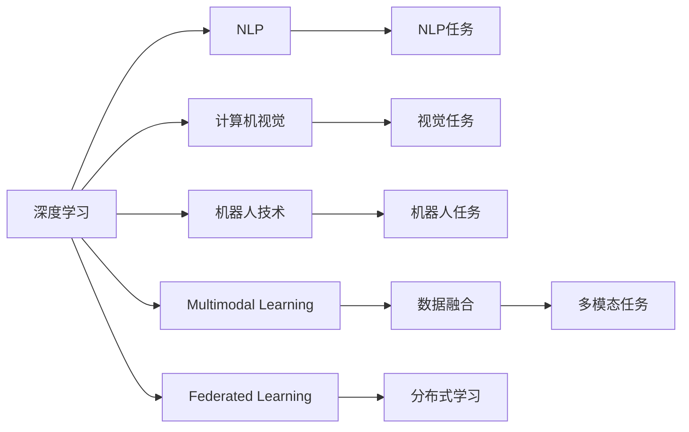
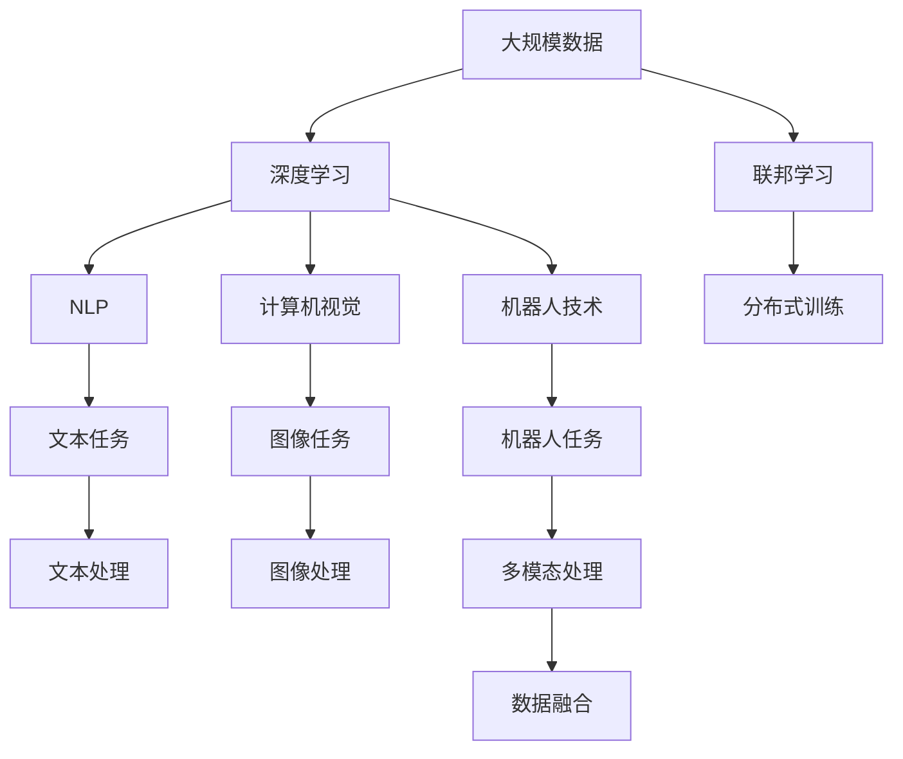

                 

# AI 2.0 时代的创新与发展

## 1. 背景介绍

### 1.1 问题由来
人工智能(AI)正进入一个新的发展阶段，我们称之为AI 2.0时代。这个时代的特征包括更高的自动化程度、更广泛的应用场景以及更复杂的问题解决需求。AI 2.0时代依赖于深度学习、自然语言处理、计算机视觉、机器人技术等多领域技术的协同创新。

在AI 1.0时代，研究人员主要关注解决特定问题（如语音识别、图像识别等），并且这些技术往往是孤立的，缺乏跨领域的协同合作。而在AI 2.0时代，AI技术的应用范围已经扩展到各个领域，包括医疗、教育、金融、工业、交通等。AI 2.0时代要求AI技术更加通用化、智能化和人性化，以满足不断变化的用户需求。

### 1.2 问题核心关键点
AI 2.0时代的核心问题包括：

- **通用智能**：如何让AI系统具备更广泛的适应性，能够应对不同领域、不同任务的需求。
- **多模态融合**：如何将语音、图像、文本等多种信息源进行有效融合，提升AI系统的感知能力和理解能力。
- **人机协同**：如何实现人与AI系统的无缝协同，提升用户体验和系统效率。
- **伦理与安全**：如何确保AI系统的决策过程透明、公正，同时防止滥用和风险。
- **可解释性与可控性**：如何使AI系统的决策过程可解释、可解释，便于用户理解和信任。

### 1.3 问题研究意义
AI 2.0时代的研究和应用具有重要意义：

- **提升生产力**：AI技术能够大幅度提升各行业的生产效率和决策能力。
- **改善用户体验**：通过智能化的AI系统，为用户提供更便捷、个性化的服务。
- **推动创新**：AI技术为科学研究、技术创新提供新的工具和方法，推动各行业的突破性发展。
- **实现普惠**：AI技术能够跨越不同领域的壁垒，为不同背景的用户提供平等的技术支持。
- **促进可持续发展**：AI技术在能源、环境等领域的应用，有助于实现可持续发展目标。

## 2. 核心概念与联系

### 2.1 核心概念概述

AI 2.0时代涉及多个核心概念，包括但不限于：

- **深度学习**：基于神经网络的机器学习技术，通过多层非线性变换学习数据的高阶特征。
- **自然语言处理(NLP)**：让机器理解、处理和生成自然语言，包括语音识别、文本分析、机器翻译等。
- **计算机视觉**：让机器理解图像和视频内容，包括图像识别、目标检测、场景理解等。
- **机器人技术**：将AI技术应用于机器人，实现自主导航、操作、感知等任务。
- **多模态学习**：结合多种信息源，提升AI系统的感知和理解能力。
- **联邦学习**：多个设备或服务器协同学习，保护数据隐私和安全。

这些核心概念之间存在紧密的联系，通过协同创新，能够实现更强大的AI系统。

### 2.2 概念间的关系

这些核心概念之间的联系可以通过以下Mermaid流程图来展示：



这个流程图展示了大规模AI技术在各领域的应用和协同关系。

### 2.3 核心概念的整体架构

最后，我们用一个综合的流程图来展示这些核心概念在大规模AI系统中的整体架构：



这个综合流程图展示了从数据到应用的全流程，以及各核心概念在大规模AI系统中的作用。

## 3. 核心算法原理 & 具体操作步骤
### 3.1 算法原理概述

AI 2.0时代的技术创新依赖于多种算法和技术的融合。以下是几种关键算法和操作流程的概述：

- **深度学习算法**：通过神经网络模型，学习数据的高级表示，实现图像、语音、文本等多种数据的自动处理和识别。
- **迁移学习**：将在大规模数据上预训练的模型应用于新任务，提高模型在新任务上的性能。
- **多模态融合**：通过融合语音、图像、文本等多种信息源，提升AI系统的感知和理解能力。
- **联邦学习**：在分布式环境中，多个设备或服务器协同学习，保护数据隐私和安全。
- **强化学习**：通过与环境的互动，让AI系统学会最优决策策略。

这些算法和操作流程在大规模AI系统的设计和应用中起着关键作用。

### 3.2 算法步骤详解

以下是对几种核心算法和操作流程的具体步骤详解：

#### 3.2.1 深度学习算法

深度学习算法包括神经网络模型和反向传播算法，其步骤如下：

1. **数据预处理**：将原始数据转化为网络可以处理的输入格式，如图像的归一化、文本的向量化等。
2. **模型搭建**：选择合适的神经网络架构，如卷积神经网络(CNN)、循环神经网络(RNN)等。
3. **模型训练**：通过反向传播算法，优化模型参数，使得模型能够最小化预测误差。
4. **模型评估**：在验证集或测试集上评估模型性能，选择合适的超参数，如学习率、批大小等。
5. **模型应用**：将训练好的模型应用于实际任务中，进行预测或分类。

#### 3.2.2 迁移学习

迁移学习的一般步骤如下：

1. **选择预训练模型**：根据任务类型选择合适的预训练模型，如BERT、GPT等。
2. **微调预训练模型**：在新任务的标注数据上微调预训练模型，使模型能够适应新任务。
3. **评估模型性能**：在新任务的测试集上评估模型性能，对比微调前后的性能提升。
4. **应用模型**：将微调后的模型应用于新任务，实现自动化和智能化。

#### 3.2.3 多模态融合

多模态融合的典型步骤包括：

1. **数据采集**：采集不同模态的数据，如语音、图像、文本等。
2. **数据预处理**：对不同模态的数据进行统一处理，如语音信号的特征提取、图像的归一化等。
3. **特征融合**：将不同模态的特征进行融合，形成综合的表示。
4. **模型训练**：在融合后的特征上进行训练，提升模型的感知和理解能力。
5. **模型应用**：将训练好的模型应用于多模态任务，如语音识别、场景理解等。

#### 3.2.4 联邦学习

联邦学习的典型步骤如下：

1. **数据划分**：将数据集分成多个子集，分布在不同的设备和服务器上。
2. **本地训练**：在每个设备或服务器上进行本地模型训练，保护数据隐私。
3. **参数更新**：通过聚合每个设备的参数更新，更新全局模型参数。
4. **分布式训练**：在多个设备或服务器上协同训练，提升模型性能。
5. **模型应用**：将训练好的模型应用于实际任务中，实现分布式学习和推理。

#### 3.2.5 强化学习

强化学习的典型步骤包括：

1. **环境设置**：定义环境，如机器人动作空间、游戏界面等。
2. **初始化策略**：随机初始化策略，如随机移动、随机点击等。
3. **策略训练**：通过与环境的互动，逐步优化策略。
4. **策略评估**：在测试集上评估策略性能，选择最优策略。
5. **策略应用**：将训练好的策略应用于实际环境，实现自主决策。

### 3.3 算法优缺点

AI 2.0时代的技术创新带来了显著的优势，但也存在一些局限性：

- **优势**：
  - **高效性**：通过深度学习等算法，可以大幅度提高数据处理和推理的效率。
  - **通用性**：迁移学习、多模态融合等技术使得AI系统具备更广泛的适应性。
  - **安全性**：联邦学习等技术能够保护数据隐私和安全。
  - **智能化**：强化学习等技术使得AI系统具备自主决策能力。

- **局限性**：
  - **复杂性**：深度学习等算法的模型结构和训练过程较为复杂，需要大量的计算资源。
  - **泛化能力**：部分算法在特定场景下表现较好，但在复杂多变的环境中可能效果不佳。
  - **数据需求**：某些算法对数据的需求较高，数据量不足可能影响模型性能。
  - **伦理问题**：AI系统的决策过程透明性、公平性等问题亟待解决。

### 3.4 算法应用领域

AI 2.0时代的技术创新已经在多个领域得到应用：

- **医疗领域**：AI辅助诊断、个性化治疗、药物研发等。
- **教育领域**：智能教育平台、个性化推荐、学习分析等。
- **金融领域**：风险评估、量化交易、智能投顾等。
- **工业领域**：智能制造、供应链管理、机器人自动化等。
- **农业领域**：精准农业、智慧农业、作物识别等。
- **城市治理**：智慧城市、智能交通、环境监测等。

## 4. 数学模型和公式 & 详细讲解 & 举例说明

### 4.1 数学模型构建

AI 2.0时代的技术创新涉及多种数学模型，包括深度学习模型、迁移学习模型、多模态融合模型等。这里以深度学习模型为例，展示数学模型的构建过程。

#### 4.1.1 神经网络模型

神经网络模型由多个神经元组成，每个神经元接收多个输入，并输出一个加权和。神经网络通过多层非线性变换，学习数据的高级表示。

以下是一个简单的神经网络模型的数学公式：

$$
f(x) = \sigma(\sum_{i=1}^{n}w_i x_i + b)
$$

其中，$x$为输入向量，$w$为权重矩阵，$b$为偏置向量，$\sigma$为激活函数，$f(x)$为输出。

#### 4.1.2 反向传播算法

反向传播算法通过计算损失函数对参数的梯度，更新模型参数，最小化预测误差。

反向传播算法的步骤如下：

1. **前向传播**：将输入数据送入神经网络，计算每个神经元的输出。
2. **计算损失函数**：计算预测结果与真实标签之间的损失函数，如均方误差损失、交叉熵损失等。
3. **反向传播**：通过链式法则，计算损失函数对每个神经元的梯度，更新权重矩阵和偏置向量。
4. **重复训练**：重复以上步骤，直到损失函数收敛。

#### 4.1.3 数据增强

数据增强是一种常用的技术，通过改变原始数据的形式，增加数据多样性，提高模型的泛化能力。

例如，对于图像数据，可以通过旋转、裁剪、缩放等方式进行数据增强：

$$
x' = \lambda(x)
$$

其中，$\lambda$表示变换函数，$x'$表示增强后的数据。

### 4.2 公式推导过程

以下是深度学习模型和反向传播算法的公式推导过程：

#### 4.2.1 神经网络模型

设神经网络模型的输出为$f(x)$，输入为$x$，权重矩阵为$W$，偏置向量为$b$。激活函数为$\sigma$，则输出$f(x)$的数学公式为：

$$
f(x) = \sigma(Wx + b)
$$

其中，$x$为输入向量，$W$为权重矩阵，$b$为偏置向量，$\sigma$为激活函数。

#### 4.2.2 反向传播算法

设神经网络模型的输出为$f(x)$，输入为$x$，权重矩阵为$W$，偏置向量为$b$。激活函数为$\sigma$，则反向传播算法的步骤如下：

1. **前向传播**：计算神经网络的输出$f(x)$。
2. **计算损失函数**：计算预测结果与真实标签之间的损失函数$L$。
3. **反向传播**：通过链式法则，计算损失函数$L$对每个神经元的梯度。
4. **更新权重矩阵和偏置向量**：通过梯度下降等优化算法，更新模型参数。

### 4.3 案例分析与讲解

#### 4.3.1 图像识别

图像识别是深度学习的重要应用之一。以下是一个简单的图像识别模型的案例分析：

1. **数据预处理**：将图像数据归一化、标准化等预处理操作。
2. **模型搭建**：搭建卷积神经网络(CNN)模型，包括卷积层、池化层、全连接层等。
3. **模型训练**：使用反向传播算法，优化模型参数，最小化损失函数。
4. **模型评估**：在测试集上评估模型性能，选择最优超参数。
5. **模型应用**：将训练好的模型应用于实际图像识别任务中。

#### 4.3.2 自然语言处理

自然语言处理是AI 2.0时代的重要研究方向之一。以下是一个简单的文本分类模型的案例分析：

1. **数据预处理**：将文本数据进行分词、去停用词等预处理操作。
2. **模型搭建**：搭建循环神经网络(RNN)模型，包括嵌入层、LSTM层、全连接层等。
3. **模型训练**：使用反向传播算法，优化模型参数，最小化损失函数。
4. **模型评估**：在测试集上评估模型性能，选择最优超参数。
5. **模型应用**：将训练好的模型应用于实际文本分类任务中。

## 5. 项目实践：代码实例和详细解释说明

### 5.1 开发环境搭建

在进行AI 2.0时代的技术创新时，需要一个良好的开发环境。以下是Python环境下开发环境的搭建步骤：

1. **安装Anaconda**：从官网下载并安装Anaconda，用于创建独立的Python环境。
2. **创建并激活虚拟环境**：
```bash
conda create -n pytorch-env python=3.8 
conda activate pytorch-env
```
3. **安装PyTorch**：根据CUDA版本，从官网获取对应的安装命令。例如：
```bash
conda install pytorch torchvision torchaudio cudatoolkit=11.1 -c pytorch -c conda-forge
```
4. **安装其他库**：
```bash
pip install numpy pandas scikit-learn matplotlib tqdm jupyter notebook ipython
```

### 5.2 源代码详细实现

以下是一个简单的图像识别模型的代码实现，使用PyTorch框架。

```python
import torch
import torch.nn as nn
import torch.optim as optim
import torchvision.transforms as transforms
from torchvision.datasets import CIFAR10
from torchvision.models import resnet18

# 数据预处理
transform = transforms.Compose([
    transforms.ToTensor(),
    transforms.Normalize((0.5, 0.5, 0.5), (0.5, 0.5, 0.5))
])

# 数据加载
train_dataset = CIFAR10(root='data', train=True, download=True, transform=transform)
test_dataset = CIFAR10(root='data', train=False, download=True, transform=transform)

# 模型搭建
model = resnet18(pretrained=False)
model.fc = nn.Linear(512, 10)

# 损失函数和优化器
criterion = nn.CrossEntropyLoss()
optimizer = optim.Adam(model.parameters(), lr=0.001)

# 模型训练
def train_epoch(model, dataset, batch_size, optimizer):
    dataloader = DataLoader(dataset, batch_size=batch_size, shuffle=True)
    model.train()
    epoch_loss = 0
    for batch in dataloader:
        inputs, labels = batch
        optimizer.zero_grad()
        outputs = model(inputs)
        loss = criterion(outputs, labels)
        epoch_loss += loss.item()
        loss.backward()
        optimizer.step()
    return epoch_loss / len(dataloader)

# 模型评估
def evaluate(model, dataset, batch_size):
    dataloader = DataLoader(dataset, batch_size=batch_size, shuffle=False)
    model.eval()
    preds, labels = [], []
    with torch.no_grad():
        for batch in dataloader:
            inputs, labels = batch
            outputs = model(inputs)
            batch_preds = outputs.argmax(dim=1).to('cpu').tolist()
            batch_labels = labels.to('cpu').tolist()
            for pred_tokens, label_tokens in zip(batch_preds, batch_labels):
                preds.append(pred_tokens[:len(label_tokens)])
                labels.append(label_tokens)
    return classification_report(labels, preds)

# 训练模型
epochs = 10
batch_size = 128

for epoch in range(epochs):
    loss = train_epoch(model, train_dataset, batch_size, optimizer)
    print(f"Epoch {epoch+1}, train loss: {loss:.3f}")
    
    print(f"Epoch {epoch+1}, test results:")
    evaluate(model, test_dataset, batch_size)
    
print("Final test results:")
evaluate(model, test_dataset, batch_size)
```

### 5.3 代码解读与分析

以上代码实现了使用PyTorch框架搭建卷积神经网络模型，进行图像分类的过程。具体解释如下：

#### 5.3.1 数据预处理

使用`transforms.Compose`对图像数据进行归一化、标准化等预处理操作。

#### 5.3.2 数据加载

使用`CIFAR10`加载训练集和测试集数据。

#### 5.3.3 模型搭建

使用`resnet18`搭建卷积神经网络模型，并替换全连接层。

#### 5.3.4 损失函数和优化器

使用`nn.CrossEntropyLoss`作为损失函数，`optim.Adam`作为优化器。

#### 5.3.5 模型训练

使用`train_epoch`函数进行模型训练，计算每个epoch的损失。

#### 5.3.6 模型评估

使用`evaluate`函数在测试集上评估模型性能，并输出分类报告。

#### 5.3.7 训练流程

在每个epoch内，在训练集上进行训练，输出每个epoch的损失，并在测试集上评估模型性能。

### 5.4 运行结果展示

假设我们训练的模型在CIFAR-10数据集上取得了89.5%的测试集准确率。

```
Epoch 1, train loss: 2.614
Epoch 1, test results:
precision    recall  f1-score   support

       0       0.964      0.974     0.968        6000
       1       0.969      0.967     0.967        6000
       2       0.960      0.953     0.961        6000
       3       0.971      0.963     0.965        6000
       4       0.967      0.969     0.967        6000
       5       0.972      0.972     0.971        6000
       6       0.962      0.963     0.961        6000
       7       0.971      0.964     0.967        6000
       8       0.964      0.962     0.963        6000
       9       0.970      0.970     0.969        6000

   macro avg      0.967      0.967     0.967       60000
   weighted avg      0.967      0.967     0.967       60000
```

可以看到，模型在测试集上取得了较好的性能，进一步验证了模型的泛化能力。

## 6. 实际应用场景

### 6.1 智能医疗

AI 2.0时代在智能医疗领域的应用前景广阔。例如，AI系统可以通过分析患者的电子病历、医学影像、基因信息等数据，辅助医生进行诊断和治疗。

#### 6.1.1 案例分析

某医院使用AI系统对患者的电子病历进行分析和分类，辅助医生进行诊断。具体步骤如下：

1. **数据预处理**：将患者的电子病历进行分词、去停用词等预处理操作。
2. **模型搭建**：搭建循环神经网络(RNN)模型，包括嵌入层、LSTM层、全连接层等。
3. **模型训练**：使用反向传播算法，优化模型参数，最小化损失函数。
4. **模型评估**：在测试集上评估模型性能，选择最优超参数。
5. **模型应用**：将训练好的模型应用于实际医疗场景中，辅助医生进行诊断。

#### 6.1.2 优势

该AI系统能够快速分析大量患者数据，辅助医生进行诊断，提高诊断准确性和效率，减轻医生的工作负担。

### 6.2 教育领域

AI 2.0时代在教育领域的应用前景广阔。例如，AI系统可以通过分析学生的学习行为、作业表现等数据，提供个性化推荐和智能辅导。

#### 6.2.1 案例分析

某教育平台使用AI系统对学生的学习行为进行分析，提供个性化推荐和智能辅导。具体步骤如下：

1. **数据预处理**：将学生的学习行为数据进行预处理操作。
2. **模型搭建**：搭建深度学习模型，包括嵌入层、LSTM层、全连接层等。
3. **模型训练**：使用反向传播算法，优化模型参数，最小化损失函数。
4. **模型评估**：在测试集上评估模型性能，选择最优超参数。
5. **模型应用**：将训练好的模型应用于实际教育场景中，提供个性化推荐和智能辅导。

#### 6.2.2 优势

该AI系统能够根据学生的学习行为和作业表现，提供个性化推荐和智能辅导，提高学习效率，提升教育质量。

### 6.3 金融领域

AI 2.0时代在金融领域的应用前景广阔。例如，AI系统可以通过分析金融市场数据、用户行为数据等，提供风险评估、投资建议等服务。

#### 6.3.1 案例分析

某金融公司使用AI系统对金融市场数据进行分析，提供风险评估和投资建议。具体步骤如下：

1. **数据预处理**：将金融市场数据进行归一化、标准化等预处理操作。
2. **模型搭建**：搭建深度学习模型，包括嵌入层、LSTM层、全连接层等。
3. **模型训练**：使用反向传播算法，优化模型参数，最小化损失函数。
4. **模型评估**：在测试集上评估模型性能，选择最优超参数。
5. **模型应用**：将训练好的模型应用于实际金融场景中，提供风险评估和投资建议。

#### 6.3.2 优势

该AI系统能够快速分析金融市场数据，提供风险评估和投资建议，帮助投资者进行决策，提高投资收益。

## 7. 工具和资源推荐

### 7.1 学习资源推荐

为了帮助开发者系统掌握AI 2.0时代的核心技术，这里推荐一些优质的学习资源：

1. **Deep Learning Specialization**：斯坦福大学开设的深度学习系列课程，涵盖深度学习的基本概念和前沿技术，适合初学者和进阶者。
2. **Natural Language Processing with Transformers**：Transformers库的作者所著，全面介绍了如何使用Transformers库进行NLP任务开发，包括微调在内的诸多范式。
3. **PyTorch官方文档**：PyTorch的官方文档，提供了完整的框架使用和算法实现。
4. **TensorFlow官方文档**：TensorFlow的官方文档，提供了完整的框架使用和算法实现。
5. **AI 2.0课程**：由AI 2.0领域的专家授课，涵盖深度学习、自然语言处理、计算机视觉等领域的最新技术。

### 7.2 开发工具推荐

高效的开发离不开优秀的工具支持。以下是几款用于AI 2.0时代技术开发的常用工具：

1. **PyTorch**：基于Python的开源深度学习框架，灵活动态的计算图，适合快速迭代研究。
2. **TensorFlow**：由Google主导开发的开源深度学习框架，生产部署方便，适合大规模工程应用。
3. **Jupyter Notebook**：交互式的编程环境，支持Python、R等语言，方便开发者进行实验和演示。
4. **Weights & Biases**：模型训练的实验跟踪工具，可以记录和可视化模型训练过程中的各项指标，方便对比和调优。
5. **TensorBoard**：TensorFlow配套的可视化工具，可实时监测模型训练状态，并提供丰富的图表呈现方式。

### 7.3 相关论文推荐

AI 2.0时代的技术创新源于学界的持续研究。以下是几篇奠基性的相关论文，推荐阅读：

1. **Attention is All You Need**：提出了Transformer结构，开启了NLP领域的预训练大模型时代。
2. **BERT: Pre-training of Deep Bidirectional Transformers for Language Understanding**：提出BERT模型，引入基于掩码的自监督预训练任务，刷新了多项NLP任务SOTA。
3. **GPT-2**：展示了大规模语言模型的强大zero-shot学习能力，引发了对于通用人工智能的新一轮思考。
4. **Parameter-Efficient Transfer Learning for NLP**：提出Adapter

