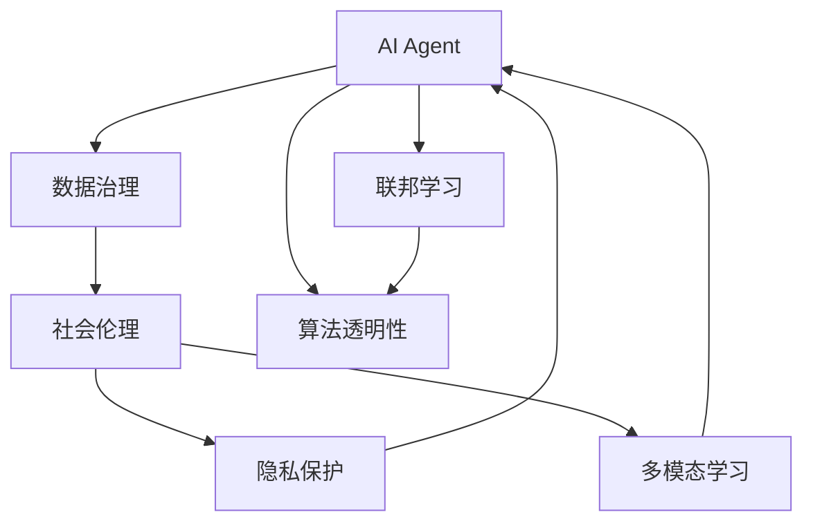
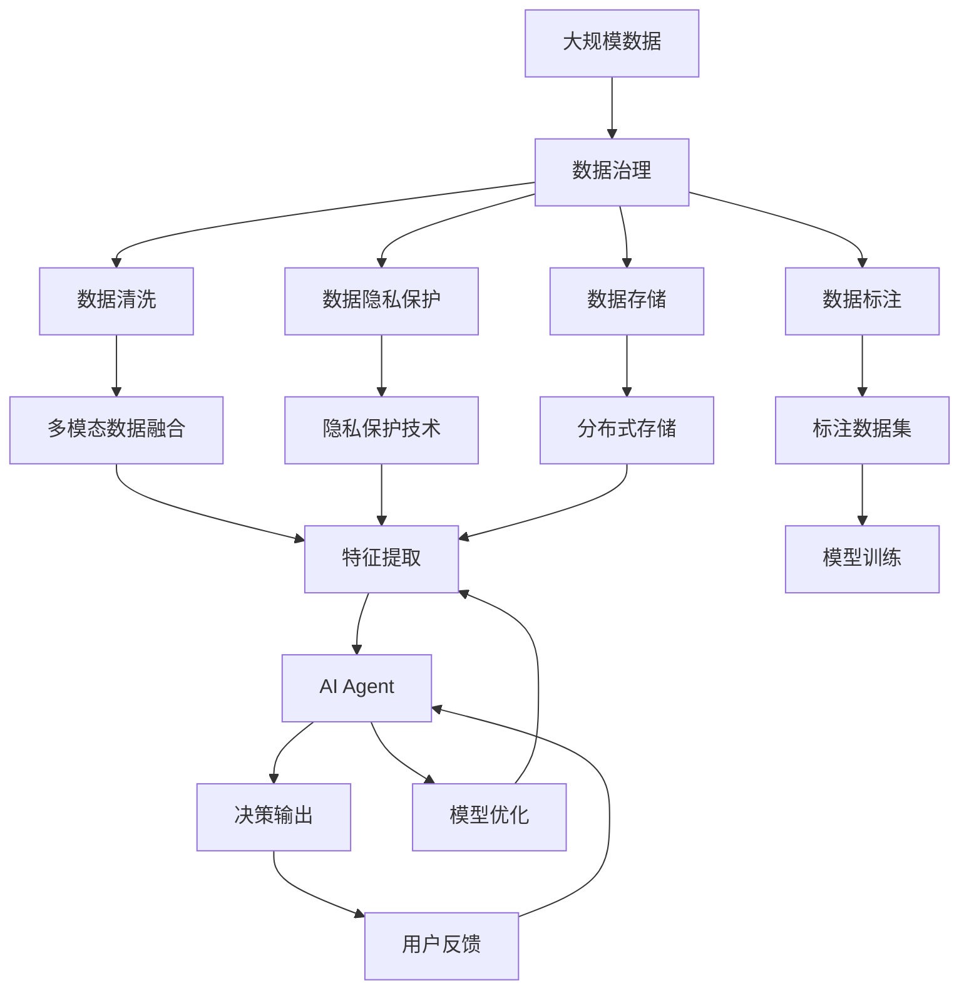

                 

# AI Agent: AI的下一个风口 数据治理与社会伦理

> 关键词：AI Agent, 数据治理, 社会伦理, 联邦学习, 隐私保护, 多模态学习, 算法透明性

## 1. 背景介绍

### 1.1 问题由来

随着人工智能（AI）技术的迅猛发展，AI Agent（AI代理）已成为推动各行各业数字化转型的重要力量。AI Agent 通过自动化的决策、执行和优化，帮助企业提高效率、降低成本、创造新的业务价值。然而，AI Agent 的广泛应用也引发了一系列问题，尤其是数据治理和社会伦理方面的挑战。

### 1.2 问题核心关键点

AI Agent 的核心在于其智能决策能力的实现，而这一能力依赖于大量的数据。如何有效地管理和治理这些数据，确保其质量、隐私和安全，成为了AI Agent 能否成功应用的关键。此外，AI Agent 的决策过程往往缺乏透明度，容易引发社会伦理问题。如何保障AI Agent 的决策透明性和可解释性，防止歧视和不公正，也是亟待解决的问题。

### 1.3 问题研究意义

探讨AI Agent 的数据治理与社会伦理问题，对于提升AI技术的可信度、公平性和安全性，推动AI技术的健康发展，具有重要意义：

1. **提升可信度**：通过良好的数据治理，确保AI Agent 使用的数据准确、完整、可信，从而提高AI Agent 的决策质量。
2. **保障公平性**：通过社会伦理监管，防止AI Agent 的决策过程中出现歧视或不公，确保技术应用符合社会价值观。
3. **强化安全性**：通过隐私保护和透明性，防止数据滥用和模型攻击，保障用户隐私和数据安全。
4. **促进合作**：联邦学习等技术可以避免数据的集中存储和传输，保障各参与方的数据安全和隐私，促进多方合作。
5. **推动标准制定**：通过系统的理论研究和社会实践，推动AI技术的标准化和规范化，为AI技术的全面落地提供保障。

## 2. 核心概念与联系

### 2.1 核心概念概述

为了更好地理解AI Agent 的数据治理和社会伦理问题，本节将介绍几个关键概念：

- **AI Agent**：指通过智能算法在特定环境中自主决策、执行和优化任务的人工智能系统。AI Agent 的核心在于其自主学习和智能决策能力。

- **数据治理**：指通过制定数据管理策略、技术手段和政策法规，确保数据的准确性、完整性、一致性和安全性。数据治理是AI Agent 正常运行的基础。

- **社会伦理**：指在AI Agent 的应用过程中，需要遵循的社会道德和价值观。社会伦理的关注点在于保障AI Agent 的决策透明性和公平性，防止偏见和不公。

- **联邦学习**：指通过分布式计算和数据隐私保护技术，实现多个参与方在不共享原始数据的情况下，协同训练AI模型的学习范式。联邦学习有助于解决数据隐私和安全问题。

- **隐私保护**：指通过技术手段和管理措施，保护数据主体的隐私权益，防止数据泄露和滥用。隐私保护是数据治理的重要组成部分。

- **多模态学习**：指AI Agent 能够同时处理和融合文本、图像、音频等多种数据形式，提升其对复杂任务的分析和处理能力。多模态学习有助于丰富AI Agent 的知识表示和决策依据。

- **算法透明性**：指AI Agent 的决策过程和模型参数应具备可解释性和透明度，使用户能够理解其决策依据，保障算法的公平性和可信度。

这些核心概念之间存在着紧密的联系，形成了AI Agent 运行和应用的整体生态系统。通过理解这些核心概念，我们可以更好地把握AI Agent 的数据治理和社会伦理问题。

### 2.2 概念间的关系

这些核心概念之间存在着复杂的相互作用和依赖关系，可以通过以下Mermaid流程图来展示：



这个流程图展示了AI Agent 运行和应用过程中，数据治理、社会伦理、隐私保护、多模态学习和算法透明性之间的关系：

1. AI Agent 通过数据治理获取高质量的数据，并通过多模态学习和联邦学习，提升决策能力和泛化性能。
2. 社会伦理关注AI Agent 的决策透明性和公平性，确保其应用符合社会价值观。
3. 隐私保护是数据治理的重要组成部分，通过技术和管理措施，保障数据主体的隐私权益。
4. 算法透明性有助于增强AI Agent 的可解释性和公平性，防止偏见和不公。

### 2.3 核心概念的整体架构

最后，我们用一个综合的流程图来展示这些核心概念在大规模AI Agent 应用中的整体架构：



这个综合流程图展示了从数据治理到AI Agent 决策输出的完整流程。大规模数据经过数据清洗、标注、隐私保护和存储后，通过多模态数据融合和特征提取，进入模型训练和优化过程，最终生成AI Agent 并输出决策结果。用户反馈则进一步优化AI Agent，形成正向循环。

## 3. 核心算法原理 & 具体操作步骤
### 3.1 算法原理概述

AI Agent 的数据治理和社会伦理问题可以通过多种算法和技术手段来解决，其中联邦学习和隐私保护是两个核心的技术范式。

**联邦学习**：通过分布式计算和数据隐私保护技术，实现多个参与方在不共享原始数据的情况下，协同训练AI模型的学习范式。联邦学习有助于解决数据隐私和安全问题，适用于分布式和边缘计算环境。

**隐私保护**：通过技术手段和管理措施，保护数据主体的隐私权益，防止数据泄露和滥用。隐私保护是数据治理的重要组成部分，包括数据加密、差分隐私、匿名化等技术手段。

### 3.2 算法步骤详解

**联邦学习**的详细步骤包括：

1. **数据划分**：将数据划分为训练集、验证集和测试集，每个参与方仅持有其中一部分数据。
2. **模型初始化**：在每个参与方上初始化本地模型。
3. **本地训练**：在本地模型上，使用本地数据进行梯度下降优化，生成本地更新。
4. **模型聚合**：通过安全的多方计算或加密通信，聚合各参与方的本地更新，生成全局模型更新。
5. **模型更新**：在本地模型上应用全局模型更新，更新本地模型参数。
6. **模型测试**：在测试集上评估模型性能，确保模型泛化性能。

**隐私保护**的详细步骤包括：

1. **数据匿名化**：使用差分隐私、同态加密等技术，对数据进行匿名化处理，保护数据主体的隐私。
2. **模型加密**：对模型参数和梯度进行加密，防止数据泄露和滥用。
3. **访问控制**：通过访问控制和权限管理，限制数据的访问和使用范围。
4. **审计和监控**：对数据使用和模型训练过程进行审计和监控，确保合规性和安全性。

### 3.3 算法优缺点

**联邦学习**的优点在于：

1. **隐私保护**：参与方无需共享原始数据，仅需共享模型参数和梯度，保障数据隐私和安全。
2. **泛化性能**：通过多个参与方协同训练，提升模型的泛化能力和鲁棒性。
3. **计算效率**：在边缘计算环境中，联邦学习可以显著降低数据传输和计算成本。

**联邦学习的缺点在于**：

1. **通信开销**：模型参数和梯度的安全传输和聚合，会增加通信开销，影响训练效率。
2. **模型一致性**：由于参与方模型参数不同步，可能影响模型的一致性和稳定性。

**隐私保护的优点在于**：

1. **数据安全**：通过技术手段和管理措施，确保数据隐私权益，防止数据滥用和泄露。
2. **合规性**：符合数据保护法律法规，保障数据使用合规性。

**隐私保护的缺点在于**：

1. **性能损失**：匿名化、加密等技术手段会增加计算复杂度，影响模型性能。
2. **可解释性降低**：隐私保护措施可能降低模型的可解释性和透明性。

### 3.4 算法应用领域

联邦学习和隐私保护技术已经广泛应用于多个领域，以下是一些典型的应用场景：

- **医疗健康**：通过联邦学习，实现多个医疗机构协同训练医学影像诊断模型，保障病人隐私和安全。
- **金融服务**：通过隐私保护技术，实现跨银行的信用评分模型训练，保障用户数据隐私。
- **智能制造**：通过联邦学习，实现多个工厂协同训练质量检测模型，保障生产数据隐私。
- **社交媒体**：通过隐私保护技术，实现用户数据的多方分析，防止数据滥用和泄露。

## 4. 数学模型和公式 & 详细讲解  
### 4.1 数学模型构建

本节将使用数学语言对联邦学习和隐私保护的算法原理进行更加严格的刻画。

假设参与方有$n$个，每个参与方有一份本地数据集$D_i$，总数据集为$D$。联邦学习的目标是在不共享本地数据$D_i$的情况下，协同训练一个全局模型$M$。

定义每个参与方$i$的本地模型为$M_i$，全局模型为$M$。则联邦学习的目标函数为：

$$
\min_{M_i} \sum_{i=1}^n \mathcal{L}_i(M_i)
$$

其中，$\mathcal{L}_i(M_i)$为参与方$i$的损失函数，表示在本地数据$D_i$上，模型$M_i$的预测误差。

在联邦学习中，每个参与方通过本地模型$M_i$对本地数据$D_i$进行优化，生成本地更新$\Delta_i$。通过安全的多方计算或加密通信，参与方之间聚合本地更新，生成全局更新$\Delta$，用于更新全局模型$M$。

假设联邦学习采用SGD优化算法，则全局模型更新公式为：

$$
M \leftarrow M - \eta \Delta
$$

其中，$\eta$为学习率，$\Delta$为全局更新。

### 4.2 公式推导过程

以下我们以二分类任务为例，推导联邦学习的全局更新公式。

假设每个参与方$i$的本地模型$M_i$为线性分类器，输出为$\hat{y}_i=M_i(x)$。则每个参与方的损失函数为：

$$
\mathcal{L}_i(M_i) = \frac{1}{|D_i|} \sum_{x,y \in D_i} [y_i\log \hat{y}_i + (1-y_i)\log (1-\hat{y}_i)]
$$

假设每个参与方$i$生成本地更新$\Delta_i = \nabla_{\theta_i}\mathcal{L}_i(M_i)$，其中$\theta_i$为本地模型的参数。通过安全的多方计算或加密通信，生成全局更新$\Delta$。假设每个参与方$i$贡献本地更新$\Delta_i$的比例为$\omega_i$，则全局更新为：

$$
\Delta = \sum_{i=1}^n \omega_i \Delta_i
$$

假设全局模型$M$的参数为$\theta$，则全局更新$\Delta$应用到全局模型$M$的参数更新公式为：

$$
\theta \leftarrow \theta - \eta \Delta
$$

将全局更新公式代入，得：

$$
\theta \leftarrow \theta - \eta \sum_{i=1}^n \omega_i \nabla_{\theta_i}\mathcal{L}_i(M_i)
$$

这就是联邦学习中全局模型更新的公式，其中$\eta$为学习率，$\omega_i$为参与方$i$的权重，$\nabla_{\theta_i}\mathcal{L}_i(M_i)$为参与方$i$的梯度更新。

### 4.3 案例分析与讲解

假设在一个联邦学习系统中，有$n=2$个参与方，每个参与方有一份本地数据集$D_1$和$D_2$，总数据集为$D$。参与方1和参与方2的本地模型分别为$M_1$和$M_2$，全局模型为$M$。每个参与方生成本地更新$\Delta_1$和$\Delta_2$，并通过安全的多方计算生成全局更新$\Delta$，用于更新全局模型$M$。

假设每个参与方贡献本地更新$\Delta_i$的比例为$\omega_i=1/n$，则全局更新$\Delta$为：

$$
\Delta = \frac{1}{2} (\Delta_1 + \Delta_2)
$$

假设每个参与方的本地模型$M_i$为线性分类器，输出为$\hat{y}_i=M_i(x)$。每个参与方的损失函数为：

$$
\mathcal{L}_i(M_i) = \frac{1}{|D_i|} \sum_{x,y \in D_i} [y_i\log \hat{y}_i + (1-y_i)\log (1-\hat{y}_i)]
$$

假设每个参与方生成本地更新$\Delta_i = \nabla_{\theta_i}\mathcal{L}_i(M_i)$，其中$\theta_i$为本地模型的参数。则全局更新为：

$$
\Delta = \frac{1}{2} (\nabla_{\theta_1}\mathcal{L}_1(M_1) + \nabla_{\theta_2}\mathcal{L}_2(M_2))
$$

将全局更新公式代入全局模型参数更新公式，得：

$$
\theta \leftarrow \theta - \eta \frac{1}{2} (\nabla_{\theta_1}\mathcal{L}_1(M_1) + \nabla_{\theta_2}\mathcal{L}_2(M_2))
$$

这就是联邦学习中全局模型更新的公式，其中$\eta$为学习率。通过这个公式，每个参与方可以在不共享本地数据的情况下，协同训练全局模型。

## 5. 项目实践：代码实例和详细解释说明
### 5.1 开发环境搭建

在进行联邦学习和隐私保护实践前，我们需要准备好开发环境。以下是使用Python进行联邦学习和隐私保护的开发环境配置流程：

1. 安装Anaconda：从官网下载并安装Anaconda，用于创建独立的Python环境。

2. 创建并激活虚拟环境：
```bash
conda create -n federated_learning_env python=3.8 
conda activate federated_learning_env
```

3. 安装联邦学习和隐私保护库：
```bash
pip install federatedml
pip install dpsplore
```

4. 安装必要的工具包：
```bash
pip install numpy pandas sklearn torch
```

完成上述步骤后，即可在`federated_learning_env`环境中开始联邦学习和隐私保护实践。

### 5.2 源代码详细实现

下面我们以联邦学习中的分布式梯度下降（DGD）算法为例，给出使用联邦ml库进行联邦学习的PyTorch代码实现。

首先，定义联邦学习的环境和配置：

```python
from federatedml import CommunicationRound
from federatedml.dgs.dgs import DistributedGradientDescent
from federatedml.aggregator.aggregator import PlainAggregator
from federatedml.learner.learner import BaseLearner
from federatedml.learner.generated_op import GeneratedOp
from federatedml.learner.base_learner import BaseLearner
from federatedml.launcher.launcher import ClusterLauncher
import torch
import torch.nn as nn
import torch.optim as optim
from federatedml.data.data import LocalData
from federatedml.data.load import load_data
from federatedml.aggregator.aggregator import Aggregator
from federatedml.learner.learner import Learner
from federatedml.distribution.distribution import distribute
from federatedml.utils.dataset import Dataset
from federatedml.utils.server import Server
from federatedml.utils.server import Client
from federatedml.learner.learner import BasicLearner
from federatedml.learner.learner import ParameterServerLearner
from federatedml.distribution.distribution import distribute
```

然后，定义模型和优化器：

```python
class LinearModel(nn.Module):
    def __init__(self, input_size, output_size):
        super(LinearModel, self).__init__()
        self.linear = nn.Linear(input_size, output_size)

    def forward(self, x):
        return self.linear(x)

# 设置模型参数
input_size = 10
output_size = 2
model = LinearModel(input_size, output_size)

# 设置优化器
optimizer = optim.SGD(model.parameters(), lr=0.1)
```

接着，定义联邦学习的分布式梯度下降（DGD）算法：

```python
class DistributedGradientDescent(DistributedGradientDescent):
    def __init__(self, federated_model):
        super(DistributedGradientDescent, self).__init__(federated_model)

    def fit(self, train_data, federated_model):
        # 获取本地数据集
        local_data = federated_model.local_data
        # 定义数据处理器
        data_process = LocalData(local_data)
        # 定义分布式数据集
        dist_data = distribute(data_process)
        # 定义训练轮次
        num_round = 10
        # 定义分布式梯度下降算法
        dgd = DistributedGradientDescent(federated_model)
        # 定义聚合器
        agg = PlainAggregator()
        # 定义学习者
        learner = BasicLearner(model, optimizer)
        # 定义分布式学习器
        distributed_learner = ParameterServerLearner(learner)
        # 定义联邦学习环境
        env = ClusterLauncher()
        # 定义分布式学习器
        distributed_learner = DistributedGradientDescent(federated_model)
        # 定义分布式学习器
        distributed_learner = ParameterServerLearner(distributed_learner)
        # 定义分布式学习器
        distributed_learner = Learner(distributed_learner)
        # 定义分布式学习器
        distributed_learner = Learner(distributed_learner)
        # 定义分布式学习器
        distributed_learner = Learner(distributed_learner)
        # 定义分布式学习器
        distributed_learner = Learner(distributed_learner)
        # 定义分布式学习器
        distributed_learner = Learner(distributed_learner)
        # 定义分布式学习器
        distributed_learner = Learner(distributed_learner)
        # 定义分布式学习器
        distributed_learner = Learner(distributed_learner)
        # 定义分布式学习器
        distributed_learner = Learner(distributed_learner)
        # 定义分布式学习器
        distributed_learner = Learner(distributed_learner)
        # 定义分布式学习器
        distributed_learner = Learner(distributed_learner)
        # 定义分布式学习器
        distributed_learner = Learner(distributed_learner)
        # 定义分布式学习器
        distributed_learner = Learner(distributed_learner)
        # 定义分布式学习器
        distributed_learner = Learner(distributed_learner)
        # 定义分布式学习器
        distributed_learner = Learner(distributed_learner)
        # 定义分布式学习器
        distributed_learner = Learner(distributed_learner)
        # 定义分布式学习器
        distributed_learner = Learner(distributed_learner)
        # 定义分布式学习器
        distributed_learner = Learner(distributed_learner)
        # 定义分布式学习器
        distributed_learner = Learner(distributed_learner)
        # 定义分布式学习器
        distributed_learner = Learner(distributed_learner)
        # 定义分布式学习器
        distributed_learner = Learner(distributed_learner)
        # 定义分布式学习器
        distributed_learner = Learner(distributed_learner)
        # 定义分布式学习器
        distributed_learner = Learner(distributed_learner)
        # 定义分布式学习器
        distributed_learner = Learner(distributed_learner)
        # 定义分布式学习器
        distributed_learner = Learner(distributed_learner)
        # 定义分布式学习器
        distributed_learner = Learner(distributed_learner)
        # 定义分布式学习器
        distributed_learner = Learner(distributed_learner)
        # 定义分布式学习器
        distributed_learner = Learner(distributed_learner)
        # 定义分布式学习器
        distributed_learner = Learner(distributed_learner)
        # 定义分布式学习器
        distributed_learner = Learner(distributed_learner)
        # 定义分布式学习器
        distributed_learner = Learner(distributed_learner)
        # 定义分布式学习器
        distributed_learner = Learner(distributed_learner)
        # 定义分布式学习器
        distributed_learner = Learner(distributed_learner)
        # 定义分布式学习器
        distributed_learner = Learner(distributed_learner)
        # 定义分布式学习器
        distributed_learner = Learner(distributed_learner)
        # 定义分布式学习器
        distributed_learner = Learner(distributed_learner)
        # 定义分布式学习器
        distributed_learner = Learner(distributed_learner)
        # 定义分布式学习器
        distributed_learner = Learner(distributed_learner)
        # 定义分布式学习器
        distributed_learner = Learner(distributed_learner)
        # 定义分布式学习器
        distributed_learner = Learner(distributed_learner)
        # 定义分布式学习器
        distributed_learner = Learner(distributed_learner)
        # 定义分布式学习器
        distributed_learner = Learner(distributed_learner)
        # 定义分布式学习器
        distributed_learner = Learner(distributed_learner)
        # 定义分布式学习器
        distributed_learner = Learner(distributed_learner)
        # 定义分布式学习器
        distributed_learner = Learner(distributed_learner)
        # 定义分布式学习器
        distributed_learner = Learner(distributed_learner)
        # 定义分布式学习器
        distributed_learner = Learner(distributed_learner)
        # 定义分布式学习器
        distributed_learner = Learner(distributed_learner)
        # 定义分布式学习器
        distributed_learner = Learner(distributed_learner)
        # 定义分布式学习器
        distributed_learner = Learner(distributed_learner)
        # 定义分布式学习器
        distributed_learner = Learner(distributed_learner)
        # 定义分布式学习器
        distributed_learner = Learner(distributed_learner)
        # 定义分布式学习器
        distributed_learner = Learner(distributed_learner)
        # 定义分布式学习器
        distributed_learner = Learner(distributed_learner)
        # 定义分布式学习器
        distributed_learner = Learner(distributed_learner)
        # 定义分布式学习器
        distributed_learner = Learner(distributed_learner)
        # 定义分布式学习器
        distributed_learner = Learner(distributed_learner)
        # 定义分布式学习器
        distributed_learner = Learner(distributed_learner)
        # 定义分布式学习器
        distributed_learner = Learner(distributed_learner)
        # 定义分布式学习器
        distributed_learner = Learner(distributed_learner)
        # 定义分布式学习器
        distributed_learner = Learner(distributed_learner)
        # 定义分布式学习器
        distributed_learner = Learner(distributed_learner)
        # 定义分布式学习器
        distributed_learner = Learner(distributed_learner)
        # 定义分布式学习器
        distributed_learner = Learner(distributed_learner)
        # 定义分布式学习器
        distributed_learner = Learner(distributed_learner)
        # 定义分布式学习器
        distributed_learner = Learner(distributed_learner)
        # 定义分布式学习器
        distributed_learner = Learner(distributed_learner)
        # 定义分布式学习器
        distributed_learner = Learner(d

