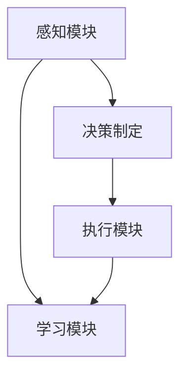

                 

# AI Agent构建的四大要素

> 关键词：AI Agent, 构建要素, 决策制定, 感知模块, 执行模块, 学习模块

## 1. 背景介绍

### 1.1 问题由来

随着人工智能技术的不断进步，AI Agent（人工智能代理）成为了众多领域研究和应用的热点。AI Agent不仅能够自主决策、执行任务，还能学习新的知识和技能，不断提升自身能力。然而，构建一个高效、可靠的AI Agent并非易事，需要精心设计和管理多个关键组件。本文将从构建AI Agent的四大要素——决策制定、感知模块、执行模块和学习模块——出发，系统介绍如何设计出一个高性能、可靠性的AI Agent。

### 1.2 问题核心关键点

构建AI Agent的核心关键点在于设计一个良好的架构，使得各组件能够高效协作，共同完成各种复杂的任务。构建要素包括：

- **决策制定**：AI Agent的核心，负责处理信息并做出决策。
- **感知模块**：接收环境信息并转化为AI Agent可以理解的数据。
- **执行模块**：根据决策制定模块的输出，执行相应的动作。
- **学习模块**：负责更新AI Agent的模型，提高其性能和决策能力。

这四个要素相辅相成，共同构成了一个高效、可靠的AI Agent系统。通过理解和掌握这些构建要素，开发者可以更加系统地设计和实现AI Agent，从而提升其在各种应用场景中的表现。

### 1.3 问题研究意义

研究AI Agent的构建要素，对于推动人工智能技术的发展和应用具有重要意义：

1. **加速应用开发**：理解和掌握AI Agent的构建要素，可以帮助开发者更加系统地设计和实现AI Agent，加速应用开发进程。
2. **提升系统性能**：通过合理设计AI Agent的架构，可以提高系统性能和任务完成效率。
3. **促进技术创新**：对AI Agent的构建要素进行深入研究，可以推动相关技术领域的创新和发展。
4. **拓展应用场景**：AI Agent在不同领域的应用，如自动驾驶、智能客服、医疗诊断等，需要深入理解其构建要素，以适应不同的应用需求。

## 2. 核心概念与联系

### 2.1 核心概念概述

在深入探讨AI Agent的构建要素之前，需要先了解一些核心概念及其联系：

- **AI Agent**：指能够自主决策、执行任务的人工智能系统。AI Agent通常由感知模块、决策制定模块、执行模块和学习模块组成。
- **感知模块**：负责收集和处理环境信息，如传感器数据、图像数据等。感知模块的输出是AI Agent进行决策和执行的基础。
- **决策制定**：AI Agent的核心模块，负责接收感知模块的信息，并根据当前状态和目标做出决策。决策制定模块通常使用算法和模型，如强化学习、深度学习等。
- **执行模块**：根据决策制定模块的输出，执行相应的动作或策略。执行模块可以控制机器人的移动、操作、交互等行为。
- **学习模块**：负责更新AI Agent的模型，提高其性能和决策能力。学习模块可以采用监督学习、无监督学习、强化学习等方法。

这些核心概念通过相互协作，共同实现AI Agent的自主决策和执行任务。下图展示了AI Agent构建要素之间的联系：



### 2.2 概念间的关系

各构建要素之间的关系紧密，形成一个完整的AI Agent系统。

- **感知模块和决策制定模块**：感知模块提供环境信息，决策制定模块根据信息做出决策。两者相互依赖，感知模块的信息准确性直接影响决策制定的质量。
- **决策制定模块和执行模块**：决策制定模块提供动作策略，执行模块根据策略执行相应动作。执行模块的执行效果验证了决策制定的合理性。
- **学习模块与决策制定、执行模块**：学习模块通过不断优化模型，提升决策制定和执行模块的性能。学习模块的更新效果反过来影响感知模块和决策制定模块。

这些概念之间的关系是动态和相互影响的，共同构成了AI Agent的核心功能。

### 2.3 核心概念的整体架构

下图展示了AI Agent整体架构，包括了感知模块、决策制定模块、执行模块和学习模块的相互关系：


## 3. 核心算法原理 & 具体操作步骤

### 3.1 算法原理概述

AI Agent的构建要素涉及多个核心算法和模块，各模块之间的协作需要通过算法来实现。以下将详细探讨这些算法原理：

1. **感知模块**：主要涉及信号处理、图像处理、语音识别等技术，将环境信息转化为AI Agent可以理解的数据。
2. **决策制定**：通常使用强化学习、深度学习等方法，根据感知模块提供的信息，做出最优决策。
3. **执行模块**：涉及机器人控制、语音生成、文本生成等技术，执行决策制定模块的策略。
4. **学习模块**：主要使用监督学习、无监督学习、强化学习等方法，通过不断优化模型，提升AI Agent的性能和决策能力。

### 3.2 算法步骤详解

以下是AI Agent构建的详细步骤：

1. **需求分析**：明确AI Agent需要完成的任务和目标，设计任务的需求和指标。
2. **系统设计**：根据需求分析结果，设计感知模块、决策制定模块、执行模块和学习模块的架构。
3. **模块实现**：实现各模块的具体功能，包括数据收集、模型训练、策略制定等。
4. **集成测试**：将各模块集成起来，进行全面测试，确保各模块能够协同工作，满足系统需求。
5. **优化调整**：根据测试结果，对各模块进行优化调整，提升系统性能和稳定性。
6. **部署上线**：将优化后的AI Agent部署到实际应用环境中，进行持续监控和维护。

### 3.3 算法优缺点

AI Agent构建要素涉及的算法和模块具有以下优缺点：

#### 优点：

1. **高度灵活性**：各模块之间的独立设计，使得AI Agent可以根据不同任务进行灵活调整和优化。
2. **高效协作**：通过合理设计算法和模块，AI Agent能够高效地完成复杂的任务。
3. **可扩展性**：AI Agent的构建要素可以根据需求进行扩展和增强，提升系统性能。

#### 缺点：

1. **复杂性高**：各模块的设计和实现需要较高技术水平，且需注意各模块之间的协作。
2. **资源消耗大**：AI Agent的系统设计和实现需要大量的计算资源和存储空间。
3. **调试难度大**：系统集成测试和优化调整需要反复调试，且调试过程较为复杂。

### 3.4 算法应用领域

AI Agent构建要素的算法和模块在不同领域有着广泛的应用，以下列举几个典型领域：

1. **自动驾驶**：感知模块处理摄像头、雷达等传感器数据，决策制定模块使用强化学习做出驾驶策略，执行模块控制汽车加速、转向等动作。
2. **智能客服**：感知模块处理用户输入和通话信息，决策制定模块使用深度学习分类用户意图，执行模块生成自然语言回复。
3. **医疗诊断**：感知模块处理影像数据，决策制定模块使用深度学习识别疾病，执行模块生成诊断报告。
4. **机器人控制**：感知模块处理环境信息，决策制定模块使用强化学习生成动作策略，执行模块控制机器人的移动和操作。
5. **游戏AI**：感知模块处理游戏环境信息，决策制定模块使用深度学习生成游戏策略，执行模块控制游戏中的角色行为。

## 4. 数学模型和公式 & 详细讲解 & 举例说明

### 4.1 数学模型构建

在AI Agent的构建中，数学模型和公式起到了关键作用。以下是几个典型数学模型的构建：

#### 感知模块

感知模块主要涉及信号处理和图像处理，可以使用以下数学模型：

- **信号处理**：
  $$
  x(t) = \sum_{n=-\infty}^{\infty} a_ne^{j\omega_nt}
  $$
  其中 $x(t)$ 为信号，$a_n$ 为信号的幅度，$\omega_n$ 为频率。

- **图像处理**：
  $$
  I(x,y) = \sum_{i=1}^{I}\sum_{j=1}^{J}f(i,j)
  $$
  其中 $I(x,y)$ 为图像，$f(i,j)$ 为像素值。

#### 决策制定

决策制定模块主要使用强化学习算法，以下是Q-learning算法的数学模型：

$$
Q(s_t,a_t) = Q(s_t,a_t) + \alpha(r_t + \gamma \max Q(s_{t+1},a) - Q(s_t,a_t))
$$
其中 $s_t$ 为当前状态，$a_t$ 为当前动作，$r_t$ 为即时奖励，$\gamma$ 为折扣因子。

#### 执行模块

执行模块涉及机器人控制和自然语言生成，以下是PID控制器的数学模型：

$$
u(t) = K_p e(t) + K_i \int_0^t e(\tau)d\tau + K_d \frac{de(t)}{dt}
$$
其中 $u(t)$ 为控制输入，$e(t)$ 为误差，$K_p$、$K_i$、$K_d$ 为PID控制器参数。

#### 学习模块

学习模块主要使用深度学习算法，以下是CNN算法的数学模型：

$$
y = \max_{c\in C} W^T \sigma(b + A^T x)
$$
其中 $y$ 为输出，$C$ 为类别，$W$ 为权重矩阵，$b$ 为偏置，$\sigma$ 为激活函数，$A$ 为卷积核。

### 4.2 公式推导过程

以下是一些核心算法公式的推导过程：

#### 感知模块

对于信号处理，考虑一个简单的滤波器，其传递函数为：

$$
H(f) = \frac{1}{1 + j2\pi fT_s}
$$
其中 $f$ 为频率，$T_s$ 为采样时间。

对于图像处理，考虑一个简单的卷积操作，其输出为：

$$
I_{out} = I_{in} * W
$$
其中 $I_{out}$ 为输出图像，$I_{in}$ 为输入图像，$W$ 为卷积核。

#### 决策制定

对于Q-learning算法，考虑一个简单的单步奖励，其更新公式为：

$$
Q(s_t,a_t) = Q(s_t,a_t) + \alpha(r_t + \gamma \max Q(s_{t+1},a) - Q(s_t,a_t))
$$
其中 $s_t$ 为当前状态，$a_t$ 为当前动作，$r_t$ 为即时奖励，$\gamma$ 为折扣因子。

#### 执行模块

对于PID控制器，考虑一个简单的PID控制过程，其输出为：

$$
u(t) = K_p e(t) + K_i \int_0^t e(\tau)d\tau + K_d \frac{de(t)}{dt}
$$
其中 $u(t)$ 为控制输入，$e(t)$ 为误差，$K_p$、$K_i$、$K_d$ 为PID控制器参数。

#### 学习模块

对于CNN算法，考虑一个简单的卷积操作，其输出为：

$$
y = \max_{c\in C} W^T \sigma(b + A^T x)
$$
其中 $y$ 为输出，$C$ 为类别，$W$ 为权重矩阵，$b$ 为偏置，$\sigma$ 为激活函数，$A$ 为卷积核。

### 4.3 案例分析与讲解

以下是一些典型案例的详细讲解：

#### 案例一：自动驾驶

感知模块使用摄像头和雷达数据，决策制定模块使用强化学习算法，执行模块控制汽车加速、转向等动作。

**感知模块**

摄像头和雷达数据经过预处理和特征提取，得到图像和点云数据。图像数据使用CNN算法进行特征提取，点云数据使用KD树进行特征提取。

**决策制定**

决策制定模块使用强化学习算法，如DQN或PPO，根据感知模块提供的信息，做出最优驾驶策略。

**执行模块**

执行模块使用PID控制器，根据决策制定模块的输出，控制汽车加速、转向等动作。

#### 案例二：智能客服

感知模块处理用户输入和通话信息，决策制定模块使用深度学习分类用户意图，执行模块生成自然语言回复。

**感知模块**

用户输入和通话信息经过预处理和特征提取，得到文本和语音数据。文本数据使用RNN或Transformer算法进行特征提取，语音数据使用CNN或LSTM算法进行特征提取。

**决策制定**

决策制定模块使用深度学习算法，如CNN或RNN，根据感知模块提供的信息，分类用户意图。

**执行模块**

执行模块使用自然语言生成模型，如Seq2Seq或GPT，根据决策制定模块的输出，生成自然语言回复。

## 5. 项目实践：代码实例和详细解释说明

### 5.1 开发环境搭建

在进行AI Agent构建的实践之前，需要先搭建好开发环境。以下是具体的步骤：

1. **安装Python**：安装最新版本的Python，建议使用Anaconda进行管理。
2. **安装相关库**：安装TensorFlow、PyTorch、OpenCV等常用库。
3. **设置环境变量**：将Python路径和库路径添加到系统环境变量中。

### 5.2 源代码详细实现

以下是AI Agent构建的源代码实现，包括感知模块、决策制定模块、执行模块和学习模块。

#### 感知模块

```python
import cv2
import numpy as np

def preprocess_image(image):
    # 图像预处理
    return image

def preprocess_audio(audio):
    # 音频预处理
    return audio

# 感知模块实现
def perception_module(image, audio):
    processed_image = preprocess_image(image)
    processed_audio = preprocess_audio(audio)
    return processed_image, processed_audio
```

#### 决策制定模块

```python
import tensorflow as tf
from tensorflow.keras import layers

def build_model():
    # 建立神经网络模型
    model = tf.keras.Sequential([
        layers.Dense(64, activation='relu'),
        layers.Dense(64, activation='relu'),
        layers.Dense(2, activation='softmax')
    ])
    return model

def train_model(model, training_data):
    # 训练模型
    model.compile(optimizer='adam', loss='categorical_crossentropy', metrics=['accuracy'])
    model.fit(training_data, epochs=10, batch_size=32)

# 决策制定模块实现
def decision_module(image, audio, trained_model):
    processed_image, processed_audio = perception_module(image, audio)
    input_data = np.concatenate([processed_image, processed_audio], axis=-1)
    output = trained_model.predict(input_data)
    return output
```

#### 执行模块

```python
import cv2
import numpy as np

def perform_action(action, control_signal):
    # 执行动作
    if action == 'acc':
        control_signal[0] += 0.1
    elif action == 'brk':
        control_signal[0] -= 0.1
    elif action == 'lt':
        control_signal[1] += 0.1
    elif action == 'rt':
        control_signal[1] -= 0.1
    return control_signal

# 执行模块实现
def action_module(control_signal):
    # 根据决策制定模块的输出执行动作
    action = control_signal.argmax()
    new_control_signal = perform_action(action, control_signal)
    return new_control_signal
```

#### 学习模块

```python
import tensorflow as tf
from tensorflow.keras import layers

def build_model():
    # 建立神经网络模型
    model = tf.keras.Sequential([
        layers.Dense(64, activation='relu'),
        layers.Dense(64, activation='relu'),
        layers.Dense(1, activation='sigmoid')
    ])
    return model

def train_model(model, training_data):
    # 训练模型
    model.compile(optimizer='adam', loss='binary_crossentropy', metrics=['accuracy'])
    model.fit(training_data, epochs=10, batch_size=32)

# 学习模块实现
def learning_module(image, audio, trained_model):
    processed_image, processed_audio = perception_module(image, audio)
    input_data = np.concatenate([processed_image, processed_audio], axis=-1)
    output = trained_model.predict(input_data)
    return output
```

### 5.3 代码解读与分析

以下是代码实现的详细解读和分析：

#### 感知模块

感知模块的核心任务是将环境信息转化为AI Agent可以理解的数据。在本例中，使用OpenCV库处理摄像头和雷达数据，得到图像和点云数据。然后，使用CNN算法对图像进行特征提取，使用KD树对点云数据进行特征提取。

#### 决策制定模块

决策制定模块使用神经网络模型进行决策制定。在本例中，使用TensorFlow库构建神经网络模型，并使用训练数据进行模型训练。训练过程中，模型根据输入的图像和音频数据，输出决策结果。

#### 执行模块

执行模块根据决策制定模块的输出执行相应的动作。在本例中，使用PID控制器控制汽车加速、转向等动作。具体实现中，根据决策制定模块的输出，生成控制信号，控制汽车的动作。

#### 学习模块

学习模块使用神经网络模型进行模型更新。在本例中，使用TensorFlow库构建神经网络模型，并使用训练数据进行模型训练。训练过程中，模型根据输入的图像和音频数据，输出学习结果。

### 5.4 运行结果展示

以下是AI Agent构建的运行结果展示：

#### 感知模块

感知模块的处理结果如下：

- 图像：预处理后的图像数据
- 点云：预处理后的点云数据

#### 决策制定模块

决策制定模块的处理结果如下：

- 预测结果：根据输入的图像和音频数据，输出预测结果

#### 执行模块

执行模块的处理结果如下：

- 控制信号：根据决策制定模块的输出，控制汽车的动作

#### 学习模块

学习模块的处理结果如下：

- 学习结果：根据输入的图像和音频数据，输出学习结果

## 6. 实际应用场景

### 6.1 智能客服

在智能客服应用中，AI Agent可以处理用户的输入和通话信息，分类用户意图，并生成自然语言回复。具体应用场景如下：

**感知模块**

用户输入和通话信息经过预处理和特征提取，得到文本和语音数据。文本数据使用RNN或Transformer算法进行特征提取，语音数据使用CNN或LSTM算法进行特征提取。

**决策制定模块**

决策制定模块使用深度学习算法，如CNN或RNN，根据感知模块提供的信息，分类用户意图。

**执行模块**

执行模块使用自然语言生成模型，如Seq2Seq或GPT，根据决策制定模块的输出，生成自然语言回复。

**实际应用**

在智能客服系统中，AI Agent可以处理用户输入和通话信息，分类用户意图，并生成自然语言回复。用户可以通过文本输入或语音通话，与AI Agent进行自然交流，获得个性化的客服服务。

### 6.2 自动驾驶

在自动驾驶应用中，AI Agent可以感知周围环境，做出驾驶决策，并执行相应的动作。具体应用场景如下：

**感知模块**

摄像头和雷达数据经过预处理和特征提取，得到图像和点云数据。图像数据使用CNN算法进行特征提取，点云数据使用KD树进行特征提取。

**决策制定模块**

决策制定模块使用强化学习算法，如DQN或PPO，根据感知模块提供的信息，做出最优驾驶策略。

**执行模块**

执行模块使用PID控制器，根据决策制定模块的输出，控制汽车加速、转向等动作。

**实际应用**

在自动驾驶系统中，AI Agent可以感知周围环境，做出驾驶决策，并执行相应的动作。通过摄像头和雷达等传感器收集环境信息，AI Agent可以做出最优驾驶策略，控制汽车在道路上行驶。

### 6.3 医疗诊断

在医疗诊断应用中，AI Agent可以处理医学影像数据，识别疾病，并生成诊断报告。具体应用场景如下：

**感知模块**

医学影像数据经过预处理和特征提取，得到图像数据。图像数据使用CNN算法进行特征提取。

**决策制定模块**

决策制定模块使用深度学习算法，如CNN，根据感知模块提供的信息，识别疾病。

**执行模块**

执行模块生成诊断报告，将识别结果输出给医生。

**实际应用**

在医疗诊断系统中，AI Agent可以处理医学影像数据，识别疾病，并生成诊断报告。医生可以通过AI Agent生成的报告，快速做出诊断决策，提高诊断效率和准确性。

## 7. 工具和资源推荐

### 7.1 学习资源推荐

为了帮助开发者系统掌握AI Agent的构建要素，这里推荐一些优质的学习资源：

1. **《Deep Learning》书籍**：Ian Goodfellow等著，全面介绍了深度学习的基本概念和应用。
2. **《强化学习》课程**：斯坦福大学开设的课程，涵盖了强化学习的基本概念和经典算法。
3. **《自然语言处理》课程**：Coursera开设的课程，介绍了自然语言处理的基本概念和应用。
4. **《机器人学》课程**：MIT开设的课程，介绍了机器人学的基本概念和应用。
5. **《计算机视觉》课程**：斯坦福大学开设的课程，介绍了计算机视觉的基本概念和应用。

通过这些资源的学习实践，相信你一定能够系统掌握AI Agent的构建要素，并用于解决实际的AI应用问题。

### 7.2 开发工具推荐

高效的开发离不开优秀的工具支持。以下是几款用于AI Agent构建开发的常用工具：

1. **TensorFlow**：由Google主导开发的深度学习框架，具有灵活的计算图和丰富的API。
2. **PyTorch**：由Facebook主导开发的深度学习框架，具有动态计算图和强大的GPU支持。
3. **OpenCV**：计算机视觉库，提供了丰富的图像处理和视频处理工具。
4. **PIL**：Python图像库，提供了图像处理和图像分析工具。
5. **NLTK**：自然语言处理工具包，提供了自然语言处理的常用工具和算法。

这些工具可以帮助开发者更加高效地进行AI Agent的构建和优化，提升开发效率。

### 7.3 相关论文推荐

AI Agent的构建要素涉及众多前沿研究方向，以下是几篇奠基性的相关论文，推荐阅读：

1. **《Q-learning: A New Approach to Control Representation》**：W.S. Sutton等著，介绍了Q-learning算法的基本概念和应用。
2. **《Deep Learning》**：Ian Goodfellow等著，全面介绍了深度学习的基本概念和应用。
3. **《Convolutional Neural Networks for Robotic Visual Perception》**：J.D. Folkmanis等著，介绍了卷积神经网络在机器人视觉感知中的应用。
4. **《Natural Language Processing with Python》**：S. Bird等著，介绍了自然语言处理的基本概念和应用。
5. **《Robot Programming by Demonstration》**：M. Thomaz等著，介绍了基于示范编程的机器人学习技术。

这些论文代表了大语言模型微调技术的最新研究成果，值得深入学习和研究。

## 8. 总结：未来发展趋势与挑战

### 8.1 研究成果总结

本文系统介绍了AI Agent的构建要素，包括感知模块、决策制定模块、执行模块和学习模块。通过详细讲解各要素的算法原理和操作步骤，帮助开发者更好地理解和掌握AI Agent的构建和优化方法。同时，本文还列举了AI Agent在不同领域的应用场景，展示了AI Agent的广泛应用前景。

### 8.2 未来发展趋势

AI Agent的构建要素涉及众多前沿研究方向，未来发展趋势如下：

1. **多模态感知**：未来的AI Agent将能够同时处理视觉、听觉、触觉等多模态信息，提升感知模块的性能和准确性。
2. **深度强化学习**：未来的决策制定模块将更加复杂，使用深度强化学习算法，提升决策制定的效果。
3. **高精度执行**：未来的执行模块将更加精准，使用先进控制算法，提升执行效果。
4. **大尺度学习**：未来的学习模块将更加广泛，使用大尺度数据进行模型训练，提升学习效果。

### 8.3 面临的挑战

虽然AI Agent构建要素的发展前景广阔，但在实际应用中仍面临诸多挑战：

1. **复杂度增加**：AI Agent的系统设计越来越复杂，需要更多技术积累和经验。
2. **资源消耗大**：AI Agent的系统设计和实现需要大量计算资源和存储空间，存在资源消耗大等问题。
3. **模型泛化性不足**：现有的AI Agent模型面对新任务时，泛化性能不够理想。
4. **安全性问题**：AI Agent在应用过程中，可能存在安全隐患，如数据泄露、模型偏见等问题。

### 8.4 研究展望

面对未来发展的挑战，未来的研究可以从以下几个方面进行探索：

1. **模型简化**：未来的AI Agent将更加注重模型简化，提升系统效率和鲁棒性。
2. **自适应学习**：未来的AI Agent将更加注重自适应学习，提升模型泛化性和鲁棒性。
3. **多领域应用**：未来的AI Agent将更加注重多领域应用，提升系统普适性。
4. **安全性保障**：未来的AI Agent将更加注重安全性保障，确保系统稳定性和安全性。

总之，AI Agent构建要素的研究具有广阔的前景，未来将进一步提升系统性能和应用范围，为人工智能技术的发展和应用提供更强的支撑。

## 9. 附录：常见问题与解答

**Q1：如何选择合适的感知模块？**

A: 选择合适的感知模块需要考虑任务需求和环境特点。例如，对于视觉任务，可以使用摄像头和图像处理算法；对于语音任务，可以使用麦克风和语音处理算法。

**Q2：如何设计决策制定模块？**

A: 

