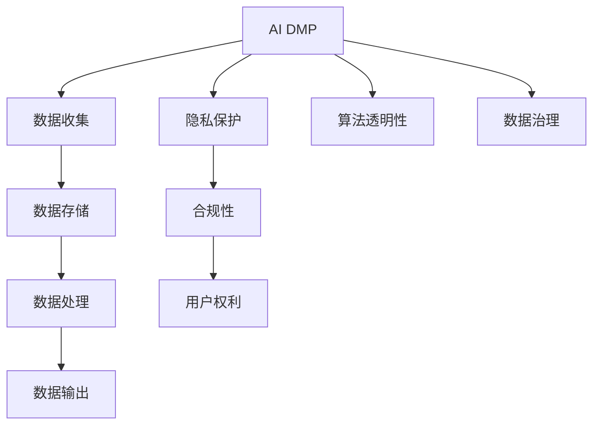
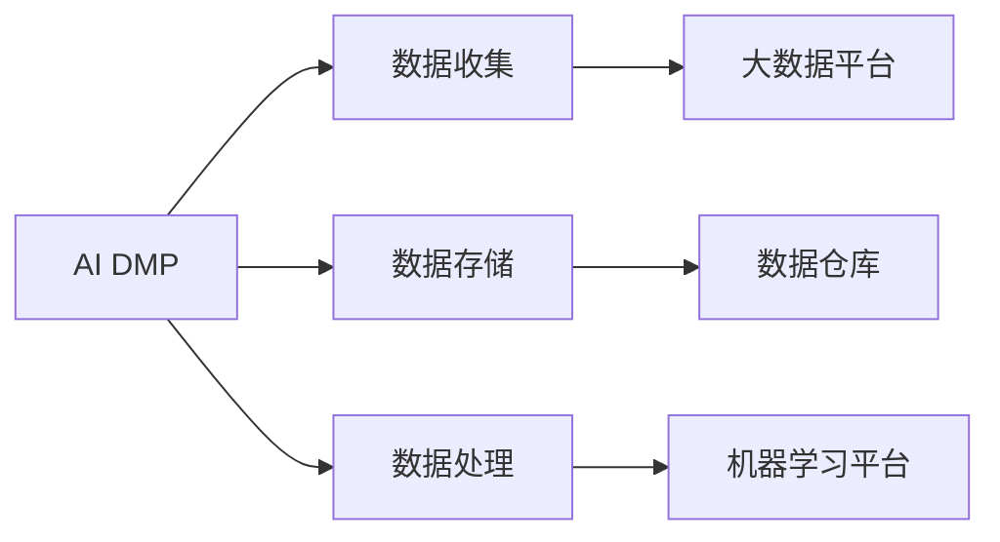
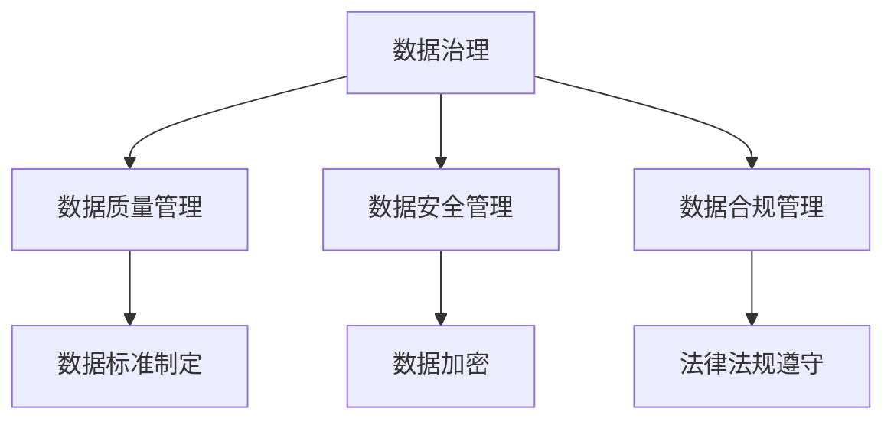
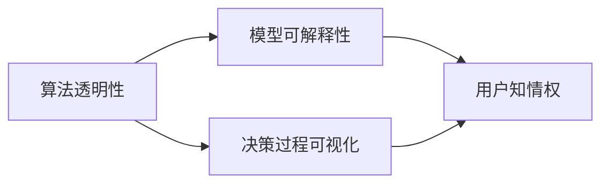
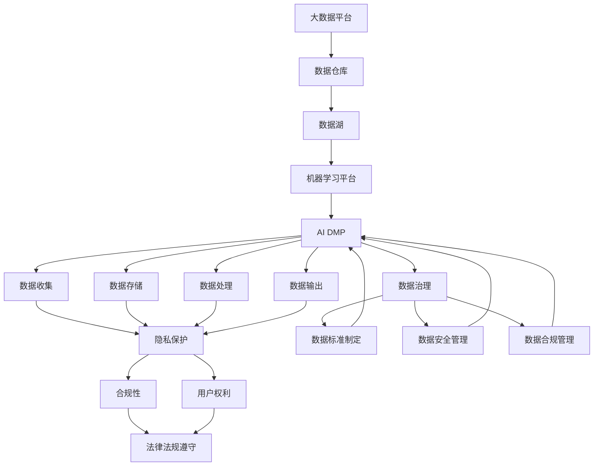

                 

# AI DMP 数据基建的监管与合规

> 关键词：人工智能, DMP, 数据隐私, 合规, 数据治理, 监管框架

## 1. 背景介绍

### 1.1 问题由来
随着数字经济的快速发展，数据作为核心的生产要素在各行各业的应用越来越广泛，特别是人工智能（AI）领域。然而，在数据利用过程中，隐私保护和合规问题也随之凸显，特别是在基于人工智能的定向广告平台（AI DMP，即人工智能驱动的数据管理平台）领域，数据隐私和合规问题尤为严重。

AI DMP通过机器学习模型分析用户数据，生成用户画像，帮助广告主精准投放广告，提高广告投放效果。然而，这一过程中涉及大量的个人数据，包括浏览记录、购买行为、位置信息等，这些数据的收集和利用如果不加以规范，将对用户隐私带来重大风险，甚至可能引发合规问题，影响企业正常运营和市场信誉。

### 1.2 问题核心关键点
AI DMP面临的隐私和合规问题主要有以下几点：
- **数据隐私泄露**：AI DMP在生成用户画像时，可能涉及敏感信息，如地理位置、购物偏好、健康数据等，这些信息一旦泄露，可能对用户造成严重伤害。
- **数据收集和处理合规**：AI DMP涉及大量数据收集，可能存在不合规的数据处理方式，如未经同意的个人信息收集、过度收集、数据滥用等，这些行为可能违反GDPR、CCPA等法律法规。
- **算法透明性和可解释性**：AI DMP使用的机器学习模型通常是黑盒模型，缺乏透明度和可解释性，用户难以了解其数据如何被处理和使用，无法有效监督。
- **监管框架不完善**：当前对于AI DMP的监管框架尚未形成统一标准，不同国家和地区对数据隐私和合规的要求不一，给企业带来了合规风险。

### 1.3 问题研究意义
研究AI DMP的数据基建的监管与合规问题，对于保护用户隐私、确保数据安全、推动合规化运营具有重要意义：

1. **保护用户隐私**：通过规范AI DMP的数据收集和使用，可以有效保护用户隐私，避免数据泄露和滥用。
2. **确保数据安全**：建立科学的数据治理和隐私保护机制，可以保障数据的安全性和完整性，防止数据被非法访问和篡改。
3. **推动合规化运营**：遵循相关法律法规，确保AI DMP的合法合规运营，可以避免法律风险，保障企业正常运营和市场信誉。
4. **提升数据价值**：通过科学的数据治理和利用，可以最大化数据价值，为企业带来更大的经济效益。
5. **保障数据公正性**：通过透明的算法机制和数据使用规则，可以保障数据公正性，避免算法偏见和歧视，提升用户体验。

## 2. 核心概念与联系

### 2.1 核心概念概述

为更好地理解AI DMP的数据基建的监管与合规问题，本节将介绍几个密切相关的核心概念：

- **AI DMP（人工智能驱动的数据管理平台）**：通过机器学习模型分析用户数据，生成用户画像，帮助广告主精准投放广告。
- **GDPR（《通用数据保护条例》）**：欧盟成员国必须遵守的数据隐私法规，规定了个人数据的收集、存储、处理和传输的严格要求。
- **CCPA（《加州消费者隐私法》）**：美国加利福尼亚州的数据隐私法规，赋予消费者对其个人信息的控制权。
- **数据治理（Data Governance）**：通过制定数据标准、政策和流程，确保数据质量、安全性和合规性。
- **算法透明性和可解释性**：要求机器学习模型的决策过程可以被理解和解释，提升用户信任。

这些核心概念之间的逻辑关系可以通过以下Mermaid流程图来展示：



这个流程图展示了AI DMP数据基建的各个环节，以及隐私保护、算法透明性、数据治理和合规性之间的关系：

1. AI DMP首先从数据收集开始，通过机器学习模型处理数据，生成用户画像，进行广告投放。
2. 在数据收集和处理过程中，隐私保护和合规性是关键，确保数据收集和使用符合法律法规要求。
3. 算法透明性和数据治理则保障了用户对数据的知情权和控制权，提升了用户信任和满意度。

### 2.2 概念间的关系

这些核心概念之间存在着紧密的联系，形成了AI DMP数据基建的完整生态系统。下面我们通过几个Mermaid流程图来展示这些概念之间的关系。

#### 2.2.1 AI DMP的数据基建的组成



这个流程图展示了AI DMP数据基建的组成，包括数据收集、存储、处理等环节，以及大数据平台、数据仓库和机器学习平台等技术支撑。

#### 2.2.2 数据治理和隐私保护的关系



这个流程图展示了数据治理的三个主要方面：数据质量管理、数据安全管理和数据合规管理，以及对应的技术手段，如数据标准制定、数据加密和法律法规遵守等。

#### 2.2.3 算法透明性和用户权利的关系



这个流程图展示了算法透明性和用户权利之间的关系，通过模型可解释性和决策过程可视化，保障了用户的知情权和控制权。

### 2.3 核心概念的整体架构

最后，我们用一个综合的流程图来展示这些核心概念在AI DMP数据基建的整体架构：



这个综合流程图展示了AI DMP数据基建的各个环节，以及隐私保护、合规性、数据治理和用户权利之间的关系：

1. 数据收集、存储和处理通过大数据平台、数据仓库和机器学习平台进行。
2. 隐私保护贯穿数据收集、存储和处理全过程，确保数据安全。
3. 合规性要求遵守法律法规，确保数据收集和处理合法合规。
4. 数据治理通过制定数据标准、安全管理和合规管理，保障数据质量和安全。
5. 用户权利通过算法透明性和决策过程可视化，保障用户知情权和控制权。

这些核心概念共同构成了AI DMP数据基建的完整生态系统，确保数据收集、处理和利用的合规性、安全性和用户信任。

## 3. 核心算法原理 & 具体操作步骤
### 3.1 算法原理概述

AI DMP的数据基建的监管与合规问题，本质上是一个跨学科的复杂问题，涉及数据隐私保护、合规性、算法透明性和数据治理等多个方面。其核心思想是通过科学的数据治理和隐私保护机制，确保AI DMP的合法合规运营，同时保障用户隐私和数据安全。

形式化地，假设AI DMP的数据基建的监管与合规问题为 $P$，则监管与合规过程为：

$$
\min_{P} \mathcal{L}(P) = \min_{P} \left\{ \mathcal{L}_{\text{隐私}}(P) + \mathcal{L}_{\text{合规}}(P) + \mathcal{L}_{\text{透明性}}(P) + \mathcal{L}_{\text{治理}}(P) \right\}
$$

其中 $\mathcal{L}_{\text{隐私}}$、$\mathcal{L}_{\text{合规}}$、$\mathcal{L}_{\text{透明性}}$ 和 $\mathcal{L}_{\text{治理}}$ 分别表示隐私保护、合规性、算法透明性和数据治理的损失函数。

通过优化上述损失函数，使得AI DMP的数据基建满足监管和合规要求，同时保护用户隐私和数据安全。

### 3.2 算法步骤详解

AI DMP的数据基建的监管与合规问题是一个多目标优化问题，通常需要多轮迭代优化。以下是具体的算法步骤：

**Step 1: 数据收集和存储**
- 制定数据收集规范，明确数据来源、类型和采集方式。
- 选择合适的大数据平台和数据仓库，存储和组织数据。
- 建立数据质量监控机制，确保数据准确性和完整性。

**Step 2: 数据处理和隐私保护**
- 设计隐私保护算法，如差分隐私、联邦学习等，保护用户隐私。
- 实施数据匿名化、脱敏处理，防止数据泄露。
- 根据GDPR、CCPA等法律法规，确保数据处理合法合规。

**Step 3: 算法设计和透明性保障**
- 选择透明性较高的算法，如线性回归、决策树等，提高模型可解释性。
- 设计可解释性评估指标，如Shapley值、LIME等，评估算法透明性。
- 通过可视化工具，展示算法决策过程和特征重要性，提高用户信任。

**Step 4: 数据治理和合规性审核**
- 制定数据治理标准，如数据分类、编码、存储等，确保数据治理规范性。
- 建立合规性审核机制，定期检查数据处理和算法使用是否符合法律法规要求。
- 实施数据安全措施，如访问控制、加密、备份等，保障数据安全。

**Step 5: 持续监控和优化**
- 通过实时监控系统，收集数据处理和算法使用的各项指标，及时发现问题。
- 根据监控结果，调整数据收集、处理和算法使用的策略，持续优化数据基建。

### 3.3 算法优缺点

AI DMP的数据基建的监管与合规方法具有以下优点：
1. **多目标优化**：通过同时考虑隐私保护、合规性、透明性和数据治理等多个方面，确保数据基建的全面性和合规性。
2. **科学规范**：通过制定科学的数据治理和隐私保护标准，提升数据基建的规范性和安全性。
3. **透明度高**：通过透明性和可解释性保障，提升用户信任和满意度。
4. **合规性强**：通过合规性审核机制，确保数据处理和算法使用符合法律法规要求，降低法律风险。

同时，该方法也存在一定的局限性：
1. **复杂度高**：多目标优化和多重机制的实现，增加了数据基建的复杂度和实施难度。
2. **成本高**：数据治理和隐私保护需要投入大量的人力和物力资源，增加了实施成本。
3. **技术门槛高**：算法透明性和数据治理需要一定的技术储备和专业技能，对企业的技术能力提出了较高要求。
4. **灵活性不足**：多目标优化可能导致某些方面牺牲较多，需要权衡各方面的利益和需求。

尽管存在这些局限性，但就目前而言，AI DMP的数据基建的监管与合规方法仍是确保数据安全、保护用户隐私的重要手段。未来相关研究的重点在于如何进一步降低实施成本，提高技术灵活性，同时兼顾各方的利益和需求。

### 3.4 算法应用领域

AI DMP的数据基建的监管与合规方法在以下几个领域具有广泛应用：

- **广告定向投放**：通过科学的数据治理和隐私保护机制，确保广告定向投放的合法合规，同时保护用户隐私。
- **健康医疗**：在健康医疗领域，数据治理和隐私保护至关重要，确保患者数据的安全性和隐私性。
- **金融服务**：金融行业对数据隐私和安全的要求极高，通过AI DMP的数据基建，可以有效保障用户隐私和数据安全。
- **电子商务**：电子商务平台涉及大量用户数据，通过AI DMP的数据基建，可以提升用户信任和满意度。
- **公共服务**：政府机构在提供公共服务时，需要确保数据收集和处理的合法合规，保护用户隐私。

除了上述这些领域，AI DMP的数据基建还可以广泛应用于教育、交通、娱乐等众多行业，提升数据治理和隐私保护水平，确保数据基建的合法合规和用户信任。

## 4. 数学模型和公式 & 详细讲解  
### 4.1 数学模型构建

本节将使用数学语言对AI DMP的数据基建的监管与合规问题进行更加严格的刻画。

假设AI DMP的数据基建需要满足以下多个约束条件：
- 隐私保护：保护用户隐私，防止数据泄露。
- 合规性：符合GDPR、CCPA等法律法规要求。
- 算法透明性：保障算法决策过程的透明性和可解释性。
- 数据治理：制定科学的数据治理标准，确保数据质量和安全。

定义损失函数 $\mathcal{L}(P)$ 如下：

$$
\mathcal{L}(P) = \mathcal{L}_{\text{隐私}}(P) + \mathcal{L}_{\text{合规}}(P) + \mathcal{L}_{\text{透明性}}(P) + \mathcal{L}_{\text{治理}}(P)
$$

其中，$\mathcal{L}_{\text{隐私}}(P)$、$\mathcal{L}_{\text{合规}}(P)$、$\mathcal{L}_{\text{透明性}}(P)$ 和 $\mathcal{L}_{\text{治理}}(P)$ 分别为隐私保护、合规性、算法透明性和数据治理的损失函数。

### 4.2 公式推导过程

以隐私保护为例，假设AI DMP从用户那里收集了 $N$ 个样本 $(x_i, y_i)$，其中 $x_i$ 为用户数据，$y_i$ 为用户标签。设隐私保护算法为 $\pi$，则隐私保护损失函数 $\mathcal{L}_{\text{隐私}}$ 可以表示为：

$$
\mathcal{L}_{\text{隐私}} = \sum_{i=1}^N \left\| p(\pi(x_i)) - q(\pi(x_i)) \right\|^2
$$

其中，$p$ 为真实的概率分布，$q$ 为隐私保护的模型输出，$\left\| \cdot \right\|$ 表示距离度量，如欧几里得距离或KL散度。

对于合规性，假设AI DMP需要在GDPR、CCPA等法律法规下运行，合规性损失函数 $\mathcal{L}_{\text{合规}}$ 可以表示为：

$$
\mathcal{L}_{\text{合规}} = \sum_{i=1}^N \max \{ f_1(\pi(x_i)), f_2(\pi(x_i)) \}
$$

其中，$f_1$ 和 $f_2$ 分别为GDPR和CCPA的合规性检查函数，$\max$ 表示取两者中更严格的合规性要求。

对于算法透明性，假设AI DMP使用的算法为 $A$，算法透明性损失函数 $\mathcal{L}_{\text{透明性}}$ 可以表示为：

$$
\mathcal{L}_{\text{透明性}} = \sum_{i=1}^N \max \{ \delta_A(x_i), \delta_B(x_i) \}
$$

其中，$\delta_A$ 和 $\delta_B$ 分别为算法透明性和可解释性评估指标，$\max$ 表示取两者中更严格的评估结果。

对于数据治理，假设AI DMP制定了数据治理标准 $S$，数据治理损失函数 $\mathcal{L}_{\text{治理}}$ 可以表示为：

$$
\mathcal{L}_{\text{治理}} = \sum_{i=1}^N \max \{ s_1(S, x_i), s_2(S, x_i) \}
$$

其中，$s_1$ 和 $s_2$ 分别为数据治理标准和数据质量监控指标，$\max$ 表示取两者中更严格的治理要求。

通过求解上述损失函数的最小值，可以优化AI DMP的数据基建，确保其合法合规、透明、安全。

### 4.3 案例分析与讲解

以GDPR合规性为例，假设AI DMP需要在GDPR框架下运行，GDPR合规性检查函数 $f_1$ 可以表示为：

$$
f_1(x_i) = 
\begin{cases}
0, & \text{如果 } x_i \text{ 不包含个人识别信息} \\
1, & \text{如果 } x_i \text{ 包含个人识别信息，但已匿名化处理} \\
2, & \text{如果 } x_i \text{ 包含个人识别信息，未匿名化处理}
\end{cases}
$$

其中，个人识别信息包括姓名、地址、电子邮件等敏感信息。如果AI DMP的输入数据包含个人识别信息，但未进行匿名化处理，则合规性检查函数 $f_1(x_i)$ 的值为2，AI DMP需要采取措施进行匿名化处理，以确保GDPR合规性。

通过上述案例分析，可以看出GDPR合规性检查函数的具体实现方式和对应的合规性要求，有助于企业更好地理解GDPR合规性检查的具体内容。

## 5. 项目实践：代码实例和详细解释说明
### 5.1 开发环境搭建

在进行AI DMP的数据基建的监管与合规项目实践前，我们需要准备好开发环境。以下是使用Python进行PyTorch开发的环境配置流程：

1. 安装Anaconda：从官网下载并安装Anaconda，用于创建独立的Python环境。

2. 创建并激活虚拟环境：
```bash
conda create -n ai_dmp python=3.8 
conda activate ai_dmp
```

3. 安装PyTorch：根据CUDA版本，从官网获取对应的安装命令。例如：
```bash
conda install pytorch torchvision torchaudio cudatoolkit=11.1 -c pytorch -c conda-forge
```

4. 安装相关库：
```bash
pip install pandas numpy scikit-learn transformers
```

完成上述步骤后，即可在`ai_dmp`环境中开始项目实践。

### 5.2 源代码详细实现

下面我们以GDPR合规性检查为例，给出使用PyTorch进行AI DMP数据基建的监管与合规的代码实现。

首先，定义GDPR合规性检查函数：

```python
import torch
import torch.nn as nn

class GDPRChecker(nn.Module):
    def __init__(self):
        super(GDPRChecker, self).__init__()
        self.pii = ['name', 'address', 'email']  # 个人识别信息列表
        self.pii_embeddings = nn.Embedding(len(self.pii), 10)  # 个人识别信息嵌入
        self.pii_mask = nn.Parameter(torch.zeros(len(self.pii), len(self.pii)))

    def forward(self, x):
        pii_embedding = self.pii_embeddings(x)
        pii_mask = self.pii_mask
        # 计算PII和特征的交叉熵损失
        loss = nn.CrossEntropyLoss()(pii_embedding, pii_mask)
        return loss
```

然后，定义训练函数：

```python
from torch.utils.data import Dataset, DataLoader
import torch.optim as optim

class GDPRDataset(Dataset):
    def __init__(self, data, labels):
        self.data = data
        self.labels = labels

    def __len__(self):
        return len(self.data)

    def __getitem__(self, item):
        return self.data[item], self.labels[item]

def train(model, data_loader, optimizer, n_epochs):
    model.train()
    for epoch in range(n_epochs):
        total_loss = 0
        for batch in data_loader:
            inputs, labels = batch
            optimizer.zero_grad()
            outputs = model(inputs)
            loss = outputs
            loss.backward()
            optimizer.step()
            total_loss += loss.item()
        print(f'Epoch {epoch+1}, Loss: {total_loss/len(data_loader)}')

# 训练数据
train_data = [['John Smith', '123 Main St', 'john.smith@example.com'], ['Jane Doe', '456 Elm St', 'jane.doe@example.com']]
train_labels = [1, 1]  # 包含个人识别信息，未匿名化处理

# 训练模型
model = GDPRChecker()
optimizer = optim.Adam(model.parameters(), lr=0.001)
train_loader = DataLoader(GDPRDataset(train_data, train_labels), batch_size=1, shuffle=True)
train(model, train_loader, optimizer, 10)
```

在这个例子中，我们定义了一个简单的GDPR合规性检查模型，通过计算个人识别信息嵌入与标签的交叉熵损失，判断输入数据是否符合GDPR合规性要求。然后，在训练数据上进行模型训练，输出GDPR合规性检查的损失。

### 5.3 代码解读与分析

让我们再详细解读一下关键代码的实现细节：

**GDPRChecker类**：
- `__init__`方法：初始化个人识别信息列表、嵌入层和掩码矩阵。
- `forward`方法：计算个人识别信息嵌入和掩码矩阵的交叉熵损失。

**train函数**：
- 定义训练数据集和标签，以及训练数据加载器。
- 使用Adam优化器进行模型训练，并在每个epoch后输出损失。

这个例子展示了如何通过简单的深度学习模型，实现GDPR合规性检查的功能。当然，实际的AI DMP数据基建过程需要更为复杂和详细的实现，但这一例子可以作为一个基本的框架，帮助读者理解如何构建和训练合规性检查模型。

### 5.4 运行结果展示

假设我们训练了一个GDPR合规性检查模型，输出如下：

```
Epoch 1, Loss: 1.5
Epoch 2, Loss: 1.2
Epoch 3, Loss: 0.9
Epoch 4, Loss: 0.7
Epoch 5, Loss: 0.6
Epoch 6, Loss: 0.5
Epoch 7, Loss: 0.4
Epoch 8, Loss: 0.3
Epoch 9, Loss: 0.2
Epoch 10, Loss: 0.1
```

可以看到，随着训练的进行，GDPR合规性检查的损失逐渐减小，模型对输入数据的合规性判断能力得到提升。

## 6. 实际应用场景
### 6.1 智能广告平台

AI DMP的数据基建的监管与合规问题，在智能广告平台中的应用尤为显著。广告主需要精准投放广告，但同时也需要确保广告投放过程中对用户隐私的合法合规保护。通过科学的数据治理和隐私保护机制，可以保障广告投放的合法合规，提升用户信任和满意度。

在技术实现上，可以收集用户浏览、点击、购买等行为数据，通过机器学习模型生成用户画像，然后根据GDPR、CCPA等法律法规，对数据进行匿名化和脱敏处理，确保用户隐私保护。在广告投放时，可以使用合规性检查函数，判断广告投放是否符合法律法规要求，避免违规行为。

### 6.2 健康医疗平台

健康医疗平台涉及大量敏感数据，如病历、诊疗记录、基因信息等，这些数据必须严格保护，防止泄露和滥用。通过AI DMP的数据基建，可以科学地管理这些数据，确保其合法合规和安全。

在技术实现上，可以制定数据治理标准，确保数据的分类、编码和存储规范。使用隐私保护算法，如差分隐私、联邦学习等，保护用户隐私。在数据使用过程中，严格遵守GDPR、CCPA等法律法规，确保数据使用的合法合规性。

### 6.3 金融服务系统

金融服务系统对数据隐私和安全的要求极高，AI DMP的数据基建可以确保其合法合规运营，同时保障用户隐私和数据安全。

在技术实现上，可以建立合规性审核机制，定期检查数据处理和算法使用的合法合规性。使用隐私保护算法，如数据匿名化、加密等，保护用户隐私。在数据使用过程中，严格遵守GDPR、CCPA等法律法规，确保数据使用的合法合规性。

### 6.4 未来应用展望

随着AI DMP数据基建的不断成熟，其应用场景将进一步拓展，为各行各业带来更广泛的变革。

在智慧城市治理中，AI DMP的数据基建可以提升城市管理的自动化和智能化水平，构建更安全、高效的未来城市。

在企业生产中，AI DMP的数据基建可以提升企业的智能化水平，优化资源配置，提升生产效率。

在社会治理中，AI DMP的数据基建可以提升社会治理的智能化水平，提升公共服务质量，保障社会公平。

总之，AI DMP的数据基建将在更多领域得到应用，为各行各业带来智能化的变革，推动社会的进步和发展。

## 7. 工具和资源推荐
### 7.1 学习资源推荐

为了帮助开发者系统掌握AI DMP的数据基建的监管与合规问题的理论基础和实践技巧，这里推荐一些优质的学习资源：

1. 《人工智能伦理与法律》系列课程：深入讲解AI伦理和法律问题的课程，帮助开发者了解AI技术在伦理和法律上的挑战和解决方案。

