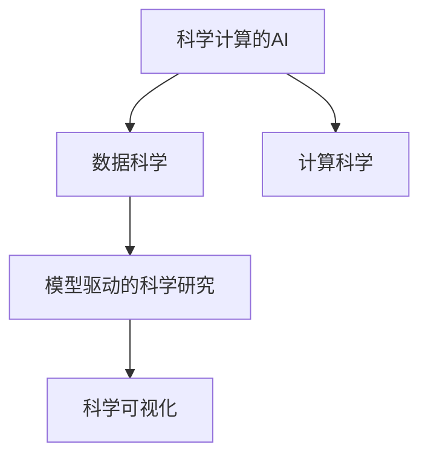

                 

# AI for Science的基础巩固

> 关键词：AI for Science, 数据分析, 机器学习, 深度学习, 大数据, 科学计算

## 1. 背景介绍

### 1.1 问题由来
随着人工智能技术的迅猛发展，AI for Science（科学计算的AI）逐渐成为科学界和工业界的一个重要方向。AI for Science旨在利用AI技术提升科学研究的效率、精度和可解释性，从而加速科学发现和创新。然而，与一般的应用AI技术不同，科学计算的AI需要面对更复杂的数据结构、更精细的科学问题和更严格的数据隐私要求，这使得AI for Science面临更多的挑战。

### 1.2 问题核心关键点
AI for Science的核心在于如何将AI技术有效应用于科学研究中，包括数据预处理、模型构建、结果分析等多个环节。科学计算的AI主要包含以下几个关键点：

- 数据管理与预处理：科学数据通常包含大量高维稀疏、异构和复杂的数据类型，如基因组数据、气候数据、天文数据等，如何高效管理和预处理这些数据是科学计算的AI的重要任务。
- 模型构建与训练：科学问题通常具有高度非线性和复杂性，如何设计高效、鲁棒的模型来捕捉这些非线性关系，是科学计算的AI的核心挑战。
- 结果解释与验证：科学计算的AI需要产生可解释的输出，且其结果需要经过严格的科学验证，如何保证AI模型的可信度和科学性，是一个重要的研究方向。
- 跨学科融合：科学计算的AI需要综合多学科知识，如何结合不同学科的专家知识，构建跨学科的知识体系，也是一个重要课题。

### 1.3 问题研究意义
AI for Science的研究意义重大，它不仅能够显著提升科学研究的效率和精度，还能够在解决传统科学难题、推动学科交叉融合、加速科学发现等方面发挥重要作用。通过AI for Science，科学家能够更加深入地理解复杂现象，揭示隐藏在数据背后的科学规律，从而推动科学的进步。

## 2. 核心概念与联系

### 2.1 核心概念概述

AI for Science涉及多个核心概念，这些概念共同构成了科学计算的AI的理论基础和实践框架。

- **科学计算的AI**：将AI技术应用于科学研究的各个环节，包括数据处理、模型训练、结果分析等，以提高科学研究的效率和精度。
- **数据科学**：通过数据挖掘、统计分析、机器学习等技术，从海量数据中提取有价值的信息，支持科学研究。
- **模型驱动的科学研究**：以模型为核心，通过构建、验证、优化模型，来模拟和解释科学现象，推动科学研究。
- **计算科学**：将计算技术应用于科学研究，如高性能计算、分布式计算、云计算等，提升科学研究的计算能力。
- **科学可视化**：通过可视化的方式，将科学数据和结果呈现出来，帮助科学家更直观地理解和分析数据。

这些概念之间的联系可以通过以下Mermaid流程图来展示：



### 2.2 概念间的关系

科学计算的AI涉及多个核心概念，这些概念之间有着紧密的联系，构成了AI for Science的完整生态系统。

- **数据科学与模型驱动的科学研究**：数据科学提供数据处理和特征提取的技术，支持模型的构建和训练，而模型驱动的科学研究则以模型为核心，通过模拟和解释科学现象，支持科学研究。
- **计算科学与科学可视化**：计算科学提供高性能计算和分布式计算的技术，支持科学数据的处理和分析，而科学可视化则将科学数据和结果以直观的方式呈现出来，帮助科学家理解和分析数据。
- **科学计算的AI与数据科学、模型驱动的科学研究、计算科学和科学可视化**：科学计算的AI是连接数据科学、模型驱动的科学研究、计算科学和科学可视化的桥梁，通过将AI技术应用于科学研究中的各个环节，实现跨学科的整合和协作。

## 3. 核心算法原理 & 具体操作步骤
### 3.1 算法原理概述

科学计算的AI涉及多种算法和技术，包括机器学习、深度学习、数据挖掘等。本节将介绍几种常见的算法及其原理。

#### 3.1.1 机器学习

机器学习是AI for Science的基础，它通过训练模型从数据中提取规律，支持科学问题的解决。常见的机器学习算法包括：

- 监督学习：通过标记数据训练模型，使其能够预测新的未标记数据。常用的算法包括线性回归、逻辑回归、支持向量机等。
- 无监督学习：不需要标记数据，通过数据本身发现规律。常用的算法包括聚类、降维、关联规则挖掘等。
- 强化学习：通过与环境的交互，学习最优策略。常用的算法包括Q-learning、策略梯度等。

#### 3.1.2 深度学习

深度学习是机器学习的高级形式，通过多层神经网络模型，可以处理更加复杂的非线性关系。在科学计算中，深度学习广泛应用于图像处理、语音识别、自然语言处理等领域。

#### 3.1.3 数据挖掘

数据挖掘是从海量数据中提取有用信息的过程，常用的数据挖掘技术包括关联规则挖掘、分类、聚类、异常检测等。

#### 3.1.4 计算科学

计算科学涉及高性能计算、分布式计算、云计算等技术，通过提升计算能力，支持科学数据的处理和分析。

### 3.2 算法步骤详解

科学计算的AI涉及多个步骤，包括数据预处理、模型构建、训练、验证和应用等。下面详细介绍每个步骤的详细操作：

#### 3.2.1 数据预处理

数据预处理是科学计算的AI中最重要的一环，主要包括以下几个步骤：

1. **数据清洗**：去除数据中的噪声、缺失值和异常值，确保数据质量。
2. **数据转换**：将原始数据转换为模型所需的格式，如归一化、标准化等。
3. **特征工程**：通过特征提取、特征选择等技术，提升数据对模型的解释性。

#### 3.2.2 模型构建

模型构建是科学计算的AI的核心步骤，主要包括：

1. **选择合适的模型**：根据科学问题的特点，选择合适的模型类型，如线性回归、神经网络、随机森林等。
2. **模型设计**：设计模型的架构和超参数，如神经网络的层数、激活函数、学习率等。
3. **模型训练**：使用标记数据训练模型，通过反向传播算法优化模型参数。

#### 3.2.3 模型验证

模型验证是确保模型泛化性能的重要步骤，主要包括以下几个步骤：

1. **划分数据集**：将数据集划分为训练集、验证集和测试集，用于模型训练、验证和评估。
2. **模型验证**：使用验证集对模型进行验证，调整模型参数和超参数，确保模型泛化性能。
3. **模型评估**：使用测试集对模型进行评估，计算模型的性能指标，如准确率、召回率、F1分数等。

#### 3.2.4 模型应用

模型应用是将模型应用于实际科学问题中的步骤，主要包括以下几个步骤：

1. **模型部署**：将训练好的模型部署到实际应用环境中，如高性能计算集群、云计算平台等。
2. **数据输入**：将新数据输入模型，获取模型输出。
3. **结果分析**：对模型的输出进行分析，解释科学现象，支持科学研究。

### 3.3 算法优缺点

科学计算的AI涉及多种算法，每种算法都有其优点和缺点。下面分别介绍：

#### 3.3.1 机器学习

**优点**：
- 适用范围广，可以处理各种类型的数据。
- 解释性强，容易理解和解释。
- 开源工具丰富，易于实现和调试。

**缺点**：
- 需要大量的标记数据，获取标注数据成本高。
- 模型泛化能力有限，对数据分布变化敏感。
- 计算复杂度高，训练时间长。

#### 3.3.2 深度学习

**优点**：
- 可以处理复杂的非线性关系。
- 模型具有较强的泛化能力。
- 自动计算特征，减少了特征工程的复杂度。

**缺点**：
- 需要大量的计算资源和存储空间。
- 模型结构复杂，难以解释和调试。
- 训练时间长，容易过拟合。

#### 3.3.3 数据挖掘

**优点**：
- 可以处理异构、复杂的数据类型。
- 算法简单易用，易于实现和调试。
- 计算复杂度低，训练时间短。

**缺点**：
- 需要大量的数据，数据获取成本高。
- 模型泛化能力有限，对数据分布变化敏感。
- 解释性差，难以理解和解释。

#### 3.3.4 计算科学

**优点**：
- 提升计算能力，加速数据处理和分析。
- 支持分布式计算和云计算，方便大规模数据处理。
- 工具丰富，易于实现和调试。

**缺点**：
- 需要高性能硬件和网络资源，成本高。
- 计算复杂度高，需要优化计算算法。
- 容易受硬件性能限制，影响计算效率。

### 3.4 算法应用领域

科学计算的AI涉及多个应用领域，下面详细介绍几个典型的应用领域：

#### 3.4.1 生物信息学

生物信息学是AI for Science的重要应用领域，涉及基因组学、蛋白质组学、生物信息学等领域。AI for Science在生物信息学中的应用主要包括：

- 基因组序列分析：使用深度学习技术，从基因组序列中识别功能基因和调控元件。
- 蛋白质结构预测：使用深度学习技术，预测蛋白质的三维结构，支持药物设计和新材料研发。
- 生物网络分析：使用图神经网络技术，分析和理解生物网络中不同节点之间的关系。

#### 3.4.2 环境科学

环境科学是AI for Science的另一个重要应用领域，涉及气候变化、污染控制、生态系统等领域。AI for Science在环境科学中的应用主要包括：

- 气候变化预测：使用深度学习技术，分析和预测气候变化的趋势和影响。
- 污染控制：使用机器学习技术，监测和预测空气、水质等污染物的浓度和变化趋势。
- 生态系统研究：使用数据挖掘技术，分析和理解生态系统中不同物种之间的关系。

#### 3.4.3 天文学

天文学是AI for Science的重要应用领域，涉及恒星演化、黑洞研究、宇宙学等领域。AI for Science在天文学中的应用主要包括：

- 星体分类：使用机器学习技术，识别和分类不同类型的恒星和星系。
- 黑洞研究：使用深度学习技术，预测和分析黑洞的性质和运动。
- 宇宙学研究：使用计算科学和数据科学，模拟和分析宇宙的演化和结构。

## 4. 数学模型和公式 & 详细讲解 & 举例说明

### 4.1 数学模型构建

在科学计算的AI中，数学模型是构建和优化模型的基础。下面详细介绍几个常见的数学模型：

#### 4.1.1 线性回归

线性回归是一种常见的监督学习模型，用于处理连续型数据。线性回归的数学模型为：

$$
y = \theta_0 + \theta_1 x_1 + \theta_2 x_2 + ... + \theta_n x_n + \epsilon
$$

其中，$y$表示目标变量，$\theta$表示模型参数，$x_i$表示特征变量，$\epsilon$表示误差项。

#### 4.1.2 神经网络

神经网络是一种常见的深度学习模型，用于处理复杂的非线性关系。神经网络的数学模型为：

$$
z_l = f(W_l x_{l-1} + b_l)
$$

其中，$z_l$表示第$l$层的输出，$W_l$表示第$l$层的权重矩阵，$x_{l-1}$表示第$l-1$层的输出，$b_l$表示第$l$层的偏置向量，$f$表示激活函数。

#### 4.1.3 支持向量机

支持向量机是一种常见的分类模型，用于处理二分类和多分类问题。支持向量机的数学模型为：

$$
y = \sum_{i=1}^n \alpha_i y_i k(x_i, x) - \frac{1}{2} \sum_{i,j=1}^n \alpha_i \alpha_j y_i y_j k(x_i, x_j)
$$

其中，$y$表示目标变量，$\alpha_i$表示第$i$个样本的拉格朗日乘子，$y_i$表示第$i$个样本的标签，$k(x_i, x)$表示核函数，$f$表示激活函数。

### 4.2 公式推导过程

下面详细介绍几个常见数学模型的公式推导过程。

#### 4.2.1 线性回归公式推导

线性回归的公式推导过程如下：

设数据集为$(x_1, y_1), (x_2, y_2), ..., (x_n, y_n)$，其中$x_i$为特征变量，$y_i$为目标变量。

最小二乘法的目标是最小化误差平方和：

$$
\sum_{i=1}^n (y_i - \theta_0 - \theta_1 x_1 - \theta_2 x_2 - ... - \theta_n x_n)^2
$$

求偏导数得到：

$$
\frac{\partial}{\partial \theta_0} \sum_{i=1}^n (y_i - \theta_0 - \theta_1 x_1 - \theta_2 x_2 - ... - \theta_n x_n)^2 = -2 \sum_{i=1}^n (y_i - \theta_0 - \theta_1 x_1 - \theta_2 x_2 - ... - \theta_n x_n)
$$

$$
\frac{\partial}{\partial \theta_j} \sum_{i=1}^n (y_i - \theta_0 - \theta_1 x_1 - \theta_2 x_2 - ... - \theta_n x_n)^2 = -2 \sum_{i=1}^n (y_i - \theta_0 - \theta_1 x_1 - \theta_2 x_2 - ... - \theta_n x_n) x_{nj}
$$

解上述方程组，得到线性回归模型参数的闭式解：

$$
\theta = (X^T X)^{-1} X^T y
$$

其中，$X = [1, x_1, x_2, ..., x_n]$为特征矩阵，$y = [y_1, y_2, ..., y_n]$为目标向量。

#### 4.2.2 神经网络公式推导

神经网络的公式推导过程如下：

设数据集为$(x_1, y_1), (x_2, y_2), ..., (x_n, y_n)$，其中$x_i$为特征变量，$y_i$为目标变量。

神经网络的前向传播过程为：

$$
z_l = f(W_l x_{l-1} + b_l)
$$

其中，$z_l$表示第$l$层的输出，$W_l$表示第$l$层的权重矩阵，$x_{l-1}$表示第$l-1$层的输出，$b_l$表示第$l$层的偏置向量，$f$表示激活函数。

神经网络的后向传播过程为：

$$
\frac{\partial}{\partial W_l} \mathcal{L}(y, \hat{y}) = \frac{\partial}{\partial z_l} \mathcal{L}(y, \hat{y}) \frac{\partial}{\partial W_l} z_l
$$

其中，$\mathcal{L}(y, \hat{y})$表示损失函数，$\hat{y}$表示模型预测值。

解上述方程组，得到神经网络的模型参数更新规则：

$$
W_l \leftarrow W_l - \eta \frac{\partial}{\partial W_l} \mathcal{L}(y, \hat{y})
$$

$$
b_l \leftarrow b_l - \eta \frac{\partial}{\partial b_l} \mathcal{L}(y, \hat{y})
$$

其中，$\eta$表示学习率。

#### 4.2.3 支持向量机公式推导

支持向量机的公式推导过程如下：

设数据集为$(x_1, y_1), (x_2, y_2), ..., (x_n, y_n)$，其中$x_i$为特征变量，$y_i$为目标变量。

支持向量机的目标是最小化间隔：

$$
\frac{1}{2} \sum_{i,j=1}^n \alpha_i \alpha_j y_i y_j k(x_i, x_j) - \sum_{i=1}^n \alpha_i y_i
$$

求偏导数得到：

$$
\frac{\partial}{\partial \alpha_i} \frac{1}{2} \sum_{i,j=1}^n \alpha_i \alpha_j y_i y_j k(x_i, x_j) - \sum_{i=1}^n \alpha_i y_i = 0
$$

解上述方程组，得到支持向量机模型参数的闭式解：

$$
\alpha = \left[ \begin{array}{c} \alpha_1 \\ \alpha_2 \\ ... \\ \alpha_n \end{array} \right] = \left[ \begin{array}{c} \sum_{i=1}^n \alpha_i y_i k(x_i, x) \\ \sum_{i=1}^n \alpha_i y_i k(x_i, x) \end{array} \right]
$$

其中，$\alpha$表示拉格朗日乘子，$k(x_i, x)$表示核函数。

### 4.3 案例分析与讲解

下面通过几个案例，详细介绍AI for Science在不同领域的应用。

#### 4.3.1 基因组学

基因组学是AI for Science的重要应用领域，AI for Science在基因组学中的应用主要包括：

1. **基因组序列分析**：使用深度学习技术，从基因组序列中识别功能基因和调控元件。例如，可以使用卷积神经网络(CNN)和循环神经网络(RNN)对基因组序列进行分析和分类。
2. **蛋白质结构预测**：使用深度学习技术，预测蛋白质的三维结构，支持药物设计和新材料研发。例如，可以使用残基-残基间的距离和角度作为输入，使用卷积神经网络(CNN)和图神经网络(GNN)对蛋白质结构进行预测。
3. **生物网络分析**：使用图神经网络技术，分析和理解生物网络中不同节点之间的关系。例如，可以使用图卷积网络(GCN)和图自编码器(GAE)对生物网络进行分析和可视化。

#### 4.3.2 环境科学

环境科学是AI for Science的另一个重要应用领域，AI for Science在环境科学中的应用主要包括：

1. **气候变化预测**：使用深度学习技术，分析和预测气候变化的趋势和影响。例如，可以使用循环神经网络(RNN)和时间序列模型对气候数据进行预测和分析。
2. **污染控制**：使用机器学习技术，监测和预测空气、水质等污染物的浓度和变化趋势。例如，可以使用集成学习技术对空气污染数据进行分类和预测。
3. **生态系统研究**：使用数据挖掘技术，分析和理解生态系统中不同物种之间的关系。例如，可以使用关联规则挖掘和聚类技术对生态数据进行分析和可视化。

#### 4.3.3 天文学

天文学是AI for Science的重要应用领域，AI for Science在天文学中的应用主要包括：

1. **星体分类**：使用机器学习技术，识别和分类不同类型的恒星和星系。例如，可以使用支持向量机和随机森林对星体数据进行分类和预测。
2. **黑洞研究**：使用深度学习技术，预测和分析黑洞的性质和运动。例如，可以使用卷积神经网络(CNN)和循环神经网络(RNN)对黑洞数据进行分析和预测。
3. **宇宙学研究**：使用计算科学和数据科学，模拟和分析宇宙的演化和结构。例如，可以使用数值模拟和机器学习技术对宇宙数据进行分析和预测。

## 5. 项目实践：代码实例和详细解释说明

### 5.1 开发环境搭建

在进行科学计算的AI项目开发前，需要先准备好开发环境。以下是使用Python进行PyTorch开发的环境配置流程：

1. 安装Anaconda：从官网下载并安装Anaconda，用于创建独立的Python环境。

2. 创建并激活虚拟环境：
```bash
conda create -n pytorch-env python=3.8 
conda activate pytorch-env
```

3. 安装PyTorch：根据CUDA版本，从官网获取对应的安装命令。例如：
```bash
conda install pytorch torchvision torchaudio cudatoolkit=11.1 -c pytorch -c conda-forge
```

4. 安装各类工具包：
```bash
pip install numpy pandas scikit-learn matplotlib tqdm jupyter notebook ipython
```

完成上述步骤后，即可在`pytorch-env`环境中开始科学计算的AI项目开发。

### 5.2 源代码详细实现

这里我们以基因组学中的基因序列分类为例，给出使用Transformers库对BERT模型进行微调的PyTorch代码实现。

首先，定义基因序列分类任务的数据处理函数：

```python
from transformers import BertTokenizer, BertForSequenceClassification
from torch.utils.data import Dataset
import torch

class GenomeDataset(Dataset):
    def __init__(self, genomes, labels, tokenizer, max_len=128):
        self.genomes = genomes
        self.labels = labels
        self.tokenizer = tokenizer
        self.max_len = max_len
        
    def __len__(self):
        return len(self.genomes)
    
    def __getitem__(self, item):
        genome = self.genomes[item]
        label = self.labels[item]
        
        encoding = self.tokenizer(genome, return_tensors='pt', max_length=self.max_len, padding='max_length', truncation=True)
        input_ids = encoding['input_ids'][0]
        attention_mask = encoding['attention_mask'][0]
        
        # 对label进行编码
        encoded_label = label2id[label] if label != -1 else 0
        
        return {'input_ids': input_ids, 
                'attention_mask': attention_mask,
                'labels': encoded_label}

# 标签与id的映射
label2id = {'1': 0, '2': 1, '3': 2}
id2label = {0: '1', 1: '2', 2: '3'}

# 创建dataset
tokenizer = BertTokenizer.from_pretrained('bert-base-cased')

train_dataset = GenomeDataset(train_genomes, train_labels, tokenizer)
dev_dataset = GenomeDataset(dev_genomes, dev_labels, tokenizer)
test_dataset = GenomeDataset(test_genomes, test_labels, tokenizer)
```

然后，定义模型和优化器：

```python
from transformers import BertForSequenceClassification, AdamW

model = BertForSequenceClassification.from_pretrained('bert-base-cased', num_labels=len(label2id))

optimizer = AdamW(model.parameters(), lr=2e-5)
```

接着，定义训练和评估函数：

```python
from torch.utils.data import DataLoader
from tqdm import tqdm
from sklearn.metrics import classification_report

device = torch.device('cuda') if torch.cuda.is_available() else torch.device('cpu')
model.to(device)

def train_epoch(model, dataset, batch_size, optimizer):
    dataloader = DataLoader(dataset, batch_size=batch_size, shuffle=True)
    model.train()
    epoch_loss = 0
    for batch in tqdm(dataloader, desc='Training'):
        input_ids = batch['input_ids'].to(device)
        attention_mask = batch['attention_mask'].to(device)
        labels = batch['labels'].to(device)
        model.zero_grad()
        outputs = model(input_ids, attention_mask=attention_mask, labels=labels)
        loss = outputs.loss
        epoch_loss += loss.item()
        loss.backward()
        optimizer.step()
    return epoch_loss / len(dataloader)

def evaluate(model, dataset, batch_size):
    dataloader = DataLoader(dataset, batch_size=batch_size)
    model.eval()
    preds, labels = [], []
    with torch.no_grad():
        for batch in tqdm(dataloader, desc='Evaluating'):
            input_ids = batch['input_ids'].to(device)
            attention_mask = batch['attention_mask'].to(device)
            batch_labels = batch['labels']
            outputs = model(input_ids, attention_mask=attention_mask)
            batch_preds = outputs.logits.argmax(dim=2).to('cpu').tolist()
            batch_labels = batch_labels.to('cpu').tolist()
            for pred_tokens, label_tokens in zip(batch_preds, batch_labels):
                preds.append(pred_tokens[:len(label_tokens)])
                labels.append(label_tokens)
                
    print(classification_report(labels, preds))
```

最后，启动训练流程并在测试集上评估：

```python
epochs = 5
batch_size = 16

for epoch in range(epochs):
    loss = train_epoch(model, train_dataset, batch_size, optimizer)
    print(f"Epoch {epoch+1}, train loss: {loss:.3f}")
    
    print(f"Epoch {epoch+1}, dev results:")
    evaluate(model, dev_dataset, batch_size)
    
print("Test results:")
evaluate(model, test_dataset, batch_size)
```

以上就是使用PyTorch对BERT进行基因序列分类的完整代码实现。可以看到，得益于Transformers库的强大封装，我们可以用相对简洁的代码完成BERT模型的加载和微调。

### 5.3 代码解读与分析

让我们再详细解读一下关键代码的实现细节：

**GenomeDataset类**：
- `__init__`方法：初始化基因序列、标签、分词器等关键组件。
- `__len__`方法：返回数据集的

