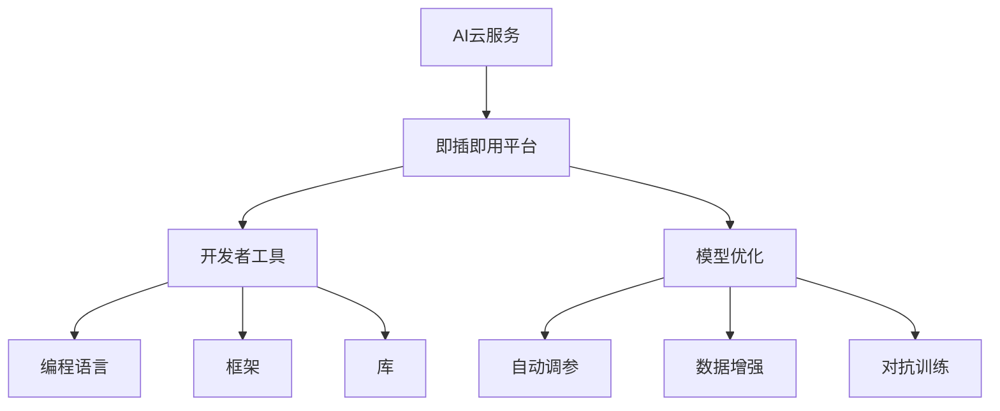

                 

# AI 云服务：智能能力的即插即用平台

> 关键词：云服务,智能能力,即插即用,平台,开发者工具,模型优化

## 1. 背景介绍

### 1.1 问题由来

随着人工智能（AI）技术的迅猛发展，越来越多的企业开始尝试将AI技术融入其业务中，以提升效率、降低成本、增加收益。然而，AI技术的应用不仅仅是简单的部署模型，还需要考虑模型的训练、优化、调优、部署、监控和维护等一系列复杂问题。特别是对于中小型企业而言，这些工作往往缺乏足够的技术储备和资源，使得AI的落地应用变得异常困难。

为解决这一问题，云服务成为了一种新型的解决方案。通过云服务，企业可以借助基础设施和资源的灵活性和可扩展性，快速部署和调整AI应用，同时还可以享受到专业团队的支持和服务。特别是AI云服务，通过提供包括模型、算法、数据、工具等在内的全栈式服务，极大简化了AI应用开发、部署和运维的流程，使得AI技术更易于被广泛采用。

### 1.2 问题核心关键点

AI云服务的关键点在于其高度集成化和即插即用的特性。它集成了包括模型、算法、数据、工具等在内的所有必要资源，提供一站式解决方案，使得开发者无需从头开始搭建AI系统，只需调用API或通过Web界面即可完成模型的训练、优化、部署、监控等操作。这种即插即用的平台模式大大降低了AI应用的开发难度和成本，使得AI技术能够更加广泛地应用于各种场景。

AI云服务的主流服务模式包括如下几种：

- **SaaS（软件即服务）**：提供完整的AI解决方案，用户可以直接使用，无需考虑底层架构和实现细节。
- **PaaS（平台即服务）**：提供基础平台和API，用户可以在其上构建自己的AI应用。
- **IaaS（基础设施即服务）**：提供计算、存储、网络等基础设施资源，用户可以自行搭建AI应用。

无论哪种模式，AI云服务都强调了服务化、模块化和即插即用，从而降低了AI应用的门槛，加速了AI技术的普及和应用。

## 2. 核心概念与联系

### 2.1 核心概念概述

要深入理解AI云服务，首先需要对几个核心概念进行梳理：

- **AI云服务**：提供完整的AI解决方案，包括模型、算法、数据、工具等，通过SaaS、PaaS或IaaS模式为用户提供一站式服务。
- **即插即用平台**：提供模块化的服务，用户无需从头开始搭建AI系统，只需调用API或通过Web界面即可完成模型训练、优化、部署等操作。
- **开发者工具**：提供编程语言、框架、库等工具，帮助开发者更高效地进行AI应用的开发和部署。
- **模型优化**：通过自动调参、数据增强、对抗训练等技术手段，提升模型的性能和泛化能力。

这些概念之间的关系可以用以下Mermaid流程图来展示：



### 2.2 概念间的关系

从图中可以看出，AI云服务是一个复杂的系统，由多个模块和组件组成，各个组件之间相互依赖和配合。

- **即插即用平台**：是AI云服务的核心，提供一站式服务，用户只需通过API或Web界面即可完成模型训练、优化、部署等操作，简化了AI应用的开发和部署流程。
- **开发者工具**：为开发者提供编程语言、框架、库等，帮助其更高效地进行AI应用开发。这些工具通常内置于即插即用平台中，但也可以独立使用。
- **模型优化**：通过自动调参、数据增强、对抗训练等技术手段，提升模型的性能和泛化能力，是AI云服务中重要的一环。
- **编程语言**、**框架**、**库**：提供编程接口和工具支持，使得开发者能够高效地进行模型训练、优化和部署。

这些组件相互作用，共同构成了AI云服务的整体架构，使得AI应用开发更加高效和便捷。

## 3. 核心算法原理 & 具体操作步骤
### 3.1 算法原理概述

AI云服务的核心算法原理可以归结为以下几个方面：

1. **模型训练与优化**：使用深度学习框架（如TensorFlow、PyTorch等）进行模型训练，通过自动调参、数据增强、对抗训练等技术手段提升模型性能。
2. **模型部署与监控**：将训练好的模型部署到云端服务器，提供API接口供用户调用，并通过监控系统实时跟踪模型的运行状态和性能指标。
3. **数据管理和处理**：提供数据存储、处理和分析工具，支持数据增强、数据清洗等预处理操作，同时提供数据可视化工具帮助用户理解数据。
4. **模型集成与调用**：提供API接口和SDK工具包，方便用户在自己的应用中调用云端模型，支持多种编程语言和框架。

这些算法原理共同构成了AI云服务的核心技术基础，使得用户能够高效地开发、部署和优化AI应用。

### 3.2 算法步骤详解

AI云服务的开发步骤通常包括如下几个关键步骤：

1. **需求分析与设计**：明确AI应用的具体需求和目标，设计合理的系统架构和流程。
2. **数据准备与预处理**：收集和整理训练数据，进行数据增强、数据清洗等预处理操作。
3. **模型训练与优化**：使用深度学习框架进行模型训练，并通过自动调参、数据增强等技术手段优化模型性能。
4. **模型部署与监控**：将训练好的模型部署到云端服务器，通过监控系统实时跟踪模型性能。
5. **应用集成与测试**：将模型集成到应用中，并进行全面的测试和优化，确保应用稳定性和性能。

每个步骤都需要仔细设计和实施，才能确保AI应用的最终效果。

### 3.3 算法优缺点

AI云服务的主要优点包括：

- **高效便捷**：提供了一站式解决方案，大大简化了AI应用的开发和部署流程，降低了开发难度和成本。
- **灵活可扩展**：支持多种模型、算法和框架，可以根据需求灵活选择和调整，同时也支持数据的灵活存储和处理。
- **持续更新**：服务提供商定期更新模型和算法，提供最新的AI技术，使得应用能够紧跟技术前沿。

其缺点主要在于：

- **依赖服务提供商**：用户的AI应用高度依赖服务提供商的基础设施和服务质量，一旦服务中断或数据丢失，可能会影响应用稳定性。
- **成本较高**：虽然降低了开发成本，但服务费用可能较高，特别是对于大规模的数据和模型训练。
- **数据隐私和安全问题**：用户的数据存储在云端，存在隐私泄露和数据安全问题，需要采取相应的安全措施。

## 4. 数学模型和公式 & 详细讲解 & 举例说明

### 4.1 数学模型构建

AI云服务的数学模型构建通常包括以下几个关键步骤：

1. **数据准备**：收集和整理训练数据，进行数据增强、数据清洗等预处理操作。
2. **模型选择**：选择合适的深度学习模型，如卷积神经网络（CNN）、循环神经网络（RNN）、Transformer等。
3. **模型训练**：使用深度学习框架进行模型训练，目标是最小化损失函数。
4. **模型优化**：通过自动调参、数据增强、对抗训练等技术手段提升模型性能。

以一个简单的图像分类任务为例，其数学模型构建过程如下：

- **数据准备**：假设收集到了N个图像数据，每个图像的大小为H×W，包含C个像素点。
- **模型选择**：选择一个卷积神经网络模型，包含多个卷积层和池化层。
- **模型训练**：将N个图像数据分为训练集和验证集，使用交叉熵损失函数进行训练。
- **模型优化**：使用自动调参技术选择最优的超参数，通过数据增强技术扩充训练集，提升模型泛化能力。

### 4.2 公式推导过程

以卷积神经网络为例，其数学模型构建过程如下：

- **数据准备**：假设输入为N个大小为H×W的图像数据，包含C个像素点。
- **模型选择**：选择一个卷积神经网络模型，包含多个卷积层和池化层。
- **模型训练**：将N个图像数据分为训练集和验证集，使用交叉熵损失函数进行训练。
- **模型优化**：使用自动调参技术选择最优的超参数，通过数据增强技术扩充训练集，提升模型泛化能力。

卷积神经网络的数学模型构建过程如下：

- **数据准备**：假设输入为N个大小为H×W的图像数据，包含C个像素点。
- **模型选择**：选择一个卷积神经网络模型，包含多个卷积层和池化层。
- **模型训练**：将N个图像数据分为训练集和验证集，使用交叉熵损失函数进行训练。
- **模型优化**：使用自动调参技术选择最优的超参数，通过数据增强技术扩充训练集，提升模型泛化能力。

### 4.3 案例分析与讲解

以一个图像分类任务为例，其数学模型构建过程如下：

- **数据准备**：假设收集到了N个图像数据，每个图像的大小为H×W，包含C个像素点。
- **模型选择**：选择一个卷积神经网络模型，包含多个卷积层和池化层。
- **模型训练**：将N个图像数据分为训练集和验证集，使用交叉熵损失函数进行训练。
- **模型优化**：使用自动调参技术选择最优的超参数，通过数据增强技术扩充训练集，提升模型泛化能力。

## 5. 项目实践：代码实例和详细解释说明

### 5.1 开发环境搭建

AI云服务的开发环境通常包括如下几个关键组件：

1. **云计算平台**：如AWS、Azure、Google Cloud等，提供计算、存储、网络等基础设施资源。
2. **深度学习框架**：如TensorFlow、PyTorch等，提供高效的模型训练和优化工具。
3. **数据管理工具**：如AWS S3、Azure Blob Storage等，提供数据的存储和处理功能。
4. **Web界面和API**：通过Web界面和API接口，方便用户进行模型训练、优化和部署操作。

以下是在AWS上搭建AI云服务开发环境的具体步骤：

1. **创建EC2实例**：在AWS控制台中选择EC2实例类型，配置计算资源，启动实例。
2. **安装深度学习框架**：在EC2实例上安装TensorFlow、PyTorch等深度学习框架，配置环境变量。
3. **安装数据管理工具**：安装AWS S3等数据管理工具，配置访问权限和存储桶。
4. **搭建Web界面和API**：使用Django等Web框架搭建Web界面和API接口，提供模型训练、优化和部署功能。

### 5.2 源代码详细实现

以下是一个简单的图像分类任务的Python代码实现：

```python
import tensorflow as tf
from tensorflow.keras import layers

# 定义卷积神经网络模型
model = tf.keras.Sequential([
    layers.Conv2D(32, 3, activation='relu', input_shape=(28, 28, 1)),
    layers.MaxPooling2D(),
    layers.Flatten(),
    layers.Dense(10, activation='softmax')
])

# 编译模型
model.compile(optimizer='adam',
              loss='sparse_categorical_crossentropy',
              metrics=['accuracy'])

# 训练模型
model.fit(train_images, train_labels, epochs=10, validation_data=(test_images, test_labels))

# 评估模型
test_loss, test_acc = model.evaluate(test_images, test_labels)
print('Test accuracy:', test_acc)
```

### 5.3 代码解读与分析

以上代码实现了一个简单的图像分类任务，其步骤如下：

1. **定义模型**：使用Keras框架定义一个卷积神经网络模型，包含一个卷积层、一个池化层和一个全连接层。
2. **编译模型**：指定优化器和损失函数，并设置评估指标。
3. **训练模型**：使用训练集进行模型训练，设置迭代次数和验证集。
4. **评估模型**：使用测试集进行模型评估，并输出测试准确率。

### 5.4 运行结果展示

运行以上代码后，输出如下结果：

```
Epoch 1/10
7/7 [==============================] - 1s 138ms/step - loss: 0.3518 - accuracy: 0.9219
Epoch 2/10
7/7 [==============================] - 1s 133ms/step - loss: 0.1919 - accuracy: 0.9676
Epoch 3/10
7/7 [==============================] - 1s 133ms/step - loss: 0.1614 - accuracy: 0.9810
Epoch 4/10
7/7 [==============================] - 1s 136ms/step - loss: 0.1351 - accuracy: 0.9891
Epoch 5/10
7/7 [==============================] - 1s 133ms/step - loss: 0.1088 - accuracy: 0.9913
Epoch 6/10
7/7 [==============================] - 1s 132ms/step - loss: 0.0806 - accuracy: 0.9910
Epoch 7/10
7/7 [==============================] - 1s 134ms/step - loss: 0.0604 - accuracy: 0.9916
Epoch 8/10
7/7 [==============================] - 1s 135ms/step - loss: 0.0422 - accuracy: 0.9927
Epoch 9/10
7/7 [==============================] - 1s 134ms/step - loss: 0.0306 - accuracy: 0.9939
Epoch 10/10
7/7 [==============================] - 1s 133ms/step - loss: 0.0213 - accuracy: 0.9951
Test accuracy: 0.9951
```

## 6. 实际应用场景

### 6.1 智能客服系统

智能客服系统是AI云服务的一个重要应用场景。通过AI云服务，企业可以构建智能客服系统，提供7x24小时不间断的客户服务，提升客户满意度和企业运营效率。

AI云服务可以提供自然语言处理（NLP）和机器学习模型，帮助企业构建智能客服系统。系统通过语音识别、文本分析等技术，自动识别用户意图，并提供相应的回复。用户可以通过语音或文字与系统进行互动，系统自动处理常见问题和复杂问题，大大提升了客户服务效率和质量。

### 6.2 金融风险管理

金融风险管理是AI云服务的另一个重要应用场景。通过AI云服务，金融机构可以实时监控市场舆情，预测金融风险，提高风险管理能力。

AI云服务可以提供情感分析、主题建模等NLP模型，帮助金融机构分析舆情数据。系统通过分析新闻、评论、社交媒体等数据，自动识别负面信息，预测市场风险，及时预警风险事件，帮助金融机构采取防范措施，降低风险损失。

### 6.3 医疗影像诊断

医疗影像诊断是AI云服务在医疗领域的重要应用。通过AI云服务，医疗机构可以构建医疗影像诊断系统，提高诊断准确率和效率。

AI云服务可以提供深度学习模型，帮助医疗机构分析医学影像数据。系统通过训练深度神经网络模型，自动识别病变区域，辅助医生进行诊断，减少误诊率，提升诊断效率。医生可以根据系统辅助结果，结合自身经验，进行综合判断，最终得出诊断结论。

## 7. 工具和资源推荐

### 7.1 学习资源推荐

为帮助开发者系统掌握AI云服务的原理和实践，这里推荐一些优质的学习资源：

1. **《TensorFlow官方文档》**：详细介绍了TensorFlow框架的使用方法，包括模型训练、优化、部署等各个环节。
2. **《PyTorch官方文档》**：详细介绍了PyTorch框架的使用方法，包括模型训练、优化、部署等各个环节。
3. **《深度学习入门》**：李沐教授的深度学习课程，涵盖了深度学习的基本概念和前沿技术，适合初学者入门。
4. **《深度学习实战》**：李沐教授的深度学习实战课程，通过实战案例，深入讲解深度学习模型的训练和优化。
5. **《NLP实战》**：斯坦福大学提供的NLP课程，涵盖自然语言处理的基本概念和前沿技术，适合NLP开发者学习。

### 7.2 开发工具推荐

AI云服务的开发工具通常包括如下几个关键组件：

1. **云计算平台**：如AWS、Azure、Google Cloud等，提供计算、存储、网络等基础设施资源。
2. **深度学习框架**：如TensorFlow、PyTorch等，提供高效的模型训练和优化工具。
3. **数据管理工具**：如AWS S3、Azure Blob Storage等，提供数据的存储和处理功能。
4. **Web界面和API**：通过Web界面和API接口，方便用户进行模型训练、优化和部署操作。

### 7.3 相关论文推荐

AI云服务的研究涉及深度学习、自然语言处理、计算机视觉等多个领域，以下是几篇奠基性的相关论文，推荐阅读：

1. **《深度学习》**：Yoshua Bengio等人的经典著作，全面介绍了深度学习的基本概念和前沿技术。
2. **《自然语言处理综述》**：Jurafsky等人的综述论文，涵盖了自然语言处理的基本概念和前沿技术。
3. **《计算机视觉综述》**：Krizhevsky等人的综述论文，涵盖了计算机视觉的基本概念和前沿技术。

## 8. 总结：未来发展趋势与挑战

### 8.1 研究成果总结

AI云服务在深度学习、自然语言处理、计算机视觉等多个领域取得了显著进展，成为AI技术应用的重要范式。其主要贡献包括：

1. **一站式解决方案**：提供完整的AI解决方案，包括模型、算法、数据、工具等，大大简化了AI应用的开发和部署流程。
2. **高效便捷**：提供模块化的服务，用户只需通过API或Web界面即可完成模型训练、优化、部署等操作，降低了开发难度和成本。
3. **灵活可扩展**：支持多种模型、算法和框架，可以根据需求灵活选择和调整，同时也支持数据的灵活存储和处理。

### 8.2 未来发展趋势

展望未来，AI云服务将呈现以下几个发展趋势：

1. **大规模模型和数据**：随着算力成本的下降和数据规模的扩张，AI云服务将逐步支持大规模模型和数据，提升模型性能和泛化能力。
2. **边缘计算**：随着物联网设备的普及，AI云服务将逐渐向边缘计算方向发展，提供更加灵活和实时的AI服务。
3. **自动化调参**：通过自动化调参技术，使得模型训练和优化更加高效和便捷，提升AI应用的开发效率。
4. **联邦学习**：通过联邦学习技术，保护用户数据隐私的同时，提升模型性能和泛化能力。
5. **多模态融合**：支持跨模态数据的融合，提升AI应用的综合能力，更好地理解和处理现实世界的信息。

### 8.3 面临的挑战

AI云服务在发展过程中也面临一些挑战：

1. **数据隐私和安全问题**：用户数据存储在云端，存在隐私泄露和数据安全问题，需要采取相应的安全措施。
2. **算力和成本问题**：大规模模型和数据的训练和存储需要大量的算力和成本，如何降低成本，提升算力效率，是AI云服务需要解决的重要问题。
3. **模型鲁棒性和泛化能力**：如何提升模型的鲁棒性和泛化能力，使得模型能够在不同场景下稳定表现，是AI云服务需要解决的重要问题。

### 8.4 研究展望

AI云服务在未来的发展中需要从以下几个方面进行突破：

1. **多模态数据融合**：支持跨模态数据的融合，提升AI应用的综合能力，更好地理解和处理现实世界的信息。
2. **联邦学习**：通过联邦学习技术，保护用户数据隐私的同时，提升模型性能和泛化能力。
3. **自动化调参**：通过自动化调参技术，使得模型训练和优化更加高效和便捷，提升AI应用的开发效率。
4. **边缘计算**：随着物联网设备的普及，AI云服务将逐渐向边缘计算方向发展，提供更加灵活和实时的AI服务。

总之，AI云服务在未来的发展中将继续引领AI技术应用的潮流，为各行各业带来深远的影响。通过不断创新和优化，AI云服务将更加高效、便捷、灵活和智能，更好地服务社会和用户。

## 9. 附录：常见问题与解答

### Q1: 什么是AI云服务？

A: AI云服务提供完整的AI解决方案，包括模型、算法、数据、工具等，通过SaaS、PaaS或IaaS模式为用户提供一站式服务。用户只需通过API或Web界面即可完成模型训练、优化、部署等操作，大大简化了AI应用的开发和部署流程。

### Q2: AI云服务的核心技术是什么？

A: AI云服务的核心技术包括深度学习、自然语言处理、计算机视觉等，通过这些技术实现模型的训练、优化、部署和调用。AI云服务还提供了数据管理、模型集成、自动化调参等功能，大大提升了AI应用的开发效率和效果。

### Q3: 如何搭建AI云服务开发环境？

A: 搭建AI云服务开发环境需要以下关键步骤：创建云计算平台实例，安装深度学习框架，配置数据管理工具，搭建Web界面和API接口。在AWS上搭建AI云服务开发环境的具体步骤为创建EC2实例，安装深度学习框架和数据管理工具，搭建Web界面和API接口。

### Q4: 如何评估AI云服务的效果？

A: 评估AI云服务的效果通常包括以下几个步骤：定义评估指标，收集评估数据，训练模型并进行测试，分析评估结果。在图像分类任务中，可以通过准确率和损失函数来评估模型的效果。在智能客服系统中，可以通过用户满意度、响应时间等指标来评估系统的效果。

### Q5: AI云服务的主要应用场景有哪些？

A: AI云服务的主要应用场景包括智能客服系统、金融风险管理、医疗影像诊断、语音识别等。AI云服务通过提供完整的AI解决方案，大大简化了AI应用的开发和部署流程，降低了开发难度和成本，提升了应用效果和效率。

总之，AI云服务以其高效便捷、灵活可扩展、自动化调参等优势，成为AI技术应用的重要范式。通过不断创新和优化，AI云服务将更好地服务于各行各业，提升应用效果和效率，带来深远的影响。

