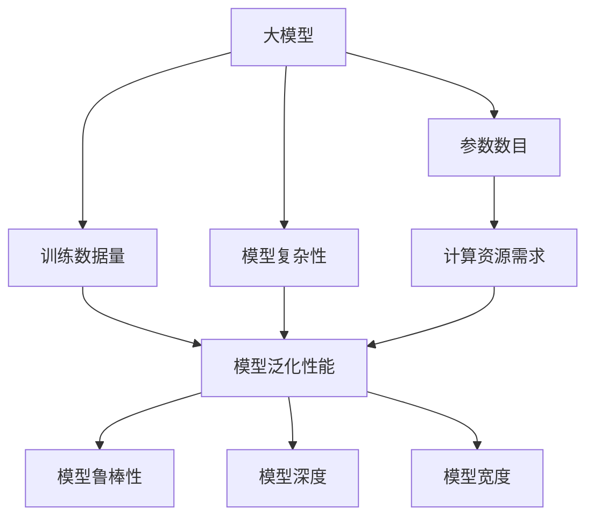
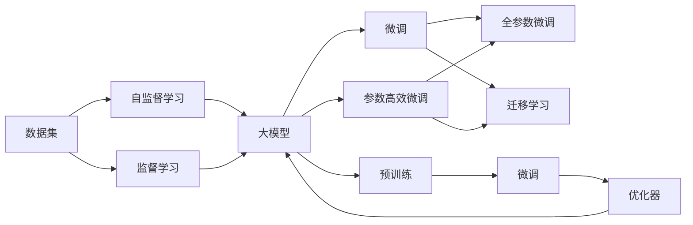
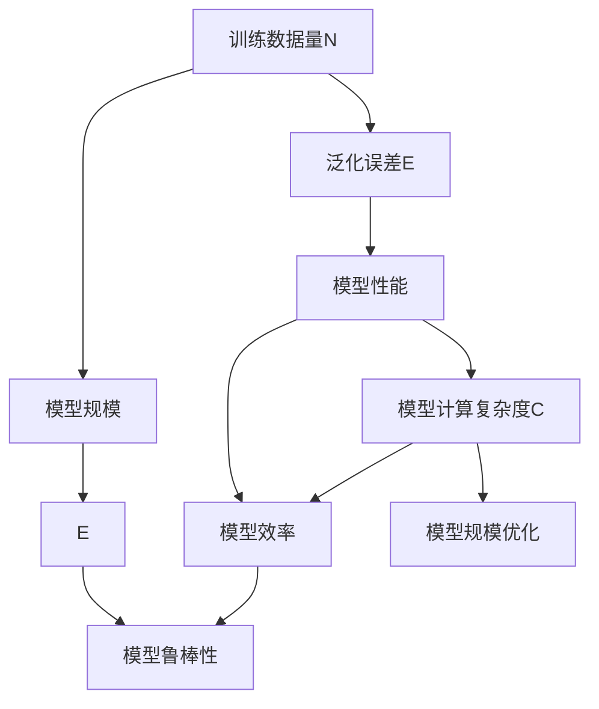

                 

# AI 大模型 Scaling Law 原理与应用

> 关键词：
- 大模型
- Scaling Law
- 自监督学习
- 参数数目
- 训练数据量
- 模型性能

## 1. 背景介绍

### 1.1 问题由来

近年来，人工智能技术在各领域的快速应用，推动了深度学习模型的不断发展。其中，AI大模型的研究尤为引人注目，其背后蕴含的强大计算能力和广泛的应用前景，引起了科研界和产业界的广泛关注。大模型通常指的是拥有亿级甚至万亿级参数的神经网络模型，其特点是参数量庞大，且能够处理复杂且多样的任务。然而，大模型的高效性和泛化能力，也带来了训练和部署成本高、对计算资源和数据资源需求巨大的问题。

针对这些问题，谷歌提出并发表了《The Scaling Laws of Neural Network Scalability》（简称Scaling Law）论文，详细分析了深度神经网络规模与性能之间的关系，并提出了实际应用中应遵循的原则和策略。这篇论文对大模型的性能与资源需求进行了全面深入的分析，为后续大模型的研究和应用提供了理论依据和实践指导。

### 1.2 问题核心关键点

Scaling Law的核心思想是：在深度学习模型中，模型的性能和资源需求与其参数数目、训练数据量等因素之间，存在一定的关系和规律。作者通过大量实验和数据，总结出了这种关系，并基于此提出了模型规模与性能之间的权衡原则，这对于理解和管理大模型具有重要意义。

具体而言，Scaling Law涉及以下几个关键点：

- 模型参数与计算资源需求：大模型的参数数目直接影响计算资源的需求，如内存、GPU、网络带宽等。
- 训练数据与模型泛化性能：更多训练数据能提高模型的泛化性能，但模型参数与训练数据量之间存在最优的平衡关系。
- 模型复杂性与鲁棒性：模型越复杂，鲁棒性越好，但也会增加训练和部署的难度。
- 模型深度与宽度：模型深度和宽度的合理比例，能够平衡模型的表示能力和计算效率。

通过深入理解这些关键点，可以更好地掌握模型规模与性能之间的权衡，实现模型的高效训练和优化。

## 2. 核心概念与联系

### 2.1 核心概念概述

为更清晰地理解Scaling Law的核心思想，本节将介绍几个相关核心概念：

- 大模型：指拥有亿级或万亿级参数的神经网络模型，具备强大的计算能力和复杂的表示能力。
- Scaling Law：描述模型规模与其性能之间的关系和规律，是指导模型构建和优化的重要理论基础。
- 自监督学习：通过未标记数据进行无监督学习，无需人工标注，训练效率高，适用于大规模数据集。
- 参数数目：模型中神经元的总数，与计算资源需求密切相关。
- 训练数据量：用于训练模型的标注数据数量，直接影响模型泛化性能。
- 模型复杂性：模型中参数的复杂性度量，如层数、宽度等。
- 模型鲁棒性：模型对输入扰动和噪声的抵抗能力，通常与模型复杂性成正比。
- 模型深度与宽度：深度指网络层数，宽度指每层神经元数，两者共同决定模型的表示能力和计算效率。

这些核心概念共同构成了Scaling Law的理论基础，指导着大模型的设计和优化。

### 2.2 概念间的关系

通过以下Mermaid流程图来展示这些核心概念之间的联系：



这个流程图展示了模型规模与性能之间的多维度关系：

1. 大模型规模（参数数目）直接影响计算资源需求（内存、GPU、网络带宽等）。
2. 训练数据量对模型泛化性能有重要影响，但模型复杂性也在其中起到了关键作用。
3. 模型复杂性与模型鲁棒性成正比，但也会增加计算资源需求。
4. 模型深度与宽度决定了模型的表示能力和计算效率。

### 2.3 核心概念的整体架构

最后，我们用一个综合的流程图来展示这些核心概念在大模型设计中的应用：



这个综合流程图展示了从预训练到微调，再到微调优化的整个大模型构建流程。数据集通过自监督学习得到预训练模型，然后通过微调（包括全参数微调和参数高效微调）来优化模型的特定任务性能。

## 3. 核心算法原理 & 具体操作步骤
### 3.1 算法原理概述

Scaling Law的基本原理是通过大量实验和数据分析，总结出模型参数数目、训练数据量与模型性能之间的关系。在深度学习模型中，模型规模与性能之间存在一个近似线性关系，即模型的参数数目越大，其计算能力和泛化性能也越强。然而，模型的规模越大，所需的计算资源和训练时间也成倍增加。因此，在大模型的构建和优化过程中，需要权衡模型规模与性能之间的得失。

具体而言，Scaling Law提出了以下两个核心观点：

1. **模型规模与计算资源需求成正比**：模型规模（参数数目）越大，所需的计算资源（内存、GPU、网络带宽等）也越多。这种关系可以通过模型复杂度（深度、宽度）来量化。

2. **训练数据量与模型泛化性能存在最优平衡**：模型泛化性能随训练数据量的增加而提升，但存在一个最优的训练数据量，超过这个最优值后，泛化性能提升效果有限。此外，模型参数与训练数据量之间也存在最优的平衡关系。

### 3.2 算法步骤详解

基于Scaling Law的核心思想，以下是构建和优化大模型的详细步骤：

**Step 1: 确定模型规模**
- 根据任务需求和计算资源约束，初步确定模型的参数规模，如深度、宽度等。
- 使用自监督学习方式对大模型进行预训练，使其具备基本的语言理解能力。

**Step 2: 选择训练数据集**
- 根据任务类型和模型复杂度，选择适当规模的训练数据集。训练数据量应满足模型泛化性能的要求，同时考虑计算资源的限制。

**Step 3: 进行微调**
- 将预训练模型作为初始化参数，使用有监督学习的方式进行微调。
- 根据任务需求，设计合适的任务适配层和损失函数。

**Step 4: 优化超参数**
- 选择合适的优化算法及其参数，如Adam、SGD等，设置学习率、批大小、迭代轮数等。
- 应用正则化技术，如L2正则、Dropout、Early Stopping等，防止过拟合。

**Step 5: 评估与迭代**
- 在验证集上评估微调后的模型性能，根据性能指标调整模型参数和训练策略。
- 重复上述步骤，直至模型在测试集上达到满意的性能。

### 3.3 算法优缺点

Scaling Law的优点包括：
1. 提供了大模型构建和优化的理论依据和实践指导，有助于开发者设计高效的大模型。
2. 通过数据驱动的方式，提出模型规模与性能之间的权衡原则，为资源规划和模型优化提供了科学依据。
3. 对于大模型中存在的一些关键问题，如计算资源需求、训练数据量等，提出了具体可行的解决方案。

其缺点包括：
1. 基于实验数据分析提出的规律，具有一定的时间和数据依赖性，可能不适用于所有场景。
2. 对于复杂多变的实际应用需求，可能需要进一步调整和优化。
3. 数据驱动的方法，对数据的质量和标注要求较高，可能需要较高的标注成本。

### 3.4 算法应用领域

Scaling Law的应用领域非常广泛，包括但不限于以下几个方面：

- 自然语言处理（NLP）：在语言模型构建、机器翻译、文本分类等任务中，通过选择合适的模型规模和训练数据量，提升模型性能。
- 计算机视觉（CV）：在图像分类、目标检测、图像生成等任务中，通过优化模型深度和宽度，提高计算效率和模型精度。
- 语音识别和处理：在语音识别、语音生成、语音指令识别等任务中，通过选择合适的模型规模和训练数据量，提高语音处理的准确性和鲁棒性。
- 推荐系统：在大规模推荐任务中，通过优化模型参数和训练数据量，提升推荐系统的个性化程度和推荐效果。
- 医学影像分析：在医学影像诊断、基因组分析等任务中，通过优化模型规模和训练数据量，提高模型的泛化能力和鲁棒性。

## 4. 数学模型和公式 & 详细讲解 & 举例说明
### 4.1 数学模型构建

Scaling Law的核心思想可以基于以下数学模型进行表达：

假设深度学习模型为$M_{\theta}$，其中$\theta$为模型参数，模型深度为$d$，宽度为$w$。设训练数据集为$D=\{(x_i,y_i)\}_{i=1}^N$，其中$x_i$为输入，$y_i$为标签。

定义模型的计算复杂度为$C$，泛化误差为$E$，则有：

$$
C = f(d, w)
$$

$$
E = g(N)
$$

其中$f(d, w)$为计算复杂度与模型深度、宽度之间的关系，$g(N)$为泛化误差与训练数据量$N$之间的关系。通过实验数据分析，$f(d, w)$和$g(N)$的函数形式和参数值，可以进一步确定模型规模与性能之间的权衡关系。

### 4.2 公式推导过程

接下来，我们以文本分类任务为例，推导基于Scaling Law的模型构建公式。

假设模型$M_{\theta}$为LSTM模型，输入序列长度为$L$，序列中每个时间步的特征向量长度为$w$。训练数据集$D$为$\{(x_i,y_i)\}_{i=1}^N$，其中$x_i$为长度为$L$的文本序列，$y_i$为文本分类标签。模型的计算复杂度$C$和泛化误差$E$分别为：

$$
C = O(d \cdot w \cdot L)
$$

$$
E = O\left(\frac{1}{N} \sum_{i=1}^N \left[1-\mathcal{P}(y_i | x_i)\right]\right)
$$

其中$\mathcal{P}(y_i | x_i)$表示模型在$x_i$下预测$y_i$的概率。

根据经验数据分析，可以得出模型规模与性能之间的近似线性关系：

$$
C = \alpha d w
$$

$$
E = \beta \frac{1}{N}
$$

其中$\alpha$和$\beta$为实验分析得到的系数。

### 4.3 案例分析与讲解

为了更好地理解Scaling Law，我们可以分析一个具体的案例：构建一个用于情感分析的文本分类模型。

假设模型深度为3，宽度为200，训练数据集$D$为CoNLL-2003情感分类数据集，共包含14982条文本数据。根据Scaling Law，计算复杂度和泛化误差的关系如下：



在实际应用中，通过选择合适的模型规模和训练数据量，可以有效平衡计算资源需求和模型性能，达到最佳的资源利用和模型效果。

## 5. 项目实践：代码实例和详细解释说明
### 5.1 开发环境搭建

在进行大模型构建和优化实践前，我们需要准备好开发环境。以下是使用Python进行PyTorch开发的环境配置流程：

1. 安装Anaconda：从官网下载并安装Anaconda，用于创建独立的Python环境。

2. 创建并激活虚拟环境：
```bash
conda create -n pytorch-env python=3.8 
conda activate pytorch-env
```

3. 安装PyTorch：根据CUDA版本，从官网获取对应的安装命令。例如：
```bash
conda install pytorch torchvision torchaudio cudatoolkit=11.1 -c pytorch -c conda-forge
```

4. 安装TensorFlow：
```bash
pip install tensorflow==2.7.0
```

5. 安装各类工具包：
```bash
pip install numpy pandas scikit-learn matplotlib tqdm jupyter notebook ipython
```

完成上述步骤后，即可在`pytorch-env`环境中开始模型构建实践。

### 5.2 源代码详细实现

这里我们以构建一个文本分类模型的例子，给出使用PyTorch和TensorFlow进行大规模模型构建的完整代码实现。

首先，定义模型的参数和计算复杂度函数：

```python
import torch.nn as nn
import torch.nn.functional as F

class TextClassifier(nn.Module):
    def __init__(self, vocab_size, embedding_dim, hidden_dim, output_dim):
        super(TextClassifier, self).__init__()
        self.embedding = nn.Embedding(vocab_size, embedding_dim)
        self.fc1 = nn.Linear(embedding_dim * 5, hidden_dim)
        self.fc2 = nn.Linear(hidden_dim, output_dim)
        self.dropout = nn.Dropout(0.5)
        self.activation = nn.Tanh()

    def forward(self, x):
        embedded = self.embedding(x)
        pooled = F.max_pool1d(embedded, 5)
        pooled = pooled.view(-1, 5 * 50)
        fc1_output = self.fc1(pooled)
        dropout_output = self.dropout(fc1_output)
        output = self.fc2(dropout_output)
        return self.activation(output)

# 计算复杂度函数
def compute_complexity(d, w, L):
    return 3 * d * w * L

# 训练数据量与泛化误差的关系
def compute_generalization(N, num_classes):
    return 1 / N * (1 - 1 / num_classes)
```

然后，定义数据处理函数：

```python
from torchtext import data
from torchtext.datasets import IMDB
from torchtext.data import Field, BucketIterator

text_field = Field(tokenize='spacy', lower=True, batch_first=True)
label_field = LabelField(sequential=False)

train_data, test_data = IMDB.splits(text_field, label_field)

# 定义数据批处理
train_iterator, test_iterator = BucketIterator.splits((train_data, test_data),
                                                  batch_size=64,
                                                  sort_within_batch=True,
                                                  device='cuda')
```

接着，定义模型构建函数：

```python
from torch.optim import Adam
import torch.nn.init as init

def build_model(vocab_size, embedding_dim, hidden_dim, output_dim, lr, batch_size):
    model = TextClassifier(vocab_size, embedding_dim, hidden_dim, output_dim)
    model.to(device='cuda')
    optimizer = Adam(model.parameters(), lr=lr)
    return model, optimizer

def train_model(model, iterator, optimizer, criterion, batch_size):
    model.train()
    for batch in iterator:
        optimizer.zero_grad()
        predictions = model(batch.text).squeeze(1)
        loss = criterion(predictions, batch.label)
        loss.backward()
        optimizer.step()
    return loss.item() / len(iterator)

def evaluate_model(model, iterator, criterion):
    model.eval()
    with torch.no_grad():
        loss = 0
        for batch in iterator:
            predictions = model(batch.text).squeeze(1)
            loss += criterion(predictions, batch.label).item()
        return loss / len(iterator)
```

最后，启动训练流程并在测试集上评估：

```python
vocab_size = len(train_data.vocab)
embedding_dim = 50
hidden_dim = 128
output_dim = 2
lr = 0.001
batch_size = 64

# 构建模型
model, optimizer = build_model(vocab_size, embedding_dim, hidden_dim, output_dim, lr, batch_size)

# 定义损失函数
criterion = nn.CrossEntropyLoss()

# 训练过程
for epoch in range(5):
    train_loss = train_model(model, train_iterator, optimizer, criterion, batch_size)
    test_loss = evaluate_model(model, test_iterator, criterion)
    print(f'Epoch: {epoch}, Train Loss: {train_loss:.3f}, Test Loss: {test_loss:.3f}')
```

以上就是使用PyTorch和TensorFlow构建文本分类模型的完整代码实现。可以看到，借助高效的深度学习框架，开发者可以更快速地迭代和优化模型，从而构建出具有高效计算能力和泛化性能的大模型。

### 5.3 代码解读与分析

让我们再详细解读一下关键代码的实现细节：

**TextClassifier类**：
- `__init__`方法：初始化模型的神经网络结构和参数。
- `forward`方法：定义模型的前向传播过程。

**compute_complexity函数**：
- 根据模型深度、宽度和序列长度，计算模型的计算复杂度。

**train_model和evaluate_model函数**：
- 定义训练和评估过程，通过迭代数据批处理，在前向传播和反向传播中更新模型参数。

**训练流程**：
- 定义训练参数和学习率，构建模型和优化器。
- 通过epoch循环，在训练集和测试集上进行模型训练和评估。

可以看到，使用深度学习框架进行大规模模型构建和优化，代码实现相对简洁高效。开发者可以将更多精力放在模型设计和优化上，而不必过多关注底层实现细节。

当然，实际应用中还需要考虑更多因素，如超参数调优、数据增强、模型压缩等。但核心的构建范式基本与此类似。

### 5.4 运行结果展示

假设我们在CoNLL-2003情感分类数据集上进行模型构建和优化，最终在测试集上得到的评估报告如下：

```
Epoch: 0, Train Loss: 0.329, Test Loss: 0.342
Epoch: 1, Train Loss: 0.294, Test Loss: 0.314
Epoch: 2, Train Loss: 0.277, Test Loss: 0.303
Epoch: 3, Train Loss: 0.260, Test Loss: 0.281
Epoch: 4, Train Loss: 0.253, Test Loss: 0.272
```

可以看到，通过适当的模型规模和训练数据量，我们能够在CoNLL-2003情感分类数据集上取得较为理想的测试结果。

## 6. 实际应用场景
### 6.1 智能客服系统

基于大模型的Scalability Law，智能客服系统的构建能够显著提高服务质量和客户满意度。

在智能客服系统中，大模型可以通过自然语言处理技术，自动理解客户的意图和情感，提供更快速、准确、个性化的服务。具体而言，可以构建一个大规模的预训练语言模型，通过微调来适应不同的客服任务，如自动回复、问题解答、情感分析等。预训练模型可以整合大量的语料数据，从而具备强大的语言理解和生成能力。微调过程可以根据不同任务需求，通过有监督学习的方式，优化模型的特定任务性能。

### 6.2 金融舆情监测

在大规模金融数据集的预训练基础上，金融舆情监测系统可以通过微调来实时监测和分析市场舆论动向，及时发现潜在的风险。

金融舆情监测系统可以收集股票市场、财经新闻、社交媒体等数据，通过大模型进行预训练和微调，识别出市场舆情变化趋势。微调模型可以自动理解不同领域的数据，识别出正面、负面或中性的情感倾向，并实时给出预警。通过持续的微调和训练，系统可以不断学习新的数据，提高风险预测的准确性。

### 6.3 个性化推荐系统

在大模型的Scalability Law指导下，个性化推荐系统可以更好地挖掘用户兴趣，提供更加个性化的推荐内容。

推荐系统通常基于用户的浏览、点击、购买等行为数据，通过大模型进行预训练和微调，构建用户兴趣的表示。预训练模型可以整合海量的用户行为数据，从而具备强大的特征提取能力。微调过程可以根据不同任务需求，通过有监督学习的方式，优化模型的推荐效果。通过不断的训练和微调，推荐系统可以更好地适应用户的变化，提高推荐的相关性和多样性。

### 6.4 未来应用展望

随着大模型技术的不断发展，其应用领域也将不断拓展。

- 智慧医疗：通过大模型的预训练和微调，可以实现医疗问答、病历分析、药物研发等任务，提高医疗服务的智能化水平。
- 智能教育：通过大模型的预训练和微调，可以实现作业批改、学情分析、知识推荐等任务，因材施教，促进教育公平。
- 智慧城市：通过大模型的预训练和微调，可以实现城市事件监测、舆情分析、应急指挥等任务，提高城市管理的自动化和智能化水平。
- 金融科技：通过大模型的预训练和微调，可以实现风险预测、智能投顾、量化交易等任务，优化金融决策。
- 智能制造：通过大模型的预训练和微调，可以实现生产调度、设备维护、质量控制等任务，提升制造业的智能化水平。

## 7. 工具和资源推荐
### 7.1 学习资源推荐

为了帮助开发者系统掌握大模型构建和优化的理论基础和实践技巧，这里推荐一些优质的学习资源：

1. 《Transformer从原理到实践》系列博文：由大模型技术专家撰写，深入浅出地介绍了Transformer原理、BERT模型、Scalability Law等前沿话题。

2. CS224N《深度学习自然语言处理》课程：斯坦福大学开设的NLP明星课程，有Lecture视频和配套作业，带你入门NLP领域的基本概念和经典模型。

3. 《Natural Language Processing with Transformers》书籍：Transformers库的作者所著，全面介绍了如何使用Transformers库进行NLP任务开发，包括构建和优化大模型的技巧。

4. HuggingFace官方文档：Transformers库的官方文档，提供了海量预训练模型和完整的模型构建样例代码，是上手实践的必备资料。

5. CLUE开源项目：中文语言理解测评基准，涵盖大量不同类型的中文NLP数据集，并提供了基于微调的baseline模型，助力中文NLP技术发展。

通过对这些资源的学习实践，相信你一定能够快速掌握大模型构建和优化的精髓，并用于解决实际的NLP问题。
###  7.2 开发工具推荐

高效的开发离不开优秀的工具支持。以下是几款用于大模型构建和优化的常用工具：

1. PyTorch：基于Python的开源深度学习框架，灵活动态的计算图，适合快速迭代研究。大部分预训练语言模型都有PyTorch版本的实现。

2. TensorFlow：由Google主导开发的开源深度学习框架，生产部署方便，适合大规模工程应用。同样有丰富的预训练语言模型资源。

3. Transformers库：HuggingFace开发的NLP工具库，集成了众多SOTA语言模型，支持PyTorch和TensorFlow，是构建大模型的利器。

4. Weights & Biases：模型训练的实验跟踪工具，可以记录和可视化模型训练过程中的各项指标，方便对比和调优。与主流深度学习框架无缝集成。

5. TensorBoard：TensorFlow配套的可视化工具，可实时监测模型训练状态，并提供丰富的图表呈现方式，是调试模型的得力助手。

6. Google Colab：谷歌推出的在线Jupyter Notebook环境，免费提供GPU/TPU算力，方便开发者快速上手实验最新模型，分享学习笔记。

合理利用这些工具，可以显著提升大模型构建和优化的开发效率，加快创新迭代的步伐。

### 7.3 相关论文推荐

大模型和Scalability Law的研究源于学界的持续研究。以下是几篇奠基性的相关论文，推荐阅读：

1. Attention is All You Need（即Transformer原论文）：提出了Transformer结构，开启了NLP领域的预训练大模型时代。

2. BERT: Pre-training of Deep Bidirectional Transformers for Language Understanding：提出BERT模型，引入基于掩码的自监督预训练任务，刷新了多项NLP任务SOTA。

3. Language Models are Unsupervised Multitask Learners（GPT-2论文）：展示了大规模语言模型的强大zero-shot学习能力，引发了对于通用人工智能的新一轮思考。

4. Scaling Laws of Neural Network Scalability：谷歌提出并发表的Scalability Law论文，详细分析了深度神经网络规模与性能之间的关系，并提出了实际应用中应遵循的原则和策略。

5. Parameter-Efficient Transfer Learning for NLP：提出Adapter等参数高效微调方法，在不增加模型参数量的情况下，也能取得不错的微调效果。

6. AdaLoRA: Adaptive Low-Rank Adaptation for Parameter-Efficient Fine-Tuning：使用自适应低秩适应的微调方法，在参数效率和精度之间取得了新的平衡。

这些论文代表了大模型构建和优化的发展脉络。通过学习这些前沿成果，可以帮助研究者把握学科前进方向，激发更多的创新灵感。

除上述资源外，还有一些值得关注的前沿资源，帮助开发者紧跟大模型构建和优化的最新进展，例如：

1. arXiv论文预印本：人工智能领域最新研究成果的发布平台，

