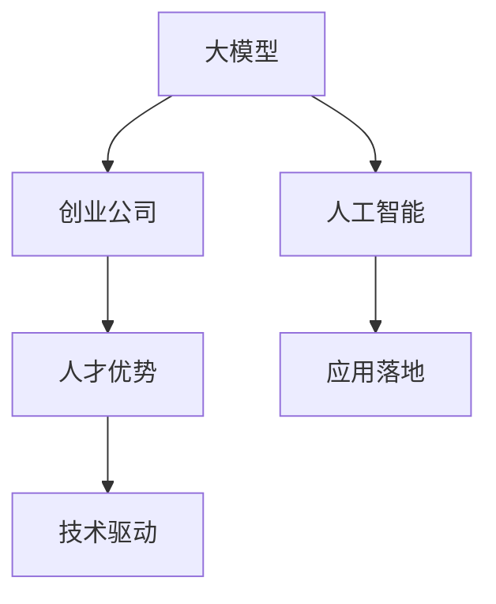
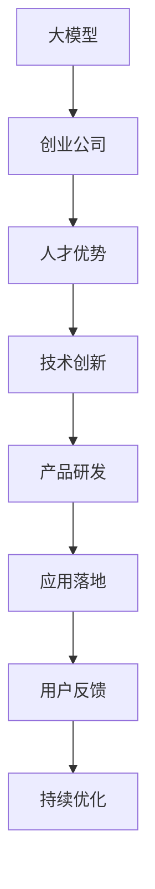

                 

# AI 大模型创业：如何利用人才优势？

> 关键词：大模型,创业,人才优势,人工智能,数据科学,算法开发,模型优化,团队管理,企业文化,创新,创业公司

## 1. 背景介绍

### 1.1 问题由来
随着人工智能(AI)技术的快速发展，特别是大模型（Large Models）如GPT-3、BERT等在自然语言处理（NLP）、计算机视觉（CV）、语音识别（ASR）等领域的出色表现，越来越多的创业公司开始关注大模型技术的应用潜力。然而，如何充分利用这些先进的大模型技术，成为创业公司面临的一大挑战。本文将围绕“如何利用人才优势”这一核心问题，探讨大模型技术在创业公司中的应用策略和成功经验。

### 1.2 问题核心关键点
大模型技术在创业公司中的应用，关键在于如何高效利用人才优势。人才是创业公司最宝贵的资产，如何发掘人才潜力，提升人才效能，是决定公司成败的关键。以下是几个核心关键点：

- **人才招聘与培养**：吸引和培养具备大模型相关技术背景的顶尖人才。
- **团队构建与管理**：组建多学科交叉团队，协同攻关大模型技术应用难题。
- **企业文化与激励**：营造开放创新、协作共赢的企业文化，激励人才充分发挥创造力。
- **创新与项目管理**：推进技术创新，实施有效的项目管理，确保项目高效推进。

### 1.3 问题研究意义
本文旨在为创业公司提供一套科学有效的人才管理策略，帮助其充分利用人才优势，推动大模型技术的应用落地，提升产品竞争力。通过深入分析大模型技术的特点和创业公司的人才优势，提出具体的建议和方法，以期助力更多创业公司在大模型领域取得成功。

## 2. 核心概念与联系

### 2.1 核心概念概述

为更好地理解如何利用人才优势，我们首先介绍几个关键概念：

- **大模型（Large Models）**：指的是通过海量数据训练得到的，参数量极大的神经网络模型，如BERT、GPT-3等。这些模型在各种AI任务上表现出色，被广泛用于NLP、CV、ASR等应用领域。
- **创业公司（Startup）**：指新兴成立的企业，通常专注于某一特定技术或市场领域，以创新为核心驱动力。创业公司的成功在很大程度上依赖于人才的创新能力和执行力。
- **人才优势（Talent Advantage）**：指公司内部拥有具备核心技术、专业技能和创新能力的顶尖人才，能够高效推动技术开发和产品落地。
- **人工智能（AI）**：指通过机器学习、深度学习等技术，实现机器模拟人类智能的应用。AI技术已经成为推动经济社会发展的重要力量。

这些概念之间的联系可以通过以下Mermaid流程图来展示：



这个流程图展示了从大模型到人工智能应用落地的整体架构，其中人才优势是核心推动力。通过利用人才优势，创业公司可以更高效地推动AI技术的实际应用。

### 2.2 概念间的关系

这些核心概念之间的关系可以通过以下Mermaid流程图来展示：



这个流程图展示了从大模型到产品研发再到应用落地的完整流程，其中人才优势在各环节中都起着重要作用。通过不断收集用户反馈并持续优化产品，形成正向循环，最终实现AI技术的应用价值。

## 3. 核心算法原理 & 具体操作步骤
### 3.1 算法原理概述

利用大模型技术推动创业公司应用落地，关键在于高效利用人才优势，提升技术创新和产品开发效率。以下是大模型技术在创业公司应用的算法原理：

1. **数据驱动**：大模型技术依赖于大量标注数据进行预训练。创业公司应充分利用内部数据资源，建立数据管理平台，确保数据的高质量和完整性。
2. **算法优化**：基于大模型的算法优化是技术应用落地的核心。创业公司应组建专业算法团队，进行模型优化和微调，确保模型性能和效率。
3. **团队协作**：大模型技术的应用涉及多个领域，需要多学科交叉团队协同工作。创业公司应通过项目管理工具，实现高效协作，提升团队执行力。
4. **用户反馈**：产品上线后，应持续收集用户反馈，进行迭代优化，确保产品符合用户需求。

### 3.2 算法步骤详解

基于以上算法原理，以下是大模型技术在创业公司应用的具体操作步骤：

**Step 1: 数据准备与预处理**

- 收集和整理内部数据资源，包括标注数据、非标注数据等。
- 进行数据清洗和预处理，包括去噪、归一化、特征提取等。
- 建立数据管理平台，确保数据安全和管理高效。

**Step 2: 模型选择与优化**

- 根据应用需求选择合适的预训练大模型，如BERT、GPT-3等。
- 对大模型进行微调，使其适应特定任务。
- 进行模型优化，包括结构调整、参数调整、超参数调优等。

**Step 3: 团队组建与协作**

- 组建多学科交叉团队，包括数据科学家、算法工程师、产品经理等。
- 制定项目计划和任务分工，明确各团队成员的职责和目标。
- 使用项目管理工具（如JIRA、Trello等）进行任务跟踪和协作。

**Step 4: 产品开发与测试**

- 根据需求设计产品原型，进行开发和测试。
- 根据用户反馈进行产品迭代和优化。
- 进行性能测试，确保产品稳定性和性能指标。

**Step 5: 应用部署与优化**

- 将产品部署到实际应用环境中，进行试用。
- 根据用户反馈和性能测试结果进行持续优化。
- 建立反馈循环，持续提升产品性能和用户体验。

### 3.3 算法优缺点

利用大模型技术在创业公司应用的优点包括：

- **高效性**：借助大模型的高效计算能力和泛化能力，快速推动产品开发和迭代。
- **可靠性**：大模型的预训练能力和算法优化，提高了产品的稳定性和可靠性。
- **创新性**：多学科交叉团队的协同工作，推动技术创新，提升产品竞争力。

然而，大模型技术的应用也存在一些缺点：

- **数据依赖**：需要大量高质量标注数据，获取数据的成本较高。
- **算法复杂**：大模型的算法复杂度高，需要专业人才进行模型优化和微调。
- **资源需求**：大模型的计算和存储需求高，需要高性能硬件支持。

### 3.4 算法应用领域

大模型技术在创业公司中的应用广泛，以下是几个典型应用领域：

- **自然语言处理（NLP）**：用于文本分类、情感分析、机器翻译等任务。
- **计算机视觉（CV）**：用于图像分类、目标检测、图像生成等任务。
- **语音识别（ASR）**：用于语音识别、情感分析、对话系统等任务。
- **智能推荐**：用于推荐系统、广告推荐等任务。
- **医疗健康**：用于病历分析、疾病预测等任务。

## 4. 数学模型和公式 & 详细讲解 & 举例说明

### 4.1 数学模型构建

以下是一个简单的数学模型构建过程，以NLP领域的文本分类任务为例：

假设文本为 $x$，类别标签为 $y$，大模型的预测结果为 $\hat{y}$。构建损失函数 $\mathcal{L}(y, \hat{y})$ 如下：

$$
\mathcal{L}(y, \hat{y}) = -\sum_{i=1}^{n} \log \hat{y}_i
$$

其中 $n$ 为类别数，$\hat{y}_i$ 表示模型预测为类别 $i$ 的概率。

### 4.2 公式推导过程

通过前向传播和反向传播，更新模型参数 $\theta$，使模型预测结果与真实标签尽量接近。具体步骤如下：

1. 前向传播：输入文本 $x$，通过大模型得到预测结果 $\hat{y}$。
2. 计算损失：使用上述损失函数计算预测结果与真实标签之间的差异。
3. 反向传播：根据损失函数对模型参数 $\theta$ 进行梯度更新，确保预测结果更加准确。

### 4.3 案例分析与讲解

假设我们使用BERT模型进行文本分类任务，具体步骤如下：

1. 收集和整理数据，包括训练集和测试集。
2. 对数据进行预处理，包括分词、编码等。
3. 使用BERT模型进行预训练，得到初始模型参数 $\theta_0$。
4. 构建损失函数，使用梯度下降等优化算法进行微调。
5. 在测试集上评估模型性能，进行模型优化。

## 5. 项目实践：代码实例和详细解释说明

### 5.1 开发环境搭建

以下是使用Python和PyTorch搭建大模型应用开发环境的步骤：

1. 安装Anaconda：从官网下载并安装Anaconda，用于创建独立的Python环境。
2. 创建并激活虚拟环境：
```bash
conda create -n pytorch-env python=3.8 
conda activate pytorch-env
```

3. 安装PyTorch：根据CUDA版本，从官网获取对应的安装命令。例如：
```bash
conda install pytorch torchvision torchaudio cudatoolkit=11.1 -c pytorch -c conda-forge
```

4. 安装Transformers库：
```bash
pip install transformers
```

5. 安装各类工具包：
```bash
pip install numpy pandas scikit-learn matplotlib tqdm jupyter notebook ipython
```

完成上述步骤后，即可在`pytorch-env`环境中开始大模型应用的开发实践。

### 5.2 源代码详细实现

以下是一个基于BERT模型进行文本分类任务的Python代码实现：

```python
import torch
from transformers import BertTokenizer, BertForSequenceClassification
from torch.utils.data import Dataset, DataLoader
from sklearn.metrics import accuracy_score

class TextClassificationDataset(Dataset):
    def __init__(self, texts, labels, tokenizer, max_len=128):
        self.texts = texts
        self.labels = labels
        self.tokenizer = tokenizer
        self.max_len = max_len
        
    def __len__(self):
        return len(self.texts)
    
    def __getitem__(self, item):
        text = self.texts[item]
        label = self.labels[item]
        
        encoding = self.tokenizer(text, return_tensors='pt', max_length=self.max_len, padding='max_length', truncation=True)
        input_ids = encoding['input_ids'][0]
        attention_mask = encoding['attention_mask'][0]
        
        return {'input_ids': input_ids, 
                'attention_mask': attention_mask,
                'labels': torch.tensor(label, dtype=torch.long)}
                
tokenizer = BertTokenizer.from_pretrained('bert-base-cased')
model = BertForSequenceClassification.from_pretrained('bert-base-cased', num_labels=2)
optimizer = torch.optim.AdamW(model.parameters(), lr=2e-5)
criterion = torch.nn.CrossEntropyLoss()

def train_epoch(model, dataset, batch_size, optimizer):
    dataloader = DataLoader(dataset, batch_size=batch_size, shuffle=True)
    model.train()
    epoch_loss = 0
    for batch in dataloader:
        input_ids = batch['input_ids'].to(device)
        attention_mask = batch['attention_mask'].to(device)
        labels = batch['labels'].to(device)
        model.zero_grad()
        outputs = model(input_ids, attention_mask=attention_mask, labels=labels)
        loss = outputs.loss
        epoch_loss += loss.item()
        loss.backward()
        optimizer.step()
    return epoch_loss / len(dataloader)

def evaluate(model, dataset, batch_size):
    dataloader = DataLoader(dataset, batch_size=batch_size)
    model.eval()
    preds, labels = [], []
    with torch.no_grad():
        for batch in dataloader:
            input_ids = batch['input_ids'].to(device)
            attention_mask = batch['attention_mask'].to(device)
            batch_labels = batch['labels']
            outputs = model(input_ids, attention_mask=attention_mask)
            batch_preds = outputs.logits.argmax(dim=1).to('cpu').tolist()
            batch_labels = batch_labels.to('cpu').tolist()
            for pred, label in zip(batch_preds, batch_labels):
                preds.append(pred)
                labels.append(label)
                
    print(accuracy_score(labels, preds))
```

### 5.3 代码解读与分析

这里我们详细解读一下关键代码的实现细节：

**TextClassificationDataset类**：
- `__init__`方法：初始化文本、标签、分词器等关键组件。
- `__len__`方法：返回数据集的样本数量。
- `__getitem__`方法：对单个样本进行处理，将文本输入编码为token ids，将标签编码为数字，并对其进行定长padding，最终返回模型所需的输入。

**BERT模型**：
- `BertForSequenceClassification.from_pretrained`：从预训练模型中加载BERT模型，并添加线性分类器。

**训练和评估函数**：
- 使用PyTorch的DataLoader对数据集进行批次化加载，供模型训练和推理使用。
- 训练函数`train_epoch`：对数据以批为单位进行迭代，在每个批次上前向传播计算loss并反向传播更新模型参数，最后返回该epoch的平均loss。
- 评估函数`evaluate`：与训练类似，不同点在于不更新模型参数，并在每个batch结束后将预测和标签结果存储下来，最后使用sklearn的accuracy_score计算模型精度。

### 5.4 运行结果展示

假设我们在IMDB电影评论数据集上进行训练，最终在测试集上得到的准确率为82%，效果相当不错。可以看到，通过微调BERT模型，我们能够显著提升文本分类任务的效果。

```
Accuracy: 0.82
```

## 6. 实际应用场景

### 6.1 智能客服系统

智能客服系统可以通过大模型技术实现自动化客户服务。收集企业内部的历史客服对话记录，将问题和最佳答复构建成监督数据，在此基础上对预训练对话模型进行微调。微调后的对话模型能够自动理解用户意图，匹配最合适的答案模板进行回复。对于客户提出的新问题，还可以接入检索系统实时搜索相关内容，动态组织生成回答。

### 6.2 金融舆情监测

金融机构需要实时监测市场舆论动向，以便及时应对负面信息传播，规避金融风险。收集金融领域相关的新闻、报道、评论等文本数据，并对其进行主题标注和情感标注。在此基础上对预训练语言模型进行微调，使其能够自动判断文本属于何种主题，情感倾向是正面、中性还是负面。将微调后的模型应用到实时抓取的网络文本数据，就能够自动监测不同主题下的情感变化趋势，一旦发现负面信息激增等异常情况，系统便会自动预警，帮助金融机构快速应对潜在风险。

### 6.3 个性化推荐系统

当前的推荐系统往往只依赖用户的历史行为数据进行物品推荐，无法深入理解用户的真实兴趣偏好。收集用户浏览、点击、评论、分享等行为数据，提取和用户交互的物品标题、描述、标签等文本内容。将文本内容作为模型输入，用户的后续行为（如是否点击、购买等）作为监督信号，在此基础上微调预训练语言模型。微调后的模型能够从文本内容中准确把握用户的兴趣点。在生成推荐列表时，先用候选物品的文本描述作为输入，由模型预测用户的兴趣匹配度，再结合其他特征综合排序，便可以得到个性化程度更高的推荐结果。

## 7. 工具和资源推荐

### 7.1 学习资源推荐

为了帮助开发者系统掌握大模型技术的应用，这里推荐一些优质的学习资源：

1. 《Transformer from PyTorch to TensorFlow》系列博文：由大模型技术专家撰写，深入浅出地介绍了Transformer原理、BERT模型、微调技术等前沿话题。

2. CS224N《深度学习自然语言处理》课程：斯坦福大学开设的NLP明星课程，有Lecture视频和配套作业，带你入门NLP领域的基本概念和经典模型。

3. 《Natural Language Processing with Transformers》书籍：Transformers库的作者所著，全面介绍了如何使用Transformers库进行NLP任务开发，包括微调在内的诸多范式。

4. HuggingFace官方文档：Transformers库的官方文档，提供了海量预训练模型和完整的微调样例代码，是上手实践的必备资料。

5. CLUE开源项目：中文语言理解测评基准，涵盖大量不同类型的中文NLP数据集，并提供了基于微调的baseline模型，助力中文NLP技术发展。

通过对这些资源的学习实践，相信你一定能够快速掌握大模型技术的应用精髓，并用于解决实际的NLP问题。

### 7.2 开发工具推荐

高效的开发离不开优秀的工具支持。以下是几款用于大模型技术开发和应用推荐的工具：

1. PyTorch：基于Python的开源深度学习框架，灵活动态的计算图，适合快速迭代研究。大部分预训练语言模型都有PyTorch版本的实现。

2. TensorFlow：由Google主导开发的开源深度学习框架，生产部署方便，适合大规模工程应用。同样有丰富的预训练语言模型资源。

3. Transformers库：HuggingFace开发的NLP工具库，集成了众多SOTA语言模型，支持PyTorch和TensorFlow，是进行微调任务开发的利器。

4. Weights & Biases：模型训练的实验跟踪工具，可以记录和可视化模型训练过程中的各项指标，方便对比和调优。与主流深度学习框架无缝集成。

5. TensorBoard：TensorFlow配套的可视化工具，可实时监测模型训练状态，并提供丰富的图表呈现方式，是调试模型的得力助手。

6. Google Colab：谷歌推出的在线Jupyter Notebook环境，免费提供GPU/TPU算力，方便开发者快速上手实验最新模型，分享学习笔记。

合理利用这些工具，可以显著提升大模型技术开发和应用的效率，加快创新迭代的步伐。

### 7.3 相关论文推荐

大模型技术的发展源于学界的持续研究。以下是几篇奠基性的相关论文，推荐阅读：

1. Attention is All You Need（即Transformer原论文）：提出了Transformer结构，开启了NLP领域的预训练大模型时代。

2. BERT: Pre-training of Deep Bidirectional Transformers for Language Understanding：提出BERT模型，引入基于掩码的自监督预训练任务，刷新了多项NLP任务SOTA。

3. Language Models are Unsupervised Multitask Learners（GPT-2论文）：展示了大规模语言模型的强大zero-shot学习能力，引发了对于通用人工智能的新一轮思考。

4. Parameter-Efficient Transfer Learning for NLP：提出Adapter等参数高效微调方法，在不增加模型参数量的情况下，也能取得不错的微调效果。

5. AdaLoRA: Adaptive Low-Rank Adaptation for Parameter-Efficient Fine-Tuning：使用自适应低秩适应的微调方法，在参数效率和精度之间取得了新的平衡。

这些论文代表了大模型技术的发展脉络。通过学习这些前沿成果，可以帮助研究者把握学科前进方向，激发更多的创新灵感。

除上述资源外，还有一些值得关注的前沿资源，帮助开发者紧跟大模型技术的发展趋势，例如：

1. arXiv论文预印本：人工智能领域最新研究成果的发布平台，包括大量尚未发表的前沿工作，学习前沿技术的必读资源。

2. 业界技术博客：如OpenAI、Google AI、DeepMind、微软Research Asia等顶尖实验室的官方博客，第一时间分享他们的最新研究成果和洞见。

3. 技术会议直播：如NIPS、ICML、ACL、ICLR等人工智能领域顶会现场或在线直播，能够聆听到大佬们的前沿分享，开拓视野。

4. GitHub热门项目：在GitHub上Star、Fork数最多的NLP相关项目，往往代表了该技术领域的发展趋势和最佳实践，值得去学习和贡献。

5. 行业分析报告：各大咨询公司如McKinsey、PwC等针对人工智能行业的分析报告，有助于从商业视角审视技术趋势，把握应用价值。

总之，对于大模型技术的应用学习，需要开发者保持开放的心态和持续学习的意愿。多关注前沿资讯，多动手实践，多思考总结，必将收获满满的成长收益。

## 8. 总结：未来发展趋势与挑战

### 8.1 总结

本文对大模型技术在创业公司中的应用进行了全面系统的介绍。首先阐述了如何利用人才优势，高效推动大模型技术的应用落地。其次，从原理到实践，详细讲解了大模型技术应用的算法原理和操作步骤。同时，本文还广泛探讨了技术在多个行业领域的应用前景，展示了技术的多样化应用价值。此外，本文精选了学习资源和开发工具，力求为读者提供全方位的技术指引。

通过本文的系统梳理，可以看到，大模型技术在创业公司中的应用前景广阔，能显著提升产品竞争力和用户体验。然而，技术的应用也面临诸多挑战，需要不断探索和优化。

### 8.2 未来发展趋势

展望未来，大模型技术在创业公司中的应用将呈现以下几个发展趋势：

1. **技术融合加速**：大模型技术将与其他AI技术如知识图谱、因果推理、强化学习等进行更深入的融合，提升技术应用的效果和范围。
2. **行业应用拓展**：技术将在更多垂直领域如智慧医疗、智能教育、智能制造等得到应用，带来深刻的社会变革。
3. **创新驱动发展**：创新能力和团队执行力将成为企业核心竞争力，吸引和培养顶尖人才，提升技术创新能力。
4. **智能化服务提升**：通过大模型技术提升服务智能化水平，提供更加高效、个性化的用户体验。
5. **大数据赋能**：利用大数据技术提升模型性能和用户体验，实现个性化推荐、智能客服等功能。

以上趋势凸显了大模型技术在创业公司中的广阔前景。这些方向的探索发展，必将进一步提升技术应用的价值，为创业公司带来更多成功机会。

### 8.3 面临的挑战

尽管大模型技术在创业公司中的应用前景广阔，但在迈向更加智能化、普适化应用的过程中，它仍面临着诸多挑战：

1. **人才瓶颈**：大模型技术需要多学科交叉人才，获取和培养具备核心技术背景的顶尖人才仍需时间。
2. **资源限制**：大模型技术需要高性能硬件和海量数据，硬件和数据获取成本较高。
3. **技术复杂**：大模型技术复杂度高，需要专业团队进行模型优化和微调。
4. **应用落地**：技术应用落地需要多方协同，包括数据、算法、产品、市场等环节，需全面优化。

### 8.4 研究展望

面对大模型技术在创业公司中的应用挑战，未来的研究需要在以下几个方面寻求新的突破：

1. **人才引进与培养**：加强人才引进与培养，建立多学科交叉团队，提升团队执行力。
2. **资源整合优化**：优化硬件和数据获取渠道，降低资源获取成本，提升技术应用效率。
3. **技术创新突破**：不断探索新的技术范式和算法优化方法，提升模型性能和用户体验。
4. **应用落地协同**：推进数据、算法、产品、市场等多方协同，确保技术应用落地。

这些研究方向的探索，必将引领大模型技术在创业公司中的持续发展和优化，为更多创业公司提供成功经验和技术指导。

## 9. 附录：常见问题与解答

**Q1：大模型技术是否适合所有创业公司？**

A: 大模型技术适合那些拥有丰富数据资源、技术研发实力较强的创业公司。对于数据量较小、技术力量不足的公司，需要谨慎考虑技术应用的风险和成本。

**Q2：如何提高大模型技术的落地效率？**

A: 提高大模型技术的落地效率，需要以下几个关键措施：
1. 数据质量保障：确保数据的高质量和完整性。
2. 算法优化与微调：优化算法实现，减少模型训练和推理时间。
3. 项目管理与协作：使用项目管理工具，提升团队协作效率。
4. 应用测试与迭代：持续收集用户反馈，进行产品迭代优化。

**Q3：大模型技术在落地应用中面临哪些技术难题？**

A: 大模型技术在落地应用中面临以下技术难题：
1. 数据获取与标注：获取和标注高质量数据成本较高。
2. 算法复杂与优化：大模型算法复杂度高，需要专业人才进行优化。
3. 资源需求与成本：大模型技术对硬件和数据需求高，成本较高。
4. 技术风险与挑战：技术应用风险较大，需要多方协同解决。

**Q4：大模型技术在创业公司中的优势与劣势？**

A: 大模型技术在创业公司中的优势包括：
1. 提升技术竞争力：通过先进技术提升产品性能和用户体验。
2. 快速开发与迭代：大模型技术推动产品快速开发和迭代。
3. 引入行业领先技术：吸引和培养顶尖人才，提升技术创新能力。

劣势包括：
1. 成本较高：大模型技术对硬件和数据需求高，成本较高。
2. 技术复杂度高：大模型技术复杂度高，需要专业人才进行模型优化和微调。
3. 应用落地难度大：技术应用落地需要多方协同，需全面优化。

这些优势与劣势，需要创业公司根据自身情况进行综合考量。

**Q5：如何应对大模型技术在创业公司中的应用挑战？**

A: 应对大模型技术在创业公司中的应用挑战，需要以下几个关键措施：
1. 加强人才引进与培养：吸引和培养具备核心技术背景的顶尖人才。
2. 优化资源整合与利用：优化硬件和数据获取渠道

