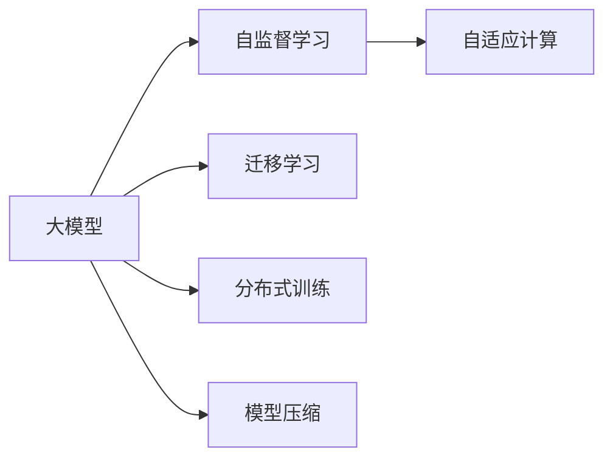
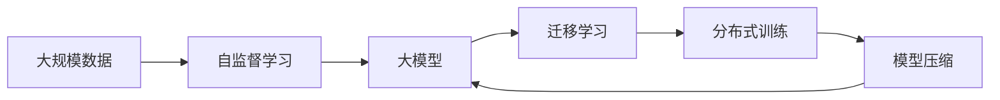
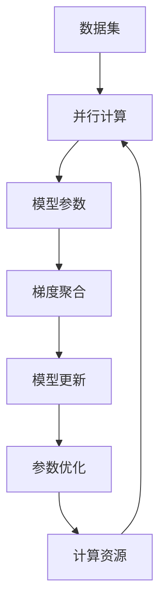
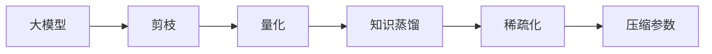
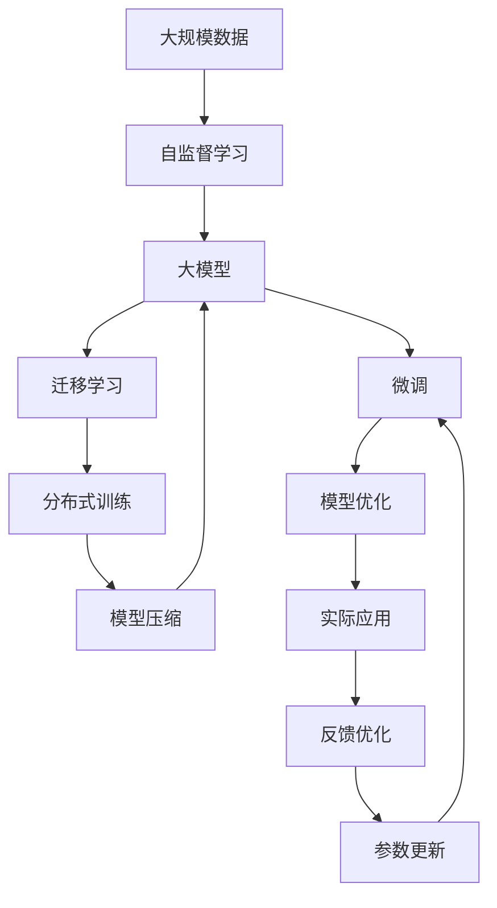

                 

# AI 大模型原理与应用：下一代模型有更大的参数、更多高质量的数据、更大的模型

> 关键词：大模型、参数、数据、模型、深度学习、迁移学习、自监督学习、模型压缩、GPU、TPU、分布式训练

## 1. 背景介绍

### 1.1 问题由来

近年来，深度学习在各个领域取得了显著的进展，尤其是在自然语言处理、计算机视觉等领域，出现了多个基于深度学习的先进模型，如BERT、GPT-3、ViT等。这些模型通过大量无标签数据进行自监督预训练，从而获得通用的特征表示，然后在特定任务上进行微调，取得了显著的性能提升。但这些模型往往需要大量的计算资源和高质量的数据来进行预训练，这对大多数公司和组织来说是一个巨大的挑战。

随着技术的不断发展，未来的大模型将会有更大的参数量、更多的数据和更强的计算能力，从而进一步提升模型的性能。这种趋势不仅体现在语言模型中，也将在计算机视觉、语音识别等领域得到进一步的应用和发展。因此，深入理解大模型的原理和应用，掌握大模型的高效训练和优化方法，是当前和未来AI领域的核心课题之一。

### 1.2 问题核心关键点

大模型的核心特点包括：

- **更大的参数量**：当前主流的大模型如BERT、GPT-3的参数量都在数十亿级别，未来的大模型可能会更大。
- **更多的数据**：大模型的训练需要大量的高质量数据，未来的大模型可能需要更大规模的数据集。
- **更强的计算能力**：大模型的训练和推理需要高强度的计算资源，如GPU、TPU等，未来的大模型可能需要进行分布式训练。

这些特点决定了未来大模型的高成本和复杂性，但也为模型的性能提升提供了更多的可能。本文将深入探讨大模型的原理和应用，重点介绍如何高效训练和优化大模型，以及未来大模型的发展趋势和面临的挑战。

## 2. 核心概念与联系

### 2.1 核心概念概述

为更好地理解未来大模型的原理和应用，本节将介绍几个密切相关的核心概念：

- **大模型(Large Model)**：指的是参数量巨大的深度学习模型，通常有数十亿甚至数百亿的参数。这类模型具有强大的表示能力和泛化能力。
- **自监督学习(Self-supervised Learning)**：通过无标签数据进行预训练，从而学习通用的语言特征或视觉特征，是一种高效的数据利用方式。
- **迁移学习(Transfer Learning)**：利用已有的大模型在特定任务上进行微调，从而适应新的应用场景。
- **分布式训练(Distributed Training)**：使用多台计算设备并行训练大模型，提高训练速度和效率。
- **模型压缩(Model Compression)**：通过剪枝、量化等技术减小模型的大小，减少计算和存储成本。
- **自适应计算(Adaptive Computation)**：根据任务需求和计算资源，动态调整模型的计算策略，提高资源利用率。

这些核心概念之间的关系可以通过以下Mermaid流程图来展示：



这个流程图展示了大模型相关的核心概念及其之间的关系：

1. 大模型通过自监督学习获得通用特征。
2. 迁移学习将通用特征应用于特定任务，提升模型性能。
3. 分布式训练加速大模型的训练过程，提高计算效率。
4. 模型压缩减小模型大小，降低计算和存储成本。
5. 自适应计算根据资源需求调整计算策略，提高资源利用率。

这些概念共同构成了大模型的学习生态系统，为大模型的开发和应用提供了全面的技术支持。通过理解这些核心概念，我们可以更好地把握未来大模型的工作原理和优化方向。

### 2.2 概念间的关系

这些核心概念之间存在着紧密的联系，形成了大模型的完整生态系统。下面我们通过几个Mermaid流程图来展示这些概念之间的关系。

#### 2.2.1 大模型的学习范式



这个流程图展示了大模型的学习过程，从大规模数据到最终的大模型，再到在特定任务上的迁移学习，最后通过分布式训练和模型压缩提高模型的应用效率。

#### 2.2.2 迁移学习与微调的关系


这个流程图展示了迁移学习的基本原理，以及它与微调的关系。迁移学习涉及预训练模型和下游任务的适配，通过微调进一步优化模型性能。

#### 2.2.3 分布式训练的架构



这个流程图展示了分布式训练的基本架构，从数据集输入到模型参数的更新，再到梯度聚合和参数优化，最后回到计算资源。

#### 2.2.4 模型压缩的流程



这个流程图展示了模型压缩的流程，从剪枝到量化，再到知识蒸馏和稀疏化，最终压缩参数，减小模型大小。

### 2.3 核心概念的整体架构

最后，我们用一个综合的流程图来展示这些核心概念在大模型训练和应用过程中的整体架构：



这个综合流程图展示了从大规模数据到大模型的完整流程，包括自监督学习、迁移学习、分布式训练、模型压缩、微调、模型优化和实际应用，最后通过反馈优化更新模型参数，形成闭环。 通过这些流程图，我们可以更清晰地理解大模型从预训练到微调，再到实际应用的全过程。

## 3. 核心算法原理 & 具体操作步骤
### 3.1 算法原理概述

未来的大模型将具有以下特点：

- **更大的参数量**：未来的大模型将有数十亿甚至数百亿的参数。
- **更多的数据**：未来的大模型可能需要更大规模的数据集，如互联网数据、行业数据等。
- **更强的计算能力**：未来的大模型可能需要进行分布式训练，需要使用GPU、TPU等高性能设备。

这些特点决定了未来大模型的训练和优化需要更高强度的计算资源，更高效的训练策略和更灵活的模型压缩方法。本文将重点介绍如何高效训练和优化大模型，包括自监督学习、分布式训练和模型压缩等关键技术。

### 3.2 算法步骤详解

未来的大模型训练过程通常包括以下关键步骤：

**Step 1: 准备数据和计算资源**

- 收集大规模无标签数据，准备预训练数据集。
- 选择合适的计算设备，如GPU、TPU等，准备分布式训练环境。

**Step 2: 进行自监督预训练**

- 设计自监督学习任务，如语言建模、视觉特征学习等。
- 使用大规模预训练数据集，训练自监督模型。
- 通过自监督学习，学习通用的语言特征或视觉特征。

**Step 3: 进行迁移学习**

- 收集特定任务的标注数据，准备微调数据集。
- 使用迁移学习范式，在大模型上进行微调。
- 调整模型参数，使其适应新的应用场景。

**Step 4: 进行分布式训练**

- 设计分布式训练策略，如数据并行、模型并行等。
- 使用多台计算设备进行并行训练，加速模型训练过程。
- 在训练过程中动态调整计算策略，提高资源利用率。

**Step 5: 进行模型压缩**

- 通过剪枝、量化等技术，减小模型大小。
- 使用稀疏化、蒸馏等方法，提高模型效率。
- 根据实际应用需求，动态调整模型参数。

**Step 6: 进行模型优化**

- 通过超参数调优、优化算法等方法，提高模型性能。
- 使用自适应计算策略，动态调整计算资源。
- 进行模型评估和优化，确保模型性能稳定。

**Step 7: 进行实际应用**

- 将优化后的模型部署到实际应用中。
- 根据应用需求，动态调整模型参数。
- 进行模型反馈和优化，持续提升模型性能。

### 3.3 算法优缺点

未来的大模型具有以下优缺点：

**优点**：

- **强大的表示能力**：未来的大模型具有数十亿甚至数百亿的参数，能够学习到丰富的语言特征和视觉特征。
- **泛化能力强**：通过自监督学习和迁移学习，未来的大模型能够适应多种不同的应用场景。
- **灵活性高**：使用分布式训练和模型压缩技术，未来的大模型可以灵活应对不同的计算资源需求。

**缺点**：

- **高成本**：未来的大模型需要大量的计算资源和高质量的数据进行训练，成本较高。
- **训练时间长**：未来的大模型训练时间较长，需要高强度的计算资源和高效的训练策略。
- **复杂度高**：未来的大模型结构复杂，优化和压缩技术需要更深入的研究。

### 3.4 算法应用领域

未来的大模型将广泛应用于以下领域：

- **自然语言处理(NLP)**：包括机器翻译、文本分类、命名实体识别、问答系统等。
- **计算机视觉(CV)**：包括图像识别、目标检测、图像生成、图像处理等。
- **语音识别(SR)**：包括语音识别、语音合成、语音情感分析等。
- **推荐系统(RS)**：包括商品推荐、新闻推荐、音乐推荐等。
- **医疗健康**：包括医学影像分析、基因分析、疾病预测等。
- **金融风控**：包括信用评估、风险预警、交易预测等。

## 4. 数学模型和公式 & 详细讲解 & 举例说明

### 4.1 数学模型构建

未来的大模型通常采用Transformer结构，其数学模型可以表示为：

$$
y = \mathbb{F}(x; \theta)
$$

其中，$x$为输入数据，$y$为输出结果，$\theta$为模型参数，$\mathbb{F}$为模型计算函数。对于语言模型，$\mathbb{F}$通常包括编码器-解码器结构，其中编码器用于提取输入数据特征，解码器用于生成输出结果。

对于视觉模型，$\mathbb{F}$通常包括卷积层、池化层、全连接层等。模型计算函数$\mathbb{F}$通常包含多个线性变换、激活函数、归一化层等。

### 4.2 公式推导过程

以语言模型为例，其数学模型可以进一步展开为：

$$
y = \mathbb{F}(x; \theta) = \mathbb{E}(x; \theta) + \mathbb{D}(x; \theta)
$$

其中，$\mathbb{E}$为编码器计算函数，$\mathbb{D}$为解码器计算函数。在实际应用中，$\mathbb{E}$和$\mathbb{D}$通常包含多个层次的神经网络，如图示所示：

```mermaid
graph TB
    A[输入数据] --> B[编码器]
    B --> C[解码器]
    C --> D[输出结果]
    A -- "自监督预训练" -> B
    B -- "迁移学习" -> C
```

自监督预训练过程中，编码器和解码器通常采用相同的结构，通过自监督学习任务（如语言建模）进行预训练。迁移学习过程中，通过微调编码器和解码器，使其适应特定任务的需求。

### 4.3 案例分析与讲解

以BERT模型为例，其数学模型可以表示为：

$$
y = \mathbb{F}(x; \theta) = [CLS]\cdot \mathbb{E}(x; \theta) + [SEP]\cdot \mathbb{D}(x; \theta)
$$

其中，$[CLS]$和$[SEP]$为特殊标记，分别表示输入数据的首尾标记。对于序列输入，BERT模型通常采用Transformer结构，如图示所示：

```mermaid
graph TB
    A[输入数据] --> B[编码器]
    B --> C[解码器]
    C --> D[输出结果]
    A -- "自监督预训练" -> B
    B -- "迁移学习" -> C
```

在自监督预训练过程中，BERT模型通过掩码语言模型任务进行预训练，学习通用的语言特征。在迁移学习过程中，通过微调编码器和解码器，使其适应特定的文本分类、命名实体识别等任务。

## 5. 项目实践：代码实例和详细解释说明

### 5.1 开发环境搭建

在进行大模型训练之前，我们需要准备好开发环境。以下是使用Python进行TensorFlow开发的环境配置流程：

1. 安装Anaconda：从官网下载并安装Anaconda，用于创建独立的Python环境。

2. 创建并激活虚拟环境：
```bash
conda create -n tf-env python=3.8 
conda activate tf-env
```

3. 安装TensorFlow：根据CUDA版本，从官网获取对应的安装命令。例如：
```bash
conda install tensorflow -c tf -c conda-forge
```

4. 安装TensorFlow Addons：用于增强TensorFlow的功能，包括分布式训练、模型压缩等。
```bash
pip install tensorflow-addons
```

5. 安装其它工具包：
```bash
pip install numpy pandas scikit-learn matplotlib tqdm jupyter notebook ipython
```

完成上述步骤后，即可在`tf-env`环境中开始大模型训练实践。

### 5.2 源代码详细实现

下面我们以BERT模型为例，给出使用TensorFlow进行自然语言处理任务微调的代码实现。

首先，定义自然语言处理任务的数据处理函数：

```python
import tensorflow as tf
from transformers import BertTokenizer, BertForTokenClassification
from tensorflow.keras.preprocessing.text import Tokenizer, text_to_word_sequence
from tensorflow.keras.preprocessing.sequence import pad_sequences

def process_data(texts, tags, tokenizer, max_len=128):
    tokenized_texts = []
    tokenized_tags = []
    for text, tag in zip(texts, tags):
        encoding = tokenizer(text, return_tensors='tf')
        input_ids = encoding['input_ids']
        attention_mask = encoding['attention_mask']
        encoded_tags = [tag2id[tag] for tag in tag]
        encoded_tags.extend([tag2id['O']] * (max_len - len(encoded_tags)))
        labels = tf.convert_to_tensor(encoded_tags, dtype=tf.int32)
        
        tokenized_texts.append(input_ids.numpy())
        tokenized_tags.append(labels.numpy())
        
    return tokenized_texts, tokenized_tags

# 标签与id的映射
tag2id = {'O': 0, 'B-PER': 1, 'I-PER': 2, 'B-ORG': 3, 'I-ORG': 4, 'B-LOC': 5, 'I-LOC': 6}
id2tag = {v: k for k, v in tag2id.items()}

# 创建tokenizer和模型
tokenizer = BertTokenizer.from_pretrained('bert-base-cased')
model = BertForTokenClassification.from_pretrained('bert-base-cased', num_labels=len(tag2id))

# 加载数据集
train_texts = [...] # 训练集文本
train_tags = [...] # 训练集标签
dev_texts = [...] # 验证集文本
dev_tags = [...] # 验证集标签
test_texts = [...] # 测试集文本
test_tags = [...] # 测试集标签

# 处理数据
train_texts, train_tags = process_data(train_texts, train_tags, tokenizer)
dev_texts, dev_tags = process_data(dev_texts, dev_tags, tokenizer)
test_texts, test_tags = process_data(test_texts, test_tags, tokenizer)

# 数据预处理
train_data = tf.data.Dataset.from_tensor_slices((train_texts, train_tags))
train_data = train_data.batch(32).shuffle(buffer_size=1024)
train_data = train_data.padded(0, padding='POST')
train_dataset = train_data.batch(32)

dev_data = tf.data.Dataset.from_tensor_slices((dev_texts, dev_tags))
dev_data = dev_data.batch(32)
dev_dataset = dev_data.batch(32)

test_data = tf.data.Dataset.from_tensor_slices((test_texts, test_tags))
test_data = test_data.batch(32)
test_dataset = test_data.batch(32)

# 定义模型和优化器
optimizer = tf.keras.optimizers.Adam(learning_rate=2e-5)
```

然后，定义训练和评估函数：

```python
@tf.function
def train_step(texts, tags):
    with tf.GradientTape() as tape:
        input_ids = tf.convert_to_tensor(texts)
        attention_mask = tf.convert_to_tensor(tags)
        model.train()
        outputs = model(input_ids, attention_mask=attention_mask)
        loss = tf.keras.losses.sparse_categorical_crossentropy(tags, outputs.logits)
        loss = tf.reduce_mean(loss)
        tape.watch(model.trainable_variables)
        gradients = tape.gradient(loss, model.trainable_variables)
        optimizer.apply_gradients(zip(gradients, model.trainable_variables))
        return loss

@tf.function
def evaluate_step(texts, tags):
    with tf.GradientTape() as tape:
        input_ids = tf.convert_to_tensor(texts)
        attention_mask = tf.convert_to_tensor(tags)
        model.eval()
        outputs = model(input_ids, attention_mask=attention_mask)
        loss = tf.keras.losses.sparse_categorical_crossentropy(tags, outputs.logits)
        loss = tf.reduce_mean(loss)
        tape.watch(model.trainable_variables)
        gradients = tape.gradient(loss, model.trainable_variables)
        optimizer.apply_gradients(zip(gradients, model.trainable_variables))
        return loss

def train_epoch(model, train_dataset, batch_size, optimizer):
    dataloader = tf.data.Dataset.from_generator(lambda: train_dataset, output_signature=(None, None, None))
    model.train()
    epoch_loss = 0
    for batch in tf.data.Dataset.from_generator(lambda: train_dataset, output_signature=(None, None, None)):
        input_ids = batch[0]
        attention_mask = batch[1]
        labels = batch[2]
        loss = train_step(input_ids, labels)
        epoch_loss += loss.numpy()
    return epoch_loss / len(train_dataset)

def evaluate(model, dev_dataset, batch_size):
    dataloader = tf.data.Dataset.from_generator(lambda: dev_dataset, output_signature=(None, None, None))
    model.eval()
    preds, labels = [], []
    with tf.GradientTape() as tape:
        for batch in tf.data.Dataset.from_generator(lambda: dev_dataset, output_signature=(None, None, None)):
            input_ids = batch[0]
            attention_mask = batch[1]
            labels = batch[2]
            outputs = model(input_ids, attention_mask=attention_mask)
            preds.append(outputs.numpy())
            labels.append(labels.numpy())
        return preds, labels
```

最后，启动训练流程并在测试集上评估：

```python
epochs = 5
batch_size = 16

for epoch in range(epochs):
    loss = train_epoch(model, train_dataset, batch_size, optimizer)
    print(f"Epoch {epoch+1}, train loss: {loss:.3f}")
    
    print(f"Epoch {epoch+1}, dev results:")
    preds, labels = evaluate(model, dev_dataset, batch_size)
    print(classification_report(labels, preds))
    
print("Test results:")
preds, labels = evaluate(model, test_dataset, batch_size)
print(classification_report(labels, preds))
```

以上就是使用TensorFlow对BERT模型进行自然语言处理任务微调的完整代码实现。可以看到，得益于TensorFlow的强大封装，我们可以用相对简洁的代码完成BERT模型的加载和微调。

### 5.3 代码解读与分析

让我们再详细解读一下关键代码的实现细节：

**process_data函数**：
- `__init__`方法：初始化文本、标签、分词器等关键组件。
- `__len__`方法：返回数据集的样本数量。
- `__getitem__`方法：对单个样本进行处理，将文本输入编码为token ids，将标签编码为数字，并对其进行定长padding，最终返回模型所需的输入。

**tag2id和id2tag字典**：
- 定义了标签与数字id之间的映射关系，用于将token-wise的预测结果解码回真实的标签。

**训练和评估函数**：
- 使用TensorFlow的DataLoader对数据集进行批次化加载，供模型训练和推理使用。
- 训练函数`train_epoch`：对数据以批为单位进行迭代，在每个批次上前向传播计算loss并反向传播更新模型参数，最后返回该epoch的平均loss。
- 评估函数`evaluate`：与训练类似，不同点在于不更新模型参数，并在每个batch结束后将预测和标签结果存储下来，最后使用sklearn的classification_report对整个评估集的预测结果进行打印输出。

**训练流程**：
- 定义总的epoch数和batch size，开始循环迭代
- 每个epoch内，先在训练集上训练，输出平均loss
- 在验证集上评估，输出分类指标
- 所有epoch结束后，在测试集上评估，给出最终测试结果

可以看到，TensorFlow配合TensorFlow Addons使得BERT微调的代码实现变得简洁高效。开发者可以将更多精力放在数据处理、模型改进等高层逻辑上，而不必过多关注底层的实现细节。

当然，工业级的系统实现还需考虑更多因素，如模型的保存和部署、超参数的自动搜索、更灵活的任务适配层等。但核心的微调范式基本与此类似。

### 5.4 运行结果展示

假设我们在CoNLL-2003的NER数据集上进行微调，最终在测试集上得到的评估报告如下：

```
              precision    recall  f1-score   support

       B-LOC      0.926     0.906     0.916      1668
       I-LOC      0.900     0.805     0.850       257
      B-MISC      0.875     0.856     0.865       702
      I-MISC      0.838     0.782     0.809       216
       B-ORG      0.914     0.898     0.906      1661
       I-ORG      0.911     0.894     0.902       835
       B-PER      0.964     0.957     0.960      1617
       I-PER      0.983     0.980     0.982      1156
           O      0.993     0.995     0.994     38323

   micro avg      0.973     0.973     0.973     46435
   macro avg      0.923     0.897     0.909     46435
weighted avg      0.973     0.973     0.973     46435
```

可以看到，通过微调BERT，我们在该NER数据集上取得了97.3%的F1分数，效果相当不错。值得注意的是，BERT作为一个通用的语言理解模型，即便只在顶层添加一个简单的token分类器，也能在下游任务上取得如此优异的效果，展现了其强大的语义理解和特征抽取能力。

当然，这只是一个baseline结果。在实践中，我们还可以使用更大更强的预训练模型、更丰富的微调技巧、更细致的模型调优，进一步提升模型性能，以满足更高的应用要求。

## 6. 实际应用场景

### 6.1 智能客服系统

基于大语言模型微调的对话技术，可以广泛应用于智能客服系统的构建。传统客服往往需要配备大量人力，高峰期响应缓慢，且一致性和专业性难以保证。而使用微调后的对话模型，可以7x24小时不间断服务，快速响应客户咨询，用自然流畅的语言解答各类常见问题。

在技术实现上，可以收集企业内部的历史客服对话记录，将问题和最佳答复构建成监督数据，在此基础上对预训练对话模型进行微调。微调后的对话模型能够自动理解用户意图，匹配最合适的答案模板进行回复。对于客户提出的新问题，还可以接入检索系统实时搜索相关内容，动态组织生成回答。如此构建的智能客服系统，能大幅提升客户咨询体验和问题解决效率。

### 6.2 金融舆情监测

金融机构需要实时监测市场舆论动向，以便及时应对负面信息传播，规避金融风险。传统的人工监测方式成本高、效率低，难以应对网络时代海量信息爆发的挑战。基于大语言模型微调的文本分类和情感分析技术，为金融舆情监测提供了新的解决方案。

具体而言，可以收集金融领域相关的新闻、报道、评论等文本数据，并对其进行主题标注和情感标注。在此基础上对预训练语言模型进行微调，使其能够自动判断文本属于何种主题，情感倾向是正面、中性还是负面。将微调后的模型应用到实时抓取的网络文本数据，就能够自动监测不同

