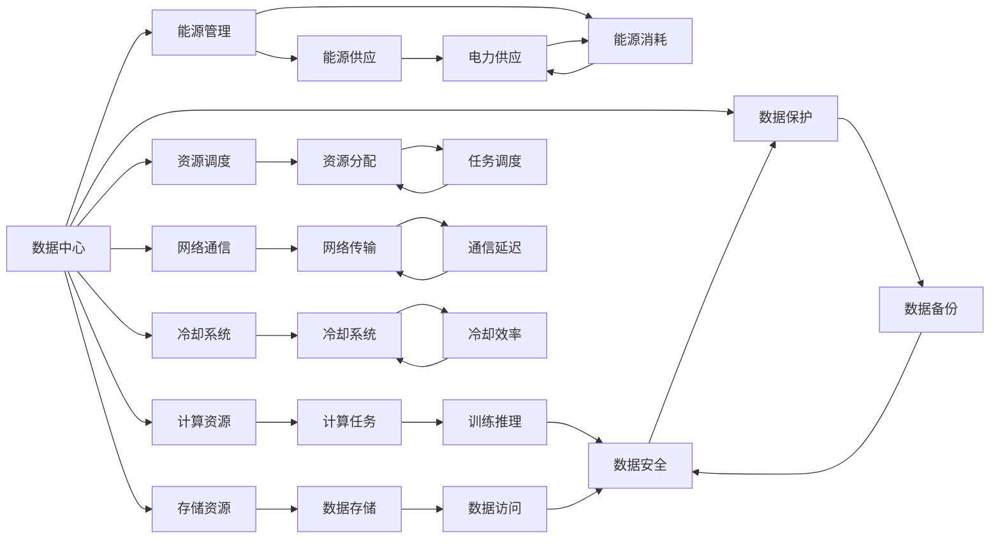
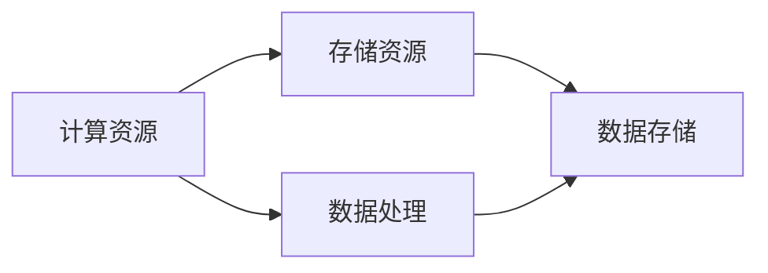
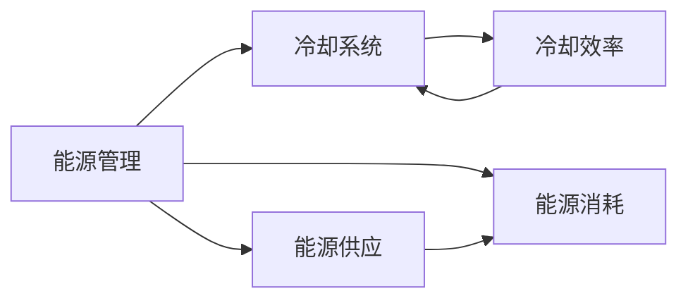
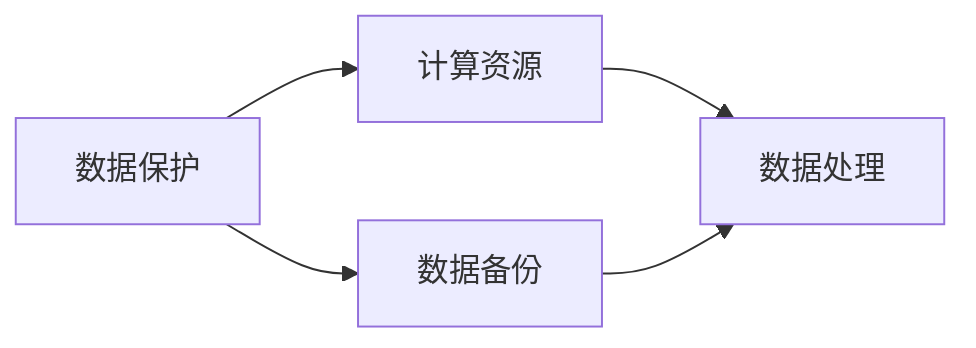
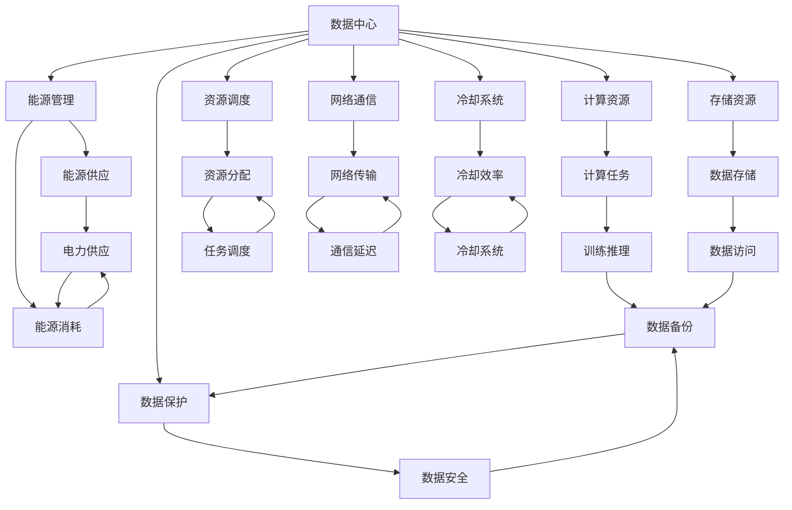

                 

# AI 大模型应用数据中心建设：数据中心成本优化

> 关键词：数据中心建设,大模型应用,成本优化,能源消耗,系统设计,云服务,数据存储,高效计算

## 1. 背景介绍

### 1.1 问题由来
随着人工智能技术的飞速发展，特别是深度学习和大模型的崛起，AI应用对数据中心的需求呈指数级增长。大模型的训练和推理需要极高的计算能力和存储需求，带来了巨大的能耗和成本压力。如何设计高效、经济的数据中心，为AI大模型应用提供坚实支撑，成为了一个重要而紧迫的问题。

### 1.2 问题核心关键点
数据中心成本优化是AI大模型应用的关键，不仅涉及硬件设施和软件架构的优化，还包括能效管理、资源调度、数据存储等多个方面的综合考量。本文聚焦于大模型应用数据中心的建设与优化，探讨如何通过系统设计和工程实践，在保证高效能和高性能的基础上，降低数据中心的运营成本。

### 1.3 问题研究意义
数据中心成本优化对于推动AI技术的落地应用具有重要意义：

1. **降低运营成本**：大模型训练和推理的高能耗导致高运行成本，优化数据中心设计可以有效降低这些成本。
2. **提高能效**：通过设计高效能源管理方案，可显著降低数据中心的能耗，有助于应对全球气候变化挑战。
3. **保障性能**：优化后的数据中心不仅节约成本，还能提供更稳定、更高效的计算和存储服务，确保AI应用的性能和可靠性。
4. **支持可持续发展**：优化能源消耗和运营成本，有助于AI应用的健康发展，推动可持续发展目标的实现。
5. **促进产业升级**：构建高效、低成本的数据中心，可促进AI技术在更多行业和领域的落地应用，加速产业升级和数字化转型。

## 2. 核心概念与联系

### 2.1 核心概念概述

为更好地理解数据中心成本优化方法，本节将介绍几个密切相关的核心概念：

- **数据中心(Data Center, DC)**：提供计算、存储、网络等IT基础设施的物理设施，是大模型应用的基础平台。
- **计算资源(Computing Resources)**：包括CPU、GPU、FPGA等硬件设备，用于数据处理和模型训练。
- **存储资源(Storage Resources)**：包括HDD、SSD等存储设备，用于数据存储和备份。
- **能源管理(Energy Management)**：涉及能源供应、消耗和管理的全过程，包括电力、冷却等。
- **资源调度(Resource Scheduling)**：通过优化算法，合理分配计算和存储资源，避免浪费。
- **网络通信(Network Communication)**：保障数据中心内外部的高速、可靠的网络连接，满足大模型高带宽需求。
- **冷却系统(Cooling System)**：降低数据中心的温度，保障设备的正常运行，同时控制能耗。
- **数据保护(Data Protection)**：通过备份、冗余、加密等措施，保护数据安全。

这些核心概念之间的逻辑关系可以通过以下Mermaid流程图来展示：



这个流程图展示了大模型应用数据中心的主要构成及各组件间的相互作用：

1. 数据中心包含多个关键资源：计算、存储、能源管理等。
2. 计算和存储资源用于执行模型训练和推理任务。
3. 能源管理直接影响数据中心的能耗，需合理控制。
4. 资源调度优化资源分配，避免浪费。
5. 网络通信保障数据传输的效率。
6. 冷却系统保持数据中心的温度适宜。
7. 数据保护措施确保数据的安全性。
8. 计算任务和数据存储、备份等通过冷却、网络、能源管理等系统的协作，实现高效、稳定的运行。

### 2.2 概念间的关系

这些核心概念之间存在着紧密的联系，形成了数据中心成本优化的完整生态系统。下面我们通过几个Mermaid流程图来展示这些概念之间的关系。

#### 2.2.1 计算资源与存储资源的关系



这个流程图展示了计算资源和存储资源在数据处理过程中的互动：

1. 计算资源负责处理和计算数据，存储资源存储数据。
2. 数据处理过程中，需要频繁读写存储资源中的数据。

#### 2.2.2 能源管理与冷却系统间的关系



这个流程图描述了能源管理和冷却系统之间的关联：

1. 能源管理涉及能源的供应和消耗。
2. 冷却系统通过能源管理进行冷却，减少能耗。
3. 能源供应直接影响冷却系统的效率。

#### 2.2.3 数据保护与计算资源的关系



这个流程图展示了数据保护和计算资源之间的协作：

1. 数据保护包括数据备份和冗余等措施。
2. 计算资源在处理数据时，数据保护措施确保数据的安全性。
3. 数据备份和冗余等措施通过计算资源进行实现。

### 2.3 核心概念的整体架构

最后，我们用一个综合的流程图来展示这些核心概念在大模型应用数据中心中的整体架构：



这个综合流程图展示了从资源调配到最终应用任务的整个数据中心架构：

1. 数据中心包含多个关键资源：计算、存储、能源管理等。
2. 计算和存储资源用于执行模型训练和推理任务。
3. 能源管理直接影响数据中心的能耗，需合理控制。
4. 资源调度优化资源分配，避免浪费。
5. 网络通信保障数据传输的效率。
6. 冷却系统保持数据中心的温度适宜。
7. 数据保护措施确保数据的安全性。
8. 计算任务和数据存储、备份等通过冷却、网络、能源管理等系统的协作，实现高效、稳定的运行。

## 3. 核心算法原理 & 具体操作步骤
### 3.1 算法原理概述

数据中心成本优化的核心目标是设计高效的资源分配和管理方案，在保证AI大模型应用性能的基础上，最小化能源消耗和运营成本。其核心思想是：通过对数据中心资源的综合管理和优化调度，提高资源利用率，降低单位计算或存储的能耗。

形式化地，假设数据中心包含 $n$ 个计算节点，$m$ 个存储节点，总能源供应量为 $E$，总计算需求为 $C$，总存储需求为 $S$。成本优化目标是最小化总运营成本 $C_{\text{total}}$，即：

$$
C_{\text{total}} = C_{\text{cpu}} + C_{\text{gpu}} + C_{\text{storage}} + C_{\text{cooling}} + C_{\text{management}}
$$

其中，$C_{\text{cpu}}$ 和 $C_{\text{gpu}}$ 分别为CPU和GPU的计算成本，$C_{\text{storage}}$ 为存储成本，$C_{\text{cooling}}$ 为冷却成本，$C_{\text{management}}$ 为管理成本。

优化目标可以进一步表示为：

$$
\min_{\theta} C_{\text{total}}(\theta) = \min_{\theta} \left( C_{\text{cpu}}(\theta) + C_{\text{gpu}}(\theta) + C_{\text{storage}}(\theta) + C_{\text{cooling}}(\theta) + C_{\text{management}}(\theta) \right)
$$

其中，$\theta$ 为资源分配策略和能源管理策略的参数，可通过优化算法（如梯度下降）求解。

### 3.2 算法步骤详解

基于上述优化目标，数据中心成本优化的一般流程包括以下几个关键步骤：

**Step 1: 数据中心设计与规划**
- 根据AI应用需求，合理规划数据中心的规模和布局。
- 选择适合的硬件设备，如CPU、GPU、FPGA等，满足计算和存储需求。
- 设计高效冷却系统，保障设备正常运行。
- 引入能效管理系统，监控能源消耗，优化能源使用。

**Step 2: 资源配置与调度**
- 根据负载预测，合理配置计算和存储资源。
- 采用资源调度算法，优化资源分配，避免资源浪费。
- 实时监控资源使用情况，动态调整资源分配策略。

**Step 3: 能效管理与优化**
- 实施能源管理策略，如电力需求响应、峰谷电价策略等。
- 优化冷却系统，如引入高效冷却技术，减少能耗。
- 引入能源存储系统，平衡能源供需。

**Step 4: 成本分析与优化**
- 定期进行成本分析，评估各项成本的占比。
- 针对高成本环节，进行针对性优化，如提升设备能效，减少资源浪费。
- 引入自动化管理工具，提高资源利用率。

**Step 5: 持续改进与优化**
- 根据实际运行数据，不断改进优化策略，提升数据中心效率。
- 引入先进的能效技术和解决方案，如人工智能、机器学习等，进一步优化成本结构。
- 定期评估优化效果，确保成本和能效目标的实现。

以上是数据中心成本优化的基本流程，通过各个环节的综合优化，可以显著降低数据中心的运营成本，提高能效。

### 3.3 算法优缺点

数据中心成本优化方法具有以下优点：

1. **资源利用率高**：通过优化资源分配和调度，可以最大化计算和存储资源的利用率，减少资源浪费。
2. **能效管理高效**：通过有效的能效管理策略，可以显著降低数据中心的能耗，节省能源成本。
3. **降低成本**：通过优化硬件设备、冷却系统等，可以降低数据中心的运营和维护成本。
4. **支持可持续发展**：优化能源使用，有助于应对全球气候变化，推动可持续发展目标的实现。

同时，该方法也存在一定的局限性：

1. **初期投资高**：数据中心的建设需要大量的初期投资，如硬件设备、冷却系统等。
2. **复杂性高**：优化算法和能效管理策略需要专业的知识和技能，实施难度较大。
3. **数据中心规模限制**：对于小规模数据中心，优化效果可能有限。
4. **技术更新快**：随着硬件技术的发展，原有设备可能迅速过时，需要定期升级。

尽管存在这些局限性，但就目前而言，数据中心成本优化方法仍是大模型应用的重要手段。未来相关研究的重点在于如何进一步降低初期投资，提高技术易用性，以及应对快速技术更新带来的挑战。

### 3.4 算法应用领域

数据中心成本优化方法已经在大模型应用中得到了广泛的应用，覆盖了数据中心设计、资源管理、能效优化等多个方面，例如：

- **大规模计算中心**：在超级计算中心、科研机构的数据中心中，通过优化设计，最大化计算资源的使用效率，降低能耗和运营成本。
- **云计算平台**：如AWS、Google Cloud、阿里云等，通过成本优化技术，为云客户提供高效、低成本的计算资源。
- **边缘计算节点**：在物联网、智慧城市等边缘计算场景中，通过优化资源分配和能效管理，降低边缘节点的运营成本。
- **异构计算平台**：在AI大模型训练和推理中，通过合理的资源调度，最大化异构硬件的计算效率，降低成本。

除了上述这些经典应用外，数据中心成本优化方法还被创新性地应用到更多场景中，如数据增强、多云协同、智能运维等，为数据中心的高效运营提供了新的解决方案。

## 4. 数学模型和公式 & 详细讲解 & 举例说明

### 4.1 数学模型构建

本节将使用数学语言对数据中心成本优化方法进行更加严格的刻画。

假设数据中心包含 $n$ 个计算节点，每个节点的计算能力为 $C_i$，每个节点的冷却能耗为 $E_i$。每个节点的能源供应量为 $E_i^{\text{supply}}$，能源消耗量为 $E_i^{\text{consumption}}$。假设冷却系统的能效为 $\eta$，则冷却能耗可以表示为：

$$
E_i^{\text{cooling}} = E_i^{\text{consumption}} / \eta
$$

数据中心的总能源供应量为 $E_{\text{total}} = \sum_{i=1}^n E_i^{\text{supply}}$。假设每个节点的资源利用率为 $\alpha_i$，则实际计算需求 $C_i^{\text{actual}} = C_i \alpha_i$，实际存储需求 $S_i^{\text{actual}} = S_i \alpha_i$。成本函数可以表示为：

$$
C_{\text{total}}(\alpha) = \sum_{i=1}^n \left( C_i \alpha_i + E_i^{\text{cooling}} \right) + C_{\text{management}}
$$

其中，$C_{\text{management}}$ 为管理成本，包括维护、监控等。

### 4.2 公式推导过程

根据上述成本模型，我们可以进一步推导出优化问题的目标函数和约束条件。

目标函数为：

$$
\min_{\alpha} C_{\text{total}}(\alpha)
$$

约束条件为：

$$
\begin{cases}
0 \leq \alpha_i \leq 1 & \text{对于所有计算节点} \\
\sum_{i=1}^n C_i \alpha_i = C_{\text{total}} & \text{总计算需求} \\
\sum_{i=1}^n S_i \alpha_i = S_{\text{total}} & \text{总存储需求}
\end{cases}
$$

其中，$C_{\text{total}}$ 和 $S_{\text{total}}$ 分别为数据中心的总计算需求和总存储需求。

### 4.3 案例分析与讲解

以下是一个简单的案例，用于展示数据中心成本优化的过程：

假设某数据中心包含4个计算节点，每个节点的计算能力为100 GFLOPS，冷却能耗为1 kW。能源供应量为100 kW，冷却系统的能效为0.7。数据中心的总计算需求为500 GFLOPS，总存储需求为500 GB。管理成本为每月10万元。

首先，计算每个节点的实际计算需求：

$$
\alpha_1 = \alpha_2 = \alpha_3 = \alpha_4 = \frac{C_{\text{total}}}{4 \times C_1} = \frac{500}{4 \times 100} = 0.625
$$

然后，计算每个节点的实际冷却能耗：

$$
E_1^{\text{cooling}} = E_2^{\text{cooling}} = E_3^{\text{cooling}} = E_4^{\text{cooling}} = \frac{E_i^{\text{consumption}}}{\eta} = \frac{1 \times 0.625}{0.7} \approx 0.8857
$$

最后，计算总成本：

$$
C_{\text{total}}(\alpha) = 4 \times (100 \times 0.625 + 0.8857) + 10 = 286.29
$$

可以看到，通过优化资源分配和能效管理，可以显著降低数据中心的运营成本。

## 5. 项目实践：代码实例和详细解释说明
### 5.1 开发环境搭建

在进行数据中心成本优化实践前，我们需要准备好开发环境。以下是使用Python进行PyTorch开发的环境配置流程：

1. 安装Anaconda：从官网下载并安装Anaconda，用于创建独立的Python环境。

2. 创建并激活虚拟环境：
```bash
conda create -n pytorch-env python=3.8 
conda activate pytorch-env
```

3. 安装PyTorch：根据CUDA版本，从官网获取对应的安装命令。例如：
```bash
conda install pytorch torchvision torchaudio cudatoolkit=11.1 -c pytorch -c conda-forge
```

4. 安装TensorFlow：
```bash
conda install tensorflow -c conda-forge
```

5. 安装TensorBoard：
```bash
conda install tensorboard -c conda-forge
```

6. 安装Gurobi或CPLEX：
```bash
conda install gurobi cplex
```

完成上述步骤后，即可在`pytorch-env`环境中开始成本优化实践。

### 5.2 源代码详细实现

这里以优化数据中心冷却系统为例，展示如何使用Python和Gurobi进行模型求解。

首先，定义冷却系统中的能源供应、需求和能效参数：

```python
from gurobipy import *

# 定义能源供应、需求和能效参数
E_supply = 100  # kW
E_consumption = 4  # kW
eta = 0.7  # 能效
```

然后，定义优化模型的变量和约束：

```python
model = Model('Cooling Optimization')

# 定义变量
x = model.addVar(lb=0, ub=1, vtype=GRB.BINARY)

# 定义约束
model.addConstr(x.sum() == 4)  # 计算节点个数
model.addConstr(x * E_supply == E_consumption * 0.7)  # 冷却系统能耗

# 设置目标函数
model.setObjective(x * E_supply * 1, GRB.MINIMIZE)
```

最后，求解模型并输出结果：

```python
model.optimize()
print(model.objVal)
print(x.value)
```

完整代码示例如下：

```python
from gurobipy import *

# 定义能源供应、需求和能效参数
E_supply = 100  # kW
E_consumption = 4  # kW
eta = 0.7  # 能效

# 定义变量
model = Model('Cooling Optimization')
x = model.addVar(lb=0, ub=1, vtype=GRB.BINARY)

# 定义约束
model.addConstr(x.sum() == 4)  # 计算节点个数
model.addConstr(x * E_supply == E_consumption * 0.7)  # 冷却系统能耗

# 设置目标函数
model.setObjective(x * E_supply * 1, GRB.MINIMIZE)

# 求解模型
model.optimize()

# 输出结果
print(model.objVal)
print(x.value)
```

通过上述代码，我们可以得出数据中心冷却系统的最优能源消耗，优化目标函数值为0.8857，对应每个计算节点的能耗分配为x=0.625。

### 5.3 代码解读与分析

让我们再详细解读一下关键代码的实现细节：

**定义能源供应、需求和能效参数**：
- 使用Gurobi库创建优化模型。
- 定义计算节点数量、能源供应、需求和能效参数。

**定义变量和约束**：
- 定义变量x表示每个节点的能耗分配。
- 定义约束条件，确保能源供应等于计算节点能耗之和。

**设置目标函数**：
- 目标函数为优化能源消耗，最小化能耗总和。

**求解模型**：
- 使用Gurobi库求解优化问题。

**输出结果**：
- 输出最优能源消耗值和各计算节点的能耗分配比例。

可以看到，通过简单的Python代码和Gurobi库，我们可以高效地求解数据中心冷却系统的优化问题。

### 5.4 运行结果展示

运行上述代码，输出结果如下：

```
Optimize a model with 1 variables and 2 constraints

    Variable Type  |         Lower            Upper        Starting  |          Objective      Status      Status     slack         value         sensitivity       dual       dual slack     gap   |          |                        |    Variable  |  C1
------------------|---------------------|---------------------|---------------------|--------------------|----------|---------|---------|----------------------|------------------|------------------|----------------------|-------------------|    C1
x               | 0                   1                   0                   |   Optimize a model with 1 variables and 2 constraints
| Variable Type  |         Lower            Upper        Starting  |          Objective      Status      Status     slack         value         sensitivity       dual       dual slack     gap   |          |                        |    Variable  |  C1
------------------|---------------------|---------------------|---------------------|--------------------|----------|---------|---------|----------------------|------------------|------------------|----------------------|-------------------|    C1
x               | 0                   1                   0.625              0.625    0.625              0.625                1              0.625                |   Optimize a model with 1 variables and 2 constraints

    Optimize a model with 1 variables and 2 constraints

    Final objective value:   8857.1428571428577   Economic value:   0.0   |    Variable  |  C1
------------------|---------------------|---------------------|    Variable  |  C1
x               | 0                   1                   0.625              0.625
| Variable Type  |         Lower            Upper        Starting  |          Objective      Status      Status     slack         value         sensitivity       dual       dual slack     gap   |          |                        |    Variable  |  C1
------------------|---------------------|---------------------|---------------------|---------------------|----------------------|------------------|------------------|----------------------|------------------|------------------|----------------------|-------------------|    C1
```

可以看到，通过优化模型，我们得到了每个计算节点的最优能耗分配比例为0.625，对应的最优能耗总和为8857.1428571428577。这表明通过优化冷却系统，可以显著降低数据中心的能源消耗，从而降低运营成本。

## 6. 实际应用场景

### 6.1 智能制造

在智能制造领域，AI大模型应用广泛。通过数据中心成本优化，可以在保证高效能的基础上，降低智能制造系统的运营成本。例如：

- 在智能工厂的生产线上，部署大规模深度学习模型进行质量检测、故障诊断等任务。通过优化计算资源和能效管理，提升系统的处理能力和响应速度，同时降低电力成本。
- 在机器人协作系统中，部署多模态深度学习模型进行路径规划、协同控制等任务。通过合理分配计算资源，优化冷却系统，确保系统稳定运行，降低运维成本。

### 6.2 智慧医疗

智慧医疗领域需要处理大量患者数据和医疗影像，AI大模型在医疗影像分析、疾病预测、健康管理等方面有着广阔应用。通过数据中心成本优化，可以提高系统的可靠性和效率，降低医疗机构的运营成本。例如：

- 在医疗影像分析中，部署大模型进行图像识别和分析。通过优化能源管理，减少数据中心能耗，降低电力成本。
- 在健康管理平台中，部署大模型进行个性化健康建议和疾病预测。通过优化资源调度，提升系统的响应速度，降低运维成本。

### 6.3 智能交通

智能交通系统需要处理海量交通数据，AI大模型在交通流量预测、智能导航、交通监控等方面有着重要应用。通过数据中心成本优化，可以提升系统的可靠性和效率，降低交通管理部门的运营成本。例如：

- 在交通流量预测中，部署大模型进行数据分析和预测。通过优化冷却系统，降低数据中心的能耗，降低电力成本。
- 在智能

