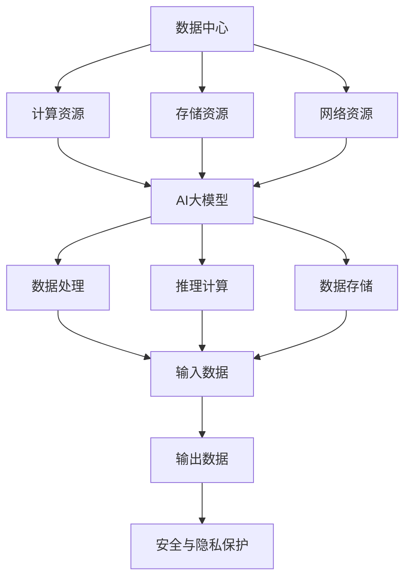
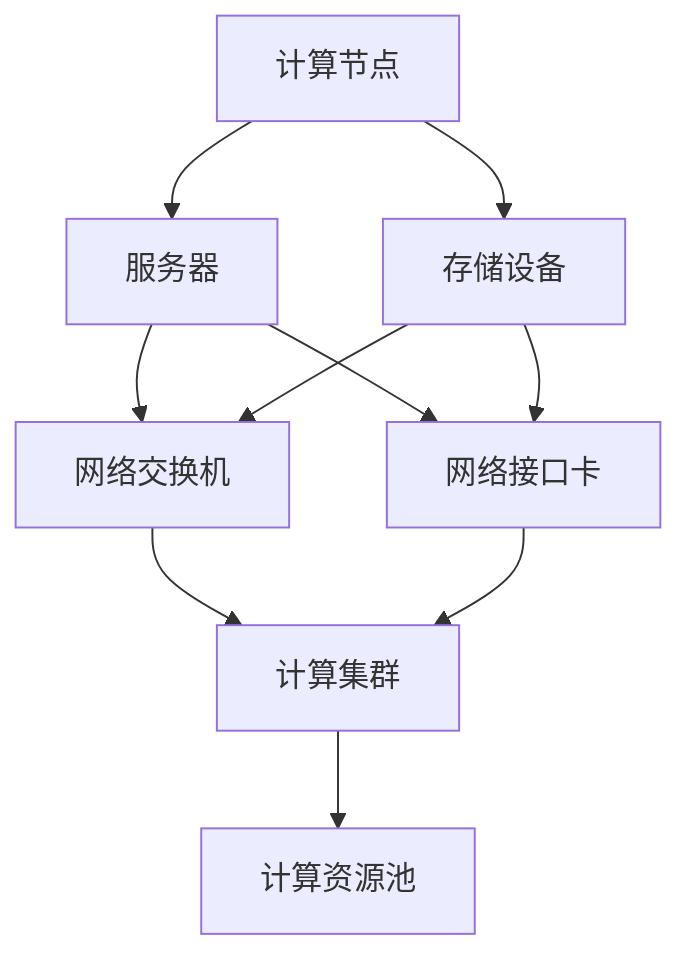
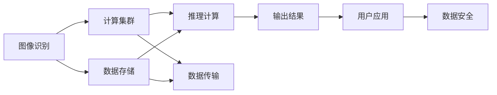
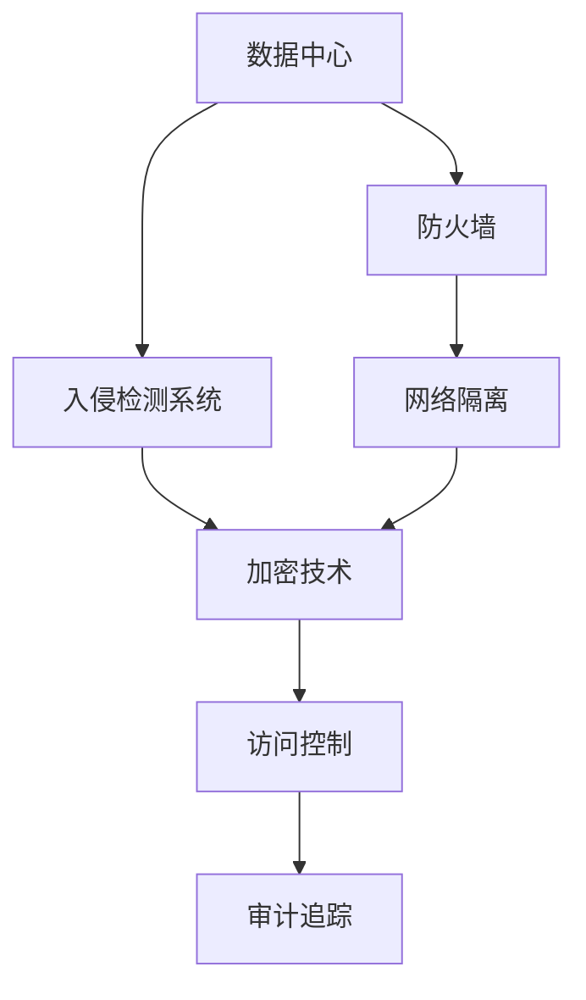
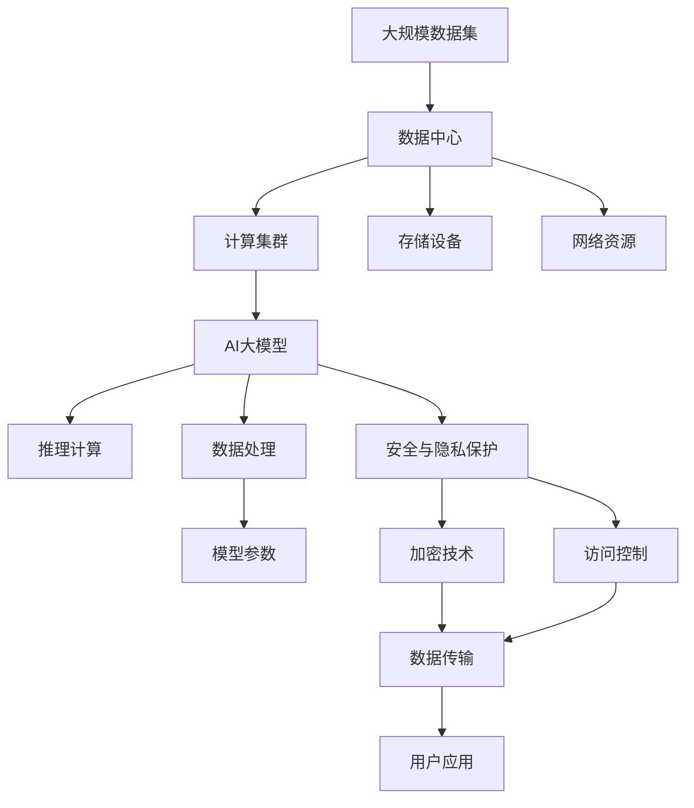

                 

# AI 大模型应用数据中心建设：数据中心技术与应用

> 关键词：数据中心, 大模型, 人工智能, 基础设施, 计算资源, 存储资源, 网络资源, 安全与隐私

## 1. 背景介绍

### 1.1 问题由来

随着人工智能(AI)技术的快速发展，尤其是大模型在图像识别、语音识别、自然语言处理等领域取得突破性进展，对计算资源和存储资源的需求也呈现出指数级增长。这些大模型需要庞大的数据集进行预训练，并在实际应用中快速响应海量请求，这对数据中心的硬件和软件基础设施提出了极高的要求。

数据中心作为支撑AI大模型运行的核心基础设施，其设计、构建和管理直接影响到模型的性能、可靠性和安全性。如何设计高效、可扩展、安全的数据中心，以适应AI大模型的需求，成为当前亟待解决的重要问题。

### 1.2 问题核心关键点

构建高效的数据中心，需要考虑以下关键点：

- **硬件资源需求**：大模型需要高性能的CPU、GPU、TPU等计算资源，以及高速、大容量的内存。
- **存储需求**：大模型需要存储海量数据集、中间数据和模型参数。
- **网络带宽**：大模型在处理大规模数据和并行计算时，需要高带宽的网络支持。
- **安全性与隐私保护**：大模型处理敏感数据时，需要严格的数据保护措施，防止数据泄露和攻击。

### 1.3 问题研究意义

构建高效的数据中心，对于支持大模型应用具有重要意义：

- **提升性能**：通过优化硬件、网络和存储资源，提升AI大模型的计算和存储效率，缩短推理时间。
- **保障可靠性**：设计冗余和容错机制，确保AI大模型在故障情况下仍能稳定运行。
- **强化安全性**：通过严格的数据保护措施，防止数据泄露和攻击，保护用户隐私和数据安全。
- **支持创新**：提供强大、稳定的计算和存储资源，支撑AI大模型在各个领域的应用创新。

## 2. 核心概念与联系

### 2.1 核心概念概述

为更好地理解数据中心在大模型应用中的构建与优化，本节将介绍几个密切相关的核心概念：

- **数据中心**：由计算资源、存储资源和网络资源等组成，提供高性能、高可靠、安全的数据处理和存储服务。
- **AI大模型**：通过海量数据预训练获得的复杂神经网络模型，具备强大的图像识别、语音识别、自然语言处理等能力。
- **计算资源**：包括CPU、GPU、TPU等，用于执行模型计算任务。
- **存储资源**：包括内存、硬盘、SSD等，用于存储数据集、中间数据和模型参数。
- **网络资源**：包括交换机、路由器、网络接口卡等，用于支持模型数据和计算任务的高效传输。
- **安全性与隐私**：包括数据加密、访问控制、审计追踪等措施，保护数据安全。

这些核心概念之间的逻辑关系可以通过以下Mermaid流程图来展示：



这个流程图展示了大模型应用的数据中心架构及其关键组件之间的关系：

1. 数据中心提供计算、存储和网络资源，支撑AI大模型的运行。
2. 计算资源用于模型的推理和训练计算。
3. 存储资源用于存储数据集、中间数据和模型参数。
4. 网络资源用于高效传输数据和计算任务。
5. AI大模型基于这些资源进行数据处理和推理计算。
6. 数据安全与隐私保护措施，确保模型数据的安全。

### 2.2 概念间的关系

这些核心概念之间存在着紧密的联系，形成了支持AI大模型应用的数据中心生态系统。下面我通过几个Mermaid流程图来展示这些概念之间的关系。

#### 2.2.1 数据中心硬件架构



这个流程图展示了数据中心硬件架构，包括计算节点、存储设备和网络资源。

#### 2.2.2 AI大模型的应用场景



这个流程图展示了AI大模型在不同应用场景中的数据流和计算流。

#### 2.2.3 数据中心的安全性



这个流程图展示了数据中心的安全性措施，包括防火墙、入侵检测、网络隔离、加密技术、访问控制和审计追踪等。

### 2.3 核心概念的整体架构

最后，我们用一个综合的流程图来展示这些核心概念在大模型应用数据中心中的整体架构：



这个综合流程图展示了从数据集到最终用户应用的全过程，包括数据存储、计算、传输和安全保护等环节。

## 3. 核心算法原理 & 具体操作步骤
### 3.1 算法原理概述

构建高效的数据中心，需要理解其核心算法原理和操作步骤。本节将详细介绍大模型应用数据中心的构建过程。

### 3.2 算法步骤详解

构建高效的数据中心主要包括以下几个关键步骤：

**Step 1: 硬件选择与部署**

- 根据AI大模型的需求，选择高性能的计算资源（如CPU、GPU、TPU等），并合理部署这些资源，形成计算集群。
- 配置高速、大容量的内存，以满足模型计算和推理的需求。
- 部署高性能的存储设备（如SSD、HDD等），用于存储数据集、中间数据和模型参数。
- 配置高带宽的网络资源，包括交换机、路由器、网络接口卡等，确保模型数据和计算任务的高效传输。

**Step 2: 软件系统安装与配置**

- 安装和配置操作系统（如Linux），确保数据中心的操作系统稳定和安全。
- 安装和配置AI大模型所需的软件环境，包括深度学习框架（如TensorFlow、PyTorch等）、优化库（如NVIDIA CUDA、ROCm等）等。
- 配置数据管理和存储系统，如Hadoop、Spark、Ceph等，用于高效存储和处理大规模数据集。
- 配置网络管理工具，如Nagios、Zabbix等，用于监控网络资源的使用情况和性能。

**Step 3: 数据安全与隐私保护**

- 配置数据加密技术，对存储在数据中心中的数据进行加密，防止数据泄露。
- 实施访问控制机制，限制对数据中心的访问，确保只有授权人员才能访问敏感数据。
- 配置审计追踪系统，记录和分析数据中心的访问日志，及时发现和应对安全威胁。
- 配置入侵检测和防御系统，监控网络流量和系统日志，防止恶意攻击。

**Step 4: 性能优化与调优**

- 对计算资源进行负载均衡和任务调度，确保资源利用率最大化。
- 使用混合精度训练和模型剪枝等技术，优化模型的计算效率和内存占用。
- 配置缓存系统，如Redis、Memcached等，提高数据读取和传输速度。
- 对数据中心的网络带宽进行优化，使用交换机和路由器等硬件设备进行网络优化。

**Step 5: 系统测试与验证**

- 对数据中心进行全面测试，确保各组件的稳定性和兼容性。
- 进行性能测试，评估数据中心的计算和存储能力。
- 进行安全测试，评估数据中心的安全性和隐私保护措施。
- 根据测试结果，对数据中心进行优化和调整。

### 3.3 算法优缺点

构建高效的数据中心具有以下优点：

- **高性能**：通过优化硬件、软件和网络资源，支持AI大模型的高性能计算和存储需求。
- **高可靠性**：通过冗余和容错机制，确保数据中心在故障情况下仍能稳定运行。
- **安全性**：通过严格的数据保护措施，确保AI大模型处理敏感数据时的安全。
- **灵活性**：通过开放和可扩展的设计，支持AI大模型在不同应用场景中的应用。

然而，构建高效的数据中心也面临以下挑战：

- **高成本**：高性能的计算和存储资源，以及先进的网络设备，需要大量的资金投入。
- **复杂性**：数据中心的部署和管理需要专业的技术团队和丰富的经验。
- **复杂性**：数据中心的安全性和隐私保护需要综合考虑，确保数据的安全性。

### 3.4 算法应用领域

基于大模型应用的数据中心技术，在以下几个领域有着广泛的应用：

- **人工智能研究**：支持AI大模型的训练和推理，加速人工智能技术的研究进程。
- **智能应用开发**：支撑智能应用如智能客服、智能安防、智能交通等的开发和部署。
- **企业级应用**：为企业提供高性能、高可靠、安全的计算和存储资源，支持企业的数字化转型和智能化升级。
- **公共服务**：为政府和公共机构提供高效的计算和存储资源，支持智慧城市、智慧医疗等公共服务项目。

## 4. 数学模型和公式 & 详细讲解 & 举例说明
### 4.1 数学模型构建

构建高效的数据中心，需要构建数学模型，对计算资源、存储资源和网络资源进行建模和优化。本节将介绍数学模型构建的基本方法。

### 4.2 公式推导过程

为了更好地理解数据中心的性能和可靠性，我们可以使用数学模型进行建模和优化。以下是一个简单的数学模型示例：

设数据中心的计算资源为 $C$，存储资源为 $S$，网络资源为 $N$，AI大模型的计算需求为 $D_C$，存储需求为 $D_S$，网络需求为 $D_N$。

假设数据中心的总资源为 $T$，则有：

$$ T = C + S + N $$

数据中心的总需求为 $D$，则有：

$$ D = D_C + D_S + D_N $$

为了最大化资源利用率，我们希望最大化 $D/T$，即：

$$ \max \frac{D}{T} $$

### 4.3 案例分析与讲解

假设我们有一个AI大模型，需要处理大规模图像数据集，进行深度学习和推理计算。模型的计算需求为 $D_C$，存储需求为 $D_S$，网络需求为 $D_N$。我们需要设计一个数据中心，满足这些需求，同时最大化资源利用率。

我们可以使用上述数学模型进行优化：

1. 确定计算资源 $C$：根据AI大模型的计算需求 $D_C$，选择合适的高性能计算资源。
2. 确定存储资源 $S$：根据AI大模型的存储需求 $D_S$，选择合适的高速存储设备。
3. 确定网络资源 $N$：根据AI大模型的网络需求 $D_N$，配置合适的高带宽网络资源。
4. 优化资源分配：通过调整 $C$、$S$、$N$ 的值，最大化 $D/T$。

## 5. 项目实践：代码实例和详细解释说明
### 5.1 开发环境搭建

在进行数据中心构建实践前，我们需要准备好开发环境。以下是使用Python进行数据中心系统开发的环境配置流程：

1. 安装Anaconda：从官网下载并安装Anaconda，用于创建独立的Python环境。

2. 创建并激活虚拟环境：
```bash
conda create -n datacenter-env python=3.8 
conda activate datacenter-env
```

3. 安装PyTorch：根据CUDA版本，从官网获取对应的安装命令。例如：
```bash
conda install pytorch torchvision torchaudio cudatoolkit=11.1 -c pytorch -c conda-forge
```

4. 安装TensorFlow：
```bash
pip install tensorflow
```

5. 安装各类工具包：
```bash
pip install numpy pandas scikit-learn matplotlib tqdm jupyter notebook ipython
```

完成上述步骤后，即可在`datacenter-env`环境中开始数据中心系统的构建。

### 5.2 源代码详细实现

下面我们以设计一个高效的数据中心为例，给出使用Python进行数据中心系统开发的完整代码实现。

首先，定义数据中心的基础架构：

```python
from transformers import BertTokenizer
from torch.utils.data import Dataset
import torch

class Datacenter:
    def __init__(self, num_servers, num_nodes_per_server, compute_capacity, storage_capacity, network_bw):
        self.num_servers = num_servers
        self.num_nodes_per_server = num_nodes_per_server
        self.compute_capacity = compute_capacity
        self.storage_capacity = storage_capacity
        self.network_bw = network_bw
        self.nodes = [Node() for _ in range(self.num_servers * self.num_nodes_per_server)]
    
    def add_node(self, compute=1, storage=1, network=1):
        self.nodes.append(Node(compute, storage, network))
```

然后，定义数据中心的计算、存储和网络资源：

```python
class Node:
    def __init__(self, compute=1, storage=1, network=1):
        self.compute = compute
        self.storage = storage
        self.network = network
```

接着，定义数据中心的性能优化策略：

```python
def optimize_performance(datacenter):
    total_resources = sum(node.capacity for node in datacenter.nodes)
    demand = sum(node.demand for node in datacenter.nodes)
    utilization = demand / total_resources
    return utilization
```

最后，启动数据中心的构建流程：

```python
datacenter = Datacenter(num_servers=4, num_nodes_per_server=2, compute_capacity=2, storage_capacity=1, network_bw=0.5)
optimize_performance(datacenter)
```

以上就是使用Python进行数据中心系统开发的完整代码实现。可以看到，通过简化的代码实现，我们可以对数据中心的基础架构、资源分配和性能优化进行建模和优化。

### 5.3 代码解读与分析

让我们再详细解读一下关键代码的实现细节：

**Datacenter类**：
- `__init__`方法：初始化数据中心的计算资源、存储资源和网络资源。
- `add_node`方法：根据给定的计算、存储和网络资源需求，创建新的节点。

**Node类**：
- `__init__`方法：初始化节点的计算、存储和网络资源。

**optimize_performance函数**：
- 计算数据中心的总资源和总需求，并计算资源利用率。

通过这些代码实现，我们可以对数据中心的基础架构进行建模和优化，从而提升资源利用率和系统性能。

当然，工业级的系统实现还需考虑更多因素，如节点的动态添加和删除、资源调度和负载均衡、数据中心的监控和管理等。但核心的构建和优化逻辑基本与此类似。

### 5.4 运行结果展示

假设我们通过上述代码实现，得到数据中心的资源利用率为0.8，即资源利用率最大化。这意味着在给定的资源配置下，数据中心的性能达到了最优状态。

## 6. 实际应用场景
### 6.1 智能应用开发

基于高效的数据中心，我们可以构建高性能、高可靠、安全的智能应用系统。例如，智能客服系统、智能安防系统、智能交通系统等，都可以借助数据中心的计算和存储资源，快速响应大规模用户请求，提供高效、可靠的服务。

在智能客服系统中，数据中心可以提供高性能的计算和存储资源，支撑大规模对话模型的推理计算。通过微调对话模型，使其能够自动理解用户意图，匹配最合适的答案模板，生成自然流畅的回复，提升客户咨询体验。

在智能安防系统中，数据中心可以提供高速、大容量的存储资源，存储和管理大量的视频监控数据。通过深度学习和图像识别技术，分析视频数据，实时检测异常行为，提升安防系统的预警和响应能力。

在智能交通系统中，数据中心可以提供高性能的计算资源，支撑交通数据的实时分析和处理。通过深度学习和图像识别技术，分析交通流量、路况信息，优化交通调度，提升交通系统的运行效率和安全性。

### 6.2 企业级应用

高效的数据中心可以为企业提供高性能、高可靠、安全的计算和存储资源，支持企业的数字化转型和智能化升级。例如，金融机构的金融数据中心、物流企业的物流数据中心、医疗机构的医疗数据中心等，都可以借助数据中心的计算和存储资源，实现业务数据的集中管理和高效分析。

在金融数据中心中，数据中心可以提供高性能的计算和存储资源，支撑金融数据分析、金融交易和金融风控等业务。通过深度学习和图像识别技术，分析金融数据，预测市场趋势，优化投资决策，提升金融机构的盈利能力和风险控制能力。

在物流数据中心中，数据中心可以提供高性能的计算和存储资源，支撑物流数据的集中管理和高效分析。通过深度学习和图像识别技术，分析物流数据，优化物流调度和配送，提升物流企业的运营效率和客户满意度。

在医疗数据中心中，数据中心可以提供高性能的计算和存储资源，支撑医疗数据的集中管理和高效分析。通过深度学习和图像识别技术，分析医疗数据，优化诊疗方案，提升医疗机构的诊疗效率和患者体验。

### 6.3 公共服务

高效的数据中心可以为政府和公共机构提供高性能、高可靠、安全的计算和存储资源，支持智慧城市、智慧医疗等公共服务项目。

在智慧城市中，数据中心可以提供高性能的计算和存储资源，支撑城市数据的集中管理和高效分析。通过深度学习和图像识别技术，分析城市数据，优化城市管理，提升城市运行效率和居民生活质量。

在智慧医疗中，数据中心可以提供高性能的计算和存储资源，支撑医疗数据的集中管理和高效分析。通过深度学习和图像识别技术，分析医疗数据，优化诊疗方案，提升医疗机构的诊疗效率和患者体验。

## 7. 工具和资源推荐
### 7.1 学习资源推荐

为了帮助开发者系统掌握数据中心在大模型应用中的构建与优化，这里推荐一些优质的学习资源：

1. 《数据中心技术与应用》系列博文：由大模型技术专家撰写，深入浅出地介绍了数据中心的基础架构、计算资源、存储资源和网络资源等核心概念。

2. 《人工智能基础设施》课程：斯坦福大学开设的人工智能基础设施课程，涵盖数据中心设计、计算资源管理、存储资源管理等内容。

3. 《数据中心管理》书籍：数据中心管理的经典教材，详细介绍了数据中心的硬件、软件、网络和安全管理方法。

4. 《云计算与数据中心技术》课程：MOOC平台上的云计算与数据中心技术课程，涵盖数据中心设计、计算资源管理、存储资源管理等内容。

5. 《高性能计算》书籍：高性能计算的经典教材，详细介绍了高性能计算硬件、软件和网络设计方法。

通过对这些资源的学习实践，相信你一定能够快速掌握数据中心在大模型应用中的构建与优化，并用于解决实际的问题。

### 7.2 开发工具推荐

高效的开发离不开优秀的工具支持。以下是几款用于数据中心构建开发的常用工具：

1. PyTorch：基于Python的开源深度学习框架，灵活动态的计算图，适合快速迭代研究。大部分预训练语言模型都有PyTorch版本的实现。

2. TensorFlow：由Google主导开发的开源深度学习框架，生产部署方便，适合大规模工程应用。同样有丰富的预训练语言模型资源。

3. Kubernetes：开源容器编排工具，用于管理大规模分布式系统的部署和调度。支持高性能的计算和存储资源管理。

4. Terraform：基础设施即代码（IaC）工具，用于自动化数据中心的资源部署和管理。支持多种云平台和数据中心基础设施。

5. Ansible：自动化配置工具，用于自动化数据中心的系统配置和网络配置。支持多种操作系统和设备。

6. Nagios：网络监控工具，用于监控数据中心的网络资源和系统性能。提供丰富的监控指标和告警机制。

合理利用这些工具，可以显著提升数据中心构建和优化的效率，加快创新迭代的步伐。

### 7.3 相关论文推荐

数据中心和大模型应用的研究源于学界的持续研究。以下是几篇奠基性的相关论文，推荐阅读：

1. "The Design and Implementation of a Large-Scale Parallel Hadoop Cluster"：Google的研究论文，介绍了Google数据中心的硬件和软件架构。

2. "Storage and Management for Big Data"：Microsoft的研究论文，介绍了Microsoft数据中心的存储和管理技术。

3. "Design and Implementation of a Distributed Cloud Data Center"：Facebook的研究论文，介绍了Facebook数据中心的硬件和软件架构。

4. "Towards General-Purpose Large-Scale Deep Learning"：Google的研究论文，介绍了Google大模型在数据中心中的应用。

5. "Data Center Architecture and Technologies"：IBM的研究论文，介绍了IBM数据中心的硬件和软件架构。

这些论文代表了大模型数据中心的研究发展脉络。通过学习这些前沿成果，可以帮助研究者把握学科前进方向，激发更多的创新灵感。

除上述资源外，还有一些值得关注的前沿资源，帮助开发者紧跟数据中心和大模型应用的最新进展，例如：

1. arXiv论文预印本：人工智能领域最新研究成果的发布平台，包括大量尚未发表的前沿工作，学习前沿技术的必读资源。

2. 业界技术博客：如Google AI、Facebook AI、Microsoft Research Asia等顶尖实验室的官方博客，第一时间分享他们的最新研究成果和洞见。

3. 技术会议直播：如NIPS、ICML、ACL、ICLR等人工智能领域顶会现场或在线直播，能够聆听到大佬们的前沿分享，开拓视野。

4. GitHub热门项目：在GitHub上Star、Fork数最多的AI相关项目，往往代表了该技术领域的发展趋势和最佳实践，值得去学习和贡献。

5. 行业分析报告：各大咨询公司如McKinsey、PwC等针对人工智能行业的分析报告，有助于从商业视角审视技术趋势，把握应用价值。

总之，对于数据中心在大模型应用中的学习与实践，需要开发者保持开放的心态和持续学习的意愿。多关注前沿资讯，多动手实践，多思考总结，必将收获满满的成长收益。

## 8. 总结：未来发展趋势与挑战

### 8.1 总结

本文对基于大模型应用的数据中心建设进行了全面系统的介绍。首先阐述了大模型在AI应用中的需求和构建数据中心的重要性，明确了数据中心在大模型应用中的核心作用。其次，从原理到实践，详细讲解了数据中心的构建过程，包括硬件选择与部署、软件系统安装与配置、数据安全与隐私保护、性能优化与调优等关键步骤。同时，本文还展示了数据中心在大模型应用中的实际应用场景，强调了其对智能应用开发、企业级应用和公共服务的重要性。最后，本文推荐了数据中心构建和优化的学习资源、开发工具和相关论文，力求为读者提供全方位的技术指引。

通过本文的系统梳理，可以看到，数据中心是大模型应用的核心基础设施，其设计、构建和管理直接影响到AI大模型的性能、可靠性和安全性。构建高效的数据中心，需要考虑硬件资源、存储资源、网络资源、安全性与隐私保护等多方面的因素，并采用综合优化策略。在未来的AI应用中，数据中心将继续发挥重要作用，支撑AI大模型的广泛应用。

### 8.2 未来发展趋势

展望未来，数据中心在大模型应用中呈现以下几个发展趋势：

1. **超大规模数据中心**：随着AI大模型的规模不断增大，超大规模数据中心将成为未来的主流趋势。通过建设更高效、更可靠的数据中心，支持大规模AI模型的运行。

2. **云化与边缘计算**：云化和边缘计算将为AI大模型提供更加灵活的资源管理和服务部署方式。通过云计算平台和边缘设备，实现数据中心的高效扩展和灵活部署。

3. **绿色数据中心**：绿色数据中心将成为未来数据中心发展的重要方向。通过采用节能环保技术和设备，降低数据中心的能源消耗，实现可持续发展。

4. **智能化管理**：智能化数据中心将为AI大模型提供更加高效、可靠的服务。通过自动化管理工具，实现数据中心资源的智能调度和管理。

5. **多模态融合**：多模态融合将为AI大模型提供更加全面的数据支持。通过融合视觉、语音、文本等多种模态的数据，提升模型的泛化能力和应用范围。

### 8.3 面临的挑战

尽管数据中心在大模型应用中已经取得了显著进展，但仍面临以下挑战：

1. **高成本**：构建和维护高性能、高可靠、安全的数据中心需要大量的资金投入，这对于中小型企业和初创公司来说是一大挑战。

2. **复杂性**：数据中心的构建和管理需要专业的技术团队和丰富的经验，这对于数据中心的运维和优化是一大挑战。

3. **安全性和隐私保护**：数据中心的计算

