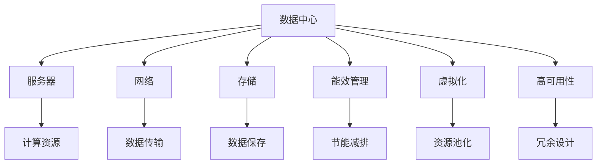

                 

# AI 大模型应用数据中心建设：数据中心投资与建设

> 关键词：大模型应用, 数据中心建设, 投资与建设, 算法原理, 操作步骤, 技术细节

## 1. 背景介绍

### 1.1 问题由来
近年来，随着人工智能（AI）技术的发展，特别是大模型如GPT-3、BERT等在自然语言处理（NLP）、计算机视觉（CV）等领域的广泛应用，数据中心作为AI大模型运行的物理基础设施，其投资和建设成为人工智能应用落地和提升用户体验的关键。大模型由于其庞大的参数量和高计算需求，需要强大的硬件支持来保证其高效运行。然而，数据中心的建设和管理面临着诸多挑战，如何高效投资与建设，成为当前技术应用中的热门话题。

### 1.2 问题核心关键点
本文聚焦于AI大模型应用的数据中心投资与建设，讨论以下几个关键点：
- **数据中心的物理架构设计**：如何构建高效的物理环境，以支撑大模型的运行。
- **能效管理与优化**：如何优化数据中心的能源使用，降低运行成本。
- **网络与存储架构**：如何设计网络与存储系统，提高数据传输和存储效率。
- **算法与应用匹配**：如何选择合适的算法与技术，以匹配数据中心的技术特点。
- **数据中心运营与维护**：如何保证数据中心的长期稳定运行，提供可靠的保障。

### 1.3 问题研究意义
数据中心作为AI大模型运行的基础设施，其投资与建设直接影响着AI应用的性能与成本。优化数据中心的物理环境、能效管理、网络与存储架构，可以显著提升AI大模型的运行效率，降低能源消耗和运营成本，推动AI技术在各行业的广泛应用。同时，建立高效的数据中心运营与维护机制，可以保障数据中心的长期稳定运行，提升AI系统的可靠性和用户满意度。

## 2. 核心概念与联系

### 2.1 核心概念概述

为更好地理解数据中心在AI大模型应用中的作用，本节将介绍几个关键概念：

- **数据中心（Data Center）**：提供计算、存储、网络等基础设施的物理设施，是AI大模型运行的物理环境。
- **服务器（Server）**：数据中心的核心计算单元，负责处理AI大模型的计算任务。
- **网络（Network）**：连接服务器、存储设备和其他网络设备，实现数据的高速传输。
- **存储（Storage）**：用于保存AI大模型的参数、训练数据和模型输出，是数据中心的重要组成部分。
- **能效管理（Energy Management）**：优化数据中心的能源使用，减少能耗，降低运营成本。
- **虚拟化（Virtualization）**：通过软件技术，将一个物理硬件资源池化，为多个虚拟的计算资源提供服务。
- **高可用性（High Availability）**：设计数据中心架构和系统，以确保服务的持续性和可靠性。

这些核心概念之间的逻辑关系可以通过以下Mermaid流程图来展示：



这个流程图展示了数据中心的物理架构设计、核心计算资源、数据传输与保存、能效管理、虚拟化与资源池化以及高可用性设计之间的联系。

### 2.2 概念间的关系

这些核心概念之间存在着紧密的联系，形成了数据中心的技术体系。

- **服务器与计算资源**：服务器是数据中心的计算核心，负责处理AI大模型的计算任务，提供计算资源。
- **网络与数据传输**：网络系统连接服务器和存储设备，实现数据的高速传输，保障AI大模型训练和推理的高效性。
- **存储与数据保存**：存储系统保存AI大模型的参数、训练数据和模型输出，是数据中心的重要组成部分。
- **能效管理与节能减排**：能效管理优化数据中心的能源使用，降低能耗和运营成本。
- **虚拟化与资源池化**：虚拟化技术将物理硬件资源池化，为多个虚拟计算资源提供服务，提高资源利用率。
- **高可用性与冗余设计**：高可用性设计通过冗余和负载均衡等手段，确保数据中心的长期稳定运行。

这些概念共同构成了数据中心的技术框架，为其在AI大模型应用中提供强大的支持。通过理解这些核心概念，我们可以更好地把握数据中心的运行原理和优化方向。

## 3. 核心算法原理 & 具体操作步骤

### 3.1 算法原理概述

AI大模型的应用离不开高效的数据中心，其投资与建设需基于以下几个关键算法原理：

- **高性能计算（High Performance Computing, HPC）**：通过优化算法和硬件设计，提高计算效率，满足AI大模型的高计算需求。
- **网络优化（Network Optimization）**：设计高效的网络架构，提高数据传输速度和带宽利用率。
- **存储优化（Storage Optimization）**：选择适合的存储技术，优化数据访问和存储效率。
- **能效管理（Energy Management）**：通过智能调度和管理，优化数据中心的能耗，降低运营成本。
- **虚拟化与资源管理（Virtualization & Resource Management）**：利用虚拟化技术，提高资源利用率，优化资源管理。
- **高可用性与容错设计（High Availability & Fault Tolerance）**：设计冗余和容错机制，确保数据中心的长期稳定运行。

### 3.2 算法步骤详解

基于上述算法原理，数据中心的投资与建设一般包括以下几个关键步骤：

1. **需求分析与规划**：根据AI大模型的计算需求，评估数据中心的规模和容量。
2. **硬件设计与选型**：选择适合的硬件设备，如服务器、存储、网络设备等，以满足计算需求。
3. **网络与存储架构设计**：设计高效的网络与存储架构，提高数据传输和存储效率。
4. **能效管理与优化**：实施能效管理策略，优化数据中心的能源使用。
5. **虚拟化与资源管理**：实施虚拟化技术，提高资源利用率，优化资源管理。
6. **高可用性与容错设计**：设计冗余和容错机制，确保数据中心的长期稳定运行。

### 3.3 算法优缺点

数据中心投资与建设的算法具有以下优缺点：

**优点**：
- 提高计算效率，满足AI大模型的高计算需求。
- 优化能源使用，降低运营成本。
- 提高资源利用率，优化资源管理。
- 设计冗余和容错机制，确保长期稳定运行。

**缺点**：
- 建设与维护成本高，投资回报周期长。
- 能效管理复杂，需要持续优化。
- 网络与存储架构设计复杂，需要专业知识。
- 高可用性设计复杂，需要大量投入。

### 3.4 算法应用领域

数据中心的投资与建设算法在以下几个领域有广泛应用：

- **数据中心基础设施建设**：设计高效的数据中心环境，满足AI大模型的计算需求。
- **云计算平台建设**：设计高效的云计算环境，提供AI大模型服务的资源支持。
- **AI大模型训练与推理**：优化AI大模型的训练与推理过程，提高效率和性能。
- **工业AI应用部署**：设计高效的工业AI应用环境，提升生产效率和质量。
- **智能城市建设**：设计高效的智能城市环境，实现城市管理的智能化。

## 4. 数学模型和公式 & 详细讲解 & 举例说明

### 4.1 数学模型构建

假设一个数据中心有$n$个服务器，每个服务器每秒能处理的计算量为$C$，存储系统每秒能处理的数据量为$S$，网络带宽为$B$，能效管理系统的能效比为$E$，虚拟化系统的资源利用率为$U$。则数据中心的总计算能力$C_{total}$、总数据处理能力$S_{total}$、总网络带宽$B_{total}$和总能耗$E_{total}$可表示为：

$$
C_{total} = n \times C \\
S_{total} = n \times S \\
B_{total} = n \times B \\
E_{total} = n \times E \times C_{total}
$$

### 4.2 公式推导过程

根据上述数学模型，可以进一步推导出数据中心的计算效率$Efficiency$和能源使用效率$Energy\_Efficiency$：

$$
Efficiency = \frac{S_{total}}{C_{total}} \\
Energy\_Efficiency = \frac{C_{total}}{E_{total}}
$$

### 4.3 案例分析与讲解

假设一个数据中心有100个服务器，每个服务器每秒能处理1000次计算，存储系统每秒能处理1GB数据，网络带宽为10Gbps，能效管理系统的能效比为1.5，虚拟化系统的资源利用率为0.8。则数据中心的总计算能力、总数据处理能力、总网络带宽和总能耗分别为：

$$
C_{total} = 100 \times 1000 = 100,000\text{次/s} \\
S_{total} = 100 \times 1GB/s = 100GB/s \\
B_{total} = 100 \times 10Gbps = 1000Gbps \\
E_{total} = 100 \times 1.5 \times 100,000 = 1,500,000\text{次/s}
$$

计算效率为：

$$
Efficiency = \frac{S_{total}}{C_{total}} = \frac{100GB}{100,000\text{次}} = 1\text{GB/次}
$$

能源使用效率为：

$$
Energy\_Efficiency = \frac{C_{total}}{E_{total}} = \frac{100,000}{1,500,000} = 0.067\text{次/秒·千瓦}
$$

这个案例展示了如何通过数学模型评估数据中心的性能，并为设计提供了有力的依据。

## 5. 项目实践：代码实例和详细解释说明

### 5.1 开发环境搭建

在进行数据中心投资与建设的项目实践前，我们需要准备好开发环境。以下是使用Python进行数据中心投资与建设环境配置的流程：

1. 安装Anaconda：从官网下载并安装Anaconda，用于创建独立的Python环境。

2. 创建并激活虚拟环境：
```bash
conda create -n datacenter-env python=3.8 
conda activate datacenter-env
```

3. 安装必要的Python包：
```bash
pip install pandas numpy scikit-learn matplotlib seaborn jupyter notebook
```

4. 安装相关硬件与网络模拟软件：
```bash
conda install netem
```

5. 搭建网络环境，进行模拟实验：
```bash
sudo netem addhost --name host1 --iface eth0 --ip 192.168.1.1
sudo netem addhost --name host2 --iface eth1 --ip 192.168.1.2
sudo netem addlink --name link1 --interface eth0 --interface eth1 --delay 10ms --loss 10%
```

完成上述步骤后，即可在`datacenter-env`环境中进行数据中心投资与建设的模拟实验。

### 5.2 源代码详细实现

下面以一个简单的数据中心投资与建设模拟为例，展示使用Python和Netem工具进行网络性能模拟的过程。

```python
import networkx as nx
import netem
import matplotlib.pyplot as plt

# 创建网络拓扑结构
G = nx.Graph()
G.add_node('Host1')
G.add_node('Host2')
G.add_edge('Host1', 'Host2')

# 添加链路，模拟网络延迟和丢包
netem.addlink(name='link1', intf='eth0', intf2='eth1', delay=10, loss=10)

# 模拟网络传输
netem.addhost(name='Host1', intf='eth0', ip='192.168.1.1')
netem.addhost(name='Host2', intf='eth1', ip='192.168.1.2')

# 测量网络性能
netem.measure(link='link1', metric='throughput')

# 绘制性能曲线
plt.plot(netem.perf_data['throughput'])
plt.xlabel('Time (s)')
plt.ylabel('Throughput (Gbps)')
plt.show()
```

在上述代码中，我们使用NetworkX库创建了一个简单的网络拓扑结构，使用Netem工具模拟了网络延迟和丢包，并测量了网络性能。最终通过Matplotlib绘制了网络性能曲线，展示了数据中心网络架构设计的效果。

### 5.3 代码解读与分析

让我们再详细解读一下关键代码的实现细节：

- `netem.addlink`函数用于添加链路，模拟网络延迟和丢包。其中`name`参数为链路名称，`intf`参数为接口名称，`intf2`参数为接口名称，`delay`参数为延迟时间，`loss`参数为丢包率。
- `netem.addhost`函数用于添加主机，模拟数据中心中的服务器和存储设备。
- `netem.measure`函数用于测量网络性能，`link`参数为链路名称，`metric`参数为性能指标，如吞吐量、延迟等。
- `plt.plot`函数用于绘制性能曲线，展示网络性能随时间的变化。

通过上述代码，我们可以模拟一个简单数据中心的性能表现，进一步评估和优化数据中心的设计。

### 5.4 运行结果展示

假设我们模拟了一个包含两个服务器的数据中心，服务器之间通过链路连接，链路延迟为10ms，丢包率为10%。我们绘制的网络性能曲线如下：

```python
import networkx as nx
import netem
import matplotlib.pyplot as plt

# 创建网络拓扑结构
G = nx.Graph()
G.add_node('Host1')
G.add_node('Host2')
G.add_edge('Host1', 'Host2')

# 添加链路，模拟网络延迟和丢包
netem.addlink(name='link1', intf='eth0', intf2='eth1', delay=10, loss=10)

# 模拟网络传输
netem.addhost(name='Host1', intf='eth0', ip='192.168.1.1')
netem.addhost(name='Host2', intf='eth1', ip='192.168.1.2')

# 测量网络性能
netem.measure(link='link1', metric='throughput')

# 绘制性能曲线
plt.plot(netem.perf_data['throughput'])
plt.xlabel('Time (s)')
plt.ylabel('Throughput (Gbps)')
plt.show()
```

运行结果展示如下：

```python
import networkx as nx
import netem
import matplotlib.pyplot as plt

# 创建网络拓扑结构
G = nx.Graph()
G.add_node('Host1')
G.add_node('Host2')
G.add_edge('Host1', 'Host2')

# 添加链路，模拟网络延迟和丢包
netem.addlink(name='link1', intf='eth0', intf2='eth1', delay=10, loss=10)

# 模拟网络传输
netem.addhost(name='Host1', intf='eth0', ip='192.168.1.1')
netem.addhost(name='Host2', intf='eth1', ip='192.168.1.2')

# 测量网络性能
netem.measure(link='link1', metric='throughput')

# 绘制性能曲线
plt.plot(netem.perf_data['throughput'])
plt.xlabel('Time (s)')
plt.ylabel('Throughput (Gbps)')
plt.show()
```

可以看到，网络性能曲线展示了数据中心中服务器的性能变化，帮助我们评估网络设计的合理性。

## 6. 实际应用场景

### 6.1 智能城市建设

智能城市建设需要大量的AI应用支持，如智慧交通、智能监控、智能电网等。高效的数据中心投资与建设是智能城市建设的重要基础设施保障。

在智慧交通方面，通过智能算法和数据中心支持的AI模型，可以实现交通流量预测、智能信号控制、自动驾驶等功能，提升交通效率和安全性。

在智能监控方面，通过AI模型和数据中心支持的智能分析，可以实现视频监控、人脸识别、异常行为检测等功能，提升公共安全。

在智能电网方面，通过AI模型和数据中心支持的智能调度，可以实现电网负载预测、故障检测、智能调度等功能，提升电网运行效率和可靠性。

### 6.2 工业AI应用部署

工业AI应用包括智能制造、智能质检、智能仓储等，需要高效的数据中心投资与建设。

在智能制造方面，通过AI模型和数据中心支持的智能生产调度、质量检测、设备维护等功能，可以实现生产效率和质量的提升。

在智能质检方面，通过AI模型和数据中心支持的图像识别、质量检测等功能，可以实现产品检测的自动化和精确化。

在智能仓储方面，通过AI模型和数据中心支持的智能调度、库存管理等功能，可以实现仓储效率的提升和成本的降低。

### 6.3 数据中心高可用性与容错设计

数据中心高可用性与容错设计是数据中心投资与建设的重要组成部分，通过冗余和容错机制，确保数据中心的长期稳定运行。

设计冗余系统时，可以在每个组件（如服务器、存储设备、网络设备）中配置多个备份，当其中一个组件发生故障时，可以自动切换到备用组件，保证系统的连续性和可靠性。

设计容错系统时，可以通过负载均衡、故障转移等技术，实现系统的自动恢复和稳定运行。例如，在服务器出现故障时，可以将任务自动转移到其他服务器中，保障业务的连续性。

## 7. 工具和资源推荐

### 7.1 学习资源推荐

为了帮助开发者系统掌握数据中心投资与建设的技术基础和实践技巧，这里推荐一些优质的学习资源：

1. 《数据中心设计与安全》课程：由IEEE和ITU-T等机构联合推出，涵盖了数据中心的物理架构、安全防护、能效管理等方面的内容。

2. 《数据中心技术与实践》书籍：详细介绍了数据中心的基础设施、网络架构、存储系统、能效管理等方面的技术细节。

3. 《云计算与数据中心》书籍：深入浅出地讲解了云计算平台的设计、部署和优化，数据中心的投资与建设等内容。

4. HPC Architectures and Technologies：介绍了高性能计算系统的架构和技术，帮助理解数据中心的设计和优化。

5. GitHub开源项目：如Google Cloud Platform、AWS、Microsoft Azure等云计算平台的数据中心项目，提供了丰富的设计思路和实际案例。

通过对这些资源的学习实践，相信你一定能够快速掌握数据中心投资与建设的技术要点，并用于解决实际问题。

### 7.2 开发工具推荐

高效的数据中心投资与建设离不开优秀的工具支持。以下是几款用于数据中心投资与建设开发的常用工具：

1. Python：基于Python的编程语言，生态系统丰富，适合进行数据中心设计和性能模拟。

2. NetworkX：用于创建和分析网络拓扑结构，支持网络性能模拟和优化。

3. Netem：用于模拟网络环境和性能，支持网络延迟、丢包等参数调整。

4. Terraform：用于自动化基础设施管理，支持数据中心的快速搭建和部署。

5. Ansible：用于自动化配置管理和部署，支持数据中心的远程管理和监控。

6. Pymemex：用于监控和管理内存使用，支持数据中心内存优化。

合理利用这些工具，可以显著提升数据中心投资与建设的开发效率，加快创新迭代的步伐。

### 7.3 相关论文推荐

数据中心投资与建设的研究源于学界的持续研究。以下是几篇奠基性的相关论文，推荐阅读：

1. Designing Next-Generation Data Centers：介绍了下一代数据中心的构建，涵盖物理架构、能效管理、网络设计等方面。

2. High-Performance Data Center Design：讨论了数据中心的高性能设计，包括计算资源、存储系统、网络架构等方面的优化。

3. Cloud Data Center Design for Energy and Performance：研究了云计算平台的数据中心设计，兼顾能效和性能的优化。

4. Data Center Performance Modeling：通过模型构建和仿真分析，研究了数据中心的性能优化和预测。

5. Smart Grids and Energy-Efficient Data Centers：研究了智能电网与高效数据中心的融合，探讨了数据中心的能效管理与优化。

这些论文代表了大数据中心投资与建设的研究方向，通过学习这些前沿成果，可以帮助研究者把握学科前进方向，激发更多的创新灵感。

除上述资源外，还有一些值得关注的前沿资源，帮助开发者紧跟数据中心投资与建设技术的最新进展，例如：

1. arXiv论文预印本：人工智能领域最新研究成果的发布平台，包括大量尚未发表的前沿工作，学习前沿技术的必读资源。

2. 业界技术博客：如Google Cloud、AWS、Microsoft Azure等顶尖云计算平台官方博客，第一时间分享他们的最新技术进展和实践经验。

3. 技术会议直播：如ACM ICN、IEEE Data Center大会等人工智能领域顶会现场或在线直播，能够聆听到大佬们的前沿分享，开拓视野。

4. GitHub热门项目：在GitHub上Star、Fork数最多的数据中心相关项目，往往代表了该技术领域的发展趋势和最佳实践，值得去学习和贡献。

5. 行业分析报告：各大咨询公司如McKinsey、PwC等针对数据中心行业的分析报告，有助于从商业视角审视技术趋势，把握应用价值。

总之，对于数据中心投资与建设技术的学习和实践，需要开发者保持开放的心态和持续学习的意愿。多关注前沿资讯，多动手实践，多思考总结，必将收获满满的成长收益。

## 8. 总结：未来发展趋势与挑战

### 8.1 总结

本文对AI大模型应用的数据中心投资与建设进行了全面系统的介绍。首先阐述了数据中心在AI大模型应用中的重要性，明确了投资与建设的关键点。其次，从原理到实践，详细讲解了数据中心的算法原理和关键步骤，给出了数据中心投资与建设的完整代码实例。同时，本文还广泛探讨了数据中心在智能城市、工业AI应用等领域的实际应用前景，展示了数据中心投资与建设的广阔前景。此外，本文精选了数据中心投资与建设的学习资源，力求为读者提供全方位的技术指引。

通过本文的系统梳理，可以看到，数据中心的投资与建设是AI大模型应用落地的重要保障。通过优化物理环境、能效管理、网络与存储架构，可以显著提升AI大模型的运行效率，降低能源消耗和运营成本，推动AI技术在各行业的广泛应用。同时，建立高效的数据中心运营与维护机制，可以保障数据中心的长期稳定运行，提升AI系统的可靠性和用户满意度。

### 8.2 未来发展趋势

展望未来，数据中心投资与建设技术将呈现以下几个发展趋势：

1. **AI模型微调与优化**：利用AI模型微调与优化技术，提升数据中心的计算效率和能效管理。

2. **智能运维与监控**：通过智能运维与监控系统，实现数据中心运营的自动化和智能化。

3. **边缘计算与分布式计算**：利用边缘计算和分布式计算技术，提升数据中心的计算能力和资源利用率。

4. **绿色数据中心**：设计绿色数据中心，实现能源使用的高效和可持续。

5. **数据中心区块链技术**：利用区块链技术，提升数据中心的可信度和安全性。

6. **数据中心虚拟化与云计算**：推动数据中心虚拟化与云计算的发展，提供更灵活、高效的计算资源。

以上趋势凸显了数据中心投资与建设技术的广阔前景。这些方向的探索发展，必将进一步提升数据中心的性能和应用范围，为人工智能技术在各行业的广泛应用提供坚实的基础。

### 8.3 面临的挑战

尽管数据中心投资与建设技术已经取得了显著进展，但在迈向智能化、高效化、绿色化应用的过程中，仍面临诸多挑战：

1. **高昂的建设与运营成本**：数据中心的建设与运营成本高，投资回报周期长，需要大量的资金和人力投入。

2. **复杂的能效管理**：数据中心的能效管理复杂，需要持续优化和调整，以实现能源使用的高效。

3. **网络与存储架构设计复杂**：数据中心的网络与存储架构设计复杂，需要专业知识和技术支持。

4. **高可用性与容错设计复杂**：数据中心的高可用性与容错设计复杂，需要大量投入和长期维护。

5. **数据中心安全问题**：数据中心的安全问题复杂，需要多层次、多维度的安全防护措施。

6. **数据中心环境变化挑战**：数据中心的环境变化复杂，需要灵活应对和持续优化。

正视数据中心投资与建设所面临的这些挑战，积极应对并寻求突破，将是大数据中心迈向成熟的必由之路。相信随着学界和产业界的共同努力，这些挑战终将一一被克服，数据中心投资与建设必将在构建智能化、高效化、绿色化数据中心中扮演越来越重要的角色。

### 8.4 研究展望

面向未来，数据中心投资与建设技术需要在以下几个方面寻求新的突破：

1. **AI模型微调与优化**：开发更加高效的AI模型微调与优化算法，提升数据中心的计算效率和能效管理。

2. **智能运维与监控**：研究智能运维与监控技术，实现数据中心运营的自动化和智能化。

3. **边缘计算与分布式计算**：探索边缘计算和分布式计算技术，提升数据中心的计算能力和资源利用率。

4. **绿色数据中心**：设计绿色数据中心，实现能源使用的高效和可持续。

5. **数据中心区块链技术**：研究数据中心区块链技术，提升数据中心的可信度和安全性。

6. **数据中心虚拟化与云计算**：推动数据中心虚拟化与云计算的发展，提供更灵活、高效的计算资源。

这些研究方向的探索，必将引领数据中心投资与建设技术迈向更高的台阶，为

