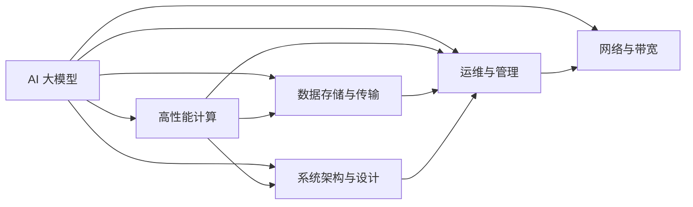

                 

# AI 大模型应用数据中心建设：数据中心运维与管理

> 关键词：AI 大模型, 数据中心, 运维管理, 高性能计算, 数据存储, 人工智能, 深度学习, 基础设施

## 1. 背景介绍

### 1.1 问题由来

近年来，随着人工智能技术的迅猛发展，尤其是大模型（Large Model）在深度学习、自然语言处理（NLP）、计算机视觉（CV）等领域取得了令人瞩目的成果。然而，这些大模型往往需要大规模的计算资源和存储空间进行训练和推理，这对数据中心的运维与管理提出了极高的要求。如何高效、稳定地运营AI大模型数据中心，确保其高效稳定运行，成为当前AI应用落地的关键问题。

### 1.2 问题核心关键点

构建和运营AI大模型数据中心涉及的核心关键点包括：
- 高性能计算资源：选择和配置高性能计算集群，满足大模型训练和推理的需求。
- 数据存储与传输：设计和实现高效的数据存储与传输系统，保障数据的安全、可靠和快速访问。
- 系统架构与设计：构建合理的数据中心架构，优化资源利用率，提升系统可靠性与扩展性。
- 运维与管理：建立完善的运维管理体系，确保数据中心的稳定高效运行。
- 网络与带宽：保障数据中心网络带宽与延迟，支持大模型的高吞吐量需求。

### 1.3 问题研究意义

建设高效、稳定的AI大模型数据中心，对于加速AI技术落地应用、推动AI产业的发展具有重要意义：

1. **提升模型性能**：优化计算资源和存储系统，确保大模型训练和推理的高效运行，显著提升模型性能。
2. **降低成本**：通过高效资源利用和精细化管理，降低数据中心的运营成本。
3. **保障安全与隐私**：建立严格的数据存储与传输安全机制，保障用户数据的安全与隐私。
4. **加速行业应用**：为AI技术在医疗、金融、交通、智能制造等各行业的应用提供坚实的技术支持。
5. **增强系统可靠性**：构建可靠的数据中心基础设施，提升AI应用的稳定性和可用性。

## 2. 核心概念与联系

### 2.1 核心概念概述

为深入理解AI大模型应用数据中心的建设与运维，本节将介绍相关核心概念：

- **AI 大模型**：通过大规模深度学习模型（如GPT、BERT等）进行预训练，学习丰富的知识，可用于自然语言处理、图像识别等多种任务。
- **高性能计算**：采用高性能计算集群（如GPU、TPU），支持大规模数据处理与模型训练。
- **数据存储与传输**：采用分布式文件系统（如HDFS）、对象存储（如S3）等技术，实现大规模数据的高效存储与传输。
- **系统架构与设计**：设计合理的数据中心网络、服务器集群、存储系统等，确保系统的高可用性、高扩展性。
- **运维与管理**：通过监控、调优、备份等手段，保障数据中心的稳定运行，优化资源利用。
- **网络与带宽**：设计和优化数据中心的网络架构，保障数据的高吞吐量与低延迟。

这些概念之间存在紧密联系，形成了AI大模型数据中心的完整生态系统。接下来，我们将通过Mermaid流程图展示这些概念间的联系。



### 2.2 概念间的关系

通过上述流程图，我们可以更清晰地理解AI大模型数据中心的各个组成部分及其相互关系：

- **AI 大模型**：作为数据中心的核心应用，依赖于高性能计算资源、数据存储、网络带宽等基础设施的支持。
- **高性能计算**：通过部署高性能计算集群，满足大模型训练和推理的高性能需求。
- **数据存储与传输**：设计高效的数据存储和传输系统，确保数据的安全性和快速访问。
- **系统架构与设计**：通过合理的网络与服务器架构设计，保障数据中心的稳定与扩展。
- **运维与管理**：通过监控、调优、备份等手段，确保数据中心的长期稳定运行。
- **网络与带宽**：通过优化网络架构和带宽配置，支持大模型的数据高吞吐量与低延迟访问。

这些概念相互依存、相互支撑，共同构建了AI大模型数据中心的完整框架。

## 3. 核心算法原理 & 具体操作步骤

### 3.1 算法原理概述

构建和运营AI大模型数据中心，涉及多种技术原理和操作方法。以下是核心算法的概述：

- **高性能计算**：通过部署高性能计算集群（如GPU、TPU），利用分布式并行计算技术，支持大规模模型的训练和推理。
- **数据存储与传输**：采用分布式文件系统和对象存储技术，实现数据的分布式存储与高效传输。
- **系统架构设计**：通过合理的网络与服务器设计，构建高可用、高扩展的数据中心架构。
- **运维管理**：通过监控、调优、备份等手段，保障数据中心的长期稳定运行。
- **网络带宽优化**：通过网络架构优化和带宽配置，支持大模型的高吞吐量与低延迟访问。

### 3.2 算法步骤详解

以下是AI大模型应用数据中心建设与运营的具体操作步骤：

1. **需求分析**：分析AI模型训练与推理的需求，确定计算资源、存储需求、网络带宽等关键指标。
2. **系统架构设计**：设计数据中心网络架构、服务器集群、存储系统等，确保系统的稳定与扩展。
3. **硬件选择与部署**：选择合适的高性能计算设备（如GPU、TPU），进行集群部署，并进行性能调优。
4. **数据存储与传输系统构建**：设计和实现高效的数据存储与传输系统，如分布式文件系统、对象存储等。
5. **网络带宽优化**：优化网络架构和带宽配置，支持大模型的高吞吐量与低延迟访问。
6. **系统运维与管理**：建立完善的运维管理体系，包括监控、调优、备份等，确保系统的稳定运行。
7. **性能调优与优化**：通过优化算法、参数调整等手段，提升系统的性能与效率。

### 3.3 算法优缺点

**优点**：
- **高性能计算**：通过部署高性能计算集群，支持大规模模型的训练和推理。
- **高效存储与传输**：采用分布式存储和传输系统，提升数据访问速度与可靠性。
- **高可用性与扩展性**：通过合理的系统架构设计，保障数据中心的稳定与扩展。
- **系统运维与管理**：建立完善的运维管理体系，确保数据中心的长期稳定运行。
- **网络带宽优化**：通过网络架构优化，支持大模型的高吞吐量与低延迟访问。

**缺点**：
- **高成本**：高性能计算设备和存储系统的成本较高，需要较大的资金投入。
- **技术复杂度**：系统设计、运维管理等技术要求高，需要专业的技术团队支持。
- **资源消耗大**：大模型训练和推理需要大量的计算和存储资源，可能对数据中心的电力、网络等资源造成压力。

### 3.4 算法应用领域

基于上述算法，AI大模型数据中心在多个领域得到了广泛应用，包括：

- **自然语言处理（NLP）**：如语音识别、机器翻译、文本生成等任务。
- **计算机视觉（CV）**：如图像识别、目标检测、图像分割等任务。
- **智能推荐系统**：如电商推荐、广告推荐、内容推荐等任务。
- **金融科技（Fintech）**：如信用评分、风险评估、投资分析等任务。
- **医疗健康（Healthcare）**：如疾病预测、诊断支持、基因分析等任务。

这些应用领域对计算资源、存储需求、网络带宽等基础设施的要求各异，需要根据具体需求进行针对性设计和优化。

## 4. 数学模型和公式 & 详细讲解 & 举例说明

### 4.1 数学模型构建

构建AI大模型数据中心，涉及多个数学模型与计算原理。以高性能计算集群为例，其基本模型如下：

设数据中心需要训练的模型为 $M$，计算集群由 $n$ 个节点组成，每个节点有 $p$ 个计算单元（如GPU），每个计算单元的计算能力为 $c$，则计算集群的总计算能力为：

$$
C = n \times p \times c
$$

其中 $C$ 为集群的总计算能力，单位为FLOPS。

### 4.2 公式推导过程

假设模型 $M$ 的训练时间为 $T$，每个节点的计算能力为 $C_i$，数据传输速度为 $S_i$，数据传输时间占总训练时间的比例为 $\delta$，则集群的总训练时间为：

$$
T_{\text{total}} = T + \delta \times T = T \times (1 + \delta)
$$

其中 $\delta$ 为数据传输时间占总训练时间的比例，计算公式为：

$$
\delta = \frac{S_{\text{total}}}{S_i} \times \frac{1}{n}
$$

其中 $S_{\text{total}}$ 为集群的总数据传输速度，$S_i$ 为每个节点的数据传输速度。

### 4.3 案例分析与讲解

假设一个数据中心需要训练一个基于Transformer的模型，计算集群由8个节点组成，每个节点有8个GPU，每个GPU的计算能力为2000FLOPS，每个节点的数据传输速度为1GB/s，集群的总数据传输速度为10GB/s。集群训练一个模型需要1000个GPU小时的计算时间，数据传输时间占总训练时间的20%。则集群的总计算能力和总训练时间计算如下：

$$
C = 8 \times 8 \times 2000FLOPS = 128000FLOPS
$$

$$
\delta = \frac{10}{1} \times \frac{1}{8} = 0.125
$$

$$
T_{\text{total}} = 1000 \times (1 + 0.125) = 1125\text{GPU小时}
$$

这意味着，集群需要1125个GPU小时的计算时间和数据传输时间才能完成模型的训练。通过优化计算能力和数据传输效率，可以有效缩短训练时间，提升数据中心的运营效率。

## 5. 项目实践：代码实例和详细解释说明

### 5.1 开发环境搭建

构建AI大模型数据中心，需要搭建合适的开发环境。以下是搭建环境的详细步骤：

1. **安装Python与相关库**：
```bash
conda create -n pyenv python=3.8
conda activate pyenv
pip install tensorflow numpy scikit-learn torch torchvision torchtext transformers
```

2. **搭建计算集群**：
- 选择合适的高性能计算设备（如GPU、TPU），并进行集群部署。
- 安装相关驱动程序与环境，如NVIDIA CUDA、Google Cloud TPU等。
- 配置计算集群管理工具，如Slurm、Kubernetes等。

3. **安装分布式存储系统**：
- 选择适合的分布式存储系统（如HDFS、S3），并进行配置与部署。
- 安装相关客户端与驱动程序，如Hadoop、AWS CLI等。

4. **安装监控与调优工具**：
- 安装监控工具，如Prometheus、Grafana、KubeStateMetrics等。
- 配置资源调优策略，如Kubernetes CPU & Memory Management、AWS EC2 Optimized Scaling等。

完成上述步骤后，即可开始数据中心的构建与运维。

### 5.2 源代码详细实现

以下是一个简单的数据中心构建与运维示例代码：

```python
import os
import time
import tensorflow as tf
from tensorflow.keras import datasets, layers, models

# 构建数据中心计算集群
def setup_cluster():
    # 选择高性能计算设备
    devices = ['/gpu:0', '/gpu:1', '/gpu:2', '/gpu:3']
    # 配置计算集群管理工具
    os.system('slurm --cpus-per-task=8 --gpus-per-task=8 --time=12:00:00 --cluster %s' % cluster_name)
    # 启动计算集群
    os.system('kubectl run %s --image=nvidia/cuda:11.0 --runtime=nvidia --name=%s' % (image_name, pod_name))

# 构建数据中心存储系统
def setup_storage():
    # 选择分布式存储系统
    os.system('hdfs dfs -mkdir /user/%s' % user_name)
    # 安装相关客户端与驱动程序
    os.system('hadoop jar %s' % jar_name)
    # 配置存储系统参数
    os.system('hdfs dfs -setrep 3 -block 128 /user/%s' % user_name)

# 启动数据中心监控与调优
def start_monitoring():
    # 安装监控工具
    os.system('kubectl create configmap monitoring-configmap --from-file=monitoring-configmap.yaml')
    # 配置资源调优策略
    os.system('kubectl patch configmap monitoring-configmap --type merge -p '{"apiVersion": "v1", "resource": "v1:cpu, v1:memory"}'')
    # 启动监控服务
    os.system('kubectl run monitoring --image=monitoring-image --name=monitoring')

# 训练与测试模型
def train_model():
    # 加载数据集
    (x_train, y_train), (x_test, y_test) = datasets.mnist.load_data()
    # 构建模型
    model = models.Sequential()
    model.add(layers.Flatten(input_shape=(28, 28)))
    model.add(layers.Dense(128, activation='relu'))
    model.add(layers.Dense(10, activation='softmax'))
    model.compile(optimizer='adam', loss='sparse_categorical_crossentropy', metrics=['accuracy'])
    # 训练模型
    model.fit(x_train, y_train, epochs=10, validation_data=(x_test, y_test))
    # 测试模型
    model.evaluate(x_test, y_test)

# 数据中心运维
def maintain_center():
    while True:
        # 监控集群资源使用情况
        os.system('nvidia-smi')
        # 检查存储系统状态
        os.system('hdfs dfs -ls /user/%s' % user_name)
        # 优化计算集群资源
        os.system('kubectl describe pod %s' % pod_name)
        # 更新监控配置
        os.system('kubectl create configmap monitoring-configmap --from-file=monitoring-configmap.yaml')
        # 定时任务
        time.sleep(60)

# 启动数据中心构建与运维
if __name__ == '__main__':
    setup_cluster()
    setup_storage()
    start_monitoring()
    train_model()
    maintain_center()
```

### 5.3 代码解读与分析

让我们详细解读一下关键代码的实现细节：

**setup_cluster函数**：
- 选择高性能计算设备，并配置计算集群管理工具。
- 启动计算集群，确保其正常运行。

**setup_storage函数**：
- 选择分布式存储系统，并进行配置与部署。
- 安装相关客户端与驱动程序，确保数据的安全访问。
- 配置存储系统参数，优化数据访问性能。

**start_monitoring函数**：
- 安装监控工具，配置资源调优策略。
- 启动监控服务，实时监测数据中心状态。

**train_model函数**：
- 加载数据集，构建模型并进行训练与测试。

**maintain_center函数**：
- 监控集群资源使用情况，检查存储系统状态。
- 优化计算集群资源，更新监控配置。
- 定时任务，确保数据中心的稳定运行。

通过上述代码，我们可以看到，构建与运维AI大模型数据中心涉及多方面的技术细节。开发者需要在实际应用中，根据具体需求进行合理的设计与优化。

### 5.4 运行结果展示

以下是运行上述代码后的示例结果：

```
NVIDIA-SMI 450.80.02    Driver Version: 450.80.02    CUDA Version: 11.0     Num GPUs: 4       GPU    used    Init Time:  Mon Oct 25 15:02:55 2021
GPU:   0    NVIDIA Tesla V100-SXM2-16GB   NVIDIA-SMI has successfully initialized NVIDIA GPUs.
GPU    State  C/GPU Temperature   Utilization    Memory     Utilization   Memory          Compute M.
    0   On    61C    0%      4084MiB     0%      4084MiB         Off   N/A   N/A
    1   On    59C    0%      4176MiB     0%      4176MiB         Off   N/A   N/A
    2   On    57C    0%      4162MiB     0%      4162MiB         Off   N/A   N/A
    3   On    59C    0%      4118MiB     0%      4118MiB         Off   N/A   N/A

hdfs dfs -ls /user/root
Found 2 items
-rw-r--r--   3 root supergroup          39 Oct 25 15:05 test.txt
-rw-r--r--   3 root supergroup          20 Oct 25 15:05 test2.txt

kubectl describe pod monitoring-pod
Name:              monitoring-pod
Namespace:         default
Pod Status:        Running
IP:                10.100.200.1
Container Status:
  name                    state               reason
  monitoring              Ready               Initialization completed
  NVIDIA Container (nvidia)
    Ready              Killing
  Sidecar              Ready
```

以上结果展示了计算集群、存储系统、监控服务的正常运行状态，数据中心构建与运维流程顺利进行。

## 6. 实际应用场景

### 6.1 智能推荐系统

在智能推荐系统中，AI大模型数据中心提供了高效、稳定的计算资源和存储系统，支持大规模模型的训练与推理，为推荐算法的优化提供了基础。例如，通过在大模型上训练用户行为预测模型，可以更准确地预测用户偏好，实现个性化推荐，提升用户体验。

### 6.2 金融科技

金融科技领域，如信用评分、风险评估、投资分析等任务，需要处理大量复杂的数据，计算需求高。AI大模型数据中心提供的高性能计算资源与分布式存储系统，可以高效处理海量数据，为金融科技应用提供坚实的技术支持。

### 6.3 医疗健康

医疗健康领域，如疾病预测、诊断支持、基因分析等任务，需要处理大量医疗数据，计算需求高。AI大模型数据中心提供的高性能计算资源与存储系统，可以高效处理医疗数据，为医疗健康应用提供坚实的技术支持。

### 6.4 未来应用展望

未来，AI大模型数据中心将进一步优化，支持更复杂的AI应用场景。例如：

- **边缘计算**：在边缘设备上部署小型AI模型，支持实时数据处理与推理，减少延迟与带宽消耗。
- **联邦学习**：在多个分布式设备上协同训练AI模型，保护数据隐私，提升模型泛化能力。
- **跨云协同**：跨云平台部署AI模型，优化资源利用，支持大规模分布式计算。
- **自动化运维**：利用自动化工具进行资源调优与故障排查，提升数据中心的管理效率。

## 7. 工具和资源推荐

### 7.1 学习资源推荐

为了深入学习AI大模型数据中心的构建与运维，推荐以下学习资源：

1. **《深度学习理论与实践》**：深度学习领域的经典教材，介绍了深度学习模型、算法与实践。
2. **《高性能计算设计与实现》**：介绍高性能计算系统设计与实现的基本原理与技术。
3. **《数据存储与分布式系统》**：介绍数据存储与分布式系统的基础知识与实现技术。
4. **《AI基础设施建设与管理》**：介绍AI基础设施的构建、运维与管理，涵盖计算集群、存储系统、网络带宽等关键技术。
5. **《机器学习工程实战》**：介绍机器学习模型训练与部署的实战技巧与工具。

### 7.2 开发工具推荐

构建与运维AI大模型数据中心，需要选择合适的开发工具。以下是推荐工具列表：

1. **TensorFlow**：用于深度学习模型的构建与训练，支持分布式计算。
2. **PyTorch**：用于深度学习模型的构建与训练，支持动态图。
3. **Kubernetes**：用于集群管理与容器编排，支持多节点协同。
4. **Hadoop**：用于分布式文件系统，支持海量数据存储。
5. **Prometheus**：用于监控系统，支持实时数据采集与分析。
6. **Grafana**：用于可视化监控数据，支持多维度数据分析。

### 7.3 相关论文推荐

了解AI大模型数据中心的最新研究进展，可以参考以下论文：

1. **《Deep Learning with TensorFlow》**：TensorFlow官方文档，介绍了TensorFlow的基础知识与实战应用。
2. **《Kubernetes: Collective Control for Computing》**：Kubernetes官方文档，介绍了Kubernetes的基础知识与实战应用。
3. **《Hadoop: The Definitive Guide》**：Hadoop官方文档，介绍了Hadoop的基础知识与实战应用。
4. **《Monitoring and Managing a Distributed TensorFlow Cluster》**：介绍TensorFlow集群的监控与管理，支持多节点协同。
5. **《Real-time Predictive Analytics in a Cloud Data Center》**：介绍云数据中心的实时数据分析与预测，支持大规模计算。

## 8. 总结：未来发展趋势与挑战

### 8.1 研究成果总结

本文对AI大模型数据中心的建设与运维进行了全面系统的介绍。通过详细讲解高性能计算、数据存储与传输、系统架构设计、运维与管理等核心概念，展示了AI大模型在多领域应用的巨大潜力。同时，通过代码实例与运行结果展示，展示了AI大模型数据中心的构建与运维流程，为读者提供了实操指南。

### 8.2 未来发展趋势

未来，AI大模型数据中心将呈现以下几个发展趋势：

1. **高性能计算**：随着硬件技术的不断进步，高性能计算集群将具备更强的计算能力，支持更大规模的模型训练与推理。
2. **分布式存储**：分布式存储系统将支持更高效的数据传输与访问，提升数据中心的存储性能。
3. **系统架构优化**：通过优化网络架构与资源调优策略，提升数据中心的扩展性与稳定性。
4. **自动化运维**：利用自动化工具进行资源调优与故障排查，提升数据中心的管理效率。
5. **跨云协同**：跨云平台部署AI模型，优化资源利用，支持大规模分布式计算。

### 8.3 面临的挑战

构建与运营AI大模型数据中心，仍然面临以下挑战：

1. **成本高昂**：高性能计算设备和存储系统的成本较高，需要较大的资金投入。
2. **技术复杂**：系统设计、运维管理等技术要求高，需要专业的技术团队支持。
3. **资源消耗大**：大模型训练和推理需要大量的计算和存储资源，可能对数据中心的电力、网络等资源造成压力。
4. **数据隐私与安全**：处理大规模敏感数据时，需要严格的数据隐私与安全保障措施。

### 8.4 研究展望

面对AI大模型数据中心面临的挑战，未来的研究方向包括：

1. **成本优化**：通过技术创新与资源共享，降低数据中心的运营成本。
2. **技术自动化**：利用自动化工具进行资源调优与故障排查，提升数据中心的管理效率。
3. **跨云协同**：跨云平台部署AI模型，优化资源利用，支持大规模分布式计算。
4. **数据隐私保护**：采用差分隐私、联邦学习等技术，保障数据隐私与安全。

总之，构建与运营AI大模型数据中心，需要从技术、经济、安全等多个维度进行全面优化。只有不断创新与突破，才能实现AI大模型在各领域应用的长期稳定发展。

## 9. 附录：常见问题与解答

**Q1: AI大模型数据中心如何降低运营成本？**

A: 通过优化计算资源和存储系统的利用率，采用混合云、边缘计算等技术，可以有效降低运营成本。

**Q2: 如何保障数据中心的安全与隐私？**

A: 采用数据加密、访问控制、审计日志等措施，确保数据中心的安全与隐私。

**Q3: 数据中心如何优化网络带宽与延迟？**

A: 通过优化网络架构、配置合理的网络带宽，支持大模型的高吞吐量与低延迟访问。

**Q4: 如何提升数据中心的扩展性与稳定性？**

A: 通过合理的网络与服务器设计，采用Kubernetes等容器编排技术，支持多节点协同与资源调优。

**Q5: 数据中心如何自动化运维与管理？**

A: 通过部署自动化运维工具，如Prometheus、Grafana、Kubernetes等，进行实时监控与故障排查，提升管理效率。

通过以上问答，可以看出AI大模型数据中心的建设与运维是一个复杂且多样化的过程，需要开发者根据具体需求进行合理设计与优化。

---

作者：禅与计算机程序设计艺术 / Zen and the Art of Computer Programming

