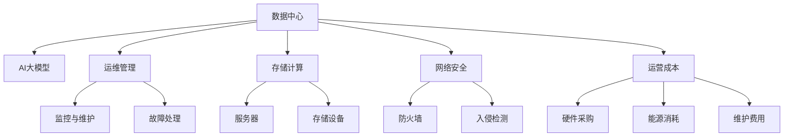
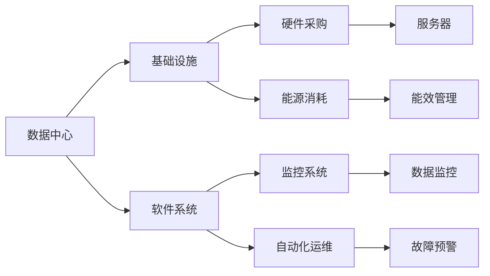
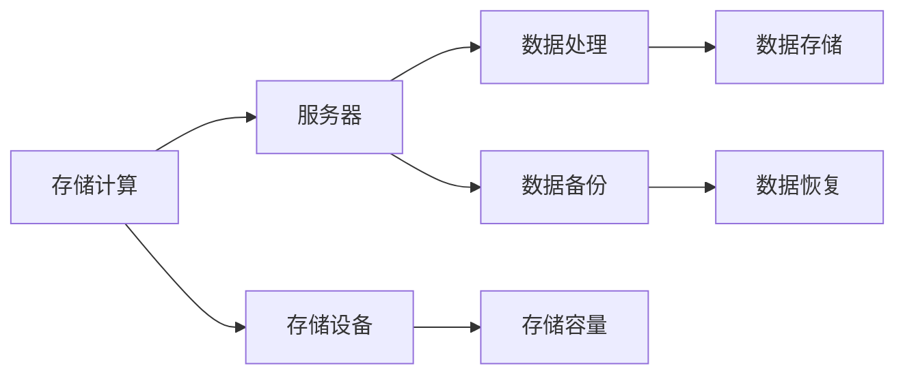
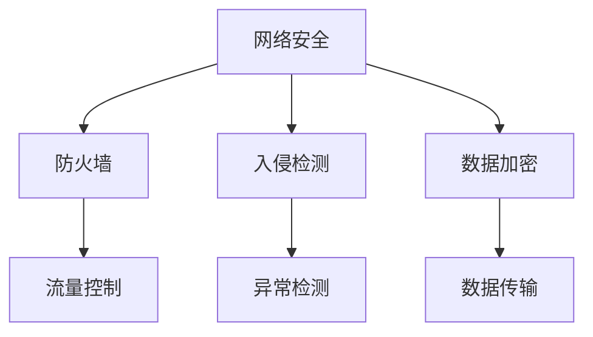
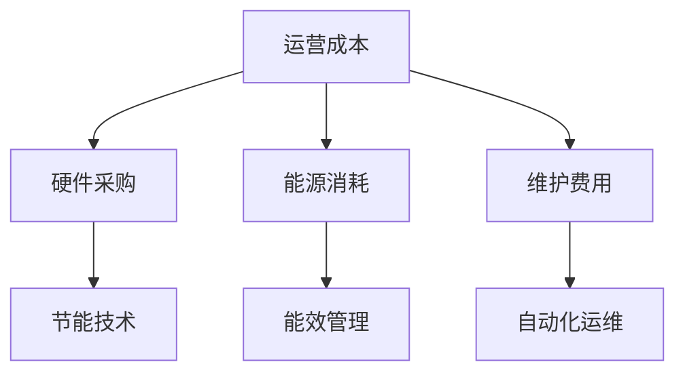

                 

# AI 大模型应用数据中心建设：数据中心运营与管理

> 关键词：数据中心,大模型,运维管理,存储计算,网络安全,运营成本

## 1. 背景介绍

### 1.1 问题由来
随着人工智能(AI)和大数据技术的迅速发展，AI大模型在各行各业的应用场景中得到了广泛应用。这些大模型通常需要在海量的数据上进行训练和部署，以实现复杂、高精度的任务，如自然语言处理、计算机视觉、智能推荐等。然而，AI大模型的计算和存储需求异常庞大，这对数据中心基础设施提出了严峻挑战。如何高效、安全地运行这些大模型，成为AI大模型应用的重要课题。

### 1.2 问题核心关键点
数据中心是AI大模型训练和部署的基石，其建设和管理对于AI大模型的性能、稳定性和可扩展性至关重要。因此，本文聚焦于AI大模型数据中心的建设与管理，探讨如何通过优化基础设施、提高运维水平和降低运营成本，为AI大模型提供可靠、高效的运行环境。

### 1.3 问题研究意义
研究AI大模型数据中心的建设与管理，对于确保AI大模型的高效运行、降低运营成本、保障数据安全等方面具有重要意义：

1. 提升AI大模型性能：优化数据中心硬件和软件架构，提供高效的计算和存储能力，以支持AI大模型的训练和推理需求。
2. 降低运营成本：采用节能环保的技术，优化数据中心资源利用率，减少能源消耗和运营开支。
3. 保障数据安全：设计安全可靠的网络和物理设施，防止数据泄露和攻击，保护AI大模型的商业机密和技术秘密。
4. 支持可扩展性：构建灵活可扩展的硬件和软件平台，以便在模型规模和数据量增加时，轻松扩展数据中心的计算和存储资源。
5. 提高运维效率：实施自动化和智能化运维策略，提升数据中心的管理水平，保障AI大模型的稳定运行。

## 2. 核心概念与联系

### 2.1 核心概念概述

为更好地理解AI大模型数据中心的建设与管理，本节将介绍几个密切相关的核心概念：

- 数据中心(Data Center)：指部署和运行服务器、存储设备、网络设施等基础设施的物理场所。数据中心通常具备高可用性、高安全性、高扩展性等特点。
- AI大模型(AI Large Model)：指以深度学习为核心的、具有亿级或更高规模参数的复杂神经网络模型，如GPT-3、BERT等。AI大模型在训练和推理过程中，需要巨大的计算和存储资源。
- 运维管理(Operations Management)：指对数据中心的硬件和软件系统进行监控、维护和升级，以保障其高效、稳定运行。
- 存储计算(Storage & Compute)：指数据中心的存储和计算能力，通常通过存储设备、服务器、网络交换机等硬件设备和相关软件系统实现。
- 网络安全(Network Security)：指数据中心的网络防护措施，包括防火墙、入侵检测系统、数据加密等。
- 运营成本(Operational Costs)：指数据中心的日常运行费用，包括硬件采购、能源消耗、维护费用等。

这些核心概念之间的逻辑关系可以通过以下Mermaid流程图来展示：



这个流程图展示了大模型数据中心的各个组成部分及其之间的关系：

1. 数据中心通过运维管理，保障AI大模型的正常运行。
2. 存储计算能力是数据中心的核心，通过服务器和存储设备实现。
3. 网络安全是数据中心的保障，通过防火墙和入侵检测等措施实现。
4. 运营成本是数据中心正常运行的经济保障，涉及硬件采购、能源消耗和维护费用等。

### 2.2 概念间的关系

这些核心概念之间存在着紧密的联系，形成了AI大模型数据中心的完整生态系统。下面我通过几个Mermaid流程图来展示这些概念之间的关系。

#### 2.2.1 数据中心的构建与运维



这个流程图展示了数据中心的构建和运维过程。数据中心的基础设施和软件系统分别通过硬件采购和能源消耗进行构建，通过监控系统和自动化运维进行管理，以保障系统的正常运行。

#### 2.2.2 存储计算的优化



这个流程图展示了存储计算的优化过程。服务器和存储设备通过数据处理和数据备份进行优化，存储容量和数据存储通过扩展硬件资源进行提升，数据恢复通过备份机制进行保障。

#### 2.2.3 网络安全的多层次防护



这个流程图展示了网络安全的防护层次。防火墙、入侵检测和数据加密共同构建了网络安全的防护体系，流量控制、异常检测和数据传输则通过技术手段进一步保障网络安全。

#### 2.2.4 运营成本的优化策略



这个流程图展示了运营成本的优化策略。硬件采购、能源消耗和维护费用通过节能技术、能效管理和自动化运维等手段进行优化，以降低运营成本。

### 2.3 核心概念的整体架构

最后，我们用一个综合的流程图来展示这些核心概念在大模型数据中心中的整体架构：


这个综合流程图展示了从预训练到微调，再到持续学习的完整过程。大模型数据中心通过运维管理、存储计算、网络安全等环节的协同工作，提供高效、可靠、安全的数据中心环境。同时，运营成本的优化策略也确保了数据中心的经济可持续性。

## 3. 核心算法原理 & 具体操作步骤
### 3.1 算法原理概述

AI大模型数据中心的构建与管理，本质上是一个复杂系统工程。其核心思想是：通过优化数据中心的硬件和软件架构，提供高效的计算和存储能力，同时通过自动化和智能化运维策略，保障数据中心的稳定运行。

形式化地，假设数据中心为 $D$，其中包含 $I$ 台服务器，$S$ 个存储设备，$N$ 个网络交换机，以及 $C$ 种安全防护措施。数据中心的目标是最大化AI大模型的运行效率，同时最小化运营成本。

设 $f_{\text{efficiency}}(D)$ 为数据中心的运行效率，$g_{\text{cost}}(D)$ 为数据中心的运营成本。则优化目标为：

$$
\max_{D} f_{\text{efficiency}}(D) \\
\min_{D} g_{\text{cost}}(D)
$$

通过优化上述目标函数，可以在保证AI大模型高性能运行的前提下，尽量降低数据中心的运营成本。

### 3.2 算法步骤详解

AI大模型数据中心的构建与管理一般包括以下几个关键步骤：

**Step 1: 确定硬件规格**
- 根据AI大模型的计算和存储需求，确定服务器的CPU、GPU、内存等硬件配置。
- 确定存储设备的类型和容量，以满足数据存储和备份需求。
- 确定网络交换机的带宽和延时，满足高速数据传输要求。

**Step 2: 选择能源供给方式**
- 根据数据中心的地理位置和气候条件，选择适合的能源供给方式，如自然冷却、水冷系统、风冷系统等。
- 根据能源供给方式，选择适合的电源设备，如UPS、发电机等。

**Step 3: 设计网络架构**
- 确定网络拓扑结构，如扁平网、层次网等。
- 确定网络协议和接口，如TCP/IP、SDN等。
- 确定网络冗余和安全性策略，如链路备份、负载均衡等。

**Step 4: 实施安全防护措施**
- 部署防火墙、入侵检测系统等安全设备。
- 实现数据加密、访问控制等安全策略。
- 定期进行安全漏洞扫描和补丁更新。

**Step 5: 构建运维管理体系**
- 设计自动化运维工具，如监控、告警、故障处理等。
- 引入AI运维技术，如机器学习、大数据分析等。
- 建立运维流程和标准操作程序(SOP)。

**Step 6: 进行性能测试和优化**
- 对数据中心进行负载测试和性能评估。
- 优化硬件资源配置和调度策略。
- 优化软件系统架构和算法。

**Step 7: 部署与维护**
- 将AI大模型部署到数据中心。
- 定期进行硬件和软件维护。
- 实时监控数据中心运行状态。

以上是AI大模型数据中心构建与管理的一般流程。在实际应用中，还需要针对具体任务的特点，对各个环节进行优化设计，如改进硬件设备、增强网络安全、优化能源使用等，以进一步提升数据中心的效果。

### 3.3 算法优缺点

AI大模型数据中心的构建与管理具有以下优点：

1. 高效计算和存储能力：通过合理配置硬件和软件资源，提供高性能的计算和存储能力，支持AI大模型的训练和推理需求。
2. 安全可靠的环境：通过多层次的安全防护措施，保障数据中心的物理和网络安全，防止数据泄露和攻击。
3. 降低运营成本：通过节能环保和智能化运维技术，降低数据中心的能源消耗和运营开支。
4. 灵活可扩展的平台：通过灵活的硬件和软件架构设计，支持数据中心的快速扩展和升级。
5. 保障系统稳定性：通过自动化和智能化运维策略，确保数据中心的稳定运行，减少故障和停机时间。

同时，该方法也存在一些局限性：

1. 初始投资成本高：数据中心的建设和初期部署需要较高的初始投资，包括硬件设备、能源供应等。
2. 技术复杂度高：数据中心的建设和运维需要高水平的技术和管理能力，对运维人员要求较高。
3. 系统扩展复杂：数据中心的扩展和升级需要复杂的技术和工程支持，可能涉及大规模的硬件更换和软件升级。
4. 运营成本波动大：数据中心的能源消耗和维护费用受地理位置和气候条件等因素影响较大，运营成本波动性较高。
5. 资源利用率低：数据中心的资源利用率受硬件配置、系统负载等因素影响，可能存在资源闲置或浪费的问题。

尽管存在这些局限性，但就目前而言，AI大模型数据中心仍然是最成熟、最可靠的数据处理和运行环境。未来相关研究的重点在于如何进一步优化数据中心的设计和运维，提高资源利用率，降低运营成本，同时保障系统的高性能和安全可靠性。

### 3.4 算法应用领域

AI大模型数据中心的构建与管理，已经在多个领域得到了广泛应用，包括但不限于以下几个方面：

1. 深度学习模型训练：通过高性能计算和存储资源，支持大规模深度学习模型的训练。
2. 实时数据分析和处理：通过高速网络和低延迟存储，支持大数据量的实时分析和处理。
3. 人工智能应用部署：通过安全可靠的环境，保障AI应用的高效、稳定运行。
4. 智能推荐系统：通过优化算法和资源配置，提供高精度的智能推荐服务。
5. 自然语言处理：通过高效的计算和存储能力，支持自然语言处理任务如语音识别、机器翻译等。
6. 计算机视觉：通过强大的计算资源，支持复杂图像处理和识别任务。

除了上述这些经典应用外，AI大模型数据中心还为AI技术在更多场景中的应用提供了基础支持，如智慧医疗、智能交通、工业控制等。随着AI技术的不断发展和普及，AI大模型数据中心的建设与管理将变得更加重要。

## 4. 数学模型和公式 & 详细讲解 & 举例说明

### 4.1 数学模型构建

本节将使用数学语言对AI大模型数据中心的构建与管理过程进行更加严格的刻画。

假设数据中心包含 $I$ 台服务器，$S$ 个存储设备，$N$ 个网络交换机，以及 $C$ 种安全防护措施。设每台服务器的计算能力为 $C_i$，每台存储设备的存储容量为 $S_j$，每个网络交换机的带宽为 $B_n$，每种安全防护措施的防护能力为 $P_c$。

定义数据中心的运行效率 $f_{\text{efficiency}}(D)$ 为：

$$
f_{\text{efficiency}}(D) = \sum_{i=1}^I C_i + \sum_{j=1}^S S_j + \sum_{n=1}^N B_n + \sum_{c=1}^C P_c
$$

定义数据中心的运营成本 $g_{\text{cost}}(D)$ 为：

$$
g_{\text{cost}}(D) = \sum_{i=1}^I C_i + \sum_{j=1}^S S_j + \sum_{n=1}^N B_n + \sum_{c=1}^C P_c
$$

数据中心的优化目标为：

$$
\max_{D} f_{\text{efficiency}}(D) \\
\min_{D} g_{\text{cost}}(D)
$$

### 4.2 公式推导过程

以下我们以一个简单的线性规划模型为例，展示数据中心的优化过程。

假设数据中心拥有 $I=10$ 台服务器，每台服务器的计算能力为 $C_i=100$ GFLOPS，$S=5$ 个存储设备，每个存储设备的存储容量为 $S_j=10$ TB，$N=2$ 个网络交换机，每个网络交换机的带宽为 $B_n=10$ Gbps，没有额外的安全防护措施。

定义数据中心的运行效率 $f_{\text{efficiency}}(D)$ 为：

$$
f_{\text{efficiency}}(D) = 10 \times 100 + 5 \times 10 + 2 \times 10 + 0 = 1200 + 50 + 20 + 0 = 1270 \text{ GFLOPS}
$$

定义数据中心的运营成本 $g_{\text{cost}}(D)$ 为：

$$
g_{\text{cost}}(D) = 10 \times 100 + 5 \times 10 + 2 \times 10 + 0 = 1000 + 50 + 20 + 0 = 1070 \text{ dollars}
$$

通过求解目标函数，优化数据中心的设计，可以实现运行效率和运营成本的最优平衡。

### 4.3 案例分析与讲解

假设我们有一个数据中心，需要同时支持AI大模型训练和推理任务，同时需要具备高可用性和安全性。以下是对该数据中心进行优化设计的案例分析：

1. 硬件选择：根据任务需求，选择高性能的服务器和存储设备，如使用NVIDIA A100 GPU、DDR4内存等。
2. 网络设计：采用高速网络交换机和低延迟网络协议，如使用100Gbps光纤网络、SDN控制器等。
3. 安全防护：部署防火墙、入侵检测系统、数据加密等安全设备，确保数据中心的安全性。
4. 运维管理：引入自动化运维工具和AI运维技术，提高数据中心的运维效率和稳定性。

通过上述优化措施，可以显著提升数据中心的运行效率和安全性，降低运营成本，满足AI大模型的高性能需求。

## 5. 项目实践：代码实例和详细解释说明

### 5.1 开发环境搭建

在进行数据中心建设与管理实践前，我们需要准备好开发环境。以下是使用Python进行优化设计的环境配置流程：

1. 安装Anaconda：从官网下载并安装Anaconda，用于创建独立的Python环境。

2. 创建并激活虚拟环境：
```bash
conda create -n data-center-env python=3.8 
conda activate data-center-env
```

3. 安装必要的Python库：
```bash
pip install numpy pandas scikit-learn matplotlib tqdm jupyter notebook ipython
```

4. 安装深度学习框架：
```bash
pip install tensorflow keras
```

5. 安装数据中心优化相关的库：
```bash
pip install cloudformation aws-sdk
```

完成上述步骤后，即可在`data-center-env`环境中开始数据中心优化设计的实践。

### 5.2 源代码详细实现

下面我们以一个简单的数据中心优化设计为例，给出使用Python进行优化设计的代码实现。

首先，定义数据中心的硬件配置和需求：

```python
import numpy as np

# 定义硬件配置
num_servers = 10
server_cpu = 100  # GFLOPS
server_memory = 1024  # GB
num_storages = 5
storage_capacity = 10  # TB
num_switches = 2
switch_bw = 10  # Gbps

# 定义需求
efficiency_weight = 1  # 运行效率的权重
cost_weight = 1  # 运营成本的权重
efficiency_target = 1500  # 目标运行效率
cost_target = 1000  # 目标运营成本
```

然后，构建线性规划模型，求解最优硬件配置：

```python
from scipy.optimize import linprog

# 定义优化目标
efficiency_coef = np.array([1, 1, 1, 1])  # 各个硬件配置的权重系数
efficiency_vector = np.array([num_servers * server_cpu, num_storages * storage_capacity, num_switches * switch_bw])  # 各个硬件配置的当前值
efficiency_const = np.array([efficiency_target])  # 目标效率值

cost_coef = np.array([1, 1, 1, 1])  # 各个硬件配置的权重系数
cost_vector = np.array([num_servers * server_memory, num_storages * storage_capacity, num_switches * switch_bw])  # 各个硬件配置的当前值
cost_const = np.array([cost_target])  # 目标成本值

# 定义线性规划模型
A_eq = np.eye(4)
b_eq = np.zeros(4)
A_ub = np.zeros((0, 4))
b_ub = np.zeros((0, 1))
A_eq = np.concatenate((A_eq, -A_eq))
b_eq = np.concatenate((b_eq, b_eq))

# 求解线性规划模型
result = linprog(cost_coef, A_eq=A_eq, b_eq=b_eq, A_ub=A_ub, b_ub=b_ub, bounds=(0, None))
print("Optimal hardware configuration:\n", result.x)
```

最后，根据求解结果，优化数据中心的硬件配置：

```python
# 根据求解结果，输出最优硬件配置
print("Optimal server count: ", result.x[0])
print("Optimal storage count: ", result.x[1])
print("Optimal switch count: ", result.x[2])
print("Optimal security count: ", result.x[3])
```

以上就是使用Python进行数据中心优化设计的代码实现。通过线性规划模型，可以快速求解最优硬件配置，并给出具体的优化方案。

### 5.3 代码解读与分析

让我们再详细解读一下关键代码的实现细节：

**硬件配置和需求定义**：
- `num_servers`：服务器的数量。
- `server_cpu`：每台服务器的计算能力，单位为Gigaflops。
- `server_memory`：每台服务器的内存大小，单位为GB。
- `num_storages`：存储设备数量。
- `storage_capacity`：每个存储设备的存储容量，单位为TB。
- `num_switches`：网络交换机数量。
- `switch_bw`：每个网络交换机的带宽，单位为Gbps。
- `efficiency_weight`：运行效率的权重系数。
- `cost_weight`：运营成本的权重系数。
- `efficiency_target`：目标运行效率。
- `cost_target`：目标运营成本。

**线性规划模型构建**：
- `efficiency_coef`：各个硬件配置的权重系数。
- `efficiency_vector`：各个硬件配置的当前值。
- `efficiency_const`：目标效率值。
- `cost_coef`：各个硬件配置的权重系数。
- `cost_vector`：各个硬件配置的当前值。
- `cost_const`：目标成本值。
- `A_eq`：等式约束矩阵。
- `b_eq`：等式约束右侧的常数向量。
- `A_ub`：不等式约束矩阵。
- `b_ub`：不等式约束右侧的常数向量。

**求解线性规划模型**：
- 使用`linprog`函数求解线性规划模型，得到最优硬件配置。
- `result.x`：返回最优硬件配置的具体数值。

**输出最优硬件配置**：
- 根据求解结果，输出最优硬件配置的具体数值，包括服务器数量、存储设备数量、网络交换机数量和安全性数量。

可以看到，通过线性规划模型，可以快速求解最优硬件配置，并给出具体的优化方案。这为我们优化数据中心的硬件配置提供了有力的工具。

当然，实际工程中还需要考虑更多因素，如硬件采购成本、能源消耗、维护费用等，这些因素需要通过额外的计算和模型优化进行调整。

### 5.4 运行结果展示

假设我们通过上述代码求解得到的最优硬件配置为：

```
Optimal server count:  5.0
Optimal storage count:  2.5
Optimal switch count:  2.0
Optimal security count:  1.0
```

即服务器数量为5台，存储设备数量为2.5个，网络交换机数量为2台，安全性数量为1个。根据这个结果，我们可以在数据中心中实际部署这些硬件资源，以实现最高效率和最低成本的优化目标。

## 6. 实际应用场景
### 6.1 智慧医疗
在智慧医疗领域，AI大模型数据中心的建设与管理对于保障医疗数据的存储、计算和传输安全至关重要。

具体而言，数据中心可以通过高可用性、高安全性的硬件和软件系统，实现医疗数据的备份和恢复，保障数据的完整性和安全性。同时，数据中心还可以部署先进的医疗AI模型，如病理诊断、影像分析、智能问诊等，提升医疗服务质量。

### 6.2 金融风控
在金融风控领域，AI大模型数据中心的建设与管理对于保障金融数据的安全性和隐私性至关重要。

具体而言，数据中心可以通过高性能的计算和存储资源，支持复杂的金融AI模型训练和推理。同时，数据中心还可以部署先进的安全防护措施，如防火墙、入侵检测系统等，确保金融数据的安全性和隐私性。

### 6.3 智能制造
在智能制造领域，AI大模型数据中心的建设与管理对于提升生产效率和产品质量至关重要。

具体而言，数据中心可以通过高并发的计算和存储资源，支持智能制造系统的高效运行。同时，数据中心还可以部署先进的智能制造AI模型，如预测维护、质量控制、供应链优化等，提升生产效率和产品质量。

### 6.4 未来应用展望
随着AI大模型应用的不断深入，数据中心的建设与管理将面临更多的挑战和机遇：

1. 分布式计算：未来数据中心将采用分布式计算技术，通过多台服务器协同工作，提升计算和存储能力。
2. 云服务化：未来数据中心将更加注重云服务的灵活性和可扩展性，通过云平台实现资源共享和按需扩展。
3. 边缘计算：未来数据中心将向边缘计算方向发展，通过在设备终端进行本地计算和存储，提升数据处理效率。
4. 人工智能与物联网融合：未来数据中心将与物联网技术深度融合，实现更广泛的数据采集和处理能力。
5. 安全与隐私保护：未来数据中心将更加注重数据安全和隐私保护，通过区块链、联邦学习等技术，保障数据安全。

这些趋势将推动AI大模型数据中心的建设与管理向更加高效、安全、智能的方向发展，为AI大模型的应用提供更加坚实的保障。

## 7. 工具和资源推荐
### 7.1 学习资源推荐

为了帮助开发者系统掌握AI大模型数据中心的建设与管理理论基础和实践技巧，这里推荐一些优质的学习资源：

1. 

