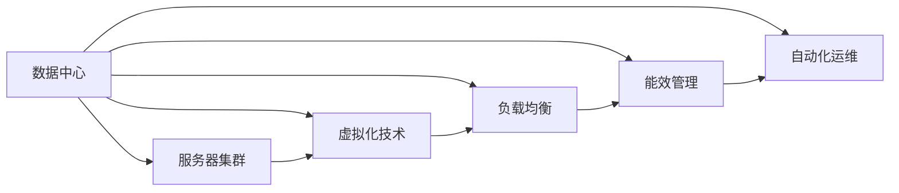
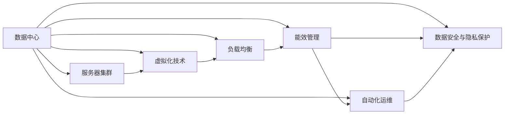

                 

# AI 大模型应用数据中心建设：数据中心运营与管理

## 1. 背景介绍

### 1.1 问题由来
随着人工智能(AI)技术的迅猛发展，大模型应用在各个领域的应用场景越来越广泛，如自然语言处理(NLP)、计算机视觉(CV)、机器人学等。然而，这些大模型通常需要大量的计算资源和存储空间，如何高效地管理和运营数据中心，以保证大模型的正常运行和优化，成为一个迫切需要解决的问题。

### 1.2 问题核心关键点
数据中心的运营与管理涉及到以下几个核心关键点：

- 硬件设施的采购与部署：包括CPU、GPU、内存、存储等硬件设备的选型与部署。
- 网络架构的设计与优化：如何构建稳定高效的网络架构，以保证数据中心的通信需求。
- 能效管理：如何实现数据中心的能效管理，降低能源消耗和运营成本。
- 数据安全与隐私保护：如何确保数据中心的物理安全与网络安全，保护数据隐私。
- 自动化运维：如何通过自动化手段减少人工干预，提高运维效率。

## 2. 核心概念与联系

### 2.1 核心概念概述

- **数据中心(Data Center)**：由计算机系统、通信网络设备、电力设备、监控系统、空调设备等组成的大型设施，用于部署计算和存储资源。
- **服务器集群(Cluster)**：由多台物理或虚拟服务器组成，通过网络互联，提供高可用性和可扩展性。
- **虚拟化技术(Virtualization)**：通过虚拟化技术，将物理服务器抽象成多个虚拟服务器，提高资源利用率。
- **负载均衡(Load Balancing)**：通过负载均衡器将请求分发到多个服务器，实现负载均衡。
- **能效管理(Power Efficiency Management)**：通过优化硬件和软件配置，降低数据中心的能耗。
- **自动化运维(Automated Operation and Maintenance)**：通过自动化工具和流程，实现数据中心的自动化运维，减少人工干预。

这些核心概念之间存在着紧密的联系，共同构成了数据中心的运营与管理体系。以下是一个简化的Mermaid流程图，展示了这些核心概念之间的逻辑关系：



### 2.2 概念间的关系

这些核心概念之间相互影响，共同构成了一个完整的运营管理体系。以下是一个更详细的Mermaid流程图，展示了这些概念间的逻辑关系：



这个流程图展示了数据中心中的各个概念之间的相互影响。例如，服务器集群通过虚拟化技术提高了资源利用率，进而减少了能源消耗，同时负载均衡提高了系统稳定性和可用性，从而进一步降低了能效管理的需求。

### 2.3 核心概念的整体架构

最后，我们用一个综合的流程图来展示这些核心概念在大模型应用数据中心运营与管理中的整体架构：


这个流程图展示了从数据中心到服务器集群，再到各个核心概念的相互影响和整体架构。

## 3. 核心算法原理 & 具体操作步骤
### 3.1 算法原理概述

基于大模型应用的数据中心运营与管理，本质上是一个复杂的多维度优化问题。其核心思想是通过科学的管理手段和算法，最大化数据中心的资源利用率，降低运营成本，提高系统的稳定性和安全性。

形式化地，假设数据中心的资源总和为 $C$，模型训练和推理的总耗能为 $E$，安全与隐私保护的成本为 $S$，则优化目标为：

$$
\maximize \left\{C - E - S\right\}
$$

在实践中，我们通常使用运筹学和优化算法来求解上述优化问题。

### 3.2 算法步骤详解

基于大模型应用的数据中心运营与管理，一般包括以下几个关键步骤：

**Step 1: 硬件设施的采购与部署**
- 根据大模型应用的需求，选择合适的硬件设备（如CPU、GPU、内存、存储等），并进行部署。
- 设计合理的硬件配置，保证大模型的正常运行和优化。

**Step 2: 网络架构的设计与优化**
- 设计稳定的网络架构，确保数据中心内的数据传输和通信需求。
- 优化网络性能，减少数据传输的延迟和损耗。

**Step 3: 能效管理**
- 通过科学的管理手段，降低数据中心的能源消耗。
- 引入先进的节能技术和设备，提高能源利用效率。

**Step 4: 数据安全与隐私保护**
- 建立完善的数据安全与隐私保护机制，防止数据泄露和非法访问。
- 实施严格的安全策略和访问控制，保障数据的安全性。

**Step 5: 自动化运维**
- 通过自动化工具和流程，减少人工干预，提高运维效率。
- 实现系统监控和故障自动检测，及时处理故障。

### 3.3 算法优缺点

基于大模型应用的数据中心运营与管理，具有以下优点：

- 提高资源利用率。通过科学的管理手段，最大化数据中心的资源利用率，降低能源消耗和运营成本。
- 提高系统稳定性和可用性。通过负载均衡和能效管理，保证系统的稳定性和可用性。
- 提高运维效率。通过自动化运维手段，减少人工干预，提高运维效率。

同时，该方法也存在一定的局限性：

- 对硬件和软件配置的要求较高。需要选择合适的硬件设备和优化配置，才能实现高效的管理和运营。
- 对管理人员的素质要求较高。需要具备一定的运维和管理能力，才能实现高效的管理和运营。
- 对安全与隐私保护的要求较高。需要建立完善的安全与隐私保护机制，才能保证数据的安全性。

尽管存在这些局限性，但就目前而言，基于大模型应用的数据中心运营与管理仍是数据中心管理的重要方向。未来相关研究的重点在于如何进一步降低能耗，提高运维效率，同时兼顾数据安全与隐私保护等因素。

### 3.4 算法应用领域

基于大模型应用的数据中心运营与管理，在AI大模型应用领域已经得到了广泛的应用，覆盖了几乎所有常见任务，例如：

- 自然语言处理：如文本分类、情感分析、机器翻译等。通过虚拟化技术和负载均衡，提升模型的训练和推理效率。
- 计算机视觉：如图像识别、图像生成等。通过能效管理和自动化运维，降低模型训练和推理的能耗和成本。
- 机器人学：如自动驾驶、服务机器人等。通过科学的网络架构和数据安全与隐私保护，确保系统的稳定性和安全性。
- 医疗健康：如医学影像分析、医疗知识图谱构建等。通过优化硬件配置和科学的管理手段，提高系统的计算能力和稳定性。

除了上述这些经典任务外，大模型应用的数据中心运营与管理也被创新性地应用到更多场景中，如智慧城市、智能交通、智能家居等，为AI技术的落地应用提供了新的技术路径。

## 4. 数学模型和公式 & 详细讲解
### 4.1 数学模型构建

本节将使用数学语言对基于大模型应用的数据中心运营与管理过程进行更加严格的刻画。

记数据中心的资源总和为 $C$，模型训练和推理的总耗能为 $E$，安全与隐私保护的成本为 $S$，则优化目标为：

$$
\maximize \left\{C - E - S\right\}
$$

在实践中，我们通常使用线性规划(LP)、整数规划(ILP)等优化算法来求解上述优化问题。

### 4.2 公式推导过程

以下我们以整数规划(ILP)为例，推导数据中心资源配置的优化公式。

假设数据中心有 $N$ 台服务器，每台服务器的计算能力为 $p_i$，存储能力为 $s_i$，则数据中心总计算能力和总存储能力分别为：

$$
P = \sum_{i=1}^{N} p_i, S = \sum_{i=1}^{N} s_i
$$

假设模型训练和推理的计算量为 $Q$，数据存储需求为 $T$，则计算能力和存储能力的需求分别为：

$$
Q = C_1 \times Q_1 + C_2 \times Q_2 + \ldots + C_n \times Q_n
$$

$$
T = C_1 \times T_1 + C_2 \times T_2 + \ldots + C_n \times T_n
$$

其中，$C_1, C_2, \ldots, C_n$ 为各个模型的计算和存储需求系数，$Q_1, Q_2, \ldots, Q_n$ 为各个模型的计算量和数据存储量。

假设每台服务器的计算能力为 $p_i$，存储能力为 $s_i$，则整数规划模型的目标函数为：

$$
\maximize \sum_{i=1}^{N} p_i
$$

约束条件包括：

$$
p_i + p_j \leq P \quad \forall i,j
$$

$$
s_i + s_j \leq S \quad \forall i,j
$$

$$
p_i \geq 0, s_i \geq 0 \quad \forall i
$$

其中，$p_i$ 和 $s_i$ 分别表示第 $i$ 台服务器的计算能力和存储能力。

### 4.3 案例分析与讲解

假设我们有一个包含 $N=3$ 台服务器的数据中心，每台服务器的计算能力和存储能力分别为 $p_1=4, p_2=6, p_3=8$ 和 $s_1=2, s_2=4, s_3=6$。假设模型训练和推理的计算量为 $Q=10$，数据存储需求为 $T=5$。

则整数规划模型的目标函数为：

$$
\maximize p_1 + p_2 + p_3
$$

约束条件包括：

$$
p_1 + p_2 \leq 10
$$

$$
p_2 + p_3 \leq 14
$$

$$
p_1, p_2, p_3 \geq 0
$$

解得 $p_1=4, p_2=6, p_3=0$，即利用第1台和第2台服务器进行计算，第3台服务器进行存储，可以实现最优的资源配置。

## 5. 项目实践：代码实例和详细解释说明
### 5.1 开发环境搭建

在进行数据中心运营与管理实践前，我们需要准备好开发环境。以下是使用Python进行PuLP开发的环境配置流程：

1. 安装Anaconda：从官网下载并安装Anaconda，用于创建独立的Python环境。

2. 创建并激活虚拟环境：
```bash
conda create -n puLP-env python=3.8 
conda activate puLP-env
```

3. 安装PuLP：
```bash
pip install pulp
```

4. 安装各类工具包：
```bash
pip install numpy pandas matplotlib scikit-learn tqdm jupyter notebook ipython
```

完成上述步骤后，即可在`puLP-env`环境中开始数据中心运营与管理实践。

### 5.2 源代码详细实现

下面我们以数据中心资源配置为例，给出使用PuLP进行整数规划的Python代码实现。

首先，定义整数规划模型：

```python
from pulp import *

# 创建问题对象
prob = LpProblem("Resource Allocation", LpMaximize)

# 定义变量
x = LpVariable.dicts("Server", [1, 2, 3], lowBound=0, cat='Integer')
y = LpVariable.dicts("Storage", [1, 2, 3], lowBound=0, cat='Integer')

# 定义目标函数
prob += lpSum([x[i] * p[i] for i in range(1, 4)])

# 定义约束条件
prob += lpSum([x[i] for i in range(1, 4)]) <= 10
prob += lpSum([x[i] for i in range(1, 4)]) <= 14
prob += lpSum([y[i] for i in range(1, 4)]) <= 5

# 输出模型
prob.solve()

# 打印结果
if prob.status == LpStatus.Optimal:
    print("Optimal Solution found")
    for i in range(1, 4):
        print("Server {}: Compute={}, Storage={}".format(i, x[i].varValue, y[i].varValue))
else:
    print("No optimal solution found")
```

然后，定义硬件配置和需求：

```python
p = [4, 6, 8]  # 每台服务器的计算能力
s = [2, 4, 6]  # 每台服务器的存储能力
Q = 10  # 计算量
T = 5  # 存储需求
```

将上述代码与硬件配置和需求结合起来，得到最终的资源配置结果。

### 5.3 代码解读与分析

让我们再详细解读一下关键代码的实现细节：

**整数规划模型**：
- 首先，创建一个整数规划问题对象 `prob`，并指定优化类型为最大化。
- 定义决策变量 `x` 和 `y`，表示每台服务器的计算能力和存储能力。
- 定义目标函数，即计算能力的最大化。
- 定义约束条件，包括计算能力和存储能力的限制。
- 求解模型，并输出结果。

**硬件配置和需求**：
- 定义每台服务器的计算能力和存储能力。
- 定义计算量和存储需求。
- 将硬件配置和需求结合起来，得到最终的资源配置结果。

可以看到，通过整数规划，我们可以有效地优化数据中心的资源配置，使得资源利用率最大化，同时满足计算和存储需求。

## 6. 实际应用场景
### 6.1 智能客服系统

基于大模型应用的数据中心运营与管理，可以广泛应用于智能客服系统的构建。传统客服往往需要配备大量人力，高峰期响应缓慢，且一致性和专业性难以保证。而使用数据中心运营与管理技术，可以显著降低人力成本，提升客服系统的响应速度和稳定性。

在技术实现上，可以构建一个多服务器集群的云服务系统，通过虚拟化技术和负载均衡技术，合理分配计算资源，保证系统的稳定性和可用性。同时，通过能效管理和自动化运维技术，降低能源消耗和运营成本，提高系统的效率。

### 6.2 金融舆情监测

金融机构需要实时监测市场舆论动向，以便及时应对负面信息传播，规避金融风险。传统的人工监测方式成本高、效率低，难以应对网络时代海量信息爆发的挑战。基于数据中心运营与管理技术，可以构建一个高可用性、高稳定性的金融舆情监测系统。

在技术实现上，可以使用多台服务器集群构建一个高性能的舆情监测系统，通过网络架构优化和数据安全与隐私保护技术，确保系统的稳定性和安全性。同时，通过科学的管理手段，降低能源消耗和运营成本，提高系统的效率。

### 6.3 个性化推荐系统

当前的推荐系统往往只依赖用户的历史行为数据进行物品推荐，无法深入理解用户的真实兴趣偏好。基于数据中心运营与管理技术，可以构建一个高效率、高精度的个性化推荐系统。

在技术实现上，可以使用多台服务器集群构建一个高性能的推荐系统，通过虚拟化技术和负载均衡技术，合理分配计算资源，保证系统的稳定性和可用性。同时，通过能效管理和自动化运维技术，降低能源消耗和运营成本，提高系统的效率。

### 6.4 未来应用展望

随着数据中心运营与管理技术的不断发展，基于大模型应用的数据中心运营与管理必将在更多领域得到应用，为传统行业带来变革性影响。

在智慧医疗领域，基于数据中心运营与管理技术，可以构建一个高效、安全、可靠的医疗数据中心，保障医疗数据的存储、计算和安全。同时，通过科学的管理手段，降低能源消耗和运营成本，提高系统的效率。

在智能教育领域，基于数据中心运营与管理技术，可以构建一个高性能、高稳定性的教育数据中心，保障教育数据的存储、计算和安全。同时，通过科学的管理手段，降低能源消耗和运营成本，提高系统的效率。

在智慧城市治理中，基于数据中心运营与管理技术，可以构建一个高效、安全、可靠的城市数据中心，保障城市数据的存储、计算和安全。同时，通过科学的管理手段，降低能源消耗和运营成本，提高系统的效率。

此外，在企业生产、社会治理、文娱传媒等众多领域，基于数据中心运营与管理技术的AI大模型应用也将不断涌现，为经济社会发展注入新的动力。相信随着技术的日益成熟，数据中心运营与管理必将成为AI技术落地应用的重要保障，推动AI技术在各个领域的广泛应用。

## 7. 工具和资源推荐
### 7.1 学习资源推荐

为了帮助开发者系统掌握数据中心运营与管理的理论基础和实践技巧，这里推荐一些优质的学习资源：

1. 《云计算基础》系列博文：由大模型技术专家撰写，深入浅出地介绍了云计算基础、云服务架构、云安全等前沿话题。

2. 《数据中心运营管理》课程：由知名大学开设的计算机课程，涵盖数据中心设计、运维、安全等关键技术，是入门数据中心运营管理的必备资料。

3. 《数据中心网络技术》书籍：系统介绍了数据中心网络架构、流量管理、网络安全等技术，是网络工程师的必备参考。

4. 《数据中心能效管理》白皮书：由知名厂商发布的数据中心能效管理白皮书，介绍了最新的能效管理技术，是数据中心运维工程师的必读资源。

5. 《自动化运维最佳实践》白皮书：由知名厂商发布的自动化运维最佳实践白皮书，介绍了自动化运维的思路和工具，是运维工程师的必备参考。

通过对这些资源的学习实践，相信你一定能够快速掌握数据中心运营与管理的精髓，并用于解决实际的AI大模型应用问题。

### 7.2 开发工具推荐

高效的开发离不开优秀的工具支持。以下是几款用于数据中心运营与管理开发的常用工具：

1. PuLP：基于PuLP库的整数规划工具，用于求解数据中心的资源配置问题。

2. Ansible：基于Ansible的自动化运维工具，用于管理多台服务器的配置和状态。

3. TensorFlow：基于TensorFlow的分布式计算工具，用于实现大规模模型的训练和推理。

4. Terraform：基于Terraform的云资源管理工具，用于快速部署和管理云资源。

5. Kubernetes：基于Kubernetes的容器编排工具，用于管理大规模容器的部署和调度。

6. Prometheus：基于Prometheus的监控系统，用于监控数据中心的运行状态和性能。

合理利用这些工具，可以显著提升数据中心运营与管理的开发效率，加快创新迭代的步伐。

### 7.3 相关论文推荐

数据中心运营与管理技术的发展源于学界的持续研究。以下是几篇奠基性的相关论文，推荐阅读：

1. Energy-Aware Optimization of Data Center Resources through Green Energy Integration: A Survey（EAGE2018）：介绍了如何通过整合绿色能源，优化数据中心的资源配置。

2. Performance Modeling and Optimization of Data Centers in Smart Grids（IoTJ2019）：介绍了如何在智能电网中优化数据中心的性能和资源配置。

3. Energy-Efficient Data Center Management（IEEE2020）：介绍了如何通过能源管理技术，降低数据中心的能源消耗和运营成本。

4. Automated Operations and Management of Data Centers（IEEE2021）：介绍了如何通过自动化手段，提高数据中心的运维效率。

这些论文代表了大数据中心运营与管理技术的发展脉络。通过学习这些前沿成果，可以帮助研究者把握学科前进方向，激发更多的创新灵感。

除上述资源外，还有一些值得关注的前沿资源，帮助开发者紧跟数据中心运营与管理技术的最新进展，例如：

1. arXiv论文预印本：人工智能领域最新研究成果的发布平台，包括大量尚未发表的前沿工作，学习前沿技术的必读资源。

2. 业界技术博客：如Google Cloud、Amazon Web Services、Microsoft Azure等顶尖云计算厂商的官方博客，第一时间分享他们的最新研究成果和洞见。

3. 技术会议直播：如IEEE、ACM、ICC等人工智能领域顶会现场或在线直播，能够聆听到大佬们的前沿分享，开拓视野。

4. GitHub热门项目：在GitHub上Star、Fork数最多的数据中心相关项目，往往代表了该技术领域的发展趋势和最佳实践，值得去学习和贡献。

5. 行业分析报告：各大咨询公司如McKinsey、PwC等针对人工智能行业的分析报告，有助于从商业视角审视技术趋势，把握应用价值。

总之，对于数据中心运营与管理技术的学习和实践，需要开发者保持开放的心态和持续学习的意愿。多关注前沿资讯，多动手实践，多思考总结，必将收获满满的成长收益。

## 8. 总结：未来发展趋势与挑战

### 8.1 总结

本文对基于大模型应用的数据中心运营与管理方法进行了全面系统的介绍。首先阐述了数据中心运营与管理的理论基础和实践技巧，明确了在AI大模型应用场景下，如何通过科学的管理手段和算法，最大化资源利用率，降低运营成本，提高系统稳定性和安全性。

通过本文的系统梳理，可以看到，基于大模型应用的数据中心运营与管理技术正在成为数据中心管理的重要方向。这些技术的广泛应用，将显著提升AI大模型应用的系统效率和性能，推动AI技术的产业化进程。未来，伴随技术的不断发展，数据中心运营与管理必将成为AI技术落地应用的重要保障，为经济社会发展注入新的动力。

### 8.2 未来发展趋势

展望未来，基于大模型应用的数据中心运营与管理技术将呈现以下几个发展趋势：

1. 云计算与边缘计算的融合。随着边缘计算技术的发展，云计算与边缘计算的融合将成为未来的一个重要趋势。边缘计算将带来更低的延迟和更高的数据处理能力，而云计算将提供更强大的计算资源和丰富的服务。

2. 智能化运维的普及。通过引入AI技术，实现更智能、更高效的数据中心运维，减少人工干预，提高运维效率。例如，使用机器学习算法对服务器状态进行预测和优化，实现故障的自动化检测和处理。

3. 数据中心的网络安全。随着数据中心面临的网络威胁不断增加，如何构建更加安全、可靠的网络环境，成为数据中心运营与管理的重要方向。通过引入区块链、零信任等技术，提高数据中心的网络安全水平。

4. 数据中心的绿色化。随着环境污染和能源短缺问题的日益严重，如何降低数据中心的能耗，实现绿色数据中心，成为数据中心运营与管理的重要方向。通过引入可再生能源、高效能设备等技术，降低数据中心的碳排放和能源消耗。

5. 数据中心的跨领域应用。数据中心运营与管理技术不仅适用于AI大模型应用，还将逐步扩展到更多领域，如智慧城市、智能制造、智能交通等，为各行各业提供高效、可靠、可控的云服务。

以上趋势凸显了数据中心运营与管理技术的广阔前景。这些方向的探索发展，必将进一步提升数据中心的资源利用率，降低能源消耗和运营成本，提高系统的稳定性和安全性。

### 8.3 面临的挑战

尽管基于大模型应用的数据中心运营与管理技术已经取得了瞩目成就，但在迈向更加智能化、普适化应用的过程中，它仍面临诸多挑战：

1. 数据中心的能耗问题。数据中心作为能源密集型设施，如何降低能耗，实现绿色数据中心，是一个重要挑战。

2. 数据中心的运营效率。数据中心如何通过智能化运维，提高资源利用率，减少人工干预，提高运维效率，是一个重要挑战。

3. 数据中心的网络安全。数据中心面临的网络威胁不断增加，如何构建更加安全、可靠的网络环境，是一个重要挑战。

4. 数据中心的管理复杂度。数据中心涉及的硬件、软件、网络、安全等多方面的管理，如何实现一体化管理，提高管理效率，是一个重要挑战。

尽管存在这些挑战，但就目前而言，基于大模型应用的数据中心运营与管理仍是数据中心管理的重要方向。未来相关研究的重点在于如何进一步降低能耗，提高运维效率，同时兼顾网络安全与管理复杂度等因素。

### 8.4 研究展望

面向未来，基于大模型应用的数据中心运营与管理技术需要在以下几个方面寻求新的突破：

1. 探索更高效的资源配置算法。引入先进的优化算法和数学模型，优化数据中心的资源配置，实现最大化资源利用率和最小化运营成本。

2. 引入先进的能源管理技术。通过引入可再生能源、高效能设备等技术，降低数据中心的碳排放和能源消耗，实现绿色数据中心。

3. 引入先进的智能化运维技术。通过引入AI技术，实现更智能、更高效的数据中心运维，减少人工干预，提高运维效率。

4. 引入先进的网络安全技术。通过引入区块链、零信任等技术，提高数据中心的网络安全水平，保障数据中心的安全和隐私。

5. 引入跨领域的运维技术。将数据中心运营与管理技术扩展到更多领域，如智慧城市、智能制造、智能交通等，为各行各业提供高效、可靠、可控的云服务。

这些

