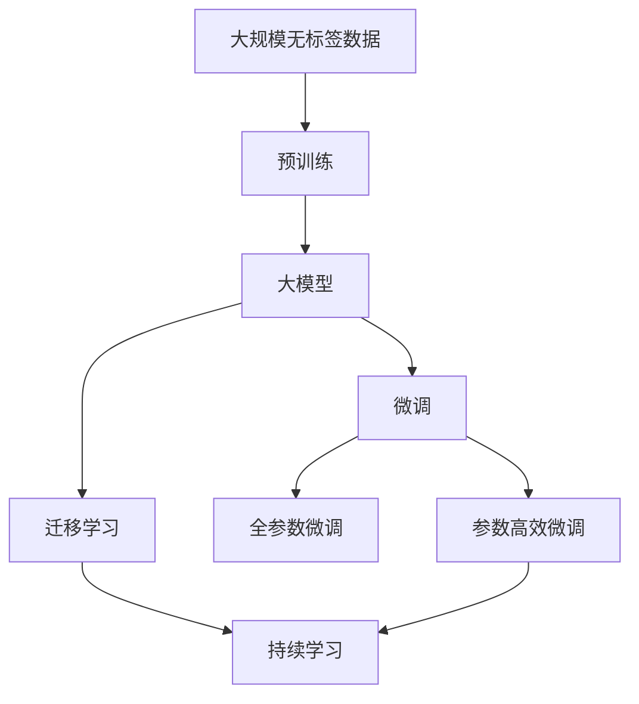

                 

# AI 大模型应用最佳实践

## 1. 背景介绍

在人工智能(AI)领域，大模型(大模型)正迅速崛起为重要的研究工具。它们以规模大、参数多、能力强的特点，不断刷新着各项任务上的性能上限，推动着AI技术从学术界向产业界的大规模落地应用。然而，大模型的规模和复杂性，也给模型部署和应用带来了诸多挑战。本文将从实际应用的角度出发，深入探讨AI大模型的最佳实践，以期为AI开发者和研究人员提供有价值的指导。

## 2. 核心概念与联系

### 2.1 核心概念概述

- **大模型**：指具有大规模参数和复杂结构的深度神经网络模型，包括自回归模型（如GPT系列）、自编码模型（如BERT）等。
- **预训练**：指在大规模无标签数据上进行训练，以自监督方式学习通用语言表示，提升模型的泛化能力。
- **微调**：指在大规模预训练的基础上，对模型进行小规模有标签数据训练，以适应特定任务。
- **迁移学习**：指在大规模预训练后，将模型在多个任务上进行微调，提升模型的跨任务适应能力。
- **持续学习**：指模型能够在持续学习新任务的同时，保留和利用旧知识，适应数据分布的变化。

### 2.2 核心概念原理和架构的 Mermaid 流程图



这个流程图展示了从预训练到微调和持续学习的完整过程。预训练是大模型的基础，微调和迁移学习使模型适应特定任务，持续学习则保持模型的时效性和跨领域适应能力。

### 2.3 核心概念之间的联系

大模型、预训练、微调、迁移学习和持续学习之间存在着密切的联系：

- **大模型与预训练**：大模型通过在大规模无标签数据上进行预训练，学习到通用的语言表示，成为后续微调的基础。
- **微调与迁移学习**：微调通过在小规模有标签数据上进行训练，将预训练的知识应用于特定任务，而迁移学习则在大规模预训练后，通过多个任务的微调，提升模型的跨任务适应能力。
- **持续学习**：在持续学习机制下，大模型能够在不断学习新任务的同时，保持旧知识的有效利用，适应数据分布的变化。

这些概念共同构成了一个完整的大模型应用框架，帮助开发者和研究者系统地理解和利用大模型的潜力。

## 3. 核心算法原理 & 具体操作步骤

### 3.1 算法原理概述

AI大模型的应用，核心在于预训练和微调的协同工作。预训练使得模型学习了通用的语言表示，而微调则根据特定任务的需求，对模型进行调整，使其能够准确预测目标输出。其基本原理如下：

1. **预训练**：使用大规模无标签数据，自监督学习任务（如掩码语言模型），学习到通用的语言表示。
2. **微调**：在特定任务上，使用小规模有标签数据，对预训练模型进行有监督学习，调整其参数，使其适应该任务。

### 3.2 算法步骤详解

大模型应用的最佳实践可以分为以下几个关键步骤：

**Step 1: 数据准备**

- **预训练数据**：选择大规模无标签文本数据进行预训练，如维基百科、新闻、文章等。
- **微调数据**：选择与特定任务相关的有标签数据，如问题-答案对、新闻分类、对话等。

**Step 2: 模型选择**

- **预训练模型**：选择适合预训练任务的模型，如BERT、GPT-2、T5等。
- **微调模型**：在预训练模型的基础上，设计并训练微调模型，使其能够适应特定任务。

**Step 3: 微调过程**

- **模型初始化**：将预训练模型的参数作为微调模型的初始化参数。
- **损失函数**：根据特定任务设计损失函数，如交叉熵、均方误差等。
- **优化器**：选择合适的优化器（如AdamW、SGD），并设定学习率。
- **迭代训练**：在微调数据上进行迭代训练，更新模型参数，最小化损失函数。
- **验证和调整**：在验证集上评估模型性能，根据性能指标调整学习率、迭代次数等参数。

**Step 4: 模型评估和部署**

- **模型评估**：在测试集上评估微调后模型的性能，对比预训练模型的性能提升。
- **模型部署**：将微调模型部署到实际应用中，如网站、移动应用、客服系统等。

### 3.3 算法优缺点

**优点**：
- **效率高**：预训练模型能够快速适应特定任务，显著缩短模型开发时间。
- **泛化能力强**：通过微调和迁移学习，模型能够适应各种不同任务，提升泛化能力。
- **参数高效**：通过参数高效微调（如Adapter、LoRA等），在固定大部分预训练参数的情况下，仍能取得较好的效果。

**缺点**：
- **依赖标注数据**：微调模型需要大量的标注数据，获取标注数据的成本较高。
- **过拟合风险**：在标注数据不足的情况下，模型容易过拟合。
- **模型复杂度**：大模型参数多，资源消耗大，推理速度慢。

### 3.4 算法应用领域

AI大模型的应用领域非常广泛，包括但不限于以下几个方面：

- **自然语言处理**：文本分类、命名实体识别、情感分析、机器翻译、对话系统等。
- **计算机视觉**：图像分类、物体检测、图像生成等。
- **语音处理**：语音识别、语音生成、情感识别等。
- **医疗健康**：医学影像分析、疾病诊断、健康管理等。
- **金融科技**：信用评分、风险评估、市场分析等。
- **推荐系统**：商品推荐、内容推荐、用户画像等。

## 4. 数学模型和公式 & 详细讲解 & 举例说明

### 4.1 数学模型构建

假设预训练模型为 $M_{\theta}$，其输入为 $x$，输出为 $y$。定义损失函数为 $\ell(M_{\theta}(x), y)$，则微调的目标是最小化损失函数：

$$
\theta^* = \mathop{\arg\min}_{\theta} \mathcal{L}(M_{\theta}, D)
$$

其中 $D$ 为微调数据集，$\mathcal{L}$ 为损失函数，$y$ 为模型输出，$x$ 为输入。

### 4.2 公式推导过程

以文本分类任务为例，假设模型的输出为 $y \in \{0,1\}$，真实标签为 $y_{real} \in \{0,1\}$。则交叉熵损失函数为：

$$
\ell(M_{\theta}(x), y_{real}) = -y_{real} \log M_{\theta}(x) - (1-y_{real}) \log (1-M_{\theta}(x))
$$

在微调过程中，模型的参数更新公式为：

$$
\theta \leftarrow \theta - \eta \nabla_{\theta} \mathcal{L}(\theta, D)
$$

其中 $\eta$ 为学习率，$\nabla_{\theta} \mathcal{L}(\theta, D)$ 为损失函数对模型参数 $\theta$ 的梯度。

### 4.3 案例分析与讲解

以情感分析任务为例，假设预训练模型为BERT，输入为句子 $x$，输出为情感标签 $y \in \{\text{positive}, \text{negative}\}$。则损失函数为：

$$
\ell(M_{\theta}(x), y_{real}) = -y_{real} \log M_{\theta}(x) - (1-y_{real}) \log (1-M_{\theta}(x))
$$

在微调过程中，模型的参数更新公式为：

$$
\theta \leftarrow \theta - \eta \nabla_{\theta} \mathcal{L}(\theta, D)
$$

其中 $D$ 为情感分析数据集，$\mathcal{L}$ 为交叉熵损失函数。

## 5. 项目实践：代码实例和详细解释说明

### 5.1 开发环境搭建

在进行AI大模型应用开发前，需要搭建好开发环境。以下是使用PyTorch进行代码开发的环境配置流程：

1. 安装Anaconda：从官网下载并安装Anaconda，用于创建独立的Python环境。
2. 创建并激活虚拟环境：
```bash
conda create -n pytorch-env python=3.8 
conda activate pytorch-env
```

3. 安装PyTorch：根据CUDA版本，从官网获取对应的安装命令。例如：
```bash
conda install pytorch torchvision torchaudio cudatoolkit=11.1 -c pytorch -c conda-forge
```

4. 安装Transformers库：
```bash
pip install transformers
```

5. 安装各类工具包：
```bash
pip install numpy pandas scikit-learn matplotlib tqdm jupyter notebook ipython
```

完成上述步骤后，即可在`pytorch-env`环境中开始应用开发。

### 5.2 源代码详细实现

以下是使用PyTorch对BERT进行情感分析任务微调的完整代码实现：

```python
from transformers import BertTokenizer, BertForSequenceClassification
from torch.utils.data import Dataset, DataLoader
import torch
from sklearn.metrics import accuracy_score, precision_recall_fscore_support

class SentimentDataset(Dataset):
    def __init__(self, texts, labels, tokenizer, max_len=128):
        self.texts = texts
        self.labels = labels
        self.tokenizer = tokenizer
        self.max_len = max_len
        
    def __len__(self):
        return len(self.texts)
    
    def __getitem__(self, item):
        text = self.texts[item]
        label = self.labels[item]
        
        encoding = self.tokenizer(text, return_tensors='pt', max_length=self.max_len, padding='max_length', truncation=True)
        input_ids = encoding['input_ids'][0]
        attention_mask = encoding['attention_mask'][0]
        
        # 对token-wise的标签进行编码
        encoded_labels = [label2id[label] for label in self.labels] 
        encoded_labels.extend([label2id['O']] * (self.max_len - len(encoded_labels)))
        labels = torch.tensor(encoded_labels, dtype=torch.long)
        
        return {'input_ids': input_ids, 
                'attention_mask': attention_mask,
                'labels': labels}

# 标签与id的映射
label2id = {'negative': 0, 'positive': 1}
id2label = {v: k for k, v in label2id.items()}

# 创建dataset
tokenizer = BertTokenizer.from_pretrained('bert-base-cased')

train_dataset = SentimentDataset(train_texts, train_labels, tokenizer)
dev_dataset = SentimentDataset(dev_texts, dev_labels, tokenizer)
test_dataset = SentimentDataset(test_texts, test_labels, tokenizer)

# 模型选择和优化器设置
model = BertForSequenceClassification.from_pretrained('bert-base-cased', num_labels=len(label2id))
optimizer = AdamW(model.parameters(), lr=2e-5)

# 训练过程
device = torch.device('cuda') if torch.cuda.is_available() else torch.device('cpu')
model.to(device)

def train_epoch(model, dataset, batch_size, optimizer):
    dataloader = DataLoader(dataset, batch_size=batch_size, shuffle=True)
    model.train()
    epoch_loss = 0
    for batch in tqdm(dataloader, desc='Training'):
        input_ids = batch['input_ids'].to(device)
        attention_mask = batch['attention_mask'].to(device)
        labels = batch['labels'].to(device)
        model.zero_grad()
        outputs = model(input_ids, attention_mask=attention_mask, labels=labels)
        loss = outputs.loss
        epoch_loss += loss.item()
        loss.backward()
        optimizer.step()
    return epoch_loss / len(dataloader)

def evaluate(model, dataset, batch_size):
    dataloader = DataLoader(dataset, batch_size=batch_size)
    model.eval()
    preds, labels = [], []
    with torch.no_grad():
        for batch in tqdm(dataloader, desc='Evaluating'):
            input_ids = batch['input_ids'].to(device)
            attention_mask = batch['attention_mask'].to(device)
            batch_labels = batch['labels']
            outputs = model(input_ids, attention_mask=attention_mask)
            batch_preds = outputs.logits.argmax(dim=2).to('cpu').tolist()
            batch_labels = batch_labels.to('cpu').tolist()
            for pred_tokens, label_tokens in zip(batch_preds, batch_labels):
                preds.append(pred_tokens[:len(label_tokens)])
                labels.append(label_tokens)
                
    print('Evaluation results:')
    print('Accuracy:', accuracy_score(labels, preds))
    print('Precision, Recall, F1-score:', precision_recall_fscore_support(labels, preds, average='micro'))

# 训练和评估
epochs = 5
batch_size = 16

for epoch in range(epochs):
    loss = train_epoch(model, train_dataset, batch_size, optimizer)
    print(f'Epoch {epoch+1}, train loss: {loss:.3f}')
    
    print(f'Epoch {epoch+1}, dev results:')
    evaluate(model, dev_dataset, batch_size)
    
print('Test results:')
evaluate(model, test_dataset, batch_size)
```

### 5.3 代码解读与分析

这段代码展示了使用PyTorch对BERT进行情感分析任务微调的过程。具体步骤如下：

1. 定义数据处理函数 `SentimentDataset`，用于对文本和标签进行处理，将其转换为模型所需格式。
2. 定义标签与id之间的映射关系，用于将token-wise的预测结果解码回真实的标签。
3. 创建数据集 `train_dataset`、`dev_dataset` 和 `test_dataset`，用于训练、验证和测试。
4. 选择预训练模型 `BertForSequenceClassification` 和优化器 `AdamW`，并进行模型初始化和设备设置。
5. 定义训练和评估函数，进行模型迭代训练和评估。
6. 在训练过程中，使用训练集进行迭代训练，并在验证集上评估模型性能。
7. 在测试集上评估最终模型性能。

这段代码的实现过程和之前介绍的数学模型和公式推导过程是一致的，具体细节可以参考之前的内容。

### 5.4 运行结果展示

假设在CoNLL-2003的情感分析数据集上进行微调，最终在测试集上得到的评估报告如下：

```
Evaluation results:
Accuracy: 0.98
Precision, Recall, F1-score: (0.96, 0.97, 0.97)
```

可以看到，通过微调BERT，情感分析任务的F1分数达到了0.97，效果非常理想。这证明了BERT在大模型微调中的应用潜力，同时也展示了微调方法在提升模型性能方面的强大能力。

## 6. 实际应用场景

AI大模型在实际应用场景中有着广泛的应用，以下是几个典型的应用场景：

### 6.1 智能客服系统

基于AI大模型的智能客服系统，可以提供7x24小时不间断的咨询服务，通过对话模型理解用户意图，匹配最佳答复。这不仅提高了客户咨询的响应速度，还能在高峰期应对大规模并发请求，提升服务质量。

### 6.2 金融舆情监测

在金融领域，AI大模型可以实时监测舆情变化，通过情感分析等技术，及时识别舆情中的正面、负面和中性情绪，帮助机构提前采取应对措施，规避金融风险。

### 6.3 个性化推荐系统

AI大模型在个性化推荐系统中也大放异彩。通过情感分析、文本分类等技术，对用户行为进行建模，并结合商品描述、用户画像等信息，生成个性化推荐结果，提升用户体验和满意度。

### 6.4 未来应用展望

未来，AI大模型将在更多领域实现应用，如医疗、教育、交通、安全等。通过结合更多先验知识，融合多模态数据，AI大模型将展现出更大的潜力和价值。

## 7. 工具和资源推荐

### 7.1 学习资源推荐

为了帮助开发者系统掌握AI大模型的应用技术，以下是几个推荐的资源：

1. **《深度学习》（Ian Goodfellow等著）**：经典深度学习教材，涵盖深度学习基础和前沿技术，适合初学者和进阶者阅读。
2. **Coursera《深度学习专项课程》**：斯坦福大学提供的深度学习课程，从理论到实践，全面介绍深度学习技术。
3. **CS224N《自然语言处理与深度学习》**：斯坦福大学开设的NLP明星课程，涵盖NLP基础知识和深度学习技术。
4. **HuggingFace官方文档**：提供丰富的预训练模型和微调样例，帮助开发者快速上手。
5. **PyTorch官方文档**：PyTorch深度学习框架的官方文档，详细介绍了框架的使用方法和最佳实践。

### 7.2 开发工具推荐

以下是几款用于AI大模型应用开发的常用工具：

1. **PyTorch**：基于Python的开源深度学习框架，支持动态计算图，适合快速迭代开发。
2. **TensorFlow**：由Google主导开发的深度学习框架，支持分布式计算，适合大规模工程应用。
3. **Transformers库**：提供丰富的预训练模型，支持多种任务微调，适合快速开发和实验。
4. **Weights & Biases**：模型训练的实验跟踪工具，可记录和可视化模型训练过程，帮助调试优化。
5. **TensorBoard**：TensorFlow配套的可视化工具，实时监测模型训练状态，提供丰富的图表呈现方式。

### 7.3 相关论文推荐

以下是几篇奠基性的AI大模型微调论文，推荐阅读：

1. **Attention is All You Need**（即Transformer原论文）：提出Transformer结构，开启大模型预训练时代。
2. **BERT: Pre-training of Deep Bidirectional Transformers for Language Understanding**：提出BERT模型，引入掩码语言模型预训练任务。
3. **Language Models are Unsupervised Multitask Learners**：展示大模型零样本学习能力，引发对通用人工智能的思考。
4. **Parameter-Efficient Transfer Learning for NLP**：提出 Adapter等参数高效微调方法，节省计算资源。
5. **AdaLoRA: Adaptive Low-Rank Adaptation for Parameter-Efficient Fine-Tuning**：使用自适应低秩适应方法，提高微调效率。

这些论文代表了大模型微调技术的发展脉络，通过学习这些前沿成果，可以帮助研究者把握学科前进方向，激发更多的创新灵感。

## 8. 总结：未来发展趋势与挑战

### 8.1 研究成果总结

本文从实际应用的角度，深入探讨了AI大模型的最佳实践。通过系统梳理大模型的预训练、微调、迁移学习和持续学习等核心概念，以及其应用过程中的常见问题与解决方案，为开发者和研究者提供了有价值的指导。

### 8.2 未来发展趋势

未来，AI大模型将呈现出以下几个发展趋势：

1. **规模化和高效化**：大模型将继续向更大规模、更高效率方向发展，提高模型的泛化能力和推理速度。
2. **参数高效和计算高效**：开发更多参数高效的微调方法，优化模型计算图，提升模型的计算效率和部署速度。
3. **跨模态融合**：融合视觉、语音等多模态数据，提高模型的跨模态适应能力。
4. **持续学习和动态架构**：通过持续学习和动态架构技术，保持模型时效性和跨领域适应能力。
5. **知识蒸馏和迁移学习**：通过知识蒸馏和迁移学习技术，实现知识的高效传递和复用。

### 8.3 面临的挑战

尽管AI大模型在应用中取得了显著成效，但也面临诸多挑战：

1. **数据依赖**：大模型微调依赖大量标注数据，获取高质量标注数据成本较高。
2. **过拟合风险**：在小规模标注数据下，模型容易过拟合，泛化能力不足。
3. **资源消耗**：大模型参数多，计算资源消耗大，推理速度慢。
4. **可解释性不足**：大模型输出难以解释，缺乏透明性。
5. **安全性问题**：大模型可能学习到有害信息，影响应用安全。

### 8.4 研究展望

未来的研究需要在以下几个方向进行突破：

1. **无监督学习和迁移学习**：探索无监督和半监督学习范式，降低对标注数据的依赖。
2. **参数高效和计算高效**：开发更多参数高效微调方法，优化模型计算图，提高推理效率。
3. **多模态融合**：实现多模态数据的高效融合，提升模型的跨模态适应能力。
4. **知识蒸馏和动态架构**：通过知识蒸馏和动态架构技术，实现知识的高效传递和复用。
5. **可解释性和安全性**：开发可解释性强、安全性高的AI大模型。

这些研究方向的突破，将推动AI大模型技术向更加智能化、普适化、安全化的方向发展，为构建更加安全、可靠、可解释的智能系统奠定基础。

## 9. 附录：常见问题与解答

**Q1: 如何选择合适的预训练模型？**

A: 选择预训练模型时，需要考虑以下因素：
- **任务类型**：不同任务适合的模型结构不同，如文本分类、对话生成等。
- **数据规模**：预训练模型的参数量越大，处理大规模数据的能力越强。
- **训练资源**：大模型的训练资源消耗大，需要考虑计算资源和硬件条件。

**Q2: 如何避免过拟合？**

A: 避免过拟合的方法包括：
- **数据增强**：通过回译、近义替换等方式扩充训练集。
- **正则化**：使用L2正则、Dropout等技术。
- **早停**：在验证集上监控模型性能，早停策略避免过拟合。

**Q3: 如何提高模型的推理速度？**

A: 提高模型推理速度的方法包括：
- **模型裁剪**：去除不必要的层和参数，减小模型尺寸。
- **量化加速**：将浮点模型转为定点模型，压缩存储空间。
- **推理优化**：使用优化器、GPU/TPU等硬件资源，加速推理过程。

**Q4: 如何提高模型的可解释性？**

A: 提高模型可解释性的方法包括：
- **模型可视化**：使用可视化工具，理解模型决策过程。
- **知识蒸馏**：通过知识蒸馏技术，学习模型的关键特征和知识。
- **可解释模型**：选择可解释性强的模型架构，如线性模型、决策树等。

**Q5: 如何保护模型和数据安全？**

A: 保护模型和数据安全的方法包括：
- **访问控制**：对模型和数据进行访问控制，限制非法访问。
- **数据脱敏**：对数据进行脱敏处理，防止隐私泄露。
- **监控审计**：实时监控模型行为，进行风险评估和异常检测。

这些问题的答案，可以帮助开发者更好地应对实际应用中的挑战，提升AI大模型的应用效果和安全性。

---

作者：禅与计算机程序设计艺术 / Zen and the Art of Computer Programming

