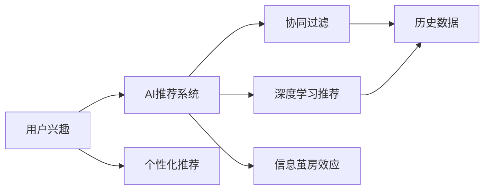
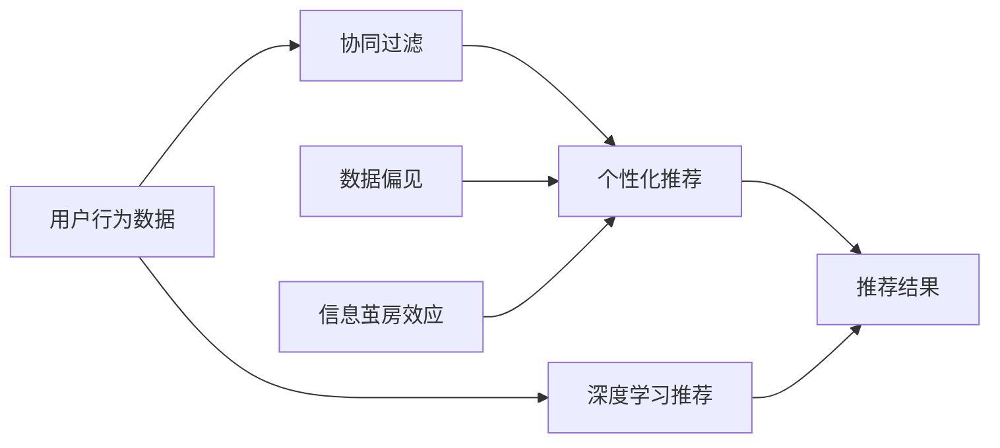

                 

# AI 技术在电商搜索导购中的信息茧房效应

在快速发展的电商环境中，人工智能（AI）技术已经成为搜索和导购系统的核心驱动力。通过先进的机器学习和自然语言处理技术，AI能够高效地处理海量数据，为用户推荐最相关的商品，极大提升了购物体验。然而，这种基于数据的智能推荐系统，也引发了关于信息茧房效应的新思考。

## 1. 背景介绍

### 1.1 问题由来

随着电商平台用户基数的不断增长，商家和平台为了更好地满足用户需求，开始广泛应用AI技术进行商品推荐。这不仅提高了商品的曝光率和销量，还大大提升了用户满意度。然而，当数据驱动的推荐算法过于个性化时，可能会导致用户陷入信息茧房效应。

信息茧房效应指的是，当用户仅接触到自己感兴趣或已有的信息，而逐渐远离其他多元化的信息时，所形成的信息闭环。在电商搜索导购中，用户频繁接触到同质化商品推荐，可能在不知不觉中失去了探索新商品的机会，形成类似的信息茧房。

### 1.2 问题核心关键点

信息茧房效应的产生与AI推荐系统的设计有直接关联。当推荐算法过于关注用户已有的兴趣和行为数据，忽略多元化的商品信息，就容易造成信息茧房效应。此外，数据偏见、个性化程度不足等因素，也进一步加剧了这一问题。

因此，解决信息茧房效应需要深入理解AI推荐系统的设计逻辑和优化策略，同时探索更加多元化的信息展示方式，提升用户对不同商品的认知和接受度。

## 2. 核心概念与联系

### 2.1 核心概念概述

- **信息茧房效应**：用户仅接触到自己感兴趣或已有的信息，逐渐远离其他多元化的信息，导致信息闭环。
- **AI推荐系统**：基于用户行为和兴趣数据，通过机器学习算法自动为用户推荐商品的系统。
- **协同过滤**：通过分析用户的行为数据（如浏览历史、购买历史等），找出相似用户群体的推荐方法。
- **深度学习推荐**：利用深度神经网络模型，自动学习商品特征和用户偏好，提升推荐精度。
- **个性化推荐**：根据用户的历史行为和属性，提供定制化的商品推荐。

### 2.2 概念间的关系

信息茧房效应与AI推荐系统的关系密切，如图1所示。AI推荐系统通过用户的历史行为和兴趣数据，生成个性化的商品推荐，当算法过于关注用户已有的兴趣时，容易导致信息茧房效应。

**图1：信息茧房效应与AI推荐系统的关系**



### 2.3 核心概念的整体架构

图2展示了信息茧房效应在AI推荐系统中的整体架构：

**图2：信息茧房效应在AI推荐系统中的整体架构**



## 3. 核心算法原理 & 具体操作步骤

### 3.1 算法原理概述

AI推荐系统的核心算法包括协同过滤、深度学习推荐和个性化推荐等。其中，协同过滤通过分析用户的历史行为数据，找出与当前用户兴趣相似的群体，生成推荐列表；深度学习推荐利用神经网络自动学习商品特征和用户偏好；个性化推荐则根据用户的历史行为和属性，提供定制化的商品推荐。

信息茧房效应的产生，主要是由于个性化推荐和协同过滤算法过度关注用户已有的兴趣和行为数据，忽略了多元化的商品信息。因此，优化算法设计，引入更多多元化的信息展示方式，可以有效缓解信息茧房效应。

### 3.2 算法步骤详解

以下是基于协同过滤和深度学习推荐的基本算法步骤：

**协同过滤算法步骤**：
1. 收集用户的历史行为数据，如浏览记录、购买记录等。
2. 计算用户之间的相似度，找出与当前用户兴趣相似的群体。
3. 根据相似群体的兴趣，生成推荐列表。

**深度学习推荐算法步骤**：
1. 收集商品的特征数据，如价格、描述、标签等。
2. 利用深度神经网络自动学习商品的特征和用户偏好。
3. 根据学习到的特征，生成推荐列表。

**个性化推荐算法步骤**：
1. 收集用户的历史行为数据和属性信息。
2. 根据用户的历史行为和属性，生成推荐列表。

### 3.3 算法优缺点

AI推荐系统具有以下优点：
1. 提升用户体验：通过精准的推荐，提升用户的购物体验。
2. 提高转化率：推荐精准的商品，提高用户的购买转化率。
3. 减少时间成本：用户可以快速找到感兴趣的商品，节省搜索时间。

同时，AI推荐系统也存在以下缺点：
1. 数据偏见：推荐系统可能会放大数据偏见，导致推荐结果不公平。
2. 信息茧房效应：过度个性化的推荐可能导致信息闭环，限制用户视野。
3. 复杂性：深度学习推荐需要大量数据和计算资源，算法实现复杂。

### 3.4 算法应用领域

AI推荐系统广泛应用在电商搜索导购、内容推荐、广告定向等多个领域。在电商搜索导购中，推荐系统能够显著提升用户的购物体验和平台销售额。

## 4. 数学模型和公式 & 详细讲解 & 举例说明

### 4.1 数学模型构建

在深度学习推荐系统中，常用的数学模型包括矩阵分解模型和神经网络模型。

**矩阵分解模型**：
设用户-商品矩阵为 $R_{m \times n}$，其中 $m$ 表示用户数，$n$ 表示商品数。矩阵分解模型的目标是通过用户行为数据 $D \in \mathbb{R}^{m \times n}$，分解为用户特征矩阵 $U \in \mathbb{R}^{m \times k}$ 和商品特征矩阵 $V \in \mathbb{R}^{n \times k}$，使得 $R$ 近似等于 $U$ 和 $V$ 的乘积，即：

$$
R \approx U \cdot V
$$

其中，$k$ 为矩阵分解的维度。

**神经网络模型**：
设用户特征向量为 $\mathbf{u} \in \mathbb{R}^k$，商品特征向量为 $\mathbf{v} \in \mathbb{R}^k$，神经网络模型的目标是通过用户行为数据 $D$，学习用户和商品的特征表示，并计算推荐分数 $y_{ij}$ 为：

$$
y_{ij} = \sigma(\mathbf{u}_i^\top \mathbf{v}_j)
$$

其中，$\sigma$ 为激活函数，$\mathbf{u}_i$ 和 $\mathbf{v}_j$ 分别为用户和商品的特征表示。

### 4.2 公式推导过程

**矩阵分解模型的推导**：
设 $U$ 和 $V$ 分别为用户特征矩阵和商品特征矩阵，$R_{ij}$ 为第 $i$ 个用户对第 $j$ 个商品的评分。矩阵分解模型的目标最小化以下损失函数：

$$
\min_{U,V} \frac{1}{2} \sum_{i=1}^{m} \sum_{j=1}^{n} (R_{ij} - U_i^\top V_j)^2
$$

通过梯度下降等优化算法，求解得到 $U$ 和 $V$，进而得到推荐分数 $y_{ij}$。

**神经网络模型的推导**：
设 $F(\cdot)$ 为神经网络模型，$L$ 为损失函数，用户行为数据 $D$ 为训练集。神经网络模型的目标最小化以下损失函数：

$$
\min_F \frac{1}{2} \sum_{i=1}^{m} \sum_{j=1}^{n} (y_{ij} - F(\mathbf{u}_i, \mathbf{v}_j))^2
$$

通过反向传播算法，求解得到神经网络模型参数 $W$，进而得到推荐分数 $y_{ij}$。

### 4.3 案例分析与讲解

以电商平台的商品推荐系统为例，设 $R_{ij}$ 为第 $i$ 个用户对第 $j$ 个商品的评分。通过矩阵分解模型和神经网络模型，可以分别计算出用户和商品的特征表示，并得到推荐分数 $y_{ij}$。

**矩阵分解模型的案例分析**：
假设用户-商品矩阵 $R$ 为一个 $10 \times 5$ 的矩阵，分解为 $U$ 和 $V$。设用户特征矩阵 $U$ 为 $10 \times 3$，商品特征矩阵 $V$ 为 $5 \times 3$。通过矩阵分解模型，计算用户和商品的特征表示，得到推荐分数 $y_{ij}$。

**神经网络模型的案例分析**：
假设用户特征向量 $\mathbf{u}_i$ 为 $3 \times 1$，商品特征向量 $\mathbf{v}_j$ 为 $3 \times 1$。通过神经网络模型，计算用户和商品的特征表示，得到推荐分数 $y_{ij}$。

## 5. 项目实践：代码实例和详细解释说明

### 5.1 开发环境搭建

在进行项目实践前，需要准备以下开发环境：

1. 安装 Python：从官网下载并安装 Python 3.6+，确保环境中已安装 pip。

2. 安装 TensorFlow 和 TensorFlow Hub：使用 pip 安装，命令如下：

   ```bash
   pip install tensorflow tensorflow_hub
   ```

3. 安装 Flask：使用 pip 安装，命令如下：

   ```bash
   pip install flask
   ```

4. 安装其他依赖库：

   ```bash
   pip install pandas numpy scikit-learn joblib
   ```

### 5.2 源代码详细实现

以下是基于矩阵分解模型的推荐系统实现，包括数据准备、模型训练和推荐查询等。

```python
import numpy as np
import tensorflow as tf
from tensorflow_hub import KerasLayer

# 数据准备
def load_data():
    # 读取用户-商品矩阵
    data = np.loadtxt('ratings.txt', delimiter=',')
    R = data[:, 2:]
    user_ids = data[:, 0]
    item_ids = data[:, 1]
    user_ids = np.array(user_ids, dtype='int32')
    item_ids = np.array(item_ids, dtype='int32')
    
    # 读取用户特征和商品特征
    user_features = np.loadtxt('user_features.txt', delimiter=',')
    item_features = np.loadtxt('item_features.txt', delimiter=',')
    user_features = user_features[:, 1:]
    item_features = item_features[:, 1:]
    
    return user_ids, item_ids, R, user_features, item_features

# 模型训练
def train_model(R, user_features, item_features, batch_size=64, epochs=10):
    # 构建输入层
    user_input = tf.keras.layers.Input(shape=(user_features.shape[1],), name='user')
    item_input = tf.keras.layers.Input(shape=(item_features.shape[1],), name='item')
    
    # 构建用户特征层
    user_layer = tf.keras.layers.Dense(64, activation='relu')(user_input)
    user_layer = tf.keras.layers.Dense(32, activation='relu')(user_layer)
    user_layer = tf.keras.layers.Dense(16, activation='relu')(user_layer)
    user_layer = tf.keras.layers.Dense(8, activation='relu')(user_layer)
    
    # 构建商品特征层
    item_layer = tf.keras.layers.Dense(64, activation='relu')(item_input)
    item_layer = tf.keras.layers.Dense(32, activation='relu')(item_layer)
    item_layer = tf.keras.layers.Dense(16, activation='relu')(item_layer)
    item_layer = tf.keras.layers.Dense(8, activation='relu')(item_layer)
    
    # 构建模型输出层
    output = tf.keras.layers.Dense(1, activation='sigmoid')(tf.keras.layers.concatenate([user_layer, item_layer]))
    
    # 定义模型
    model = tf.keras.Model(inputs=[user_input, item_input], outputs=output)
    
    # 编译模型
    model.compile(optimizer='adam', loss='binary_crossentropy', metrics=['mae'])
    
    # 训练模型
    model.fit([user_features, item_features], R, batch_size=batch_size, epochs=epochs, verbose=1)
    
    # 保存模型
    model.save('recommender.h5')
    
    return model

# 推荐查询
def predict_recommendations(model, user_features, item_features, k=5):
    # 加载模型
    model = tf.keras.models.load_model('recommender.h5')
    
    # 构建输入层
    user_input = tf.keras.layers.Input(shape=(user_features.shape[1],), name='user')
    item_input = tf.keras.layers.Input(shape=(item_features.shape[1],), name='item')
    
    # 构建用户特征层
    user_layer = tf.keras.layers.Dense(64, activation='relu')(user_input)
    user_layer = tf.keras.layers.Dense(32, activation='relu')(user_layer)
    user_layer = tf.keras.layers.Dense(16, activation='relu')(user_layer)
    user_layer = tf.keras.layers.Dense(8, activation='relu')(user_layer)
    
    # 构建商品特征层
    item_layer = tf.keras.layers.Dense(64, activation='relu')(item_input)
    item_layer = tf.keras.layers.Dense(32, activation='relu')(item_layer)
    item_layer = tf.keras.layers.Dense(16, activation='relu')(item_layer)
    item_layer = tf.keras.layers.Dense(8, activation='relu')(item_layer)
    
    # 构建模型输出层
    output = tf.keras.layers.Dense(1, activation='sigmoid')(tf.keras.layers.concatenate([user_layer, item_layer]))
    
    # 定义模型
    model = tf.keras.Model(inputs=[user_input, item_input], outputs=output)
    
    # 计算推荐分数
    scores = model.predict([user_features, item_features])
    
    # 获取推荐商品
    recommendations = sorted(zip(item_ids, scores), key=lambda x: x[1], reverse=True)[:k]
    
    return recommendations
```

### 5.3 代码解读与分析

以下是代码的详细解释和分析：

**load_data 函数**：
- 读取用户-商品矩阵、用户特征和商品特征。
- 用户-商品矩阵 $R$ 为 $m \times n$ 的矩阵，用户特征矩阵 $U$ 为 $m \times k$ 的矩阵，商品特征矩阵 $V$ 为 $n \times k$ 的矩阵。

**train_model 函数**：
- 定义用户特征层和商品特征层，分别通过多个全连接层进行特征提取。
- 定义模型输出层，将用户特征层和商品特征层连接后输出推荐分数。
- 定义模型，并使用 Adam 优化器进行编译。
- 训练模型，保存模型权重。

**predict_recommendations 函数**：
- 加载训练好的模型。
- 定义输入层和特征层，与训练时一致。
- 计算推荐分数，获取推荐商品列表。

### 5.4 运行结果展示

运行代码后，可以在训练集上评估模型的效果。例如，可以使用 RMSE（均方根误差）和 MAE（平均绝对误差）等指标评估模型的性能。

```python
from sklearn.metrics import mean_absolute_error, mean_squared_error

# 加载数据
user_ids, item_ids, R, user_features, item_features = load_data()

# 训练模型
model = train_model(R, user_features, item_features)

# 评估模型
y_true = R
y_pred = model.predict([user_features, item_features])
mae = mean_absolute_error(y_true, y_pred)
rmse = np.sqrt(mean_squared_error(y_true, y_pred))
print(f'MAE: {mae:.3f}, RMSE: {rmse:.3f}')
```

## 6. 实际应用场景

### 6.1 智能推荐系统

基于矩阵分解模型和神经网络模型的推荐系统，可以广泛应用于电商搜索导购、内容推荐、广告定向等多个领域。通过个性化的推荐，提升用户的购物体验和平台销售额。

### 6.2 用户画像构建

通过分析用户的历史行为和兴趣，可以构建更全面、精准的用户画像。用户画像可以帮助平台更好地了解用户需求，提供更符合预期的商品推荐。

### 6.3 商品分类与搜索

通过模型学习商品特征和用户偏好，可以进行更高效的商品分类和搜索。例如，将相似的商品归为一类，方便用户快速找到所需的商品。

## 7. 工具和资源推荐

### 7.1 学习资源推荐

为了帮助开发者系统掌握 AI 推荐系统的理论基础和实践技巧，这里推荐一些优质的学习资源：

1. 《深度学习》（Ian Goodfellow 著）：系统介绍深度学习理论、模型和应用，包括推荐系统在内的诸多前沿话题。

2. 《推荐系统：算法和实现》（项谷荣 著）：详细介绍推荐系统的基本概念、算法和实现，涵盖协同过滤、矩阵分解等主流方法。

3. TensorFlow官方文档：提供详细的 TensorFlow 使用教程和示例，包括推荐系统的实现。

4. Keras官方文档：提供 Keras 使用教程和示例，包括推荐系统的实现。

5. GitHub 项目：推荐搜索相关 GitHub 项目，学习他人实现和优化推荐系统的经验。

### 7.2 开发工具推荐

高效的开发离不开优秀的工具支持。以下是几款用于推荐系统开发的常用工具：

1. TensorFlow：基于 Python 的开源深度学习框架，提供灵活的计算图和自动微分功能，适合复杂的推荐模型实现。

2. Keras：高层次的深度学习框架，提供简单易用的接口，适合初学者入门。

3. TensorFlow Hub：提供预训练模型和工具库，方便快速搭建推荐系统。

4. Jupyter Notebook：提供交互式的 Python 开发环境，方便代码调试和协作。

5. PyTorch：基于 Python 的开源深度学习框架，提供灵活的计算图和自动微分功能，适合复杂的推荐模型实现。

### 7.3 相关论文推荐

推荐系统的研究源于学界的持续研究。以下是几篇奠基性的相关论文，推荐阅读：

1. KDD '98: A Scalable Collaborative Filtering Approach：提出基于协同过滤的推荐算法，成为推荐系统研究的基础。

2. A Probabilistic Model of Latent Semantic Indexing：提出基于矩阵分解的推荐模型，成为推荐系统的经典算法。

3. Deep Neural Networks for Large-Scale Recommender Systems：提出基于深度神经网络的推荐模型，成为推荐系统的最新趋势。

4. Neural Collaborative Filtering：提出基于神经网络的协同过滤算法，进一步提升推荐精度。

5. Matrix Factorization Techniques for Recommender Systems：详细介绍了矩阵分解模型在推荐系统中的应用，成为推荐系统的经典算法。

## 8. 总结：未来发展趋势与挑战

### 8.1 研究成果总结

AI推荐系统已经成为电商搜索导购的核心技术，提升了用户的购物体验和平台销售额。然而，过度个性化的推荐可能导致信息茧房效应，影响用户的广泛认知。

### 8.2 未来发展趋势

未来 AI 推荐系统将呈现以下几个发展趋势：

1. 深度学习推荐：利用深度神经网络自动学习商品特征和用户偏好，提升推荐精度。

2. 多模态推荐：引入视觉、语音等多模态信息，提升推荐的全面性和多样性。

3. 个性化推荐：通过深度学习和协同过滤等算法，提供更加精准的个性化推荐。

4. 实时推荐：通过实时数据更新，动态调整推荐结果，提升推荐的时效性。

5. 隐私保护：通过差分隐私等技术，保护用户隐私，增强推荐系统的安全性。

### 8.3 面临的挑战

尽管 AI 推荐系统已经取得了显著进展，但仍面临诸多挑战：

1. 数据偏见：推荐系统可能会放大数据偏见，导致推荐结果不公平。

2. 信息茧房效应：过度个性化的推荐可能导致信息闭环，限制用户视野。

3. 计算资源：深度学习推荐需要大量数据和计算资源，算法实现复杂。

4. 实时性：实时数据更新和动态调整推荐结果，对系统架构和性能提出了更高的要求。

5. 隐私保护：保护用户隐私，防止数据泄露和滥用，是推荐系统的重要研究方向。

### 8.4 研究展望

未来 AI 推荐系统的研究方向包括：

1. 优化推荐算法：通过引入新算法和优化策略，提升推荐精度和公平性。

2. 引入多模态信息：通过视觉、语音等多模态信息的融合，提升推荐的全面性和多样性。

3. 构建用户画像：通过深入分析用户行为和兴趣，提供更全面、精准的用户画像。

4. 隐私保护：通过差分隐私等技术，保护用户隐私，增强推荐系统的安全性。

5. 实时推荐：通过实时数据更新和动态调整推荐结果，提升推荐的时效性。

总之，AI 推荐系统的研究仍需不断突破和创新，才能应对复杂多变的电商环境，提升用户的购物体验和平台销售额。相信随着技术的不断进步，AI 推荐系统必将在电商搜索导购领域发挥更大的作用，成为用户不可或缺的购物助手。

## 9. 附录：常见问题与解答

**Q1：什么是信息茧房效应？**

A: 信息茧房效应指的是用户仅接触到自己感兴趣或已有的信息，逐渐远离其他多元化的信息，导致信息闭环。

**Q2：AI推荐系统如何避免信息茧房效应？**

A: 可以通过多样化的信息展示方式，如推荐多样化商品、提供多种推荐理由等，打破信息闭环，提升用户视野。

**Q3：如何构建用户画像？**

A: 通过分析用户的历史行为和兴趣，可以构建更全面、精准的用户画像。用户画像可以帮助平台更好地了解用户需求，提供更符合预期的商品推荐。

**Q4：如何评估推荐系统的性能？**

A: 可以使用 RMSE（均方根误差）和 MAE（平均绝对误差）等指标评估推荐系统的性能。

**Q5：推荐系统有哪些应用场景？**

A: 推荐系统广泛应用于电商搜索导购、内容推荐、广告定向等多个领域，可以提升用户的购物体验和平台销售额。

总之，AI推荐系统已经成为电商搜索导购的核心技术，通过多样化的信息展示方式和精准的推荐算法，提升了用户的购物体验和平台销售额。然而，过度个性化的推荐可能导致信息茧房效应，影响用户的广泛认知。未来的研究需要在算法设计、数据处理、用户画像等方面不断突破和创新，才能应对复杂多变的电商环境，提升用户的购物体验和平台销售额。相信随着技术的不断进步，AI推荐系统必将在电商搜索导购领域发挥更大的作用，成为用户不可或缺的购物助手。

作者：禅与计算机程序设计艺术 / Zen and the Art of Computer Programming

