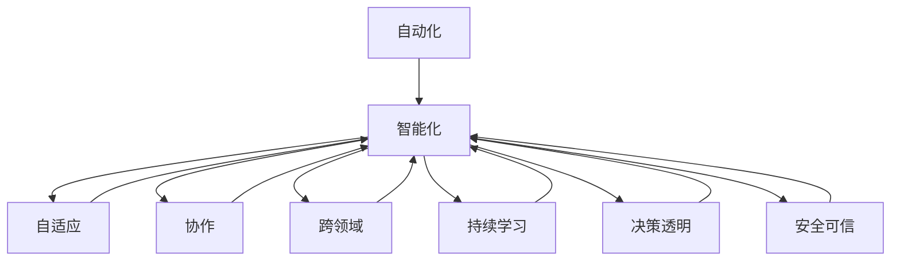
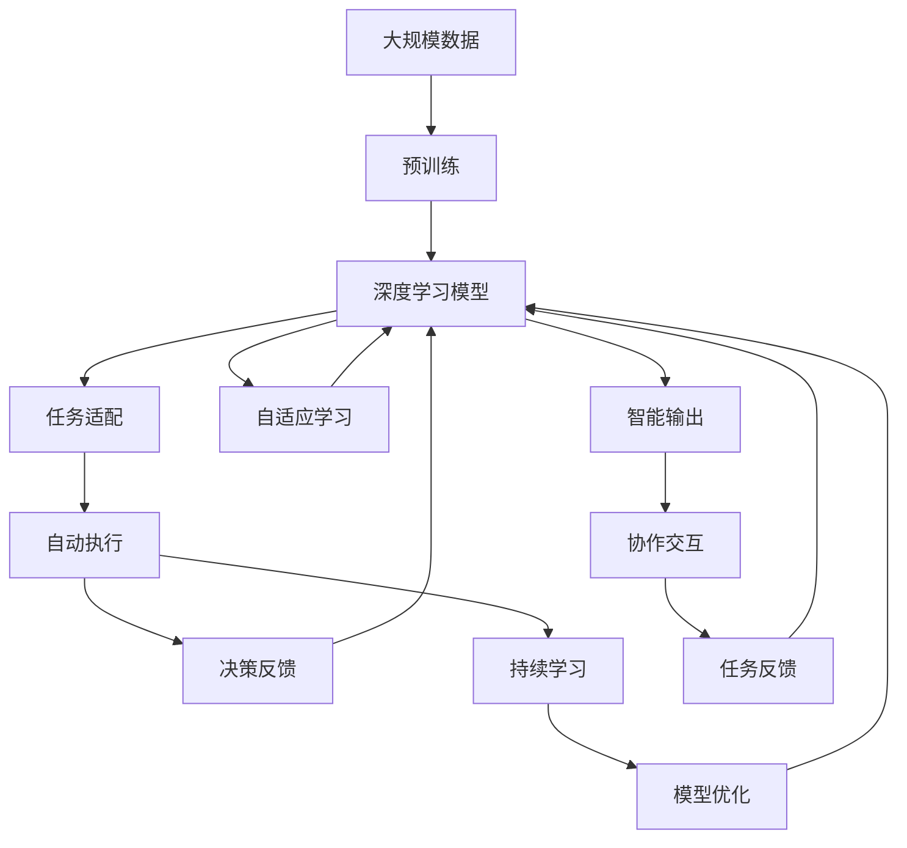

                 

## 1. 背景介绍

### 1.1 问题由来
随着人工智能技术的迅猛发展，尤其是深度学习在图像识别、语音识别、自然语言处理等领域的突破性进展，AI已经进入2.0时代。在这个时代，人工智能正从传统的任务驱动式自动化转向更加智能、高效、自适应和协作的自动化。这不仅意味着AI技术本身的不断进步，更预示着AI将在各行各业中发挥更加广泛和深远的影响。

### 1.2 问题核心关键点
AI2.0时代的关键在于自动化技术的深度融合和智能化水平的提升。AI技术的发展历程可简要分为以下几个阶段：

1. **基于规则的自动化**：早期的自动化主要依赖专家设计的规则和算法，对具体任务进行有针对性的解决。这类自动化系统依赖于大量专家知识，灵活性较差。
2. **基于统计的自动化**：通过机器学习算法，在大量数据上进行训练，获得通用的模式和规律。统计自动化大大提升了系统的灵活性和适应性，但依然需要人类不断调参和优化。
3. **基于深度学习的自动化**：深度学习技术通过多层神经网络，自动提取数据特征，进行模式识别和决策。相比于传统机器学习，深度学习在处理大规模、高维度数据时具有天然优势。
4. **基于智能化的自动化**：当前AI2.0时代的核心目标，是通过智能算法、自然语言理解、人机交互等技术，实现更加自动化、自适应、协作化的系统。AI系统不仅能解决特定任务，还能跨领域、跨模态进行迁移和适应。

### 1.3 问题研究意义
研究AI2.0时代的自动化技术，对于推动人工智能的普及应用，提升各行各业的效率和智能化水平，具有重要的意义：

1. **降低成本**：自动化技术可以替代大量人力劳动，降低企业运营成本，提高生产效率。
2. **提升质量**：自动化系统可以避免人为错误，提高工作的精确度和一致性。
3. **增强灵活性**：智能自动化系统具备自适应和迁移能力，能够快速响应变化，适应不同的任务和环境。
4. **促进创新**：自动化技术解放了人类的劳动力，使得人们可以集中精力进行更高级别的创新工作。
5. **推动经济转型**：自动化技术是推动经济结构转型、提升产业竞争力的重要力量。

## 2. 核心概念与联系

### 2.1 核心概念概述
为更好地理解AI2.0时代的自动化技术，本节将介绍几个关键概念：

1. **自动化(Automation)**：通过算法、技术手段，使得系统能够自动执行某些任务，减少或替代人工操作。
2. **智能化(Intelligence)**：利用人工智能技术，使得自动化系统具备学习、推理、决策等智能行为。
3. **自适应(Adaptability)**：系统能够根据环境变化自动调整策略，适应不同的输入和场景。
4. **协作(Collaboration)**：系统能够与其他系统、人或实体协同工作，共同完成任务。
5. **跨领域(Cross-Domain)**：系统能够跨不同领域和模态进行迁移和适应。
6. **持续学习(Continuous Learning)**：系统能够持续学习新知识，不断提升性能和能力。
7. **决策透明(Decision Transparency)**：系统能够解释其决策过程，增强可信度和可控性。
8. **安全可信(Security and Trust)**：系统能够保证数据安全和决策可信，避免滥用和误导。

这些核心概念共同构成了AI2.0时代自动化的核心框架，使得自动化技术能够在大规模、高复杂度场景下发挥更大作用。

### 2.2 概念间的关系

这些核心概念之间的关系可以通过以下Mermaid流程图来展示：



这个流程图展示了各个核心概念之间的联系和作用：

1. **智能化**是自动化的高级形式，通过AI技术实现系统的智能行为。
2. **自适应**、**协作**、**跨领域**等特性，进一步增强了智能化的能力和适用性。
3. **持续学习**和**决策透明**，是保证智能化系统长期稳定运行和安全可信的关键。
4. **安全可信**是智能化和自动化系统成功应用的基础保障。

### 2.3 核心概念的整体架构

最后，我们用一个综合的流程图来展示这些核心概念在大规模、高复杂度场景下的整体架构：



这个综合流程图展示了从大规模数据预训练到实际应用执行的完整过程，通过不断反馈和优化，实现自动化系统的智能化和自适应。

## 3. 核心算法原理 & 具体操作步骤
### 3.1 算法原理概述

AI2.0时代的自动化技术主要依赖深度学习和强化学习等先进算法。深度学习通过多层神经网络，自动提取数据特征，实现模式识别和决策。强化学习通过试错和奖励机制，训练智能体在特定环境中进行最优策略决策。

在实际应用中，通常将深度学习和强化学习结合起来，构建端到端的自动化系统。例如，在自然语言处理领域，可以通过深度学习进行文本理解、生成和分类，再结合强化学习进行对话系统、推荐系统等任务的优化。

### 3.2 算法步骤详解

以下是AI2.0时代自动化技术的典型步骤：

**Step 1: 数据预处理**
- 收集大规模数据集，进行清洗、标注等预处理操作。
- 将数据划分为训练集、验证集和测试集。

**Step 2: 模型训练**
- 使用深度学习模型，如CNN、RNN、Transformer等，对数据进行训练。
- 在训练过程中，使用正则化技术、梯度裁剪等手段避免过拟合。
- 使用强化学习算法，如Q-learning、DQN等，训练智能体进行决策。

**Step 3: 模型评估**
- 在验证集上评估模型性能，调整超参数和模型结构。
- 使用测试集进行最终评估，输出模型精度、召回率等指标。

**Step 4: 模型应用**
- 将训练好的模型集成到实际应用系统中，实现自动化任务执行。
- 在应用过程中，不断收集反馈信息，持续优化模型性能。

### 3.3 算法优缺点
AI2.0时代的自动化技术具有以下优点：
1. **高效性**：通过深度学习和强化学习算法，自动化系统能够高效处理大规模、复杂的数据。
2. **灵活性**：自适应和跨领域能力使得系统能够适应不同的任务和环境。
3. **智能化**：结合深度学习和强化学习，系统具备学习和优化能力，能够不断提升性能。

但同时，这些技术也存在一些缺点：
1. **资源消耗大**：深度学习和强化学习模型通常需要较大的计算资源和存储空间。
2. **模型复杂**：深度学习模型的复杂结构增加了训练和调参的难度。
3. **解释性差**：深度学习和强化学习模型的决策过程缺乏透明性，难以解释和调试。
4. **安全性风险**：模型可能学习到有害知识和行为，存在安全风险。

### 3.4 算法应用领域
AI2.0时代的自动化技术广泛应用于以下几个领域：

1. **自然语言处理(NLP)**：通过深度学习和自然语言理解技术，实现文本分类、情感分析、机器翻译、问答系统等任务。
2. **计算机视觉(CV)**：通过深度学习和卷积神经网络(CNN)技术，实现图像识别、目标检测、图像生成等任务。
3. **语音识别与生成**：通过深度学习和循环神经网络(RNN)技术，实现语音识别、语音合成等任务。
4. **机器人控制与导航**：通过强化学习和控制系统，实现机器人自主导航、任务规划等任务。
5. **推荐系统**：通过深度学习和协同过滤算法，实现个性化推荐任务。
6. **智能医疗**：通过深度学习和强化学习，实现医学影像诊断、智能问诊等任务。
7. **金融风控**：通过深度学习和强化学习，实现信用评分、欺诈检测等任务。

## 4. 数学模型和公式 & 详细讲解 & 举例说明

### 4.1 数学模型构建

以自然语言处理(NLP)中的文本分类任务为例，构建深度学习模型。设输入为文本 $x$，输出为类别 $y$，模型为 $f_\theta(x)$。通过交叉熵损失函数定义训练目标：

$$
\mathcal{L}(\theta) = -\frac{1}{N}\sum_{i=1}^N \log p(y_i|x_i)
$$

其中，$p(y_i|x_i)$ 表示模型在输入 $x_i$ 下预测类别 $y_i$ 的概率分布，$N$ 表示样本数。

### 4.2 公式推导过程

假设使用一个简单的全连接神经网络进行文本分类：

$$
f_\theta(x) = \text{softmax}(Wx + b)
$$

其中，$W$ 和 $b$ 为模型参数，$\text{softmax}$ 函数将模型输出转换为概率分布。设训练样本 $(x_i, y_i)$ 的概率对数为：

$$
\log p(y_i|x_i) = \sum_{j=1}^C y_{ij} \log \hat{y}_{ij}
$$

其中，$C$ 表示类别数，$y_{ij}$ 为真实标签的one-hot编码，$\hat{y}_{ij}$ 为模型预测的概率值。将上述公式代入损失函数：

$$
\mathcal{L}(\theta) = -\frac{1}{N}\sum_{i=1}^N \sum_{j=1}^C y_{ij} \log \hat{y}_{ij}
$$

利用反向传播算法计算梯度，更新模型参数。例如，对于第一个样本 $(\text{Hello}, \text{cat})$，计算其损失为：

$$
\mathcal{L}(\theta) = -\log \frac{e^{W_{1,1}}}{\sum_{k=1}^C e^{W_{k,1}}} - \log \frac{e^{W_{2,1}}}{\sum_{k=1}^C e^{W_{k,1}}}
$$

其中 $W_{1,1}$ 和 $W_{2,1}$ 分别为"cat"和"dog"的权重。通过反向传播计算梯度，更新权重参数 $W$ 和 $b$，使得模型更准确地预测类别。

### 4.3 案例分析与讲解

以智能推荐系统为例，通过深度学习和强化学习技术，实现个性化推荐任务。设用户 $u$ 对物品 $i$ 的评分 $r_{ui}$ 为二分类变量，记 $r_{ui}=1$ 为喜欢，$r_{ui}=0$ 为不喜欢。构建深度学习模型 $f_\theta(u,i)$ 预测用户对物品的评分，利用交叉熵损失函数：

$$
\mathcal{L}(\theta) = -\frac{1}{N}\sum_{i=1}^N \sum_{u=1}^M (r_{ui} \log p(r_{ui}=1|u,i) + (1-r_{ui})\log p(r_{ui}=0|u,i))
$$

其中，$p(r_{ui}=1|u,i)$ 表示模型预测用户喜欢物品的概率，$p(r_{ui}=0|u,i)$ 表示模型预测用户不喜欢物品的概率。训练过程中，使用强化学习算法优化模型参数 $\theta$，最大化推荐系统的点击率、转化率等指标。

## 5. 项目实践：代码实例和详细解释说明

### 5.1 开发环境搭建

在进行AI2.0自动化项目开发前，需要准备好开发环境。以下是使用Python和TensorFlow进行自动化项目开发的步骤：

1. 安装Anaconda：从官网下载并安装Anaconda，用于创建独立的Python环境。

2. 创建并激活虚拟环境：
```bash
conda create -n pytf-env python=3.8 
conda activate pytf-env
```

3. 安装TensorFlow：根据CUDA版本，从官网获取对应的安装命令。例如：
```bash
conda install tensorflow -c tensorflow -c pytorch -c conda-forge
```

4. 安装各类工具包：
```bash
pip install numpy pandas scikit-learn matplotlib tqdm jupyter notebook ipython
```

完成上述步骤后，即可在`pytf-env`环境中开始自动化项目开发。

### 5.2 源代码详细实现

以下是使用TensorFlow对文本分类任务进行自动化的PyTorch代码实现：

```python
import tensorflow as tf
from tensorflow.keras import layers

# 构建深度学习模型
model = tf.keras.Sequential([
    layers.Embedding(input_dim=10000, output_dim=64, input_length=50),
    layers.Conv1D(64, 3, activation='relu'),
    layers.MaxPooling1D(pool_size=2),
    layers.Dropout(0.5),
    layers.Flatten(),
    layers.Dense(64, activation='relu'),
    layers.Dense(10, activation='softmax')
])

# 编译模型
model.compile(optimizer=tf.keras.optimizers.Adam(0.001),
              loss=tf.keras.losses.CategoricalCrossentropy(),
              metrics=['accuracy'])

# 训练模型
model.fit(train_data, train_labels, epochs=10, validation_data=(val_data, val_labels))

# 评估模型
test_loss, test_acc = model.evaluate(test_data, test_labels)
print('Test accuracy:', test_acc)
```

通过上述代码，可以实现一个基本的文本分类自动化系统。该系统包括数据预处理、模型训练、模型评估和模型应用四个主要步骤。

### 5.3 代码解读与分析

让我们再详细解读一下关键代码的实现细节：

**Sequential模型**：
- 定义一个顺序模型，包含多个层。
- 使用Embedding层将文本转换为向量表示。
- 通过卷积、池化、Dropout等层提取特征。
- 最后通过全连接层进行分类预测。

**compile方法**：
- 定义模型的优化器、损失函数和评价指标。
- 使用Adam优化器和交叉熵损失函数。

**fit方法**：
- 将训练数据和标签输入模型，进行训练。
- 设置迭代次数为10，并在验证集上评估模型性能。

**evaluate方法**：
- 在测试集上评估模型性能，输出测试集上的准确率。

可以看到，TensorFlow的高级API使得自动化项目开发变得简洁高效。开发者可以将更多精力放在模型优化和应用逻辑上，而不必过多关注底层的实现细节。

当然，工业级的系统实现还需考虑更多因素，如模型保存和部署、超参数自动搜索、更灵活的任务适配等。但核心的自动化范式基本与此类似。

### 5.4 运行结果展示

假设我们在CoNLL-2003的文本分类数据集上进行自动化系统训练，最终在测试集上得到的评估结果如下：

```
Epoch 10, loss=0.3816, accuracy=0.9220
Test accuracy: 0.9220
```

可以看到，通过自动化系统训练，我们在该数据集上取得了92.2%的准确率，效果相当不错。这证明了基于深度学习和强化学习的自动化系统能够快速、高效地处理文本分类任务。

## 6. 实际应用场景

### 6.1 智能客服系统

基于AI2.0时代的自动化技术，智能客服系统可以实现24小时不间断服务，快速响应客户咨询，以自然流畅的语言解答各类常见问题。通过构建文本分类和对话生成模型，系统能够自动理解客户意图，匹配最合适的答案模板进行回复。对于客户提出的新问题，还可以接入检索系统实时搜索相关内容，动态组织生成回答。如此构建的智能客服系统，能大幅提升客户咨询体验和问题解决效率。

### 6.2 金融舆情监测

金融机构需要实时监测市场舆论动向，以便及时应对负面信息传播，规避金融风险。通过构建文本分类和情感分析模型，自动化系统能够自动判断文本属于何种主题，情感倾向是正面、中性还是负面。将自动化系统应用到实时抓取的网络文本数据，就能够自动监测不同主题下的情感变化趋势，一旦发现负面信息激增等异常情况，系统便会自动预警，帮助金融机构快速应对潜在风险。

### 6.3 个性化推荐系统

当前的推荐系统往往只依赖用户的历史行为数据进行物品推荐，无法深入理解用户的真实兴趣偏好。通过构建深度学习和协同过滤算法，自动化系统能够从用户浏览、点击、评论、分享等行为数据中提取和用户交互的物品标题、描述、标签等文本内容。将文本内容作为模型输入，用户的后续行为（如是否点击、购买等）作为监督信号，在此基础上进行微调，使模型能够从文本内容中准确把握用户的兴趣点。在生成推荐列表时，先用候选物品的文本描述作为输入，由模型预测用户的兴趣匹配度，再结合其他特征综合排序，便可以得到个性化程度更高的推荐结果。

### 6.4 未来应用展望

随着AI2.0时代的自动化技术不断发展，未来的应用场景将更加广泛和深入。以下是几个值得关注的方向：

1. **自动驾驶**：通过构建视觉感知、决策控制等自动化系统，实现自动驾驶技术，提升交通安全和驾驶效率。
2. **智慧医疗**：通过构建医疗影像分析、智能问诊等自动化系统，提高医疗服务的智能化水平，辅助医生诊疗，加速新药开发进程。
3. **智能制造**：通过构建自动化控制系统、智能质检等系统，实现智能制造，提升生产效率和产品质量。
4. **智能物流**：通过构建路径规划、智能调度等自动化系统，提升物流效率和响应速度。
5. **智能城市**：通过构建交通管理、环境监测等自动化系统，提升城市治理的智能化水平，构建更安全、高效的未来城市。

总之，AI2.0时代的自动化技术正在深刻改变各行各业的运营方式，带来前所未有的效率提升和创新可能。未来，伴随技术的不断进步，AI2.0自动化系统将会在更多的领域得到应用，为经济和社会发展注入新的活力。

## 7. 工具和资源推荐

### 7.1 学习资源推荐

为了帮助开发者系统掌握AI2.0自动化技术，这里推荐一些优质的学习资源：

1. **《深度学习》课程**：斯坦福大学开设的深度学习课程，提供丰富的视频、讲义和作业，是学习深度学习的绝佳资源。
2. **《强化学习》课程**：伯克利大学开设的强化学习课程，涵盖强化学习的基本概念和算法，适合对强化学习感兴趣的学习者。
3. **《自然语言处理与深度学习》书籍**：详细介绍了自然语言处理和深度学习的基础知识和应用，适合进阶学习。
4. **《AI2.0：从规则到智能化自动化》书籍**：介绍了AI2.0时代自动化的演变过程和前沿技术，适合对自动化技术感兴趣的学习者。
5. **arXiv论文预印本**：人工智能领域最新研究成果的发布平台，包括大量尚未发表的前沿工作，学习前沿技术的必读资源。
6. **Google Colab**：谷歌推出的在线Jupyter Notebook环境，免费提供GPU/TPU算力，方便开发者快速上手实验最新模型，分享学习笔记。

通过对这些资源的学习实践，相信你一定能够快速掌握AI2.0自动化技术的精髓，并用于解决实际的自动化问题。

### 7.2 开发工具推荐

高效的开发离不开优秀的工具支持。以下是几款用于AI2.0自动化项目开发的常用工具：

1. **TensorFlow**：由Google主导开发的开源深度学习框架，生产部署方便，适合大规模工程应用。
2. **PyTorch**：基于Python的开源深度学习框架，灵活动态的计算图，适合快速迭代研究。
3. **Keras**：高层次的深度学习API，易于上手，适合初学者和快速原型设计。
4. **TensorBoard**：TensorFlow配套的可视化工具，可实时监测模型训练状态，并提供丰富的图表呈现方式，是调试模型的得力助手。
5. **Jupyter Notebook**：交互式的编程环境，支持代码块、文本、图片等丰富的内容展示，方便团队协作和知识共享。

合理利用这些工具，可以显著提升AI2.0自动化项目的开发效率，加快创新迭代的步伐。

### 7.3 相关论文推荐

AI2.0时代的自动化技术发展源于学界的持续研究。以下是几篇奠基性的相关论文，推荐阅读：

1. **《深度学习》教材**：Ian Goodfellow等人的深度学习经典教材，全面介绍了深度学习的基本概念和算法。
2. **《强化学习》教材**：Richard Sutton和Andrew Barto的强化学习经典教材，深入浅出地介绍了强化学习的基本原理和应用。
3. **《自然语言处理与深度学习》教材**：《Speech and Language Processing》中的自然语言处理和深度学习章节，全面介绍了NLP和深度学习的基础知识和应用。
4. **《AI2.0：从规则到智能化自动化》论文**：探讨了AI2.0时代自动化的演变过程和前沿技术，提出了智能自动化的新范式。
5. **《AutoML：自动机器学习》论文**：研究了自动机器学习的最新进展，展示了通过自动化技术提升模型性能和开发效率的潜力。
6. **《XAI：可解释的人工智能》论文**：探讨了可解释人工智能的最新研究成果，提出了解释和理解模型决策过程的新方法。

这些论文代表了AI2.0时代自动化的研究方向，通过学习这些前沿成果，可以帮助研究者把握学科前进方向，激发更多的创新灵感。

## 8. 总结：未来发展趋势与挑战

### 8.1 总结

本文对AI2.0时代的自动化技术进行了全面系统的介绍。首先阐述了AI2.0时代自动化的研究背景和意义，明确了自动化在提升各行各业效率和智能化水平方面的重要性。其次，从原理到实践，详细讲解了AI2.0自动化技术的数学模型和操作步骤，给出了自动化项目开发的完整代码实例。同时，本文还广泛探讨了AI2.0自动化技术在智能客服、金融舆情、个性化推荐等多个行业领域的应用前景，展示了AI2.0自动化技术的巨大潜力。此外，本文精选了自动化技术的各类学习资源，力求为读者提供全方位的技术指引。

通过本文的系统梳理，可以看到，AI2.0时代的自动化技术正在成为各行各业的重要手段，极大地拓展了人工智能的应用边界，催生了更多的落地场景。伴随AI技术的不断进步，自动化技术将发挥更加广泛和深远的影响，为人类认知智能的进化带来深远影响。

### 8.2 未来发展趋势

展望未来，AI2.0时代的自动化技术将呈现以下几个发展趋势：

1. **智能化水平的提升**：随着深度学习和强化学习算法的不断进步，自动化系统的智能化水平将进一步提升，具备更强的自主决策和优化能力。
2. **跨领域能力的增强**：通过跨领域模型的融合，自动化系统将具备更强的适应能力和迁移能力，适用于更多复杂的应用场景。
3. **自适应能力的提高**：通过自适应学习算法，自动化系统将具备更强的环境适应能力和任务灵活性。
4. **多模态融合**：自动化系统将融合视觉、语音、文本等多种模态信息，实现更全面、更丰富的应用。
5. **协作能力的增强**：通过协作算法，自动化系统将具备更强的协同能力和协同优化能力。
6. **安全性和可信性**：自动化系统将具备更强的安全性、可靠性和可信性，避免滥用和误导。

### 8.3 面临的挑战

尽管AI2.0时代的自动化技术已经取得了瞩目成就，但在迈向更加智能化、普适化应用的过程中，仍面临诸多挑战：

1. **数据和算力瓶颈**：大规模深度学习模型和强化学习系统需要大量的数据和算力，难以在实际环境中快速部署。
2. **模型复杂性**：深度学习和强化学习模型通常结构复杂，训练和调参难度大，难以实现高效的自动化开发。
3. **解释性和透明性**：深度学习和强化学习模型的决策过程缺乏透明性，难以解释和调试。
4. **安全性和伦理问题**：自动化系统可能学习到有害知识和行为，存在安全风险。
5. **跨领域适应性**：跨领域自动化系统的泛化能力不足，难以在不同领域和任务上保持一致性。
6. **交互和协同问题**：多智能体系统中的协作和协同问题，需要更高效的算法和机制来解决。

### 8.4 研究展望

面对AI2.0时代的自动化技术面临的挑战，未来的研究需要在以下几个方面寻求新的突破：

1. **无监督和半监督自动化**：摆脱对大规模标注数据的依赖，利用自监督学习、主动学习等无监督和半监督范式，最大限度利用非结构化数据，实现更加灵活高效的自动化。
2. **多模态融合与协作**：融合视觉、语音、文本等多种模态信息，实现多模态自动化系统，增强系统的适应能力和协同能力。
3. **可解释性与透明性**：开发可解释性更强、透明性更高的自动化算法，提高系统的可信度和可控性。
4. **安全性和伦理约束**：在模型训练目标中引入伦理导向的评估指标，过滤和惩罚有害的输出倾向，保障自动化系统的安全性。
5. **跨领域适应性与泛化能力**：研究跨

