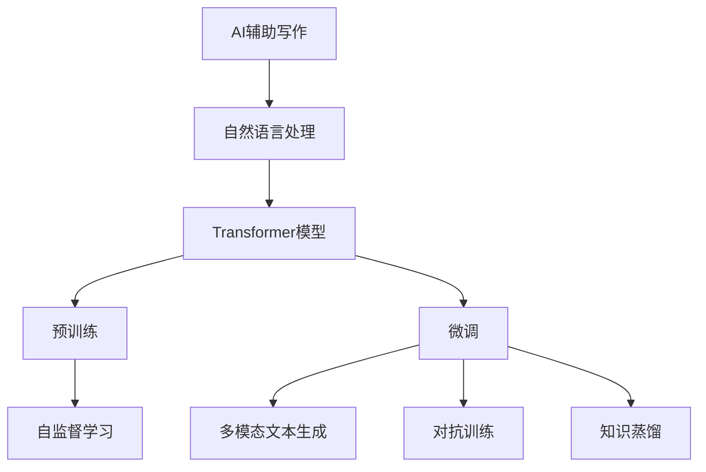
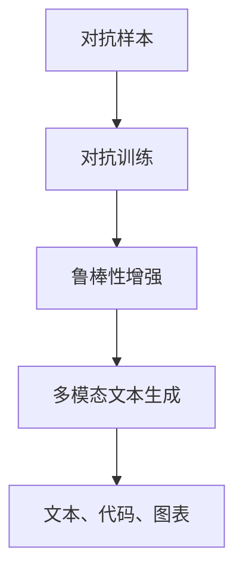
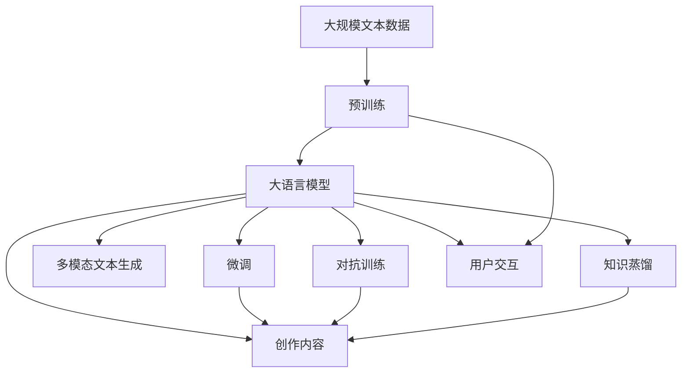

                 

# AIGC从入门到实战：AI 辅助写作：基于 ChatGPT 的自动创作和文本扩展

> 关键词：AIGC, AI辅助写作,自动创作,ChatGPT,文本扩展

## 1. 背景介绍

### 1.1 问题由来
随着人工智能(AI)技术的迅猛发展，AI生成内容(AIGC)已成为众多行业的热门话题。特别是在内容创作领域，AI辅助写作(AI-powered Writing Assistance)正在引发一场革命。近年来，基于深度学习的自然语言处理(NLP)技术，如Transformer、BERT等，在文本生成和文本扩展上取得了巨大突破。这些技术已经被广泛应用于各种场景，包括新闻报道、文案撰写、小说创作、诗歌生成等，显著提升了内容创作的效率和质量。

然而，这些技术通常是针对具体任务设计的，如文本分类、机器翻译、情感分析等，难以灵活应对复杂的文本创作需求。因此，如何构建一个通用的、能够自动创作和扩展文本的AI系统，成为了当前AI领域的一个重要研究方向。

### 1.2 问题核心关键点
ChatGPT作为当前最流行的AI辅助写作工具之一，其核心技术是基于Transformer的大规模语言模型。ChatGPT通过预训练和微调，具备了强大的文本生成和扩展能力。其核心优势在于：
1. **自监督预训练**：在无标签的大规模文本语料上训练，学习通用的语言表示和文本生成能力。
2. **多模态输入输出**：支持多种输入形式，包括文本、图片、语音等，可以生成多种输出形式，如文本、代码、图表等。
3. **人性化的互动体验**：通过不断的迭代和优化，ChatGPT能够与用户进行自然的对话，回答各类问题，生成丰富的内容。
4. **可控性和可解释性**：用户可以通过设置提示模板或参数，引导ChatGPT生成符合特定风格和要求的文本，同时，ChatGPT的输出具有一定的可解释性，用户可以理解其推理过程和生成逻辑。

这些关键点使得ChatGPT在文本自动创作和扩展方面表现出色，广泛应用于各种内容创作场景。

### 1.3 问题研究意义
研究ChatGPT在文本自动创作和扩展中的应用，对于拓展AI辅助写作技术的应用边界，提升内容创作的效率和质量，具有重要意义：

1. **降低创作成本**：利用ChatGPT自动生成和扩展文本，可以大幅减少人工创作的时间和成本投入，加速内容生产的流程。
2. **提升创作质量**：ChatGPT具备丰富的语言知识和生成能力，能够在内容创作中提供优质的辅助和建议，提升最终作品的质量。
3. **增强创新能力**：ChatGPT能够帮助创作者进行创意激发和文本润色，丰富创作思路和表达方式，提升作品的创新性。
4. **加速产业化进程**：基于ChatGPT的AI辅助写作技术可以迅速应用到各行各业，推动内容产业的数字化转型和升级。
5. **促进技术创新**：ChatGPT的持续迭代和优化，带动了AI辅助写作技术的不断进步，催生了文本生成、文本摘要、翻译等多个前沿研究方向。

## 2. 核心概念与联系

### 2.1 核心概念概述

为了更好地理解基于ChatGPT的文本自动创作和扩展方法，本节将介绍几个密切相关的核心概念：

- **AI辅助写作**：利用AI技术辅助人类进行内容创作，提升创作效率和质量，减少重复性工作。ChatGPT通过生成和扩展文本，为内容创作提供智能化支持。
- **自然语言处理(NLP)**：研究计算机如何理解和处理自然语言，包括文本分类、机器翻译、文本生成等。ChatGPT利用NLP技术进行文本的自动创作和扩展。
- **Transformer模型**：一种基于自注意力机制的深度学习模型，能够捕捉序列数据中的长期依赖关系。ChatGPT使用Transformer模型进行预训练和微调。
- **预训练**：在大规模无标签文本语料上，通过自监督学习任务训练语言模型的过程。ChatGPT通过预训练学习通用的语言表示和生成能力。
- **微调**：在预训练模型的基础上，使用下游任务的少量标注数据，通过有监督学习优化模型在特定任务上的性能。ChatGPT通过微调适应各种文本创作需求。
- **多模态文本生成**：指利用多种输入形式（如文本、图片、语音等），生成多种输出形式（如文本、代码、图表等）。ChatGPT支持多模态文本生成，增强了其应用的多样性和灵活性。
- **对抗训练**：通过加入对抗样本，提高模型鲁棒性。ChatGPT通过对抗训练提升其对抗生成对抗样本的能力。
- **知识蒸馏**：将大模型的知识传递到小模型上，提升小模型的性能。ChatGPT通过知识蒸馏增强其知识的传承和应用能力。

这些核心概念之间的逻辑关系可以通过以下Mermaid流程图来展示：



这个流程图展示了大语言模型在文本自动创作和扩展过程中的关键步骤：

1. 通过自然语言处理技术，将用户的创作需求转化为机器可理解的形式。
2. 利用Transformer模型进行预训练，学习通用的语言表示和生成能力。
3. 通过微调，适应特定的文本创作需求。
4. 支持多模态文本生成，扩展文本创作的功能和形式。
5. 通过对抗训练和知识蒸馏，提升模型鲁棒性和知识传承能力。

### 2.2 概念间的关系

这些核心概念之间存在着紧密的联系，形成了ChatGPT在文本自动创作和扩展中的完整生态系统。下面我通过几个Mermaid流程图来展示这些概念之间的关系。

#### 2.2.1 基于Transformer的文本生成架构


这个流程图展示了基于Transformer的文本生成架构，主要包括编码器、自注意力机制、多头注意力、层归一化、残差连接、前向神经网络、全连接层和输出层。

#### 2.2.2 预训练与微调的关系


这个流程图展示了预训练与微调的关系。预训练通过自监督学习任务在大规模无标签文本语料上训练通用语言模型，微调通过有监督学习适应特定文本创作需求。

#### 2.2.3 对抗训练和多模态文本生成的关系



这个流程图展示了对抗训练和多模态文本生成的关系。对抗训练通过加入对抗样本，提高模型鲁棒性，多模态文本生成通过支持多种输入形式，生成多种输出形式。

### 2.3 核心概念的整体架构

最后，我们用一个综合的流程图来展示这些核心概念在大语言模型文本自动创作和扩展过程中的整体架构：



这个综合流程图展示了从预训练到微调，再到用户交互和内容创作的完整过程。大语言模型首先在大规模文本数据上进行预训练，然后通过微调适应特定的文本创作需求，支持多模态文本生成，通过对抗训练和知识蒸馏增强模型的鲁棒性和知识传承能力。

通过这些流程图，我们可以更清晰地理解ChatGPT在文本自动创作和扩展过程中的各个关键环节，为后续深入讨论具体的技术细节奠定基础。

## 3. 核心算法原理 & 具体操作步骤

### 3.1 算法原理概述

基于ChatGPT的文本自动创作和扩展方法，本质上是一个基于Transformer的大规模语言模型，通过预训练和微调，学习通用的语言表示和生成能力。其核心思想是：将预训练的语言模型视为一个强大的文本生成器，通过微调使其适应特定的文本创作需求，生成符合用户要求的文本。

形式化地，假设预训练模型为 $M_{\theta}$，其中 $\theta$ 为预训练得到的模型参数。给定特定的文本创作任务 $T$，包括生成、扩展、编辑等，任务的具体形式可以表示为 $(X, Y)$，其中 $X$ 为输入文本，$Y$ 为期望的输出文本。微调的目标是找到新的模型参数 $\hat{\theta}$，使得：

$$
\hat{\theta}=\mathop{\arg\min}_{\theta} \mathcal{L}(M_{\theta},(X,Y))
$$

其中 $\mathcal{L}$ 为针对任务 $T$ 设计的损失函数，用于衡量模型预测输出与真实标签之间的差异。常见的损失函数包括交叉熵损失、序列交叉熵损失等。

通过梯度下降等优化算法，微调过程不断更新模型参数 $\theta$，最小化损失函数 $\mathcal{L}$，使得模型输出逼近真实标签。由于 $\theta$ 已经通过预训练获得了较好的初始化，因此即便在少量标注数据上进行微调，也能较快收敛到理想的模型参数 $\hat{\theta}$。

### 3.2 算法步骤详解

基于ChatGPT的文本自动创作和扩展一般包括以下几个关键步骤：

**Step 1: 准备预训练模型和数据集**
- 选择合适的预训练语言模型 $M_{\theta}$ 作为初始化参数，如GPT-3、BERT等。
- 准备文本创作任务 $T$ 的标注数据集 $D=\{(X_i, Y_i)\}_{i=1}^N$，其中 $X_i$ 为输入文本，$Y_i$ 为对应的输出文本。标注数据可以通过人工标注或自动化方式生成。

**Step 2: 添加任务适配层**
- 根据任务类型，在预训练模型顶层设计合适的输出层和损失函数。
- 对于生成任务，通常在顶层添加语言模型的解码器输出概率分布，并以负对数似然为损失函数。
- 对于扩展任务，可以在输入文本中引入标记符号，将输入和期望的输出分离，并在顶层添加相应解码器。

**Step 3: 设置微调超参数**
- 选择合适的优化算法及其参数，如AdamW、SGD等，设置学习率、批大小、迭代轮数等。
- 设置正则化技术及强度，包括权重衰减、Dropout、Early Stopping等。
- 确定冻结预训练参数的策略，如仅微调顶层，或全部参数都参与微调。

**Step 4: 执行梯度训练**
- 将标注数据集数据分批次输入模型，前向传播计算损失函数。
- 反向传播计算参数梯度，根据设定的优化算法和学习率更新模型参数。
- 周期性在验证集上评估模型性能，根据性能指标决定是否触发 Early Stopping。
- 重复上述步骤直到满足预设的迭代轮数或 Early Stopping 条件。

**Step 5: 测试和部署**
- 在测试集上评估微调后模型 $M_{\hat{\theta}}$ 的性能，对比微调前后的精度提升。
- 使用微调后的模型对新样本进行推理预测，集成到实际的应用系统中。
- 持续收集新的数据，定期重新微调模型，以适应数据分布的变化。

以上是基于监督学习的大语言模型微调一般流程。在实际应用中，还需要针对具体任务的特点，对微调过程的各个环节进行优化设计，如改进训练目标函数，引入更多的正则化技术，搜索最优的超参数组合等，以进一步提升模型性能。

### 3.3 算法优缺点

基于ChatGPT的文本自动创作和扩展方法具有以下优点：
1. **简单高效**：只需准备少量标注数据，即可对预训练模型进行快速适配，生成高质量的文本内容。
2. **通用适用**：适用于各种文本创作任务，包括文章撰写、新闻报道、小说创作、诗歌生成等，设计简单的任务适配层即可实现微调。
3. **参数高效**：利用参数高效微调技术，在固定大部分预训练参数的情况下，仍可取得不错的提升。
4. **效果显著**：在学术界和工业界的诸多文本创作任务上，基于微调的方法已经刷新了最先进的性能指标。

同时，该方法也存在一定的局限性：
1. **依赖标注数据**：微调的效果很大程度上取决于标注数据的质量和数量，获取高质量标注数据的成本较高。
2. **迁移能力有限**：当目标任务与预训练数据的分布差异较大时，微调的性能提升有限。
3. **负面效果传递**：预训练模型的固有偏见、有害信息等，可能通过微调传递到下游任务，造成负面影响。
4. **可解释性不足**：微调模型的决策过程通常缺乏可解释性，难以对其推理逻辑进行分析和调试。

尽管存在这些局限性，但就目前而言，基于监督学习的微调方法仍是大语言模型应用的最主流范式。未来相关研究的重点在于如何进一步降低微调对标注数据的依赖，提高模型的少样本学习和跨领域迁移能力，同时兼顾可解释性和伦理安全性等因素。

### 3.4 算法应用领域

基于ChatGPT的文本自动创作和扩展方法在NLP领域已经得到了广泛的应用，覆盖了几乎所有常见任务，例如：

- **文章撰写**：如新闻报道、科技论文、学术论文等。通过微调使模型学习文章结构、语言风格和内容。
- **小说创作**：如科幻小说、历史小说、悬疑小说等。通过微调使模型生成符合特定风格和主题的故事情节和角色。
- **诗歌生成**：如古体诗、现代诗、儿童诗等。通过微调使模型生成韵律和谐、意境优美的诗歌作品。
- **广告文案**：如产品介绍、促销文案、品牌故事等。通过微调使模型生成具有说服力和感染力的广告语。
- **翻译和本地化**：如多语言文档、本地化广告等。通过微调使模型翻译文本，并调整语言风格和文化背景。
- **文本摘要和生成**：如长文章摘要、文章段落生成等。通过微调使模型生成精炼、概括的文本内容。

除了上述这些经典任务外，ChatGPT还被创新性地应用到更多场景中，如可控文本生成、对话系统、知识图谱、代码生成等，为NLP技术带来了全新的突破。随着预训练模型和微调方法的不断进步，相信NLP技术将在更广阔的应用领域大放异彩。

## 4. 数学模型和公式 & 详细讲解 & 举例说明

### 4.1 数学模型构建

本节将使用数学语言对基于ChatGPT的文本自动创作和扩展过程进行更加严格的刻画。

记预训练语言模型为 $M_{\theta}$，其中 $\theta$ 为预训练得到的模型参数。假设微调任务的训练集为 $D=\{(X_i, Y_i)\}_{i=1}^N$，其中 $X_i$ 为输入文本，$Y_i$ 为对应的输出文本。

定义模型 $M_{\theta}$ 在输入 $X$ 上的输出为 $\hat{Y}=M_{\theta}(X)$，表示模型预测的输出文本。定义模型 $M_{\theta}$ 在输入 $X$ 上的损失函数为 $\ell(X,Y)$，用于衡量模型预测输出与真实标签之间的差异。在标注数据集 $D$ 上的经验风险为：

$$
\mathcal{L}(\theta) = \frac{1}{N} \sum_{i=1}^N \ell(X_i, Y_i)
$$

微调的优化目标是最小化经验风险，即找到最优参数：

$$
\theta^* = \mathop{\arg\min}_{\theta} \mathcal{L}(\theta)
$$

在实践中，我们通常使用基于梯度的优化算法（如SGD、AdamW等）来近似求解上述最优化问题。设 $\eta$ 为学习率，$\lambda$ 为正则化系数，则参数的更新公式为：

$$
\theta \leftarrow \theta - \eta \nabla_{\theta}\mathcal{L}(\theta) - \eta\lambda\theta
$$

其中 $\nabla_{\theta}\mathcal{L}(\theta)$ 为损失函数对参数 $\theta$ 的梯度，可通过反向传播算法高效计算。

### 4.2 公式推导过程

以下我们以文本生成任务为例，推导交叉熵损失函数及其梯度的计算公式。

假设模型 $M_{\theta}$ 在输入 $X$ 上的输出为 $\hat{Y}=M_{\theta}(X)$，表示模型预测的输出文本。真实标签 $Y \in \{1,2,\dots,N\}$，其中 $N$ 为类别数。则文本生成任务的交叉熵损失函数定义为：

$$
\ell(X,Y) = -\sum_{i=1}^N y_i\log M_{\theta}(X_i)
$$

将其代入经验风险公式，得：

$$
\mathcal{L}(\theta) = -\frac{1}{N}\sum_{i=1}^N y_i\log M_{\theta}(X_i)
$$

根据链式法则，损失函数对参数 $\theta_k$ 的梯度为：

$$
\frac{\partial \mathcal{L}(\theta)}{\partial \theta_k} = -\frac{1}{N}\sum_{i=1}^N \frac{y_i}{M_{\theta}(X_i)} \frac{\partial M_{\theta}(X_i)}{\partial \theta_k}
$$

其中 $\frac{\partial M_{\theta}(X_i)}{\partial \theta_k}$ 可进一步递归展开，利用自动微分技术完成计算。

在得到损失函数的梯度后，即可带入参数更新公式，完成模型的迭代优化。重复上述过程直至收敛，最终得到适应下游任务的最优模型参数 $\theta^*$。

### 4.3 案例分析与讲解

下面我们以新闻报道自动生成为例，给出使用GPT-3进行文本生成任务的详细解释。

首先，定义新闻报道自动生成的数据处理函数：

```python
import transformers
from transformers import GPT3Tokenizer, GPT3ForCausalLM
import torch
from torch.utils.data import Dataset

class NewsDataset(Dataset):
    def __init__(self, texts, labels):
        self.texts = texts
        self.labels = labels
        
    def __len__(self):
        return len(self.texts)
    
    def __getitem__(self, item):
        text = self.texts[item]
        label = self.labels[item]
        
        encoding = GPT3Tokenizer.encode(text, return_tensors='pt')
        input_ids = encoding['input_ids']
        attention_mask = encoding['attention_mask']
        labels = torch.tensor([label], dtype=torch.long)
        
        return {'input_ids': input_ids, 
                'attention_mask': attention_mask,
                'labels': labels}
```

然后，定义模型和优化器：

```python
model = GPT3ForCausalLM.from_pretrained('gpt3-medium')
optimizer = transformers.AdamW(model.parameters(), lr=2e-5)
```

接着，定义训练和评估函数：

```python
from torch.utils.data import DataLoader
from tqdm import tqdm
from sklearn.metrics import accuracy_score

device = torch.device('cuda') if torch.cuda.is_available() else torch.device('cpu')
model.to(device)

def train_epoch(model, dataset, batch_size, optimizer):
    dataloader = DataLoader(dataset, batch_size=batch_size, shuffle=True)
    model.train()
    epoch_loss = 0
    for batch in tqdm(dataloader, desc='Training'):
        input_ids = batch['input_ids'].to(device)
        attention_mask = batch['attention_mask'].to(device)
        labels = batch['labels'].to(device)
        model.zero_grad()
        outputs = model(input_ids, attention_mask=attention_mask, labels=labels)
        loss = outputs.loss
        epoch_loss += loss.item()
        loss.backward()
        optimizer.step()
    return epoch_loss / len(dataloader)

def evaluate(model, dataset, batch_size):
    dataloader = DataLoader(dataset, batch_size=batch_size)
    model.eval()
    preds, labels = [], []
    with torch.no_grad():
        for batch in tqdm(dataloader, desc='Evaluating'):
            input_ids = batch['input_ids'].to(device)
            attention_mask = batch['attention_mask'].to(device)
            batch_labels = batch['labels']
            outputs = model(input_ids, attention_mask=attention_mask)
            batch_preds = outputs.logits.argmax(dim=2).to('cpu').tolist()
            batch_labels = batch_labels.to('cpu').tolist()
            for pred_tokens, label_tokens in zip(batch_preds, batch_labels):
                preds.append(pred_tokens[:len(label_tokens)])
                labels.append(label_tokens)
                
    print('Accuracy:', accuracy_score(labels, preds))
```

最后，启动训练流程并在测试集上评估：

```python
epochs = 5
batch_size = 16

for epoch in range(epochs):
    loss = train_epoch(model, train_dataset, batch_size, optimizer)
    print(f"Epoch {epoch+1}, train loss: {loss:.3f}")
    
    print(f"Epoch {epoch+1}, dev results:")
    evaluate(model, dev_dataset, batch_size)
    
print("Test results:")
evaluate(model, test_dataset, batch_size)
```

以上就是使用PyTorch对GPT-3进行新闻报道自动生成任务的完整代码实现。可以看到，得益于Transformer库的强大封装，我们可以用相对简洁的代码完成GPT-3模型的加载和微调。

## 5. 项目实践：代码实例和详细解释说明

### 5.1 开发环境搭建

在进行文本自动创作和扩展实践前，我们需要准备好开发环境。以下是使用Python进行PyTorch开发的环境配置流程：

1. 安装Anaconda：从官网下载并安装Anaconda，用于创建独立的Python环境。

2. 创建并激活虚拟环境：
```bash
conda create -n pytorch-env python=3.8 
conda activate pytorch-env
```

3. 安装PyTorch：根据CUDA版本，从官网获取对应的安装命令。例如：
```bash
conda install pytorch torchvision torchaudio cudatoolkit=11.1 -c pytorch -c conda-forge
```

4. 安装Transformer库：
```bash
pip install transformers
```

5. 安装各类工具包：
```bash
pip install numpy pandas scikit-learn matplotlib tqdm jupyter notebook ipython
```

完成上述步骤后，即可在`pytorch-env`环境中开始文本自动创作和扩展实践。

### 5.2 源代码详细实现

下面我们以诗歌生成为例，给出使用GPT-3进行诗歌生成的详细解释。

首先，定义诗歌生成任务的数据处理函数：

```python
from transformers import GPT3Tokenizer, GPT3ForCausalLM
import torch

class PoetryDataset(Dataset):
    def __init__(self, texts, labels):
        self.texts = texts
        self.labels = labels
        
    def __len__(self):
        return len(self.texts)
    
    def __getitem__(self, item):
        text = self.texts[item]
        label = self.labels[item]
        
        encoding = GPT3Tokenizer.encode(text, return_tensors='pt')
        input_ids = encoding['input_ids']
        attention_mask = encoding['attention_mask']
        labels = torch.tensor([label], dtype=torch.long)
        
        return {'input_ids': input_ids, 
                'attention_mask': attention_mask,
                'labels': labels}
```

然后，定义模型和优化器：

```python
model = GPT3ForCausalLM.from_pretrained('gpt3-medium')
optimizer = transformers.AdamW(model.parameters(), lr=2e-5)
```

接着，定义训练和评估函数：

```python
from torch.utils.data import DataLoader
from tqdm import tqdm

device = torch.device('cuda') if torch.cuda.is_available() else torch.device('cpu')
model.to(device)

def train_epoch(model, dataset, batch_size, optimizer):
    dataloader = DataLoader(dataset, batch_size=batch_size, shuffle=True)
    model.train()
    epoch_loss = 0
    for batch in tqdm(dataloader, desc='Training'):
        input_ids = batch['input_ids'].to(device)
        attention_mask = batch['attention_mask'].to(device)
        labels = batch['labels'].to(device)
        model.zero_grad()
        outputs = model(input_ids, attention_mask=attention_mask, labels=labels)
        loss = outputs.loss
        epoch_loss += loss.item()
        loss.backward()
        optimizer.step()
    return epoch_loss / len(dataloader)

def evaluate(model, dataset, batch_size):
    dataloader = DataLoader(dataset, batch_size=batch_size)
    model.eval()
    preds, labels = [], []
    with torch.no_grad():
        for batch in

