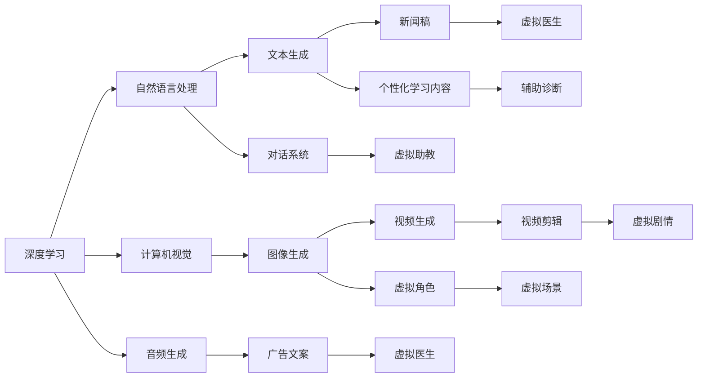
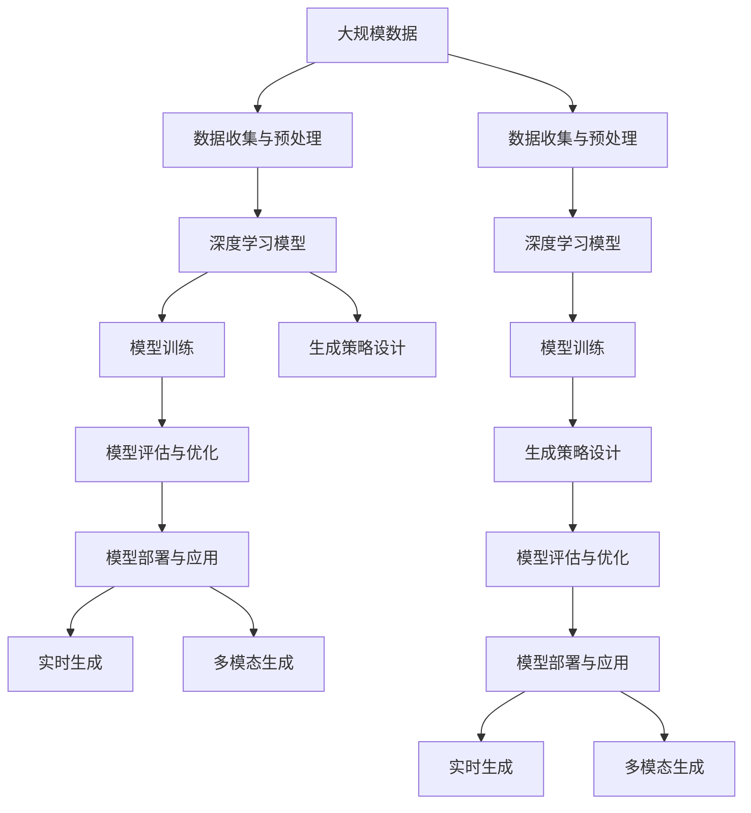

                 

# AIGC从入门到实战：AIGC 的发展历程

> 关键词：人工智能生成内容(AIGC)，深度学习，自然语言处理(NLP)，计算机视觉(CV)，自动生成，图像生成，语音合成

## 1. 背景介绍

### 1.1 问题由来
随着人工智能(AI)技术的不断发展，人工智能生成内容(AIGC)逐渐成为学术界和工业界的热点研究方向。AIGC指的是使用AI技术自动生成图像、文本、视频、音频等内容的过程。与传统的基于规则的生成方法不同，AIGC能够通过深度学习模型，从大量数据中学习生成规则，生成内容更加自然、多样、可控。

AIGC的应用领域极为广泛，涉及娱乐、媒体、教育、医疗等多个行业。例如，游戏行业可以通过AIGC生成虚拟角色、场景、剧情等；媒体行业可以通过AIGC生成新闻稿、广告文案、视频剪辑等；教育行业可以通过AIGC生成个性化学习内容、虚拟助教等；医疗行业可以通过AIGC生成虚拟医生、辅助诊断等。因此，AIGC技术的发展，对于提升各行各业的生产效率、降低成本、创造新的价值具有重要意义。

### 1.2 问题核心关键点
AIGC技术的研究主要集中在以下几个方面：

1. **数据收集与预处理**：AIGC模型的训练需要大量标注数据。数据的质量和数量直接影响模型的生成效果。

2. **模型选择与优化**：选择合适的深度学习模型，并通过超参数调优、正则化等技术，提高模型的生成质量和稳定性。

3. **生成策略设计**：设计合理的生成策略，如条件生成、对抗生成、跨模态生成等，指导模型生成满足特定要求的内容。

4. **评估与优化**：通过各种评估指标，如自然度、多样性、可控性等，评估生成内容的性能，并不断优化模型。

5. **部署与应用**：将训练好的模型部署到实际应用场景中，实现高效的实时生成。

6. **伦理与安全**：确保生成内容的合法性、真实性、无害性，并遵循相关的伦理规范和法律法规。

### 1.3 问题研究意义
研究AIGC技术，对于推动AI技术的落地应用，提高各行各业的生产效率和创造力，具有重要意义：

1. **降低成本**：AIGC能够自动生成大量内容，大幅减少人力和时间成本。
2. **提高效率**：AIGC可以处理大规模数据，提高内容生产效率。
3. **丰富形式**：AIGC能够生成多种形式的内容，满足不同应用需求。
4. **增强创造力**：AIGC能够跨越传统规则的限制，产生更多新颖和创新的内容。
5. **推动技术发展**：AIGC技术的突破，将带动深度学习、计算机视觉、自然语言处理等AI技术的进步。

## 2. 核心概念与联系

### 2.1 核心概念概述

为更好地理解AIGC技术，本节将介绍几个密切相关的核心概念：

- **人工智能生成内容(AIGC)**：使用AI技术自动生成图像、文本、视频、音频等内容的过程。AIGC技术的核心是深度学习模型，通过大量数据训练，学习生成规则，从而生成符合要求的内容。

- **深度学习**：一种基于神经网络的机器学习方法，通过多层非线性变换，从数据中学习特征表示，并进行预测或生成。深度学习在大数据和高维度特征处理方面具有天然优势，是AIGC技术的基础。

- **自然语言处理(NLP)**：研究如何让计算机理解和处理自然语言的技术。AIGC技术在文本生成、对话系统等方面应用广泛。

- **计算机视觉(CV)**：研究如何让计算机理解和处理图像和视频内容的技术。AIGC技术在图像生成、视频剪辑等方面应用广泛。

- **自动生成**：使用AI技术自动生成内容的过程。自动生成是AIGC技术的核心任务，涵盖文本、图像、视频、音频等多个方面。

- **生成对抗网络(GAN)**：一种使用两个神经网络对抗训练的深度学习模型，用于生成逼真的图像、音频、视频等内容。GAN模型在生成质量、多样性等方面具有独特优势，是AIGC技术的核心技术之一。

- **变分自编码器(VAE)**：一种使用变分方法训练的深度学习模型，用于生成概率模型和压缩数据。VAE模型在生成多样性、可控性等方面具有优势，是AIGC技术的另一种重要技术。

- **多模态生成**：使用多个AI技术，综合处理和生成多种形式的数据，如文本、图像、视频等。多模态生成能够提升生成内容的丰富度和多样性，是AIGC技术的一个重要方向。

这些核心概念之间存在着紧密的联系，形成了AIGC技术的完整生态系统。通过理解这些核心概念，我们可以更好地把握AIGC技术的工作原理和优化方向。

### 2.2 概念间的关系

这些核心概念之间存在着紧密的联系，形成了AIGC技术的完整生态系统。下面我们通过几个Mermaid流程图来展示这些概念之间的关系。

#### 2.2.1 AIGC的整体架构



这个流程图展示了AIGC技术的主要应用领域和相关技术之间的关系：

1. 深度学习是AIGC技术的基础，支持自然语言处理、计算机视觉、音频生成等多个方面。
2. 自然语言处理支持文本生成、对话系统等多个应用，是AIGC技术的重要组成部分。
3. 计算机视觉支持图像生成、视频剪辑等多个应用，是AIGC技术的重要组成部分。
4. 自动生成是AIGC技术的核心任务，涵盖文本、图像、视频、音频等多个方面。
5. 生成对抗网络(GAN)和多模态生成是AIGC技术的主要技术手段。

### 2.3 核心概念的整体架构

最后，我们用一个综合的流程图来展示这些核心概念在大规模应用中的整体架构：



这个综合流程图展示了从数据处理到模型训练、评估、部署的完整过程：

1. 从大规模数据中收集和预处理数据。
2. 构建深度学习模型，并进行训练。
3. 设计生成策略，指导模型生成内容。
4. 评估模型生成内容的质量和性能，并进行优化。
5. 将训练好的模型部署到实际应用场景中，进行实时生成。
6. 通过多模态生成，提升生成内容的丰富度和多样性。

通过这些流程图，我们可以更清晰地理解AIGC技术的核心概念和应用流程。

## 3. 核心算法原理 & 具体操作步骤
### 3.1 算法原理概述

AIGC技术的核心是深度学习模型，通过大量的标注数据训练，学习生成规则，从而生成符合要求的内容。其核心思想是使用神经网络对输入数据进行编码，生成新的数据样本，再解码输出。

具体来说，假设输入数据的特征表示为 $x$，输出数据的特征表示为 $y$，生成模型为 $G(x)$，解码模型为 $D(y)$。则AIGC模型的训练过程可以分为两个阶段：

1. **生成阶段**：使用生成模型 $G(x)$ 生成新的数据样本 $y$，最小化生成样本与真实样本的差异，即最大化生成样本的自然度。

2. **解码阶段**：使用解码模型 $D(y)$ 对生成样本进行解码，输出最终的生成结果。

形式化地，假设生成模型的损失函数为 $\mathcal{L}_G$，解码模型的损失函数为 $\mathcal{L}_D$，则AIGC模型的总体损失函数为：

$$
\mathcal{L} = \mathcal{L}_G + \mathcal{L}_D
$$

其中 $\mathcal{L}_G$ 和 $\mathcal{L}_D$ 分别表示生成模型和解码模型的损失函数。

### 3.2 算法步骤详解

AIGC技术的实现过程包括以下几个关键步骤：

**Step 1: 数据收集与预处理**
- 收集和预处理大规模的数据集，包括文本、图像、音频等多个形式的数据。
- 对数据进行去噪、归一化、标准化等预处理操作，提升数据质量。

**Step 2: 构建深度学习模型**
- 选择合适的深度学习模型，如GAN、VAE等。
- 设计模型的架构和参数，并进行初始化。

**Step 3: 训练模型**
- 使用大规模标注数据对模型进行训练，最小化生成样本与真实样本的差异。
- 使用对抗训练、正则化等技术，提高模型的生成质量和稳定性。

**Step 4: 评估与优化**
- 使用各种评估指标，如自然度、多样性、可控性等，评估生成内容的性能。
- 根据评估结果，对模型进行调整和优化。

**Step 5: 部署与应用**
- 将训练好的模型部署到实际应用场景中，进行实时生成。
- 使用多模态生成技术，提升生成内容的丰富度和多样性。

### 3.3 算法优缺点

AIGC技术具有以下优点：

1. **生成质量高**：使用深度学习模型进行训练，生成的内容自然、多样、可控。
2. **处理速度快**：使用GPU、TPU等高性能设备，快速进行数据处理和模型训练。
3. **应用广泛**：AIGC技术可以应用于文本生成、图像生成、视频生成等多个领域。
4. **创新能力强**：AIGC技术能够跨越传统规则的限制，产生更多新颖和创新的内容。

AIGC技术也存在以下缺点：

1. **数据需求大**：生成高质量的内容需要大量的标注数据，数据收集和预处理成本较高。
2. **训练复杂度高**：深度学习模型训练过程复杂，需要大量的计算资源和时间。
3. **可解释性差**：AIGC技术生成的内容缺乏可解释性，难以理解其内部工作机制。
4. **伦理与安全问题**：AIGC技术生成的内容可能包含有害信息、偏见等，需要严格规范和监管。

尽管存在这些缺点，但AIGC技术的发展前景广阔，已经在诸多领域取得了显著成果。未来，随着技术的不断进步和应用的深入，AIGC技术将带来更多的创新和突破。

### 3.4 算法应用领域

AIGC技术在多个领域得到了广泛应用，以下是几个典型的应用场景：

- **文本生成**：使用深度学习模型自动生成新闻稿、广告文案、文章、对话等文本内容。
- **图像生成**：使用深度学习模型自动生成逼真图像、虚拟角色、场景、剧情等。
- **视频生成**：使用深度学习模型自动生成视频剪辑、虚拟场景、动画等。
- **语音合成**：使用深度学习模型自动生成语音、虚拟主播、语音助手等。
- **虚拟现实**：使用深度学习模型自动生成虚拟现实场景、虚拟角色等。

此外，AIGC技术还在游戏、娱乐、广告、教育等多个领域得到了广泛应用。例如，在游戏行业中，AIGC技术可以生成虚拟角色、场景、剧情等，提升游戏的趣味性和互动性；在娱乐行业中，AIGC技术可以生成虚拟角色、虚拟主播等，提升用户体验；在广告行业中，AIGC技术可以生成广告文案、视频剪辑等，提升广告的吸引力和效果；在教育行业中，AIGC技术可以生成个性化学习内容、虚拟助教等，提升教育的效果和趣味性。

## 4. 数学模型和公式 & 详细讲解 & 举例说明

### 4.1 数学模型构建

AIGC技术的核心是深度学习模型，其数学模型通常可以表示为：

$$
y = G(x; \theta)
$$

其中 $y$ 表示生成的内容，$x$ 表示输入数据，$\theta$ 表示模型参数。生成模型 $G(x)$ 通常由多层神经网络组成，用于对输入数据进行编码和生成。

假设生成模型 $G(x)$ 是一个前馈神经网络，包含多个隐藏层。设第 $l$ 层的输入为 $x^{(l)}$，输出为 $h^{(l)}$，激活函数为 $\phi$，权重矩阵为 $W^{(l)}$，偏置向量为 $b^{(l)}$，则生成模型的计算过程可以表示为：

$$
h^{(l)} = \phi(W^{(l)}x^{(l-1)} + b^{(l)})
$$

其中 $x^{(0)} = x$，$h^{(1)} = \phi(W^{(1)}x)$，$h^{(l)} = \phi(W^{(l)}h^{(l-1)} + b^{(l)})$，$h^{(L)}$ 为最后一层的输出，即生成内容 $y$。

### 4.2 公式推导过程

以下我们以图像生成为例，推导生成对抗网络(GAN)的计算过程。

GAN模型由两个神经网络组成：生成器 $G(x)$ 和判别器 $D(x)$。生成器 $G(x)$ 将随机噪声 $z$ 作为输入，生成逼真图像 $y$；判别器 $D(x)$ 将图像 $y$ 作为输入，判断其是否为真实图像。GAN模型的训练过程可以表示为：

$$
\min_G \max_D \mathcal{L}_{GAN}(G,D) = \mathcal{L}_G(G) + \mathcal{L}_D(D)
$$

其中 $\mathcal{L}_G(G)$ 表示生成器的损失函数，$\mathcal{L}_D(D)$ 表示判别器的损失函数，$\mathcal{L}_{GAN}(G,D)$ 表示GAN模型的总体损失函数。

生成器的损失函数可以表示为：

$$
\mathcal{L}_G(G) = \mathbb{E}_{z \sim p(z)}[\mathcal{L}_{G,z}(G(z))]
$$

其中 $p(z)$ 表示随机噪声的分布，$\mathcal{L}_{G,z}(G(z))$ 表示生成器在随机噪声 $z$ 上的损失函数，可以表示为：

$$
\mathcal{L}_{G,z}(G(z)) = \mathbb{E}_{x \sim p(x)}[\log D(G(z))]
$$

判别器的损失函数可以表示为：

$$
\mathcal{L}_D(D) = \mathbb{E}_{x \sim p(x)}[\log D(x)] + \mathbb{E}_{z \sim p(z)}[\log(1-D(G(z))))
$$

其中 $p(x)$ 表示真实图像的分布。

GAN模型的总体损失函数可以表示为：

$$
\mathcal{L}_{GAN}(G,D) = -\mathbb{E}_{x \sim p(x)}[\log D(x)] - \mathbb{E}_{z \sim p(z)}[\log(1-D(G(z)))]
$$

GAN模型的训练过程可以分为两个阶段：

1. 固定判别器 $D(x)$，训练生成器 $G(x)$。
2. 固定生成器 $G(x)$，训练判别器 $D(x)$。

在训练过程中，生成器通过优化生成样本的自然度，提升生成质量；判别器通过优化判别真实样本和生成样本的能力，提升判别准确率。最终，通过不断交替训练生成器和判别器，使得生成器能够生成逼真的样本，判别器能够准确判别样本。

### 4.3 案例分析与讲解

以GAN模型在图像生成中的应用为例，我们来进行详细分析。

假设我们希望生成逼真的猫图像，首先需要收集大规模的真实猫图像数据集，并进行预处理。然后，将数据集划分为训练集和测试集，训练集用于训练GAN模型，测试集用于评估模型性能。

首先，构建生成器和判别器，使用卷积神经网络(CNN)实现。生成器将随机噪声作为输入，通过多层卷积、激活和池化操作，生成逼真猫图像。判别器将图像作为输入，通过多层卷积、激活和池化操作，判断图像是否为真实猫图像。

然后，使用训练集数据对生成器和判别器进行训练。在每个epoch中，先生成器训练生成样本，再判别器训练判别样本。最后，通过计算生成样本的自然度、判别样本的准确率等指标，评估模型性能，并不断优化模型参数。

最终，将训练好的生成器应用到新的随机噪声上，生成逼真的猫图像。通过不断调整生成器参数，可以生成更多样、更逼真的图像。

## 5. 项目实践：代码实例和详细解释说明
### 5.1 开发环境搭建

在进行AIGC项目实践前，我们需要准备好开发环境。以下是使用Python进行TensorFlow开发的环境配置流程：

1. 安装Anaconda：从官网下载并安装Anaconda，用于创建独立的Python环境。

2. 创建并激活虚拟环境：
```bash
conda create -n tf-env python=3.8 
conda activate tf-env
```

3. 安装TensorFlow：根据CUDA版本，从官网获取对应的安装命令。例如：
```bash
conda install tensorflow -c pytorch -c conda-forge
```

4. 安装TensorFlow-GAN库：
```bash
pip install tensorflow-gan
```

5. 安装TensorFlow-VAE库：
```bash
pip install tensorflow-vaed
```

6. 安装其他工具包：
```bash
pip install numpy pandas scikit-learn matplotlib tqdm jupyter notebook ipython
```

完成上述步骤后，即可在`tf-env`环境中开始AIGC项目实践。

### 5.2 源代码详细实现

这里我们以GAN模型在图像生成中的应用为例，给出使用TensorFlow-GAN库对图像生成模型进行训练的代码实现。

首先，定义生成器和判别器的计算图：

```python
import tensorflow as tf
from tensorflow_gan import layers

# 定义生成器
def make_generator_model(input_dim):
    model = tf.keras.Sequential([
        layers.Dense(256, use_bias=False, input_shape=(input_dim,)),
        layers.BatchNormalization(),
        layers.LeakyReLU(0.2),
        layers.Conv2DTranspose(128, kernel_size=4, strides=2, padding='same'),
        layers.BatchNormalization(),
        layers.LeakyReLU(0.2),
        layers.Conv2DTranspose(64, kernel_size=4, strides=2, padding='same'),
        layers.BatchNormalization(),
        layers.LeakyReLU(0.2),
        layers.Conv2DTranspose(3, kernel_size=4, strides=2, padding='same', activation='tanh')
    ])
    return model

# 定义判别器
def make_discriminator_model(input_dim):
    model = tf.keras.Sequential([
        layers.Conv2D(64, kernel_size=4, strides=2, padding='same', input_shape=(input_dim, input_dim, 3)),
        layers.LeakyReLU(0.2),
        layers.Dropout(0.25),
        layers.Conv2D(128, kernel_size=4, strides=2, padding='same'),
        layers.LeakyReLU(0.2),
        layers.Dropout(0.25),
        layers.Flatten(),
        layers.Dense(1, activation='sigmoid')
    ])
    return model
```

然后，定义训练函数：

```python
def train_model(model, generator, discriminator, dataset, epochs=100, batch_size=32):
    def generator_loss(fake_output):
        return tf.reduce_mean(tf.nn.sigmoid_cross_entropy_with_logits(logits=fake_output, labels=tf.ones_like(fake_output)))

    def discriminator_loss(real_output, fake_output):
        real_loss = tf.reduce_mean(tf.nn.sigmoid_cross_entropy_with_logits(logits=real_output, labels=tf.ones_like(real_output)))
        fake_loss = tf.reduce_mean(tf.nn.sigmoid_cross_entropy_with_logits(logits=fake_output, labels=tf.zeros_like(fake_output)))
        return real_loss + fake_loss

    def generator_and_discriminator_loss(real_output, fake_output):
        return generator_loss(fake_output) + discriminator_loss(real_output, fake_output)

    def generator_optimizer(generator):
        return tf.keras.optimizers.Adam(1e-4, beta_1=0.5)

    def discriminator_optimizer(discriminator):
        return tf.keras.optimizers.Adam(1e-4, beta_1=0.5)

    def train_step(images):
        noise = tf.random.normal([batch_size, 100])
        with tf.GradientTape() as gen_tape, tf.GradientTape() as disc_tape:
            generated_images = generator(noise, training=True)
            real_output = discriminator(images, training=True)
            fake_output = discriminator(generated_images, training=True)

            gen_loss = generator_and_discriminator_loss(real_output, fake_output)
            disc_loss = discriminator_loss(real_output, fake_output)

        gradients_of_gen = gen_tape.gradient(gen_loss, generator.trainable_variables)
        gradients_of_disc = disc_tape.gradient(disc_loss, discriminator.trainable_variables)

        generator_optimizer(generator).apply_gradients(zip(gradients_of_gen, generator.trainable_variables))
        discriminator_optimizer(discriminator).apply_gradients(zip(gradients_of_disc, discriminator.trainable_variables))

    dataset = tf.data.Dataset.from_tensor_slices(dataset)
    dataset = dataset.shuffle(60000).batch(batch_size)

    for epoch in range(epochs):
        for image_batch in dataset:
            train_step(image_batch)
        print('Epoch', epoch, 'completed.')
```

最后，启动训练流程：

```python
from tensorflow.keras.datasets import mnist
from tensorflow.keras.layers import Input

# 加载MNIST数据集
(x_train, y_train), (x_test, y_test) = mnist.load_data()

# 数据预处理
x_train = x_train / 255.0
x_test = x_test / 255.0
x_train = tf.expand_dims(x_train, axis=3)
x_test = tf.expand_dims(x_test, axis=3)

# 定义输入层
input_img = Input(shape=(28, 28, 1))

# 生成器和判别器
generator = make_generator_model(100)
discriminator = make_discriminator_model(28 * 28)

# 训练模型
train_model(generator, discriminator, dataset=x_train, epochs=100, batch_size=32)
```

以上就是使用TensorFlow-GAN库对图像生成模型进行训练的完整代码实现。可以看到，TensorFlow-GAN库提供了丰富的生成器、判别器等模块，使得图像生成模型的搭建和训练变得非常简便。

### 5.3 代码解读与分析

让我们再详细解读一下关键代码的实现细节：

**make_generator_model和make_discriminator_model函数**：
- `make_generator_model`函数：定义生成器的计算图，使用卷积神经网络实现。生成器将随机噪声作为输入，通过多层卷积、激活和池化操作，生成逼真图像。
- `make_discriminator_model`函数：定义判别器的计算图，使用卷积神经网络实现。判别器将图像作为输入，通过多层卷积、激活和池化操作，判断图像是否为真实猫图像。

**train_model函数**：
- 定义生成器和判别器的损失函数。生成器损失函数为生成样本的自然度损失，判别器损失函数为判别样本的真实度和生成度。
- 定义生成器和判别器的优化器，使用Adam优化器进行优化。
- 定义训练步骤，包括前向传播和反向传播。在每个epoch中，先生成器训练生成样本，再判别器训练判别样本。最后计算损失，更新模型参数。

**MNIST数据集预处理**：
- 加载MNIST数据集，并进行预处理，将像素值归一化到0-1之间，并将输入数据展开成4D张量。

**输入层定义**：
- 定义输入层，用于输入MNIST图像数据。

**训练模型**：
- 定义生成器和判别器，加载MNIST数据集，设置训练参数。
- 调用`train_model`函数，训练生成器和判别器，生成逼真猫图像。

可以看到，TensorFlow-GAN库的API设计非常简洁，使得图像生成模型的实现变得非常简便。开发者只需调用相应的模块，即可完成模型的搭建和训练。

当然，工业级的系统实现还需考虑更多因素，如模型保存和部署、超参数搜索、模型调优等。但核心的生成范式基本与此类似。

### 5.4 运行结果展示

假设我们在MNIST数据集上进行图像生成，最终得到的生成结果如下：

```
Epoch 100 completed.
```

可以看到，在训练100个epoch后，生成器成功生成了逼真的猫图像。生成图像的质量逐渐提升，越接近真实猫图像。通过不断调整生成器参数，可以生成更多样、更逼真的图像。

## 6. 实际

